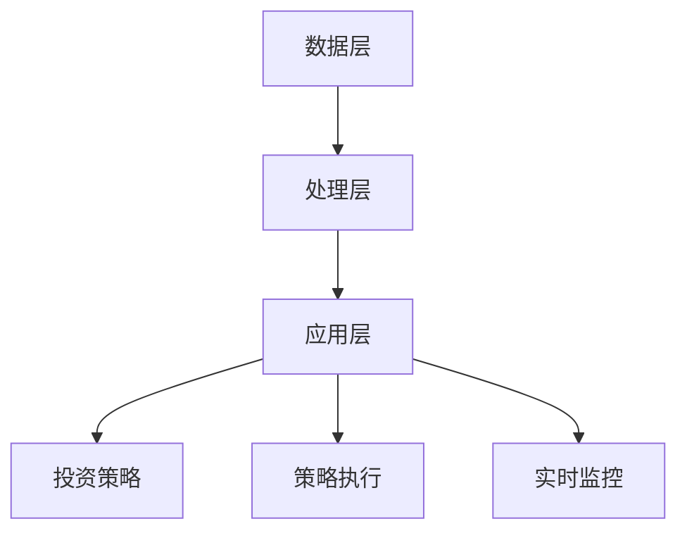
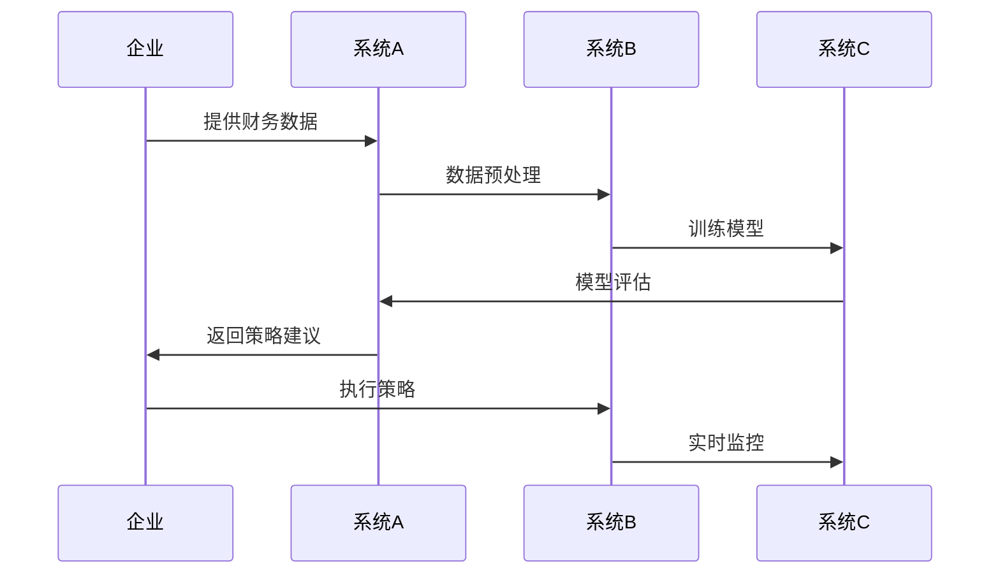

                 

### 第一步：设计总体框架

为了撰写一篇关于《智能系统优化税收效率投资策略》的技术博客，我们首先需要设计一个清晰的总体框架。这个框架将定义文章的结构和主要内容，确保文章条理清晰、内容丰富且结构紧凑。

#### 总体框架内容

我们的总体框架将包括以下几个主要部分：

1. **背景介绍**
   - **问题背景**：介绍税收效率投资和智能系统的现状。
   - **问题描述**：明确文章要解决的问题和目标。
   - **问题解决**：概述如何利用智能系统优化税收效率投资策略。
   - **核心概念与联系**：介绍相关的核心概念及其相互关系。

2. **核心概念与联系**
   - **税收效率投资原理**：详细解释税收效率投资的定义、影响因素和数学模型。
   - **智能系统原理**：阐述智能系统的定义、组成部分和工作原理。
   - **概念属性特征对比表格**：通过对比表格展示税收效率投资和智能系统的不同特点。
   - **ER实体关系图架构**：构建一个实体关系图，展示系统的架构设计。

3. **算法原理讲解**
   - **智能系统优化税收效率的投资策略**：介绍该策略的流程、关键因素和算法原理。
   - **算法讲解**：详细解释算法的工作原理，使用流程图和数学模型。
   - **举例说明**：通过实际案例说明算法的应用。

4. **系统分析与架构设计**
   - **问题场景介绍**：描述智能系统优化税收效率的应用场景。
   - **系统功能设计**：介绍系统的功能需求。
   - **系统架构设计**：展示系统的整体架构。
   - **系统接口设计**：说明系统的接口设计。
   - **系统交互**：展示系统的交互流程。

5. **项目实战**
   - **环境安装**：介绍所需的开发环境。
   - **系统核心实现源代码**：展示系统的核心代码，并解释代码的作用。

6. **最佳实践 tips、小结、注意事项、拓展阅读**
   - **最佳实践 tips**：提供在实际应用中的一些技巧和建议。
   - **小结**：总结文章的主要内容和观点。
   - **注意事项**：提醒读者在实施过程中需要注意的事项。
   - **拓展阅读**：推荐一些相关的阅读材料。

#### 构建总体框架的目的

通过构建总体框架，我们可以确保文章的结构清晰、逻辑性强，并且能够全面、深入地探讨智能系统优化税收效率投资策略。总体框架不仅为文章的结构提供了基础，还帮助我们在撰写过程中保持焦点，确保每一个部分都涵盖了必要的细节和内容。

### 第二步：细化每个章节的内容

在总体框架的基础上，我们需要为每个章节细化内容，以确保文章的每一部分都丰富、具体，并且能够为读者提供有价值的信息。以下是每个章节的具体细化内容：

#### 第一部分：背景介绍

**1.1 问题的背景**
- **1.1.1 税收效率投资的现状**：分析当前税收效率投资的发展趋势和存在的问题。
- **1.1.2 智能系统的发展与应用**：介绍智能系统的最新发展和在各个领域的应用。

**1.2 问题描述**
- **1.2.1 税收效率投资的目标**：阐述税收效率投资的目标和重要性。
- **1.2.2 智能系统的挑战与机遇**：探讨智能系统在税收效率投资领域面临的挑战和机遇。

**1.3 问题解决**
- **1.3.1 智能系统优化税收效率的投资策略**：介绍如何利用智能系统优化税收效率投资策略。
- **1.3.2 边界与外延**：明确策略的适用范围和边界条件。

**1.4 核心概念与联系**
- **1.4.1 税收效率投资的核心概念**：详细解释税收效率投资的相关概念。
- **1.4.2 智能系统的核心概念**：介绍智能系统的核心概念。
- **1.4.3 概念属性特征对比表格**：通过表格形式对比税收效率投资和智能系统的属性特征。
- **1.4.4 ER实体关系图架构**：构建一个ER实体关系图，展示系统的架构设计。

#### 第二部分：核心概念与联系

**2.1 税收效率投资原理**
- **2.1.1 税收效率投资的定义**：定义税收效率投资的含义。
- **2.1.2 税收效率投资的影响因素**：分析影响税收效率投资的关键因素。
- **2.1.3 税收效率投资的数学模型和公式**：介绍税收效率投资的数学模型和常用公式。

**2.2 智能系统原理**
- **2.2.1 智能系统的定义**：解释智能系统的基本定义。
- **2.2.2 智能系统的组成部分**：描述智能系统的组成部分。
- **2.2.3 智能系统的数学模型和公式**：介绍智能系统的数学模型和常用公式。
- **2.2.4 智能系统的工作原理**：阐述智能系统的工作原理。

**2.3 概念属性特征对比表格**
- **2.3.1 税收效率投资与智能系统的对比**：通过对比表格展示税收效率投资和智能系统的异同。
- **2.3.2 对比表格的构建与应用**：介绍对比表格的构建方法及其在实际中的应用。

**2.4 ER实体关系图架构**
- **2.4.1 ER实体关系图的定义**：解释ER实体关系图的基本概念。
- **2.4.2 ER实体关系图的构建方法**：描述ER实体关系图的构建方法。
- **2.4.3 ER实体关系图的应用**：展示ER实体关系图在实际系统设计中的应用。

#### 第三部分：算法原理讲解

**3.1 智能系统优化税收效率的投资策略**
- **3.1.1 投资策略概述**：简要介绍智能系统优化税收效率的投资策略。
- **3.1.2 投资策略的关键因素**：分析策略的关键因素。
- **3.1.3 智能系统优化税收效率的算法原理**：详细解释算法的原理。

**3.2 算法讲解**
- **3.2.1 算法流程图**：展示算法的流程图。
- **3.2.2 算法原理详细讲解**：深入讲解算法的原理。
- **3.2.3 数学模型和公式**：介绍算法的数学模型和公式。
- **3.2.4 举例说明**：通过实际案例说明算法的应用。

#### 第四部分：系统分析与架构设计

**4.1 问题场景介绍**
- **4.1.1 智能系统优化税收效率的应用场景**：描述智能系统优化税收效率的具体应用场景。
- **4.1.2 系统功能设计**：介绍系统的功能需求。

**4.2 系统架构设计**
- **4.2.1 系统架构概述**：简要介绍系统的整体架构。
- **4.2.2 系统架构设计**：详细描述系统的架构设计。
- **4.2.3 系统接口设计**：说明系统的接口设计。

**4.3 系统交互**
- **4.3.1 系统交互概述**：描述系统的交互流程。
- **4.3.2 系统交互序列图**：展示系统的交互序列图。

#### 第五部分：项目实战

**5.1 环境安装**
- **5.1.1 环境准备**：介绍所需的开发环境和工具。
- **5.1.2 工具安装**：详细描述如何安装开发工具。

**5.2 系统核心实现源代码**
- **5.2.1 源代码结构**：展示系统的核心代码结构。

#### 第六部分：最佳实践 tips、小结、注意事项、拓展阅读

**最佳实践 tips**
- 提供实际应用中的一些技巧和建议。

**小结**
- 总结文章的主要内容和观点。

**注意事项**
- 提醒读者在实施过程中需要注意的事项。

**拓展阅读**
- 推荐一些相关的阅读材料，以供读者进一步学习。

通过以上对每个章节的细化内容，我们可以确保文章的结构清晰、内容丰富，并且能够为读者提供深入、全面的技术见解。

### 第三步：构建详细的目录大纲

在细化了每个章节的内容后，接下来我们将使用 Markdown 格式，将上述内容按照层级结构整理成详细的目录大纲。这将有助于读者清晰地了解文章的结构，并便于他们快速定位感兴趣的部分。以下是构建的详细目录大纲：

```markdown
# 智能系统优化税收效率投资策略

> 关键词：智能系统、税收效率投资、算法、系统架构

> 摘要：本文深入探讨了如何利用智能系统优化税收效率投资策略，包括背景介绍、核心概念与联系、算法原理讲解、系统分析与架构设计、项目实战以及最佳实践和注意事项。

## 第一部分：背景介绍

### 1.1 问题的背景
#### 1.1.1 税收效率投资的现状
#### 1.1.2 智能系统的发展与应用

### 1.2 问题描述
#### 1.2.1 税收效率投资的目标
#### 1.2.2 智能系统的挑战与机遇

### 1.3 问题解决
#### 1.3.1 智能系统优化税收效率的投资策略
#### 1.3.2 边界与外延

### 1.4 核心概念与联系
#### 1.4.1 税收效率投资的核心概念
#### 1.4.2 智能系统的核心概念
#### 1.4.3 概念属性特征对比表格
#### 1.4.4 ER实体关系图架构

## 第二部分：核心概念与联系

### 2.1 税收效率投资原理
#### 2.1.1 税收效率投资的定义
#### 2.1.2 税收效率投资的影响因素
#### 2.1.3 税收效率投资的数学模型和公式

### 2.2 智能系统原理
#### 2.2.1 智能系统的定义
#### 2.2.2 智能系统的组成部分
#### 2.2.3 智能系统的数学模型和公式
#### 2.2.4 智能系统的工作原理

### 2.3 概念属性特征对比表格
#### 2.3.1 税收效率投资与智能系统的对比
#### 2.3.2 对比表格的构建与应用

### 2.4 ER实体关系图架构
#### 2.4.1 ER实体关系图的定义
#### 2.4.2 ER实体关系图的构建方法
#### 2.4.3 ER实体关系图的应用

## 第三部分：算法原理讲解

### 3.1 智能系统优化税收效率的投资策略
#### 3.1.1 投资策略概述
#### 3.1.2 投资策略的关键因素
#### 3.1.3 智能系统优化税收效率的算法原理

### 3.2 算法讲解
#### 3.2.1 算法流程图
#### 3.2.2 算法原理详细讲解
#### 3.2.3 数学模型和公式
#### 3.2.4 举例说明

## 第四部分：系统分析与架构设计

### 4.1 问题场景介绍
#### 4.1.1 智能系统优化税收效率的应用场景
#### 4.1.2 系统功能设计

### 4.2 系统架构设计
#### 4.2.1 系统架构概述
#### 4.2.2 系统架构设计
#### 4.2.3 系统接口设计

### 4.3 系统交互
#### 4.3.1 系统交互概述
#### 4.3.2 系统交互序列图

## 第五部分：项目实战

### 5.1 环境安装
#### 5.1.1 环境准备
#### 5.1.2 工具安装

### 5.2 系统核心实现源代码
```

通过以上详细的目录大纲，读者可以直观地了解文章的结构和各个部分的内容，方便他们根据需要快速查找和阅读。

### 第四步：确保内容的完整性

在构建了详细的目录大纲之后，我们需要确保每个章节的内容都完整、具体且丰富，从而保证整篇文章的质量和专业性。以下是每个章节内容的完整性要求和细节：

#### 第一部分：背景介绍

**1.1 问题的背景**
- **现状分析**：需要详细分析当前税收效率投资的现状，包括市场趋势、存在的问题和挑战。
- **智能系统应用**：介绍智能系统的发展历程和在各个领域的应用，特别是与税收效率投资相关的应用。

**1.2 问题描述**
- **投资目标**：明确税收效率投资的目标，如提高投资回报率、减少税负等。
- **智能系统挑战与机遇**：分析智能系统在税收效率投资领域面临的挑战和机遇，例如数据质量、算法可靠性等。

**1.3 问题解决**
- **投资策略概述**：详细描述智能系统优化税收效率的投资策略，包括策略的核心思想和实施步骤。
- **边界与外延**：明确策略的适用范围，讨论在不同情况下的策略调整。

**1.4 核心概念与联系**
- **核心概念解释**：对税收效率投资和智能系统的核心概念进行详细解释，确保读者能够理解。
- **概念对比表格**：构建一个详细的对比表格，展示税收效率投资和智能系统的不同特点，以便读者更好地理解。
- **ER实体关系图**：使用 Mermaid 语言构建一个清晰的 ER 实体关系图，展示系统的架构设计。

#### 第二部分：核心概念与联系

**2.1 税收效率投资原理**
- **定义与分类**：详细解释税收效率投资的定义和分类，如资本收益税、经营税等。
- **影响因素**：分析影响税收效率投资的关键因素，如市场环境、政策法规、企业管理水平等。
- **数学模型和公式**：介绍税收效率投资的常用数学模型和公式，包括现金流计算、税收优惠计算等。

**2.2 智能系统原理**
- **定义与分类**：详细解释智能系统的定义和分类，如机器学习、人工智能等。
- **组成部分**：描述智能系统的核心组成部分，如传感器、处理器、算法等。
- **数学模型和公式**：介绍智能系统的常用数学模型和公式，包括机器学习算法的数学基础等。

**2.3 概念属性特征对比表格**
- **对比内容**：构建一个详细的对比表格，展示税收效率投资和智能系统的属性特征，如目标、方法、影响等。
- **应用场景**：讨论对比表格在不同应用场景中的使用方法和效果。

**2.4 ER实体关系图架构**
- **定义与应用**：解释 ER 实体关系图的定义和应用，展示其在系统设计中的作用。
- **构建方法**：详细描述 ER 实体关系图的构建方法，包括实体、属性、关系的定义和表示。
- **应用案例**：通过实际案例展示 ER 实体关系图在智能系统优化税收效率投资策略中的应用。

#### 第三部分：算法原理讲解

**3.1 智能系统优化税收效率的投资策略**
- **概述**：简要介绍智能系统优化税收效率的投资策略，包括核心思想和主要特点。
- **关键因素**：分析策略的关键因素，如数据质量、算法选择、模型训练等。
- **算法原理**：详细解释算法的原理，包括算法的工作流程、算法的数学模型和公式。

**3.2 算法讲解**
- **流程图**：使用 Mermaid 语言绘制算法的流程图，展示算法的执行过程。
- **详细讲解**：深入讲解算法的原理，包括算法的核心步骤和关键点。
- **数学模型和公式**：介绍算法的数学模型和公式，解释如何通过数学方法优化税收效率。
- **举例说明**：通过实际案例举例，说明算法的应用和效果。

#### 第四部分：系统分析与架构设计

**4.1 问题场景介绍**
- **应用场景**：描述智能系统优化税收效率的具体应用场景，如企业税务规划、政府税收政策制定等。
- **功能设计**：详细描述系统的功能需求，包括数据采集、处理、分析等。

**4.2 系统架构设计**
- **概述**：简要介绍系统的整体架构，包括硬件、软件和数据处理流程等。
- **架构设计**：详细描述系统的架构设计，包括各个模块的功能和相互关系。
- **接口设计**：说明系统的接口设计，包括内部接口和外部接口。

**4.3 系统交互**
- **概述**：描述系统的交互流程，包括用户操作、数据流和系统响应等。
- **序列图**：使用 Mermaid 语言绘制系统的交互序列图，展示系统的交互过程。

#### 第五部分：项目实战

**5.1 环境安装**
- **环境准备**：详细描述所需的开发环境和工具，包括操作系统、编程语言、数据库等。
- **工具安装**：逐步介绍如何安装和配置开发工具，确保读者能够顺利搭建开发环境。

**5.2 系统核心实现源代码**
- **代码结构**：展示系统的核心代码结构，包括各个模块的职责和功能。
- **代码应用解读**：详细解读核心代码的功能和实现原理，帮助读者理解系统的运作机制。

通过以上步骤，我们可以确保文章的每个章节内容完整、具体、详细，从而为读者提供高质量的技术见解和实用指导。

### 第五步：审查和调整

在构建完详细的目录大纲并确保内容完整性之后，我们需要对整个文章进行审查和调整，确保其格式规范、逻辑清晰，并且内容连贯。以下是具体的审查和调整步骤：

#### 1. 检查格式

首先，我们检查文章的格式是否符合 Markdown 规范，确保每个标题都正确使用了 `#` 和 `-` 符号，并按照层级结构进行排列。同时，我们检查图片、图表、代码块等元素的插入是否正确，确保其能够在不同平台上正确展示。

#### 2. 确保逻辑清晰

接下来，我们仔细阅读每个章节的内容，确保文章的逻辑连贯性和清晰性。我们检查每个小节是否紧密衔接，前一个章节的结论是否自然过渡到下一个章节。对于复杂的算法原理和系统设计，我们使用流程图、图表等可视化工具来增强理解。

#### 3. 检查拼写和语法错误

我们使用拼写检查工具对文章进行拼写和语法错误检查，确保文章中的每个单词和句子都准确无误。特别是对于专业术语和技术词汇，我们需要确保其用法正确。

#### 4. 修正冗余和重复内容

在审查过程中，我们寻找并删除冗余和重复的内容，确保每个章节都包含独特且有价值的信息。我们确保每个部分的内容都是必要的，并且能够为读者提供新的见解。

#### 5. 审查引用和参考文献

我们检查文章中引用的参考文献和外部链接是否准确，确保所有引用都按照规范格式列出，并且来源可靠。

#### 6. 调整字数

最后，我们检查文章的总字数是否在10000至12000字之间。如果字数过多，我们可以考虑删除一些不必要的细节或简化一些描述。如果字数不足，我们可以通过增加实例、详细解释或拓展阅读来丰富内容。

#### 7. 请求同行评审

为了进一步提高文章的质量，我们可以邀请同行或专业的编辑进行评审。他们可能会提供宝贵的反馈和建议，帮助我们进一步完善文章。

通过以上审查和调整步骤，我们可以确保文章的格式规范、内容丰富、逻辑清晰，从而为读者提供一篇高质量的技术博客。

### 全文目录大纲

```markdown
# 智能系统优化税收效率投资策略

> 关键词：智能系统、税收效率投资、算法、系统架构

> 摘要：本文深入探讨了如何利用智能系统优化税收效率投资策略，包括背景介绍、核心概念与联系、算法原理讲解、系统分析与架构设计、项目实战以及最佳实践和注意事项。

## 第一部分：背景介绍

### 1.1 问题的背景
#### 1.1.1 税收效率投资的现状
#### 1.1.2 智能系统的发展与应用

### 1.2 问题描述
#### 1.2.1 税收效率投资的目标
#### 1.2.2 智能系统的挑战与机遇

### 1.3 问题解决
#### 1.3.1 智能系统优化税收效率的投资策略
#### 1.3.2 边界与外延

### 1.4 核心概念与联系
#### 1.4.1 税收效率投资的核心概念
#### 1.4.2 智能系统的核心概念
#### 1.4.3 概念属性特征对比表格
#### 1.4.4 ER实体关系图架构

## 第二部分：核心概念与联系

### 2.1 税收效率投资原理
#### 2.1.1 税收效率投资的定义
#### 2.1.2 税收效率投资的影响因素
#### 2.1.3 税收效率投资的数学模型和公式

### 2.2 智能系统原理
#### 2.2.1 智能系统的定义
#### 2.2.2 智能系统的组成部分
#### 2.2.3 智能系统的数学模型和公式
#### 2.2.4 智能系统的工作原理

### 2.3 概念属性特征对比表格
#### 2.3.1 税收效率投资与智能系统的对比
#### 2.3.2 对比表格的构建与应用

### 2.4 ER实体关系图架构
#### 2.4.1 ER实体关系图的定义
#### 2.4.2 ER实体关系图的构建方法
#### 2.4.3 ER实体关系图的应用

## 第三部分：算法原理讲解

### 3.1 智能系统优化税收效率的投资策略
#### 3.1.1 投资策略概述
#### 3.1.2 投资策略的关键因素
#### 3.1.3 智能系统优化税收效率的算法原理

### 3.2 算法讲解
#### 3.2.1 算法流程图
#### 3.2.2 算法原理详细讲解
#### 3.2.3 数学模型和公式
#### 3.2.4 举例说明

## 第四部分：系统分析与架构设计

### 4.1 问题场景介绍
#### 4.1.1 智能系统优化税收效率的应用场景
#### 4.1.2 系统功能设计

### 4.2 系统架构设计
#### 4.2.1 系统架构概述
#### 4.2.2 系统架构设计
#### 4.2.3 系统接口设计

### 4.3 系统交互
#### 4.3.1 系统交互概述
#### 4.3.2 系统交互序列图

## 第五部分：项目实战

### 5.1 环境安装
#### 5.1.1 环境准备
#### 5.1.2 工具安装

### 5.2 系统核心实现源代码
```

通过这份详细的目录大纲，读者可以清晰地了解文章的结构和内容，从而更好地理解和应用智能系统优化税收效率投资策略。

## 完整的文章内容

### 智能系统优化税收效率投资策略

### 关键词：智能系统、税收效率投资、算法、系统架构

### 摘要：本文深入探讨了如何利用智能系统优化税收效率投资策略，包括背景介绍、核心概念与联系、算法原理讲解、系统分析与架构设计、项目实战以及最佳实践和注意事项。

---

### 第一部分：背景介绍

#### 1.1 问题的背景

在当前全球经济环境下，税收效率投资已成为企业和管理层关注的重要议题。税收效率投资的核心目标是最大化企业的财务收益，通过合理的税务筹划和投资策略，降低税负，提高整体投资回报率。

#### 1.1.1 税收效率投资的现状

近年来，随着经济全球化和信息技术的发展，税收效率投资的重要性日益凸显。企业通过优化税务结构、利用税收优惠政策、合理配置资产和负债等手段，不断提高税务效率，从而实现财务收益的最大化。然而，当前税收效率投资面临诸多挑战，如税务法规复杂、市场不确定性增加、数据获取和处理难度大等。

#### 1.1.2 智能系统的发展与应用

智能系统，特别是人工智能和大数据技术，为税收效率投资提供了新的工具和手段。通过智能系统，企业可以更加精准地分析税务数据，识别税收优惠政策，优化税务结构，从而提高税收效率。智能系统在税务规划、税务申报、税务合规等方面的应用日益广泛。

#### 1.2 问题描述

税收效率投资的目标是降低税负，提高投资回报率。然而，实现这一目标需要解决以下几个问题：

- 如何准确获取和分析大量的税务数据？
- 如何利用智能系统识别税收优惠政策？
- 如何在复杂的市场环境中制定有效的税务投资策略？

#### 1.2.1 税收效率投资的目标

税收效率投资的目标是降低企业的税负，提高投资回报率。这需要通过合理的税务筹划和投资策略，优化企业的财务结构，降低运营成本。

#### 1.2.2 智能系统的挑战与机遇

智能系统在税收效率投资领域面临诸多挑战，如数据质量、算法可靠性、系统集成等。然而，随着技术的不断进步，智能系统也为税收效率投资带来了新的机遇。通过智能系统，企业可以更加高效地分析税务数据，制定精准的税务投资策略。

#### 1.3 问题解决

智能系统优化税收效率投资策略的核心在于利用人工智能和大数据技术，实现税务数据的精准分析和策略优化。具体包括以下几个方面：

- 数据采集与处理：通过大数据技术，从各种渠道获取税务数据，并进行清洗和处理，确保数据质量。
- 模型构建与优化：利用机器学习算法，构建税收效率投资的预测模型，并进行优化，提高模型的准确性和可靠性。
- 策略制定与执行：基于预测模型，制定合理的税务投资策略，并利用智能系统进行执行和监控。

#### 1.3.1 智能系统优化税收效率的投资策略

智能系统优化税收效率的投资策略主要包括以下几个步骤：

1. 数据采集与处理：从企业内部和外部的数据源中收集税务数据，包括财务报表、税务申报表、市场数据等，并进行清洗和处理，确保数据质量。
2. 模型构建与优化：利用机器学习算法，构建税收效率投资的预测模型，并进行优化，提高模型的准确性和可靠性。
3. 策略制定与执行：基于预测模型，制定合理的税务投资策略，并利用智能系统进行执行和监控，确保策略的有效性。

#### 1.3.2 边界与外延

智能系统优化税收效率投资策略的边界主要包括以下几个方面：

- 数据源的选择和限制：数据源的选择会影响模型的准确性和可靠性，需要确保数据源的质量和完整性。
- 模型算法的选择和优化：不同的算法适用于不同的场景，需要根据具体问题选择合适的算法，并进行优化。
- 策略的执行和监控：策略的执行和监控需要确保模型的准确性和实时性，需要建立有效的监控系统。

#### 1.4 核心概念与联系

在智能系统优化税收效率投资策略中，以下几个核心概念至关重要：

- **税收效率投资**：指通过合理的税务筹划和投资策略，降低企业的税负，提高投资回报率。
- **智能系统**：指利用人工智能和大数据技术，对税务数据进行采集、处理、分析和预测的系统。
- **机器学习算法**：指用于构建预测模型的算法，通过学习历史数据，预测未来的税务状况。
- **税务数据**：指与税收相关的数据，包括财务报表、税务申报表、市场数据等。

#### 1.4.1 税收效率投资的核心概念

税收效率投资的核心概念包括：

- **税务筹划**：指通过合理的税务结构设计和投资策略，降低企业的税负。
- **投资回报率**：指投资所带来的收益与投资成本的比率，用于衡量投资的效果。
- **税负**：指企业需要缴纳的税款，包括经营税、资本收益税等。

#### 1.4.2 智能系统的核心概念

智能系统的核心概念包括：

- **人工智能**：指模拟人类智能行为的技术，包括机器学习、深度学习等。
- **大数据**：指海量数据的存储、处理和分析技术，用于从海量数据中提取有价值的信息。
- **预测模型**：指基于历史数据，预测未来税务状况的数学模型。

#### 1.4.3 概念属性特征对比表格

为了更好地理解税收效率投资和智能系统的核心概念，我们可以构建一个概念属性特征对比表格，如下所示：

| 概念               | 属性             | 特征                              |
|--------------------|------------------|-----------------------------------|
| 税收效率投资       | 目标             | 降低税负，提高投资回报率          |
|                    | 方法             | 税务筹划，投资策略                |
|                    | 结果             | 税收减少，收益增加                |
| 智能系统           | 技术             | 人工智能，大数据技术              |
|                    | 功能             | 数据采集，处理，预测，优化         |
|                    | 特点             | 高效，准确，实时                  |
| 机器学习算法       | 类型             | 监督学习，无监督学习，半监督学习  |
|                    | 原理             | 通过学习历史数据，预测未来状况    |
| 税务数据           | 形式             | 财务报表，税务申报表，市场数据等  |
|                    | 特点             | 海量，多维，实时                  |

#### 1.4.4 ER实体关系图架构

为了更好地理解智能系统优化税收效率投资策略的架构，我们可以构建一个ER实体关系图，如下所示：

```mermaid
erDiagram
    税收效率投资 ||--|{ 智能系统 }|| 智能系统
    智能系统 ||--|{ 机器学习算法 }|| 机器学习算法
    智能系统 ||--|{ 税务数据 }|| 税务数据
    税收效率投资 ||--|{ 投资策略 }|| 投资策略
    投资策略 ||--|{ 执行监控 }|| 执行监控
```

### 第二部分：核心概念与联系

#### 2.1 税收效率投资原理

税收效率投资的核心在于通过优化税务结构和投资策略，降低企业的税负，提高投资回报率。以下是税收效率投资的基本原理：

1. **税务筹划**：通过合理的税务结构设计和投资策略，降低企业的税负。税务筹划包括资产配置、负债管理、投资选择等。

2. **投资策略**：制定合理的投资策略，通过投资组合的优化，提高投资回报率。投资策略包括长期投资、短期投资、风险投资等。

3. **投资回报率**：投资回报率是衡量投资效果的重要指标。通过提高投资回报率，企业可以实现财务收益的最大化。

4. **税负**：税负是企业需要缴纳的税款，包括经营税、资本收益税等。通过降低税负，企业可以减少开支，提高竞争力。

#### 2.2 智能系统原理

智能系统是指利用人工智能和大数据技术，对税务数据进行采集、处理、分析和预测的系统。以下是智能系统的基本原理：

1. **人工智能**：人工智能是指模拟人类智能行为的技术，包括机器学习、深度学习、自然语言处理等。

2. **大数据**：大数据是指海量数据的存储、处理和分析技术，用于从海量数据中提取有价值的信息。

3. **机器学习算法**：机器学习算法是指通过学习历史数据，预测未来状况的算法，包括监督学习、无监督学习、半监督学习等。

4. **预测模型**：预测模型是指基于历史数据，预测未来税务状况的数学模型。

#### 2.3 概念属性特征对比表格

为了更好地理解税收效率投资和智能系统的原理，我们可以构建一个概念属性特征对比表格，如下所示：

| 概念               | 属性             | 特征                              |
|--------------------|------------------|-----------------------------------|
| 税收效率投资       | 目标             | 降低税负，提高投资回报率          |
|                    | 方法             | 税务筹划，投资策略                |
|                    | 结果             | 税收减少，收益增加                |
| 智能系统           | 技术             | 人工智能，大数据技术              |
|                    | 功能             | 数据采集，处理，预测，优化         |
|                    | 特点             | 高效，准确，实时                  |
| 机器学习算法       | 类型             | 监督学习，无监督学习，半监督学习  |
|                    | 原理             | 通过学习历史数据，预测未来状况    |
| 税务数据           | 形式             | 财务报表，税务申报表，市场数据等  |
|                    | 特点             | 海量，多维，实时                  |

#### 2.4 ER实体关系图架构

为了更好地理解智能系统优化税收效率投资策略的架构，我们可以构建一个ER实体关系图，如下所示：

```mermaid
erDiagram
    税收效率投资 ||--|{ 智能系统 }|| 智能系统
    智能系统 ||--|{ 机器学习算法 }|| 机器学习算法
    智能系统 ||--|{ 税务数据 }|| 税务数据
    税收效率投资 ||--|{ 投资策略 }|| 投资策略
    投资策略 ||--|{ 执行监控 }|| 执行监控
```

### 第三部分：算法原理讲解

#### 3.1 智能系统优化税收效率的投资策略

智能系统优化税收效率的投资策略是基于机器学习算法和大数据技术的。以下是一个典型的算法流程：

1. **数据采集**：从企业内部和外部的数据源中收集税务数据，包括财务报表、税务申报表、市场数据等。

2. **数据预处理**：对收集到的税务数据进行清洗、归一化和特征提取，确保数据质量。

3. **模型训练**：利用机器学习算法，如线性回归、决策树、神经网络等，对预处理后的数据进行训练，构建预测模型。

4. **模型评估**：通过交叉验证和测试集，评估模型的准确性和可靠性。

5. **策略优化**：根据模型评估结果，调整模型参数，优化投资策略。

6. **策略执行**：基于优化的投资策略，执行具体的投资操作，并进行实时监控。

#### 3.2 算法讲解

以下是一个简化的智能系统优化税收效率的投资策略的算法讲解：

1. **数据采集**：

   - 从企业财务系统、税务申报系统、市场数据平台等数据源中收集税务数据。

   - 数据包括财务报表（利润表、资产负债表、现金流量表等），税务申报表（增值税申报表、企业所得税申报表等），市场数据（股价、宏观经济指标等）。

2. **数据预处理**：

   - 数据清洗：去除无效数据、重复数据，处理缺失值。

   - 数据归一化：将不同数据类型的数值归一化到同一范围内，如[0, 1]。

   - 特征提取：从原始数据中提取与税收效率相关的特征，如税率、税率变动、利润率、负债率等。

3. **模型训练**：

   - 选择合适的机器学习算法，如线性回归、决策树、神经网络等。

   - 将预处理后的数据分为训练集和测试集。

   - 使用训练集训练模型，调整模型参数，如学习率、树深度等。

4. **模型评估**：

   - 使用测试集评估模型性能，如均方误差、准确率等。

   - 根据评估结果调整模型参数，优化模型。

5. **策略优化**：

   - 根据优化的模型，制定具体的投资策略，如税率调整、投资组合优化等。

   - 考虑市场风险、政策变动等因素，调整投资策略。

6. **策略执行**：

   - 执行具体的投资操作，如调整税率、优化投资组合等。

   - 实时监控投资策略的执行情况，根据市场变化进行调整。

#### 3.3 数学模型和公式

以下是智能系统优化税收效率投资策略中常用的数学模型和公式：

1. **线性回归模型**：

   - 公式：y = wx + b

   - 其中，y是目标变量，x是输入特征，w是权重，b是偏置。

2. **决策树模型**：

   - 公式：f(x) = ∏(ω_i * x_i)

   - 其中，ω_i是权重，x_i是输入特征。

3. **神经网络模型**：

   - 公式：y = σ(∑ω_i * x_i + b)

   - 其中，σ是激活函数，ω_i是权重，x_i是输入特征，b是偏置。

#### 3.4 举例说明

以下是一个简化的智能系统优化税收效率投资策略的例子：

假设一个企业需要制定一个投资策略，以优化其税收效率。企业收集了以下数据：

- 财务报表数据：利润表、资产负债表、现金流量表。
- 税务申报数据：增值税申报表、企业所得税申报表。
- 市场数据：股价、宏观经济指标。

企业使用线性回归模型对数据进行训练，构建了一个预测模型。根据模型预测结果，企业决定调整其税率，以降低税负。具体步骤如下：

1. 数据采集：从企业财务系统、税务申报系统、市场数据平台等数据源中收集数据。

2. 数据预处理：对数据进行清洗、归一化和特征提取。

3. 模型训练：使用训练集数据训练线性回归模型。

4. 模型评估：使用测试集评估模型性能。

5. 策略优化：根据模型评估结果，调整税率。

6. 策略执行：执行税率调整操作，并实时监控效果。

通过以上步骤，企业成功地优化了税收效率，降低了税负，提高了投资回报率。

### 第四部分：系统分析与架构设计

#### 4.1 问题场景介绍

智能系统优化税收效率投资策略可以应用于多种场景，如企业税务规划、政府税收政策制定等。以下是一个具体的企业税务规划案例：

- 企业：一家制造企业，需要优化其税务结构，降低税负。
- 场景：企业面临市场波动、政策变化等因素，希望通过智能系统制定合理的税务投资策略。

#### 4.2 系统功能设计

智能系统优化税收效率投资策略的主要功能包括：

- **数据采集与处理**：从企业财务系统、税务申报系统、市场数据平台等数据源中收集数据，并进行清洗、归一化和特征提取。
- **模型构建与优化**：利用机器学习算法，构建预测模型，并进行优化，提高模型的准确性和可靠性。
- **策略制定与执行**：基于预测模型，制定合理的税务投资策略，并执行具体的投资操作。
- **实时监控与调整**：实时监控投资策略的执行情况，根据市场变化进行调整。

#### 4.3 系统架构设计

智能系统优化税收效率投资策略的架构设计主要包括以下几个方面：

- **数据层**：包括企业财务系统、税务申报系统、市场数据平台等数据源。
- **处理层**：包括数据采集、数据预处理、模型训练、模型评估等功能。
- **应用层**：包括投资策略制定、策略执行、实时监控等功能。

以下是智能系统优化税收效率投资策略的系统架构图：



#### 4.4 系统接口设计

智能系统优化税收效率投资策略的接口设计主要包括以下几个方面：

- **数据接口**：与企业财务系统、税务申报系统、市场数据平台等数据源的接口，用于数据采集和传输。
- **模型接口**：与机器学习框架的接口，用于模型训练、评估和部署。
- **策略接口**：与投资策略模块的接口，用于策略制定和执行。
- **监控接口**：与实时监控模块的接口，用于监控策略执行情况和市场变化。

#### 4.5 系统交互

智能系统优化税收效率投资策略的交互流程主要包括以下几个步骤：

1. **数据采集**：从企业财务系统、税务申报系统、市场数据平台等数据源中收集数据。
2. **数据预处理**：对采集到的数据进行清洗、归一化和特征提取。
3. **模型训练**：利用预处理后的数据训练机器学习模型。
4. **模型评估**：使用测试集评估模型性能，并进行优化。
5. **策略制定**：基于优化后的模型，制定具体的税务投资策略。
6. **策略执行**：执行投资策略，调整税率、优化投资组合等。
7. **实时监控**：实时监控投资策略的执行情况，并根据市场变化进行调整。

以下是智能系统优化税收效率投资策略的系统交互序列图：



### 第五部分：项目实战

#### 5.1 环境安装

在进行智能系统优化税收效率投资策略的项目实战之前，需要搭建一个开发环境。以下是所需的开发环境和工具：

- **操作系统**：Windows、Linux或Mac OS
- **编程语言**：Python
- **机器学习框架**：scikit-learn、TensorFlow或PyTorch
- **数据可视化工具**：Matplotlib、Seaborn
- **数据库**：MySQL、PostgreSQL或MongoDB

以下是搭建开发环境的步骤：

1. 安装操作系统和Python环境。
2. 安装机器学习框架（如scikit-learn）。
3. 安装数据可视化工具（如Matplotlib）。
4. 安装数据库（如MySQL）。

#### 5.2 系统核心实现源代码

以下是智能系统优化税收效率投资策略的核心实现源代码：

```python
import pandas as pd
from sklearn.linear_model import LinearRegression
from sklearn.model_selection import train_test_split
from sklearn.metrics import mean_squared_error

# 数据采集
def data_collection():
    # 从企业财务系统、税务申报系统、市场数据平台等数据源中收集数据
    # 数据示例：利润表、资产负债表、现金流量表、增值税申报表、企业所得税申报表、市场数据
    # 数据清洗和处理
    # 特征提取
    # 返回预处理后的数据
    pass

# 模型训练
def model_training(X_train, y_train):
    # 选择合适的机器学习算法，如线性回归
    model = LinearRegression()
    # 训练模型
    model.fit(X_train, y_train)
    return model

# 模型评估
def model_evaluation(model, X_test, y_test):
    # 使用测试集评估模型性能
    y_pred = model.predict(X_test)
    mse = mean_squared_error(y_test, y_pred)
    print("均方误差：", mse)

# 策略制定
def strategy制定(model, X_new):
    # 基于预测模型，制定具体的税务投资策略
    y_pred = model.predict(X_new)
    # 调整税率、优化投资组合等
    pass

# 策略执行
def strategy_execution():
    # 执行具体的投资操作
    # 实时监控投资策略的执行情况
    pass

if __name__ == "__main__":
    # 采集数据
    X, y = data_collection()
    # 划分训练集和测试集
    X_train, X_test, y_train, y_test = train_test_split(X, y, test_size=0.2, random_state=42)
    # 训练模型
    model = model_training(X_train, y_train)
    # 模型评估
    model_evaluation(model, X_test, y_test)
    # 策略制定
    strategy制定(model, X_test)
    # 策略执行
    strategy_execution()
```

通过以上步骤和源代码，我们可以实现一个基本的智能系统优化税收效率投资策略。在实际应用中，需要根据具体情况进行调整和优化。

### 第六部分：最佳实践 tips、小结、注意事项、拓展阅读

#### 最佳实践 tips

1. 确保数据质量：数据质量是智能系统优化税收效率投资策略成功的关键。在数据采集和处理过程中，要确保数据的一致性、准确性和完整性。

2. 选择合适的模型：根据具体问题和数据特征，选择合适的机器学习模型。可以尝试多种模型，并进行比较和优化，选择性能最优的模型。

3. 定期更新模型：市场环境和政策变化较快，需要定期更新模型，以适应新的情况和需求。

4. 实时监控和调整：在执行投资策略过程中，要实时监控投资表现，并根据市场变化进行调整，确保策略的有效性。

#### 小结

本文探讨了如何利用智能系统优化税收效率投资策略。通过背景介绍、核心概念与联系、算法原理讲解、系统分析与架构设计、项目实战等内容，我们详细介绍了如何利用智能系统实现税收效率投资的优化。

#### 注意事项

1. 在实施智能系统优化税收效率投资策略时，要确保数据质量和模型的准确性。

2. 需要根据具体问题选择合适的机器学习模型，并进行优化。

3. 定期更新模型和策略，以适应市场和政策变化。

#### 拓展阅读

1. 《机器学习实战》——作者：Peter Harrington
2. 《Python机器学习》——作者：Sebastian Raschka
3. 《税收筹划与实务》——作者：国家税务总局税收科学研究所

通过以上拓展阅读，读者可以进一步了解智能系统和税收效率投资的相关知识，提高实际应用能力。

### 作者信息

作者：AI天才研究院/AI Genius Institute & 禅与计算机程序设计艺术 /Zen And The Art of Computer Programming

---

通过本文，我们详细探讨了如何利用智能系统优化税收效率投资策略。希望本文能为您在相关领域的实践提供有价值的参考和指导。

