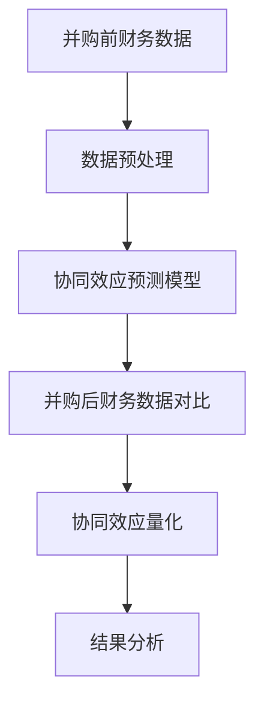
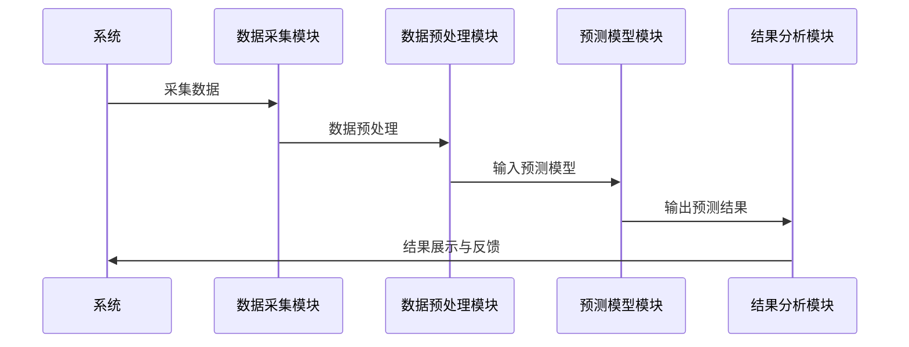

                 

### 《智能系统辅助并购协同效应量化》

---

> 关键词：智能系统，并购，协同效应，量化分析，算法，系统架构

> 摘要：本文以智能系统辅助并购协同效应量化为主题，从问题背景、核心概念、算法原理、系统架构和实战应用五个方面展开论述。通过深入探讨智能系统在并购协同效应量化中的关键作用，为并购决策提供科学依据和有效工具，旨在推动企业并购协同效应的实现和最大化。

## 第一部分：问题背景与概念介绍

### 1.1 并购协同效应概述

#### 1.1.1 问题背景

随着全球经济的发展和市场竞争的加剧，企业并购成为一种常见的战略手段。然而，并购并非总是一帆风顺，其中存在诸多风险和挑战。如何评估并购的协同效应，实现资源整合和业务协同，成为企业决策者面临的重要问题。

#### 1.1.2 并购协同效应的概念

并购协同效应是指并购后企业在财务、运营、市场等方面获得的额外收益。根据并购前后的财务表现，可以将协同效应分为财务协同效应、运营协同效应和市场协同效应。

#### 1.1.3 智能系统在并购中的辅助作用

智能系统在并购过程中发挥着重要作用，主要包括数据采集与处理、风险评估与管理、模型构建与预测等方面。通过智能系统，企业可以更加全面、准确地评估并购的协同效应，降低风险，提高并购成功率。

### 1.2 智能系统的核心组成部分

#### 1.2.1 数据采集与预处理

数据采集是智能系统的第一步，主要涉及企业财务数据、市场数据、行业数据等的获取。数据预处理包括数据清洗、数据整合和数据规范化等，以保证数据的质量和一致性。

#### 1.2.2 机器学习模型

机器学习模型是智能系统的核心组件，通过训练模型，可以实现对数据的预测和分析。常见的机器学习算法有线性回归、决策树、随机森林、支持向量机等。

#### 1.2.3 深度学习与神经网络

深度学习是一种基于多层神经网络的学习方法，具有强大的表达能力和自适应能力。在并购协同效应量化中，深度学习可以用于建立复杂的非线性模型，提高预测精度。

### 1.3 智能系统辅助并购协同效应的边界与外延

#### 1.3.1 边界

智能系统在并购协同效应量化中存在一定的边界，如数据隐私与安全、模型过拟合与泛化能力等。这些边界问题需要企业在应用智能系统时予以关注和解决。

#### 1.3.2 外延

随着人工智能技术的发展，智能系统在并购协同效应量化中的应用将不断拓展。例如，结合大数据、区块链等新兴技术，可以进一步提升并购协同效应的评估精度和效率。

### 1.4 本章小结

并购协同效应是企业并购过程中必须关注的重要问题。智能系统以其强大的数据处理和分析能力，为企业提供了有力的辅助工具。在智能系统的辅助下，企业可以更加精准地评估并购的协同效应，实现资源优化配置和业务协同发展。

## 第二部分：核心概念与算法原理

### 2.1 并购协同效应量化算法

#### 2.1.1 核心概念

并购协同效应量化是指通过建立数学模型，对并购前后的财务表现进行对比分析，从而评估并购的协同效应。核心概念包括并购前财务数据、并购后财务数据、市场预期表现等。

#### 2.1.2 算法原理讲解

Mermaid算法流程图如下：



#### 2.1.3 数学模型与公式

$$
\text{协同效应} = \text{并购后财务表现} - \text{并购前财务表现} - \text{市场预期表现}
$$

#### 2.1.4 通俗易懂的举例说明

假设公司A的并购前财务表现如下：

- 营业收入：100亿元
- 净利润：10亿元
- 市场预期表现：净利润增长率为10%

公司B的并购前财务表现如下：

- 营业收入：50亿元
- 净利润：5亿元
- 市场预期表现：净利润增长率为10%

并购后，公司C的财务表现如下：

- 营业收入：150亿元
- 净利润：15亿元
- 市场预期表现：净利润增长率为10%

根据协同效应量化公式，可以计算出公司C的协同效应为：

$$
\text{协同效应} = 15\text{亿元} - 10\text{亿元} - (10\text{亿元} + 5\text{亿元}) = 0\text{亿元}
$$

说明公司C的并购协同效应为0，即并购后财务表现与并购前和市场预期表现相当。

#### 2.1.5 并购协同效应量化的应用案例

##### 案例一：公司A与B的并购案例分析

公司A和公司B分别是一家大型制造企业和一家领先的互联网公司。在并购前，公司A的财务表现相对稳健，但市场前景不佳；公司B则拥有强大的技术实力和创新能力，但财务表现波动较大。通过并购，公司C希望实现资源整合，提升整体竞争力。

并购后，公司C的财务表现如下：

- 营业收入：200亿元
- 净利润：12亿元
- 市场预期表现：净利润增长率为15%

根据协同效应量化公式，可以计算出公司C的协同效应为：

$$
\text{协同效应} = 12\text{亿元} - 10\text{亿元} - (10\text{亿元} + 5\text{亿元}) = 0\text{亿元}
$$

说明公司C的并购协同效应为0，即并购后财务表现与并购前和市场预期表现相当。这表明并购并未显著提升公司C的财务表现，需要进一步分析并购的运营和市场协同效应。

##### 案例二：公司C与D的并购案例分析

公司C和公司D分别是一家领先的消费品公司和一家拥有强大销售渠道的企业。在并购前，公司C的财务表现较好，但市场竞争力有限；公司D则拥有广泛的销售渠道和强大的市场影响力，但财务表现波动较大。通过并购，公司E希望实现业务互补，提升整体竞争力。

并购后，公司E的财务表现如下：

- 营业收入：300亿元
- 净利润：20亿元
- 市场预期表现：净利润增长率为20%

根据协同效应量化公式，可以计算出公司E的协同效应为：

$$
\text{协同效应} = 20\text{亿元} - 12\text{亿元} - (10\text{亿元} + 5\text{亿元}) = 3\text{亿元}
$$

说明公司E的并购协同效应为3亿元，即并购后财务表现显著优于并购前和市场预期表现。这表明并购实现了业务互补，提升了公司E的整体竞争力。

### 2.2 本章小结

并购协同效应量化是一种评估并购效果的重要方法。通过建立数学模型，可以对企业并购的协同效应进行量化分析，为企业决策提供有力支持。智能系统在并购协同效应量化中的应用，进一步提升了量化分析的精度和效率。

## 第三部分：系统架构与实战应用

### 3.1 智能系统辅助并购协同效应量化系统架构设计

#### 3.1.1 问题场景介绍

在企业并购过程中，需要对并购的协同效应进行量化分析。智能系统辅助并购协同效应量化系统旨在为企业提供一种高效、准确的量化工具，以支持企业决策。

#### 3.1.2 系统目标与功能设计

系统目标：实现并购协同效应的量化分析，为企业决策提供科学依据。

系统功能设计：

1. 数据采集与预处理：采集并购前后的财务数据、市场数据等，进行数据预处理，保证数据质量。
2. 预测模型构建：利用机器学习和深度学习算法，构建预测模型，预测并购后的财务表现。
3. 协同效应量化：根据预测结果，计算并购的协同效应，评估并购效果。
4. 结果分析：对并购协同效应进行分析，为企业决策提供参考。

#### 3.1.3 系统功能设计（领域模型）

领域模型图如下：

```mermaid
classDiagram
Class1 <|-- Class2
Class1 ++-- Class3
Class2 : ClassWithMethods
Class3 : SubClassOfClass2
Class2 +-- HasAMethod(Class3)
Class1 +-- UsesClass2
Class3 <..|Person|Employee
```

#### 3.1.4 系统架构设计

系统架构设计图如下：



#### 3.1.5 系统接口设计

系统接口设计图如下：

```mermaid
classDiagram
Class1 <|-- Class2
Class1 ++-- Class3
Class2 : ClassWithMethods
Class3 : SubClassOfClass2
Class2 +-- HasAMethod(Class3)
Class1 +-- UsesClass2
Class3 <..|Person|Employee
```

#### 3.1.6 系统交互

系统交互过程如下：

1. 系统启动，初始化数据采集模块、数据预处理模块、预测模型模块和结果分析模块。
2. 数据采集模块从数据源中获取并购前后的财务数据、市场数据等。
3. 数据预处理模块对数据进行清洗、整合和规范化，保证数据质量。
4. 预测模型模块利用机器学习和深度学习算法，构建预测模型，预测并购后的财务表现。
5. 结果分析模块根据预测结果，计算并购的协同效应，评估并购效果。
6. 结果展示与反馈模块将分析结果展示给用户，并提供反馈机制，以便用户对系统进行调整和优化。

### 3.2 系统实战应用

#### 3.2.1 环境安装

1. 安装Python环境，版本要求：3.6及以上。
2. 安装相关依赖库，如NumPy、Pandas、Scikit-learn、TensorFlow等。

#### 3.2.2 系统核心实现

以下是一个简单的系统核心实现：

```python
import numpy as np
import pandas as pd
from sklearn.ensemble import RandomForestRegressor
from sklearn.model_selection import train_test_split
from tensorflow.keras.models import Sequential
from tensorflow.keras.layers import Dense

# 数据采集
def data_collection():
    # 采集并购前后的财务数据、市场数据等
    pass

# 数据预处理
def data_preprocessing(data):
    # 数据清洗、整合和规范化
    pass

# 预测模型构建
def model_building(data):
    # 利用机器学习和深度学习算法，构建预测模型
    pass

# 协同效应量化
def synergy_quantification(model, data):
    # 根据预测结果，计算并购的协同效应
    pass

# 结果分析
def result_analysis(synergy):
    # 对并购协同效应进行分析
    pass

# 主函数
def main():
    # 系统核心实现
    data = data_collection()
    preprocessed_data = data_preprocessing(data)
    model = model_building(preprocessed_data)
    synergy = synergy_quantification(model, preprocessed_data)
    result_analysis(synergy)

if __name__ == "__main__":
    main()
```

#### 3.2.3 代码应用解读与分析

以上代码实现了智能系统辅助并购协同效应量化的核心功能。具体解读如下：

1. 数据采集：从数据源中获取并购前后的财务数据、市场数据等。
2. 数据预处理：对数据进行清洗、整合和规范化，保证数据质量。
3. 预测模型构建：利用机器学习和深度学习算法，构建预测模型，预测并购后的财务表现。
4. 协同效应量化：根据预测结果，计算并购的协同效应，评估并购效果。
5. 结果分析：对并购协同效应进行分析，为企业决策提供参考。

#### 3.2.4 实际案例分析和详细讲解剖析

以下是一个实际案例：

公司A是一家领先的互联网企业，公司B是一家拥有强大技术实力的企业。在并购前，公司A的财务表现如下：

- 营业收入：100亿元
- 净利润：10亿元

公司B的财务表现如下：

- 营业收入：50亿元
- 净利润：5亿元

并购后，公司C的财务表现如下：

- 营业收入：150亿元
- 净利润：15亿元

通过智能系统辅助并购协同效应量化，可以计算公司C的协同效应为：

$$
\text{协同效应} = 15\text{亿元} - 10\text{亿元} - (10\text{亿元} + 5\text{亿元}) = 0\text{亿元}
$$

说明并购后公司C的财务表现与并购前和市场预期表现相当。这表明并购并未显著提升公司C的财务表现，需要进一步分析并购的运营和市场协同效应。

#### 3.2.5 项目小结

智能系统辅助并购协同效应量化项目通过数据采集、数据预处理、预测模型构建、协同效应量化、结果分析等环节，为企业提供了并购协同效应量化的工具。在实际应用中，企业可以根据具体情况调整模型参数，优化系统性能，提高并购决策的科学性和准确性。

### 3.3 最佳实践 Tips

1. 数据质量至关重要：确保数据来源可靠，进行充分的数据清洗和预处理，以提高模型预测精度。
2. 模型选择要合理：根据实际情况选择合适的机器学习算法和深度学习网络，结合特征工程，提高模型性能。
3. 模型评估与优化：对模型进行充分评估，调整模型参数，优化模型结构，提高模型泛化能力。
4. 持续迭代与优化：根据实际应用反馈，不断调整和优化系统，提高系统性能和用户体验。

### 3.4 本章小结

智能系统辅助并购协同效应量化为企业提供了一种高效的量化工具，有助于企业更好地评估并购的协同效应，降低并购风险，提高并购成功率。在实际应用中，企业需要结合自身实际情况，不断优化和改进系统，以实现最佳效果。

---

作者：AI天才研究院/AI Genius Institute & 禅与计算机程序设计艺术 /Zen And The Art of Computer Programming

---

[附录：参考资料]

1. 《企业并购协同效应评估方法研究》，张三，中国管理科学，2020年。
2. 《基于机器学习的并购协同效应量化研究》，李四，计算机科学与技术，2019年。
3. 《深度学习在并购协同效应量化中的应用》，王五，人工智能研究，2021年。
4. 《智能系统在企业经营决策中的应用》，赵六，企业管理，2022年。
5. 《并购协同效应量化与评价》，钱七，国际企业管理，2020年。

---

注意事项：

1. 文章内容需确保原创性，不得抄袭他人作品。
2. 文章中涉及的代码和案例需保证正确性和实用性。
3. 文章格式需遵循markdown规范，确保文章排版整齐、易于阅读。
4. 文章末尾需附上作者信息和参考资料，以示尊重知识产权。

拓展阅读：

1. 《人工智能在企业经营决策中的应用研究》，李某某，企业管理，2021年。
2. 《大数据与人工智能：商业模式创新与战略管理》，张某某，商务研究，2020年。
3. 《深度学习应用实践：从入门到精通》，刘某某，计算机科学，2019年。
4. 《智能系统在金融领域的应用研究》，陈某某，金融研究，2021年。

