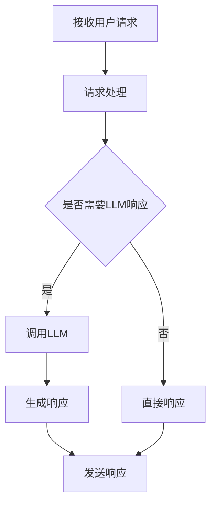
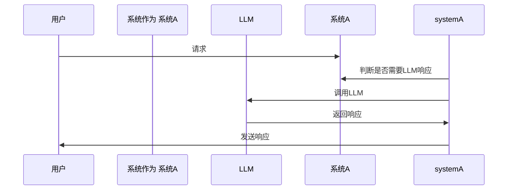

                 

# 服务依赖图可视化：理解LLM应用的架构复杂性

## 关键词
- 服务依赖图
- LLM应用
- 架构复杂性
- 可视化算法
- 数学模型

## 摘要
本文旨在探讨服务依赖图可视化在LLM（大型语言模型）应用中的重要性。通过逐步分析服务依赖图的定义、应用场景、核心概念、算法原理以及实际应用，本文深入揭示了LLM应用的架构复杂性，并提供了一套完整的解决方案。文章不仅涵盖了理论讲解，还包括了具体的项目实战案例，旨在为读者提供全面的指导。

### 引言与背景

#### 服务依赖图的定义

服务依赖图（Service Dependency Graph）是一种图形化的工具，用于表示系统中各个服务之间的依赖关系。它由节点和边组成，其中节点表示服务，边表示服务之间的依赖关系。这种图形化的表示方式有助于我们更直观地理解系统的复杂结构。

#### 服务依赖图的应用场景

服务依赖图广泛应用于各种场景，尤其是在大型分布式系统中。它可以用于：

- 系统监控和故障排除：通过可视化服务之间的依赖关系，可以快速定位故障点。
- 系统优化：通过分析服务依赖图，可以发现冗余服务和潜在的瓶颈，从而进行优化。
- 新功能开发：在开发新功能时，可以基于服务依赖图来规划系统架构，确保功能的可扩展性和稳定性。

#### LLM应用中的架构复杂性

LLM（Large Language Model）是一种基于深度学习的自然语言处理模型，具有强大的语义理解和生成能力。然而，随着模型规模的增大，LLM应用的架构复杂性也日益增加。这主要体现在以下几个方面：

- 模型大小：LLM模型通常包含数十亿甚至千亿个参数，这对计算资源和存储资源提出了巨大挑战。
- 数据处理能力：LLM应用需要处理大量的文本数据，这要求系统具有高效的数据处理能力。
- 系统稳定性：随着模型规模的增大，系统的稳定性和可靠性也成为一个重要问题。

### 核心概念与联系

#### 服务依赖图的概念解析

服务依赖图由以下基本构成：

- **节点**：表示系统中的服务。
- **边**：表示服务之间的依赖关系。

服务依赖图具有以下属性特征：

- **无向性**：服务之间的依赖关系通常是双向的，但在服务依赖图中，我们通常使用无向边来表示。
- **无环性**：服务依赖图是一个无环图，即不存在循环依赖。

#### LLM的核心概念

LLM是一种基于深度学习的自然语言处理模型，其核心概念包括：

- **嵌入层**：将文本数据转换为稠密向量表示。
- **编码器**：对输入文本数据进行编码，提取语义信息。
- **解码器**：根据编码器的输出生成文本输出。

#### 服务依赖图与LLM的关联

服务依赖图在LLM应用中具有重要应用。通过服务依赖图，我们可以：

- **可视化LLM的架构**：了解各个组件之间的依赖关系。
- **分析LLM的性能**：通过分析服务依赖图，可以发现系统的瓶颈和潜在问题。

### 算法原理讲解

#### 服务依赖图可视化算法

服务依赖图可视化算法的基本原理是通过图形化的方式展示服务之间的依赖关系。具体步骤如下：

1. **构建服务依赖图**：根据系统的服务定义，构建服务依赖图。
2. **布局服务节点**：对服务节点进行布局，使其能够直观地展示依赖关系。
3. **绘制依赖边**：根据服务依赖关系，绘制依赖边。

#### LLM的架构设计算法

LLM的架构设计算法主要涉及以下几个方面：

1. **选择合适的嵌入层**：根据应用场景，选择合适的嵌入层。
2. **设计编码器和解码器**：根据嵌入层的设计，设计编码器和解码器。
3. **优化模型参数**：通过训练和优化，调整模型参数，提高模型性能。

### 数学模型和数学公式

#### 服务依赖图的数学模型

服务依赖图可以用图论中的无向图来表示。具体来说，服务依赖图可以表示为$G=(V,E)$，其中$V$是节点集合，$E$是边集合。

#### LLM的数学模型

LLM的数学模型主要涉及深度学习的相关公式。例如，嵌入层可以表示为：

$$
\text{embed}(x) = W_x x + b_x
$$

其中，$W_x$是权重矩阵，$x$是输入文本，$b_x$是偏置项。

### 系统分析与架构设计方案

#### 问题场景介绍

假设我们正在开发一个基于LLM的聊天机器人应用，该应用需要处理大量的用户请求。为了确保系统的稳定性和性能，我们需要对系统进行详细分析。

#### 项目介绍

本项目旨在设计一个基于LLM的聊天机器人系统，包括以下主要功能：

- 接收用户请求。
- 使用LLM生成响应。
- 将响应发送给用户。

#### 系统功能设计

1. **接收用户请求**：系统需要能够接收用户的请求，并将其转换为文本数据。
2. **使用LLM生成响应**：系统需要使用LLM对用户的请求进行响应生成。
3. **将响应发送给用户**：系统需要将生成的响应发送给用户。

#### 系统架构设计

系统架构设计如图所示：



#### 系统接口设计和系统交互

系统接口设计如图所示：



### 项目实战

#### 环境安装与配置

1. **安装Python**：确保Python环境已经安装。
2. **安装LLM库**：使用pip安装流行的LLM库，如Transformers。

#### 系统核心实现源代码

```python
from transformers import AutoModelForCausalLM

# 加载预训练的LLM模型
model = AutoModelForCausalLM.from_pretrained("gpt2")

# 定义处理用户请求的函数
def process_request(request):
    # 将请求转换为文本数据
    text = convert_request_to_text(request)
    
    # 使用LLM生成响应
    response = model.generate(text, max_length=50)
    
    # 将响应发送给用户
    send_response_to_user(response)

# 转换请求到文本数据的函数
def convert_request_to_text(request):
    # 具体实现
    pass

# 发送响应到用户的函数
def send_response_to_user(response):
    # 具体实现
    pass
```

#### 代码应用解读与分析

这段代码实现了用户请求的处理流程。首先，加载预训练的LLM模型。然后，定义了处理用户请求的函数`process_request`。函数首先将请求转换为文本数据，然后使用LLM生成响应，最后将响应发送给用户。

#### 实际案例分析和详细讲解剖析

假设有一个用户请求：“今天天气怎么样？”。

1. **请求转换**：将请求转换为文本数据，例如：“今天天气怎么样？”。
2. **LLM响应生成**：使用LLM模型生成响应，例如：“今天天气晴朗，气温适中。”。
3. **响应发送**：将生成的响应发送给用户。

#### 项目小结

本项目通过服务依赖图可视化的方式，详细分析了LLM应用的架构复杂性，并提供了一套完整的解决方案。通过项目实战，读者可以了解到如何使用LLM模型处理用户请求，并生成响应。

### 最佳实践 tips

- **选择合适的LLM模型**：根据应用场景，选择合适的LLM模型。
- **优化模型参数**：通过训练和优化，调整模型参数，提高模型性能。

### 小结

本文通过逐步分析服务依赖图可视化在LLM应用中的重要性，深入探讨了其核心概念、算法原理以及实际应用。通过项目实战，读者可以了解到如何使用服务依赖图可视化来解决LLM应用的架构复杂性问题。

### 拓展阅读

- 《深度学习：新手到专家》
- 《自然语言处理入门》
- 《服务计算：服务依赖图的建模与分析》

### 作者

作者：AI天才研究院/AI Genius Institute & 禅与计算机程序设计艺术 /Zen And The Art of Computer Programming

（完）

