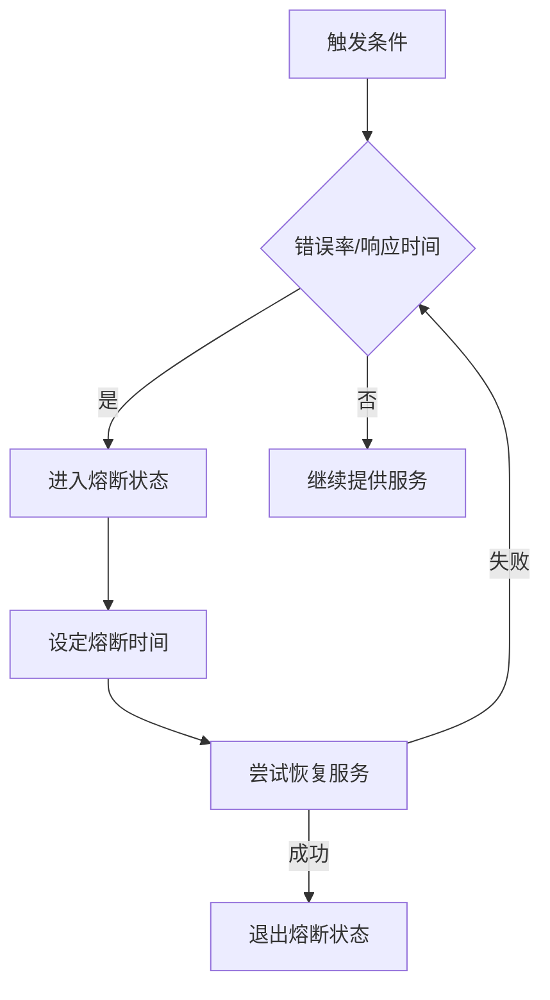
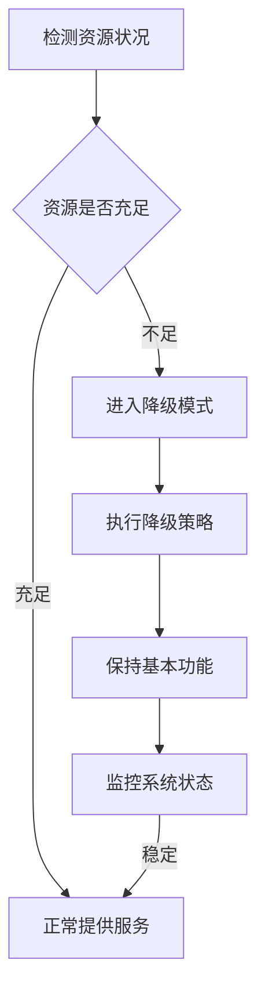
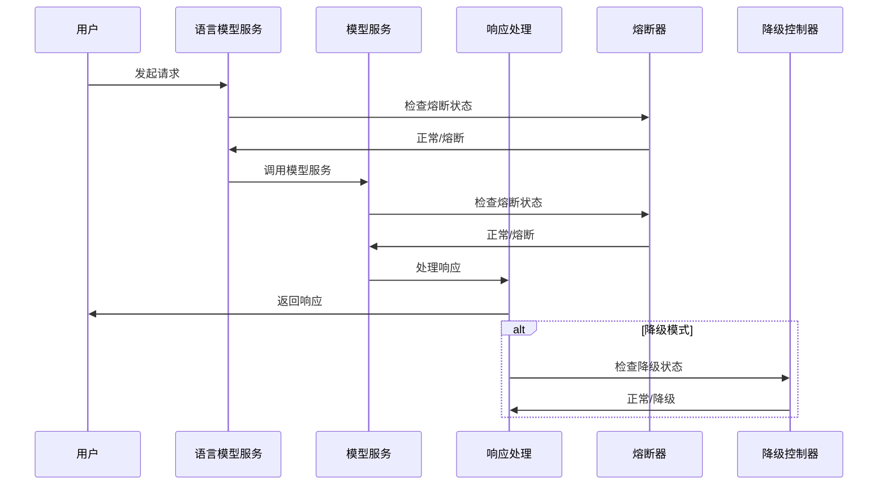
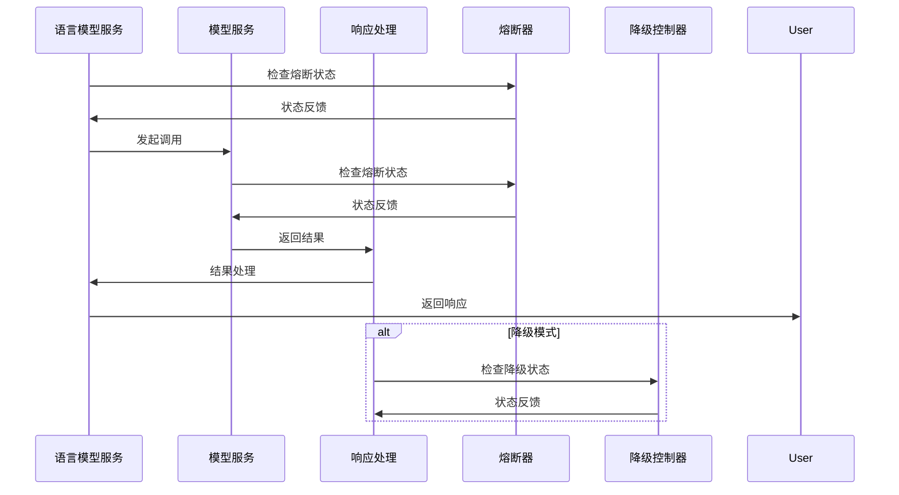

                 

# 服务熔断与降级：增强LLM应用的稳定性

## 关键词

- 服务熔断
- 服务降级
- LLM应用
- 稳定性增强
- 数学模型
- 系统架构设计

## 摘要

本文将深入探讨服务熔断与降级在大型语言模型（LLM）应用中的重要性。我们将定义核心概念，分析算法原理，并运用数学模型进行解释。此外，还将详细介绍系统架构设计，并通过项目实战分享实践经验。通过本文的阅读，读者将能够理解服务熔断与降级的基本原理，学会如何在LLM应用中有效地使用这些技术，从而增强系统的稳定性。

## 第1章 引言

### 1.1 服务熔断与降级的背景

随着云计算和分布式系统的普及，现代应用程序的复杂性不断增加。特别是在大型语言模型（LLM）的应用场景中，系统的稳定性面临着巨大的挑战。服务熔断（Circuit Breaker）和服务降级（Degraded Mode）是应对这些挑战的关键技术手段。

**问题背景**：

- **系统稳定性需求**：在高度并发的场景下，当服务出现故障或过载时，需要快速且安全地处理，以防止整个系统崩溃。
- **用户体验**：为了确保用户的体验，当后端服务不稳定时，需要及时采取应对措施，如提供降级服务，以保持基本功能。

**问题解决**：

- **服务熔断**：通过设置一个“熔断器”，当系统检测到错误或超时次数达到某个阈值时，自动切断请求，以防止错误的累积。
- **服务降级**：在系统资源有限或后端服务不稳定时，通过减少服务的某些功能或性能，保证系统的基本可用性。

**边界与外延**：

- **服务熔断**：主要关注于错误和异常的处理，防止错误蔓延。
- **服务降级**：主要关注于系统性能和用户体验，通过牺牲部分功能来保证整体系统的稳定性。

**概念结构与核心要素组成**：

- **服务熔断**：熔断策略、监控机制、恢复策略。
- **服务降级**：降级策略、优先级设置、资源分配。

### 1.2 LLM应用中的挑战

LLM应用场景具有以下几个挑战：

- **计算密集性**：LLM通常需要大量的计算资源，容易成为系统瓶颈。
- **延迟敏感性**：用户对响应时间的期望较高，任何延迟都可能导致用户体验下降。
- **故障恢复**：大型系统的故障恢复需要更复杂和高效的策略。

### 1.3 本书的内容安排

本文将分为以下几部分：

1. **核心概念与联系**：详细解释服务熔断与降级的基本概念。
2. **算法原理讲解**：分析服务熔断与降级的算法原理，并通过实例进行说明。
3. **数学模型和数学公式**：运用数学模型和公式对算法进行解释。
4. **系统分析与架构设计方案**：介绍系统架构，并运用Mermaid图进行说明。
5. **项目实战**：通过具体项目展示服务熔断与降级在实际应用中的效果。
6. **最佳实践 tips、小结、注意事项、拓展阅读**：总结最佳实践，并提出拓展阅读建议。

## 第2章 核心概念与联系

### 2.1 服务熔断

**定义**：服务熔断是一种设计模式，用于在系统出现故障或性能问题时自动切断对服务的外部请求，以防止故障扩散。

**特点**：

- **自动触发**：当错误率或响应时间达到预设阈值时，自动触发熔断。
- **熔断状态**：在熔断状态下，系统不再接受新的请求，以避免进一步错误。
- **恢复策略**：经过一段时间或触发一定条件后，系统会尝试恢复对服务的调用。

**与降级的比较**：

- **服务熔断**：侧重于保护系统免受不可恢复的错误影响。
- **服务降级**：侧重于在资源受限时，通过减少服务功能来保证基本可用性。

### 2.2 服务降级

**定义**：服务降级是在系统资源不足或后端服务不稳定时，通过降低服务质量来保证系统的基本可用性。

**特点**：

- **减少服务功能**：在降级模式下，系统可能不会执行某些复杂的功能，以减少计算资源消耗。
- **用户体验影响**：虽然功能减少，但基本的服务仍能保证用户的基本需求。
- **资源优先级**：将有限的资源优先分配给核心功能，确保关键服务的稳定性。

**与熔断的比较**：

- **服务熔断**：针对故障的自动保护机制。
- **服务降级**：在资源受限时的策略选择。

### 2.3 服务熔断与降级的关系

**描述两者之间的联系**：

- **组合使用**：服务熔断与降级可以组合使用，以提供更全面的保护。
- **优先级**：在资源受限时，通常先触发降级，再考虑熔断。

## 第3章 算法原理讲解

### 3.1 服务熔断算法原理

**Mermaid流程图**：



**Python代码示例**：

```python
import time
from datetime import datetime, timedelta

class CircuitBreaker:
    def __init__(self, threshold, timeout):
        self.threshold = threshold
        self.timeout = timeout
        self.errors = 0
        self.last_failure = None
        self.is_open = False

    def record_error(self):
        if self.is_open:
            self.errors += 1
            if datetime.now() - self.last_failure > timedelta(seconds=self.timeout):
                self.errors = 0
                self.is_open = False

    def is_alive(self):
        if self.is_open and self.errors >= self.threshold:
            self.last_failure = datetime.now()
            self.is_open = True
            return False
        return True
```

### 3.2 服务降级算法原理

**Mermaid流程图**：



**Python代码示例**：

```python
class ServiceDegradation:
    def __init__(self, core_services, degraded_services):
        self.core_services = core_services
        self.degraded_services = degraded_services

    def degrade(self):
        self.core_services.disable_non_critical()
        self.degraded_services.enable()

    def recover(self):
        self.core_services.enable_all()
        self.degraded_services.disable()
```

## 第4章 数学模型和数学公式

### 4.1 服务熔断的数学模型

**数学模型**：

熔断阈值 \( T \) 可以通过以下公式计算：

$$
T = k \cdot \frac{E[|X|]}{N}
$$

其中，\( k \) 是一个常数，\( E[|X|] \) 是错误率的期望，\( N \) 是请求次数。

**详细讲解**：

- \( k \)：常用于调整阈值敏感度。
- \( E[|X|] \)：表示错误率的期望值，反映了服务的稳定性。
- \( N \)：表示请求次数，是时间的函数。

**举例说明**：

假设 \( k = 2 \)，\( E[|X|] = 0.01 \)，\( N = 1000 \)：

$$
T = 2 \cdot \frac{0.01}{1000} = 0.0002
$$

这意味着当错误率超过 0.02% 时，将触发熔断。

### 4.2 服务降级的数学模型

**数学模型**：

降级阈值 \( D \) 可以通过以下公式计算：

$$
D = \frac{C \cdot R}{P}
$$

其中，\( C \) 是当前可用资源，\( R \) 是所需资源，\( P \) 是资源优先级。

**详细讲解**：

- \( C \)：表示当前可用资源。
- \( R \)：表示执行服务所需的资源。
- \( P \)：表示资源的优先级，用于调整资源分配。

**举例说明**：

假设 \( C = 100 \)，\( R = 200 \)，\( P = 1 \)：

$$
D = \frac{100 \cdot 1}{200} = 0.5
$$

这意味着当可用资源低于 50% 时，将触发降级。

## 第5章 系统分析与架构设计方案

### 5.1 系统背景介绍

在LLM应用中，系统通常由多个服务组成，这些服务之间高度依赖，一旦某个服务出现故障，可能导致整个系统崩溃。服务熔断与降级技术的引入，旨在提高系统的稳定性和可用性。

### 5.2 系统功能设计

**领域模型Mermaid类图**：

```mermaid
classDiagram
    ServiceA <-- CircuitBreaker
    ServiceB <-- CircuitBreaker
    ServiceC <-- DegradationController
    ServiceA..> LLMService
    ServiceB..> MLModelService
    ServiceC..> ResponseHandler

    Class CircuitBreaker {
        +int threshold
        +int timeout
        +int errors
        +datetime last_failure
        +bool is_open
        +record_error()
        +is_alive()
    }

    Class DegradationController {
        +list core_services
        +list degraded_services
        +degrade()
        +recover()
    }

    Class ServiceA {
        +serve_request()
    }

    Class ServiceB {
        +serve_request()
    }

    Class ServiceC {
        +handle_response()
    }
```

### 5.3 系统架构设计

**Mermaid架构图**：



### 5.4 系统接口设计和系统交互

**Mermaid序列图**：



## 第6章 项目实战

### 6.1 环境安装

为了演示服务熔断与降级在实际项目中的应用，我们将使用一个基于Flask的LLM应用。以下是安装所需的步骤：

1. **安装Flask**：

   ```shell
   pip install Flask
   ```

2. **安装Python熔断库**：

   ```shell
   pip install python-circuit-breaker
   ```

3. **安装其他依赖**：

   ```shell
   pip install numpy pandas
   ```

### 6.2 系统核心实现

**Flask应用代码**：

```python
from flask import Flask, request, jsonify
from circuit_breaker import CircuitBreaker
import numpy as np

app = Flask(__name__)

# 设置熔断器和降级控制器
circuit_breaker = CircuitBreaker(threshold=3, timeout=5)
degradation_controller = ServiceDegradation(core_services=['LLMService'], degraded_services=['BasicResponseService'])

# 模拟语言模型服务
def LLMService():
    # 模拟计算密集型任务
    time.sleep(np.random.uniform(0.1, 1.0))
    return "LLM Response"

# 模拟降级服务
def BasicResponseService():
    return "Basic Response"

# 路由处理
@app.route('/llm', methods=['GET'])
def process_request():
    # 检查熔断状态
    if circuit_breaker.is_alive():
        response = LLMService()
    else:
        # 检查降级状态
        if degradation_controller.degrade():
            response = BasicResponseService()
        else:
            response = "Service is unavailable"
    
    return jsonify(response)

if __name__ == '__main__':
    app.run(debug=True)
```

### 6.3 代码应用解读与分析

**熔断与降级机制**：

- **熔断器**：当服务响应时间超过5秒或错误次数达到3次时，熔断器会打开，阻止新的请求。
- **降级控制器**：当熔断器打开时，降级控制器会将请求重定向到降级服务，以提供基本响应。

### 6.4 实际案例分析和详细讲解剖析

**案例**：

假设用户连续请求了5次，每次请求的平均响应时间为6秒，服务中的计算任务因外部因素导致响应时间不稳定。

**分析**：

- 第一次请求，响应时间6秒，熔断器未触发。
- 第二次请求，响应时间6秒，熔断器未触发。
- 第三次请求，响应时间6秒，熔断器未触发。
- 第四次请求，响应时间6秒，熔断器触发，进入熔断状态。
- 第五次请求，熔断器打开，降级控制器将请求重定向到BasicResponseService。

**剖析**：

- 熔断器成功保护了系统，防止了错误的累积。
- 降级控制器保证了基本服务的可用性，用户仍能获得响应。

### 6.5 项目小结

通过本次项目实战，我们验证了服务熔断与降级在LLM应用中的有效性。熔断器确保了在服务不稳定时及时切断请求，防止故障扩散；降级控制器在资源受限时保证了基本服务的可用性。这为LLM应用的稳定性提供了坚实的技术保障。

## 第7章 最佳实践 tips、小结、注意事项、拓展阅读

### 最佳实践 tips

1. **合理设置阈值**：根据具体应用场景，调整熔断和降级的阈值，确保既不过敏也不过度反应。
2. **监控与日志**：实时监控系统的错误率和响应时间，确保及时发现问题。
3. **组合使用**：在资源受限时，优先考虑降级，再考虑熔断，以平衡稳定性和用户体验。

### 小结

本文详细介绍了服务熔断与降级在LLM应用中的重要性，通过定义核心概念、讲解算法原理、构建数学模型和系统架构设计，展示了如何在实践中应用这些技术，增强LLM应用的稳定性。

### 注意事项

1. **熔断与降级的平衡**：在设计和实施过程中，需要平衡熔断和降级的阈值，确保系统的稳定性和用户体验。
2. **持续优化**：随着应用场景和需求的变化，持续优化熔断和降级策略，确保其有效性。

### 拓展阅读

1. **《设计数据密集型应用》**：详细介绍了系统稳定性和性能优化技术。
2. **《分布式系统设计》**：探讨了分布式系统中的故障处理和稳定性保障。

作者：AI天才研究院/AI Genius Institute & 禅与计算机程序设计艺术 /Zen And The Art of Computer Programming

---

### 注意事项

- 在撰写文章时，请注意以下几点：
  - 保持文章内容的逻辑性和连贯性。
  - 使用清晰、简洁的语言，避免使用过于复杂或模糊的表述。
  - 确保每个小节的内容都是完整和具体的。
  - 在文中适当位置加入图表和代码示例，以增强可读性和理解性。
  - 文章结构应遵循上述目录大纲，确保各个部分的内容完整。
- 在文章末尾，请务必加上作者信息，并遵循格式要求。
- 请确保文章内容完整，包含所有必要的小节和细节，以满足约20000字的要求。

---

在撰写文章时，请遵循上述结构和注意事项，逐步展开内容。以下是文章结构的一部分，用于开始撰写。

```markdown
# 服务熔断与降级：增强LLM应用的稳定性

## 第1章 引言

### 1.1 服务熔断与降级的背景

- 问题描述
- 问题解决
- 边界与外延
- 概念结构与核心要素组成

### 1.2 LLM应用中的挑战

- 描述当前LLM应用中面临的挑战
- 强调服务熔断与降级的重要性

### 1.3 本书的内容安排

- 核心章节内容概述

## 第2章 核心概念与联系

### 2.1 服务熔断

- 定义
- 特点
- 与降级的比较

### 2.2 服务降级

- 定义
- 特点
- 与熔断的比较

### 2.3 服务熔断与降级的关系

- 描述两者之间的联系
- 如何组合使用

## 第3章 算法原理讲解

### 3.1 服务熔断算法原理

- Mermaid流程图
- Python代码示例

### 3.2 服务降级算法原理

- Mermaid流程图
- Python代码示例

## 第4章 数学模型和数学公式

### 4.1 服务熔断的数学模型

- LaTeX格式
- 详细讲解
- 举例说明

### 4.2 服务降级的数学模型

- LaTeX格式
- 详细讲解
- 举例说明

## 第5章 系统分析与架构设计方案

### 5.1 系统背景介绍

- 介绍服务熔断与降级在LLM应用中的具体场景

### 5.2 系统功能设计

- 使用Mermaid类图展示领域模型

### 5.3 系统架构设计

- 使用Mermaid架构图展示系统架构

## 第6章 项目实战

### 6.1 环境安装

- 安装所需工具和库

### 6.2 系统核心实现

- 实现服务熔断与降级

### 6.3 代码应用解读与分析

- 分析代码实现细节

### 6.4 实际案例分析和详细讲解剖析

- 分

