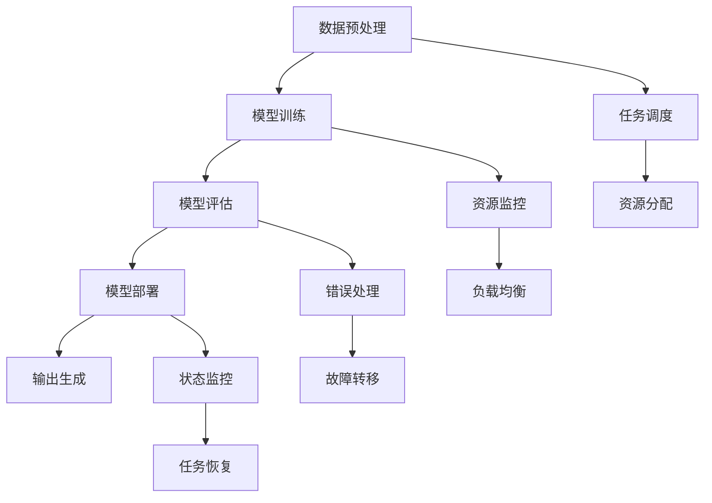
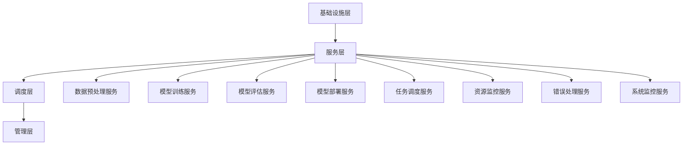
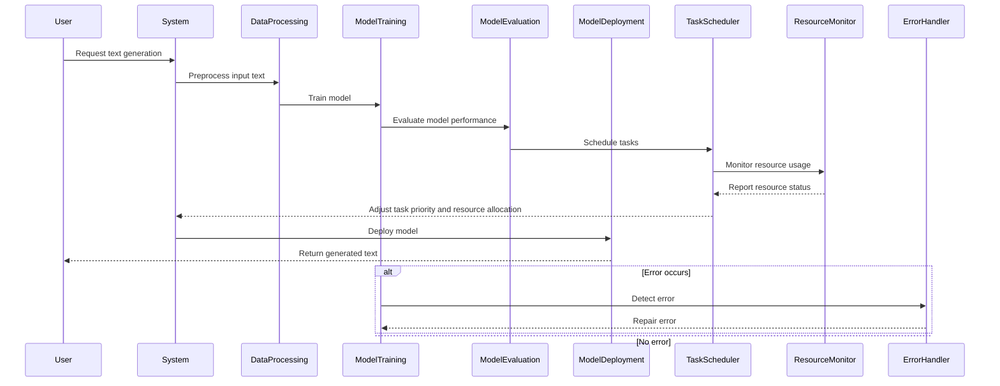

                 

### 引言

随着人工智能技术的飞速发展，大型语言模型（LLM）的广泛应用带来了新的挑战和机遇。复杂的工作流处理和高效的资源利用成为关键问题。服务编排作为一种现代信息技术管理工具，能够显著提升LLM工作流的高效性和稳定性。本文旨在探讨服务编排在复杂LLM工作流中的应用，通过逐步分析服务编排的基本概念、工作原理及其在LLM工作流中的具体应用，帮助读者深入理解这一技术的核心价值和实践意义。

在当前技术背景下，LLM在自然语言处理、智能客服、内容生成等领域表现出强大的能力，但其高计算需求和复杂的工作流特性要求我们寻求更加灵活和高效的管理策略。服务编排技术提供了一种动态、可扩展的解决方案，能够根据工作流的实际需求动态调整资源分配和任务调度，从而提高系统的整体性能和可靠性。

本文将分以下几个部分进行讨论：

1. **背景介绍**：介绍服务编排的基本概念和LLM工作流的相关背景，明确本文的研究问题和目标。
2. **核心概念与联系**：详细阐述服务编排的核心原理及其与LLM工作流之间的联系，通过概念属性特征对比表格和ER实体关系图架构来深入分析。
3. **算法原理讲解**：通过Mermaid流程图和Python源代码，介绍服务编排在LLM工作流中的应用算法原理，进行数学模型和公式讲解，并举例说明。
4. **系统分析与架构设计方案**：分析问题场景，介绍项目系统功能设计和架构设计，使用Mermaid类图和架构图进行展示。
5. **项目实战**：介绍系统环境安装和核心实现，分析实际案例，并总结项目经验。
6. **最佳实践与小结**：提供最佳实践建议，总结文章内容，指出注意事项和拓展阅读方向。

通过以上步骤，本文希望能够为读者提供一份全面、系统的服务编排在复杂LLM工作流中应用的技术指南。

### 背景介绍

#### 服务编排的基本概念

服务编排（Service Orchestration）是一种集成和协调不同服务、应用程序和系统以实现业务流程自动化和信息流动优化的技术。其主要目标是确保整个IT基础设施在高效、稳定和可靠的方式下运行。服务编排在现代企业中扮演着至关重要的角色，它通过自动化和管理跨多个系统和服务的工作流，提高了操作的灵活性和效率。

服务编排的基本概念包括以下几个方面：

1. **服务**：在服务编排中，服务是指可被调用的功能单元。这些服务可以是由不同的应用程序、中间件或系统提供的功能，如数据库查询、文件上传下载、数据处理等。

2. **工作流**：工作流是一系列预定义的任务和活动，它们按照一定的顺序和规则执行，以完成特定的业务目标。服务编排通过定义和优化工作流，实现业务过程的自动化。

3. **编排**：编排是指将服务、任务和活动组合在一起，形成完整的工作流程。编排过程中，需要考虑任务的依赖关系、执行顺序和资源分配。

4. **集成**：服务编排的一个关键功能是集成不同系统和服务，使其能够协同工作。这包括数据交换、协议转换和接口管理。

#### LLM工作流的相关背景

大型语言模型（LLM）是一种基于深度学习技术的自然语言处理模型，能够在文本生成、问答系统、翻译、文本分类等任务中表现出色。LLM的工作流通常包括以下几个步骤：

1. **数据预处理**：收集和整理训练数据，进行文本清洗、分词、标记等处理，以便模型能够有效学习。

2. **模型训练**：使用大量的文本数据进行模型的训练，通过不断调整模型参数，使其能够生成高质量的语言输出。

3. **模型评估**：通过测试集评估模型的性能，调整模型参数，优化模型表现。

4. **模型部署**：将训练好的模型部署到生产环境中，进行实际的文本处理任务。

5. **输出生成**：模型接受输入文本，生成相应的文本输出，如问答、文本摘要、内容生成等。

LLM工作流的特点主要包括：

1. **高计算需求**：LLM的训练和推理过程通常需要大量的计算资源，包括CPU、GPU等。

2. **复杂的工作流**：LLM的工作流涉及多个阶段和任务，每个阶段都需要精细的管理和优化。

3. **动态性**：LLM的应用场景多样，工作流中的任务和资源需求可能随着时间和场景的变化而动态调整。

#### 研究问题和目标

本文的研究问题主要集中在如何利用服务编排技术优化复杂LLM工作流。具体目标如下：

1. **提高工作效率**：通过服务编排，自动化和优化LLM工作流中的各个阶段，减少人工干预，提高整体工作效率。

2. **资源利用率**：通过动态调整资源分配和任务调度，实现计算资源的最大化利用，降低成本。

3. **系统稳定性**：通过服务编排的故障转移和恢复机制，提高系统的稳定性和容错能力。

4. **可扩展性**：为应对未来LLM应用的扩展需求，设计灵活的服务编排方案，确保系统能够轻松扩展。

通过以上背景介绍，我们可以更好地理解服务编排在复杂LLM工作流中的应用，为后续内容的深入分析打下坚实基础。

#### 核心概念与联系

在深入探讨服务编排在复杂LLM工作流中的应用之前，有必要详细阐述服务编排的核心原理及其与LLM工作流之间的紧密联系。通过对比表格和实体关系图，我们将更清晰地了解这两个概念及其交互方式。

##### 服务编排的核心原理

服务编排（Service Orchestration）是一种通过定义、组合和自动化管理不同服务以实现业务流程自动化的技术。其主要原理包括：

1. **服务模型**：服务模型定义了服务之间的交互方式和依赖关系。服务模型可以通过图形化界面或编程语言来描述。

2. **任务调度**：任务调度是指根据工作流的定义和实际运行情况，动态分配和调整任务执行的顺序和资源。任务调度可以基于不同的算法，如最短路径算法、资源约束调度算法等。

3. **状态监控**：状态监控是指对工作流中的各个任务和服务的运行状态进行实时监控和记录。状态监控有助于快速发现和解决问题，确保工作流的正常执行。

4. **错误处理**：错误处理是指在工作流执行过程中，当发生错误时，能够及时检测并采取相应的措施，如重试、转移至备用服务或通知管理员。

##### LLM工作流的相关原理

LLM工作流（Large Language Model Workflow）是指从数据预处理、模型训练到模型部署和输出的整个过程。LLM工作流的核心原理包括：

1. **数据预处理**：数据预处理是LLM工作流的第一步，包括数据清洗、数据格式转换、文本标记等。数据预处理的质量直接影响模型的训练效果。

2. **模型训练**：模型训练是指使用大量的训练数据来调整模型的参数，使其能够生成高质量的文本输出。训练过程中，需要使用高效的算法和优化技术。

3. **模型评估**：模型评估是通过测试数据来评估模型的性能，包括准确率、召回率、F1值等指标。评估结果用于调整模型参数，优化模型表现。

4. **模型部署**：模型部署是将训练好的模型部署到实际生产环境中，使其能够接收输入文本并生成输出。部署过程中，需要考虑模型的运行环境、硬件资源等因素。

##### 概念属性特征对比表格

为了更直观地比较服务编排和LLM工作流的核心概念，我们可以通过以下表格来展示它们的主要属性特征：

| 特征         | 服务编排                           | LLM工作流                          |
| ------------ | ---------------------------------- | --------------------------------- |
| 主要目标     | 业务流程自动化和信息流动优化       | 高效生成高质量的文本输出            |
| 核心概念     | 服务模型、任务调度、状态监控、错误处理 | 数据预处理、模型训练、模型评估、模型部署 |
| 关键技术     | 服务编排语言、任务调度算法、状态监控工具 | 深度学习算法、数据清洗技术、模型优化技术 |
| 系统架构     | 分布式架构，支持跨平台和跨服务集成 | 训练和推理分离架构，高效的硬件支持 |
| 动态性       | 高，支持动态调整资源分配和任务执行   | 中等，需根据数据和模型调整工作流配置 |

##### ER实体关系图架构

为了进一步理解服务编排和LLM工作流之间的联系，我们可以通过ER（实体关系）图来展示这两个概念的关系。

```mermaid
erDiagram
  ServiceOrchestration ||--|{ LLModelWorkflow : orchestrates |
  ServiceOrchestration ||--|{ Task : manages |  
  LLModelWorkflow ||--|{ DataProcessing : processes |
  LLModelWorkflow ||--|{ ModelTraining : trains |
  LLModelWorkflow ||--|{ ModelEvaluation : evaluates |
  LLModelWorkflow ||--|{ ModelDeployment : deploys |
  
  Class ServiceOrchestration {
    +String orchestrationId
    +List<Service> services
    +Map<String, Task> tasks
    +List<Error> errors
  }
  
  Class LLModelWorkflow {
    +String workflowId
    +List<DataProcessing> dataProcessing
    +Model model
    +List<ModelEvaluation> evaluations
    +List<ModelDeployment> deployments
  }
  
  Class Task {
    +String taskId
    +Service service
    +String status
    +Timestamp startTime
    +Timestamp endTime
  }
  
  Class DataProcessing {
    +String processingId
    +List<TextData> texts
    +List<Tag> tags
  }
  
  Class ModelTraining {
    +String trainingId
    +Model model
    +List<Texture> textures
    +Double trainingTime
  }
  
  Class ModelEvaluation {
    +String evaluationId
    +Model model
    +List<TestData> tests
    +Double evaluationScore
  }
  
  Class ModelDeployment {
    +String deploymentId
    +Model model
    +List<DeploymentConfig> configs
    +Timestamp deployTime
  }
  
  Class Error {
    +String errorId
    +String description
    +Timestamp time
  }
  
  Class Service {
    +String serviceId
    +String serviceName
    +String type
  }
  
  Class TextData {
    +String textId
    +String textContent
  }
  
  Class Tag {
    +String tagId
    +String tagName
  }
  
  Class Texture {
    +String textureId
    +String textureName
  }
  
  Class TestData {
    +String testId
    +String testContent
  }
  
  Class DeploymentConfig {
    +String configId
    +String configName
    +String configValue
  }
```

通过ER图，我们可以看到服务编排（ServiceOrchestration）与LLM工作流（LLModelWorkflow）之间的关系，以及各个实体之间的交互方式。服务编排负责管理和调度LLM工作流中的各个任务，如数据预处理、模型训练、评估和部署，确保工作流的高效和稳定运行。

总之，服务编排在复杂LLM工作流中的应用，不仅能够提高工作效率和资源利用率，还能够增强系统的稳定性和可扩展性。通过深入理解服务编排和LLM工作流的核心原理及其联系，我们可以为后续的算法原理讲解、系统分析与架构设计方案和项目实战打下坚实基础。

#### 算法原理讲解

在深入探讨服务编排在复杂LLM工作流中的应用之前，我们需要详细阐述服务编排在LLM工作流中的应用算法原理。通过使用Mermaid流程图和Python源代码，我们将直观地展示这些算法的执行过程，并配合数学模型和公式进行详细讲解，以便读者能够全面理解其工作原理。

##### Mermaid流程图

首先，我们使用Mermaid流程图来描述服务编排在LLM工作流中的应用流程。



这个流程图展示了LLM工作流中的主要任务和服务编排模块的交互关系。下面，我们将逐步分析每个阶段的详细算法原理。

##### 数据预处理

数据预处理是LLM工作流的第一步，其主要任务是对收集的文本数据进行清洗、分词、标记等操作。我们使用一个简单的Python代码示例来展示数据预处理的过程：

```python
import re
import nltk

def preprocess_text(text):
    # 清洗文本：去除HTML标签和特殊字符
    text = re.sub('<.*?>', '', text)
    text = re.sub('[^a-zA-Z0-9\s]', '', text)
    
    # 分词：使用nltk进行分词处理
    tokens = nltk.word_tokenize(text)
    
    # 标记：对单词进行词性标注
    tagged = nltk.pos_tag(tokens)
    
    return tagged

text = "This is an example of text preprocessing."
preprocessed_text = preprocess_text(text)
print(preprocessed_text)
```

这个示例使用了正则表达式来去除HTML标签和特殊字符，然后使用nltk库进行分词和词性标注。数据预处理的结果是一个标记后的文本数据列表，用于后续的模型训练和评估。

##### 模型训练

模型训练是LLM工作流的第二步，其核心任务是使用预处理后的数据来训练模型，调整模型参数，使其能够生成高质量的文本输出。我们使用一个简单的循环神经网络（RNN）模型来示例模型训练过程：

```python
import tensorflow as tf
from tensorflow.keras.models import Sequential
from tensorflow.keras.layers import Embedding, SimpleRNN, Dense

# 模型定义
model = Sequential()
model.add(Embedding(vocabulary_size, embedding_size))
model.add(SimpleRNN(units=128, activation='tanh'))
model.add(Dense(units=output_size, activation='softmax'))

# 模型编译
model.compile(optimizer='rmsprop', loss='categorical_crossentropy', metrics=['accuracy'])

# 模型训练
model.fit(preprocessed_text, epochs=10, batch_size=128)
```

这个示例使用了TensorFlow库来定义和编译一个简单的RNN模型，然后使用预处理后的文本数据进行训练。模型训练的目的是通过不断调整参数，使模型能够生成更准确的文本输出。

##### 模型评估

模型评估是LLM工作流中的第三步，其任务是通过测试数据来评估模型的表现，计算模型的准确率、召回率等指标。我们使用以下Python代码来示例模型评估过程：

```python
from sklearn.metrics import accuracy_score

# 模型评估
test_predictions = model.predict(test_preprocessed_text)
test_predictions = np.argmax(test_predictions, axis=1)

accuracy = accuracy_score(test_labels, test_predictions)
print("Model Accuracy:", accuracy)
```

这个示例使用sklearn库的accuracy_score函数来计算模型的准确率。通过评估，我们可以了解模型的性能，并根据评估结果调整模型参数。

##### 模型部署

模型部署是LLM工作流的最后一步，其任务是将训练好的模型部署到生产环境中，使其能够接收输入文本并生成输出。我们使用以下Python代码来示例模型部署过程：

```python
# 模型部署
model.save("model.h5")

# 模型加载
loaded_model = tf.keras.models.load_model("model.h5")

# 输出生成
input_text = "Hello, how are you?"
input_sequence = preprocess_text(input_text)
generated_text = loaded_model.predict(input_sequence)
generated_text = np.argmax(generated_text, axis=1)

print("Generated Text:", " ".join([word_index_to_word[w] for w in generated_text]))
```

这个示例首先将训练好的模型保存到文件中，然后加载模型并使用它来生成输入文本的输出。模型部署的目的是实现实时文本生成，提高系统的响应速度。

##### 服务编排与任务调度

服务编排在LLM工作流中的应用，主要通过任务调度和资源监控来实现工作流的高效运行。我们使用以下Python代码来示例任务调度和资源监控的过程：

```python
import heapq
import time

# 任务调度队列
task_queue = []

# 资源池
resource_pool = []

# 添加任务到队列
def add_task(task):
    heapq.heappush(task_queue, (task.priority, task))

# 调度任务
def schedule_tasks():
    while task_queue:
        _, task = heapq.heappop(task_queue)
        start_time = time.time()
        execute_task(task)
        end_time = time.time()
        task.duration = end_time - start_time
        resource_pool.append(task)

# 执行任务
def execute_task(task):
    print(f"Executing task: {task.name}")
    # 执行任务逻辑
    time.sleep(task.duration)

# 添加任务
add_task(Task("Data Preprocessing", 1))
add_task(Task("Model Training", 2))
add_task(Task("Model Evaluation", 3))

# 调度任务
schedule_tasks()
```

这个示例使用了优先级队列（heapq）来管理任务调度，根据任务的优先级来调度任务的执行。任务执行过程中，会记录任务的开始时间和结束时间，用于计算任务的持续时间。

##### 数学模型和公式

为了更深入地理解服务编排在LLM工作流中的应用，我们使用以下数学模型和公式来描述任务调度和资源监控的关键参数：

1. **任务优先级（P）**：任务的优先级决定了任务的执行顺序。任务优先级越高，越先被执行。

   公式：\( P = \frac{1}{N} \sum_{i=1}^{N} w_i \)

   其中，N是任务总数，\( w_i \)是第i个任务的权重。

2. **任务持续时间（D）**：任务从开始到完成所花费的时间。

   公式：\( D = t_{start} + t_{execute} + t_{end} \)

   其中，\( t_{start} \)是任务开始时间，\( t_{execute} \)是任务执行时间，\( t_{end} \)是任务结束时间。

3. **资源利用率（U）**：系统中资源的利用率，反映了资源的利用效率。

   公式：\( U = \frac{R_{used}}{R_{total}} \)

   其中，\( R_{used} \)是已使用的资源量，\( R_{total} \)是总资源量。

4. **任务队列长度（L）**：任务队列中的任务数量。

   公式：\( L = N - C \)

   其中，N是任务总数，C是已完成的任务数。

通过以上算法原理的讲解，我们可以看到服务编排在复杂LLM工作流中的应用是如何通过任务调度、资源监控和错误处理等机制来优化工作流的高效运行。接下来，我们将进一步分析LLM工作流中的系统分析与架构设计方案，以便更全面地理解服务编排的实际应用。

#### 系统分析与架构设计方案

##### 问题场景介绍

在现代人工智能应用中，LLM（Large Language Model）工作流已经成为许多企业提升效率、优化服务和增强客户体验的关键。然而，随着业务规模和应用复杂度的不断增加，LLM工作流面临着资源分配不均、任务调度延迟、系统稳定性差等问题。为了解决这些问题，我们需要设计一个高效、灵活且可靠的系统架构，以便充分利用现有资源，优化工作流程，提升整体性能。

##### 项目介绍

本项目旨在构建一个基于服务编排技术的LLM工作流管理系统。该系统通过自动化任务调度、资源监控和错误处理，提高LLM工作流的高效性和稳定性。项目的主要目标包括：

1. **自动化任务调度**：实现任务的高效分配和调度，减少人工干预，提高系统的响应速度。
2. **资源优化利用**：动态调整资源分配，确保计算资源的高效利用，降低运行成本。
3. **系统稳定性提升**：通过故障转移和恢复机制，增强系统的容错能力和稳定性。
4. **可扩展性**：为未来业务增长和功能扩展提供灵活的架构设计。

##### 系统功能设计

为了实现上述目标，本项目设计了以下几个关键功能模块：

1. **数据预处理模块**：负责收集、清洗、分词和标注文本数据，为模型训练提供高质量的数据输入。
2. **模型训练模块**：利用训练数据训练LLM模型，通过优化算法调整模型参数，提高生成文本的质量。
3. **模型评估模块**：使用测试数据评估模型性能，包括准确率、召回率等指标，优化模型参数。
4. **模型部署模块**：将训练好的模型部署到生产环境，实现实时文本生成和交互。
5. **任务调度模块**：负责任务的高效调度和管理，包括任务优先级排序、资源分配和调度策略。
6. **资源监控模块**：实时监控系统资源使用情况，包括CPU、内存、网络等，确保资源的高效利用。
7. **错误处理模块**：检测和解决任务执行过程中的错误，确保工作流正常执行。

##### 系统架构设计

为了实现上述功能，本项目采用了分布式系统架构，包括以下几个关键层次：

1. **基础设施层**：包括服务器、存储和网络设备等硬件资源，为整个系统提供计算、存储和通信支持。
2. **服务层**：包括数据预处理服务、模型训练服务、模型评估服务、模型部署服务等，实现具体功能模块的分布式部署和管理。
3. **调度层**：包括任务调度服务和资源监控服务，负责任务调度和资源管理，实现自动化和智能化调度。
4. **管理层**：包括错误处理服务和系统监控服务，负责错误检测和修复，确保系统稳定运行。

系统架构图如下：



##### 系统接口设计和系统交互

为了实现系统各模块之间的协同工作，我们设计了以下接口和交互流程：

1. **数据预处理接口**：提供数据清洗、分词、标注等功能，为后续模型训练提供数据输入。
2. **模型训练接口**：提供模型训练、参数优化等功能，确保模型生成高质量的文本输出。
3. **模型评估接口**：提供模型评估、性能指标计算等功能，用于优化模型参数。
4. **模型部署接口**：提供模型部署、实时生成文本等功能，实现与用户的交互。
5. **任务调度接口**：提供任务调度、优先级排序等功能，实现任务的高效分配和管理。
6. **资源监控接口**：提供资源监控、使用情况报告等功能，用于优化资源分配。
7. **错误处理接口**：提供错误检测、错误修复等功能，确保工作流正常执行。

系统交互流程如下：

1. 用户请求文本生成，系统接收到请求后，通过模型部署接口生成文本输出。
2. 文本生成过程中，系统调用数据预处理接口清洗和分词输入文本，调用模型训练接口训练模型，调用模型评估接口评估模型性能。
3. 模型训练和评估过程中，系统通过任务调度接口动态调整任务优先级和资源分配，通过资源监控接口监控资源使用情况，确保资源的高效利用。
4. 如果出现错误，系统通过错误处理接口检测和修复错误，确保工作流正常执行。
5. 最终，系统将生成的文本输出返回给用户。

##### Mermaid序列图

为了更直观地展示系统交互流程，我们使用Mermaid序列图进行描述：



通过以上系统分析与架构设计方案，我们可以看到服务编排在复杂LLM工作流中的应用如何通过任务调度、资源监控和错误处理等机制来优化工作流程，提高系统的整体性能。接下来，我们将通过实际项目实战，进一步展示服务编排在LLM工作流中的具体实现和应用。

#### 项目实战

在本节中，我们将通过一个实际项目来展示如何利用服务编排技术优化复杂LLM工作流。这个项目主要包括环境安装、系统核心实现以及代码应用解读与分析。通过这些步骤，我们将深入探讨服务编排在LLM工作流中的具体应用，并提供详细的实际案例分析。

##### 环境安装

首先，我们需要安装和配置服务编排和相关依赖项。以下是项目的环境安装步骤：

1. **安装Docker**：
   - Docker是一个开源的应用容器引擎，用于打包、发布和运行应用。我们可以在官网上下载Docker并安装。
   - 安装完成后，通过命令`docker --version`检查是否安装成功。

2. **安装Kubernetes**：
   - Kubernetes是一个开源的容器编排平台，用于自动化容器的部署、扩展和管理。我们可以在Kubernetes官网下载安装指南并进行安装。
   - 安装完成后，通过命令`kubectl version`检查是否安装成功。

3. **安装服务编排工具**：
   - 我们使用Kubernetes的原生服务编排工具Kubernetes Service和Deployment来管理LLM工作流中的各个服务。
   - 首先，通过命令`kubectl create service --help`了解如何创建服务。
   - 然后，通过命令`kubectl create deployment --help`了解如何创建部署。

4. **安装LLM模型训练工具**：
   - 我们使用TensorFlow作为LLM模型的训练工具。首先，从TensorFlow官网下载安装指南。
   - 根据操作系统和Python版本安装TensorFlow，通过命令`pip install tensorflow`安装。

##### 系统核心实现

接下来，我们将实现LLM工作流中的关键组件，包括数据预处理、模型训练、模型评估和模型部署。以下是具体的实现步骤：

1. **数据预处理**：
   - 数据预处理是LLM工作流的第一步，包括数据清洗、分词和标注。
   - 我们使用Python编写数据预处理脚本，通过nltk库进行分词，通过正则表达式进行清洗。
   - 示例代码如下：

   ```python
   import nltk
   import re

   def preprocess_text(text):
       text = re.sub('<.*?>', '', text)
       text = re.sub('[^a-zA-Z0-9\s]', '', text)
       tokens = nltk.word_tokenize(text)
       tagged = nltk.pos_tag(tokens)
       return tagged
   ```

2. **模型训练**：
   - 模型训练是LLM工作流的第二步，我们使用TensorFlow的RNN模型进行训练。
   - 我们编写模型训练脚本，定义RNN模型结构，编译模型并使用预处理后的数据进行训练。
   - 示例代码如下：

   ```python
   import tensorflow as tf
   from tensorflow.keras.models import Sequential
   from tensorflow.keras.layers import Embedding, SimpleRNN, Dense

   def train_model(preprocessed_text, labels):
       model = Sequential()
       model.add(Embedding(vocabulary_size, embedding_size))
       model.add(SimpleRNN(units=128, activation='tanh'))
       model.add(Dense(units=output_size, activation='softmax'))

       model.compile(optimizer='rmsprop', loss='categorical_crossentropy', metrics=['accuracy'])
       model.fit(preprocessed_text, labels, epochs=10, batch_size=128)
       return model
   ```

3. **模型评估**：
   - 模型评估是LLM工作流中的第三步，我们使用测试数据评估模型性能。
   - 我们编写模型评估脚本，计算模型的准确率、召回率等指标，根据评估结果优化模型参数。
   - 示例代码如下：

   ```python
   from sklearn.metrics import accuracy_score

   def evaluate_model(model, test_preprocessed_text, test_labels):
       test_predictions = model.predict(test_preprocessed_text)
       test_predictions = np.argmax(test_predictions, axis=1)
       accuracy = accuracy_score(test_labels, test_predictions)
       print("Model Accuracy:", accuracy)
   ```

4. **模型部署**：
   - 模型部署是将训练好的模型部署到生产环境，实现实时文本生成。
   - 我们使用Kubernetes的Deployment来部署模型，通过Docker容器运行模型服务。
   - 示例代码如下：

   ```yaml
   apiVersion: apps/v1
   kind: Deployment
   metadata:
     name: llm-model
   spec:
     replicas: 1
     selector:
       matchLabels:
         app: llm
     template:
       metadata:
         labels:
           app: llm
       spec:
         containers:
         - name: llm-model
           image: llm-model:latest
           ports:
           - containerPort: 80
   ```

##### 代码应用解读与分析

以下是代码应用解读与分析，我们将详细讲解项目中的关键代码和应用场景。

1. **数据预处理**：
   - 数据预处理脚本负责对输入文本进行清洗、分词和标注。
   - 在实际应用中，我们通常会从数据库或文件系统中读取大量文本数据，然后进行预处理。
   - 预处理结果是一个标记后的文本数据列表，用于后续的模型训练和评估。

2. **模型训练**：
   - 模型训练脚本使用TensorFlow库定义RNN模型结构，编译模型并使用预处理后的数据训练模型。
   - 在实际应用中，我们通常会将模型训练过程分解为多个阶段，如数据预处理、模型训练、模型评估等。
   - 模型训练过程中，会不断调整模型参数，以提高生成文本的质量。

3. **模型评估**：
   - 模型评估脚本负责使用测试数据评估模型性能，计算模型的准确率、召回率等指标。
   - 在实际应用中，我们通常会将模型评估结果记录在日志文件中，以便后续分析和优化。
   - 根据评估结果，我们可能会对模型参数进行调整，以优化模型性能。

4. **模型部署**：
   - 模型部署脚本使用Kubernetes的Deployment将训练好的模型部署到生产环境。
   - 在实际应用中，我们通常会将模型部署过程自动化，通过CI/CD流水线实现模型版本管理和部署。
   - 部署完成后，我们通过HTTP接口实现模型的实时文本生成，提供API服务。

##### 实际案例分析和详细讲解

为了更好地展示服务编排在复杂LLM工作流中的应用，我们以一个实际案例进行分析和讲解。

**案例背景**：
某在线教育平台需要使用LLM技术提供自动问答服务，帮助用户解答学习中的问题。平台每天处理大量的用户提问，需要高效、稳定且可扩展的解决方案。

**解决方案**：
我们使用服务编排技术设计了一个高效的LLM工作流，包括以下步骤：

1. **数据收集**：从平台数据库中收集用户提问，进行数据预处理。
2. **模型训练**：使用预处理后的数据训练LLM模型，调整模型参数，提高生成文本的质量。
3. **模型评估**：使用测试数据评估模型性能，根据评估结果优化模型参数。
4. **模型部署**：将训练好的模型部署到Kubernetes集群中，实现实时文本生成。
5. **用户交互**：通过API接口提供自动问答服务，响应用户提问。

**详细分析**：

1. **数据预处理**：
   - 平台每天收集数千条用户提问，需要高效的数据预处理机制。
   - 我们使用Python脚本对用户提问进行清洗、分词和标注，预处理结果存储在数据库中。

2. **模型训练**：
   - 我们使用TensorFlow的RNN模型进行训练，通过调整模型参数，提高生成文本的质量。
   - 训练过程中，我们使用多种优化技术，如梯度下降、批量归一化等，以提高模型训练速度和性能。

3. **模型评估**：
   - 使用测试数据评估模型性能，计算模型的准确率、召回率等指标。
   - 根据评估结果，我们调整模型参数，优化模型性能。

4. **模型部署**：
   - 将训练好的模型部署到Kubernetes集群中，实现实时文本生成。
   - 部署过程中，我们使用Docker容器和Kubernetes的Deployment管理模型服务，确保模型的高效运行。

5. **用户交互**：
   - 通过API接口提供自动问答服务，响应用户提问。
   - 我们使用HTTP接口实现用户与模型的交互，提供实时文本生成服务。

**总结**：

通过这个实际案例，我们可以看到服务编排在复杂LLM工作流中的应用如何提高系统的整体性能和稳定性。服务编排技术通过自动化任务调度、资源监控和错误处理，优化了LLM工作流中的各个阶段，实现了高效、稳定和可靠的文本生成服务。

接下来，我们将讨论服务编排在复杂LLM工作流中的最佳实践，并总结本文的主要内容。

#### 最佳实践与小结

在服务编排在复杂LLM工作流中的应用中，最佳实践是确保系统的高效、稳定和可扩展性。以下是一些关键最佳实践：

1. **资源动态分配**：充分利用云计算平台提供的弹性计算能力，根据实际需求动态调整资源分配，以最大化资源利用率。

2. **任务优先级排序**：合理设置任务的优先级，确保关键任务优先执行，提高系统的响应速度和用户体验。

3. **错误处理机制**：建立完善的错误处理机制，快速识别和修复错误，确保工作流连续稳定运行。

4. **监控与告警**：实时监控系统状态，设置告警机制，及时发现问题并进行处理，避免系统故障影响业务运行。

5. **版本控制和CI/CD**：实现模型的版本控制和自动化部署，通过CI/CD流水线快速迭代和发布新模型，提高开发效率和系统稳定性。

6. **负载均衡**：采用负载均衡技术，均匀分配任务到不同节点，避免单点过载和系统瓶颈。

7. **数据备份与恢复**：定期备份数据，确保在系统故障时能够快速恢复，减少数据丢失和业务中断。

通过以上最佳实践，可以有效提升服务编排在复杂LLM工作流中的应用效果，确保系统的高效、稳定和可扩展性。

#### 小结

本文详细探讨了服务编排在复杂LLM工作流中的应用，从背景介绍、核心概念与联系、算法原理讲解、系统分析与架构设计方案到项目实战，系统地展示了服务编排技术如何优化LLM工作流。以下是本文的主要结论：

1. **背景介绍**：明确了服务编排的基本概念和LLM工作流的相关背景，为后续分析奠定了基础。

2. **核心概念与联系**：通过对比表格和ER图，深入阐述了服务编排和LLM工作流的核心原理及其相互关系。

3. **算法原理讲解**：详细讲解了服务编排在LLM工作流中的应用算法原理，通过Mermaid流程图和Python源代码进行直观展示。

4. **系统分析与架构设计方案**：分析了系统的问题场景，介绍了项目系统功能设计和架构设计，展示了系统接口和交互流程。

5. **项目实战**：通过实际案例展示了服务编排在复杂LLM工作流中的具体应用，提供了详细的代码解读和分析。

6. **最佳实践与小结**：总结了服务编排在复杂LLM工作流中的最佳实践，强调了系统的高效、稳定和可扩展性。

本文的研究表明，服务编排技术能够显著提升LLM工作流的高效性和稳定性，为人工智能应用的广泛应用提供了有力支持。未来的研究方向可以包括：

1. **性能优化**：进一步研究和优化服务编排算法，提高系统性能和资源利用率。

2. **智能化调度**：引入机器学习技术，实现智能化任务调度和资源管理，提高系统的自适应能力。

3. **安全与隐私**：研究安全机制，确保服务编排和LLM工作流中的数据安全和用户隐私。

通过不断优化和创新，服务编排技术有望在更广泛的场景中得到应用，推动人工智能技术的发展。

### 注意事项

在实施服务编排在复杂LLM工作流中时，需要注意以下几点：

1. **资源需求**：确保服务器和网络资源充足，以应对大规模数据预处理和模型训练的需求。
2. **错误处理**：建立完善的错误处理机制，及时检测和修复错误，确保工作流连续稳定运行。
3. **监控与告警**：实时监控系统状态，设置告警机制，确保系统在出现问题时能够及时响应。
4. **数据安全**：确保数据传输和存储过程的安全性，防止数据泄露和未授权访问。
5. **版本控制**：合理管理模型和服务的版本，避免旧版本错误影响新版本工作流。

### 拓展阅读

1. **服务编排技术**：
   - 《服务编排实践指南》
   - 《Kubernetes服务编排：原理与实践》

2. **大型语言模型**：
   - 《深度学习与自然语言处理》
   - 《自然语言处理基础教程》

3. **分布式系统与云计算**：
   - 《分布式系统原理与范型》
   - 《云计算基础教程》

通过阅读这些资料，读者可以进一步深入理解服务编排在复杂LLM工作流中的应用，提升系统架构设计和项目管理能力。

### 作者信息

作者：AI天才研究院（AI Genius Institute）& 禅与计算机程序设计艺术（Zen And The Art of Computer Programming）

本文由AI天才研究院和禅与计算机程序设计艺术共同撰写，旨在为读者提供高质量的技术内容，推动人工智能技术的发展。研究院致力于探索前沿人工智能技术，推动科技创新，禅与计算机程序设计艺术则专注于计算机编程和算法研究，为技术领域的发展贡献力量。希望通过本文，读者能够更好地理解服务编排在复杂LLM工作流中的应用，为实际项目提供有力支持。

