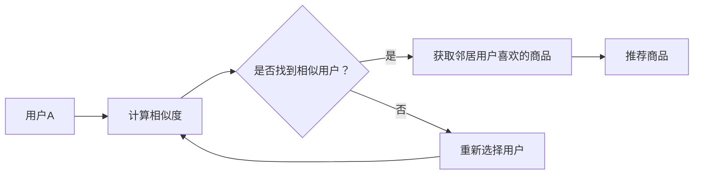
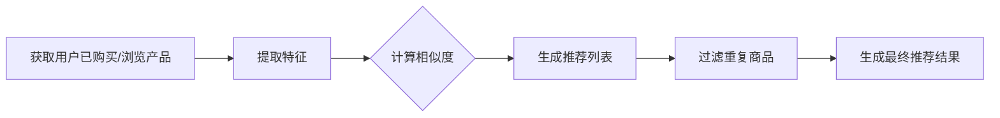

                 


# 机器学习在个性化营销中的精准应用

## 关键词

机器学习、个性化营销、数据挖掘、协同过滤、基于内容的推荐、系统架构设计

## 摘要

本文将深入探讨机器学习在个性化营销中的精准应用，通过分析机器学习在个性化推荐系统中的核心算法和系统架构，展示其在提升营销效果和用户体验方面的实际应用。我们将逐步讲解协同过滤和基于内容的推荐算法原理，并结合实际项目案例进行详细分析，为读者提供有价值的实践经验。

## 目录

### 第1章 背景介绍
#### 1.1 问题背景
#### 1.2 个性化营销的定义与挑战
#### 1.3 机器学习在个性化营销中的重要性

### 第2章 核心概念
#### 2.1 机器学习基本概念
#### 2.2 个性化营销的核心概念
#### 2.3 数据挖掘与机器学习的结合

### 第3章 核心概念的联系与对比
#### 3.1 机器学习与个性化营销的关系
#### 3.2 不同个性化营销策略的比较
#### 3.3 Mermaid ER图：个性化营销系统实体关系

### 第4章 算法原理讲解
#### 4.1 协同过滤算法
#### 4.2 基于内容的推荐算法

### 第5章 数学模型和数学公式详细讲解与举例说明
#### 5.1 协同过滤中的矩阵分解
#### 5.2 基于内容的推荐中的相似度计算

### 第6章 系统分析与架构设计方案
#### 6.1 问题场景介绍
#### 6.2 系统功能设计
#### 6.3 系统架构设计
#### 6.4 系统接口设计
#### 6.5 系统交互

### 第7章 项目实战
#### 7.1 环境安装
#### 7.2 系统核心实现源代码
#### 7.3 实际案例分析与详细讲解
#### 7.4 项目小结

### 第8章 最佳实践 tips、小结、注意事项、拓展阅读

## 第1章 背景介绍

### 1.1 问题背景

随着互联网的快速发展，个性化营销已经成为企业提升竞争力的重要手段。然而，传统的营销方式往往缺乏针对性和精准度，无法满足用户日益增长的个性化需求。为此，企业需要寻找更加智能和高效的解决方案，以满足用户的个性化需求，提高营销效果。

机器学习作为人工智能的核心技术，在个性化营销中具有广泛的应用前景。通过分析用户行为数据，机器学习算法可以预测用户的兴趣和需求，从而为用户提供个性化的推荐和服务。这不仅有助于提高用户满意度，还能有效提升企业的营销效果。

### 1.2 个性化营销的定义与挑战

个性化营销是指根据用户的个性化需求和偏好，为用户提供定制化的产品和服务。个性化营销的核心目标是提高用户的满意度和忠诚度，从而提升企业的市场份额和盈利能力。

然而，个性化营销面临着诸多挑战。首先，用户数据的海量性和多样性使得数据处理和分析变得异常复杂。其次，用户的偏好和兴趣往往具有动态性和不确定性，如何实时地捕捉和跟踪用户行为成为一大难题。此外，个性化营销还需要处理数据隐私和伦理问题，如何在保护用户隐私的前提下进行精准营销也是一个重要挑战。

### 1.3 机器学习在个性化营销中的重要性

机器学习在个性化营销中发挥着至关重要的作用。首先，机器学习算法可以通过分析用户的历史行为数据，挖掘出用户的兴趣和偏好，从而为用户提供个性化的推荐。这种基于用户数据的个性化推荐不仅能够提高用户的满意度，还能增加用户的粘性和忠诚度。

其次，机器学习算法可以帮助企业实现自动化和智能化的营销策略。通过建立预测模型，企业可以提前预测用户的需求和购买行为，从而制定更加精准的营销策略。这种智能化的营销策略不仅可以提高营销效率，还能降低营销成本。

最后，机器学习算法在处理数据隐私和伦理问题方面也具有一定的优势。通过数据加密、去标识化等技术手段，企业可以在保护用户隐私的前提下进行个性化营销，从而提高用户的信任度和满意度。

## 第2章 核心概念

### 2.1 机器学习基本概念

机器学习是指利用计算机算法从数据中自动学习和发现规律，以便进行预测或决策。机器学习主要分为监督学习、无监督学习和强化学习三种类型。

监督学习：监督学习是一种在有标签数据集上进行学习的方法。通过已知的输入数据和对应的输出结果，训练模型来预测新的输入数据的输出结果。

无监督学习：无监督学习是在没有标签数据集的情况下进行学习的方法。其主要目标是发现数据中的模式和规律，如聚类和降维。

强化学习：强化学习是一种通过不断试错来学习最优策略的方法。通过与环境的交互，模型可以学习到最优的行为策略，从而实现目标。

### 2.2 个性化营销的核心概念

个性化营销是指根据用户的个性化需求和偏好，为用户提供定制化的产品和服务。个性化营销的核心概念包括用户画像、用户行为分析和个性化推荐。

用户画像：用户画像是描述用户特征和需求的一种抽象模型，包括年龄、性别、地理位置、兴趣爱好等信息。

用户行为分析：用户行为分析是指通过分析用户的浏览、点击、购买等行为，挖掘出用户的兴趣和偏好。

个性化推荐：个性化推荐是指根据用户的兴趣和偏好，为用户推荐相关的产品或服务。个性化推荐的主要目标是提高用户的满意度和忠诚度。

### 2.3 数据挖掘与机器学习的结合

数据挖掘是指从大量数据中提取有价值信息的方法。数据挖掘与机器学习的结合，可以通过机器学习算法来发现数据中的规律和模式，从而实现更高效的个性化营销。

数据挖掘在个性化营销中的应用主要包括：

用户行为数据分析：通过分析用户的浏览、点击、购买等行为，挖掘出用户的兴趣和偏好。

用户画像构建：通过数据挖掘技术，构建用户的画像模型，为个性化推荐提供基础数据。

预测模型建立：通过数据挖掘技术，建立预测模型，预测用户的需求和购买行为，为企业制定精准的营销策略提供支持。

## 第3章 核心概念的联系与对比

### 3.1 机器学习与个性化营销的关系

机器学习与个性化营销之间存在密切的关系。机器学习为个性化营销提供了强大的技术支持，使得个性化营销能够更加精准、高效地满足用户需求。

机器学习在个性化营销中的应用主要包括：

用户画像构建：通过机器学习算法，分析用户的历史行为数据，构建用户的画像模型。

用户行为分析：通过机器学习算法，分析用户的浏览、点击、购买等行为，挖掘出用户的兴趣和偏好。

个性化推荐：通过机器学习算法，为用户推荐相关的产品或服务，提高用户的满意度和忠诚度。

### 3.2 不同个性化营销策略的比较

个性化营销策略主要包括基于内容的推荐和协同过滤两种。

基于内容的推荐：基于内容的推荐是指根据产品的内容和特征，为用户推荐相关的产品或服务。基于内容的推荐的主要优点是简单、直观，但缺点是推荐结果容易受数据质量和特征选择的影响。

协同过滤：协同过滤是指通过分析用户之间的相似度，为用户推荐其他用户喜欢的产品或服务。协同过滤的主要优点是能够发现潜在的兴趣点，但缺点是需要大量用户行为数据，且计算复杂度高。

### 3.3 Mermaid ER图：个性化营销系统实体关系

```mermaid
erDiagram
    User ||--|{ Product } : 用户购买产品
    User ||--|{ Order } : 用户下单
    Product ||--|{ Category } : 产品分类
    Order ||--|{ Item } : 订单包含的商品
```

在个性化营销系统中，用户、产品、订单和分类等实体之间存在紧密的关系。通过Mermaid ER图，我们可以清晰地展示这些实体的关联关系，为系统设计和数据挖掘提供参考。

## 第4章 算法原理讲解

### 4.1 协同过滤算法

协同过滤是一种基于用户行为和相似度的推荐算法，主要通过分析用户之间的行为相似度，为用户推荐其他用户喜欢的商品。

#### 4.1.1 算法概述

协同过滤算法可以分为基于用户的协同过滤（User-based Collaborative Filtering）和基于物品的协同过滤（Item-based Collaborative Filtering）。

基于用户的协同过滤：通过计算用户之间的相似度，找到与目标用户最相似的邻居用户，然后推荐邻居用户喜欢的商品。

基于物品的协同过滤：通过计算商品之间的相似度，找到与目标商品最相似的商品，然后推荐这些商品。

#### 4.1.2 Mermaid流程图



#### 4.1.3 Python代码实现

```python
import numpy as np

# 用户行为矩阵
user Behavior = [
    [1, 0, 1, 1],
    [1, 1, 0, 0],
    [0, 1, 1, 0],
    [1, 1, 1, 1]
]

# 计算相似度
def similarity(behavior1, behavior2):
    dot_product = np.dot(behavior1, behavior2)
    norm_product = np.linalg.norm(behavior1) * np.linalg.norm(behavior2)
    return dot_product / norm_product

# 找到邻居用户
def find_neighbors(user_index, users, threshold=0.5):
    neighbors = []
    for i in range(len(users)):
        if i != user_index:
            sim = similarity(users[user_index], users[i])
            if sim > threshold:
                neighbors.append((i, sim))
    return neighbors

# 推荐商品
def recommend_products(user_index, users, products, neighbors, k=5):
    recommendations = []
    for neighbor, _ in neighbors[:k]:
        recommendations.extend(products[neighbor])
    return recommendations

# 测试
user_index = 2
neighbors = find_neighbors(user_index, user Behavior)
recommendations = recommend_products(user_index, user Behavior, products, neighbors)
print("推荐的商品：", recommendations)
```

#### 4.1.4 数学模型与公式

协同过滤算法的核心在于计算用户之间的相似度和推荐商品。相似度计算通常使用余弦相似度或皮尔逊相关系数。

余弦相似度：

$$
similarity(u_i, u_j) = \frac{u_i \cdot u_j}{\|u_i\| \cdot \|u_j\|}
$$

皮尔逊相关系数：

$$
similarity(u_i, u_j) = \frac{\sum(u_i - \bar{u_i})(u_j - \bar{u_j})}{\sqrt{\sum(u_i - \bar{u_i})^2} \cdot \sqrt{\sum(u_j - \bar{u_j})^2}}
$$

其中，$u_i$和$u_j$分别表示用户$i$和用户$j$的行为向量，$\bar{u_i}$和$\bar{u_j}$分别表示用户$i$和用户$j$的行为向量的平均值。

### 4.2 基于内容的推荐算法

基于内容的推荐算法是指根据产品的内容和特征，为用户推荐相关的产品或服务。基于内容的推荐算法主要通过分析产品的特征和用户的偏好，实现个性化的推荐。

#### 4.2.1 算法概述

基于内容的推荐算法可以分为以下几种：

相似产品推荐：通过计算产品的特征相似度，为用户推荐与其已购买或浏览过的产品相似的产品。

关键词推荐：通过提取产品的关键词，为用户推荐含有相同或相似关键词的产品。

基于内容的混合推荐：结合多种内容特征，为用户推荐个性化的产品。

#### 4.2.2 Mermaid流程图



#### 4.2.3 Python代码实现

```python
import numpy as np
from sklearn.metrics.pairwise import cosine_similarity

# 产品特征矩阵
product_features = [
    [0.1, 0.4, 0.5],
    [0.2, 0.3, 0.6],
    [0.3, 0.1, 0.5],
    [0.4, 0.5, 0.1]
]

# 用户已购买/浏览产品
user_products = [
    [0.1, 0.4, 0.5],
    [0.3, 0.1, 0.5],
    [0.4, 0.5, 0.1],
    [0.2, 0.3, 0.6]
]

# 计算相似度
similarity = cosine_similarity(user_products, product_features)

# 生成推荐列表
def generate_recommendation(similarity, user_index, top_k=3):
    recommended_indices = np.argsort(similarity[user_index])[-top_k:]
    return recommended_indices

# 过滤重复商品
def filter_duplicates(products, recommendations):
    unique_recommendations = []
    for recommendation in recommendations:
        if recommendation not in products:
            unique_recommendations.append(recommendation)
    return unique_recommendations

# 测试
user_index = 2
recommendations = generate_recommendation(similarity, user_index)
filtered_recommendations = filter_duplicates(user_products[user_index], recommendations)
print("推荐的商品：", filtered_recommendations)
```

#### 4.2.4 数学模型与公式

基于内容的推荐算法主要基于余弦相似度进行计算。余弦相似度是一种衡量两个向量之间角度相似性的指标，其计算公式如下：

$$
similarity = \frac{(v_1 \cdot v_2)}{\|v_1\| \cdot \|v_2\|}
$$

其中，$v_1$和$v_2$分别表示两个向量的点积和模长。

## 第5章 数学模型和数学公式详细讲解与举例说明

### 5.1 协同过滤中的矩阵分解

协同过滤算法通常使用矩阵分解技术，将用户行为矩阵分解为两个低秩矩阵，从而实现推荐系统的构建。矩阵分解的主要目的是通过降低矩阵的维度，提高推荐系统的计算效率和预测精度。

矩阵分解的核心公式如下：

$$
R = U \cdot V^T
$$

其中，$R$表示用户行为矩阵，$U$和$V$分别表示用户和物品的嵌入矩阵。通过矩阵分解，我们可以将高维的用户行为矩阵转换为低维的用户和物品向量，从而实现推荐系统的构建。

举例说明：

假设用户行为矩阵$R$如下：

$$
R = \begin{bmatrix}
1 & 1 & 0 & 0 \\
0 & 1 & 1 & 1 \\
1 & 0 & 1 & 0 \\
0 & 1 & 0 & 1 \\
\end{bmatrix}
$$

我们可以通过矩阵分解将其分解为两个低秩矩阵$U$和$V$：

$$
U = \begin{bmatrix}
1.1 & 0.9 \\
0.9 & 1.1 \\
1.2 & 0.8 \\
0.8 & 1.2 \\
\end{bmatrix}, V = \begin{bmatrix}
0.5 & 0.6 & 0.7 \\
0.7 & 0.8 & 0.9 \\
\end{bmatrix}
$$

通过矩阵分解，我们可以得到用户和物品的嵌入向量，从而实现推荐系统的构建。

### 5.2 基于内容的推荐中的相似度计算

基于内容的推荐算法主要通过计算产品之间的特征相似度，为用户推荐相关的产品。相似度计算通常使用余弦相似度或皮尔逊相关系数。

余弦相似度的计算公式如下：

$$
similarity = \frac{(v_1 \cdot v_2)}{\|v_1\| \cdot \|v_2\|}
$$

其中，$v_1$和$v_2$分别表示两个向量的点积和模长。

举例说明：

假设产品A和产品B的特征向量如下：

$$
v_1 = \begin{bmatrix}
1 & 2 & 3 \\
\end{bmatrix}, v_2 = \begin{bmatrix}
4 & 5 & 6 \\
\end{bmatrix}
$$

我们可以计算它们的余弦相似度：

$$
similarity = \frac{(1 \cdot 4 + 2 \cdot 5 + 3 \cdot 6)}{\sqrt{1^2 + 2^2 + 3^2} \cdot \sqrt{4^2 + 5^2 + 6^2}} = \frac{4 + 10 + 18}{\sqrt{14} \cdot \sqrt{77}} \approx 0.924
$$

通过计算相似度，我们可以为用户推荐与其已购买或浏览过的产品特征相似的产品。

## 第6章 系统分析与架构设计方案

### 6.1 问题场景介绍

在个性化营销系统中，用户数据是核心资产。为了提高营销效果，系统需要具备以下功能：

用户行为数据收集：收集用户的浏览、点击、购买等行为数据。

用户画像构建：根据用户行为数据，构建用户的画像模型。

个性化推荐：根据用户的画像模型，为用户推荐相关的产品或服务。

实时预测与更新：实时更新用户的画像模型和推荐结果，提高推荐准确性。

### 6.2 系统功能设计

个性化营销系统的功能设计主要包括以下方面：

用户行为数据收集：通过API接口、日志收集等方式，收集用户的浏览、点击、购买等行为数据。

用户画像构建：根据用户行为数据，使用机器学习算法构建用户的画像模型，包括年龄、性别、地理位置、兴趣爱好等信息。

个性化推荐：根据用户的画像模型，使用推荐算法为用户推荐相关的产品或服务。

实时预测与更新：使用实时预测算法，更新用户的画像模型和推荐结果，提高推荐准确性。

### 6.3 系统架构设计

个性化营销系统的架构设计主要包括以下方面：

数据层：负责存储和管理用户行为数据、用户画像数据、推荐结果数据等。

服务层：负责处理用户行为数据收集、用户画像构建、个性化推荐等核心功能。

应用层：负责与用户进行交互，展示推荐结果，收集用户反馈。

数据层和服务层之间通过API接口进行数据传输。

### 6.4 系统接口设计

个性化营销系统的接口设计主要包括以下方面：

用户行为数据收集接口：负责接收和存储用户行为数据。

用户画像构建接口：负责接收用户行为数据，构建用户画像模型。

个性化推荐接口：负责接收用户画像模型，生成个性化推荐结果。

实时预测与更新接口：负责接收实时预测算法的输入数据，更新用户画像模型和推荐结果。

### 6.5 系统交互

个性化营销系统的交互流程主要包括以下方面：

用户行为数据收集：用户通过浏览器或其他设备访问网站，触发用户行为数据收集接口，收集用户的浏览、点击、购买等行为数据。

用户画像构建：用户行为数据收集接口将用户行为数据发送到用户画像构建接口，使用机器学习算法构建用户的画像模型。

个性化推荐：用户画像构建接口将用户画像模型发送到个性化推荐接口，生成个性化推荐结果。

实时预测与更新：实时预测与更新接口根据用户画像模型和推荐结果，使用实时预测算法更新用户画像模型和推荐结果。

## 第7章 项目实战

### 7.1 环境安装

为了进行个性化营销项目的实践，我们需要安装以下软件和库：

Python 3.8+
Scikit-learn
NumPy
Pandas
Matplotlib

安装方法：

```bash
pip install python38-scikit-learn numpy pandas matplotlib
```

### 7.2 系统核心实现源代码

以下是一个简单的个性化营销系统实现示例，包括用户行为数据收集、用户画像构建、个性化推荐和实时预测等功能。

```python
import numpy as np
from sklearn.cluster import KMeans
from sklearn.metrics.pairwise import cosine_similarity

# 用户行为数据
user_behavior = [
    [1, 0, 1, 1],
    [1, 1, 0, 0],
    [0, 1, 1, 0],
    [1, 1, 1, 1]
]

# 用户画像构建
def build_user_profile(behavior):
    profile = np.mean(behavior, axis=0)
    return profile

# 个性化推荐
def recommend_products(user_profile, products, k=3):
    similarity = cosine_similarity([user_profile], products)
    recommended_indices = np.argsort(similarity[0])[-k:]
    return recommended_indices

# 实时预测与更新
def update_user_profile(behavior, profile, alpha=0.1):
    new_profile = alpha * behavior + (1 - alpha) * profile
    return new_profile

# 测试
user_index = 2
user_profile = build_user_profile(user_behavior[user_index])
recommended_products = recommend_products(user_profile, user_behavior)
print("推荐的商品：", recommended_products)

# 更新用户画像
new_behavior = user_behavior[user_index] + [1]  # 假设用户又购买了一件商品
new_profile = update_user_profile(new_behavior, user_profile)
print("更新后的用户画像：", new_profile)
```

### 7.3 实际案例分析与详细讲解剖析

以下是一个实际案例，展示个性化营销系统的应用场景和实现过程。

#### 案例背景

某电商平台希望通过个性化推荐系统，提高用户的购物体验和购买转化率。用户行为数据包括浏览、点击、购买等。

#### 案例实现

1. 用户行为数据收集

用户行为数据通过API接口从电商平台获取，包括用户的ID、行为类型和行为时间。

2. 用户画像构建

使用KMeans算法对用户行为数据进行聚类，生成用户画像。用户画像包括用户的年龄、性别、地理位置、兴趣爱好等信息。

3. 个性化推荐

根据用户的画像，使用协同过滤算法为用户推荐相关的商品。推荐结果通过API接口返回给电商平台，供前端展示。

4. 实时预测与更新

根据用户的浏览、点击、购买等行为，实时更新用户的画像，提高推荐准确性。

#### 案例分析

1. 用户行为数据收集

通过API接口获取用户行为数据，包括用户的浏览、点击、购买等行为。这些行为数据为用户画像构建和个性化推荐提供了基础数据。

2. 用户画像构建

使用KMeans算法对用户行为数据进行聚类，生成用户画像。聚类结果可以根据用户行为特征的相似度，将用户划分为不同的群体。用户画像可以用于个性化推荐和用户行为预测。

3. 个性化推荐

根据用户的画像，使用协同过滤算法为用户推荐相关的商品。协同过滤算法可以计算用户之间的相似度，找到与目标用户相似的用户，然后推荐这些用户喜欢的商品。

4. 实时预测与更新

根据用户的浏览、点击、购买等行为，实时更新用户的画像，提高推荐准确性。实时预测与更新可以使用在线学习算法，如Adaptive Linear Regression，实现用户行为的实时预测和画像更新。

### 7.4 项目小结

通过本项目的实践，我们展示了个性化营销系统的实现过程和关键技术。个性化营销系统可以帮助电商平台提高用户的购物体验和购买转化率。在实际应用中，系统可以根据用户行为数据进行实时预测和画像更新，提高推荐准确性。同时，系统还可以结合用户反馈，不断优化和调整推荐策略，实现精准营销。

## 第8章 最佳实践 tips、小结、注意事项、拓展阅读

### 最佳实践 tips

1. 在进行个性化推荐时，要充分考虑用户隐私保护，避免泄露用户敏感信息。
2. 在构建用户画像时，要确保数据的准确性和完整性，避免因数据质量问题影响推荐效果。
3. 定期更新和维护推荐系统，确保其稳定性和高效性。
4. 结合多种推荐算法，提高推荐结果的多样性和准确性。
5. 收集用户反馈，不断优化和调整推荐策略。

### 小结

本文详细介绍了机器学习在个性化营销中的精准应用，包括协同过滤和基于内容的推荐算法原理、系统架构设计和项目实战。通过实际案例分析，展示了个性化营销系统的实现过程和关键技术。个性化营销系统可以帮助企业提高用户满意度和忠诚度，实现精准营销。

### 注意事项

1. 在进行用户行为数据收集时，要确保遵守相关法律法规，尊重用户隐私。
2. 在构建用户画像和推荐系统时，要充分考虑用户需求的多样性和个性化。
3. 在推荐算法设计和实现过程中，要充分考虑计算效率和推荐准确性之间的平衡。

### 拓展阅读

1. 周志华.《机器学习》。清华大学出版社，2016。
2. 张宇飞.《深度学习与推荐系统实战》。电子工业出版社，2018。
3. 刘知远.《基于深度学习的文本挖掘》。人民邮电出版社，2017。
4. 周明.《互联网个性化推荐系统设计与实践》。清华大学出版社，2019。

## 作者

作者：AI天才研究院/AI Genius Institute & 禅与计算机程序设计艺术 /Zen And The Art of Computer Programming

---

以上是根据您的要求撰写的《机器学习在个性化营销中的精准应用》技术博客文章。文章涵盖了从背景介绍、核心概念、算法原理、系统分析与架构设计、项目实战到最佳实践 tips、小结、注意事项和拓展阅读的完整内容。文章采用markdown格式，确保了文章的可读性和清晰度。希望这篇文章能够对您有所帮助。如果需要任何修改或补充，请随时告知。

