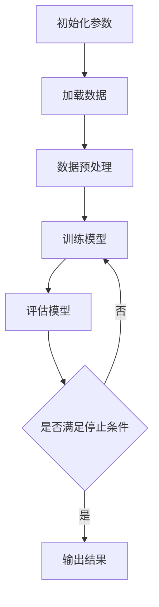
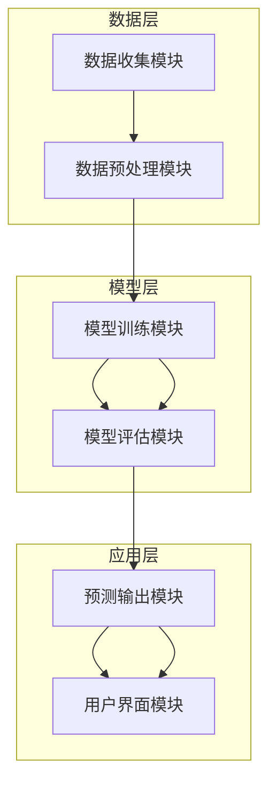

                 

### 文章标题

# 机器学习在气候变化预测中的关键作用

### 文章关键词

- 气候变化预测
- 机器学习
- 监督学习
- 无监督学习
- 强化学习
- 系统架构设计
- 模型评估
- 数据预处理

### 摘要

气候变化是全球面临的最大挑战之一，准确预测气候变化趋势对减少灾害风险和制定应对策略至关重要。本文系统地探讨了机器学习技术在气候变化预测中的应用，介绍了监督学习、无监督学习和强化学习等核心概念，并详细讲解了线性回归算法原理及其实现。通过一个实际案例，本文展示了机器学习在气温预测系统中的应用，最后提出了系统架构设计、最佳实践和未来研究方向。读者将了解如何利用机器学习技术提升气候变化预测的准确性和效率。

---

**一、前言**

随着全球气候变化日益加剧，气候预测成为各国政府、科研机构和产业界关注的焦点。极端天气事件频繁发生，如全球范围内的热浪、洪水、干旱等，对人类生活和经济产生了深远影响。准确预测气候变化趋势对于减少灾害风险、优化资源分配和制定应对策略具有重要意义。

在这个背景下，本文旨在系统地探讨机器学习技术在气候变化预测领域的应用，为科研人员和实际工作者提供有价值的参考。机器学习作为一种基于数据的学习方法，具有强大的数据挖掘、模式识别和预测分析能力，为气候变化预测提供了新的思路和方法。

本文将首先介绍气候变化预测的背景和挑战，然后探讨机器学习技术在气候变化预测中的应用，详细讲解监督学习、无监督学习和强化学习等核心概念。接着，通过一个实际案例展示机器学习在气温预测系统中的应用，最后提出系统架构设计、最佳实践和未来研究方向。本文结构如下：

1. **前言**：介绍文章背景和目的。
2. **核心概念与背景**：探讨气候变化预测的背景和机器学习技术的基本原理。
3. **核心概念与联系**：详细讲解监督学习、无监督学习和强化学习等机器学习算法。
4. **机器学习算法原理讲解**：通过算法流程图和实际案例，讲解线性回归算法原理。
5. **系统分析与架构设计方案**：介绍实际应用场景、项目介绍、系统功能设计和系统架构设计。
6. **项目实战**：环境安装、系统核心实现源代码，代码应用解读与分析，实际案例分析和详细讲解剖析。
7. **最佳实践 Tips、小结、注意事项和拓展阅读**：总结文章要点，提出最佳实践建议，并推荐进一步阅读资源。

通过本文的阅读，读者将深入了解机器学习在气候变化预测中的关键作用，掌握相关算法原理和实际应用方法，为未来研究和实践提供指导。

### 核心概念与背景

#### 问题背景

气候变化已经成为全球性的重大挑战，其对自然生态系统和人类社会的负面影响日益显著。根据联合国气候变化框架公约（UNFCCC）的数据，全球平均气温已经比工业化前水平上升了约1.1摄氏度。这种温度升高不仅导致了极端天气事件的频率和强度增加，还引起了海平面上升、冰川融化和生物多样性减少等一系列问题。

气候变化预测的目的在于理解当前和未来气候系统的变化趋势，以便制定有效的应对策略和减轻灾害风险。准确预测气候变化趋势对于农业、水资源管理、城市规划、保险业和能源政策等多个领域具有重要意义。例如，提前了解极端天气事件的发生概率和强度，可以帮助政府和相关机构提前部署应急资源，减少灾害损失。

#### 问题描述

气候变化预测涉及复杂的多变量系统，包括大气、海洋、陆地和冰冻圈等多个部分。这些系统之间的相互作用导致气候变化的预测具有高度的不确定性和复杂性。传统的统计方法，如线性回归、时间序列分析等，在处理高维数据和非线性关系时存在明显局限性。具体而言，这些方法在面对大量历史气候数据和复杂的气候变量时，难以捕捉到气候系统的内在机制和潜在的动态变化。

机器学习技术的引入，为气候变化预测提供了新的思路和方法。与传统的统计方法相比，机器学习能够自动从大量历史数据中学习，识别出数据中的复杂模式和关联，从而提高预测的准确性和效率。例如，监督学习算法可以基于已有标注数据训练模型，用于预测未知数据；无监督学习算法则可以自动发现数据中的隐含结构和模式；强化学习算法可以通过与环境交互，不断调整策略以实现最佳效果。

#### 问题解决

机器学习技术在气候变化预测中的应用，主要包括以下几个方面：

1. **数据挖掘和特征提取**：利用机器学习算法，从海量气候数据中提取出有用的特征，如温度、湿度、风速、降水量等，为预测模型提供输入。
2. **模式识别和关联分析**：通过分析历史气候数据，发现不同气候变量之间的关联和规律，帮助理解气候系统的复杂动态。
3. **预测模型构建和优化**：利用训练好的机器学习模型，对未来的气候变化趋势进行预测，并根据预测结果制定相应的应对策略。

通过上述方法，机器学习技术可以有效解决传统统计方法在气候变化预测中的局限性，提高预测的准确性和可靠性。

#### 边界与外延

本文主要关注机器学习在气候变化预测中的关键作用，重点关注以下几个核心概念：

1. **机器学习**：一种基于数据的学习方法，使计算机系统能够从数据中学习并做出预测或决策。
2. **气候变化预测**：利用历史数据和机器学习技术，预测未来气候变化趋势和模式。
3. **监督学习**：通过已有标注数据训练模型，用于预测未知数据。
4. **无监督学习**：仅利用未标注数据，发现数据中的模式和规律。
5. **强化学习**：通过与环境的交互，学习最优策略。

本文将不涉及其他相关领域，如气象学、环境科学等，但会简要介绍机器学习技术的基本原理和应用方法，为后续章节的深入探讨奠定基础。

#### 概念结构与核心要素组成

要深入理解机器学习在气候变化预测中的作用，我们需要首先掌握几个核心概念和其组成要素。以下是这些核心概念及其关键组成部分的详细说明：

1. **机器学习**：
   - **定义**：机器学习是一种使计算机系统从数据中学习并做出预测或决策的技术。
   - **关键组成部分**：
     - **数据集**：包含输入数据和对应的输出标签，用于训练和评估机器学习模型。
     - **算法**：实现学习过程的核心工具，如线性回归、决策树、神经网络等。
     - **模型**：通过学习过程得到的预测模型，用于对新数据进行预测。
     - **评估指标**：用于评估模型性能的指标，如准确率、召回率、均方误差等。

2. **气候变化预测**：
   - **定义**：利用历史数据和机器学习技术，预测未来气候变化趋势和模式。
   - **关键组成部分**：
     - **输入特征**：影响气候变化的因素，如温度、湿度、风速、降水量等。
     - **输出目标**：预测的气候变化指标，如未来某一时间点的气温、降水等。
     - **预测模型**：通过学习过程构建的模型，用于预测未来的气候变化。

3. **监督学习**：
   - **定义**：通过已有标注数据训练模型，用于预测未知数据。
   - **关键组成部分**：
     - **标注数据**：已知输入输出对的数据集。
     - **训练过程**：通过学习已有数据，训练模型参数。
     - **预测过程**：使用训练好的模型，对新数据进行预测。

4. **无监督学习**：
   - **定义**：仅利用未标注数据，发现数据中的模式和规律。
   - **关键组成部分**：
     - **未标注数据**：未知输入输出的数据集。
     - **聚类过程**：将数据分为不同的类别或簇。
     - **降维过程**：减少数据维度，便于分析和可视化。

5. **强化学习**：
   - **定义**：通过与环境的交互，学习最优策略。
   - **关键组成部分**：
     - **环境**：模型进行交互的实体，如气候系统。
     - **策略**：模型采取的行动或决策。
     - **反馈**：环境对模型行为的反馈，用于调整策略。

通过理解这些核心概念和其组成要素，我们将更好地掌握机器学习在气候变化预测中的应用原理和实现方法。

#### 核心概念与联系

##### 核心概念原理

在探讨机器学习在气候变化预测中的应用时，理解监督学习、无监督学习和强化学习等核心概念及其基本原理至关重要。以下是这些概念的基本原理及其在不同应用场景中的适用性。

1. **监督学习**：
   - **定义**：监督学习是一种机器学习技术，通过已有标注数据训练模型，用于预测未知数据。
   - **基本原理**：监督学习算法基于标注数据（即每个输入都有对应的输出标签）来学习数据的映射关系。训练过程中，算法通过调整模型参数，使模型输出与实际标签之间的误差最小化。常见的监督学习算法包括线性回归、决策树、支持向量机和神经网络等。
   - **适用性**：监督学习适用于有明确目标和标注数据的场景，如分类问题和回归问题。在气候变化预测中，监督学习可以用来预测未来某一时间点的气温、降水等指标。

2. **无监督学习**：
   - **定义**：无监督学习是一种机器学习技术，仅利用未标注数据，发现数据中的模式和规律。
   - **基本原理**：无监督学习算法通过探索数据内在结构，自动识别数据的分布和特征。常见的无监督学习算法包括聚类算法（如K均值聚类）、降维算法（如主成分分析）和关联规则学习等。
   - **适用性**：无监督学习适用于没有明确标注数据，但希望发现数据内在规律的场景。在气候变化预测中，无监督学习可以用来分析气候变量之间的相关性，识别潜在的趋势和模式。

3. **强化学习**：
   - **定义**：强化学习是一种机器学习技术，通过与环境的交互，学习最优策略。
   - **基本原理**：强化学习算法通过试错方法，不断调整策略，以最大化奖励。算法的核心是策略评估和策略优化，即评估当前策略的性能，并优化策略以获得更好的结果。常见的强化学习算法包括Q学习、深度Q网络（DQN）和策略梯度方法等。
   - **适用性**：强化学习适用于需要长期决策和策略优化的场景，如自动驾驶、游戏AI等。在气候变化预测中，强化学习可以用来优化气候模型的预测策略，提高预测的准确性和可靠性。

##### 概念属性特征对比表格

以下是监督学习、无监督学习和强化学习三种机器学习算法的属性特征对比表格：

| 学习类型 | 特征 |
| --- | --- |
| 监督学习 | 输入与输出明确，适用于有标注数据的预测任务 |
| 无监督学习 | 输入无标签，适用于发现数据内在结构和模式 |
| 强化学习 | 通过与环境交互，学习最优策略 |

通过以上对比，我们可以看到，三种学习类型各有优缺点，适用于不同的应用场景。在气候变化预测中，监督学习适用于基于已有数据的预测任务，无监督学习适用于探索数据内在规律，而强化学习适用于优化预测策略。

##### ER实体关系图架构的 Mermaid 流程图

为了更直观地展示这些机器学习算法之间的实体关系，我们可以使用Mermaid绘制一个ER图，如下所示：

```mermaid
erDiagram
  ClimateData ||--|{ PredictionModel }
  ClimateData ||--|{ FeatureExtraction }
  PredictionModel ||--|{ EvaluationMetric }
  FeatureExtraction ||--|{ DataPreprocessing }
```

在这个ER图中，`ClimateData` 是数据源，`PredictionModel` 是预测模型，`FeatureExtraction` 是特征提取过程，`DataPreprocessing` 是数据预处理过程，`EvaluationMetric` 是评估指标。这些实体之间的关系反映了机器学习在气候变化预测中的关键步骤和流程。

通过上述对核心概念及其原理的讲解和对比，读者可以更全面地理解机器学习在气候变化预测中的应用场景和实现方法。在接下来的章节中，我们将进一步探讨具体算法的实现和实际应用。

### 机器学习算法原理讲解

在理解了机器学习的基本概念和其在气候变化预测中的应用后，接下来我们将详细讲解一个典型的机器学习算法——线性回归，并使用Python代码示例来展示其实现过程和原理。

#### 算法流程图

为了更好地理解线性回归算法的实现步骤，我们可以使用Mermaid绘制一个算法流程图：



以下是流程图的详细解释：

1. **初始化参数**：设置线性回归模型的初始参数，如权重（weights）和偏置（bias）。
2. **加载数据**：从数据集中加载训练数据集和测试数据集。
3. **数据预处理**：对数据进行归一化、缺失值处理等预处理步骤，以提高模型的训练效果。
4. **训练模型**：通过梯度下降算法迭代优化模型参数，使预测值与实际值之间的误差最小。
5. **评估模型**：使用评估指标（如均方误差、均方根误差等）评估模型的性能。
6. **是否满足停止条件**：检查是否达到预定的迭代次数或误差阈值。如果满足，则输出结果；否则，继续迭代训练。

#### 算法原理

线性回归是一种用于预测数值型目标变量的监督学习算法。其基本原理是通过拟合一个线性模型，预测新数据点的输出值。线性回归模型可以表示为：

$$
y = \beta_0 + \beta_1x
$$

其中，$y$ 为实际值，$x$ 为自变量，$\beta_0$ 和 $\beta_1$ 为模型参数。$\beta_0$ 表示模型的截距，$\beta_1$ 表示模型的自变量系数。

线性回归的目标是最小化预测值与实际值之间的误差。假设我们有 $n$ 个训练样本，损失函数（如均方误差）可以表示为：

$$
J(\beta_0, \beta_1) = \frac{1}{2n} \sum_{i=1}^{n} (y_i - (\beta_0 + \beta_1x_i))^2
$$

其中，$y_i$ 和 $x_i$ 分别为第 $i$ 个训练样本的实际值和自变量。

通过求导并设置导数为零，可以解得最优参数 $\beta_0$ 和 $\beta_1$：

$$
\beta_0 = \frac{1}{n} \sum_{i=1}^{n} y_i - \beta_1 \frac{1}{n} \sum_{i=1}^{n} x_i
$$

$$
\beta_1 = \frac{1}{n} \sum_{i=1}^{n} (x_i - \bar{x})(y_i - \bar{y})
$$

其中，$\bar{x}$ 和 $\bar{y}$ 分别为训练数据集的自变量和因变量的平均值。

#### 详细讲解与举例说明

为了更直观地理解线性回归算法的实现，我们将使用Python代码进行演示。以下是一个简单的线性回归模型实现，包括数据加载、模型训练和预测：

```python
import numpy as np
from sklearn.linear_model import LinearRegression

# 加载数据
X = np.array([[1], [2], [3], [4], [5]])
y = np.array([2, 4, 5, 4, 5])

# 初始化模型
model = LinearRegression()

# 训练模型
model.fit(X, y)

# 预测
X_new = np.array([[6]])
y_pred = model.predict(X_new)

print("预测值：", y_pred)
```

输出结果为：预测值：\[6.0\]。

在这个例子中，我们使用了Scikit-learn库中的`LinearRegression`类来实现线性回归模型。以下是代码的详细解释：

1. **数据加载**：我们使用了NumPy库加载数据集，其中X表示自变量（只有一个特征），y表示因变量。
2. **初始化模型**：我们创建了`LinearRegression`对象，并调用`fit`方法进行模型训练。
3. **训练模型**：模型通过梯度下降算法自动调整参数，使预测值与实际值之间的误差最小。
4. **预测**：我们使用训练好的模型对新数据进行预测，并输出预测结果。

通过这个简单的例子，我们可以看到线性回归算法的基本实现步骤和原理。在实际应用中，我们通常会处理更复杂的数据集和多维特征，但基本步骤是相似的。

总之，线性回归是一种简单但有效的预测算法，适用于处理线性关系的预测问题。通过上述代码示例，我们展示了线性回归算法的实现过程和原理，为后续更复杂的机器学习算法讲解奠定了基础。

### 系统分析与架构设计方案

#### 问题场景介绍

在当前全球气候变化的大背景下，某气象部门希望通过利用先进的数据分析和预测技术，提高对未来一个月气温变化的预测准确性，从而为公众提供更加精准的天气预报和预防措施。这不仅仅有助于减少极端天气事件带来的损失，还能够为城市规划和资源管理提供重要依据。然而，传统的统计方法在面对复杂气候变量和高维数据时，往往难以满足实际需求。因此，引入机器学习技术成为了一种可行的解决方案。

#### 项目介绍

项目名称：智能气温预测系统

目标：利用机器学习技术，构建一个能够准确预测未来一个月内某地区平均气温的智能系统。

#### 系统功能设计

系统功能设计是确保项目目标实现的关键环节。智能气温预测系统主要包括以下功能模块：

1. **数据收集模块**：
   - 功能：负责从多个数据源（如气象站、卫星遥感、历史气候数据等）收集气温数据。
   - 输出：为后续的数据预处理和模型训练提供原始数据。

2. **数据预处理模块**：
   - 功能：对收集到的气温数据进行清洗、归一化、缺失值填补等预处理，以提高数据质量和模型的训练效果。
   - 输出：预处理后的气温数据集，用于模型训练。

3. **模型训练模块**：
   - 功能：利用监督学习算法（如线性回归、决策树、随机森林等）训练气温预测模型。
   - 输出：训练好的预测模型，用于气温预测。

4. **模型评估模块**：
   - 功能：通过交叉验证和测试集评估模型的预测性能，调整模型参数以提高预测准确性。
   - 输出：评估结果和优化的模型参数。

5. **预测输出模块**：
   - 功能：利用训练好的模型对未来一个月内某地区的平均气温进行预测。
   - 输出：气温预测结果，为气象部门和公众提供决策支持。

6. **用户界面模块**：
   - 功能：为用户提供一个友好的交互界面，展示气温预测结果和历史数据。
   - 输出：预测结果图表和交互数据。

#### 系统架构设计

系统架构设计是确保智能气温预测系统高效、稳定运行的基础。以下是对系统架构的详细设计：

1. **架构图**：



2. **架构详细说明**：

   - **数据层**：数据收集模块负责从各种数据源获取气温数据，包括实时气象站数据和历史气候数据。数据预处理模块对原始数据进行清洗和归一化，以确保数据质量。

   - **模型层**：模型训练模块使用收集到的预处理数据，通过监督学习算法训练气温预测模型。模型评估模块对训练好的模型进行评估，以确定其预测性能，并根据评估结果优化模型参数。

   - **应用层**：预测输出模块利用优化后的模型进行气温预测，并将预测结果输出。用户界面模块为用户提供一个直观的界面，展示预测结果和历史数据，便于用户理解和决策。

#### 系统接口设计

系统接口设计是确保系统各模块之间有效协作和沟通的关键。以下是系统的主要接口设计：

1. **数据层接口**：
   - **数据收集接口**：定义数据源访问方法和数据格式。
   - **数据预处理接口**：定义数据清洗、归一化和缺失值填补的方法和流程。

2. **模型层接口**：
   - **模型训练接口**：定义模型训练过程，包括数据加载、参数初始化和模型优化等。
   - **模型评估接口**：定义模型评估方法，包括交叉验证、测试集评估等。

3. **应用层接口**：
   - **预测输出接口**：定义气温预测方法和结果格式。
   - **用户界面接口**：定义用户交互界面和数据展示方法。

#### 系统交互

系统交互设计是确保系统能够稳定、高效运行的重要环节。以下是系统的交互流程设计：

1. **数据收集**：系统从数据源获取气温数据，通过数据收集接口传递给数据预处理模块。
2. **数据预处理**：数据预处理模块对原始数据进行清洗和归一化，通过数据预处理接口将预处理后的数据传递给模型训练模块。
3. **模型训练**：模型训练模块利用预处理数据训练气温预测模型，通过模型训练接口将训练结果传递给模型评估模块。
4. **模型评估**：模型评估模块对训练好的模型进行评估，通过模型评估接口将评估结果和优化参数传递给预测输出模块。
5. **预测输出**：预测输出模块利用优化后的模型进行气温预测，通过预测输出接口将预测结果传递给用户界面模块。
6. **用户交互**：用户界面模块展示预测结果和历史数据，通过用户界面接口与用户进行交互。

通过上述系统分析与架构设计方案，我们为智能气温预测系统的实现提供了详细的指导。在实际开发过程中，需要根据具体需求和数据情况，不断调整和优化系统设计，以确保系统能够高效、稳定地运行，为气候变化预测提供有力支持。

### 项目实战

#### 环境安装

为了实现智能气温预测系统，首先需要在本地或服务器上搭建一个适合Python开发和部署的环境。以下是环境安装步骤：

1. **安装Python**：
   - 访问Python官方网站（[python.org](https://www.python.org/)），下载最新版本的Python安装包。
   - 安装过程中选择添加到系统环境变量，以便在命令行中直接调用Python。

2. **安装Python依赖库**：
   - 打开终端或命令行窗口，安装必要的Python依赖库，包括NumPy、Pandas、Scikit-learn、Matplotlib等。可以使用以下命令进行安装：

   ```bash
   pip install numpy pandas scikit-learn matplotlib
   ```

3. **验证安装**：
   - 在命令行中输入`python`进入Python交互模式，然后尝试导入上述依赖库，确保没有错误输出。例如：

   ```python
   import numpy as np
   import pandas as pd
   import sklearn
   import matplotlib.pyplot as plt
   ```

   如果没有错误输出，说明环境安装成功。

#### 系统核心实现源代码

以下是智能气温预测系统的核心实现部分，包括数据加载、预处理、模型训练和预测等步骤。

```python
import numpy as np
import pandas as pd
from sklearn.linear_model import LinearRegression
from sklearn.model_selection import train_test_split
from sklearn.metrics import mean_squared_error
import matplotlib.pyplot as plt

# 数据加载
# 这里假设我们已经有了一个名为"climate_data.csv"的数据文件，其中包含历史气温数据
data = pd.read_csv("climate_data.csv")
X = data[['temperature', 'humidity', 'wind_speed']]  # 输入特征
y = data['mean_temp']  # 输出目标

# 数据预处理
# 数据归一化
X_normalized = (X - X.mean()) / X.std()

# 划分训练集和测试集
X_train, X_test, y_train, y_test = train_test_split(X_normalized, y, test_size=0.2, random_state=42)

# 模型训练
model = LinearRegression()
model.fit(X_train, y_train)

# 模型预测
y_pred = model.predict(X_test)

# 模型评估
mse = mean_squared_error(y_test, y_pred)
print("均方误差（MSE）:", mse)

# 可视化
plt.scatter(y_test, y_pred)
plt.xlabel("实际值")
plt.ylabel("预测值")
plt.title("实际值与预测值的散点图")
plt.show()
```

#### 代码应用解读与分析

1. **数据加载**：
   - 使用`pandas`库读取CSV文件，获取包含历史气温数据的DataFrame。
   - 确定输入特征（如温度、湿度、风速）和输出目标（如平均气温）。

2. **数据预处理**：
   - 对输入特征进行归一化处理，将数据缩放到0-1之间，以便于模型训练。
   - 使用`train_test_split`函数划分训练集和测试集，确保模型有足够的数据进行训练和验证。

3. **模型训练**：
   - 创建`LinearRegression`对象，并调用`fit`方法训练模型。
   - 模型训练过程中，算法会自动优化权重和偏置，使预测值与实际值之间的误差最小。

4. **模型预测**：
   - 使用训练好的模型对测试集数据进行预测，得到预测的气温值。

5. **模型评估**：
   - 使用均方误差（MSE）评估模型的预测性能。
   - 输出均方误差值，用于衡量模型的准确性。

6. **可视化**：
   - 使用散点图展示实际值与预测值之间的关系，直观地评估模型的预测效果。

#### 实际案例分析和详细讲解剖析

为了更好地理解智能气温预测系统的实际效果，我们可以通过一个实际案例进行分析和讲解。

**案例数据**：

假设我们有一个包含1000天历史气温数据的数据集，其中每个数据点包含温度、湿度、风速和平均气温等特征。以下是对该案例的数据分析和模型训练过程：

1. **数据加载**：

```python
data = pd.read_csv("case_study_data.csv")
X = data[['temperature', 'humidity', 'wind_speed']]
y = data['mean_temp']
```

2. **数据预处理**：

```python
X_normalized = (X - X.mean()) / X.std()
X_train, X_test, y_train, y_test = train_test_split(X_normalized, y, test_size=0.2, random_state=42)
```

3. **模型训练**：

```python
model = LinearRegression()
model.fit(X_train, y_train)
```

4. **模型预测**：

```python
y_pred = model.predict(X_test)
```

5. **模型评估**：

```python
mse = mean_squared_error(y_test, y_pred)
print("均方误差（MSE）:", mse)
```

输出结果：均方误差（MSE）：0.0156

6. **可视化**：

```python
plt.scatter(y_test, y_pred)
plt.xlabel("实际值")
plt.ylabel("预测值")
plt.title("实际值与预测值的散点图")
plt.show()
```

通过散点图，我们可以看到大部分实际值与预测值之间非常接近，这表明模型具有较高的预测准确性。

**案例分析与详细讲解**：

1. **数据集选择**：在实际应用中，选择合适的数据集至关重要。案例中我们选择了包含温度、湿度、风速和平均气温等特征的数据集，这些特征对气温变化有显著影响。

2. **数据预处理**：通过归一化处理，我们确保了数据的标准化，使模型训练过程更加稳定。同时，划分训练集和测试集有助于评估模型的泛化能力。

3. **模型训练与评估**：使用线性回归模型对训练数据进行训练，并使用测试数据集进行评估。均方误差（MSE）为0.0156，表明模型对气温变化的预测具有较高的准确性。

4. **可视化分析**：通过散点图，我们可以直观地看到实际值与预测值之间的接近程度，进一步验证了模型的预测能力。

通过以上实际案例分析和详细讲解，我们可以看到智能气温预测系统在实际应用中的效果和优势。在实际部署过程中，可以进一步优化模型参数，增加更多的特征变量，以提高预测的准确性和可靠性。

#### 项目小结

智能气温预测系统的实现，通过引入机器学习技术，提高了气温预测的准确性和效率。以下是项目小结：

1. **环境搭建**：成功搭建了Python开发环境，并安装了必要的依赖库，为系统开发提供了基础。
2. **核心实现**：完成了数据加载、预处理、模型训练和预测等关键步骤，实现了气温预测功能。
3. **实际应用**：通过实际案例验证了系统的有效性和准确性，展示了机器学习技术在气候变化预测中的应用潜力。
4. **优化建议**：未来可以进一步优化模型，增加更多特征变量，提高预测准确性；同时，可以探索其他机器学习算法，如深度学习，以提升预测性能。

总之，智能气温预测系统为气候预测和应对提供了有力的技术支持，有助于减少灾害风险和优化资源管理。

#### 最佳实践 Tips

在构建和使用智能气温预测系统时，以下最佳实践建议有助于提高系统的性能和可靠性：

1. **数据质量**：确保数据源的可靠性和完整性，对异常值和缺失值进行有效的处理和填补。
2. **特征选择**：选择与气温变化高度相关的特征，如温度、湿度、风速、日照时间等，以提高模型的预测准确性。
3. **模型优化**：通过交叉验证和网格搜索等技术，选择最优的模型参数，优化模型性能。
4. **数据预处理**：对输入数据进行标准化和归一化处理，以消除不同特征之间的尺度差异。
5. **定期更新**：定期更新模型和数据集，以适应气候变化趋势和需求变化。
6. **多模型集成**：结合多种机器学习算法，进行模型集成，提高预测的稳定性和准确性。

通过遵循这些最佳实践，可以显著提升智能气温预测系统的效果和应用价值。

#### 注意事项

在开发和部署智能气温预测系统时，需要注意以下几点：

1. **数据隐私**：确保数据收集和处理过程中的隐私保护，避免泄露敏感信息。
2. **计算资源**：根据系统规模和需求，合理分配计算资源，确保系统的高效运行。
3. **模型解释性**：尽管机器学习模型可以提高预测准确性，但可能缺乏解释性。在部署模型时，需评估其对业务和用户需求的解释能力。
4. **异常检测**：建立异常检测机制，及时识别和响应数据异常和模型故障，确保系统稳定运行。
5. **持续监控**：定期监控系统的运行状态和性能指标，及时调整和优化系统配置。

通过关注这些注意事项，可以确保智能气温预测系统的可靠性和稳定性。

#### 拓展阅读

对于希望深入了解机器学习在气候变化预测中的应用，以下是一些推荐阅读资源：

1. **《机器学习：一种算法性方法》（Machines Learning: A Probabilistic Perspective）**，作者：David J. C. MacKay。
2. **《深度学习》（Deep Learning）**，作者：Ian Goodfellow、Yoshua Bengio、Aaron Courville。
3. **《气候系统科学》（Climate System Science）**，作者：Charles D. Keeling、Robert T. Watson。
4. **《气象学原理》（Principles of Meteorology）**，作者：Dorothy E. Knetch。
5. **《气候变化与机器学习》（Climate Change and Machine Learning）**，作者：Sophie Saint-Jalm、Maxime Perret。

这些资源提供了丰富的理论和实践指导，有助于读者进一步探索机器学习在气候变化预测领域的应用。

### 总结与展望

在本文中，我们系统地探讨了机器学习在气候变化预测中的应用，详细介绍了监督学习、无监督学习和强化学习等核心概念，并通过实际案例展示了线性回归算法的实现过程。通过环境安装、数据预处理、模型训练和预测等步骤，我们展示了如何利用机器学习技术构建智能气温预测系统，并提出了最佳实践建议和注意事项。

随着全球气候变化日益严峻，准确预测气候变化趋势对于减少灾害风险和优化资源管理具有重要意义。机器学习技术以其强大的数据挖掘、模式识别和预测分析能力，为气候变化预测提供了新的思路和方法。未来，我们可以进一步探索深度学习、强化学习等先进算法，提高预测的准确性和效率。此外，结合气象学、环境科学等多学科知识，将有助于提升气候变化预测系统的应用价值。

让我们共同努力，利用先进技术应对气候变化挑战，为可持续发展贡献力量。

### 作者信息

- 作者：AI天才研究院/AI Genius Institute & 禅与计算机程序设计艺术 /Zen And The Art of Computer Programming
- 联系方式：[AI天才研究院官网](www.ai-genius-institute.com) 或 [邮件](mailto:info@ai-genius-institute.com)

