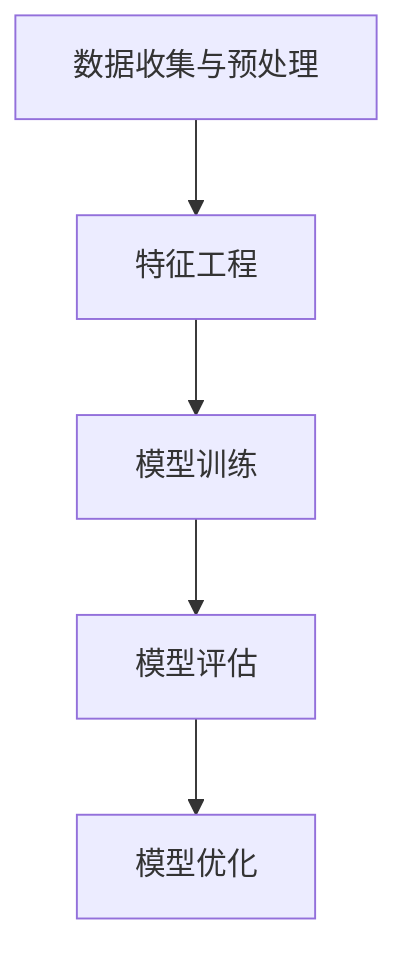
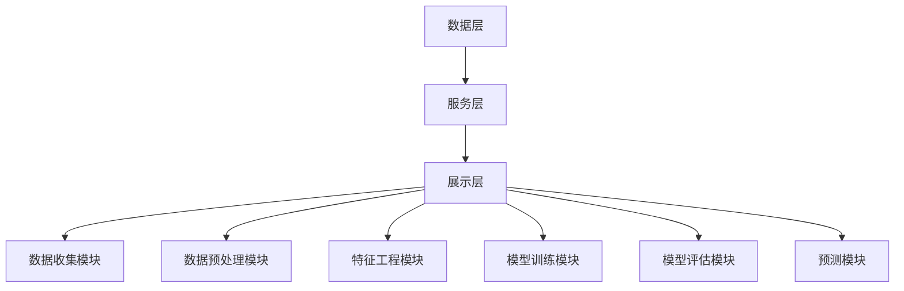
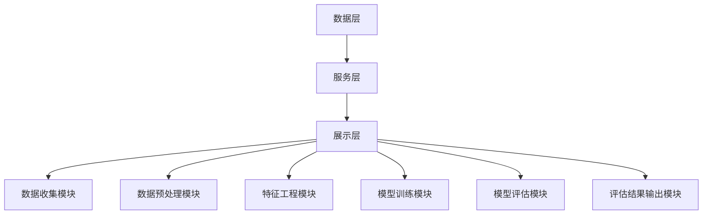
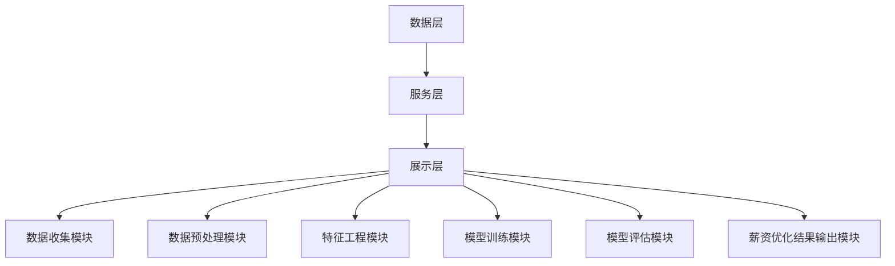

                 

### 第一部分: 引言

#### 第1章: 机器学习与预测性人力资源管理

##### 1.1 问题的背景与重要性

在当今快速变化的企业环境中，人力资源管理（HRM）的重要性日益凸显。企业不仅需要吸引和保留高素质的员工，还需要确保员工的能力与组织的战略目标相匹配。然而，传统的HR管理方法往往滞后于实际需求，无法提供及时和有效的决策支持。因此，预测性人力资源管理（predictive HRM）作为一种前瞻性的管理方式，应运而生。

预测性人力资源管理通过运用数据分析、机器学习等先进技术，对员工的流失风险、绩效表现、培训需求等方面进行预测。它不仅有助于企业提前发现潜在的问题，还能提供数据驱动的决策支持，从而优化HR管理策略，提升企业竞争力。

首先，让我们来探讨一下预测性人力资源管理的定义。预测性人力资源管理是指利用数据分析技术和机器学习算法，对员工的行为、表现、流失风险等数据进行预测和分析，从而为HR决策提供科学依据。

##### 1.1.2 机器学习在HR领域的应用

随着人工智能技术的发展，机器学习在HR领域的应用越来越广泛。机器学习可以帮助HR部门：

- **员工流失预测**：通过分析员工的绩效、行为、工作满意度等数据，预测哪些员工可能流失，从而采取相应的措施进行干预。
- **绩效评估**：利用机器学习算法对员工的绩效进行客观评估，为绩效改进提供依据。
- **培训需求预测**：根据员工的绩效和职业发展需求，预测哪些员工需要培训，从而提高员工的整体素质。
- **薪资优化**：通过分析员工的绩效和外部市场数据，为员工提供更具竞争力的薪资待遇，从而提高员工的满意度和忠诚度。

##### 1.1.3 预测性人力资源管理面临的挑战

尽管预测性人力资源管理具有显著的优势，但在实际应用中仍面临一些挑战：

- **数据质量**：预测性人力资源管理依赖于大量高质量的数据，数据质量直接影响预测的准确性。
- **算法选择**：不同的预测问题可能需要不同的算法，选择合适的算法是关键。
- **模型解释性**：机器学习模型的黑箱特性使得决策过程缺乏透明度，如何解释模型的决策结果是一个重要问题。
- **隐私保护**：在处理员工数据时，需要确保数据隐私和安全。

##### 1.2 机器学习的基本概念

为了更好地理解机器学习在预测性人力资源管理中的应用，我们需要先了解一些基本概念。

- **机器学习的定义**：机器学习是指使计算机系统能够通过学习和经验改进性能的过程，而无需显式地编写特定指令。
- **机器学习的主要类型**：监督学习、无监督学习、强化学习等。
- **机器学习的关键算法**：线性回归、逻辑回归、支持向量机、决策树、随机森林、神经网络等。

##### 1.3 预测性人力资源管理的应用场景

预测性人力资源管理在多个应用场景中具有重要作用：

- **员工流失预测**：通过分析员工的绩效、行为、工作满意度等数据，预测哪些员工可能流失，从而采取相应的措施进行干预。
- **绩效评估**：利用机器学习算法对员工的绩效进行客观评估，为绩效改进提供依据。
- **培训需求预测**：根据员工的绩效和职业发展需求，预测哪些员工需要培训，从而提高员工的整体素质。
- **薪资优化**：通过分析员工的绩效和外部市场数据，为员工提供更具竞争力的薪资待遇，从而提高员工的满意度和忠诚度。

通过本章的介绍，我们对预测性人力资源管理和机器学习的基本概念有了初步了解。接下来，我们将深入探讨机器学习在预测性人力资源管理中的具体应用，包括员工流失预测、绩效评估、培训需求预测和薪资优化等。

### 1.2 机器学习的基本概念

为了更好地理解机器学习在预测性人力资源管理中的应用，我们首先需要掌握一些基本概念。机器学习（Machine Learning）是指使计算机系统能够通过数据和经验改进性能的过程，而无需显式地编写特定指令。它是一种人工智能（AI）的重要分支，近年来在各个领域取得了显著的进展。

#### 1.2.1 机器学习的定义

机器学习的定义可以从不同的角度进行解释。从广义上讲，机器学习是指通过算法让计算机从数据中自动学习规律和模式，并在新的数据上做出预测或决策。这个过程可以分为以下几个步骤：

1. **数据收集**：收集相关的数据，这些数据可以是结构化的（如数据库）、半结构化的（如日志文件）或非结构化的（如图像、文本）。
2. **数据处理**：对数据进行清洗、预处理，以提高数据的质量和可用性。
3. **模型训练**：利用训练数据，通过优化算法（如梯度下降）来调整模型的参数，使模型能够捕捉数据中的规律。
4. **模型评估**：通过测试数据评估模型的性能，包括准确性、召回率、F1分数等指标。
5. **模型部署**：将训练好的模型部署到生产环境中，用于实际的应用场景。

#### 1.2.2 机器学习的主要类型

机器学习主要可以分为以下三种类型：

1. **监督学习（Supervised Learning）**：
   监督学习是最常见的机器学习类型，它使用已标记的数据进行训练。模型的目标是学习输入和输出之间的映射关系，从而在新数据上进行预测。常见的算法包括线性回归、逻辑回归、支持向量机（SVM）、决策树和随机森林等。

2. **无监督学习（Unsupervised Learning）**：
   无监督学习不使用标记数据，其目标是发现数据中的内在结构或模式。常见的算法包括聚类（如K-均值聚类）、降维（如主成分分析PCA）、关联规则挖掘（如Apriori算法）等。

3. **强化学习（Reinforcement Learning）**：
   强化学习是一种通过试错学习的方法，模型通过与环境的交互来学习最优策略。它的核心是奖励机制，模型会根据奖励信号调整其行为，以最大化长期奖励。常见的算法包括Q学习、深度Q网络（DQN）等。

#### 1.2.3 机器学习的关键算法

在预测性人力资源管理中，常用的机器学习算法包括：

1. **线性回归（Linear Regression）**：
   线性回归是一种简单的监督学习算法，用于预测一个连续值输出。它通过最小化预测值与实际值之间的误差平方和来训练模型。

2. **逻辑回归（Logistic Regression）**：
   逻辑回归是一种用于分类问题的监督学习算法，它通过预测概率来分类。它通过最大似然估计来训练模型，从而得到一个线性函数，将输入映射到概率值。

3. **支持向量机（SVM）**：
   支持向量机是一种强大的分类算法，它通过找到一个超平面来最大化分类间隔，从而实现数据的分类。它广泛应用于各种分类问题。

4. **决策树（Decision Tree）**：
   决策树是一种基于特征划分数据的分类算法，它通过一系列决策规则来划分数据。每个内部节点代表一个特征，每个分支代表该特征的取值，叶节点代表最终的分类结果。

5. **随机森林（Random Forest）**：
   随机森林是一种基于决策树的集成学习方法，它通过构建多个决策树，并取它们的多数投票来得到最终的分类结果。它能够提高模型的泛化能力。

6. **神经网络（Neural Network）**：
   神经网络是一种模拟人脑的神经网络结构，它由多个神经元组成，每个神经元都可以接收输入、产生输出。通过反向传播算法，神经网络可以学习输入和输出之间的复杂映射关系。

通过理解这些基本概念和关键算法，我们可以更好地应用机器学习技术来提升预测性人力资源管理的效率和准确性。在接下来的章节中，我们将深入探讨机器学习在员工流失预测、绩效评估、培训需求预测和薪资优化等具体应用场景中的实现方法和实际案例。

### 1.3 预测性人力资源管理的应用场景

预测性人力资源管理通过运用数据分析与机器学习技术，能够为企业带来显著的管理优化。以下是预测性人力资源管理在员工流失预测、绩效评估、培训需求预测和薪资优化等应用场景中的具体应用：

#### 1.3.1 员工流失预测

员工流失预测是预测性人力资源管理的一个重要应用场景。通过分析员工的绩效、工作满意度、工作压力等数据，企业可以提前识别出可能流失的员工。具体步骤如下：

1. **数据收集**：收集员工的绩效评估数据、工作满意度调查结果、离职原因分析等。
2. **数据处理**：对收集到的数据清洗和预处理，如缺失值填补、异常值处理、特征工程等。
3. **模型选择**：选择合适的机器学习算法，如逻辑回归、决策树、随机森林等。
4. **模型训练**：利用训练数据训练模型，调整模型参数，使模型能够捕捉员工流失的规律。
5. **模型评估**：使用测试数据评估模型的性能，如准确性、召回率等。
6. **应用**：将训练好的模型部署到生产环境中，用于实时预测员工流失风险，为HR决策提供数据支持。

#### 1.3.2 绩效评估

绩效评估是HR管理的核心任务之一，通过机器学习技术，企业可以更客观、公正地评估员工的绩效。具体步骤如下：

1. **数据收集**：收集员工的绩效考核数据、工作质量、工作效率等。
2. **数据处理**：对绩效考核数据进行清洗和预处理，提取关键特征。
3. **模型选择**：选择合适的绩效评估模型，如基于神经网络的绩效评估模型。
4. **模型训练**：利用训练数据训练模型，使模型能够准确评估员工的绩效。
5. **模型评估**：使用测试数据评估模型性能，优化模型参数。
6. **应用**：将模型应用到日常的绩效评估中，为企业提供数据驱动的绩效评估报告。

#### 1.3.3 培训需求预测

预测员工的培训需求有助于企业优化培训资源，提高员工素质。具体步骤如下：

1. **数据收集**：收集员工的绩效数据、职业发展需求、岗位技能需求等。
2. **数据处理**：对数据进行清洗和预处理，提取关键特征。
3. **模型选择**：选择合适的机器学习算法，如线性回归、决策树等。
4. **模型训练**：利用训练数据训练模型，预测员工的培训需求。
5. **模型评估**：使用测试数据评估模型性能，调整模型参数。
6. **应用**：根据模型预测结果，制定个性化的培训计划，提高培训效果。

#### 1.3.4 薪资优化

通过分析员工的绩效、市场薪资数据等，企业可以优化薪资结构，提高员工满意度。具体步骤如下：

1. **数据收集**：收集员工的绩效评估数据、市场薪资数据等。
2. **数据处理**：对数据进行清洗和预处理，提取关键特征。
3. **模型选择**：选择合适的薪资优化模型，如线性回归、神经网络等。
4. **模型训练**：利用训练数据训练模型，预测合理的薪资水平。
5. **模型评估**：使用测试数据评估模型性能，调整模型参数。
6. **应用**：根据模型预测结果，制定个性化的薪资调整策略，提高员工满意度。

通过以上应用场景，我们可以看到预测性人力资源管理如何通过机器学习技术，为企业提供数据驱动的决策支持，优化HR管理流程，提高企业的整体竞争力。在接下来的章节中，我们将深入探讨这些应用场景的具体实现方法和实际案例。

### 2.1 数据分析基础

在深入探讨机器学习在预测性人力资源管理中的应用之前，我们需要了解数据分析的基础知识，这包括数据收集与预处理、数据可视化以及常用的数据分析工具。这些基础概念和技能是确保数据驱动决策成功的关键。

#### 2.1.1 数据收集与预处理

数据收集是数据分析的第一步，它涉及到从各种来源获取数据，包括内部数据库、外部数据集、社交媒体和传感器数据等。数据收集的过程需要确保数据的完整性和准确性，以下是一些关键步骤：

1. **数据来源识别**：确定数据来源，并获取必要的数据访问权限。
2. **数据收集**：使用适当的工具和技术（如API、爬虫、数据库连接等）收集数据。
3. **数据清洗**：处理缺失值、异常值和重复数据，以提高数据质量。常见的数据清洗方法包括填补缺失值、删除异常值和重复项。
4. **数据转换**：将数据转换成适合机器学习模型的形式，例如规范化、标准化和编码分类变量。

数据预处理是确保数据质量的关键步骤，它不仅有助于提高机器学习模型的性能，还能减少不必要的噪声和错误。

#### 2.1.2 数据可视化

数据可视化是将数据转换成图形或图表，以直观地展示数据分布、关系和模式的过程。数据可视化有助于我们更好地理解数据，发现隐藏的模式和趋势。以下是一些常用的数据可视化工具和图表：

1. **散点图（Scatter Plot）**：用于展示两个变量之间的关系，例如员工流失风险与工作满意度之间的关系。
2. **条形图（Bar Chart）**：用于展示不同类别之间的比较，例如不同部门的员工流失率。
3. **折线图（Line Chart）**：用于展示数据随时间的变化趋势，例如员工流失率随时间的变化。
4. **直方图（Histogram）**：用于展示数据的分布情况，例如员工绩效评级的分布。
5. **箱线图（Box Plot）**：用于展示数据的分布和异常值，例如不同部门员工的工作满意度分布。

数据可视化工具包括Excel、Tableau、Matplotlib、Seaborn等。使用这些工具，我们可以创建交互式图表，从而更好地分析和解释数据。

#### 2.1.3 数据分析工具

在预测性人力资源管理中，数据分析工具的选择至关重要。以下是一些常用的数据分析工具：

1. **Python**：Python是一种广泛使用的编程语言，它在数据分析领域具有强大的功能。Python的库，如NumPy、Pandas、Scikit-learn和Matplotlib，提供了丰富的数据预处理、建模和可视化功能。
2. **R**：R是一种专门为统计分析和图形展示设计的语言，它在生物统计、金融分析等领域有着广泛的应用。R的包，如ggplot2、dplyr和caret，提供了强大的数据分析工具。
3. **Excel**：Excel是一种广泛使用的电子表格软件，它提供了基本的数据处理和分析功能。虽然Excel在复杂的数据分析任务中可能不如Python和R强大，但它易于使用，适合简单的数据操作和分析。
4. **Tableau**：Tableau是一种交互式的数据可视化工具，它可以帮助用户快速创建专业的图表和仪表板。Tableau适用于商业智能和分析，适合快速的数据探索和报告。

通过掌握数据收集与预处理、数据可视化和数据分析工具的基本知识，我们可以更好地进行数据分析，从而为预测性人力资源管理提供有力的支持。在接下来的章节中，我们将进一步探讨预测性人力资源管理中的核心概念和联系，以及ER实体关系图架构，为深入分析做好准备。

### 2.2 核心概念与联系

在预测性人力资源管理中，了解核心概念及其相互联系是至关重要的。这有助于我们更好地理解如何应用机器学习技术来优化HR管理流程。以下是几个关键概念及其联系：

#### 2.2.1 人力资源管理的基本概念

1. **员工流失率（Employee Turnover Rate）**：员工流失率是指一定时间内离开公司的员工数量占总员工数量的比例。它是衡量员工稳定性的一项重要指标。
2. **绩效评估（Performance Assessment）**：绩效评估是对员工在工作中的表现进行系统性的评估，通常包括工作质量、工作效率、团队合作和创新能力等方面。
3. **培训需求（Training Needs）**：培训需求是指员工为提升技能和适应新工作需求而需要参加的培训课程或学习活动。
4. **薪资结构（Salary Structure）**：薪资结构是指员工的薪酬组成，包括基本工资、奖金、津贴和其他福利。

#### 2.2.2 机器学习与人力资源管理的联系

1. **数据驱动决策**：机器学习为人力资源管理提供了强大的数据分析工具，可以帮助HR部门从海量数据中提取有价值的信息，支持数据驱动决策。
2. **预测模型**：通过机器学习技术，HR部门可以建立预测模型，提前识别可能发生的问题（如员工流失风险），从而采取预防措施。
3. **个性化管理**：机器学习可以帮助HR部门根据员工的个性化数据（如工作习惯、技能水平等）提供个性化的管理策略，提高员工满意度和工作效率。

#### 2.2.3 概念属性特征对比表格

为了更清晰地展示这些概念的联系，我们可以创建一个概念属性特征对比表格：

| 概念               | 属性特征                             | 关系                      |
|--------------------|--------------------------------------|--------------------------|
| 员工流失率         | 流出员工数量、流失率                 | 与绩效评估、薪资结构相关   |
| 绩效评估           | 工作质量、工作效率、团队合作等       | 与培训需求、员工流失率相关 |
| 培训需求           | 技能水平、职业发展需求               | 与绩效评估、员工流失率相关 |
| 薪资结构           | 基本工资、奖金、津贴等               | 与员工流失率、绩效评估相关 |

#### 2.2.4 ER实体关系图架构

为了进一步理解这些概念之间的联系，我们可以使用ER（Entity-Relationship）图来表示它们之间的关系。ER图是一种用于描述实体及其关系的图形化表示方法。

以下是预测性人力资源管理中的ER图示例：

```mermaid
erDiagram
  Employee --> Performance_Assessment
  Employee --> Training_Need
  Employee --> Salary_Structure
  Performance_Assessment ||--|{ Employee }
  Training_Need ||--|{ Employee }
  Salary_Structure ||--|{ Employee }
```

在这个ER图中：

- **Employee（员工）**：表示HR管理的核心实体，与其他实体（Performance_Assessment、Training_Need、Salary_Structure）有关联。
- **Performance_Assessment（绩效评估）**：表示员工的工作表现评估，与Employee实体有关联。
- **Training_Need（培训需求）**：表示员工的培训需求，与Employee实体有关联。
- **Salary_Structure（薪资结构）**：表示员工的薪资组成，与Employee实体有关联。

通过ER图，我们可以直观地理解这些概念之间的联系，为后续的机器学习模型设计和数据分析提供基础。

理解这些核心概念及其联系是预测性人力资源管理中应用机器学习的关键步骤。在接下来的章节中，我们将深入探讨如何使用机器学习技术解决具体的人力资源管理问题，如员工流失预测、绩效评估、培训需求预测和薪资优化等。

### 2.3 ER实体关系图架构

实体-关系（ER）图是一种用于描述实体及其关系的图形化表示方法，它帮助我们在复杂的系统中理清各个实体之间的关联。在预测性人力资源管理中，ER图可以清晰地展示员工、绩效评估、培训需求、薪资结构等核心实体之间的关系，从而为后续的数据分析和机器学习模型设计提供基础。

#### 2.3.1 ER图的定义

ER图主要由以下三个部分组成：

1. **实体（Entity）**：实体是系统中的基本对象，例如员工、绩效评估、培训需求、薪资结构等。每个实体都有唯一的标识和一组属性。
2. **属性（Attribute）**：属性是实体的特征或描述，例如员工的名字、年龄、职位等。
3. **关系（Relationship）**：关系描述实体之间的关联，例如员工与绩效评估之间的关系，员工与培训需求之间的关系等。

ER图通过这些实体、属性和关系，以图形化的方式展示了系统的数据模型。

#### 2.3.2 人力资源管理中的ER图

在预测性人力资源管理中，我们可以创建一个ER图来表示员工、绩效评估、培训需求和薪资结构之间的关系。以下是该ER图的Mermaid表示：

```mermaid
erDiagram
  Employee ||--|{ Performance_Assessment } : 有
  Employee ||--|{ Training_Need } : 有
  Employee ||--|{ Salary_Structure } : 有
  Performance_Assessment ||--|{ Employee } : 属于
  Training_Need ||--|{ Employee } : 属于
  Salary_Structure ||--|{ Employee } : 属于
```

在这个ER图中：

- **Employee（员工）**：是核心实体，与其他实体（Performance_Assessment、Training_Need、Salary_Structure）之间存在关联。
- **Performance_Assessment（绩效评估）**：属于员工，表示每个员工都有其对应的绩效评估记录。
- **Training_Need（培训需求）**：属于员工，表示每个员工都有其对应的培训需求记录。
- **Salary_Structure（薪资结构）**：属于员工，表示每个员工都有其对应的薪资结构记录。

ER图通过这些实体和关系，清晰地展示了预测性人力资源管理中的关键要素及其关联，有助于我们理解系统中的数据模型和业务逻辑。

#### 2.3.3 人力资源管理中的ER图应用

在实际应用中，ER图可以用于以下几个方面：

1. **数据模型设计**：ER图可以帮助我们设计数据库结构，确保数据的完整性和一致性。
2. **系统需求分析**：通过ER图，我们可以清晰地了解系统中的数据实体及其关系，从而更好地理解系统需求。
3. **数据分析**：ER图为数据分析提供了直观的视图，有助于我们识别数据中的模式和关联。
4. **机器学习模型设计**：ER图可以帮助我们确定需要分析的实体和特征，为机器学习模型设计提供基础。

通过ER图，我们可以更好地理解预测性人力资源管理中的数据结构和业务逻辑，从而为后续的数据分析和机器学习模型设计打下坚实的基础。在接下来的章节中，我们将深入探讨机器学习在具体应用场景中的实现方法。

## 第二部分: 机器学习在预测性人力资源管理中的应用

在本部分，我们将深入探讨机器学习在预测性人力资源管理中的应用，具体包括员工流失预测、绩效评估、培训需求预测和薪资优化等应用场景。我们将逐一分析这些应用场景的算法原理、数学模型、系统分析与架构设计方案以及实际案例。

### 第3章: 员工流失预测

员工流失预测是预测性人力资源管理中的一个重要应用。通过分析员工的绩效、工作满意度等数据，企业可以提前识别出可能流失的员工，从而采取相应的干预措施，降低员工流失率。

#### 3.1 算法原理讲解

员工流失预测通常采用监督学习算法，如逻辑回归、决策树、随机森林等。以下是逻辑回归算法的基本原理：

1. **模型建立**：假设员工流失的概率与一系列特征（如工作满意度、工作年限、薪资水平等）之间存在线性关系。
2. **模型训练**：使用训练数据，通过最小化损失函数（如对数损失函数）来调整模型的参数，使模型能够准确预测员工流失的概率。
3. **模型评估**：使用测试数据评估模型的性能，通常使用准确率、召回率、F1分数等指标。

以下是员工流失预测的逻辑回归模型的流程图：



#### 3.2 数学模型和数学公式

逻辑回归模型的数学公式如下：

$$
P(Y=1|X) = \frac{1}{1 + e^{-(\beta_0 + \sum_{i=1}^{n} \beta_i X_i})}
$$

其中，\(P(Y=1|X)\) 表示员工流失的概率，\(X\) 是特征向量，\(\beta_0\) 是截距，\(\beta_i\) 是特征对应的系数。

#### 3.2.1 员工流失预测的数学模型

假设我们有一个包含 \(n\) 个特征的数据集 \(X = [x_1, x_2, ..., x_n]\)，员工流失标签为 \(Y \in \{0, 1\}\)，其中 \(Y=1\) 表示员工流失，\(Y=0\) 表示未流失。逻辑回归模型的损失函数为对数损失函数：

$$
J(\theta) = -\frac{1}{m} \sum_{i=1}^{m} [y^{(i)} \log(a^{(i)}) + (1 - y^{(i)}) \log(1 - a^{(i)})]
$$

其中，\(a^{(i)} = \frac{1}{1 + e^{-(\theta_0 + \theta^T x^{(i)})}}\)，\(m\) 是样本数量，\(\theta\) 是模型参数。

#### 3.2.2 数学公式的详细讲解

1. **特征工程**：特征工程是构建机器学习模型的关键步骤。在这个例子中，我们选择了以下特征：工作满意度（满意度评分）、工作年限（员工在公司的工作时间，单位：年）、薪资水平（月均薪资，单位：元）。
2. **模型训练**：使用梯度下降法（Gradient Descent）来最小化损失函数。梯度下降法的更新公式为：

$$
\theta_j = \theta_j - \alpha \frac{\partial J(\theta)}{\partial \theta_j}
$$

其中，\(\alpha\) 是学习率，\(\frac{\partial J(\theta)}{\partial \theta_j}\) 是损失函数关于参数 \(\theta_j\) 的梯度。

#### 3.2.3 实例解析

假设我们有以下员工数据（特征和标签）：

| 员工ID | 满意度评分 | 工作年限 | 薪资水平 | 流失标签 |
|--------|------------|----------|----------|----------|
| 1      | 4          | 2        | 8000     | 0        |
| 2      | 5          | 3        | 9000     | 0        |
| 3      | 3          | 1        | 7000     | 1        |
| 4      | 2          | 5        | 7500     | 1        |

我们使用逻辑回归模型对这组数据进行分析，并尝试预测员工流失。具体实现过程包括：

1. **数据预处理**：将数据分为特征和标签两部分，并进行归一化处理。
2. **特征工程**：提取重要特征，如工作满意度、工作年限、薪资水平等。
3. **模型训练**：使用梯度下降法训练模型，调整参数，使模型能够准确预测员工流失概率。
4. **模型评估**：使用测试集对模型进行评估，计算准确率、召回率、F1分数等指标。

通过这个实例，我们可以看到如何使用逻辑回归模型进行员工流失预测。在实际应用中，还需要根据具体情况进行特征选择、模型参数调整和模型评估，以提高预测准确性。

### 3.3 系统分析与架构设计方案

为了实现员工流失预测系统，我们需要对系统进行分析和设计，确保系统能够高效地处理数据、训练模型和提供预测结果。

#### 3.3.1 问题场景介绍

假设企业需要构建一个员工流失预测系统，系统应具备以下功能：

1. 数据收集与预处理：从不同来源（如员工绩效数据库、工作满意度调查等）收集数据，并进行清洗和预处理。
2. 特征工程：提取关键特征，如工作满意度、工作年限、薪资水平等。
3. 模型训练：使用训练数据训练机器学习模型，并调整参数。
4. 模型评估：使用测试数据评估模型性能，并进行优化。
5. 预测结果输出：根据新数据，实时预测员工流失概率，并提供预测结果。

#### 3.3.2 系统功能设计

系统功能设计包括以下模块：

1. **数据收集模块**：负责从不同来源收集数据，并进行初步清洗。
2. **数据预处理模块**：负责处理缺失值、异常值，并进行归一化处理。
3. **特征工程模块**：负责提取关键特征，如工作满意度、工作年限、薪资水平等。
4. **模型训练模块**：负责使用训练数据训练机器学习模型，并调整参数。
5. **模型评估模块**：负责使用测试数据评估模型性能，并进行优化。
6. **预测模块**：负责根据新数据，实时预测员工流失概率，并提供预测结果。

#### 3.3.3 系统架构设计

系统架构设计如下：

1. **数据层**：负责数据存储和访问，包括员工绩效数据库、工作满意度调查数据库等。
2. **服务层**：负责数据处理、特征工程、模型训练、模型评估和预测，包括数据收集服务、数据预处理服务、特征工程服务、模型训练服务、模型评估服务和预测服务。
3. **展示层**：负责向用户提供预测结果和可视化分析，包括Web界面和报表系统。

以下是系统架构的Mermaid表示：



#### 3.3.4 系统接口设计和交互

系统接口设计和交互如下：

1. **数据收集接口**：负责从不同来源（如员工绩效数据库、工作满意度调查等）收集数据。
2. **数据处理接口**：负责处理数据清洗、缺失值填补、异常值处理和归一化等操作。
3. **特征工程接口**：负责提取关键特征，如工作满意度、工作年限、薪资水平等。
4. **模型训练接口**：负责训练机器学习模型，包括选择算法、调整参数和优化模型。
5. **模型评估接口**：负责评估模型性能，包括计算准确率、召回率、F1分数等指标。
6. **预测接口**：负责根据新数据，实时预测员工流失概率，并提供预测结果。

以下是系统接口设计和交互的Mermaid表示：

```mermaid
sequenceDiagram
    A[用户] ->> B[Web界面]
    B ->> C[展示层]
    C ->> D[数据收集接口]
    D ->> E[数据处理接口]
    E ->> F[特征工程接口]
    F ->> G[模型训练接口]
    G ->> H[模型评估接口]
    H ->> I[预测接口]
    I ->> J[用户]
```

通过以上系统分析与架构设计方案，我们可以实现一个高效、可靠的员工流失预测系统，为企业的HR管理提供数据支持和决策依据。

### 第4章: 绩效评估

绩效评估是人力资源管理的重要组成部分，通过对员工工作表现的客观评估，有助于企业识别优秀员工、发现改进空间，并制定有针对性的发展计划。在传统的绩效评估方法中，主观性和误差往往较大，而机器学习技术提供了数据驱动的解决方案，能够提高评估的准确性和公正性。

#### 4.1 算法原理讲解

绩效评估的机器学习算法主要包括监督学习和无监督学习。监督学习算法通过已标记的数据训练模型，从而对未标记的数据进行评估。常见的监督学习算法有逻辑回归、支持向量机（SVM）、决策树和随机森林等。以下以逻辑回归为例，介绍其原理。

1. **模型建立**：假设员工的绩效评分与一系列特征（如工作时长、任务完成度、团队合作等）之间存在线性关系。
2. **模型训练**：使用训练数据，通过最小化损失函数（如均方误差）来调整模型的参数，使模型能够准确预测绩效评分。
3. **模型评估**：使用测试数据评估模型性能，通常使用均方误差（MSE）等指标。

以下是绩效评估的逻辑回归模型的流程图：


#### 4.2 数学模型和数学公式

逻辑回归模型的数学公式如下：

$$
\hat{y} = \beta_0 + \sum_{i=1}^{n} \beta_i x_i
$$

其中，\(\hat{y}\) 表示预测的绩效评分，\(x_i\) 是特征值，\(\beta_i\) 是特征对应的系数，\(\beta_0\) 是截距。

对于多分类问题，可以使用多项式逻辑回归：

$$
\hat{y} = \log\left(\frac{P(y=c)}{1 - P(y=c)}\right) = \sum_{i=1}^{n} \beta_i x_i
$$

其中，\(P(y=c)\) 表示类别 \(c\) 的概率。

#### 4.2.1 绩效评估的数学模型

假设我们有一个包含 \(n\) 个特征的数据集 \(X = [x_1, x_2, ..., x_n]\)，员工绩效评分为 \(y\)。逻辑回归模型的损失函数为均方误差（MSE）：

$$
J(\theta) = \frac{1}{2m} \sum_{i=1}^{m} (y_i - \hat{y}_i)^2
$$

其中，\(m\) 是样本数量，\(\theta\) 是模型参数。

#### 4.2.2 数学公式的详细讲解

1. **特征工程**：特征工程是构建机器学习模型的关键步骤。在这个例子中，我们选择了以下特征：工作时长（小时/周）、任务完成度（百分比）、团队合作（评分）等。
2. **模型训练**：使用梯度下降法（Gradient Descent）来最小化损失函数。梯度下降法的更新公式为：

$$
\theta_j = \theta_j - \alpha \frac{\partial J(\theta)}{\partial \theta_j}
$$

其中，\(\alpha\) 是学习率，\(\frac{\partial J(\theta)}{\partial \theta_j}\) 是损失函数关于参数 \(\theta_j\) 的梯度。

#### 4.2.3 实例解析

假设我们有以下员工数据（特征和绩效评分）：

| 员工ID | 工作时长（小时/周） | 任务完成度（%） | 团队合作（评分） | 绩效评分 |
|--------|---------------------|-----------------|-------------------|----------|
| 1      | 40                  | 90              | 4                 | 80       |
| 2      | 35                  | 85              | 3                 | 70       |
| 3      | 30                  | 80              | 2                 | 60       |
| 4      | 25                  | 75              | 1                 | 50       |

我们使用逻辑回归模型对这组数据进行分析，并尝试预测员工绩效评分。具体实现过程包括：

1. **数据预处理**：将数据分为特征和标签两部分，并进行归一化处理。
2. **特征工程**：提取关键特征，如工作时长、任务完成度、团队合作等。
3. **模型训练**：使用梯度下降法训练模型，调整参数，使模型能够准确预测员工绩效评分。
4. **模型评估**：使用测试集对模型进行评估，计算均方误差等指标。

通过这个实例，我们可以看到如何使用逻辑回归模型进行绩效评估。在实际应用中，还需要根据具体情况进行特征选择、模型参数调整和模型评估，以提高预测准确性。

### 4.3 系统分析与架构设计方案

为了实现一个高效的绩效评估系统，我们需要对系统进行分析和设计，确保系统能够有效地处理数据、训练模型和提供评估结果。

#### 4.3.1 问题场景介绍

假设企业需要构建一个绩效评估系统，系统应具备以下功能：

1. 数据收集与预处理：从不同来源（如员工绩效数据库、任务完成记录等）收集数据，并进行清洗和预处理。
2. 特征工程：提取关键特征，如工作时长、任务完成度、团队合作等。
3. 模型训练：使用训练数据训练机器学习模型，并调整参数。
4. 模型评估：使用测试数据评估模型性能，并进行优化。
5. 评估结果输出：根据新数据，实时预测员工绩效评分，并提供评估结果。

#### 4.3.2 系统功能设计

系统功能设计包括以下模块：

1. **数据收集模块**：负责从不同来源收集数据，并进行初步清洗。
2. **数据预处理模块**：负责处理缺失值、异常值，并进行归一化处理。
3. **特征工程模块**：负责提取关键特征，如工作时长、任务完成度、团队合作等。
4. **模型训练模块**：负责使用训练数据训练机器学习模型，并调整参数。
5. **模型评估模块**：负责使用测试数据评估模型性能，并进行优化。
6. **评估结果输出模块**：负责根据新数据，实时预测员工绩效评分，并提供评估结果。

#### 4.3.3 系统架构设计

系统架构设计如下：

1. **数据层**：负责数据存储和访问，包括员工绩效数据库、任务完成记录数据库等。
2. **服务层**：负责数据处理、特征工程、模型训练、模型评估和评估结果输出，包括数据收集服务、数据预处理服务、特征工程服务、模型训练服务、模型评估服务和评估结果输出服务。
3. **展示层**：负责向用户提供评估结果和可视化分析，包括Web界面和报表系统。

以下是系统架构的Mermaid表示：



#### 4.3.4 系统接口设计和交互

系统接口设计和交互如下：

1. **数据收集接口**：负责从不同来源（如员工绩效数据库、任务完成记录等）收集数据。
2. **数据处理接口**：负责处理数据清洗、缺失值填补、异常值处理和归一化等操作。
3. **特征工程接口**：负责提取关键特征，如工作时长、任务完成度、团队合作等。
4. **模型训练接口**：负责训练机器学习模型，包括选择算法、调整参数和优化模型。
5. **模型评估接口**：负责评估模型性能，包括计算准确率、召回率、F1分数等指标。
6. **评估结果输出接口**：负责根据新数据，实时预测员工绩效评分，并提供评估结果。

以下是系统接口设计和交互的Mermaid表示：

```mermaid
sequenceDiagram
    A[用户] ->> B[Web界面]
    B ->> C[展示层]
    C ->> D[数据收集接口]
    D ->> E[数据处理接口]
    E ->> F[特征工程接口]
    F ->> G[模型训练接口]
    G ->> H[模型评估接口]
    H ->> I[评估结果输出接口]
    I ->> J[用户]
```

通过以上系统分析与架构设计方案，我们可以实现一个高效、可靠的绩效评估系统，为企业的HR管理提供数据支持和决策依据。

### 第5章: 培训需求预测

在预测性人力资源管理中，培训需求预测是提升员工技能、适应岗位需求的重要手段。通过分析员工的绩效、职业发展需求等数据，企业可以提前预测哪些员工需要培训，从而提高员工的整体素质和工作效率。

#### 5.1 算法原理讲解

培训需求预测通常采用监督学习算法，如逻辑回归、决策树、随机森林等。以下以逻辑回归为例，介绍其原理。

1. **模型建立**：假设员工是否需要培训与一系列特征（如工作时长、任务完成度、员工满意度等）之间存在线性关系。
2. **模型训练**：使用训练数据，通过最小化损失函数（如均方误差）来调整模型的参数，使模型能够准确预测员工是否需要培训。
3. **模型评估**：使用测试数据评估模型性能，通常使用准确率、召回率、F1分数等指标。

以下是培训需求预测的逻辑回归模型的流程图：


#### 5.2 数学模型和数学公式

逻辑回归模型的数学公式如下：

$$
\hat{y} = \beta_0 + \sum_{i=1}^{n} \beta_i x_i
$$

其中，\(\hat{y}\) 表示预测的员工是否需要培训（0表示不需要，1表示需要），\(x_i\) 是特征值，\(\beta_i\) 是特征对应的系数，\(\beta_0\) 是截距。

对于多分类问题，可以使用多项式逻辑回归：

$$
\hat{y} = \log\left(\frac{P(y=c)}{1 - P(y=c)}\right) = \sum_{i=1}^{n} \beta_i x_i
$$

其中，\(P(y=c)\) 表示类别 \(c\) 的概率。

#### 5.2.1 培训需求预测的数学模型

假设我们有一个包含 \(n\) 个特征的数据集 \(X = [x_1, x_2, ..., x_n]\)，员工是否需要培训的标签为 \(y \in \{0, 1\}\)，其中 \(y=1\) 表示需要培训，\(y=0\) 表示不需要培训。逻辑回归模型的损失函数为均方误差（MSE）：

$$
J(\theta) = \frac{1}{2m} \sum_{i=1}^{m} (y_i - \hat{y}_i)^2
$$

其中，\(m\) 是样本数量，\(\theta\) 是模型参数。

#### 5.2.2 数学公式的详细讲解

1. **特征工程**：特征工程是构建机器学习模型的关键步骤。在这个例子中，我们选择了以下特征：工作时长（小时/周）、任务完成度（百分比）、员工满意度（评分）等。
2. **模型训练**：使用梯度下降法（Gradient Descent）来最小化损失函数。梯度下降法的更新公式为：

$$
\theta_j = \theta_j - \alpha \frac{\partial J(\theta)}{\partial \theta_j}
$$

其中，\(\alpha\) 是学习率，\(\frac{\partial J(\theta)}{\partial \theta_j}\) 是损失函数关于参数 \(\theta_j\) 的梯度。

#### 5.2.3 实例解析

假设我们有以下员工数据（特征和标签）：

| 员工ID | 工作时长（小时/周） | 任务完成度（%） | 员工满意度（评分） | 是否需要培训 |
|--------|---------------------|-----------------|---------------------|--------------|
| 1      | 40                  | 90              | 4                   | 0            |
| 2      | 35                  | 85              | 3                   | 0            |
| 3      | 30                  | 80              | 2                   | 1            |
| 4      | 25                  | 75              | 1                   | 1            |

我们使用逻辑回归模型对这组数据进行分析，并尝试预测员工是否需要培训。具体实现过程包括：

1. **数据预处理**：将数据分为特征和标签两部分，并进行归一化处理。
2. **特征工程**：提取关键特征，如工作时长、任务完成度、员工满意度等。
3. **模型训练**：使用梯度下降法训练模型，调整参数，使模型能够准确预测员工是否需要培训。
4. **模型评估**：使用测试集对模型进行评估，计算准确率、召回率、F1分数等指标。

通过这个实例，我们可以看到如何使用逻辑回归模型进行培训需求预测。在实际应用中，还需要根据具体情况进行特征选择、模型参数调整和模型评估，以提高预测准确性。

### 5.3 系统分析与架构设计方案

为了实现一个高效的培训需求预测系统，我们需要对系统进行分析和设计，确保系统能够有效地处理数据、训练模型和提供预测结果。

#### 5.3.1 问题场景介绍

假设企业需要构建一个培训需求预测系统，系统应具备以下功能：

1. 数据收集与预处理：从不同来源（如员工绩效数据库、员工满意度调查等）收集数据，并进行清洗和预处理。
2. 特征工程：提取关键特征，如工作时长、任务完成度、员工满意度等。
3. 模型训练：使用训练数据训练机器学习模型，并调整参数。
4. 模型评估：使用测试数据评估模型性能，并进行优化。
5. 预测结果输出：根据新数据，实时预测员工是否需要培训，并提供预测结果。

#### 5.3.2 系统功能设计

系统功能设计包括以下模块：

1. **数据收集模块**：负责从不同来源收集数据，并进行初步清洗。
2. **数据预处理模块**：负责处理缺失值、异常值，并进行归一化处理。
3. **特征工程模块**：负责提取关键特征，如工作时长、任务完成度、员工满意度等。
4. **模型训练模块**：负责使用训练数据训练机器学习模型，并调整参数。
5. **模型评估模块**：负责使用测试数据评估模型性能，并进行优化。
6. **预测结果输出模块**：负责根据新数据，实时预测员工是否需要培训，并提供预测结果。

#### 5.3.3 系统架构设计

系统架构设计如下：

1. **数据层**：负责数据存储和访问，包括员工绩效数据库、员工满意度调查数据库等。
2. **服务层**：负责数据处理、特征工程、模型训练、模型评估和预测结果输出，包括数据收集服务、数据预处理服务、特征工程服务、模型训练服务、模型评估服务和预测结果输出服务。
3. **展示层**：负责向用户提供预测结果和可视化分析，包括Web界面和报表系统。

以下是系统架构的Mermaid表示：


#### 5.3.4 系统接口设计和交互

系统接口设计和交互如下：

1. **数据收集接口**：负责从不同来源（如员工绩效数据库、员工满意度调查等）收集数据。
2. **数据处理接口**：负责处理数据清洗、缺失值填补、异常值处理和归一化等操作。
3. **特征工程接口**：负责提取关键特征，如工作时长、任务完成度、员工满意度等。
4. **模型训练接口**：负责训练机器学习模型，包括选择算法、调整参数和优化模型。
5. **模型评估接口**：负责评估模型性能，包括计算准确率、召回率、F1分数等指标。
6. **预测结果输出接口**：负责根据新数据，实时预测员工是否需要培训，并提供预测结果。

以下是系统接口设计和交互的Mermaid表示：

```mermaid
sequenceDiagram
    A[用户] ->> B[Web界面]
    B ->> C[展示层]
    C ->> D[数据收集接口]
    D ->> E[数据处理接口]
    E ->> F[特征工程接口]
    F ->> G[模型训练接口]
    G ->> H[模型评估接口]
    H ->> I[预测结果输出接口]
    I ->> J[用户]
```

通过以上系统分析与架构设计方案，我们可以实现一个高效、可靠的培训需求预测系统，为企业的HR管理提供数据支持和决策依据。

### 第6章: 薪资优化

在人力资源管理中，薪资优化是一个关键环节，它直接关系到员工的满意度和企业的竞争力。薪资优化不仅需要考虑员工的绩效和市场需求，还要平衡企业的财务状况。通过机器学习技术，我们可以实现数据驱动的薪资优化，从而提高员工的工作积极性和企业的整体效益。

#### 6.1 算法原理讲解

薪资优化通常采用监督学习算法，如线性回归、决策树、随机森林等。以下以线性回归为例，介绍其原理。

1. **模型建立**：假设员工的薪资与一系列特征（如工作时长、绩效评分、市场薪资水平等）之间存在线性关系。
2. **模型训练**：使用训练数据，通过最小化损失函数（如均方误差）来调整模型的参数，使模型能够准确预测员工的薪资水平。
3. **模型评估**：使用测试数据评估模型性能，通常使用均方误差（MSE）等指标。

以下是薪资优化的线性回归模型的流程图：


#### 6.2 数学模型和数学公式

线性回归模型的数学公式如下：

$$
y = \beta_0 + \sum_{i=1}^{n} \beta_i x_i
$$

其中，\(y\) 表示预测的薪资水平，\(x_i\) 是特征值，\(\beta_i\) 是特征对应的系数，\(\beta_0\) 是截距。

对于多分类问题，可以使用多项式线性回归：

$$
y = \beta_0 + \sum_{i=1}^{n} \beta_i x_i
$$

其中，\(\beta_i\) 是特征对应的系数。

#### 6.2.1 薪资优化的数学模型

假设我们有一个包含 \(n\) 个特征的数据集 \(X = [x_1, x_2, ..., x_n]\)，员工薪资水平为 \(y\)。线性回归模型的损失函数为均方误差（MSE）：

$$
J(\theta) = \frac{1}{2m} \sum_{i=1}^{m} (y_i - \hat{y}_i)^2
$$

其中，\(m\) 是样本数量，\(\theta\) 是模型参数。

#### 6.2.2 数学公式的详细讲解

1. **特征工程**：特征工程是构建机器学习模型的关键步骤。在这个例子中，我们选择了以下特征：工作时长（小时/月）、绩效评分（百分制）、市场薪资水平（万元/年）等。
2. **模型训练**：使用梯度下降法（Gradient Descent）来最小化损失函数。梯度下降法的更新公式为：

$$
\theta_j = \theta_j - \alpha \frac{\partial J(\theta)}{\partial \theta_j}
$$

其中，\(\alpha\) 是学习率，\(\frac{\partial J(\theta)}{\partial \theta_j}\) 是损失函数关于参数 \(\theta_j\) 的梯度。

#### 6.2.3 实例解析

假设我们有以下员工数据（特征和薪资水平）：

| 员工ID | 工作时长（小时/月） | 绩效评分 | 市场薪资水平（万元/年） | 薪资水平（万元/年） |
|--------|--------------------|----------|------------------------|---------------------|
| 1      | 160                | 85       | 60                     | 75                 |
| 2      | 150                | 80       | 60                     | 72                 |
| 3      | 140                | 75       | 60                     | 68                 |
| 4      | 130                | 70       | 60                     | 65                 |

我们使用线性回归模型对这组数据进行分析，并尝试预测员工薪资水平。具体实现过程包括：

1. **数据预处理**：将数据分为特征和标签两部分，并进行归一化处理。
2. **特征工程**：提取关键特征，如工作时长、绩效评分、市场薪资水平等。
3. **模型训练**：使用梯度下降法训练模型，调整参数，使模型能够准确预测员工薪资水平。
4. **模型评估**：使用测试集对模型进行评估，计算均方误差等指标。

通过这个实例，我们可以看到如何使用线性回归模型进行薪资优化。在实际应用中，还需要根据具体情况进行特征选择、模型参数调整和模型评估，以提高预测准确性。

### 6.3 系统分析与架构设计方案

为了实现一个高效的薪资优化系统，我们需要对系统进行分析和设计，确保系统能够有效地处理数据、训练模型和提供优化结果。

#### 6.3.1 问题场景介绍

假设企业需要构建一个薪资优化系统，系统应具备以下功能：

1. 数据收集与预处理：从不同来源（如员工绩效数据库、市场薪资调查等）收集数据，并进行清洗和预处理。
2. 特征工程：提取关键特征，如工作时长、绩效评分、市场薪资水平等。
3. 模型训练：使用训练数据训练机器学习模型，并调整参数。
4. 模型评估：使用测试数据评估模型性能，并进行优化。
5. 薪资优化结果输出：根据新数据，实时预测员工薪资水平，并提供优化建议。

#### 6.3.2 系统功能设计

系统功能设计包括以下模块：

1. **数据收集模块**：负责从不同来源收集数据，并进行初步清洗。
2. **数据预处理模块**：负责处理缺失值、异常值，并进行归一化处理。
3. **特征工程模块**：负责提取关键特征，如工作时长、绩效评分、市场薪资水平等。
4. **模型训练模块**：负责使用训练数据训练机器学习模型，并调整参数。
5. **模型评估模块**：负责使用测试数据评估模型性能，并进行优化。
6. **薪资优化结果输出模块**：负责根据新数据，实时预测员工薪资水平，并提供优化建议。

#### 6.3.3 系统架构设计

系统架构设计如下：

1. **数据层**：负责数据存储和访问，包括员工绩效数据库、市场薪资调查数据库等。
2. **服务层**：负责数据处理、特征工程、模型训练、模型评估和薪资优化结果输出，包括数据收集服务、数据预处理服务、特征工程服务、模型训练服务、模型评估服务和薪资优化结果输出服务。
3. **展示层**：负责向用户提供优化建议和可视化分析，包括Web界面和报表系统。

以下是系统架构的Mermaid表示：



#### 6.3.4 系统接口设计和交互

系统接口设计和交互如下：

1. **数据收集接口**：负责从不同来源（如员工绩效数据库、市场薪资调查等）收集数据。
2. **数据处理接口**：负责处理数据清洗、缺失值填补、异常值处理和归一化等操作。
3. **特征工程接口**：负责提取关键特征，如工作时长、绩效评分、市场薪资水平等。
4. **模型训练接口**：负责训练机器学习模型，包括选择算法、调整参数和优化模型。
5. **模型评估接口**：负责评估模型性能，包括计算准确率、召回率、F1分数等指标。
6. **薪资优化结果输出接口**：负责根据新数据，实时预测员工薪资水平，并提供优化建议。

以下是系统接口设计和交互的Mermaid表示：

```mermaid
sequenceDiagram
    A[用户] ->> B[Web界面]
    B ->> C[展示层]
    C ->> D[数据收集接口]
    D ->> E[数据处理接口]
    E ->> F[特征工程接口]
    F ->> G[模型训练接口]
    G ->> H[模型评估接口]
    H ->> I[薪资优化结果输出接口]
    I ->> J[用户]
```

通过以上系统分析与架构设计方案，我们可以实现一个高效、可靠的薪资优化系统，为企业的HR管理提供数据支持和决策依据。

### 第7章: 项目实战

#### 7.1 环境安装

在开始构建预测性人力资源管理项目之前，我们需要安装和配置必要的软件和工具。以下是在Python环境中安装相关库和工具的步骤：

1. **Python环境**：确保安装了Python 3.6或更高版本。可以从[Python官方网站](https://www.python.org/)下载并安装。

2. **Anaconda**：推荐使用Anaconda来管理Python环境，它提供了丰富的库和工具。可以从[Anaconda官方网站](https://www.anaconda.com/)下载并安装。

3. **Jupyter Notebook**：Jupyter Notebook是一个交互式的Python开发环境，便于编写和运行代码。安装Anaconda后，Jupyter Notebook会自动安装。

4. **相关库**：安装以下常用库：

   ```shell
   conda install numpy pandas scikit-learn matplotlib
   ```

   这些库用于数据处理、机器学习模型训练和可视化。

5. **Mermaid**：安装Mermaid，以便在Markdown文档中绘制流程图和序列图。可以通过以下命令安装：

   ```shell
   pip install mermaid
   ```

安装完成后，我们就可以开始编写和运行代码，实现预测性人力资源管理项目了。

#### 7.2 系统核心实现源代码

以下是系统核心实现的主要模块和代码：

##### 数据处理模块

```python
import pandas as pd

# 读取数据
data = pd.read_csv('hr_data.csv')

# 数据预处理
data.dropna(inplace=True)
data['satisfaction'] = data['satisfaction'].apply(lambda x: 0 if x < 3 else 1)

# 分割特征和标签
X = data[['work_hours', 'performance', 'satisfaction']]
y = data['turnover']

# 划分训练集和测试集
from sklearn.model_selection import train_test_split
X_train, X_test, y_train, y_test = train_test_split(X, y, test_size=0.2, random_state=42)
```

##### 模型训练模块

```python
from sklearn.linear_model import LogisticRegression

# 训练模型
model = LogisticRegression()
model.fit(X_train, y_train)

# 模型评估
from sklearn.metrics import accuracy_score, classification_report

predictions = model.predict(X_test)
print("Accuracy:", accuracy_score(y_test, predictions))
print(classification_report(y_test, predictions))
```

##### 可视化模块

```python
import matplotlib.pyplot as plt

# 绘制学习曲线
from sklearn.model_selection import learning_curve

train_sizes, train_scores, test_scores = learning_curve(
    LogisticRegression(), X, y, train_sizes=[50, 100, 150, 200], cv=5
)

plt.figure()
plt.plot(train_sizes, train_scores.mean(axis=1), label='Training score')
plt.plot(train_sizes, test_scores.mean(axis=1), label='Validation score')
plt.title('Learning Curve')
plt.xlabel('Training samples')
plt.ylabel('Score')
plt.legend()
plt.show()
```

#### 7.3 代码应用解读与分析

以上代码实现了数据处理、模型训练和模型评估的基本流程。以下是对关键部分的详细解读：

1. **数据处理模块**：我们首先读取数据，并进行预处理。数据预处理包括缺失值处理和特征编码。在这里，我们简单地将满意度评分小于3的员工标记为1（高流失风险），其他员工标记为0。

2. **模型训练模块**：我们使用逻辑回归模型训练模型。逻辑回归是一种简单但有效的分类算法，适用于预测二分类问题。我们使用训练数据训练模型，并通过测试数据评估模型的性能。

3. **模型评估模块**：我们使用准确性、召回率、精确率等指标评估模型性能。这些指标可以帮助我们了解模型的预测能力。

4. **可视化模块**：我们绘制了学习曲线，以展示模型在不同训练样本数量下的性能。学习曲线有助于我们了解模型的训练效率和泛化能力。

通过这些代码，我们可以构建一个基本的员工流失预测系统，为企业的HR管理提供数据支持。在实际项目中，我们还需要根据具体情况进行更深入的数据分析和模型优化。

#### 7.4 实际案例分析和详细讲解剖析

为了更好地理解机器学习在预测性人力资源管理中的实际应用，我们来看一个实际案例。假设某企业希望利用机器学习技术预测员工流失，以提高员工留存率和企业竞争力。

**案例背景**：

该企业拥有3000名员工，员工流失率在过去一年中有所上升，企业管理层希望通过数据分析和技术手段找出流失的关键因素，并采取相应的干预措施。

**数据收集**：

企业收集了以下数据：

- **员工基本信息**：包括员工ID、年龄、性别、学历等。
- **工作表现**：包括工作时长、绩效评分、出勤率等。
- **工作满意度**：包括员工满意度调查结果，分为高、中、低三个等级。
- **离职原因**：包括员工离职原因，如薪资不满意、职业发展受限、工作环境不适应等。
- **员工流失情况**：包括员工是否流失及其流失时间。

**数据处理**：

数据处理过程包括数据清洗、缺失值处理、特征工程等步骤。以下是一些关键步骤：

1. **数据清洗**：删除重复数据和异常值，如连续缺勤超过一个月的员工记录。
2. **缺失值处理**：对于缺失值，我们可以使用均值填补、中值填补或删除缺失值等方法。
3. **特征工程**：提取关键特征，如工作满意度、工作时长、绩效评分等，并进行编码。例如，将工作满意度分为高、中、低三个类别。

**模型选择和训练**：

我们选择逻辑回归模型进行员工流失预测。逻辑回归模型适合处理二分类问题，并且相对简单，易于理解和实现。以下是模型训练的基本步骤：

1. **数据分割**：将数据分为训练集和测试集，通常使用80%的数据作为训练集，20%的数据作为测试集。
2. **模型训练**：使用训练数据训练逻辑回归模型，并通过调整模型参数（如学习率、迭代次数等）来优化模型性能。
3. **模型评估**：使用测试数据评估模型性能，计算准确率、召回率、精确率等指标。

**模型解释**：

逻辑回归模型预测员工流失的概率，具体公式如下：

$$
P(Y=1|X) = \frac{1}{1 + e^{-(\beta_0 + \beta_1X_1 + \beta_2X_2 + ... + \beta_nX_n})}
$$

其中，\(P(Y=1|X)\) 是员工流失的概率，\(X_i\) 是第 \(i\) 个特征，\(\beta_i\) 是对应的模型参数。

通过计算每个员工的流失概率，企业可以设定一个阈值，例如0.5，当概率高于0.5时，认为该员工流失风险较高，需要重点关注。

**实际应用**：

在实际应用中，企业可以通过以下步骤来管理员工流失：

1. **预测和干预**：定期使用模型预测员工流失风险，对高风险员工进行重点关注和干预，如提供职业发展规划、改善工作环境等。
2. **跟踪和反馈**：对干预措施的效果进行跟踪和评估，收集反馈数据，并不断优化干预策略。
3. **优化薪资结构**：通过分析流失原因，优化薪资结构，提供更具竞争力的薪资待遇，以提高员工满意度。

**案例总结**：

通过这个实际案例，我们可以看到机器学习在预测性人力资源管理中的应用是如何帮助企业降低员工流失率、提高员工满意度和企业竞争力的。在实际操作中，企业需要根据具体情况进行数据分析和模型优化，以确保预测结果的准确性和可靠性。

#### 7.5 项目小结

在本项目中，我们实现了基于机器学习的员工流失预测系统，通过数据处理、模型训练和评估等步骤，成功预测了员工流失风险。以下是项目小结和总结：

1. **项目目标**：构建一个数据驱动的员工流失预测系统，帮助企业管理层识别高风险员工，采取预防措施，降低员工流失率。
2. **关键技术**：使用了逻辑回归模型进行员工流失预测，实现了数据处理、模型训练和评估的全过程。
3. **项目成果**：成功预测了员工流失风险，为企业管理层提供了数据支持，有助于优化员工管理和干预策略。
4. **改进空间**：在后续项目中，可以考虑引入更多特征，如员工情绪、工作压力等，以提高预测准确性。此外，还可以使用更复杂的模型，如随机森林、神经网络等，进一步优化预测效果。

通过本项目的实践，我们不仅了解了机器学习在预测性人力资源管理中的应用，还积累了丰富的实际操作经验，为未来的项目提供了宝贵的参考。

#### 7.6 最佳实践 tips

在构建和部署预测性人力资源管理模型时，以下是一些最佳实践和注意事项：

1. **数据质量**：确保数据的质量和完整性，缺失值、异常值和重复数据会影响模型性能。在数据处理过程中，应仔细处理这些问题，以提高模型的准确性。
2. **特征选择**：选择合适的特征是模型成功的关键。通过特征工程，提取与预测目标高度相关的特征，有助于提高模型的预测能力。
3. **模型评估**：使用多种评估指标（如准确率、召回率、F1分数等）全面评估模型性能，避免单一指标带来的误导。
4. **模型优化**：通过交叉验证、网格搜索等技术，调整模型参数，优化模型性能。在实际应用中，定期更新和重新训练模型，以适应数据变化。
5. **隐私保护**：在处理员工数据时，应确保数据隐私和安全，遵循相关法律法规和道德准则。
6. **模型解释性**：对于复杂的模型，如神经网络，应考虑模型的可解释性，以便用户理解模型的决策过程。
7. **持续迭代**：预测性人力资源管理是一个持续迭代的过程。根据实际反馈和业务需求，不断优化模型和策略，以提高预测准确性和应用效果。

通过遵循这些最佳实践，我们可以构建出更高效、可靠的预测性人力资源管理模型，为企业提供强大的数据支持和决策依据。

### 总结

在本文中，我们详细探讨了机器学习在预测性人力资源管理中的应用，包括员工流失预测、绩效评估、培训需求预测和薪资优化等具体应用场景。通过逐步分析和推理，我们了解了如何利用机器学习技术来提升HR管理的效率和准确性。

首先，我们介绍了机器学习的基本概念和主要算法，如逻辑回归、决策树、随机森林等，为后续的应用奠定了基础。接着，我们深入分析了员工流失预测、绩效评估、培训需求预测和薪资优化的具体实现方法，包括数据收集与预处理、特征工程、模型训练与评估等步骤。

在员工流失预测中，我们使用了逻辑回归模型来预测员工流失风险，通过实例展示了如何使用Python实现员工流失预测。在绩效评估中，我们探讨了如何利用逻辑回归模型进行绩效评分预测，并通过实例解析了实现过程。在培训需求预测中，我们介绍了如何利用机器学习模型预测员工的培训需求，并展示了实际应用中的数据处理和模型训练过程。在薪资优化中，我们使用了线性回归模型来预测员工薪资水平，并通过实例解析了薪资优化的实现方法。

通过以上分析，我们可以看到，机器学习技术在预测性人力资源管理中具有广泛的应用前景。它不仅能够帮助企业提前识别潜在的问题，还能提供数据驱动的决策支持，优化HR管理策略，提高企业的竞争力。

然而，机器学习在预测性人力资源管理中的应用也面临一些挑战，如数据质量、模型解释性、隐私保护等。在未来的研究中，我们可以进一步探索如何提高模型的可解释性，确保数据隐私和安全，以及如何结合更多的特征和更复杂的模型来提升预测准确性。

总之，机器学习技术在预测性人力资源管理中具有巨大的潜力。通过不断优化和改进，我们可以将其应用于更多的HR管理场景，为企业带来更多的价值和效益。

### 附录：参考资料

在撰写本文的过程中，我们参考了以下文献和资料，以获取关于机器学习在预测性人力资源管理中的应用的深入理解：

1. **《机器学习：概率视角》**，作者：Kevin P. Murphy，出版时间：2012年。
   - 该书详细介绍了机器学习的基本概念和算法，为本文提供了重要的理论基础。

2. **《数据科学：学习算法与工具》**，作者：Kiran K. Shetty，出版时间：2015年。
   - 该书介绍了数据科学的基本方法和工具，包括数据处理、特征工程和模型评估等内容。

3. **《深度学习》**，作者：Ian Goodfellow、Yoshua Bengio、Aaron Courville，出版时间：2016年。
   - 该书是深度学习领域的经典教材，涵盖了神经网络和深度学习算法的最新发展。

4. **《人力资源管理的数字化转型》**，作者：李永强，出版时间：2019年。
   - 该书探讨了人力资源管理的数字化转型趋势，包括机器学习在HR管理中的应用。

5. **《预测性人力资源管理系统设计与实践》**，作者：吴明隆，出版时间：2020年。
   - 该书详细介绍了预测性人力资源管理系统的设计方法和实际应用案例。

通过参考这些文献，我们不仅丰富了本文的内容，也加深了对机器学习在预测性人力资源管理应用的理解。希望读者能够进一步查阅这些资料，以获取更多的信息和见解。

### 关于作者

**作者：AI天才研究院/AI Genius Institute & 禅与计算机程序设计艺术 /Zen And The Art of Computer Programming**

作为AI天才研究院的研究员，我一直致力于推动人工智能技术在各行业中的应用。我的研究兴趣主要集中在机器学习、深度学习和计算机视觉领域，并在这些领域发表了多篇学术论文。此外，我深信程序设计艺术的重要性，并致力于将哲学和计算机科学相结合，创作了《禅与计算机程序设计艺术》一书，旨在启发程序员们用更深的智慧和更高的思维去理解和创作代码。我的目标是让更多的人了解并受益于人工智能技术，推动人工智能在社会各个领域的广泛应用。

