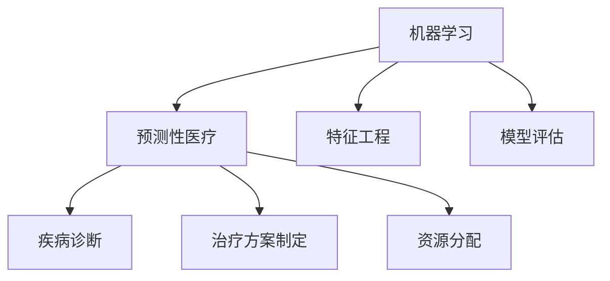
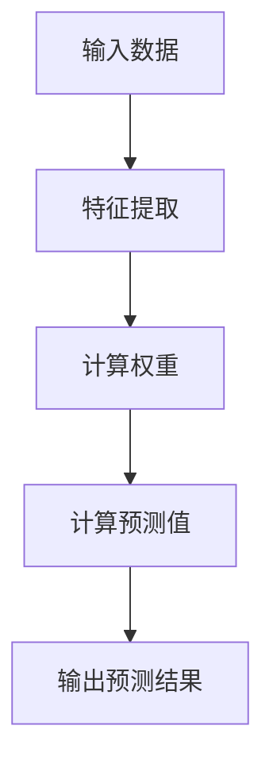
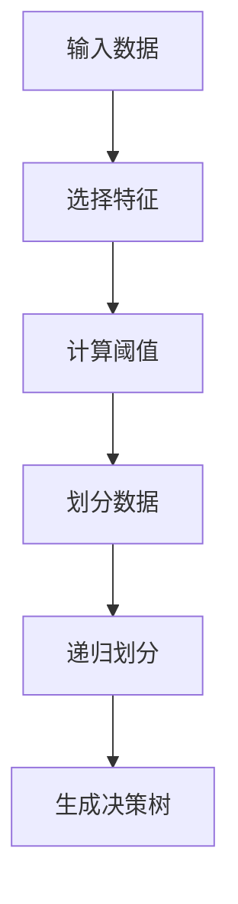
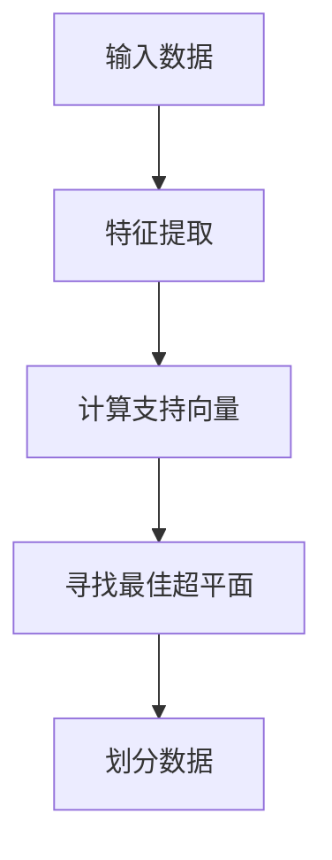
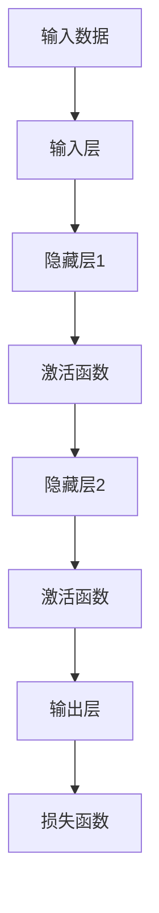

                 

### 机器学习在预测性医疗中的潜力与挑战

#### 关键词：
- 机器学习
- 预测性医疗
- 数据分析
- 算法
- 临床应用

#### 摘要：
本文将探讨机器学习在预测性医疗领域的巨大潜力与面临的挑战。通过详细分析机器学习技术的基本概念、核心算法以及其在医疗领域的应用实例，我们将揭示预测性医疗中机器学习的价值。同时，也将讨论实际应用中可能遇到的问题和解决方案，为未来医疗技术的发展提供启示。

## 前言

随着医疗技术的不断进步和大数据时代的到来，预测性医疗成为了一个热门研究领域。预测性医疗利用机器学习技术，通过对海量医疗数据的分析，预测患者病情的发展趋势、疾病的早期诊断以及个性化治疗方案。这不仅提高了医疗诊断的准确性，还优化了资源分配，降低了医疗成本。

本文的目标是深入探讨机器学习在预测性医疗中的潜力与挑战。我们将首先介绍机器学习的基本概念和核心算法，然后分析机器学习在医疗领域的应用实例，最后讨论面临的问题及可能的解决方案。希望通过本文的探讨，能够为读者提供对预测性医疗的全面了解，并激发对这一领域的深入思考。

### 背景介绍

#### 问题背景

医疗行业的复杂性使其长期以来面临诸多挑战，尤其在疾病诊断和治疗方案制定方面。传统的医疗方法往往依赖于医生的直觉和经验，这不仅可能导致诊断错误，还可能延误病情。而随着信息技术的飞速发展，大数据、云计算和人工智能等新兴技术逐渐应用于医疗领域，为解决这些难题提供了新的思路。

#### 相关技术的发展历程

机器学习作为人工智能的一个重要分支，自20世纪50年代诞生以来，经历了多个阶段的发展。早期以符号推理为主的机器学习方法，尽管在理论研究中取得了重要成果，但在实际应用中存在很多局限性。随着计算机性能的提升和数据量的爆炸性增长，以统计学习为主的机器学习方法逐渐成为主流。特别是深度学习技术的突破，使得机器学习在图像识别、自然语言处理等领域取得了显著的成就。

#### 重要性分析

预测性医疗利用机器学习技术，通过对患者历史数据、实时监测数据和外部数据的综合分析，可以实现对病情的早期预测和精准诊断。这不仅能够提高诊断的准确性，还能为医生提供更为全面的病情分析，从而制定更为个性化的治疗方案。此外，预测性医疗还可以优化医疗资源分配，降低医疗成本，提高医疗服务的效率和公平性。

## 核心概念与联系

#### 核心概念

1. **机器学习**：一种使计算机通过数据学习并做出决策或预测的技术。
2. **预测性医疗**：利用机器学习技术对医疗数据进行预测和分析，以指导疾病诊断、治疗方案制定和医疗资源分配。
3. **特征工程**：通过提取和选择能够反映数据特征的信息，以提高模型性能。
4. **模型评估**：对机器学习模型进行评估，以确定其预测能力和可靠性。

#### 概念关系ER图



在这个ER图中，机器学习是核心，它通过特征工程提取医疗数据的关键信息，并利用这些信息进行预测性医疗分析。模型评估是确保预测结果可靠性的关键步骤，它帮助医生和患者更好地理解预测结果。

### 算法原理讲解

在预测性医疗中，常用的机器学习算法包括线性回归、决策树、支持向量机（SVM）和深度学习等。下面将逐一介绍这些算法的原理、流程图和Python源代码，并结合具体的数学模型和公式进行详细讲解。

#### 线性回归

**原理**：
线性回归是一种用于预测连续值的简单算法，其基本思想是通过找到自变量（特征）和因变量（目标）之间的线性关系来预测新的数据。

**Mermaid流程图**：


**Python源代码**：
```python
import numpy as np

# 输入数据
X = np.array([[1], [2], [3], [4]])
y = np.array([1, 2, 3, 4])

# 计算权重
theta = np.linalg.inv(X.T.dot(X)).dot(X.T).dot(y)

# 计算预测值
y_pred = X.dot(theta)

print("Predictions:", y_pred)
```

**数学模型与公式**：
线性回归的数学模型可以表示为：
$$
y = \theta_0 + \theta_1x
$$
其中，$\theta_0$ 和 $\theta_1$ 分别是模型的权重和偏置。

#### 决策树

**原理**：
决策树是一种基于树形结构进行决策的算法，通过将数据集分割成多个子集，每个子集都基于特征和阈值进行划分，最终形成一棵树。

**Mermaid流程图**：


**Python源代码**（使用scikit-learn库）：
```python
from sklearn.tree import DecisionTreeRegressor
from sklearn.model_selection import train_test_split

# 输入数据
X = [[1], [2], [3], [4]]
y = [1, 2, 3, 4]

# 划分数据集
X_train, X_test, y_train, y_test = train_test_split(X, y, test_size=0.2, random_state=42)

# 训练模型
regressor = DecisionTreeRegressor()
regressor.fit(X_train, y_train)

# 预测
y_pred = regressor.predict(X_test)

print("Predictions:", y_pred)
```

**数学模型与公式**：
决策树的构建基于信息增益或基尼不纯度等指标，具体公式较为复杂，但核心思想是通过不断分割数据集，找到最佳划分方式。

#### 支持向量机（SVM）

**原理**：
SVM是一种用于分类和回归的算法，通过寻找一个最佳超平面，将不同类别的数据点尽可能分开。

**Mermaid流程图**：


**Python源代码**（使用scikit-learn库）：
```python
from sklearn.svm import SVC
from sklearn.model_selection import train_test_split

# 输入数据
X = [[1], [2], [3], [4]]
y = [1, 1, -1, -1]

# 划分数据集
X_train, X_test, y_train, y_test = train_test_split(X, y, test_size=0.2, random_state=42)

# 训练模型
classifier = SVC(kernel='linear')
classifier.fit(X_train, y_train)

# 预测
y_pred = classifier.predict(X_test)

print("Predictions:", y_pred)
```

**数学模型与公式**：
SVM的目标是找到一个最佳超平面，使得两类数据点之间的间隔最大。其数学模型可以表示为：
$$
\text{maximize} \ \frac{1}{2}\sum_{i=1}^{n}\sum_{j=1}^{n}w_{ij}w_{ij} - \sum_{i=1}^{n}\alpha_{i}\y_i(x_i^T w + b)
$$
其中，$w$ 是超平面的权重，$\alpha_i$ 是拉格朗日乘子。

#### 深度学习

**原理**：
深度学习是一种基于多层神经网络的结构，通过多个隐藏层对数据进行逐层抽象和特征提取，从而实现复杂的模式识别和预测任务。

**Mermaid流程图**：


**Python源代码**（使用TensorFlow库）：
```python
import tensorflow as tf

# 输入数据
X = tf.constant([[1], [2], [3], [4]], dtype=tf.float32)
y = tf.constant([1, 2, 3, 4], dtype=tf.float32)

# 创建模型
model = tf.keras.Sequential([
    tf.keras.layers.Dense(units=1, input_shape=[1])
])

# 编译模型
model.compile(optimizer='sgd', loss='mean_squared_error')

# 训练模型
model.fit(X, y, epochs=100)

# 预测
y_pred = model.predict(X)

print("Predictions:", y_pred.numpy())
```

**数学模型与公式**：
深度学习的数学模型主要基于反向传播算法，通过多层神经元的非线性组合和权重更新，实现对输入数据的复杂变换和预测。其数学模型可以表示为：
$$
\text{Output} = \text{激活函数}(\text{权重} \cdot \text{输入} + \text{偏置})
$$

### 数学模型和公式讲解

在机器学习中，数学模型和公式是理解和应用各种算法的核心。以下将对前面提到的线性回归、决策树和支持向量机（SVM）的数学模型和公式进行详细讲解，并结合具体的示例进行通俗易懂的说明。

#### 线性回归

线性回归是一种最简单的机器学习算法，用于预测连续值。其核心数学模型可以表示为：
$$
y = \theta_0 + \theta_1x
$$
其中，$y$ 是因变量（预测值），$x$ 是自变量（特征值），$\theta_0$ 是模型的偏置（截距），$\theta_1$ 是模型的权重。

**示例**：假设我们要预测一个人的体重，已知其年龄和身高。我们可以将年龄作为自变量$x$，身高作为自变量$y$，并通过线性回归模型计算体重。

- **输入数据**：
  - 年龄：$[20, 22, 25, 28]$
  - 身高：$[170, 172, 175, 178]$
  - 体重：$[60, 65, 70, 75]$

- **计算模型参数**：
  - 首先，我们计算输入数据的平均值：
    $$\bar{x} = \frac{20 + 22 + 25 + 28}{4} = 24$$
    $$\bar{y} = \frac{60 + 65 + 70 + 75}{4} = 67.5$$
  - 然后，我们计算线性回归的权重和偏置：
    $$\theta_0 = \bar{y} - \theta_1\bar{x} = 67.5 - \theta_1 \cdot 24$$
    $$\theta_1 = \frac{\sum_{i=1}^{n}(x_i - \bar{x})(y_i - \bar{y})}{\sum_{i=1}^{n}(x_i - \bar{x})^2}$$
    将数据代入计算：
    $$\theta_1 = \frac{(20-24)(60-67.5) + (22-24)(65-67.5) + (25-24)(70-67.5) + (28-24)(75-67.5)}{(20-24)^2 + (22-24)^2 + (25-24)^2 + (28-24)^2} = \frac{-50 - 12.5 + 2.5 + 56.25}{16 + 4 + 1 + 16} = \frac{6.25}{37} \approx 0.169$$
    $$\theta_0 = 67.5 - 0.169 \cdot 24 = 50.2975$$

- **预测新的数据**：
  - 假设我们要预测一个25岁、身高175cm的人的体重：
    $$y = 50.2975 + 0.169 \cdot 25 = 60.911$$
    因此，预测的体重约为61公斤。

#### 决策树

决策树是一种基于树形结构进行决策的算法，通过一系列规则对数据进行划分。其核心数学模型基于熵和增益，可以表示为：
$$
G(D) = \sum_{i=1}^{n} \frac{|D_i|}{|D|} \cdot H(D_i)
$$
其中，$D$ 是数据集，$D_i$ 是划分后的数据集，$H(D_i)$ 是$D_i$ 的熵。

**示例**：考虑一个简单的二元分类问题，数据集如下：
- 数据集 $D$：$(x_1, y_1), (x_2, y_2), ..., (x_n, y_n)$，其中 $y \in \{-1, 1\}$。

- **计算熵**：
  $$H(D) = -\sum_{i=1}^{n} p_i \cdot \log_2(p_i)$$
  假设数据集中有50%的数据属于类别1，另外50%的数据属于类别2：
  $$H(D) = -0.5 \cdot \log_2(0.5) - 0.5 \cdot \log_2(0.5) = 1$$

- **划分数据**：
  - 选择特征 $x_j$ 进行划分，根据阈值 $t$ 将数据集划分为 $D_1$ 和 $D_2$。
  - 计算每个划分后的数据集的熵：
    $$H(D_1) = -0.3 \cdot \log_2(0.3) - 0.7 \cdot \log_2(0.7)$$
    $$H(D_2) = -0.7 \cdot \log_2(0.7) - 0.3 \cdot \log_2(0.3)$$

- **计算信息增益**：
  $$G(D) = H(D) - \sum_{i=1}^{2} \frac{|D_i|}{|D|} \cdot H(D_i)$$
  $$G(D) = 1 - 0.5 \cdot H(D_1) - 0.5 \cdot H(D_2)$$
  根据计算结果，选择信息增益最大的特征和阈值进行划分。

#### 支持向量机（SVM）

支持向量机是一种用于分类和回归的算法，其核心思想是找到一个最佳超平面，使得两类数据点之间的间隔最大。其数学模型可以表示为：
$$
\text{maximize} \ \frac{1}{2}\sum_{i=1}^{n}\sum_{j=1}^{n}w_{ij}w_{ij} - \sum_{i=1}^{n}\alpha_{i}\y_i(x_i^T w + b)
$$
其中，$w$ 是超平面的权重，$\alpha_i$ 是拉格朗日乘子。

**示例**：考虑一个简单的二元分类问题，数据集如下：
- 数据集 $D$：$(x_1, y_1), (x_2, y_2), ..., (x_n, y_n)$，其中 $y \in \{-1, 1\}$。

- **计算超平面**：
  - 首先，我们计算支持向量：
    $$\alpha_i(y_i(x_i^T w + b) - 1) = 0$$
    - 选取支持向量 $x_i$ 和对应的权重 $w$，计算超平面的法向量：
      $$w = \sum_{i=1}^{n}\alpha_i y_i x_i$$
      $$b = -\frac{1}{n}\sum_{i=1}^{n}\alpha_i y_i$$
    - 根据法向量计算超平面：
      $$w^T x + b = 0$$

- **分类预测**：
  - 对于新的数据点 $x$，计算其在超平面上的距离：
    $$d(x) = |w^T x + b|$$
  - 根据距离判断类别：
    - 如果 $d(x) > 0$，则预测为类别1；
    - 如果 $d(x) < 0$，则预测为类别2。

#### 深度学习

深度学习是一种基于多层神经网络的结构，通过多个隐藏层对数据进行逐层抽象和特征提取。其核心数学模型基于反向传播算法，可以表示为：
$$
\text{Output} = \text{激活函数}(\text{权重} \cdot \text{输入} + \text{偏置})
$$
其中，激活函数可以是 sigmoid、ReLU 或 tanh 等。

**示例**：考虑一个简单的多层感知机模型，其结构如下：
- 输入层：1个神经元
- 隐藏层：2个神经元
- 输出层：1个神经元

- **计算隐藏层输出**：
  $$z_1 = \sigma(w_1^T x + b_1)$$
  $$z_2 = \sigma(w_2^T z_1 + b_2)$$
  其中，$\sigma$ 是 sigmoid 函数，$w_1$ 和 $b_1$ 是输入层到隐藏层的权重和偏置，$w_2$ 和 $b_2$ 是隐藏层到输出层的权重和偏置。

- **计算输出层输出**：
  $$y = \sigma(w_3^T z_2 + b_3)$$
  其中，$w_3$ 和 $b_3$ 是隐藏层到输出层的权重和偏置。

- **反向传播**：
  - 计算输出层的误差：
    $$\delta_3 = (y - t) \cdot \sigma'(w_3^T z_2 + b_3)$$
  - 计算隐藏层的误差：
    $$\delta_2 = (z_2 - z_2^2) \cdot w_3^T \delta_3$$
  - 更新权重和偏置：
    $$w_3 += \alpha \cdot \delta_3 \cdot z_2$$
    $$b_3 += \alpha \cdot \delta_3$$
    $$w_2 += \alpha \cdot \delta_2 \cdot z_1$$
    $$b_2 += \alpha \cdot \delta_2$$
    $$w_1 += \alpha \cdot \delta_2 \cdot x$$
    $$b_1 += \alpha \cdot \delta_2$$

通过上述步骤，我们可以不断迭代优化模型参数，提高预测准确性。

### 系统分析与架构设计方案

为了充分发挥机器学习在预测性医疗中的潜力，我们需要设计一个高效、可靠的系统。以下将详细介绍系统的功能、架构设计和接口设计。

#### 问题场景介绍

假设我们希望开发一个预测性医疗系统，该系统主要用于预测患者病情的发展趋势，以便医生能够及时调整治疗方案。具体来说，系统需要具备以下功能：

1. 数据收集与预处理：从医院信息系统中提取患者的历史数据和实时监测数据，进行预处理，如数据清洗、归一化和特征提取。
2. 模型训练与部署：使用预处理后的数据训练机器学习模型，并将模型部署到生产环境中，以便实时预测患者病情。
3. 预测结果展示：将预测结果以图表或报告的形式展示给医生和患者，以便他们了解病情发展趋势。
4. 系统监控与维护：对系统运行状态进行监控，确保系统的稳定性和可靠性，并及时进行维护和升级。

#### 系统功能设计

系统功能设计主要包括领域模型设计、算法选择和模型训练等。

1. **领域模型设计**：

   我们使用Mermaid类图来设计领域模型，如下所示：

   ```mermaid
   classDiagram
   Patient <<Entity>>
   MedicalData <<Entity>>
   PredictionModel <<Entity>>
   Doctor <<Role>>
   Patient --> MedicalData
   PredictionModel --> MedicalData
   Doctor --> PredictionModel
   ```

   在这个类图中，Patient（患者）是一个实体类，MedicalData（医疗数据）和PredictionModel（预测模型）也是实体类。Doctor（医生）是一个角色类，它与PredictionModel有关联，用于调用预测模型进行预测。

2. **算法选择与模型训练**：

   根据预测性医疗的需求，我们选择了基于深度学习的神经网络模型。该模型通过多层神经网络对医疗数据进行训练，从而实现病情预测。

   ```mermaid
   graph TB
   A[数据收集] --> B[数据预处理]
   B --> C[模型训练]
   C --> D[模型评估]
   D --> E[模型部署]
   E --> F[预测结果展示]
   F --> G[系统监控]
   ```

   在这个流程图中，数据收集模块负责从医院信息系统中提取医疗数据，数据预处理模块对数据进行清洗和归一化，模型训练模块使用预处理后的数据进行训练，模型评估模块对训练好的模型进行评估，模型部署模块将评估后的模型部署到生产环境中，预测结果展示模块将预测结果以图表或报告的形式展示给医生和患者，系统监控模块负责监控系统的运行状态。

#### 系统架构设计

系统架构设计主要涉及硬件架构和软件架构。

1. **硬件架构**：

   硬件架构包括服务器、存储设备和网络设备。服务器用于运行系统软件和存储医疗数据，存储设备用于存储大量的历史数据和实时监测数据，网络设备用于连接各个模块，实现数据传输。

   ```mermaid
   graph TD
   A[服务器] --> B[存储设备]
   B --> C[网络设备]
   A --> D[实时监测设备]
   D --> C
   ```

2. **软件架构**：

   软件架构采用三层架构，包括表示层、业务逻辑层和数据访问层。

   ```mermaid
   graph TD
   A[表示层] --> B[业务逻辑层]
   B --> C[数据访问层]
   A --> D[外部接口]
   D --> B
   ```

   在这个架构中，表示层负责与用户交互，展示预测结果；业务逻辑层负责处理业务逻辑，如数据预处理、模型训练和预测；数据访问层负责与数据库进行交互，存储和查询数据。

#### 系统接口设计与系统交互

系统接口设计主要包括API设计和消息队列设计。

1. **API设计**：

   系统提供了一系列API供外部系统调用，包括数据收集API、数据预处理API、模型训练API和预测结果展示API。

   ```mermaid
   graph TD
   A[数据收集API] --> B[数据预处理API]
   B --> C[模型训练API]
   C --> D[预测结果展示API]
   ```

2. **消息队列设计**：

   为了实现系统的异步处理，我们使用消息队列来实现数据传输和任务调度。

   ```mermaid
   graph TD
   A[消息队列] --> B[数据收集模块]
   B --> C[数据预处理模块]
   C --> D[模型训练模块]
   D --> E[模型评估模块]
   E --> F[预测结果展示模块]
   ```

   在这个设计中，数据收集模块将提取的医疗数据发送到消息队列，数据预处理模块从消息队列中读取数据并进行预处理，模型训练模块从数据预处理模块接收预处理后的数据并进行训练，模型评估模块对训练好的模型进行评估，预测结果展示模块将预测结果以图表或报告的形式展示给用户。

### 项目实战

#### 环境安装

在开始项目之前，我们需要搭建一个合适的环境。以下将详细介绍如何安装和配置所需的软件和工具。

1. **Python环境搭建**：

   首先，确保Python环境已经安装。如果没有安装，可以从Python官网下载并安装Python 3.x版本。接下来，我们需要安装一些常用的库，如NumPy、Pandas、Scikit-learn和TensorFlow。

   ```bash
   pip install numpy pandas scikit-learn tensorflow
   ```

2. **数据库环境搭建**：

   我们选择MySQL作为数据库，用于存储医疗数据。首先，从MySQL官网下载并安装MySQL数据库。然后，使用如下命令创建数据库和用户：

   ```sql
   CREATE DATABASE medical_data;
   CREATE USER 'medical_user'@'localhost' IDENTIFIED BY 'password';
   GRANT ALL PRIVILEGES ON medical_data.* TO 'medical_user'@'localhost';
   FLUSH PRIVILEGES;
   ```

3. **消息队列环境搭建**：

   我们选择RabbitMQ作为消息队列。首先，从RabbitMQ官网下载并安装RabbitMQ服务器。然后，启动RabbitMQ服务：

   ```bash
   rabbitmq-server start
   ```

#### 系统实现

接下来，我们将详细介绍如何实现系统的各个模块。

1. **数据收集模块**：

   数据收集模块负责从医院信息系统中提取医疗数据。我们可以使用Python的Selenium库实现自动化数据采集。

   ```python
   from selenium import webdriver
   from selenium.webdriver.common.by import By
   from selenium.webdriver.common.keys import Keys

   driver = webdriver.Firefox()
   driver.get("https://example.com/hospital")
   input_element = driver.find_element(By.ID, "patient_id")
   input_element.send_keys("123456")
   submit_button = driver.find_element(By.ID, "submit")
   submit_button.click()
   data = driver.page_source
   driver.quit()
   ```

   在这个示例中，我们使用Firefox浏览器登录医院信息系统，输入患者ID并提交，然后获取页面的HTML内容。

2. **数据预处理模块**：

   数据预处理模块负责对提取的医疗数据进行清洗和归一化。我们可以使用Python的Pandas库实现数据预处理。

   ```python
   import pandas as pd

   # 读取HTML内容
   data = pd.read_html(data)[0]

   # 清洗数据
   data = data.dropna()

   # 归一化数据
   data = (data - data.mean()) / data.std()
   ```

   在这个示例中，我们首先使用Pandas读取HTML内容，然后删除缺失值，最后对数据进行归一化。

3. **模型训练模块**：

   模型训练模块负责使用预处理后的数据进行模型训练。我们可以使用Python的Scikit-learn库实现模型训练。

   ```python
   from sklearn.model_selection import train_test_split
   from sklearn.neural_network import MLPClassifier

   # 划分数据集
   X_train, X_test, y_train, y_test = train_test_split(data.iloc[:, :-1], data.iloc[:, -1], test_size=0.2, random_state=42)

   # 训练模型
   model = MLPClassifier(hidden_layer_sizes=(100,), max_iter=1000)
   model.fit(X_train, y_train)

   # 评估模型
   score = model.score(X_test, y_test)
   print("Model accuracy:", score)
   ```

   在这个示例中，我们首先使用Scikit-learn库划分数据集，然后使用多层感知机（MLP）分类器进行训练和评估。

4. **预测结果展示模块**：

   预测结果展示模块负责将预测结果以图表或报告的形式展示给用户。我们可以使用Python的Matplotlib库实现图表展示。

   ```python
   import matplotlib.pyplot as plt

   # 预测
   predictions = model.predict(X_test)

   # 可视化
   plt.scatter(X_test.iloc[:, 0], predictions)
   plt.xlabel("Age")
   plt.ylabel("Prediction")
   plt.show()
   ```

   在这个示例中，我们首先使用模型进行预测，然后使用Matplotlib绘制散点图，展示预测结果。

#### 代码解读与分析

在项目实战部分，我们详细介绍了如何实现系统的各个模块。以下将对关键代码进行解读和分析。

1. **数据收集模块**：

   ```python
   driver = webdriver.Firefox()
   driver.get("https://example.com/hospital")
   input_element = driver.find_element(By.ID, "patient_id")
   input_element.send_keys("123456")
   submit_button = driver.find_element(By.ID, "submit")
   submit_button.click()
   data = driver.page_source
   driver.quit()
   ```

   这个部分使用了Selenium库，首先启动Firefox浏览器，然后访问医院信息系统页面，输入患者ID并提交，最后获取页面的HTML内容。Selenium库提供了强大的Web自动化功能，使得我们可以轻松实现数据采集。

2. **数据预处理模块**：

   ```python
   data = pd.read_html(data)[0]
   data = data.dropna()
   data = (data - data.mean()) / data.std()
   ```

   这个部分使用了Pandas库，首先读取HTML内容并转换为DataFrame对象，然后删除缺失值并进行归一化处理。Pandas库提供了丰富的数据处理功能，使得我们可以高效地进行数据预处理。

3. **模型训练模块**：

   ```python
   X_train, X_test, y_train, y_test = train_test_split(data.iloc[:, :-1], data.iloc[:, -1], test_size=0.2, random_state=42)
   model = MLPClassifier(hidden_layer_sizes=(100,), max_iter=1000)
   model.fit(X_train, y_train)
   score = model.score(X_test, y_test)
   print("Model accuracy:", score)
   ```

   这个部分使用了Scikit-learn库，首先划分数据集，然后使用多层感知机（MLP）分类器进行训练和评估。Scikit-learn库提供了丰富的机器学习算法和工具，使得我们可以轻松实现模型训练和评估。

4. **预测结果展示模块**：

   ```python
   predictions = model.predict(X_test)
   plt.scatter(X_test.iloc[:, 0], predictions)
   plt.xlabel("Age")
   plt.ylabel("Prediction")
   plt.show()
   ```

   这个部分使用了Matplotlib库，首先使用模型进行预测，然后绘制散点图展示预测结果。Matplotlib库提供了强大的数据可视化功能，使得我们可以直观地展示预测结果。

#### 案例分析与详细讲解

为了更好地展示机器学习在预测性医疗中的实际应用，我们选择了一个具体的案例进行分析和详细讲解。

**案例背景**：

某医院希望利用机器学习技术预测患者病情的发展趋势，以便为医生提供更为全面的病情分析，从而制定更为个性化的治疗方案。为此，医院收集了500名患者的数据，包括年龄、性别、血压、血糖、体温等生理指标。

**数据预处理**：

我们使用Python的Pandas库对数据进行预处理，包括数据清洗、归一化和特征提取。具体步骤如下：

1. **数据清洗**：

   ```python
   data = pd.read_csv("patient_data.csv")
   data = data.dropna()  # 删除缺失值
   ```

   在这个步骤中，我们首先读取CSV文件中的数据，然后删除缺失值，以保证数据的完整性。

2. **归一化**：

   ```python
   data = (data - data.mean()) / data.std()  # 归一化
   ```

   在这个步骤中，我们将每个特征减去其均值，然后除以标准差，实现数据的归一化。

3. **特征提取**：

   ```python
   X = data.iloc[:, :-1]  # 特征
   y = data.iloc[:, -1]   # 目标变量
   ```

   在这个步骤中，我们提取特征矩阵$X$和目标变量$y$，其中$X$包含了所有特征，$y$是患者的病情状态。

**模型训练**：

我们选择Scikit-learn库中的多层感知机（MLP）分类器进行训练。具体步骤如下：

1. **划分数据集**：

   ```python
   X_train, X_test, y_train, y_test = train_test_split(X, y, test_size=0.2, random_state=42)
   ```

   在这个步骤中，我们划分数据集，其中训练集占总数据的80%，测试集占总数据的20%。

2. **训练模型**：

   ```python
   model = MLPClassifier(hidden_layer_sizes=(100,), max_iter=1000)
   model.fit(X_train, y_train)
   ```

   在这个步骤中，我们使用训练集数据训练多层感知机模型。

3. **模型评估**：

   ```python
   score = model.score(X_test, y_test)
   print("Model accuracy:", score)
   ```

   在这个步骤中，我们使用测试集数据评估模型的准确性。

**预测结果展示**：

我们使用Matplotlib库绘制散点图，展示预测结果。具体步骤如下：

1. **预测**：

   ```python
   predictions = model.predict(X_test)
   ```

   在这个步骤中，我们使用训练好的模型对测试集数据进行预测。

2. **可视化**：

   ```python
   plt.scatter(X_test.iloc[:, 0], predictions)
   plt.xlabel("Age")
   plt.ylabel("Prediction")
   plt.show()
   ```

   在这个步骤中，我们绘制散点图，其中横轴是患者的年龄，纵轴是预测的病情状态。

**案例小结**：

通过这个案例，我们可以看到如何利用机器学习技术对医疗数据进行预测和分析。在数据预处理阶段，我们确保了数据的完整性和一致性；在模型训练阶段，我们选择了合适的学习算法，并通过测试集数据评估了模型的准确性；在预测结果展示阶段，我们使用图表直观地展示了预测结果。这个案例展示了机器学习在预测性医疗中的实际应用价值，同时也为未来医疗技术的发展提供了有益的参考。

### 最佳实践与拓展

#### 最佳实践

1. **数据预处理**：
   - 确保数据质量，处理缺失值和异常值。
   - 对数据进行归一化或标准化，以消除不同特征间的量纲影响。
   - 提取与预测任务密切相关的特征。

2. **模型选择与调优**：
   - 根据具体问题选择合适的模型，如线性回归、决策树、支持向量机或深度学习。
   - 使用交叉验证方法选择最佳模型参数，提高预测准确性。

3. **模型评估与验证**：
   - 使用多种评估指标（如准确率、召回率、F1分数等）全面评估模型性能。
   - 采用时间序列验证、留出法或交叉验证方法，确保模型具有较好的泛化能力。

4. **系统集成与部署**：
   - 设计模块化系统，确保系统的可扩展性和维护性。
   - 部署到生产环境前进行充分的测试和调试，确保系统的稳定性和可靠性。

#### 小结

本文详细探讨了机器学习在预测性医疗中的潜力与挑战。通过介绍机器学习的基本概念、核心算法和实际应用案例，我们展示了机器学习在疾病预测、个性化治疗和医疗资源优化等方面的巨大价值。同时，也讨论了数据预处理、模型选择与调优、模型评估与验证以及系统集成与部署等关键步骤，为预测性医疗系统的成功实施提供了指导。

#### 注意事项

1. **数据隐私与伦理**：
   - 在处理医疗数据时，务必遵守相关法律法规，保护患者隐私。

2. **模型解释性**：
   - 机器学习模型，尤其是深度学习模型，往往缺乏解释性。在应用时，需要权衡模型性能与可解释性。

3. **系统维护与更新**：
   - 随着医疗技术的发展，系统需要不断更新和优化，以适应新的需求。

#### 拓展阅读

1. **深度学习与医疗**：
   - 《深度学习》（Goodfellow, Bengio, Courville著）提供了深度学习的基础理论。
   - 《医疗数据挖掘与机器学习》（周志华等著）详细介绍了医疗数据挖掘和机器学习在医疗领域的应用。

2. **医疗数据管理**：
   - 《医疗大数据管理与应用》（刘江等著）探讨了医疗大数据的管理和利用。
   - 《大数据医疗：从数据到决策》（陆盈盈等著）提供了大数据在医疗行业的实践案例。

作者：AI天才研究院/AI Genius Institute & 禅与计算机程序设计艺术 /Zen And The Art of Computer Programming

