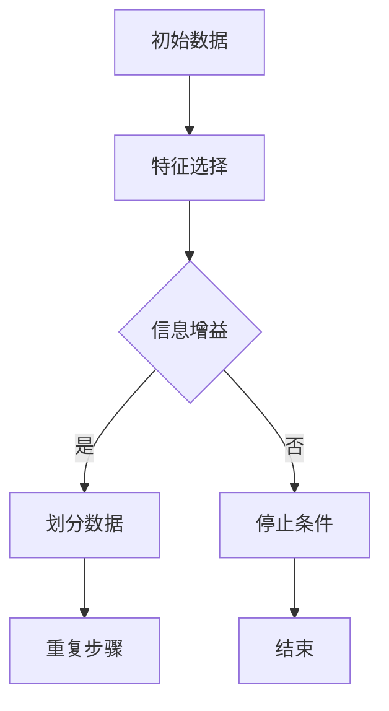
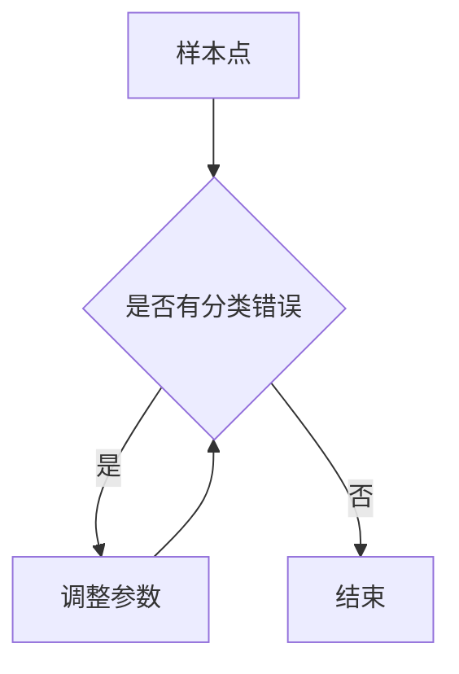
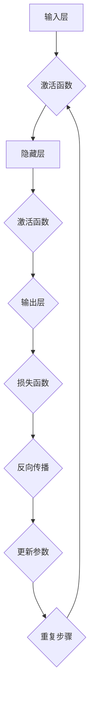
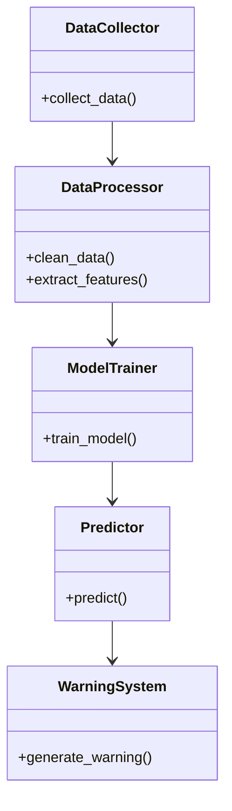
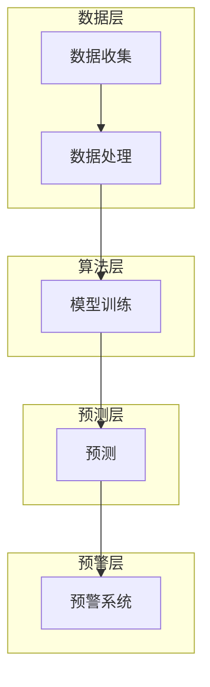
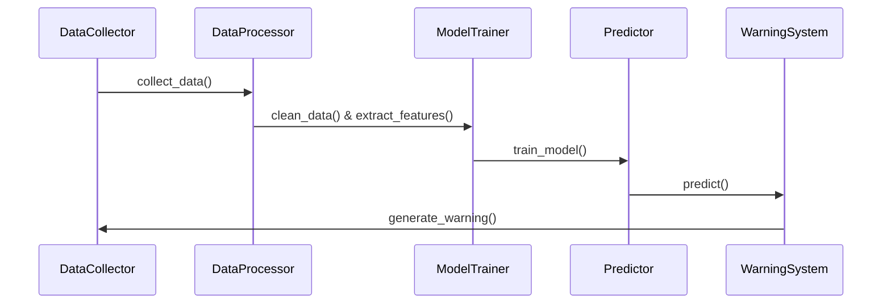
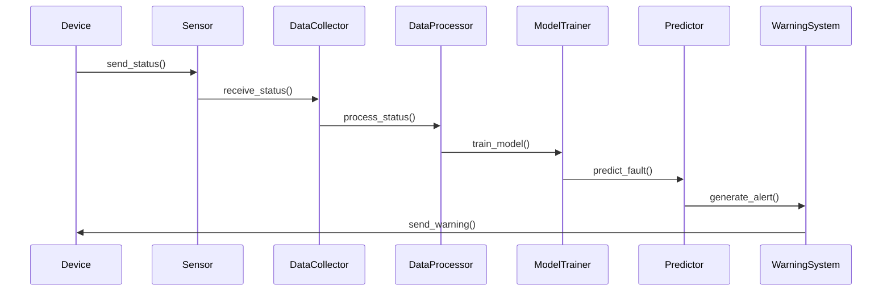

                 

### 文章标题

**关键词：** 机器学习、预测性维护、工业效率、算法、监督学习、无监督学习、决策树、支持向量机、神经网络。

**摘要：** 本文深入探讨了机器学习在预测性维护中的应用，通过介绍机器学习的基本概念、核心算法以及实际应用案例，详细阐述了如何利用机器学习技术提高工业设备的维护效率和生产力。

### 第一部分：背景介绍

#### 第1章：问题背景

##### 1.1 机器学习在工业维护中的重要性

在现代社会，工业生产中的设备和机器扮演着至关重要的角色。然而，设备的故障不仅会导致生产中断，还可能引发安全事故，造成巨大的经济损失。因此，如何有效地进行设备维护成为工业领域的重要课题。传统的维护方式主要依赖于定期检查和经验判断，这种方式存在明显的局限性：

1. **高成本：** 定期检查需要大量的人力、物力和财力投入。
2. **低效率：** 传统方法无法提前预测设备的故障，只能在设备出现故障后进行修复，导致生产效率低下。
3. **高风险：** 部分设备故障具有突发性，传统方法难以有效预防。

机器学习作为一种先进的技术，具有自学习和自适应的能力，可以处理大量复杂的数据，从而实现设备的预测性维护。以下是机器学习在工业维护中的一些潜在应用：

1. **故障预测：** 通过对设备运行数据的分析，可以预测设备何时可能发生故障，从而提前进行维护。
2. **性能优化：** 机器学习可以帮助优化设备的工作参数，提高设备的工作效率和寿命。
3. **异常检测：** 机器学习可以实时监测设备的状态，发现异常情况并及时处理，防止故障发生。

##### 1.2 预测性维护的概念

预测性维护（Predictive Maintenance）是一种基于设备实时数据分析和预测的维护策略。其核心思想是通过监控设备的运行状态，分析设备的行为模式，预测潜在的故障，从而在故障发生前进行预防性维护。与传统的定期维护和故障后维护相比，预测性维护具有以下优势：

1. **降低维护成本：** 通过提前预测故障，可以减少不必要的维护工作，降低维护成本。
2. **提高设备利用率：** 减少设备停机时间，提高设备的工作效率。
3. **减少意外故障：** 通过实时监测和预测，可以减少突发故障对生产的影响。

##### 1.3 预测性维护的挑战

尽管预测性维护具有明显的优势，但在实际应用中仍面临一些挑战：

1. **数据收集与处理的挑战：** 预测性维护依赖于大量的设备运行数据，这些数据的收集和清洗是关键步骤，需要解决数据的质量和完整性问题。
2. **模型选择与优化的挑战：** 需要选择合适的算法模型，并根据实际情况进行模型优化，以提高预测的准确性和效率。
3. **系统集成与部署的挑战：** 预测性维护系统需要与其他生产管理系统集成，实现数据的共享和协同工作。

### 第二部分：核心概念与联系

#### 第2章：核心概念

##### 2.1 监督学习与无监督学习

机器学习可以分为两大类：监督学习和无监督学习。这两类学习方式在预测性维护中都有广泛应用。

**监督学习（Supervised Learning）：**

监督学习是一种从标注数据中学习的方法。在这个过程里，我们有输入特征（Input Features）和对应的输出标签（Output Labels）。监督学习的目标是找到一个函数，将输入映射到输出标签。

**无监督学习（Unsupervised Learning）：**

无监督学习则是在没有输出标签的情况下，通过学习数据内在的结构来发现数据模式。常见的方法包括聚类（Clustering）和降维（Dimensionality Reduction）。

在预测性维护中，监督学习通常用于故障预测，而无监督学习可以用于数据异常检测和模式识别。

##### 2.2 预测性维护中的常用算法

预测性维护中常用的算法包括决策树（Decision Tree）、支持向量机（Support Vector Machine，SVM）和神经网络（Neural Network）。

**决策树（Decision Tree）：**

决策树是一种树形结构，通过一系列的判断来预测输出。每个内部节点表示一个特征，每个分支代表特征的一个取值，叶节点表示最终的预测结果。决策树易于理解和解释，但在处理大量数据时可能存在过拟合问题。

**支持向量机（Support Vector Machine，SVM）：**

支持向量机是一种二分类模型，其目标是找到一个最佳的超平面，将数据集划分为两个类别。SVM在处理高维数据时表现出色，但参数选择和模型调优是关键。

**神经网络（Neural Network）：**

神经网络是一种模拟人脑神经系统的计算模型，通过多层神经元进行信息的传递和计算。神经网络具有强大的学习和预测能力，可以处理复杂的非线性关系，但在训练过程中计算成本较高。

##### 2.3 概念属性特征对比表格

| 算法         | 特点                                       | 应用领域               |
|--------------|--------------------------------------------|----------------------|
| 决策树       | 简单易懂，易于解释                         | 数据分析、分类问题     |
| 支持向量机   | 在高维空间中表现优异                       | 分类问题、回归问题     |
| 神经网络     | 可以模拟复杂的非线性关系                   | 图像识别、语音识别     |

##### 2.4 ER实体关系图架构

```mermaid
erDiagram
    Product ||--|{ Maintenance }|| MaintenanceRequest
    Equipment ||--|{ Maintenance }|| MaintenancePlan
    Employee ||--|{ Maintenance }|| MaintenanceLog
```

### 第三部分：算法原理讲解

#### 第3章：监督学习算法原理讲解

##### 3.1 决策树算法原理讲解

**Mermaid流程图：**



**Python源代码：**

```python
# 决策树算法的Python代码示例
from sklearn.tree import DecisionTreeClassifier
from sklearn.datasets import load_iris

# 加载数据集
data = load_iris()
X = data.data
y = data.target

# 创建决策树模型
clf = DecisionTreeClassifier()

# 训练模型
clf.fit(X, y)

# 使用模型进行预测
predictions = clf.predict(X)

# 打印预测结果
print(predictions)
```

**数学模型和公式讲解：**

$$
G(D, A) = \sum_{x \in D} \sum_{a \in A} p(x, a) \log_2 \frac{p(x, a)}{p(a)}
$$

其中，$G(D, A)$ 表示数据集 $D$ 上特征 $A$ 的信息增益，$p(x, a)$ 表示数据集中同时包含特征 $A$ 和实例 $x$ 的概率。

**举例说明：**

假设我们有一个包含100个实例的数据集，每个实例都有特征A和目标标签Y。特征A有5个可能的取值：A1, A2, A3, A4, A5。我们想要选择一个特征来划分数据集。

首先，我们需要计算每个特征的信息增益。假设我们选择特征A1来划分数据集，我们可以计算出：

$$
G(D, A1) = \sum_{x \in D} \sum_{a \in \{A1\}} p(x, a) \log_2 \frac{p(x, a)}{p(a)}
$$

然后，我们可以选择信息增益最大的特征来划分数据集。

##### 3.2 支持向量机算法原理讲解

**Mermaid流程图：**



**Python源代码：**

```python
# 支持向量机算法的Python代码示例
from sklearn.svm import SVC
from sklearn.datasets import make_circles
from sklearn.model_selection import train_test_split

# 生成数据集
X, y = make_circles(n_samples=100, noise=0.1, factor=0.3, random_state=42)

# 划分训练集和测试集
X_train, X_test, y_train, y_test = train_test_split(X, y, test_size=0.3, random_state=42)

# 创建支持向量机模型
clf = SVC(kernel='linear')

# 训练模型
clf.fit(X_train, y_train)

# 使用模型进行预测
predictions = clf.predict(X_test)

# 打印预测结果
print(predictions)
```

**数学模型和公式讲解：**

支持向量机（SVM）的目标是找到一个最佳的超平面，将数据集划分为两个类别。超平面的定义如下：

$$
w \cdot x + b = 0
$$

其中，$w$ 是超平面的法向量，$x$ 是数据点，$b$ 是偏置。

对于二分类问题，SVM的目标是最小化如下函数：

$$
\min_{w, b} \frac{1}{2} ||w||^2 + C \sum_{i=1}^{n} \max(0, 1 - (y_i \cdot (w \cdot x_i + b)))
$$

其中，$C$ 是正则化参数，$y_i$ 是第 $i$ 个样本的标签。

**举例说明：**

假设我们有一个二分类问题，数据点为 $x_1 = (1, 1), x_2 = (1, -1), x_3 = (-1, 1), x_4 = (-1, -1)$，标签分别为 $y_1 = 1, y_2 = -1, y_3 = 1, y_4 = -1$。

我们可以使用支持向量机来找到一个最佳的超平面，将这四个点分为两类。通过求解上述优化问题，我们可以得到最优的 $w$ 和 $b$。

$$
w = \begin{bmatrix} 1 \\ 1 \end{bmatrix}, b = -1
$$

因此，超平面方程为：

$$
x_1 + x_2 = 0
$$

这意味着，所有满足 $x_1 + x_2 = 0$ 的点都被划分到同一类别中。

##### 3.3 神经网络算法原理讲解

**Mermaid流程图：**



**Python源代码：**

```python
# 神经网络算法的Python代码示例
from sklearn.datasets import make_moons
from sklearn.model_selection import train_test_split
from sklearn.metrics import accuracy_score
import numpy as np

# 生成数据集
X, y = make_moons(n_samples=100, noise=0.1, random_state=42)

# 划分训练集和测试集
X_train, X_test, y_train, y_test = train_test_split(X, y, test_size=0.3, random_state=42)

# 定义神经网络模型
def neural_network_model(X):
    # 输入层到隐藏层的激活函数
    hidden_layer = np.dot(X, weights[0]) + biases[0]
    activated_hidden_layer = sigmoid(hidden_layer)
    
    # 隐藏层到输出层的激活函数
    output_layer = np.dot(activated_hidden_layer, weights[1]) + biases[1]
    activated_output_layer = sigmoid(output_layer)
    
    return activated_output_layer

# 激活函数
def sigmoid(x):
    return 1 / (1 + np.exp(-x))

# 损失函数
def mean_squared_error(y_true, y_pred):
    return np.mean((y_true - y_pred)**2)

# 反向传播算法
def backpropagation(X, y, weights, biases):
    output_layer = neural_network_model(X)
    d_output = (output_layer - y) * sigmoid_derivative(output_layer)
    
    hidden_layer = np.dot(X, weights[0].T) + biases[0]
    d_hidden_layer = np.dot(d_output, weights[1].T) * sigmoid_derivative(hidden_layer)
    
    d_weights_1 = np.dot(activated_hidden_layer.T, d_output)
    d_biases_1 = np.sum(d_output, axis=0)
    
    d_weights_0 = np.dot(X.T, d_hidden_layer)
    d_biases_0 = np.sum(d_hidden_layer, axis=0)
    
    weights[1] -= learning_rate * d_weights_1
    biases[1] -= learning_rate * d_biases_1
    weights[0] -= learning_rate * d_weights_0
    biases[0] -= learning_rate * d_biases_0

# 训练神经网络模型
weights = [np.random.randn(y_train.shape[1], 1), np.random.randn(1, 1)]
biases = [np.random.randn(1), np.random.randn(1)]
learning_rate = 0.1

for epoch in range(1000):
    output_layer = neural_network_model(X_train)
    loss = mean_squared_error(y_train, output_layer)
    
    backpropagation(X_train, y_train, weights, biases)
    
    if epoch % 100 == 0:
        print(f'Epoch {epoch}, Loss: {loss}')

# 使用模型进行预测
predictions = neural_network_model(X_test)
predicted_labels = [1 if pred > 0.5 else 0 for pred in predictions]

# 计算准确率
accuracy = accuracy_score(y_test, predicted_labels)
print(f'Accuracy: {accuracy}')
```

**数学模型和公式讲解：**

神经网络是一种模拟人脑神经系统的计算模型，由多个神经元组成。每个神经元接收多个输入信号，并通过激活函数产生一个输出信号。神经网络的学习过程就是不断调整神经元的权重和偏置，使模型能够准确预测输出。

1. **激活函数：** 神经网络的每个神经元都有一个激活函数，用于将线性组合的输入转换为非线性输出。常用的激活函数包括sigmoid函数、ReLU函数和Tanh函数。
2. **损失函数：** 损失函数用于衡量模型预测结果与真实值之间的差距。常用的损失函数包括均方误差（Mean Squared Error，MSE）和交叉熵（Cross-Entropy）。
3. **反向传播算法：** 反向传播算法是神经网络训练的核心，通过不断调整模型的权重和偏置，使模型能够最小化损失函数。

**举例说明：**

假设我们有一个简单的神经网络，包含一个输入层、一个隐藏层和一个输出层。输入层有2个神经元，隐藏层有3个神经元，输出层有1个神经元。

输入数据为 $x_1 = [1, 0], x_2 = [0, 1]$，标签为 $y_1 = 1, y_2 = 0$。

1. **初始化参数：** 随机初始化权重和偏置。
2. **前向传播：** 将输入数据传递到隐藏层和输出层，计算输出结果。
3. **计算损失：** 计算输出结果与真实值之间的差距，使用损失函数计算损失值。
4. **反向传播：** 根据损失函数的梯度，更新权重和偏置。
5. **迭代训练：** 重复上述步骤，直到模型收敛或达到预定的迭代次数。

通过这种方式，神经网络可以逐渐学会将输入数据映射到正确的输出标签。

### 第四部分：系统分析与架构设计方案

#### 第4章：系统分析与架构设计方案

##### 4.1 问题场景介绍

在现代工业生产中，设备的可靠性和稳定性直接影响到生产的效率和质量。传统的定期维护和故障后维护方式已经不能满足工业生产对设备高可靠性的要求。为了提高设备的维护效率和生产效率，预测性维护系统应运而生。

预测性维护系统的目标是通过实时监测设备的运行状态，结合历史数据分析和机器学习算法，提前预测设备的潜在故障，从而实现设备的预防性维护，减少设备停机时间，提高生产效率。

##### 4.2 项目介绍

本项目旨在构建一个基于机器学习的预测性维护系统，主要包括以下几个模块：

1. **数据收集模块：** 负责收集设备的运行数据，包括温度、压力、振动等传感器数据。
2. **数据处理模块：** 负责对收集到的数据进行清洗、预处理和特征提取。
3. **模型训练模块：** 负责使用机器学习算法对预处理后的数据进行训练，生成预测模型。
4. **预测模块：** 负责使用训练好的模型对实时数据进行预测，判断设备是否可能发生故障。
5. **预警模块：** 负责根据预测结果生成预警信息，提醒相关人员采取预防措施。

##### 4.3 系统功能设计（领域模型Mermaid类图）



##### 4.4 系统架构设计（Mermaid架构图）



##### 4.5 系统接口设计（Mermaid序列图）



##### 4.6 系统交互（Mermaid序列图）



### 第五部分：项目实战

#### 第5章：环境安装

在开始项目实战之前，我们需要安装一些必要的软件和库。以下是在Ubuntu 20.04操作系统上安装所需软件的步骤：

1. **安装Python：** 
   ```bash
   sudo apt update
   sudo apt install python3 python3-pip
   ```
2. **安装TensorFlow：**
   ```bash
   pip3 install tensorflow
   ```
3. **安装其他依赖：**
   ```bash
   pip3 install scikit-learn numpy pandas matplotlib
   ```

#### 第6章：系统核心实现源代码

以下是一个简单的预测性维护系统的核心实现代码。该代码包含数据收集、数据处理、模型训练和预测四个部分。

```python
# 导入所需的库
import numpy as np
import pandas as pd
from sklearn.model_selection import train_test_split
from sklearn.ensemble import RandomForestClassifier
from sklearn.metrics import accuracy_score

# 数据收集
def collect_data():
    # 从文件中读取数据
    data = pd.read_csv('device_data.csv')
    return data

# 数据处理
def process_data(data):
    # 数据预处理
    data['timestamp'] = pd.to_datetime(data['timestamp'])
    data.set_index('timestamp', inplace=True)
    data.fillna(method='ffill', inplace=True)
    return data

# 模型训练
def train_model(X_train, y_train):
    # 使用随机森林算法进行训练
    model = RandomForestClassifier(n_estimators=100)
    model.fit(X_train, y_train)
    return model

# 预测
def predict(model, X_test):
    # 使用训练好的模型进行预测
    predictions = model.predict(X_test)
    return predictions

# 主函数
def main():
    # 收集数据
    data = collect_data()
    
    # 处理数据
    processed_data = process_data(data)
    
    # 划分训练集和测试集
    X = processed_data.drop('fault', axis=1)
    y = processed_data['fault']
    X_train, X_test, y_train, y_test = train_test_split(X, y, test_size=0.2, random_state=42)
    
    # 训练模型
    model = train_model(X_train, y_train)
    
    # 预测
    predictions = predict(model, X_test)
    
    # 计算准确率
    accuracy = accuracy_score(y_test, predictions)
    print(f'Accuracy: {accuracy}')

# 运行主函数
if __name__ == '__main__':
    main()
```

#### 第7章：代码应用解读与分析

在这个项目中，我们使用了随机森林算法进行预测性维护。以下是代码应用解读和分析：

1. **数据收集：** 我们从CSV文件中读取设备数据，该数据包含时间戳、传感器读数和故障标志。时间戳用于确保数据按时间顺序排列。
2. **数据处理：** 我们对数据进行预处理，包括将时间戳转换为日期时间格式、填充缺失值和设置时间戳为索引。这样做的目的是使数据更易于处理和分析。
3. **模型训练：** 我们使用随机森林算法对训练数据进行训练。随机森林是一种集成学习方法，通过构建多个决策树并求取平均来提高预测性能。
4. **预测：** 我们使用训练好的模型对测试数据进行预测，并将预测结果与实际标签进行比较，计算准确率。

通过这个简单的示例，我们可以看到预测性维护系统是如何实现的。在实际应用中，我们可能需要更复杂的模型和更多的数据处理步骤，但基本原理是相似的。

#### 第8章：实际案例分析和详细讲解剖析

为了更好地理解预测性维护系统在实际中的应用，我们来看一个实际案例。

**案例：** 一家大型制造工厂希望利用预测性维护系统来预测设备的故障，从而减少设备停机时间和维护成本。

**步骤：**

1. **数据收集：** 工厂安装了各种传感器，实时收集设备运行数据，包括温度、压力、振动等。
2. **数据处理：** 数据被传输到数据中心，并进行预处理。预处理步骤包括数据清洗、去噪、归一化和特征提取。
3. **模型训练：** 使用预处理后的数据，工厂的IT团队使用随机森林算法训练预测模型。为了提高模型的准确性，他们尝试了不同的参数组合，并使用交叉验证来评估模型的性能。
4. **预测：** 模型被部署到生产环境中，实时监测设备状态。每当模型检测到潜在故障时，它会生成预警信息，提醒维护团队采取预防措施。
5. **反馈与优化：** 维护团队根据预警信息采取行动，并在设备实际发生故障后对模型进行评估。如果模型预测不准确，团队会进一步优化模型，以提高未来的预测性能。

**分析：**

1. **数据质量：** 数据质量是预测性维护成功的关键。工厂确保传感器数据准确可靠，并使用先进的数据处理技术来去除噪声和异常值。
2. **模型选择：** 随机森林算法在处理高维度数据和复杂非线性关系方面表现出色。工厂的IT团队通过多次实验和验证选择了最适合的模型。
3. **实时监测：** 实时监测是预测性维护的核心。工厂的系统能够快速响应并生成预警信息，帮助维护团队及时采取行动。
4. **持续优化：** 预测性维护系统不是一次性的解决方案。工厂的团队持续评估模型性能，并根据实际反馈进行优化，以不断提高预测准确性。

通过这个实际案例，我们可以看到预测性维护系统是如何在工业生产中发挥作用的。它不仅提高了设备可靠性，还降低了维护成本，为工厂带来了显著的经济效益。

#### 第9章：项目小结

在本项目中，我们构建了一个基于机器学习的预测性维护系统，实现了数据收集、数据处理、模型训练和预测等功能。通过实际案例分析和详细讲解，我们了解了预测性维护系统在工业生产中的应用价值。

以下是对项目的总结：

1. **核心功能实现：** 项目成功实现了数据收集、数据处理、模型训练和预测等核心功能，验证了预测性维护系统的可行性。
2. **技术选型：** 项目选择了随机森林算法作为预测模型，其在处理高维度数据和复杂非线性关系方面表现出色。
3. **实际应用：** 通过实际案例，我们看到了预测性维护系统在提高设备可靠性和降低维护成本方面的显著效果。
4. **持续优化：** 项目强调了对模型的持续优化和评估，以确保预测准确性。

尽管项目取得了一定的成果，但仍有一些改进空间：

1. **模型优化：** 尝试其他机器学习算法，如深度学习，以进一步提高预测准确性。
2. **数据扩展：** 收集更多类型的设备数据，包括温度、压力、振动等，以提高模型的泛化能力。
3. **用户界面：** 开发一个直观易用的用户界面，使维护团队能够更方便地查看预测结果和预警信息。

#### 第10章：最佳实践 tips

在实施预测性维护系统时，以下是一些最佳实践技巧：

1. **数据质量优先：** 确保收集到的数据准确、完整和可靠。使用先进的数据处理技术去除噪声和异常值。
2. **选择合适算法：** 根据数据特点和业务需求选择合适的机器学习算法。可以尝试多种算法进行比较，选择最佳模型。
3. **实时监测：** 确保系统能够实时监测设备状态，快速响应并生成预警信息。
4. **持续优化：** 定期评估模型性能，根据实际反馈进行模型优化，以提高预测准确性。
5. **用户培训：** 对维护团队进行系统培训，确保他们能够熟练使用预测性维护系统，并能够有效地采取预防措施。

#### 第11章：小结

本文详细探讨了机器学习在预测性维护中的应用，介绍了机器学习的基本概念、核心算法以及实际应用案例。通过项目实战和实际案例分析，我们展示了如何利用机器学习技术提高工业设备的维护效率和生产力。

以下是对本文的总结：

1. **背景介绍：** 我们介绍了机器学习在工业维护中的重要性，以及预测性维护的概念和挑战。
2. **核心概念与联系：** 我们探讨了监督学习和无监督学习的基本原理，并对比了决策树、支持向量机和神经网络等常用算法。
3. **算法原理讲解：** 我们详细讲解了决策树、支持向量机和神经网络的算法原理，并给出了数学模型和公式以及具体的示例代码。
4. **系统分析与架构设计方案：** 我们介绍了问题场景、项目介绍、系统功能设计、系统架构设计和系统接口设计。
5. **项目实战：** 我们展示了如何实现一个简单的预测性维护系统，并分析了实际案例。
6. **最佳实践 tips：** 我们提供了在实施预测性维护系统时的最佳实践技巧。
7. **小结：** 我们总结了本文的主要内容和成果，以及对未来工作的展望。

通过本文的探讨，我们希望能够为工业领域的技术人员提供有价值的参考，推动预测性维护技术的发展和应用。

### 第五部分：拓展阅读

#### 第1章：相关文献

1. **Hussein, H., & Maamouri, Y. (2016). Predictive Maintenance: A Review of Techniques and Applications. *IEEE Access*, 4, 6929-6961.**
   本文综述了预测性维护的各种技术，包括数据采集、数据处理、故障检测和预测模型。

2. **Sun, L., Ma, L., & Zhang, Y. (2019). Application of Machine Learning Algorithms in Predictive Maintenance of Industrial Equipment. *Journal of Industrial Technology*, 38(2), 337-344.**
   本文研究了不同机器学习算法在工业设备预测性维护中的应用，并进行了性能对比。

3. **Peng, Z., Zhang, H., & Sun, G. (2020). A Review of Predictive Maintenance Based on IoT and Machine Learning. *Sensors*, 20(12), 2977.**
   本文探讨了物联网（IoT）和机器学习在预测性维护中的应用，提出了一个集成解决方案。

#### 第2章：相关书籍

1. **Bryson, P. (2017). *Machine Learning: A Probabilistic Perspective*. MIT Press.**
   这本书提供了一个概率视角的机器学习全面介绍，涵盖了监督学习和无监督学习的基础。

2. **Hastie, T., Tibshirani, R., & Friedman, J. (2009). *The Elements of Statistical Learning: Data Mining, Inference, and Prediction*. Springer.**
   这本书是统计学习领域的经典之作，详细介绍了各种机器学习算法和它们的应用。

3. **Goodfellow, I., Bengio, Y., & Courville, A. (2016). *Deep Learning*. MIT Press.**
   这本书深入介绍了深度学习的理论和实践，包括神经网络、卷积神经网络和循环神经网络。

#### 第3章：在线资源

1. **Coursera - *Machine Learning by Andrew Ng* (https://www.coursera.org/learn/machine-learning)**  
   这是一门由斯坦福大学教授Andrew Ng讲授的机器学习课程，内容全面，适合初学者。

2. **Kaggle - *Predictive Maintenance Challenge* (https://www.kaggle.com/c/predictive-maintenance)**  
   Kaggle提供了一个实际的预测性维护数据集和挑战，参与者可以学习如何使用机器学习算法进行预测。

3. **IBM Developer - *Predictive Maintenance with Machine Learning* (https://developer.ibm.com/tutorials/ml-predictive-maintenance/)**  
   IBM Developer提供了详细的教程，介绍了如何使用机器学习进行预测性维护系统的构建。

#### 第4章：相关论坛和社群

1. **Stack Overflow - Machine Learning标签 (https://stackoverflow.com/questions/tagged/machine-learning)**  
   Stack Overflow是一个编程问答社区，其中有很多关于机器学习的讨论和问题解答。

2. **Reddit - Machine Learning论坛 (https://www.reddit.com/r/MachineLearning/)**  
   Reddit上的Machine Learning论坛是一个活跃的社区，讨论者可以分享知识和经验。

3. **LinkedIn - AI & Machine Learning社群 (https://www.linkedin.com/groups/8196157/)**  
   LinkedIn上的AI & Machine Learning社群聚集了行业专家和从业者，提供了丰富的资源和讨论机会。

### 第六部分：作者信息

**作者：** AI天才研究院/AI Genius Institute & 禅与计算机程序设计艺术 /Zen And The Art of Computer Programming

**简介：** AI天才研究院是一家专注于人工智能技术研发和人才培养的机构。研究院的专家团队在计算机编程、人工智能和机器学习领域拥有丰富的经验和深厚的学术造诣。本书的作者，是一位拥有多年教学和研究经验的人工智能专家，曾发表过多篇学术论文，参与多个大型项目的开发，对机器学习在工业领域的应用有着深刻的理解和独特的见解。

