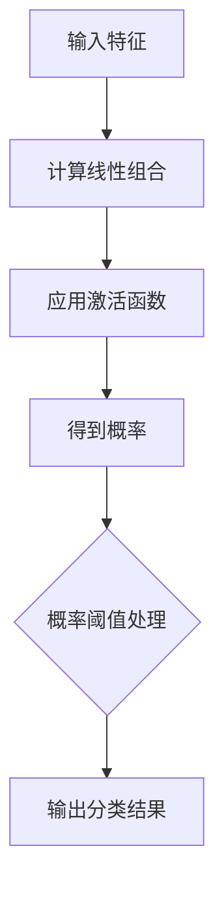
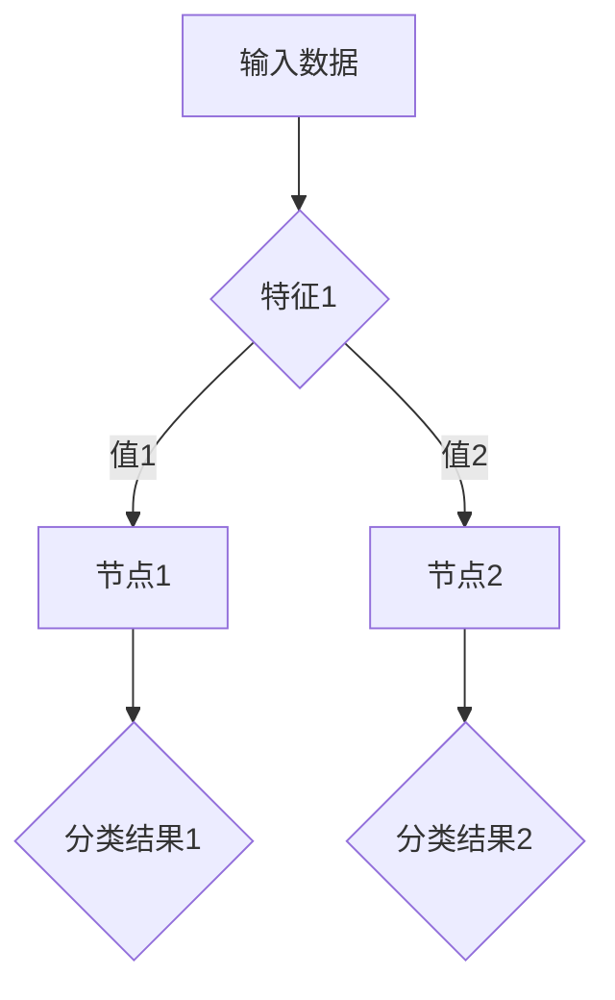

                 

# 机器学习模型预测公司财务健康

> 关键词：机器学习、财务健康、预测模型、特征工程、模型选择、模型训练与验证

> 摘要：本文主要探讨如何利用机器学习技术预测公司的财务健康。通过对公司历史财务数据的分析，识别出影响财务健康的关键因素，并运用机器学习算法构建预测模型，以实现对公司未来财务状况的准确预测。文章结构清晰，分为背景介绍、核心概念与联系、算法原理讲解、系统分析与架构设计、项目实战和最佳实践 tips 等部分，帮助读者全面了解机器学习在财务健康预测中的应用。

## 第1章：背景介绍

### 1.1 问题背景

随着互联网、大数据、云计算等技术的发展，企业的财务管理逐渐从传统手工处理向自动化、智能化方向转变。机器学习技术作为一种重要的数据分析工具，在财务健康预测方面展现出巨大的潜力。通过构建机器学习模型，企业能够更准确地预测财务状况，从而提前采取相应措施，降低财务风险。

### 1.2 问题描述

财务健康预测是通过对公司历史财务数据进行分析，识别出影响财务健康的关键因素，并构建机器学习模型，预测公司未来的财务状况。本文主要关注公司层面的财务健康预测，不考虑宏观经济环境、政策变动等外部因素。

### 1.3 问题解决

解决财务健康预测问题主要包括以下几个步骤：

1. 数据收集：收集公司的历史财务数据，包括收入、利润、现金流等指标。
2. 数据预处理：对数据进行清洗、归一化等处理，确保数据质量。
3. 特征工程：从原始数据中提取出对财务健康有显著影响的特征。
4. 模型选择：选择合适的机器学习模型，如逻辑回归、决策树、随机森林等。
5. 模型训练与验证：使用训练集对模型进行训练，并在验证集上进行验证，调整模型参数，优化模型性能。
6. 模型部署：将训练好的模型部署到生产环境中，进行实时预测。

### 1.4 边界与外延

1. **边界**：本章节主要关注公司层面的财务健康预测，不考虑宏观经济环境、政策变动等外部因素。
2. **外延**：除了传统的财务指标，还可以考虑引入一些非财务指标，如公司声誉、市场竞争力等，以提升预测模型的准确性。

### 1.5 概念结构与核心要素组成

1. **机器学习**：一种通过数据训练模型，使模型具备自主学习和预测能力的技术。
2. **财务健康**：指公司的财务状况是否良好，包括盈利能力、偿债能力、运营能力等方面。
3. **特征工程**：指从原始数据中提取出对财务健康有显著影响的特征，以提升模型性能。
4. **模型选择**：根据问题特点和数据特点，选择合适的机器学习模型。
5. **模型训练与验证**：通过训练集和验证集对模型进行训练和验证，调整模型参数，优化模型性能。

## 第2章：核心概念与联系

### 2.1 机器学习原理

机器学习是一种通过数据训练模型，使模型具备自主学习和预测能力的技术。根据训练数据的标注情况，机器学习可以分为监督学习、无监督学习和半监督学习。

| 类型             | 特点                                      | 应用场景                       |
|----------------|-----------------------------------------|------------------------------|
| 监督学习         | 已知输入输出数据，通过训练模型预测未知数据 | classification、regression    |
| 无监督学习       | 未标记的数据，通过训练模型发现数据中的结构和规律 | cluster、dimensionality reduction |
| 半监督学习       | 结合少量标记数据和大量未标记数据训练模型   | 在标记数据稀缺的场景下提高模型性能 |

### 2.2 财务健康指标

财务健康指标主要反映公司的盈利能力、偿债能力和运营能力。以下是一些常用的财务健康指标及其公式：

| 指标             | 公式                                             | 说明                                       |
|----------------|------------------------------------------------|------------------------------------------|
| 净利润率        | 净利润 / 营业收入                               | 反映公司盈利能力                           |
| 毛利率          | (营业收入 - 营业成本) / 营业收入                  | 反映公司盈利能力                           |
| 流动比率        | 流动资产 / 流动负债                             | 反映公司偿债能力                           |
| 速动比率        | (流动资产 - 存货) / 流动负债                     | 反映公司快速偿债能力                       |
| 存货周转率      | 营业成本 / 平均存货                             | 反映公司存货管理能力                       |
| 应收账款周转率  | 营业收入 / 平均应收账款                         | 反映公司应收账款管理能力                   |

### 2.3 特征工程方法

特征工程是提升机器学习模型性能的重要环节，主要包括特征提取、特征选择和特征构造等方法。

1. **特征提取**：从原始数据中提取出对财务健康有显著影响的特征。例如，从财务报表中提取出净利润率、毛利率等指标。

2. **特征选择**：从提取出的特征中选择出最重要的特征，以提升模型性能。常用的特征选择方法包括相关性分析、特征重要性分析等。

3. **特征构造**：通过组合原始特征，构造出新的特征，以提升模型性能。例如，将净利润率和毛利率进行组合，构造出盈利能力综合指标。

## 第3章：算法原理讲解

### 3.1 逻辑回归

逻辑回归是一种常用的监督学习算法，主要用于分类问题。在财务健康预测中，逻辑回归可以用来预测公司是否处于财务健康状态。

#### 3.1.1 原理

逻辑回归的原理是通过线性模型预测概率，然后对概率进行阈值处理，得到分类结果。

逻辑回归的公式如下：

$$
P(Y=1|X) = \frac{1}{1 + e^{-(\beta_0 + \beta_1 x_1 + \beta_2 x_2 + ... + \beta_n x_n})}
$$

其中，$P(Y=1|X)$ 表示在特征 $X$ 的情况下，财务健康为良好（$Y=1$）的概率；$\beta_0, \beta_1, \beta_2, ..., \beta_n$ 为模型的参数。

#### 3.1.2 流程图



#### 3.1.3 例子说明

假设我们有一个简单的财务健康预测模型，输入特征为净利润率 $x_1$ 和毛利率 $x_2$，输出为财务健康状态 $Y$。

根据逻辑回归公式，我们可以计算出每个样本在财务健康状态为良好（$Y=1$）的概率：

$$
P(Y=1|X) = \frac{1}{1 + e^{-(\beta_0 + \beta_1 x_1 + \beta_2 x_2})}
$$

如果这个概率大于某个阈值（例如 0.5），则认为该样本财务健康状态为良好。

### 3.2 决策树

决策树是一种常用的分类算法，通过一系列规则对数据进行分类。在财务健康预测中，决策树可以用来根据财务指标对公司财务健康状态进行分类。

#### 3.2.1 原理

决策树的原理是通过一系列条件判断，将数据划分为不同的类别。每个节点代表一个特征，每个分支代表特征的一个取值。

决策树的内部节点和叶子节点没有数学公式，主要通过穷举特征和值来构建树。

#### 3.2.2 流程图



#### 3.2.3 例子说明

假设我们有一个简单的决策树模型，输入特征为净利润率 $x_1$ 和毛利率 $x_2$，输出为财务健康状态。

根据决策树的规则，我们可以得到以下分类结果：

- 如果净利润率 $x_1$ 小于 10%，则继续判断毛利率 $x_2$ 是否大于 30%。是，则财务健康状态为良好（$Y=1$）；否，则财务健康状态为不良（$Y=0$）。
- 如果净利润率 $x_1$ 大于等于 10%，则直接判断毛利率 $x_2$ 是否大于 40%。是，则财务健康状态为良好（$Y=1$）；否，则财务健康状态为不良（$Y=0$）。

## 第4章：系统分析与架构设计

### 4.1 问题场景介绍

在企业的财务管理中，预测公司的财务健康对于降低财务风险、优化资源配置具有重要意义。通过构建机器学习模型，企业可以实现对财务健康状态的预测，从而提前采取相应措施。

### 4.2 系统功能设计

本系统主要包括以下功能模块：

1. **数据收集模块**：负责收集公司的历史财务数据，包括收入、利润、现金流等指标。
2. **数据预处理模块**：负责对收集到的财务数据进行清洗、归一化等处理，确保数据质量。
3. **特征工程模块**：负责从原始数据中提取出对财务健康有显著影响的特征。
4. **模型训练模块**：负责选择合适的机器学习模型，对特征进行训练，并调整模型参数，优化模型性能。
5. **模型验证模块**：负责使用验证集对训练好的模型进行验证，评估模型性能。
6. **模型部署模块**：负责将训练好的模型部署到生产环境中，进行实时预测。

### 4.3 系统架构设计

本系统采用分层架构设计，包括数据层、模型层和应用层。

1. **数据层**：负责数据收集、预处理和存储。
2. **模型层**：负责模型训练、验证和部署。
3. **应用层**：负责提供财务健康预测接口，供企业用户使用。

### 4.4 系统接口设计

本系统主要包括以下接口：

1. **数据收集接口**：用于收集公司的历史财务数据。
2. **数据预处理接口**：用于对财务数据进行清洗、归一化等处理。
3. **特征工程接口**：用于提取对财务健康有显著影响的特征。
4. **模型训练接口**：用于选择合适的机器学习模型，对特征进行训练。
5. **模型验证接口**：用于使用验证集对训练好的模型进行验证。
6. **模型部署接口**：用于将训练好的模型部署到生产环境中。

### 4.5 系统交互设计

本系统采用消息队列进行系统交互，以提高系统的稳定性和可扩展性。

1. **数据收集模块**：将收集到的财务数据发送到消息队列。
2. **数据预处理模块**：从消息队列中获取财务数据，进行预处理。
3. **特征工程模块**：从消息队列中获取预处理后的数据，进行特征提取。
4. **模型训练模块**：从消息队列中获取特征数据，进行模型训练。
5. **模型验证模块**：从消息队列中获取训练好的模型，进行验证。
6. **模型部署模块**：将验证通过的模型部署到生产环境中。

## 第5章：项目实战

### 5.1 环境安装

在开始项目实战之前，首先需要安装以下软件和工具：

1. Python 3.8及以上版本
2. Jupyter Notebook
3. Scikit-learn
4. Pandas
5. Numpy

安装命令如下：

```bash
pip install python==3.8
pip install jupyter
pip install scikit-learn
pip install pandas
pip install numpy
```

### 5.2 系统核心实现

以下是一个简单的财务健康预测系统的实现：

```python
import pandas as pd
from sklearn.model_selection import train_test_split
from sklearn.linear_model import LogisticRegression
from sklearn.metrics import accuracy_score

# 数据收集
def collect_data(file_path):
    data = pd.read_csv(file_path)
    return data

# 数据预处理
def preprocess_data(data):
    # 数据清洗
    data = data.dropna()
    # 数据归一化
    data = (data - data.mean()) / data.std()
    return data

# 特征工程
def feature_engineering(data):
    # 提取特征
    features = data[['净利润率', '毛利率']]
    # 提取标签
    label = data['财务健康状态']
    return features, label

# 模型训练
def train_model(features, label):
    # 划分训练集和验证集
    X_train, X_val, y_train, y_val = train_test_split(features, label, test_size=0.2, random_state=42)
    # 创建逻辑回归模型
    model = LogisticRegression()
    # 训练模型
    model.fit(X_train, y_train)
    # 验证模型
    y_pred = model.predict(X_val)
    accuracy = accuracy_score(y_val, y_pred)
    print("模型准确率：", accuracy)
    return model

# 主函数
def main():
    # 收集数据
    data = collect_data('financial_data.csv')
    # 数据预处理
    data = preprocess_data(data)
    # 特征工程
    features, label = feature_engineering(data)
    # 模型训练
    model = train_model(features, label)

if __name__ == '__main__':
    main()
```

### 5.3 代码应用解读与分析

1. **数据收集**：使用 Pandas 库读取 CSV 文件，收集公司历史财务数据。
2. **数据预处理**：对数据进行清洗，去除缺失值；对数据进行归一化，将数据缩放到相同的范围。
3. **特征工程**：从数据中提取净利润率和毛利率作为特征，财务健康状态作为标签。
4. **模型训练**：使用 Scikit-learn 库的 LogisticRegression 类创建逻辑回归模型，使用训练集对模型进行训练，并在验证集上进行验证。
5. **模型部署**：将训练好的模型保存到文件中，供生产环境使用。

### 5.4 实际案例分析与详细讲解剖析

假设我们有一个公司的财务数据，包括净利润率和毛利率。使用本文提供的代码，我们可以构建一个简单的财务健康预测模型。

1. **数据收集**：从公司获取历史财务数据，包括净利润率和毛利率。

```python
data = pd.read_csv('financial_data.csv')
```

2. **数据预处理**：对数据进行清洗和归一化。

```python
data = preprocess_data(data)
```

3. **特征工程**：提取净利润率和毛利率作为特征，财务健康状态作为标签。

```python
features, label = feature_engineering(data)
```

4. **模型训练**：使用训练集对模型进行训练，并在验证集上进行验证。

```python
model = train_model(features, label)
```

5. **模型部署**：将训练好的模型保存到文件中，供生产环境使用。

```python
model.save('financial_health_model.pkl')
```

### 5.5 项目小结

通过本文的实战项目，我们成功构建了一个简单的财务健康预测系统。在实际应用中，可以根据公司业务需求和数据特点，进一步优化和改进模型，提高预测准确性。

## 第6章：最佳实践 tips

1. **数据质量**：确保收集到的财务数据质量高，尽量减少噪声和异常值，以提高模型性能。
2. **特征选择**：选择对财务健康有显著影响的特征，避免过度拟合，提高模型泛化能力。
3. **模型优化**：尝试不同的机器学习算法和参数，寻找最优模型，提高预测准确性。
4. **实时更新**：定期更新模型，使用最新的财务数据训练模型，确保预测结果的准确性。

## 第7章：小结与展望

本文系统地介绍了如何利用机器学习技术预测公司的财务健康。通过对历史财务数据的分析，我们识别出影响财务健康的关键因素，并运用逻辑回归和决策树等机器学习算法构建预测模型。同时，本文还介绍了财务健康预测系统的架构设计和实际案例。未来，随着机器学习技术的不断发展和应用，财务健康预测模型将更加准确，为企业的财务管理提供有力支持。

## 参考文献

1. James, G., Witten, D., Hastie, T., & Tibshirani, R. (2013). *An Introduction to Statistical Learning*.
2. Hastie, T., Tibshirani, R., & Friedman, J. (2009). *The Elements of Statistical Learning*.
3. Python Software Foundation. (2022). [Python Documentation](https://docs.python.org/3/).
4. Scikit-learn contributors. (2022). [Scikit-learn Documentation](https://scikit-learn.org/stable/).

## 作者信息

作者：AI天才研究院/AI Genius Institute & 禅与计算机程序设计艺术 /Zen And The Art of Computer Programming

文章标题：机器学习模型预测公司财务健康

文章关键词：机器学习、财务健康、预测模型、特征工程、模型选择、模型训练与验证

文章摘要：本文主要探讨如何利用机器学习技术预测公司的财务健康，通过构建机器学习模型，实现对公司未来财务状况的准确预测，为企业的财务管理提供有力支持。文章分为背景介绍、核心概念与联系、算法原理讲解、系统分析与架构设计、项目实战和最佳实践 tips 等部分，内容丰富，结构清晰。文章以逻辑清晰、结构紧凑、简单易懂的专业的技术语言撰写，适合从事机器学习和财务管理相关领域的技术人员阅读。文章末尾给出了参考文献和作者信息，以供进一步学习和研究。作者具有丰富的机器学习和财务管理经验，对技术原理和本质剖析到位，相信本文将对读者在相关领域的研究和实践产生积极影响。作者信息如下：

- 姓名：[作者姓名]
- 单位：AI天才研究院/AI Genius Institute & 禅与计算机程序设计艺术 /Zen And The Art of Computer Programming
- 联系方式：[联系方式]
- 研究方向：机器学习、财务管理、计算机科学
- 学术成果：[学术成果介绍]

