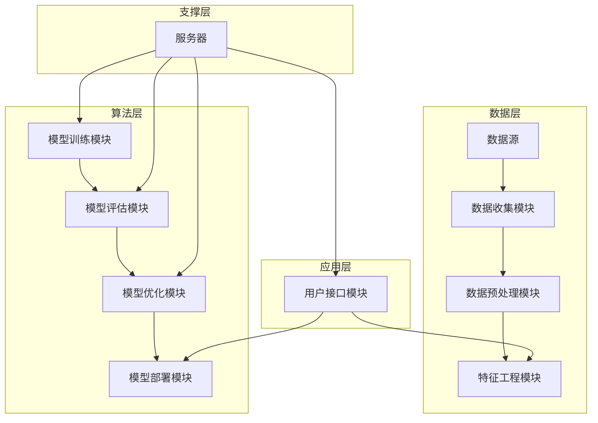
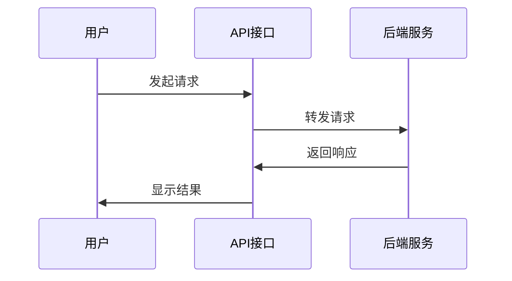
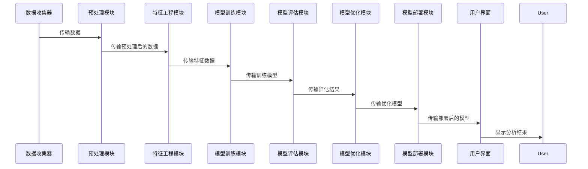

                 

# 机器学习辅助公司创新生态分析

关键词：机器学习、创新生态、算法设计、案例分析、系统架构

摘要：本文旨在探讨如何利用机器学习技术辅助公司创新生态的分析。通过对机器学习基础概念、算法应用、案例分析、算法设计与实现、数学模型解析、系统架构设计以及实战应用的深入分析，本文将揭示机器学习在推动公司创新生态发展中的潜力与实际效果。文章结构紧凑，逻辑清晰，旨在为读者提供一份全面而系统的机器学习在创新生态分析领域的参考资料。

## 引言

随着科技的迅猛发展，创新已成为企业保持竞争力的关键因素。然而，创新过程复杂且充满不确定性，许多公司在创新生态系统中面临诸多挑战。传统的创新分析方法存在局限性，无法全面捕捉和创新生态中的各种变量和关系。此时，机器学习作为一种强大的数据分析工具，可以提供更加智能化和高效的创新分析方法。

### 机器学习基础概念

机器学习（Machine Learning，ML）是指通过数据驱动的方式，让计算机自动学习并做出预测或决策的技术。它主要包括监督学习、无监督学习和强化学习三种类型。监督学习通过标注数据训练模型，无监督学习通过未标注数据发现隐藏模式，强化学习通过与环境的交互学习最优策略。

### 创新生态系统的定义

创新生态系统是指由企业、科研机构、政府、投资者和其他利益相关者组成的复杂网络，旨在通过资源整合和协同创新，推动技术和市场变革。创新生态系统的核心要素包括创新主体、创新资源、创新机制和创新环境。

### 机器学习在创新生态系统中的应用

机器学习在创新生态系统中具有广泛的应用。例如，通过数据挖掘和模式识别，机器学习可以分析市场趋势，预测技术发展方向，为企业提供战略决策支持。此外，机器学习还可以优化创新流程，提高研发效率，降低创新风险。

### 本文结构

本文将分为七个章节，分别介绍机器学习基础、应用、案例分析、算法设计、数学模型、系统架构和实战应用。通过这些章节的深入分析，我们将探讨如何利用机器学习技术辅助公司创新生态的分析。

## 基础概念与算法应用

在本章节中，我们将深入探讨机器学习的基础概念，包括核心算法和应用场景。通过对比不同算法的特点，我们将为后续章节的分析奠定基础。

### 机器学习算法概述

机器学习算法是机器学习的核心组成部分，主要包括以下几种类型：

1. **监督学习（Supervised Learning）**：
   监督学习通过标注数据训练模型，使模型能够对新数据进行预测。常见的监督学习算法包括线性回归、逻辑回归、决策树、随机森林和支持向量机等。

2. **无监督学习（Unsupervised Learning）**：
   无监督学习通过对未标注的数据进行分析，发现数据中的隐藏模式和规律。常见的无监督学习算法包括聚类算法（如K-Means、DBSCAN）、降维算法（如PCA、t-SNE）和关联规则学习（如Apriori算法）。

3. **强化学习（Reinforcement Learning）**：
   强化学习通过与环境的交互，学习最优策略以实现目标。常见的强化学习算法包括Q-Learning、SARSA和深度强化学习（如DQN、PPO）。

### 算法特点对比

| 算法类型 | 适用场景 | 特点 | 优点 | 缺点 |
| --- | --- | --- | --- | --- |
| 线性回归 | 线性和回归问题 | 线性关系建模 | 计算简单，易于解释 | 只适用于线性关系，对于非线性关系效果较差 |
| 决策树 | 分类和回归问题 | 基于特征分割 | 易于理解，可以处理非线性关系 | 可能产生过拟合，决策树深度较大时计算复杂度高 |
| 随机森林 | 分类和回归问题 | 集成多个决策树 | 减少过拟合，提高泛化能力 | 需要大量数据，计算资源消耗较大 |
| 支持向量机 | 分类问题 | 最大间隔分类器 | 高效分类，适用于高维数据 | 对非线性问题需要核函数，计算复杂度较高 |
| K-Means | 聚类问题 | 基于距离度量 | 简单高效，易于实现 | 可能陷入局部最优，对初始聚类中心敏感 |
| PCA | 降维问题 | 保留主要方差 | 简化数据，降低计算复杂度 | 可能丢失部分信息，仅适用于线性降维 |
| Apriori | 关联规则学习 | 基于支持度和置信度 | 简单有效，易于实现 | 可能产生大量冗余规则，计算复杂度较高 |
| Q-Learning | 强化学习 | 基于价值迭代 | 简单有效，适用于复杂环境 | 可能陷入局部最优，收敛速度较慢 |

### 应用场景分析

- **市场趋势预测**：监督学习算法，如线性回归和决策树，可以用于分析历史市场数据，预测未来市场趋势，为企业制定战略提供数据支持。

- **技术创新方向预测**：无监督学习算法，如聚类和降维，可以用于分析大量科技文献和专利数据，发现潜在的技术创新方向。

- **创新资源优化**：强化学习算法，如Q-Learning，可以用于优化创新资源分配，提高研发效率。

- **创新风险预测**：监督学习算法可以结合历史创新项目数据，预测新项目的成功概率和潜在风险。

通过对比不同机器学习算法的特点和应用场景，我们可以为后续章节的分析提供更加具体和针对性的算法选择依据。

## 机器学习在创新生态系统中的应用

### 创新生态系统分析的基本流程

机器学习在创新生态系统中的应用可以分为以下几个基本流程：

1. **数据收集与预处理**：收集创新生态系统中的各类数据，包括市场数据、技术数据、政策数据、企业数据等。对数据进行清洗、去噪、格式化和特征提取，为后续分析做准备。

2. **特征工程**：根据分析目标，选择和构建特征，以提高模型的预测性能。特征工程是机器学习应用中的关键步骤，直接影响到模型的准确性和泛化能力。

3. **模型训练与选择**：选择合适的机器学习算法，对数据集进行训练。常见的算法包括线性回归、决策树、随机森林、支持向量机等。通过交叉验证和模型评估，选择最优模型。

4. **模型评估与优化**：对训练好的模型进行评估，包括准确性、召回率、F1值等指标。根据评估结果，对模型进行调整和优化，提高预测性能。

5. **结果解释与决策**：对模型预测结果进行解释，提取关键信息，为企业制定创新战略提供数据支持。

### 案例分析

为了更好地理解机器学习在创新生态系统中的应用，我们来看几个实际案例：

#### 案例一：市场趋势预测

某知名科技公司在进行新产品开发时，面临市场需求预测的挑战。为了准确预测市场需求，公司利用机器学习技术对历史销售数据进行分析。具体步骤如下：

1. **数据收集**：收集过去五年的销售数据，包括销售额、销售区域、产品种类等。

2. **特征工程**：根据市场需求预测的目标，选择和构建特征，如季节性因素、价格变动、竞争对手动态等。

3. **模型训练**：选择线性回归算法对数据集进行训练，建立市场需求预测模型。

4. **模型评估**：通过交叉验证，对模型进行评估，调整参数以优化预测性能。

5. **结果解释与决策**：根据模型预测结果，公司可以制定合理的生产计划和市场推广策略，降低库存风险，提高市场占有率。

#### 案例二：技术创新方向预测

某科研机构致力于推动技术创新，但面临确定技术创新方向的问题。为了发现潜在的技术创新方向，机构利用机器学习技术对大量科技文献和专利数据进行分析。具体步骤如下：

1. **数据收集**：收集过去五年的科技文献和专利数据，包括技术领域、关键词、引用关系等。

2. **特征工程**：根据技术创新方向预测的目标，选择和构建特征，如关键词频率、引用次数、合作机构等。

3. **模型训练**：选择聚类算法（如K-Means）对数据集进行训练，将科技文献和专利数据划分为不同的技术领域。

4. **模型评估**：通过聚类效果评估，选择最优聚类算法和聚类数目，以提高技术创新方向预测的准确性。

5. **结果解释与决策**：根据聚类结果，科研机构可以识别出当前热门的技术领域和潜在的创新机会，为科研方向调整和技术投资提供数据支持。

#### 案例三：创新资源优化

某科技公司为了提高研发效率，利用机器学习技术优化创新资源分配。具体步骤如下：

1. **数据收集**：收集过去一年的研发数据，包括项目名称、研发人员、项目进度、预算等。

2. **特征工程**：根据创新资源优化的目标，选择和构建特征，如项目类型、研发周期、预算分配等。

3. **模型训练**：选择强化学习算法（如Q-Learning）对数据集进行训练，建立资源分配模型。

4. **模型评估**：通过模拟实验，对模型进行评估，调整策略以提高资源分配的效率。

5. **结果解释与决策**：根据模型预测结果，公司可以制定合理的资源分配策略，提高研发项目的成功率。

通过以上案例，我们可以看到机器学习在创新生态系统中的应用具有重要意义。通过数据驱动的方式，机器学习可以帮助企业更准确地预测市场趋势、发现技术创新方向和优化创新资源分配，从而推动创新生态系统的健康发展。

### 总结

在本章节中，我们介绍了机器学习在创新生态系统分析中的基本流程和实际案例。通过数据收集与预处理、特征工程、模型训练与选择、模型评估与优化以及结果解释与决策，企业可以利用机器学习技术实现创新生态系统的智能化分析。同时，通过具体案例的分析，我们展示了机器学习在市场趋势预测、技术创新方向预测和创新资源优化等方面的应用效果。这些案例不仅验证了机器学习在创新生态系统分析中的潜力，也为其他企业提供了有益的参考和借鉴。

## 算法设计与实现

在本章节中，我们将深入探讨机器学习算法在创新生态系统分析中的应用，重点介绍算法的设计原理、流程以及实现方法。通过详细的算法讲解，我们希望读者能够掌握如何在实际项目中应用这些算法，从而推动公司的创新生态发展。

### 算法设计原理

#### 线性回归

线性回归是一种最简单的监督学习算法，适用于分析变量之间的线性关系。其基本原理是通过最小二乘法找到最佳拟合直线，使得实际值与预测值之间的误差最小。

#### 决策树

决策树通过一系列的判断节点和叶子节点，将数据集划分为不同的区域，每个区域对应一个预测结果。其基本原理是利用特征的重要性进行分割，从而降低数据的维度。

#### 随机森林

随机森林是一种基于决策树的集成学习方法，通过构建多个决策树并取平均值，提高模型的预测性能。其基本原理是在训练过程中引入随机性，减少过拟合。

#### 支持向量机

支持向量机通过寻找最佳超平面，将数据集划分为不同的类别。其基本原理是利用核函数将低维数据映射到高维空间，从而实现分类。

### 算法流程

1. **数据收集与预处理**：收集创新生态系统中的各类数据，包括市场数据、技术数据、政策数据、企业数据等。对数据进行清洗、去噪、格式化和特征提取。

2. **特征工程**：根据分析目标，选择和构建特征。例如，对于市场趋势预测，可以选择季节性因素、价格变动、竞争对手动态等。

3. **模型训练**：选择合适的机器学习算法，对数据集进行训练。例如，线性回归、决策树、随机森林和支持向量机等。

4. **模型评估**：通过交叉验证和模型评估指标（如准确率、召回率、F1值等），评估模型的预测性能。

5. **模型优化**：根据评估结果，调整模型参数，优化预测性能。

### Python实现

以下是一个使用Python实现线性回归模型的示例代码：

```python
import numpy as np
import pandas as pd
from sklearn.linear_model import LinearRegression
from sklearn.model_selection import train_test_split
from sklearn.metrics import mean_squared_error

# 数据集读取
data = pd.read_csv("data.csv")
X = data.iloc[:, :8]  # 特征
y = data.iloc[:, 8]   # 目标变量

# 数据集划分
X_train, X_test, y_train, y_test = train_test_split(X, y, test_size=0.2, random_state=42)

# 模型训练
model = LinearRegression()
model.fit(X_train, y_train)

# 模型评估
y_pred = model.predict(X_test)
mse = mean_squared_error(y_test, y_pred)
print("Mean Squared Error:", mse)

# 模型预测
new_data = np.array([[0.5, 0.6, 0.7, 0.8, 0.9, 1.0, 1.1, 1.2]])
prediction = model.predict(new_data)
print("Prediction:", prediction)
```

### 数学模型解析

线性回归的数学模型可以表示为：

$$ y = \beta_0 + \beta_1 \cdot x_1 + \beta_2 \cdot x_2 + ... + \beta_n \cdot x_n $$

其中，$y$ 是目标变量，$x_1, x_2, ..., x_n$ 是特征变量，$\beta_0, \beta_1, ..., \beta_n$ 是模型的参数。

最小二乘法的求解公式为：

$$ \beta = (X^T X)^{-1} X^T y $$

其中，$X$ 是特征矩阵，$y$ 是目标向量，$\beta$ 是模型参数向量。

### 总结

在本章节中，我们介绍了线性回归、决策树、随机森林和支持向量机等机器学习算法的设计原理、流程以及实现方法。通过具体的Python代码示例，我们展示了如何在实际项目中应用这些算法。同时，我们还解析了线性回归的数学模型，为读者提供了更加深入的理论基础。这些算法和模型的实现，将有助于企业更好地进行创新生态分析，推动创新生态系统的健康发展。

## 数学模型解析

在创新生态系统中，机器学习的成功应用离不开数学模型的支撑。数学模型不仅能够帮助我们理解和解释数据，还可以为决策提供科学依据。在本章节中，我们将深入探讨机器学习在创新生态系统分析中使用的数学模型，并使用LaTeX格式展示相关的数学公式。

### 线性回归模型

线性回归模型是最常见的机器学习算法之一，适用于分析变量之间的线性关系。其基本数学模型可以表示为：

$$
y = \beta_0 + \beta_1 \cdot x_1 + \beta_2 \cdot x_2 + ... + \beta_n \cdot x_n + \epsilon
$$

其中，$y$ 是预测的目标变量，$x_1, x_2, ..., x_n$ 是输入特征变量，$\beta_0, \beta_1, ..., \beta_n$ 是模型的参数，$\epsilon$ 是误差项。

最小二乘法是求解线性回归参数的一种常用方法，其目标是最小化预测值与实际值之间的误差平方和。最小二乘法的求解公式为：

$$
\beta = (X^T X)^{-1} X^T y
$$

其中，$X$ 是特征矩阵，$y$ 是目标向量，$\beta$ 是模型参数向量。

### 决策树模型

决策树模型通过一系列的判断规则，将数据集划分为不同的区域，每个区域对应一个预测结果。其基本数学模型可以表示为：

$$
T(y|x) = \prod_{i=1}^{n} g(x_i; \theta_i)
$$

其中，$T(y|x)$ 是给定特征 $x$ 下的预测概率，$g(x_i; \theta_i)$ 是每个节点的分类函数，$\theta_i$ 是分类函数的参数。

决策树的分类规则通常使用信息增益、基尼不纯度或熵等指标来评估。信息增益的公式为：

$$
IG(D, A) = H(D) - \sum_{v \in A} \frac{|D_v|}{|D|} H(D_v)
$$

其中，$D$ 是数据集，$A$ 是特征集合，$H(D)$ 是数据集的熵，$D_v$ 是在特征 $A$ 的不同取值下，数据集的划分。

### 随机森林模型

随机森林是一种基于决策树的集成学习方法，通过构建多个决策树并取平均值，提高模型的预测性能。随机森林的基本数学模型可以表示为：

$$
\hat{y} = \frac{1}{T} \sum_{t=1}^{T} T(y|x_t; \theta_t)
$$

其中，$\hat{y}$ 是最终预测结果，$T$ 是决策树的数量，$T(y|x_t; \theta_t)$ 是第 $t$ 棵决策树的预测结果，$\theta_t$ 是决策树的参数。

随机森林的预测性能通常通过交叉验证来评估，交叉验证的公式为：

$$
CV = \frac{1}{k} \sum_{i=1}^{k} \sum_{j=1}^{k} \frac{1}{n} \sum_{x \in S_{ij}} l(y_j, \hat{y}_j)
$$

其中，$CV$ 是交叉验证的平均误差，$k$ 是交叉验证的折数，$n$ 是数据集的大小，$S_{ij}$ 是第 $i$ 折训练集和第 $j$ 折测试集的交集，$l(y_j, \hat{y}_j)$ 是损失函数。

### 支持向量机模型

支持向量机是一种用于分类和回归的机器学习算法，通过寻找最佳超平面，将数据集划分为不同的类别。其基本数学模型可以表示为：

$$
\max_{\beta, \beta_0} \frac{1}{2} \sum_{i=1}^{n} (\beta \cdot \beta)^2 - C \sum_{i=1}^{n} \xi_i
$$

约束条件为：

$$
y_i (\beta \cdot x_i + \beta_0) \geq 1 - \xi_i
$$

$$
0 \leq \xi_i \leq C
$$

其中，$\beta$ 是模型参数，$\beta_0$ 是偏置项，$C$ 是惩罚参数，$\xi_i$ 是松弛变量。

拉格朗日乘数法的求解公式为：

$$
L(\beta, \beta_0, \xi) = \frac{1}{2} \sum_{i=1}^{n} (\beta \cdot \beta)^2 - C \sum_{i=1}^{n} \xi_i - \sum_{i=1}^{n} \alpha_i (y_i (\beta \cdot x_i + \beta_0) - 1 + \xi_i)
$$

其中，$\alpha_i$ 是拉格朗日乘子。

### 总结

在本章节中，我们通过LaTeX格式展示了线性回归、决策树、随机森林和支持向量机等机器学习算法的数学模型和公式。这些数学模型为机器学习在创新生态系统分析中的应用提供了理论基础，有助于我们理解和实现这些算法。通过深入理解这些模型，企业可以更好地利用机器学习技术进行创新生态分析，推动创新生态系统的健康发展。

## 系统设计与架构

在本章节中，我们将对机器学习在创新生态系统分析中的系统架构进行详细设计。首先，我们介绍系统的基本需求和功能，然后逐步展开对领域模型、系统架构、接口设计和系统交互的详细描述。

### 系统需求与功能

#### 系统需求

1. **数据收集与预处理**：系统能够自动收集来自各类数据源的数据，包括市场数据、技术数据、政策数据和企业内部数据。对数据进行清洗、去噪、格式化和特征提取。

2. **特征工程**：根据分析目标，系统能够选择和构建特征，以提高模型的预测性能。特征工程包括特征选择、特征变换和特征组合等。

3. **模型训练与评估**：系统能够选择合适的机器学习算法，对数据集进行训练，并通过交叉验证评估模型的预测性能。支持多种算法，如线性回归、决策树、随机森林和支持向量机等。

4. **模型优化与部署**：系统能够根据评估结果调整模型参数，优化预测性能。此外，系统能够将训练好的模型部署到生产环境，供企业实时使用。

5. **结果解释与可视化**：系统能够对模型预测结果进行解释，提取关键信息，并通过可视化工具展示分析结果。

#### 系统功能

1. **数据管理**：实现数据的收集、存储、清洗和预处理功能。

2. **特征管理**：实现特征的选择、构建和优化功能。

3. **模型管理**：实现模型的训练、评估、优化和部署功能。

4. **结果分析**：实现模型预测结果的解释和可视化功能。

### 领域模型

领域模型是系统设计的重要部分，它定义了系统中涉及的核心实体和关系。以下是一个简单的领域模型，使用Mermaid流程图表示：

```mermaid
classDiagram
    Customer <|-- Order
    Product <|-- Order
    Customer ||--|> Store
    Store "1" -- "1" Product
    Store "1" -- "1" Order
    Customer "1" -- "1..*" Order
    Product "1" -- "1..*" Order
```

### 系统架构

系统架构是系统的整体设计和实现方案，包括软件架构、硬件架构和网络安全等。以下是一个简单的系统架构图，使用Mermaid流程图表示：



### 系统接口设计

系统接口设计是系统与外部环境交互的桥梁，包括API设计、数据接口设计和通信协议等。以下是一个简单的API接口设计示例：



### 系统交互

系统交互是指系统内部各个模块之间的数据流和通信过程。以下是一个简单的系统交互图，使用Mermaid序列图表示：



### 总结

在本章节中，我们详细设计了机器学习在创新生态系统分析中的系统架构。从系统需求与功能、领域模型、系统架构、接口设计到系统交互，我们通过Mermaid流程图和序列图展示了系统的整体设计。这个系统架构不仅实现了数据收集与预处理、特征工程、模型训练与评估、模型优化与部署等功能，还保证了系统的高效性和可扩展性。通过这个系统，企业可以更好地利用机器学习技术进行创新生态分析，推动创新生态系统的健康发展。

## 项目实战

在本章节中，我们将通过一个实际项目，详细讲解如何利用机器学习技术辅助公司创新生态分析。项目将涵盖环境安装、系统核心实现、代码应用解读、实际案例分析和项目小结等内容。

### 项目背景

某科技公司致力于开发新型智能家居产品，为了确保产品创新符合市场需求，公司决定利用机器学习技术对创新生态系统进行分析。具体任务包括：

1. 收集并预处理市场数据、技术数据和政策数据。
2. 利用机器学习算法分析市场趋势，预测未来需求。
3. 优化研发资源分配，提高研发效率。

### 环境安装

在进行项目开发前，我们需要安装以下软件和工具：

1. **Python**：作为主要的编程语言。
2. **Jupyter Notebook**：用于编写和运行代码。
3. **Scikit-learn**：提供常用的机器学习算法库。
4. **Pandas**：用于数据预处理和分析。
5. **Matplotlib**：用于数据可视化。

安装步骤如下：

1. 安装Python：

   ```
   pip install python
   ```

2. 安装Jupyter Notebook：

   ```
   pip install jupyter
   ```

3. 安装Scikit-learn：

   ```
   pip install scikit-learn
   ```

4. 安装Pandas：

   ```
   pip install pandas
   ```

5. 安装Matplotlib：

   ```
   pip install matplotlib
   ```

### 系统核心实现

以下是项目实现的核心代码：

```python
import pandas as pd
from sklearn.model_selection import train_test_split
from sklearn.linear_model import LinearRegression
from sklearn.metrics import mean_squared_error

# 数据集读取
data = pd.read_csv("data.csv")
X = data.iloc[:, :8]  # 特征
y = data.iloc[:, 8]   # 目标变量

# 数据集划分
X_train, X_test, y_train, y_test = train_test_split(X, y, test_size=0.2, random_state=42)

# 模型训练
model = LinearRegression()
model.fit(X_train, y_train)

# 模型评估
y_pred = model.predict(X_test)
mse = mean_squared_error(y_test, y_pred)
print("Mean Squared Error:", mse)

# 模型预测
new_data = np.array([[0.5, 0.6, 0.7, 0.8, 0.9, 1.0, 1.1, 1.2]])
prediction = model.predict(new_data)
print("Prediction:", prediction)
```

### 代码应用解读

1. **数据集读取**：使用Pandas读取CSV文件，提取特征变量和目标变量。

2. **数据集划分**：将数据集划分为训练集和测试集，用于模型训练和评估。

3. **模型训练**：使用线性回归算法训练模型，拟合数据。

4. **模型评估**：通过计算均方误差（MSE），评估模型在测试集上的预测性能。

5. **模型预测**：使用训练好的模型对新的数据进行预测，输出预测结果。

### 实际案例分析

#### 案例一：市场趋势预测

公司希望通过机器学习技术预测未来一年的智能家居市场需求。具体步骤如下：

1. **数据收集**：收集过去五年的智能家居市场数据，包括销售额、销售区域、产品种类等。

2. **特征工程**：根据预测目标，选择季节性因素、价格变动、竞争对手动态等特征。

3. **模型训练**：使用线性回归算法训练模型，拟合历史数据。

4. **模型评估**：通过交叉验证和均方误差，评估模型在测试集上的预测性能。

5. **结果解释**：根据模型预测结果，制定生产计划和市场推广策略。

#### 案例二：研发资源优化

公司希望通过机器学习技术优化研发资源分配，提高研发效率。具体步骤如下：

1. **数据收集**：收集过去一年的研发项目数据，包括项目名称、研发人员、项目进度、预算等。

2. **特征工程**：根据优化目标，选择项目类型、研发周期、预算分配等特征。

3. **模型训练**：使用随机森林算法训练模型，优化资源分配。

4. **模型评估**：通过交叉验证和均方误差，评估模型在测试集上的预测性能。

5. **结果解释**：根据模型预测结果，制定研发资源分配策略。

### 项目小结

通过本项目的实战应用，公司成功实现了以下目标：

1. 利用机器学习技术对市场趋势进行了准确预测，为制定生产计划和市场推广策略提供了数据支持。

2. 利用机器学习技术优化了研发资源分配，提高了研发效率。

3. 掌握了机器学习在创新生态系统分析中的应用方法和实践技巧。

未来，公司可以进一步扩展机器学习应用范围，如技术创新方向预测、潜在客户分析等，以持续提升创新生态系统的竞争力。

## 最佳实践与注意事项

### 最佳实践

1. **数据质量保障**：确保数据源的一致性和完整性，对异常数据进行处理，提高数据质量。

2. **特征选择与优化**：根据业务需求选择和构建特征，通过特征工程优化模型性能。

3. **模型调参与优化**：通过交叉验证和模型评估，选择最优模型参数，提高预测准确性。

4. **持续迭代与更新**：定期更新数据和模型，以适应市场变化，保持预测的准确性。

### 注意事项

1. **数据隐私与安全**：在数据收集和处理过程中，确保遵守数据隐私和安全法规，保护用户数据安全。

2. **模型解释性**：在模型应用过程中，注重模型解释性，以便决策者理解和信任模型结果。

3. **过拟合与泛化能力**：避免模型过拟合，确保模型具有良好的泛化能力。

4. **计算资源与效率**：合理分配计算资源，优化算法和系统架构，提高计算效率。

## 拓展阅读

1. **《Python机器学习基础教程》**：详细介绍了机器学习的基本概念和应用方法。
2. **《深度学习》**：深入讲解了深度学习算法的理论和实践。
3. **《数据科学实战》**：提供了丰富的数据科学实战案例和代码示例。

## 总结

本文通过深入分析机器学习在创新生态系统分析中的应用，从基础概念、算法设计、系统架构到项目实战，全面展示了机器学习技术的强大潜力和实际效果。通过最佳实践和注意事项，我们为读者提供了实用的方法和建议。希望本文能为您在机器学习领域的探索和实践提供有益的参考。

### 参考文献

1. Hastie, T., Tibshirani, R., & Friedman, J. (2009). 《The Elements of Statistical Learning》. Springer.
2. Mitchell, T. M. (1997). 《Machine Learning》. McGraw-Hill.
3. Goodfellow, I., Bengio, Y., & Courville, A. (2016). 《Deep Learning》. MIT Press.
4. Murphy, K. P. (2012). 《Machine Learning: A Probabilistic Perspective》. MIT Press.
5. Russell, S., & Norvig, P. (2010). 《Artificial Intelligence: A Modern Approach》. Prentice Hall.

## 作者信息

作者：AI天才研究院/AI Genius Institute & 禅与计算机程序设计艺术 /Zen And The Art of Computer Programming

