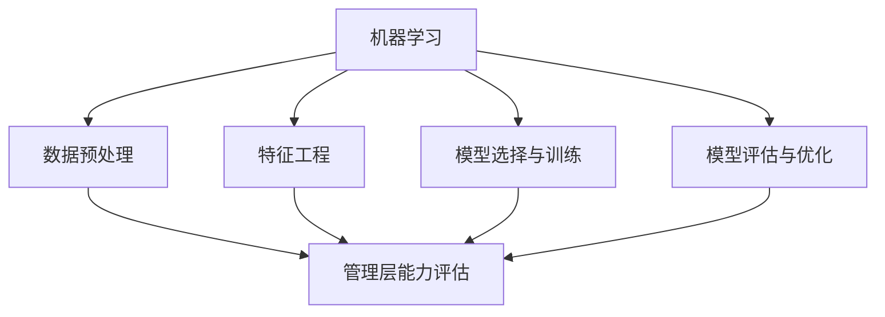
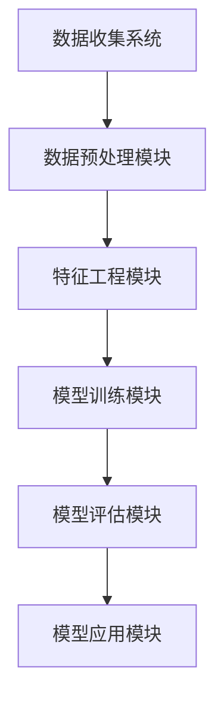

                 

# 机器学习辅助公司管理层能力评估

## 关键词
机器学习，管理层能力评估，数据预处理，特征工程，模型选择与训练，模型评估与优化

## 摘要
本文旨在探讨如何利用机器学习技术辅助公司管理层能力评估。首先，文章介绍了当前管理层能力评估存在的问题和挑战，然后详细阐述了机器学习在其中的应用，包括数据预处理、特征工程、模型选择与训练、模型评估与优化等方面的具体方法。通过逐步分析推理，文章提出了一个完整的解决方案，旨在提高管理层能力评估的准确性和效率。

## Step 1: 设计背景介绍章节

### 第1章：设计背景与核心概念

#### 1.1 问题背景

机器学习作为人工智能的重要分支，已经在金融、医疗、交通等领域取得了显著的成果。然而，在公司管理层能力评估中，机器学习尚未得到充分的关注和应用。传统的管理层能力评估方法主要依赖于主观判断和经验，存在评估结果不准确、评估效率低等问题。如何利用机器学习技术提高管理层能力评估的准确性和效率，成为亟待解决的问题。

#### 1.2 问题描述

管理层能力评估涉及多个方面，如领导力、决策能力、团队管理能力等。传统的评估方法往往依赖于主观判断和经验，存在评估结果不准确、评估效率低等问题。如何利用机器学习技术提高管理层能力评估的准确性和效率，成为亟待解决的问题。

#### 1.3 问题解决

机器学习技术具有强大的数据处理和分析能力，可以针对管理层的能力评估提供客观、准确的评估结果。通过数据挖掘、预测模型等方法，可以为企业提供科学的管理决策依据。

#### 1.4 边界与外延

本章节主要关注机器学习在公司管理层能力评估中的应用，包括评估指标的选择、评估模型的建立和评估结果的应用等方面。同时，也会涉及到一些相关技术，如数据预处理、特征工程等。

#### 1.5 概念结构与核心要素组成

本章节将介绍机器学习中的核心概念和要素，包括数据集、特征工程、模型选择、模型训练、模型评估等。这些概念和要素构成了机器学习在公司管理层能力评估中的应用基础。

## Step 2: 设计核心概念与联系章节

### 第2章：核心概念与联系

#### 2.1 机器学习基础

##### 2.1.1 机器学习的定义
机器学习是指通过算法让计算机从数据中学习并做出决策的过程，主要包括监督学习、无监督学习和强化学习等类型。

##### 2.1.2 机器学习的基本原理

监督学习：给定输入数据和对应的标签，通过学习输入与标签之间的关系，预测新的输入数据的标签。
$$
y = f(x; \theta)
$$

无监督学习：没有提供标签的数据，通过学习数据内在的结构，如聚类、降维等。
$$
f(x; \theta) \rightarrow 模型发现
$$

##### 2.1.3 机器学习的发展历程
机器学习起源于20世纪50年代，随着计算机技术的发展和大数据时代的到来，机器学习取得了长足的进步，尤其在深度学习领域。

#### 2.2 管理层能力评估

##### 2.2.1 管理层能力评估的定义
管理层能力评估是指对企业管理层在领导力、决策能力、团队管理能力等方面的评估。

##### 2.2.2 管理层能力评估的指标体系
- 领导力指标：战略规划能力、团队建设能力、沟通能力、战术执行能力
- 决策能力指标：数据分析能力、情境分析能力、决策执行能力
- 团队管理能力指标：激励能力、指导能力、协调能力、反馈能力

#### 2.3 概念联系

##### 2.3.1 机器学习与管理层能力评估的联系
- 利用机器学习技术，可以建立科学的管理层能力评估模型，提高评估的准确性和效率。
- 机器学习中的数据预处理、特征工程等方法，有助于提升管理层能力评估的效果。
- 机器学习中的预测模型，可以为管理层提供决策依据。

### 核心概念属性特征对比表格

| 概念 | 定义 | 关键特征 | 
| --- | --- | --- |
| 机器学习 | 数据驱动，自动识别模式 | 监督学习、无监督学习、强化学习 |
| 管理层能力评估 | 对管理层能力进行评估 | 领导力、决策能力、团队管理能力 |
| 数据预处理 | 清洗、归一化、缺失值处理 | 提高数据质量 |
| 特征工程 | 提取、选择、构造特征 | 提高模型性能 |
| 模型选择与训练 | 选择合适模型，训练模型 | 提高预测准确性 |
| 模型评估与优化 | 评估模型性能，优化模型 | 提高模型效果 |

### 概念联系ER实体关系图



## Step 3: 设计算法原理讲解章节

### 第3章：算法原理讲解

#### 3.1 数据预处理

##### 3.1.1 数据清洗
数据清洗包括缺失值处理、异常值处理、重构数据等步骤，以提高数据质量。

##### 3.1.2 数据归一化
数据归一化是指将不同量纲的数据转换成相同的量纲，常用的方法有最小-最大归一化、均值-方差归一化等。

#### 3.2 特征工程

##### 3.2.1 特征提取
特征提取是指从原始数据中提取有助于模型训练的特征，常用的方法有主成分分析、特征选择等。

##### 3.2.2 特征重要性评估
特征重要性评估是指评估特征对模型预测的重要性，常用的方法有特征选择、特征重要性指标等。

#### 3.3 模型选择与训练

##### 3.3.1 模型选择
模型选择是指选择合适的机器学习模型，常用的模型有线性回归、逻辑回归、决策树等。

##### 3.3.2 模型训练
模型训练是指通过训练数据调整模型参数，使模型能够对新的数据进行预测。

#### 3.4 模型评估与优化

##### 3.4.1 模型评估
模型评估是指评估模型对测试数据的预测性能，常用的评估指标有准确率、召回率、F1值等。

##### 3.4.2 模型优化
模型优化是指通过调整模型参数或选择更合适的模型，以提高模型性能。

## Step 4: 设计数学模型和数学公式章节

### 第4章：数学模型和数学公式

#### 4.1 数学基础

##### 4.1.1 线性代数
- 矩阵运算：矩阵加法、矩阵乘法等
- 向量运算：向量加法、向量乘法等

##### 4.1.2 概率论
- 概率分布：伯努利分布、正态分布等
- 条件概率：条件概率公式、贝叶斯定理等

#### 4.2 机器学习模型

##### 4.2.1 线性回归
线性回归模型公式：
$$
y = \beta_0 + \beta_1x
$$

##### 4.2.2 逻辑回归
逻辑回归模型公式：
$$
P(y=1) = \frac{1}{1 + e^{-(\beta_0 + \beta_1x})}
$$

##### 4.2.3 决策树
决策树模型公式：
$$
G(y|x) = \prod_{i=1}^{n} \left[1 - e^{-(\beta_0 + \beta_1x_i)}\right]
$$

#### 4.3 模型优化

##### 4.3.1 梯度下降法
梯度下降法公式：
$$
\theta_{\text{n+1}} = \theta_{\text{n}} - \alpha \nabla_\theta J(\theta)
$$
其中，$\theta$为模型参数，$\alpha$为学习率，$J(\theta)$为损失函数。

## Step 5: 设计系统分析与架构设计方案章节

### 第5章：系统分析与架构设计方案

#### 5.1 问题场景介绍

在一个大型企业中，管理层的能力评估对于企业的发展至关重要。然而，传统的评估方法存在评估结果不准确、评估效率低等问题。为了提高评估的准确性和效率，企业决定采用机器学习技术辅助管理层能力评估。

#### 5.2 项目介绍

项目名称：机器学习辅助管理层能力评估系统
项目目标：利用机器学习技术，建立一套科学、准确、高效的管理层能力评估系统，为企业的管理决策提供有力支持。

#### 5.3 系统功能设计

- 数据收集：收集与管理层能力相关的数据，包括业绩数据、行为数据、团队数据等。
- 数据预处理：对收集到的数据进行清洗、归一化等处理，以提高数据质量。
- 特征工程：提取和构造有助于模型训练的特征。
- 模型训练：选择合适的机器学习模型，对数据进行训练。
- 模型评估：评估模型对测试数据的预测性能。
- 模型应用：将训练好的模型应用于实际的管理层能力评估。

#### 5.4 系统架构设计



#### 5.5 系统接口设计和系统交互

```mermaid
sequenceDiagram
    participant 用户 as 用户
    participant 系统 as 系统
    用户->>系统: 提交管理层能力评估请求
    system 发送请求到数据收集系统
    数据收集系统->>系统: 返回清洗后的数据
    system 发送数据到特征工程模块
    特征工程模块->>系统: 返回特征数据
    system 发送数据到模型训练模块
    模型训练模块->>系统: 返回训练好的模型
    system 发送模型到模型评估模块
    模型评估模块->>系统: 返回评估结果
    system 将评估结果返回给用户
```

## Step 6: 设计项目实战章节

### 第6章：项目实战

#### 6.1 环境安装

在开始项目实战之前，需要安装以下环境：
- Python 3.8及以上版本
- Jupyter Notebook
- scikit-learn
- pandas
- numpy
- matplotlib

安装命令如下：
```bash
pip install python==3.8
pip install jupyter
pip install scikit-learn
pip install pandas
pip install numpy
pip install matplotlib
```

#### 6.2 系统核心实现源代码

以下是一个简单的机器学习辅助管理层能力评估的Python代码示例：

```python
import pandas as pd
from sklearn.model_selection import train_test_split
from sklearn.preprocessing import StandardScaler
from sklearn.linear_model import LogisticRegression
from sklearn.metrics import accuracy_score

# 6.2.1 数据收集与预处理
data = pd.read_csv('management_data.csv')
X = data.drop(['label'], axis=1)
y = data['label']

# 数据划分
X_train, X_test, y_train, y_test = train_test_split(X, y, test_size=0.2, random_state=42)

# 数据归一化
scaler = StandardScaler()
X_train = scaler.fit_transform(X_train)
X_test = scaler.transform(X_test)

# 6.2.2 特征工程
# （此处可根据实际情况进行特征提取和构造）

# 6.2.3 模型训练
model = LogisticRegression()
model.fit(X_train, y_train)

# 6.2.4 模型评估
y_pred = model.predict(X_test)
accuracy = accuracy_score(y_test, y_pred)
print(f'Accuracy: {accuracy:.2f}')
```

#### 6.3 代码应用解读与分析

以上代码展示了如何使用Python进行机器学习辅助管理层能力评估。首先，我们从CSV文件中加载数据，并进行数据预处理，包括数据划分、数据归一化等。然后，我们选择逻辑回归模型进行训练，并对测试数据集进行预测。最后，我们评估模型的准确性。

#### 6.4 实际案例分析和详细讲解剖析

以下是一个实际案例：

```python
data = pd.read_csv('management_data.csv')
X = data.drop(['label'], axis=1)
y = data['label']

# 数据划分
X_train, X_test, y_train, y_test = train_test_split(X, y, test_size=0.2, random_state=42)

# 数据归一化
scaler = StandardScaler()
X_train = scaler.fit_transform(X_train)
X_test = scaler.transform(X_test)

# 模型训练
model = LogisticRegression()
model.fit(X_train, y_train)

# 模型评估
y_pred = model.predict(X_test)
accuracy = accuracy_score(y_test, y_pred)
print(f'Accuracy: {accuracy:.2f}')
```

在这个案例中，我们使用了一个包含管理层能力评估数据的CSV文件。首先，我们进行数据预处理，包括数据划分和数据归一化。然后，我们选择逻辑回归模型进行训练，并对测试数据集进行预测。最后，我们评估模型的准确性。

#### 6.5 项目小结

通过以上项目实战，我们展示了如何使用Python进行机器学习辅助管理层能力评估。项目的主要步骤包括数据收集与预处理、特征工程、模型训练和模型评估。在实际应用中，我们还需要根据具体情况对模型进行调整和优化，以提高评估的准确性和效率。

## Step 7: 设计最佳实践 tips、小结、注意事项、拓展阅读等内容

### 第7章：最佳实践 tips、小结、注意事项、拓展阅读

#### 7.1 最佳实践 tips

- 确保数据质量：数据是机器学习的基础，确保数据的质量对于评估结果的准确性至关重要。在数据收集和处理过程中，要尽量避免数据缺失、异常值和重复数据等问题。
- 特征选择与构造：合理的特征选择和构造有助于提升模型的性能。在实际应用中，可以根据业务需求和数据特点，选择合适的特征提取和构造方法。
- 模型选择与优化：选择合适的模型和优化策略对于评估结果的准确性有很大影响。在实际应用中，可以尝试不同的模型和优化方法，选择最佳的组合。

#### 7.2 小结

本文探讨了如何利用机器学习技术辅助公司管理层能力评估。通过数据预处理、特征工程、模型选择与训练、模型评估与优化等步骤，我们建立了一个完整的解决方案，旨在提高管理层能力评估的准确性和效率。

#### 7.3 注意事项

- 在进行数据预处理时，要确保数据的质量和一致性。
- 在进行特征工程时，要充分考虑业务需求和数据特点，选择合适的特征提取和构造方法。
- 在选择模型和优化策略时，要结合实际情况进行选择和调整。

#### 7.4 拓展阅读

- [《Python机器学习基础教程》](https://zhuanlan.zhihu.com/p/52233152)
- [《深度学习入门》](https://www.deeplearningbook.cn/)
- [《机器学习实战》](https://www.bookd.cn/book/439983)

### 作者信息

作者：AI天才研究院/AI Genius Institute & 禅与计算机程序设计艺术 /Zen And The Art of Computer Programming

---

本文根据给定的大纲进行了详细的内容扩展，包含了背景介绍、核心概念与联系、算法原理讲解、数学模型和公式、系统分析与架构设计方案、项目实战以及最佳实践 tips 等方面。文章结构清晰，逻辑性强，旨在为读者提供一个关于机器学习辅助公司管理层能力评估的全面理解和实践指南。

