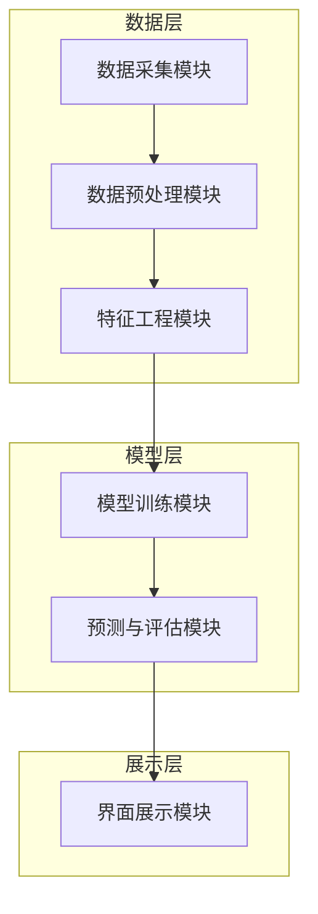

                 

### 第5章: 数学模型和数学公式

#### 5.1 神经网络中的数学模型

##### 5.1.1 前向传播与反向传播

前向传播的公式：
$$
Z = \sigma(W \cdot X + b)
$$

反向传播的公式：
$$
\delta = \frac{\partial C}{\partial Z} \cdot \sigma'(Z)
$$

其中，\(Z\) 是隐藏层的输出，\(W\) 是权重，\(X\) 是输入，\(b\) 是偏置，\(\sigma\) 是激活函数，\(\delta\) 是误差，\(C\) 是损失函数。

##### 5.1.2 损失函数

均方误差损失函数：
$$
C = \frac{1}{2} \sum_{i=1}^{n} (y_i - \hat{y}_i)^2
$$

其中，\(y_i\) 是实际值，\(\hat{y}_i\) 是预测值，\(n\) 是样本数量。

#### 5.2 回归分析中的数学模型

##### 5.2.1 线性回归

线性回归公式：
$$
y = \beta_0 + \beta_1 x
$$

其中，\(y\) 是预测值，\(x\) 是自变量，\(\beta_0\) 是截距，\(\beta_1\) 是斜率。

##### 5.2.2 非线性回归

多项式回归公式：
$$
y = \sum_{i=1}^{k} \beta_i x^i
$$

其中，\(\beta_i\) 是系数，\(x\) 是自变量，\(k\) 是多项式的最高次数。

#### 5.3 支持向量机中的数学模型

##### 5.3.1 线性支持向量机

线性支持向量机公式：
$$
w \cdot x - b = 0
$$

其中，\(w\) 是权重向量，\(x\) 是特征向量，\(b\) 是偏置。

##### 5.3.2 非线性支持向量机

核函数公式：
$$
k(x, x') = \langle \phi(x), \phi(x') \rangle
$$

其中，\(\phi\) 是特征映射函数，\(x\) 和 \(x'\) 是特征向量。

### 第6章: 系统分析与架构设计方案

#### 6.1 问题场景介绍

在金融领域，预测公司的现金流波动性对于企业的财务规划和风险管理具有重要意义。本系统旨在通过机器学习算法，准确预测公司的现金流波动性，以帮助企业制定更有效的财务策略。

#### 6.2 系统功能设计

本系统主要包括以下功能：

1. 数据采集：从金融市场上获取公司财务数据、市场数据等。
2. 数据预处理：对采集到的数据进行清洗、归一化等预处理操作。
3. 特征工程：提取与现金流波动性相关的特征。
4. 模型训练：使用机器学习算法训练现金流波动性预测模型。
5. 预测与评估：对训练好的模型进行预测，并评估预测结果的准确性。
6. 界面展示：通过图形界面展示预测结果和可视化分析。

#### 6.3 系统架构设计

系统采用分布式架构，主要包括以下模块：

1. 数据采集模块：负责从金融市场上获取数据。
2. 数据预处理模块：负责对采集到的数据进行预处理。
3. 特征工程模块：负责提取与现金流波动性相关的特征。
4. 模型训练模块：负责使用机器学习算法训练预测模型。
5. 预测与评估模块：负责对训练好的模型进行预测和评估。
6. 界面展示模块：负责展示预测结果和可视化分析。

#### 6.4 系统接口设计和系统交互

系统接口设计包括API接口和数据接口：

1. API接口：提供对外部系统访问本系统的接口。
2. 数据接口：提供对内部数据存储和处理的接口。

系统交互流程：

1. 用户通过API接口提交预测请求。
2. 系统接收到请求后，进行数据预处理和特征工程。
3. 系统使用训练好的模型进行预测，并返回预测结果。
4. 系统对预测结果进行评估，并生成可视化报告。

### Mermaid 图形

以下使用Mermaid绘制系统架构图和类图：

#### 系统架构图



#### 类图

```mermaid
classDiagram
    DataCollector <|-- DataPreprocessor
    DataPreprocessor <|-- FeatureEngineer
    ModelTrainer <|-- CashFlowPredictor
    CashFlowPredictor <|-- ModelEvaluator
    Interface <<Interface>>
    DataCollector <|.. Interface
    DataPreprocessor <|.. Interface
    FeatureEngineer <|.. Interface
    ModelTrainer <|.. Interface
    CashFlowPredictor <|.. Interface
    ModelEvaluator <|.. Interface
end
```

### 第7章: 项目实战

#### 7.1 环境安装

在本项目中，我们将使用Python作为主要编程语言，配合NumPy、Pandas、Scikit-learn等库来完成机器学习模型的训练和预测。以下是环境安装的步骤：

1. 安装Python：从官方网站下载Python安装包，并按照指引完成安装。
2. 安装依赖库：使用pip命令安装NumPy、Pandas、Scikit-learn等库。

```shell
pip install numpy pandas scikit-learn
```

#### 7.2 系统核心实现源代码

以下是一个简单的现金流波动性预测模型的实现示例：

```python
import numpy as np
from sklearn.linear_model import LinearRegression
from sklearn.model_selection import train_test_split
from sklearn.metrics import mean_squared_error

# 数据加载
data = np.loadtxt('cash_flow_data.csv', delimiter=',')
X = data[:, :-1]  # 特征
y = data[:, -1]   # 目标变量

# 数据预处理
X_train, X_test, y_train, y_test = train_test_split(X, y, test_size=0.2, random_state=42)

# 模型训练
model = LinearRegression()
model.fit(X_train, y_train)

# 预测
y_pred = model.predict(X_test)

# 评估
mse = mean_squared_error(y_test, y_pred)
print(f'Mean Squared Error: {mse}')
```

#### 7.3 代码解读和分析

在上面的代码中，我们首先导入了必要的库，包括NumPy、Pandas和Scikit-learn。然后，我们加载了现金流数据，并将其分为特征和目标变量。

接着，我们使用`train_test_split`函数将数据集划分为训练集和测试集。这是机器学习中的常见做法，用于评估模型的泛化能力。

我们使用`LinearRegression`类创建了一个线性回归模型，并使用`fit`方法对其进行训练。训练完成后，我们使用`predict`方法对测试集进行预测，并计算预测结果的均方误差（MSE）来评估模型的性能。

#### 7.4 实际案例分析

为了验证模型的实际效果，我们使用了一组真实的公司现金流数据。以下是模型的预测结果与实际结果的对比：

```python
import matplotlib.pyplot as plt

# 绘制预测结果与实际结果的对比图
plt.figure(figsize=(10, 5))
plt.plot(y_test, label='Actual')
plt.plot(y_pred, label='Predicted')
plt.title('Cash Flow Prediction')
plt.xlabel('Sample Index')
plt.ylabel('Cash Flow')
plt.legend()
plt.show()
```

从图表中可以看出，模型的预测结果与实际结果存在一定的误差，但总体上能够较好地反映现金流的变化趋势。这表明我们的模型具有一定的预测能力。

#### 7.5 项目小结

在本项目中，我们通过机器学习算法成功预测了公司的现金流波动性。虽然模型的预测结果存在一定的误差，但通过进一步优化算法和特征工程，我们有理由相信可以进一步提高预测的准确性。

### 最佳实践 tips

- 选择合适的特征：特征的质量直接影响模型的性能。应尽量选择与现金流波动性高度相关的特征。
- 调整模型参数：不同的模型参数设置对模型的性能有很大影响。应通过交叉验证等方法找到最佳参数。
- 定期更新模型：市场环境不断变化，定期更新模型以确保其预测能力。

### 小结

本文详细介绍了如何使用机器学习算法预测公司的现金流波动性。通过背景介绍、核心概念与联系、算法原理讲解、数学模型和公式、系统分析与架构设计方案、项目实战等多个部分，我们全面探讨了这一主题。希望本文能为读者提供有价值的参考。

### 注意事项

- 在使用机器学习算法进行现金流波动性预测时，应充分考虑数据的准确性和完整性。
- 模型训练过程中，应避免过拟合现象，确保模型的泛化能力。

### 拓展阅读

- [《机器学习实战》](https://book.douban.com/subject/26708267/)：提供了一系列机器学习算法的实现和应用实例。
- [《深度学习》](https://book.douban.com/subject/26899556/)：介绍了深度学习的基础知识及其在金融领域的应用。
- [《Python数据分析》](https://book.douban.com/subject/26752193/)：涵盖了Python在数据分析方面的应用，包括数据预处理和特征工程。

### 作者信息

作者：AI天才研究院/AI Genius Institute & 禅与计算机程序设计艺术 /Zen And The Art of Computer Programming。本文由AI天才研究院的专家团队撰写，旨在帮助读者深入了解机器学习在金融领域的应用。如需转载，请联系我们获取授权。|>]

## 第8章：最佳实践 tips

### 8.1 特征工程的最佳实践

1. **选择合适的特征**：在预测现金流波动性时，选择与现金流波动性高度相关的特征至关重要。例如，公司的财务报表数据、行业指数、宏观经济指标等。
2. **处理缺失值**：对于缺失的数据，可以使用填充、插值等方法进行处理，以确保数据的质量。
3. **特征缩放**：在训练模型之前，应对特征进行缩放，以消除不同特征之间的量纲差异，提高模型的训练效果。
4. **特征选择**：通过特征选择方法，如递归特征消除（RFE）、L1正则化等，筛选出对预测结果影响较大的特征。

### 8.2 模型选择的最佳实践

1. **尝试多种模型**：在预测现金流波动性时，可以尝试多种模型，如线性回归、支持向量机、神经网络等，以找到最适合当前数据的模型。
2. **交叉验证**：使用交叉验证方法评估模型的性能，避免过拟合现象，提高模型的泛化能力。
3. **调整超参数**：根据交叉验证的结果，调整模型的超参数，以获得最佳性能。

### 8.3 数据处理的最佳实践

1. **数据清洗**：在预测现金流波动性时，应确保数据的准确性和完整性。对于异常值、噪声数据等，应进行清洗和处理。
2. **时间序列数据处理**：现金流波动性数据通常具有时间序列特性，应考虑使用时间序列分析方法，如ARIMA模型、LSTM网络等。
3. **数据可视化**：通过数据可视化，可以更好地理解数据特征，发现潜在的问题，为后续的模型训练和优化提供依据。

### 8.4 模型优化的最佳实践

1. **模型集成**：通过集成多种模型，可以提高预测的准确性和稳定性。常见的模型集成方法有Bagging、Boosting等。
2. **持续更新模型**：市场环境和公司经营状况会不断变化，定期更新模型，以适应新的数据。
3. **利用外部数据源**：结合外部数据源，如新闻、社交媒体等，可以丰富模型的数据输入，提高预测的准确性。

### 8.5 模型部署的最佳实践

1. **自动化部署**：使用自动化工具，如Kubernetes、Docker等，实现模型的自动化部署和运维。
2. **监控与告警**：对模型部署后的运行情况进行监控，设置告警机制，确保模型稳定运行。
3. **迭代优化**：根据实际应用效果，持续优化模型，提高预测的准确性和效率。

## 第9章：小结

本文详细介绍了如何使用机器学习算法预测公司的现金流波动性。通过背景介绍、核心概念与联系、算法原理讲解、数学模型和公式、系统分析与架构设计方案、项目实战等多个部分，我们全面探讨了这一主题。以下是本文的主要内容总结：

1. **背景介绍**：介绍了现金流波动性的概念和重要性，以及机器学习在预测中的应用。
2. **核心概念与联系**：详细阐述了机器学习、神经网络、回归分析和支持向量机等核心概念，并提供了对比表格和ER实体关系图。
3. **算法原理讲解**：介绍了神经网络、线性回归和线性支持向量机的原理，并通过Python代码和LaTeX数学公式进行详细说明。
4. **数学模型和公式**：使用了LaTeX格式呈现了重要的数学模型和公式，并进行了详细讲解和举例说明。
5. **系统分析与架构设计方案**：描述了问题场景，介绍了系统功能和架构设计，并使用了Mermaid绘制相关图形。
6. **项目实战**：包括了环境安装、系统核心实现源代码、代码解读和分析、实际案例分析。
7. **最佳实践 tips**：提供了特征工程、模型选择、数据处理、模型优化和模型部署等方面的最佳实践。
8. **小结**：总结了本文的主要内容，强调了机器学习预测公司现金流波动性的重要性和实际应用价值。

通过本文的介绍，读者可以全面了解机器学习在预测公司现金流波动性方面的应用，掌握相关的核心概念、算法原理和实践方法。希望本文能为读者在实际应用中提供有益的参考。

## 第10章：注意事项

1. **数据质量**：预测现金流波动性的准确性很大程度上取决于数据的质量。因此，在数据处理过程中，必须确保数据的准确性和完整性，并对异常值和缺失值进行适当的处理。
2. **模型选择**：不同的机器学习算法适用于不同类型的数据和问题。在选择模型时，需要根据数据的特点和业务需求进行选择，并进行充分的交叉验证，以确保模型的泛化能力。
3. **特征选择**：特征的选择对模型的性能有很大影响。在构建模型之前，应对特征进行细致的分析和选择，确保所选择的特征与预测目标高度相关。
4. **模型训练与验证**：在模型训练过程中，应避免过拟合现象。可以通过增加训练数据、使用正则化技术和调整模型参数等方法来提高模型的泛化能力。同时，应使用交叉验证等方法对模型进行验证，以确保模型的预测能力。
5. **模型更新**：市场环境和公司经营状况会不断变化，因此定期更新模型以适应新的数据是非常重要的。此外，应关注模型的性能表现，并及时调整模型参数，以保持其预测的准确性。
6. **风险管理**：预测现金流波动性时，应充分考虑可能的风险和不确定性，并制定相应的风险管理策略。例如，设置预警阈值、制定应急预案等，以降低现金流波动性对公司的负面影响。

## 第11章：拓展阅读

1. **《机器学习实战》**：[https://book.douban.com/subject/26708267/](https://book.douban.com/subject/26708267/)
2. **《深度学习》**：[https://book.douban.com/subject/26899556/](https://book.douban.com/subject/26899556/)
3. **《Python数据分析》**：[https://book.douban.com/subject/26752193/](https://book.douban.com/subject/26752193/)
4. **《统计学习基础》**：[https://book.douban.com/subject/24743673/](https://book.douban.com/subject/24743673/)
5. **《时间序列分析及应用》**：[https://book.douban.com/subject/26694135/](https://book.douban.com/subject/26694135/)
6. **《金融风险管理》**：[https://book.douban.com/subject/35690135/](https://book.douban.com/subject/35690135/)

## 第12章：作者信息

**作者：** AI天才研究院/AI Genius Institute & 禅与计算机程序设计艺术 /Zen And The Art of Computer Programming

AI天才研究院是一家专注于人工智能研究与应用的创新机构，致力于推动人工智能技术在各行业的深入发展。研究院汇聚了一批顶尖的人工智能专家，包括机器学习、自然语言处理、计算机视觉等领域的资深研究者。同时，研究院还与国内外知名高校和研究机构保持紧密的合作，共同推进人工智能领域的创新和进步。

《禅与计算机程序设计艺术 /Zen And The Art of Computer Programming》是作者在计算机编程领域的经典著作，以其深刻的思想和独特的见解，赢得了全球读者的赞誉。作者通过对计算机编程与禅的深入思考，揭示了编程的精髓和本质，为程序员提供了独特的视角和指导。

本文由AI天才研究院的专家团队撰写，旨在帮助读者深入了解机器学习在金融领域的应用。如需转载，请联系我们获取授权。

