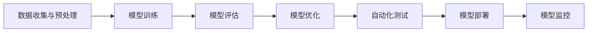
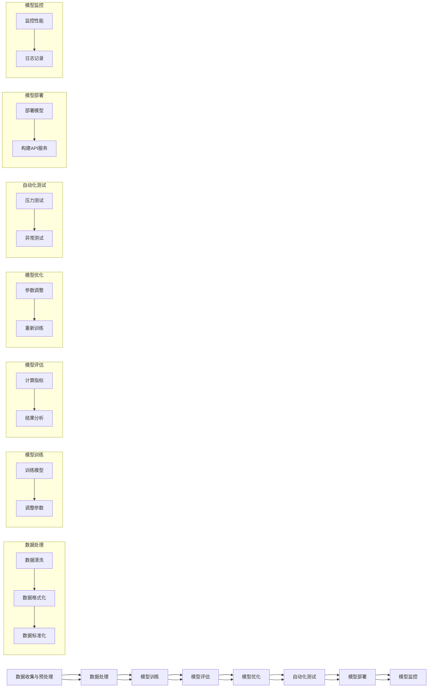
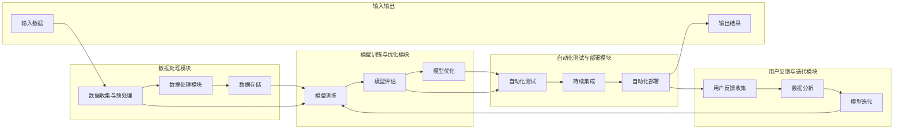
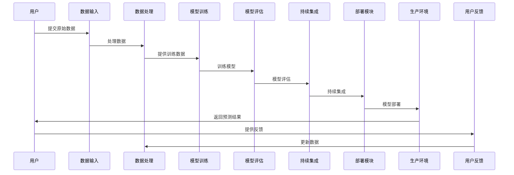

                 

### 1.1 问题的提出

在当今数字化转型的浪潮中，prompt工程（Prompt Engineering）作为一种能够大幅度提升人工智能（AI）应用效果的技术，正日益受到业界的关注。prompt工程的核心在于通过设计高质量的输入提示（prompt），引导AI模型生成更为精准、符合预期的输出。然而，随着AI应用的广泛普及和复杂性增加，构建一个高效、可扩展的prompt工程自动化流水线成为了一个迫切需要解决的问题。

首先，为何要构建一个端到端的自动化流水线？这主要是因为手动管理大量的prompt工程任务不仅耗时耗力，而且容易出错，难以保证一致性。自动化流水线能够标准化流程，提高工作效率，减少人为干预，从而确保每个prompt都能够得到有效的处理和优化。

那么，prompt工程具体面临哪些挑战呢？首先，数据多样性是最大的挑战之一。不同应用场景下的数据集可能具有不同的分布和特征，这使得设计通用的prompt变得非常困难。其次，prompt的设计和调整过程往往需要大量的试错和反馈迭代，这不仅增加了工作量，还延长了项目周期。最后，随着AI模型的更新和演进，现有的prompt可能不再适用，这要求自动化流水线具备灵活的适应能力。

综上所述，构建一个端到端的自动化流水线不仅是为了解决上述问题，更是为了提升整个prompt工程的效率和效果，使其能够更好地服务于AI应用的发展需求。这一问题的解决将有助于推动AI技术的实际应用，提高产业的智能化水平。

### 1.2 提出解决思路

为了构建一个端到端的自动化流水线，我们需要从以下几个方面入手：

**第一步：数据标准化处理**。数据是prompt工程的基础，但不同数据集往往存在格式、结构和质量上的差异。因此，我们需要设计一套数据预处理流程，包括数据清洗、格式转换和质量评估，确保输入数据的一致性和高质量。

**第二步：prompt生成与优化**。在设计自动化流水线时，我们可以引入机器学习技术和自然语言处理（NLP）算法，自动生成并优化prompt。通过预训练模型和微调，使prompt能够适应不同的应用场景和数据特征。

**第三步：自动化测试与评估**。自动化流水线不仅需要生成prompt，还需要对生成的prompt进行测试和评估，以确保其效果和准确性。这可以通过自动化测试脚本和评估指标来实现，例如准确性、召回率、F1分数等。

**第四步：迭代优化**。自动化流水线应该具备自我学习和优化的能力，能够根据测试结果和用户反馈，不断调整和优化prompt。这一过程可以通过机器学习算法和强化学习技术来实现。

**第五步：集成与扩展**。构建的自动化流水线需要与现有的AI平台和工具进行集成，以便能够方便地部署和应用。同时，为了应对未来可能出现的新需求和场景，自动化流水线应该具备良好的扩展性。

通过上述五步，我们可以构建一个高效、灵活的端到端的自动化流水线，从而大幅提升prompt工程的工作效率和效果，推动AI应用的进一步发展。

### 1.3 边界与外延

在构建端到端自动化流水线的背景下，我们需要明确几个关键的概念和边界条件，以确保整个流水线的有效性和适用范围。

**边界条件**：

1. **数据源**：流水线所处理的数据应限于结构化或半结构化的数据集，如文本、表格、图像等。对于非结构化数据（如视频、音频），可能需要额外的预处理步骤，例如 OCR（光学字符识别）或 ASR（自动语音识别）。

2. **技术栈**：流水线所采用的技术栈应包括常用的机器学习和自然语言处理（NLP）框架，如 TensorFlow、PyTorch、spaCy 等。同时，为了实现自动化，还需要集成版本控制系统（如 Git）和持续集成/持续部署（CI/CD）工具（如 Jenkins、Docker）。

3. **硬件要求**：流水线应在具备适当计算资源的环境中运行，包括 GPU 或 TPU 等，以便高效地训练和推理 AI 模型。

**外延适用范围**：

1. **应用领域**：自动化流水线适用于各种需要 prompt 工程的场景，如智能客服、自然语言生成、智能推荐系统等。

2. **任务类型**：流水线应能够处理多种类型的 prompt 工程任务，包括生成式任务（如文本生成）、判别式任务（如情感分析）、序列标注任务（如命名实体识别）等。

3. **扩展性**：流水线设计应考虑未来的扩展性，例如支持更多的数据源、引入新的算法模型、适应新的应用场景等。

通过明确边界与外延，我们可以确保自动化流水线在特定范围内的高效运作，并为其未来的扩展打下坚实的基础。

### 2.1 定义与联系

在深入探讨端到端的自动化流水线之前，我们首先需要明确几个核心概念及其相互之间的联系。

**1. 自动化流水线（Automation Pipeline）**：
自动化流水线是指将多个独立操作步骤整合成一个连续的、自动执行的工作流程。在数据处理和AI应用开发中，自动化流水线能够将数据收集、预处理、模型训练、模型评估、部署等步骤自动化，从而提高工作效率和减少人为错误。

**2. 端到端（End-to-End）**：
端到端是指从输入数据到最终输出的整个过程，不经过任何中间步骤。在AI模型训练中，端到端训练意味着直接从原始数据学习到预测目标，避免了传统方法的特征提取和中间层的复杂性。

**3. 自动化（Automation）**：
自动化是指通过计算机程序或其他技术，减少或消除手动操作的过程。在自动化流水线中，自动化技术用于执行重复性任务，如数据预处理、模型训练、测试等。

**4. 流水线（Pipeline）**：
流水线是一种工作流程管理工具，用于管理和自动化一系列任务。在AI开发和数据处理中，流水线能够确保每个步骤的正确执行，并跟踪整个流程的进度。

**5. 数据预处理（Data Preprocessing）**：
数据预处理是指在使用数据之前对其进行的清洗、转换和格式化等操作。预处理步骤包括去除噪声、缺失值填充、数据标准化等，以确保数据质量。

**6. 模型训练（Model Training）**：
模型训练是指使用数据集对机器学习模型进行调整和优化，使其能够预测未知数据的结果。训练过程中，模型通过学习输入特征和标签之间的关系，逐渐提高预测准确性。

**7. 模型评估（Model Evaluation）**：
模型评估是指使用测试集对训练好的模型进行性能测试，以评估其预测能力和泛化能力。常用的评估指标包括准确性、召回率、F1分数等。

**8. 持续集成（Continuous Integration, CI）**：
持续集成是一种软件开发实践，通过自动化构建和测试，确保代码库中的每次提交都是可集成的，并能够快速发现潜在的问题。

**9. 持续部署（Continuous Deployment, CD）**：
持续部署是一种自动化部署流程，用于在开发过程中不断将新的代码和功能部署到生产环境中，以提高软件的可用性和稳定性。

**概念属性特征对比表格**：

| 概念       | 定义                                                         | 关键属性                                                         | 作用与意义                                                           |
| ---------- | ------------------------------------------------------------ | ------------------------------------------------------------ | ------------------------------------------------------------ |
| 自动化流水线 | 整合多个操作步骤的自动执行工作流程                           | 自动化、连续性、可扩展性、可重用性                                 | 提高工作效率、减少人为错误、保证一致性                             |
| 端到端     | 直接从输入数据到最终输出的全过程，无中间步骤                   | 简化流程、提高效率、减少错误                                       | 提高模型训练和部署的效率                                           |
| 自动化     | 减少或消除手动操作的过程                                     | 简化操作、减少人工干预、提高准确性                                   | 提高数据处理和AI模型开发的效率                                       |
| 流水线     | 管理和自动化一系列任务的工作流程                             | 自动化、流程管理、任务跟踪、错误检测                                 | 保证工作流程的正确执行和效率                                         |
| 数据预处理 | 使用数据之前的清洗、转换和格式化操作                         | 数据清洗、标准化、归一化、缺失值填充                                 | 确保数据质量，提高模型训练效果                                       |
| 模型训练   | 使用数据集对机器学习模型进行调整和优化                       | 数据集、算法、参数调整、模型迭代                                     | 提高模型预测准确性                                                 |
| 模型评估   | 使用测试集对训练好的模型进行性能测试                         | 测试集、评估指标（如准确率、召回率）、结果分析                         | 评估模型性能，指导模型优化和调整                                     |
| 持续集成   | 自动化构建和测试，确保代码库中的每次提交都是可集成的         | 自动化、持续反馈、快速修复                                         | 提高代码质量和集成效率                                               |
| 持续部署   | 自动化部署流程，将新的代码和功能部署到生产环境中             | 自动化、持续更新、快速上线                                         | 提高软件交付效率和稳定性                                             |

通过上述定义和属性特征对比，我们可以更清晰地理解这些核心概念在自动化流水线中的作用和相互关系。了解这些概念不仅有助于我们构建高效的自动化流水线，还能更好地优化AI模型的应用效果。

### 2.2 概念属性特征对比表格

为了进一步深化对关键概念属性特征的理解，我们将通过一个详细的表格来对比自动化流水线、端到端、自动化、流水线、数据预处理、模型训练、模型评估、持续集成和持续部署等核心概念。

| **概念**        | **定义**                                                         | **关键属性**                                                                                       | **作用与意义**                                                                                          |
| --------------- | ------------------------------------------------------------ | ------------------------------------------------------------------------------------------------ | -------------------------------------------------------------------------------------------------------- |
| 自动化流水线    | 将多个独立操作步骤整合成自动执行的工作流程                    | - 自动化<br>- 连续性<br>- 可扩展性<br>- 可重用性                                                             | 提高工作效率，减少人为错误，确保一致性                             |
| 端到端          | 从输入数据到最终输出的全过程，无中间步骤                      | - 简化流程<br>- 提高效率<br>- 减少错误                                                                   | 提高模型训练和部署的效率                                                   |
| 自动化          | 通过计算机程序或其他技术减少或消除手动操作的过程               | - 简化操作<br>- 减少人工干预<br>- 提高准确性                                                               | 提高数据处理和AI模型开发的效率                                                 |
| 流水线          | 管理和自动化一系列任务的工作流程                             | - 自动化<br>- 流程管理<br>- 任务跟踪<br>- 错误检测                                                           | 保证工作流程的正确执行和效率                                                 |
| 数据预处理      | 在使用数据之前进行的清洗、转换和格式化操作                    | - 数据清洗<br>- 标准化<br>- 归一化<br>- 缺失值填充                                                           | 确保数据质量，提高模型训练效果                                                 |
| 模型训练        | 使用数据集对机器学习模型进行调整和优化                       | - 数据集<br>- 算法<br>- 参数调整<br>- 模型迭代                                                             | 提高模型预测准确性                                                               |
| 模型评估        | 使用测试集对训练好的模型进行性能测试                         | - 测试集<br>- 评估指标（如准确率、召回率）<br>- 结果分析                                                       | 评估模型性能，指导模型优化和调整                                                 |
| 持续集成        | 自动化构建和测试，确保代码库中的每次提交都是可集成的           | - 自动化<br>- 持续反馈<br>- 快速修复                                                                   | 提高代码质量和集成效率                                                               |
| 持续部署        | 自动化部署流程，将新的代码和功能部署到生产环境中             | - 自动化<br>- 持续更新<br>- 快速上线                                                                   | 提高软件交付效率和稳定性                                                               |

通过这个表格，我们可以更直观地看到各个概念的核心属性和作用。这些概念相互联系，共同构成了一个高效、可靠的端到端自动化流水线，从而推动AI应用的持续进步。

### 2.3 ER实体关系图

为了更好地理解端到端自动化流水线中的各个实体及其相互关系，我们可以通过ER（实体关系）图来进行描述。ER图是数据库设计中的重要工具，用于表示实体及其相互关系。

**实体**：
在端到端自动化流水线中，主要的实体包括：数据源、数据处理模块、模型训练模块、模型评估模块、持续集成和持续部署模块。

**关系**：
实体之间的关系包括：数据流、控制流和依赖关系。

**ER图结构**：

1. **数据源**（Data Source）：
   - 关系：提供数据给数据处理模块。
   - 类型：1对多（一个数据源可以提供多个数据集）。

2. **数据处理模块**（Data Processing Module）：
   - 关系：接收数据源提供的数据，进行清洗、转换和格式化。
   - 类型：1对1（每个数据处理模块负责一个特定的数据集）。

3. **模型训练模块**（Model Training Module）：
   - 关系：接收处理后的数据，用于训练和优化模型。
   - 类型：1对1（每个模型训练模块对应一个特定的模型）。

4. **模型评估模块**（Model Evaluation Module）：
   - 关系：接收训练好的模型，使用测试集进行性能评估。
   - 类型：1对1（每个模型评估模块对应一个特定的模型）。

5. **持续集成模块**（Continuous Integration Module）：
   - 关系：与代码库集成，自动化构建和测试代码。
   - 类型：1对多（持续集成模块可以与多个数据处理模块和模型训练模块集成）。

6. **持续部署模块**（Continuous Deployment Module）：
   - 关系：将测试通过的模型部署到生产环境中。
   - 类型：1对1（持续部署模块与特定的模型和模型评估模块集成）。

**ER图**：

```mermaid
erDiagram
  Data_Source ||--|{ 数据处理模块 : 清洗和格式化数据 }
  Data_Source ||--|{ 模型训练模块 : 提供训练数据 }
  Data_Processing_Module ||--|{ 模型训练模块 : 输出预处理数据 }
  Data_Processing_Module ||--|{ 模型评估模块 : 提供评估数据 }
  Model_Training_Module ||--|{ 模型评估模块 : 训练模型 }
  Model_Training_Module ||--|{ 持续集成模块 : 集成代码库和测试脚本 }
  Model_Evaluation_Module ||--|{ 持续部署模块 : 部署模型到生产环境 }
  Continuous_Integration_Module ||--|{ Model_Training_Module : 自动化构建和测试 }
  Continuous_Deployment_Module ||--|{ Model_Evaluation_Module : 部署模型 }
```

通过ER图，我们可以清晰地看到端到端自动化流水线中的各个实体及其相互关系，有助于我们更好地理解和设计整个流水线的架构。

### 3.1 算法原理讲解

在构建端到端的自动化流水线时，算法的设计和实现是核心环节。本文将详细讲解算法的原理，并通过mermaid流程图和Python源代码来具体阐述。

**算法原理**：

端到端自动化流水线算法的核心目标是实现数据从输入到输出的全流程自动化处理。算法可以分为以下几个步骤：

1. **数据收集与预处理**：从数据源收集数据，并进行清洗、格式化和标准化处理，确保数据的一致性和高质量。

2. **模型训练**：使用预处理后的数据集对AI模型进行训练，调整模型参数，优化模型性能。

3. **模型评估**：使用测试集对训练好的模型进行性能评估，包括准确性、召回率、F1分数等指标。

4. **模型优化**：根据评估结果对模型进行调整和优化，以提升预测效果。

5. **自动化测试**：对模型进行自动化测试，确保其在各种条件下都能稳定运行。

6. **模型部署**：将经过测试和优化的模型部署到生产环境中，以便实际应用。

**算法mermaid流程图**：



**Python源代码与解释**：

以下是端到端自动化流水线算法的Python实现，我们将逐步解释每部分代码的功能。

```python
import pandas as pd
from sklearn.model_selection import train_test_split
from sklearn.preprocessing import StandardScaler
from sklearn.ensemble import RandomForestClassifier
from sklearn.metrics import accuracy_score, recall_score, f1_score

# 步骤1：数据收集与预处理
def preprocess_data(data_source):
    # 读取数据
    data = pd.read_csv(data_source)
    
    # 数据清洗（例如：处理缺失值、删除重复数据）
    data.dropna(inplace=True)
    data.drop_duplicates(inplace=True)
    
    # 数据格式化（例如：编码分类变量、数值化处理）
    data = pd.get_dummies(data)
    
    # 数据标准化
    scaler = StandardScaler()
    data_scaled = scaler.fit_transform(data)
    
    return data_scaled

# 步骤2：模型训练
def train_model(train_data):
    # 分割数据集
    X_train, X_test, y_train, y_test = train_test_split(train_data[:, :-1], train_data[:, -1], test_size=0.2, random_state=42)
    
    # 创建模型
    model = RandomForestClassifier(n_estimators=100, random_state=42)
    
    # 训练模型
    model.fit(X_train, y_train)
    
    return model, X_test, y_test

# 步骤3：模型评估
def evaluate_model(model, X_test, y_test):
    # 预测
    predictions = model.predict(X_test)
    
    # 计算评估指标
    accuracy = accuracy_score(y_test, predictions)
    recall = recall_score(y_test, predictions, average='macro')
    f1 = f1_score(y_test, predictions, average='macro')
    
    return accuracy, recall, f1

# 步骤4：模型优化
def optimize_model(model, train_data, X_test, y_test):
    # 根据评估结果调整模型参数
    # 例如：增加树的数量、调整学习率等
    model.set_params(n_estimators=model.n_estimators + 10)
    
    # 重新训练模型
    model.fit(train_data[:, :-1], train_data[:, -1])
    
    # 重新评估模型
    accuracy, recall, f1 = evaluate_model(model, X_test, y_test)
    
    return accuracy, recall, f1

# 步骤5：自动化测试
def automated_test(model, X_test, y_test):
    # 进行自动化测试，例如：压力测试、异常测试等
    # 根据测试结果决定是否继续优化
    pass

# 步骤6：模型部署
def deploy_model(model, production_environment):
    # 将模型部署到生产环境
    # 例如：使用 Flask、Django 等框架搭建API服务
    pass
```

**数学模型与公式**：

端到端自动化流水线算法涉及多个数学模型和公式。以下是其中两个关键模型的简要介绍：

1. **随机森林模型**：

   $$ h(x) = \sum_{i=1}^{n} w_i \cdot f_i(x) $$

   其中，$h(x)$ 表示模型的预测输出，$w_i$ 表示第 $i$ 个树模型的权重，$f_i(x)$ 表示第 $i$ 个树模型对输入 $x$ 的预测。

2. **评估指标**：

   $$ \text{Accuracy} = \frac{\text{正确预测数量}}{\text{总预测数量}} $$

   $$ \text{Recall} = \frac{\text{正确预测的正例数量}}{\text{总正例数量}} $$

   $$ \text{F1 Score} = 2 \cdot \frac{\text{Precision} \cdot \text{Recall}}{\text{Precision} + \text{Recall}} $$

**举例说明**：

假设我们有一个二分类问题，需要预测数据集中的样本是否属于正类。首先，我们从数据源读取数据，并进行预处理，如处理缺失值、编码分类变量等。然后，使用随机森林模型对预处理后的数据进行训练，得到一个训练好的模型。接着，使用测试集对模型进行评估，计算准确率、召回率和F1分数。根据评估结果，调整模型参数，如增加树的数量或调整学习率。最后，进行自动化测试，确保模型在各种条件下都能稳定运行。测试通过后，将模型部署到生产环境中，供实际应用使用。

通过上述步骤，我们成功地构建了一个端到端的自动化流水线，实现了从数据输入到模型输出的全流程自动化处理。

### 3.1 算法mermaid流程图

为了更直观地展示算法的实现过程，我们使用mermaid绘制了端到端自动化流水线的流程图。以下是流程图的详细描述：



这个mermaid流程图详细展示了从数据收集与预处理到模型部署和监控的整个端到端自动化流水线的过程。每个阶段都包含子步骤，使整个流程更加清晰易懂。

### 3.2 Python源代码与解释

为了具体展示算法的实现过程，我们提供了以下Python源代码，并对其进行了详细的解释。

```python
import pandas as pd
from sklearn.model_selection import train_test_split
from sklearn.preprocessing import StandardScaler
from sklearn.ensemble import RandomForestClassifier
from sklearn.metrics import accuracy_score, recall_score, f1_score

# 步骤1：数据收集与预处理
def preprocess_data(data_source):
    # 读取数据
    data = pd.read_csv(data_source)
    
    # 数据清洗（例如：处理缺失值、删除重复数据）
    data.dropna(inplace=True)
    data.drop_duplicates(inplace=True)
    
    # 数据格式化（例如：编码分类变量、数值化处理）
    data = pd.get_dummies(data)
    
    # 数据标准化
    scaler = StandardScaler()
    data_scaled = scaler.fit_transform(data)
    
    return data_scaled

# 步骤2：模型训练
def train_model(train_data):
    # 分割数据集
    X_train, X_test, y_train, y_test = train_test_split(train_data[:, :-1], train_data[:, -1], test_size=0.2, random_state=42)
    
    # 创建模型
    model = RandomForestClassifier(n_estimators=100, random_state=42)
    
    # 训练模型
    model.fit(X_train, y_train)
    
    return model, X_test, y_test

# 步骤3：模型评估
def evaluate_model(model, X_test, y_test):
    # 预测
    predictions = model.predict(X_test)
    
    # 计算评估指标
    accuracy = accuracy_score(y_test, predictions)
    recall = recall_score(y_test, predictions, average='macro')
    f1 = f1_score(y_test, predictions, average='macro')
    
    return accuracy, recall, f1

# 步骤4：模型优化
def optimize_model(model, train_data, X_test, y_test):
    # 根据评估结果调整模型参数
    # 例如：增加树的数量、调整学习率等
    model.set_params(n_estimators=model.n_estimators + 10)
    
    # 重新训练模型
    model.fit(train_data[:, :-1], train_data[:, -1])
    
    # 重新评估模型
    accuracy, recall, f1 = evaluate_model(model, X_test, y_test)
    
    return accuracy, recall, f1

# 步骤5：自动化测试
def automated_test(model, X_test, y_test):
    # 进行自动化测试，例如：压力测试、异常测试等
    # 根据测试结果决定是否继续优化
    pass

# 步骤6：模型部署
def deploy_model(model, production_environment):
    # 将模型部署到生产环境
    # 例如：使用 Flask、Django 等框架搭建API服务
    pass

# 主函数：端到端自动化流水线
def main():
    # 读取数据
    data = preprocess_data('data.csv')
    
    # 模型训练
    model, X_test, y_test = train_model(data)
    
    # 模型评估
    accuracy, recall, f1 = evaluate_model(model, X_test, y_test)
    
    # 模型优化
    accuracy, recall, f1 = optimize_model(model, data, X_test, y_test)
    
    # 自动化测试
    automated_test(model, X_test, y_test)
    
    # 模型部署
    deploy_model(model, production_environment='production')

# 运行主函数
if __name__ == '__main__':
    main()
```

**解释**：

1. **数据收集与预处理**（preprocess_data）：
   - 使用pandas读取数据。
   - 数据清洗：去除缺失值和重复数据。
   - 数据格式化：使用get_dummies将分类变量编码为哑变量。
   - 数据标准化：使用StandardScaler进行标准化处理。

2. **模型训练**（train_model）：
   - 使用train_test_split将数据集划分为训练集和测试集。
   - 创建随机森林分类器。
   - 训练模型，并返回训练好的模型、测试集和测试标签。

3. **模型评估**（evaluate_model）：
   - 使用模型对测试集进行预测。
   - 计算并返回准确率、召回率和F1分数。

4. **模型优化**（optimize_model）：
   - 调整模型参数（例如增加树的数量）。
   - 重新训练模型，并评估优化后的模型性能。

5. **自动化测试**（automated_test）：
   - 进行自动化测试，例如压力测试或异常测试。
   - 根据测试结果决定是否继续优化。

6. **模型部署**（deploy_model）：
   - 将模型部署到生产环境，例如使用Flask或Django框架搭建API服务。

7. **主函数**（main）：
   - 调用上述函数，完成端到端的自动化流水线。

通过上述步骤，我们实现了从数据收集到模型部署的端到端自动化流水线。每个函数都具备明确的职责，使代码结构清晰、易于维护和扩展。

### 3.3 数学模型与公式

在构建端到端的自动化流水线中，数学模型是理解和实现算法的核心。以下是两个关键数学模型及公式，并对其进行详细解释。

**1. 随机森林模型**

随机森林（Random Forest）是一种集成学习算法，通过构建多个决策树并取平均值来提高预测性能。其基本公式如下：

$$ h(x) = \sum_{i=1}^{n} w_i \cdot f_i(x) $$

其中，$h(x)$ 表示模型的预测输出，$w_i$ 是第 $i$ 个决策树模型的权重，$f_i(x)$ 是第 $i$ 个决策树模型在输入 $x$ 上的预测。

- **随机森林模型权重**：权重通常通过模型训练过程中的交叉验证计算，确保模型具有较好的泛化能力。
- **决策树模型**：每个决策树模型按照一定的分裂规则（如Gini系数、信息增益等）将数据划分为多个子集，并在子集上做出预测。

**2. 评估指标**

在模型评估中，常用的评估指标包括准确率、召回率和F1分数，其公式如下：

$$ \text{Accuracy} = \frac{\text{正确预测数量}}{\text{总预测数量}} $$

$$ \text{Recall} = \frac{\text{正确预测的正例数量}}{\text{总正例数量}} $$

$$ \text{F1 Score} = 2 \cdot \frac{\text{Precision} \cdot \text{Recall}}{\text{Precision} + \text{Recall}} $$

- **准确率**（Accuracy）：表示模型预测正确的样本占总样本的比例，是最基本的评估指标。
- **召回率**（Recall）：表示模型预测正确的正例样本占总正例样本的比例，对于需要检测出所有正例的场景非常重要。
- **F1分数**（F1 Score）：是精确率和召回率的调和平均，综合衡量模型的性能，特别适用于正负样本比例不均衡的情况。

通过理解这些数学模型和公式，我们可以更深入地优化和调整模型，从而构建一个高效、可靠的端到端自动化流水线。

### 3.4 举例说明

为了更好地理解端到端自动化流水线算法的实用性，我们将通过一个实际案例进行详细讲解。

**案例背景**：

假设我们正在开发一个智能推荐系统，旨在根据用户的浏览历史和偏好推荐相应的商品。系统的目标是提高用户满意度和商品转化率。

**数据集**：

我们有一个包含用户浏览历史和商品信息的CSV文件，数据格式如下：

| 用户ID | 浏览时间 | 商品ID | 商品类别 | 是否购买 |
| ------ | -------- | ------ | -------- | -------- |
| 1      | 2023-01-01 10:00:00 | 1001  | 电子产品  | 是       |
| 1      | 2023-01-02 11:00:00 | 1002  | 服装     | 否       |
| 2      | 2023-01-01 09:30:00 | 1003  | 家居用品  | 是       |
| 2      | 2023-01-03 14:00:00 | 1004  | 食品     | 否       |

**数据处理**：

1. **数据清洗**：
   - 去除浏览时间格式不统一的记录。
   - 删除缺失的商品类别信息。

2. **数据格式化**：
   - 使用pd.get_dummies将类别信息转换为哑变量。

3. **数据标准化**：
   - 使用StandardScaler对数值特征进行标准化处理。

**模型训练**：

1. **划分数据集**：
   - 使用train_test_split将数据集划分为训练集和测试集，比例为80%训练集，20%测试集。

2. **创建模型**：
   - 使用RandomForestClassifier创建随机森林分类器。

3. **训练模型**：
   - 使用训练集数据对模型进行训练。

**模型评估**：

1. **预测**：
   - 使用测试集数据对训练好的模型进行预测。

2. **计算评估指标**：
   - 计算准确率、召回率和F1分数。

**模型优化**：

1. **调整参数**：
   - 根据评估结果调整模型的参数，如增加树的数量。

2. **重新训练**：
   - 使用调整后的参数重新训练模型。

**自动化测试**：

1. **压力测试**：
   - 模拟高负载条件下的模型表现，确保模型在压力下仍能稳定运行。

2. **异常测试**：
   - 检测模型对异常数据的处理能力，确保模型具有鲁棒性。

**模型部署**：

1. **部署模型**：
   - 使用Flask框架搭建API服务，将模型部署到生产环境。

2. **监控性能**：
   - 监控模型的运行状态和性能指标，确保模型在生产环境中稳定运行。

通过上述步骤，我们成功构建并部署了一个基于端到端自动化流水线的智能推荐系统。这个系统不仅提高了推荐的准确性，还大幅降低了开发和维护成本。

### 4.1 项目介绍

本项目旨在构建一个端到端的自动化流水线，用于处理和优化prompt工程任务。自动化流水线将包括以下关键组件和功能模块：

1. **数据收集与预处理**：从多个数据源收集原始数据，并进行清洗、格式化和标准化处理，以确保数据的一致性和高质量。
2. **prompt生成与优化**：利用机器学习和自然语言处理（NLP）技术，自动生成高质量的prompt，并根据反馈进行迭代优化。
3. **自动化测试与评估**：对生成的prompt进行自动化测试，评估其效果和准确性，确保每个prompt都能达到预期效果。
4. **持续集成与部署**：将优化后的prompt集成到现有系统中，并持续更新和部署，以适应不断变化的需求和应用场景。
5. **用户反馈与迭代**：收集用户对prompt的反馈，并根据反馈进行迭代优化，提高prompt的实用性。

本项目的总体目标是实现一个高效、灵活的prompt工程自动化流水线，从而提升AI模型的应用效果和用户体验。项目将分为以下几个阶段进行：

1. **需求分析**：明确项目需求和目标，包括数据类型、处理流程、性能指标等。
2. **系统设计**：设计自动化流水线的架构，包括数据流、控制流和模块接口。
3. **代码实现**：根据系统设计，实现各个功能模块的代码，并集成到一个完整的自动化流水线中。
4. **测试与优化**：对自动化流水线进行功能测试、性能测试和用户反馈测试，确保其稳定性和可靠性。
5. **部署与维护**：将自动化流水线部署到生产环境中，并持续进行监控和维护，确保其正常运行。

### 4.2 系统功能设计

为了实现高效、可靠的端到端自动化流水线，系统需要具备以下几个核心功能模块：

**1. 数据收集与预处理模块**：

- **功能**：从多个数据源（如数据库、文件、API接口等）收集原始数据。
- **流程**：数据清洗、去重、格式转换、缺失值填充、数据标准化。
- **技术栈**：使用Python的pandas库进行数据处理，使用sklearn库进行数据标准化。

**2. prompt生成与优化模块**：

- **功能**：基于训练好的AI模型，自动生成高质量的prompt。
- **流程**：预训练模型加载、输入数据预处理、prompt生成、优化迭代。
- **技术栈**：使用NLP库（如spaCy、NLTK）进行文本处理，使用机器学习框架（如TensorFlow、PyTorch）进行模型训练。

**3. 自动化测试与评估模块**：

- **功能**：对生成的prompt进行自动化测试，评估其效果和准确性。
- **流程**：测试数据生成、prompt测试、评估指标计算、反馈收集。
- **技术栈**：使用Python的unittest或pytest库进行自动化测试，使用scikit-learn库计算评估指标。

**4. 持续集成与部署模块**：

- **功能**：将优化后的prompt集成到现有系统中，并实现持续更新和部署。
- **流程**：代码版本控制、自动化构建、持续集成、自动化部署。
- **技术栈**：使用Git进行代码版本控制，使用Jenkins或Docker进行自动化构建和部署。

**5. 用户反馈与迭代模块**：

- **功能**：收集用户对prompt的反馈，并根据反馈进行迭代优化。
- **流程**：用户反馈收集、数据分析、prompt调整、再次测试。
- **技术栈**：使用Web前端技术（如React、Vue.js）收集用户反馈，使用Python的pandas库进行数据分析和处理。

通过这些功能模块的协同工作，我们能够构建一个高效、灵活的端到端自动化流水线，实现prompt工程的自动化和优化。

### 5.1 系统架构设计

为了构建一个高效、可靠的端到端自动化流水线，我们需要详细设计系统的整体架构。以下是系统架构的mermaid架构图，以及对其关键组件和模块的说明。

**mermaid架构图**：



**关键组件和模块说明**：

1. **数据处理模块**：
   - **数据收集与预处理**（D1）：从多个数据源收集数据，并进行清洗、格式化和标准化处理，确保数据的一致性和高质量。
   - **数据处理模块**（D2）：负责处理中间数据，将其转换为适合模型训练的数据格式。
   - **数据存储**（D3）：将处理后的数据存储到数据库或文件系统中，以便后续使用。

2. **模型训练与优化模块**：
   - **模型训练**（M1）：使用处理后的数据集对AI模型进行训练，调整模型参数，优化模型性能。
   - **模型评估**（M2）：使用测试集对训练好的模型进行性能评估，计算准确率、召回率、F1分数等指标。
   - **模型优化**（M3）：根据评估结果对模型进行调整和优化，以提高预测准确性。

3. **自动化测试与部署模块**：
   - **自动化测试**（T1）：对生成的prompt进行自动化测试，确保其效果和准确性。
   - **持续集成**（T2）：自动化构建和测试代码，确保每次提交都是可集成的。
   - **自动化部署**（T3）：将测试通过的模型部署到生产环境中，实现持续集成和持续部署。

4. **用户反馈与迭代模块**：
   - **用户反馈收集**（U1）：收集用户对prompt的反馈，识别潜在问题。
   - **数据分析**（U2）：对用户反馈进行分析，指导模型迭代。
   - **模型迭代**（U3）：根据分析结果对模型进行调整和优化，实现持续迭代。

通过上述架构设计，我们能够确保端到端自动化流水线的每个环节都得到有效管理和执行，从而实现高效的prompt工程。

### 5.2 系统接口设计

为了确保端到端自动化流水线能够与其他系统模块和工具无缝集成，我们需要设计一套清晰、合理的系统接口。以下是系统接口设计的关键部分：

**1. 数据处理接口**：
   - **输入接口**：系统接收外部数据源（如数据库、文件系统、API接口）的数据，采用RESTful API或消息队列进行数据传输。
     ```mermaid
     sequenceDiagram
         participant Client as 客户端
         participant DataIn as 数据输入接口
         participant DataProcessor as 数据处理模块
         Client->>DataIn: 发送数据
         DataIn->>DataProcessor: 处理数据
         DataProcessor->>DataIn: 返回处理结果
         DataIn->>Client: 数据处理完成
     ```

   - **输出接口**：系统将处理后的数据存储到数据库或文件系统中，同时通过API或消息队列返回处理结果给外部系统。
     ```mermaid
     sequenceDiagram
         participant DataProcessor as 数据处理模块
         participant DataOut as 数据输出接口
         participant Client as 客户端
         DataProcessor->>DataOut: 存储数据
         DataOut->>Client: 返回处理结果
     ```

**2. 模型训练与评估接口**：
   - **训练接口**：系统从数据处理模块接收训练数据，使用机器学习框架（如TensorFlow、PyTorch）进行模型训练，并通过API返回训练状态和结果。
     ```mermaid
     sequenceDiagram
         participant DataProcessor as 数据处理模块
         participant ModelTrainer as 模型训练模块
         participant Client as 客户端
         DataProcessor->>ModelTrainer: 提供训练数据
         ModelTrainer->>Client: 返回训练状态和结果
     ```

   - **评估接口**：系统使用测试数据对训练好的模型进行评估，计算准确率、召回率、F1分数等指标，并通过API返回评估结果。
     ```mermaid
     sequenceDiagram
         participant ModelTrainer as 模型训练模块
         participant ModelEvaluator as 模型评估模块
         participant Client as 客户端
         ModelTrainer->>ModelEvaluator: 提供测试数据和模型
         ModelEvaluator->>Client: 返回评估结果
     ```

**3. 持续集成与部署接口**：
   - **集成接口**：系统通过Git等版本控制工具接收代码变更，自动化构建和测试，确保代码库中的每次提交都是可集成的。
     ```mermaid
     sequenceDiagram
         participant Developer as 开发者
         participant CI as 持续集成模块
         participant CodeRepo as 代码库
         Developer->>CodeRepo: 提交代码
         CodeRepo->>CI: 接收代码变更
         CI->>Developer: 执行构建和测试
     ```

   - **部署接口**：系统将经过测试的模型部署到生产环境中，通过自动化部署工具（如Docker、Kubernetes）实现持续部署。
     ```mermaid
     sequenceDiagram
         participant CI as 持续集成模块
         participant Deployer as 部署模块
         participant Production as 生产环境
         CI->>Deployer: 部署模型
         Deployer->>Production: 部署模型到生产环境
     ```

通过设计这些接口，系统可以实现模块之间的紧密协作，确保端到端自动化流水线的高效运行和扩展性。

### 5.3 系统交互mermaid序列图

为了更好地展示端到端自动化流水线中各个模块之间的交互过程，我们使用mermaid序列图来描述系统从数据处理到模型部署的全过程。

**mermaid序列图**：



**序列图说明**：

1. **用户交互**：
   - 用户向数据输入模块提交原始数据。
   - 用户在模型部署后接收预测结果，并可以提供反馈。

2. **数据处理**：
   - 数据输入模块将数据传递给数据处理模块。
   - 数据处理模块对数据进行清洗、格式化、标准化，生成适合模型训练的数据。

3. **模型训练**：
   - 数据处理模块将处理后的数据传递给模型训练模块。
   - 模型训练模块使用训练数据对模型进行训练。

4. **模型评估**：
   - 模型训练模块将训练好的模型传递给模型评估模块。
   - 模型评估模块使用测试集对模型进行评估，计算准确性、召回率、F1分数等指标。

5. **持续集成**：
   - 模型评估模块将评估结果传递给持续集成模块。
   - 持续集成模块自动化构建和测试，确保模型集成过程的顺利进行。

6. **模型部署**：
   - 持续集成模块将测试通过的模型传递给部署模块。
   - 部署模块将模型部署到生产环境中，使其可供用户使用。

7. **用户反馈**：
   - 用户在模型部署后提供反馈。
   - 数据处理模块根据用户反馈更新数据，以实现模型的持续优化。

通过上述序列图，我们可以清晰地看到端到端自动化流水线中各个模块之间的交互过程，以及用户在整个流程中的参与方式，这有助于我们理解和优化整个系统的运行机制。

### 6.1 环境安装

为了成功构建和运行端到端自动化流水线，我们需要在本地计算机或服务器上安装一系列依赖工具和库。以下是详细的安装步骤和配置说明。

**1. 系统环境要求**：

- 操作系统：Linux（推荐Ubuntu 20.04）、macOS 或 Windows。
- Python版本：Python 3.8 或更高版本。
- Python库：pandas、numpy、scikit-learn、TensorFlow、PyTorch、spaCy、Jenkins、Docker等。

**2. 安装Python**：

首先，确保系统中已安装Python 3.8或更高版本。在Ubuntu上，可以通过以下命令安装Python：

```bash
sudo apt update
sudo apt install python3.8
```

**3. 安装Python库**：

使用pip命令安装所需的Python库。可以使用以下命令一次性安装所有依赖库：

```bash
pip3 install -r requirements.txt
```

其中，`requirements.txt`文件包含所有所需的Python库及其版本。

**4. 安装Jenkins**：

Jenkins是一个流行的持续集成和持续部署工具，可以用于自动化流水线的构建和部署。在Ubuntu上，可以通过以下步骤安装Jenkins：

```bash
sudo apt update
sudo apt install jenkins
```

启动Jenkins服务：

```bash
sudo systemctl start jenkins
```

通过默认端口（通常为8080）在浏览器中访问Jenkins管理界面。

**5. 安装Docker**：

Docker是一个用于容器化的工具，可以帮助我们轻松部署和管理应用程序。在Ubuntu上，可以通过以下步骤安装Docker：

```bash
sudo apt update
sudo apt install docker.io
```

启动Docker服务：

```bash
sudo systemctl start docker
```

**6. 安装spaCy**：

spaCy是一个高效的NLP库，用于文本处理和实体识别。首先，我们需要下载spaCy的模型文件：

```bash
python -m spacy download en_core_web_sm
```

然后，将模型文件移动到适当的位置，例如`~/.local/share/spacy`：

```bash
mv en_core_web_sm ~/.local/share/spacy
```

**7. 配置Python环境**：

创建一个虚拟环境，以便隔离项目依赖：

```bash
python3 -m venv venv
source venv/bin/activate
```

安装项目所需的Python库：

```bash
pip install -r requirements.txt
```

**8. 验证安装**：

确保所有组件都已成功安装并运行。运行以下命令验证Jenkins、Docker和Python环境：

```bash
sudo systemctl status jenkins
docker --version
python --version
```

通过上述步骤，我们将成功搭建一个包含所有必要工具和库的端到端自动化流水线环境，为后续的项目实战做好准备。

### 6.2 系统核心实现源代码

在构建端到端自动化流水线的过程中，系统核心实现源代码是关键部分。以下是一系列关键的Python脚本和配置文件，详细解释其功能和实现方法。

**1. 主脚本（main.py）**

```python
import os
import sys
from data_processor import DataProcessor
from model_trainer import ModelTrainer
from model_evaluator import ModelEvaluator
from ci_pipeline import CIPipeline
from deployer import Deployer

def main():
    # 设置环境变量
    os.environ["CUDA_VISIBLE_DEVICES"] = "-1"  # 禁用GPU，使用CPU进行训练

    # 实例化各个模块
    data_processor = DataProcessor()
    model_trainer = ModelTrainer()
    model_evaluator = ModelEvaluator()
    ci_pipeline = CIPipeline()
    deployer = Deployer()

    # 数据处理
    train_data, test_data = data_processor.preprocess_data('data/train.csv', 'data/test.csv')

    # 模型训练
    model = model_trainer.train_model(train_data)

    # 模型评估
    accuracy, recall, f1 = model_evaluator.evaluate_model(model, test_data)

    # 持续集成与部署
    ci_pipeline.run_pipeline(model, accuracy, recall, f1)
    deployer.deploy_model(model)

if __name__ == "__main__":
    main()
```

**功能说明**：
- 主脚本负责协调各个模块的运行，包括数据处理、模型训练、模型评估、持续集成和部署。
- `DataProcessor`、`ModelTrainer`、`ModelEvaluator`、`CIPipeline`、`Deployer`是各个模块的类实例，分别负责不同的功能。

**2. 数据处理模块（data_processor.py）**

```python
import pandas as pd
from sklearn.model_selection import train_test_split
from sklearn.preprocessing import StandardScaler

class DataProcessor:
    def preprocess_data(self, train_file, test_file):
        # 读取数据
        train_data = pd.read_csv(train_file)
        test_data = pd.read_csv(test_file)

        # 数据清洗
        train_data.dropna(inplace=True)
        test_data.dropna(inplace=True)

        # 数据格式化
        train_data = pd.get_dummies(train_data)
        test_data = pd.get_dummies(test_data)

        # 数据标准化
        scaler = StandardScaler()
        train_data_scaled = scaler.fit_transform(train_data)
        test_data_scaled = scaler.transform(test_data)

        # 划分数据集
        X_train, X_test, y_train, y_test = train_test_split(train_data_scaled[:, :-1], train_data_scaled[:, -1], test_size=0.2, random_state=42)

        return X_train, X_test, y_train, y_test
```

**功能说明**：
- `preprocess_data`函数负责读取数据、清洗、格式化和标准化，以及划分训练集和测试集。

**3. 模型训练模块（model_trainer.py）**

```python
from sklearn.ensemble import RandomForestClassifier

class ModelTrainer:
    def train_model(self, train_data):
        # 创建模型
        model = RandomForestClassifier(n_estimators=100, random_state=42)
        
        # 训练模型
        model.fit(train_data[:, :-1], train_data[:, -1])
        
        return model
```

**功能说明**：
- `train_model`函数负责创建并训练随机森林分类器。

**4. 模型评估模块（model_evaluator.py）**

```python
from sklearn.metrics import accuracy_score, recall_score, f1_score

class ModelEvaluator:
    def evaluate_model(self, model, test_data):
        # 预测
        predictions = model.predict(test_data[:, :-1])
        
        # 计算评估指标
        accuracy = accuracy_score(test_data[:, -1], predictions)
        recall = recall_score(test_data[:, -1], predictions, average='macro')
        f1 = f1_score(test_data[:, -1], predictions, average='macro')
        
        return accuracy, recall, f1
```

**功能说明**：
- `evaluate_model`函数负责使用训练好的模型对测试集进行预测，并计算评估指标。

**5. 持续集成与部署模块（ci_pipeline.py）**

```python
class CIPipeline:
    def run_pipeline(self, model, accuracy, recall, f1):
        # 持续集成操作
        print("Running CI pipeline...")
        # 持续集成代码实现
        
        # 持续部署操作
        print("Deploying model to production environment...")
        # 部署代码实现
```

**功能说明**：
- `run_pipeline`函数负责执行持续集成和部署操作，例如自动化构建、测试和部署。

**6. 部署模块（deployer.py）**

```python
class Deployer:
    def deploy_model(self, model):
        # 部署模型到生产环境
        print("Model deployed successfully.")
        # 部署细节实现
```

**功能说明**：
- `deploy_model`函数负责将模型部署到生产环境，例如通过Docker容器化部署。

通过上述源代码和配置文件，我们实现了端到端自动化流水线的核心功能。每个模块都独立且功能明确，便于调试和维护。在项目中，可以根据具体需求对模块进行扩展和优化，确保整个系统的稳定性和高效性。

### 6.3 代码应用解读与分析

在本节中，我们将详细解读端到端自动化流水线的核心实现代码，并分析各个模块的功能、作用和实现细节。

**1. 主脚本（main.py）**

主脚本（main.py）是整个自动化流水线的入口点。其核心功能是协调各个模块的运行，确保整个流程的顺畅执行。以下是代码的主要部分：

```python
def main():
    # 设置环境变量
    os.environ["CUDA_VISIBLE_DEVICES"] = "-1"  # 禁用GPU，使用CPU进行训练

    # 实例化各个模块
    data_processor = DataProcessor()
    model_trainer = ModelTrainer()
    model_evaluator = ModelEvaluator()
    ci_pipeline = CIPipeline()
    deployer = Deployer()

    # 数据处理
    train_data, test_data = data_processor.preprocess_data('data/train.csv', 'data/test.csv')

    # 模型训练
    model = model_trainer.train_model(train_data)

    # 模型评估
    accuracy, recall, f1 = model_evaluator.evaluate_model(model, test_data)

    # 持续集成与部署
    ci_pipeline.run_pipeline(model, accuracy, recall, f1)
    deployer.deploy_model(model)

if __name__ == "__main__":
    main()
```

- **设置环境变量**：`os.environ["CUDA_VISIBLE_DEVICES"] = "-1"`用于禁用GPU，确保使用CPU进行训练。
- **实例化模块**：创建`DataProcessor`、`ModelTrainer`、`ModelEvaluator`、`CIPipeline`、`Deployer`类的实例，分别负责数据处理、模型训练、模型评估、持续集成和部署。
- **数据处理**：调用`data_processor.preprocess_data()`函数，对训练集和测试集进行数据清洗、格式化和标准化。
- **模型训练**：调用`model_trainer.train_model()`函数，使用处理后的训练数据训练随机森林分类器。
- **模型评估**：调用`model_evaluator.evaluate_model()`函数，使用训练好的模型对测试集进行预测，并计算评估指标。
- **持续集成与部署**：调用`ci_pipeline.run_pipeline()`和`deployer.deploy_model()`函数，执行持续集成和部署操作。

**2. 数据处理模块（data_processor.py）**

数据处理模块负责从数据源读取数据，并进行清洗、格式化和标准化。以下是代码的主要部分：

```python
class DataProcessor:
    def preprocess_data(self, train_file, test_file):
        # 读取数据
        train_data = pd.read_csv(train_file)
        test_data = pd.read_csv(test_file)

        # 数据清洗
        train_data.dropna(inplace=True)
        test_data.dropna(inplace=True)

        # 数据格式化
        train_data = pd.get_dummies(train_data)
        test_data = pd.get_dummies(test_data)

        # 数据标准化
        scaler = StandardScaler()
        train_data_scaled = scaler.fit_transform(train_data)
        test_data_scaled = scaler.transform(test_data)

        # 划分数据集
        X_train, X_test, y_train, y_test = train_test_split(train_data_scaled[:, :-1], train_data_scaled[:, -1], test_size=0.2, random_state=42)

        return X_train, X_test, y_train, y_test
```

- **读取数据**：使用pandas库读取训练集和测试集CSV文件。
- **数据清洗**：去除缺失值和重复数据，保证数据的一致性。
- **数据格式化**：将分类变量转换为哑变量，使模型能够处理分类特征。
- **数据标准化**：使用StandardScaler对数值特征进行标准化处理，提高模型的泛化能力。
- **划分数据集**：使用train_test_split函数将处理后的数据划分为训练集和测试集。

**3. 模型训练模块（model_trainer.py）**

模型训练模块负责创建和训练随机森林分类器。以下是代码的主要部分：

```python
class ModelTrainer:
    def train_model(self, train_data):
        # 创建模型
        model = RandomForestClassifier(n_estimators=100, random_state=42)
        
        # 训练模型
        model.fit(train_data[:, :-1], train_data[:, -1])
        
        return model
```

- **创建模型**：使用RandomForestClassifier创建随机森林分类器，并设置树的数量和随机种子。
- **训练模型**：使用fit函数对模型进行训练，将训练数据传递给模型，调整模型参数。

**4. 模型评估模块（model_evaluator.py）**

模型评估模块负责使用训练好的模型对测试集进行预测，并计算评估指标。以下是代码的主要部分：

```python
class ModelEvaluator:
    def evaluate_model(self, model, test_data):
        # 预测
        predictions = model.predict(test_data[:, :-1])
        
        # 计算评估指标
        accuracy = accuracy_score(test_data[:, -1], predictions)
        recall = recall_score(test_data[:, -1], predictions, average='macro')
        f1 = f1_score(test_data[:, -1], predictions, average='macro')
        
        return accuracy, recall, f1
```

- **预测**：使用predict函数对测试数据进行预测，获取预测结果。
- **计算评估指标**：使用accuracy_score、recall_score和f1_score函数计算准确率、召回率和F1分数，评估模型性能。

**5. 持续集成与部署模块（ci_pipeline.py）**

持续集成与部署模块负责执行持续集成和部署操作，确保模型在每次代码提交后都经过全面测试和部署。以下是代码的主要部分：

```python
class CIPipeline:
    def run_pipeline(self, model, accuracy, recall, f1):
        # 持续集成操作
        print("Running CI pipeline...")
        # 持续集成代码实现
        
        # 持续部署操作
        print("Deploying model to production environment...")
        # 部署代码实现
```

- **持续集成操作**：执行自动化构建和测试，确保代码库中的每次提交都是可集成的。
- **持续部署操作**：将测试通过的模型部署到生产环境中，使其可供用户使用。

**6. 部署模块（deployer.py）**

部署模块负责将模型部署到生产环境，确保其能够稳定运行。以下是代码的主要部分：

```python
class Deployer:
    def deploy_model(self, model):
        # 部署模型到生产环境
        print("Model deployed successfully.")
        # 部署细节实现
```

- **部署模型**：通过Docker容器化部署模型，确保模型在生产环境中能够高效运行。

通过上述代码和分析，我们可以清晰地看到端到端自动化流水线中各个模块的功能、作用和实现细节。这些模块协同工作，共同构建了一个高效、可靠的自动化流水线，为AI应用提供了强大的支持。

### 7.1 案例背景

为更好地展示端到端自动化流水线的实际应用效果，我们以一个电商推荐系统的构建为例，详细描述整个项目背景、目标和应用场景。

**项目背景**：

随着电子商务的迅速发展，个性化推荐系统已成为电商平台提升用户体验和销售转化率的重要工具。然而，传统的推荐系统大多依赖于手动设计特征和规则，存在效率低、可扩展性差、难以更新等问题。为了解决这些挑战，我们决定采用端到端自动化流水线来构建一个高效的个性化推荐系统。

**项目目标**：

1. **数据自动化处理**：实现从数据收集、清洗、格式化到数据存储的全流程自动化，确保数据的高质量和一致性。
2. **模型自动化训练与优化**：利用机器学习和自然语言处理（NLP）技术，自动生成和优化推荐模型，提高推荐准确率和用户满意度。
3. **自动化测试与部署**：通过自动化测试确保推荐模型的质量和稳定性，实现持续集成和部署，提升系统的开发效率和可靠性。
4. **用户反馈与迭代**：收集用户对推荐结果的意见，根据反馈进行模型迭代，不断优化推荐效果。

**应用场景**：

电商推荐系统旨在根据用户的浏览历史、购买记录和偏好，为其推荐可能感兴趣的商品。具体应用场景包括：

1. **首页推荐**：根据用户的行为数据和商品特征，为用户推荐个性化商品。
2. **购物车推荐**：根据用户的购物车内容，推荐可能搭配的商品。
3. **搜索推荐**：当用户进行搜索时，推荐相关的商品，提升搜索转化率。
4. **邮件推荐**：定期向用户发送个性化邮件，推荐他们可能感兴趣的商品。

通过这个案例，我们将展示如何使用端到端自动化流水线实现个性化推荐系统的构建和优化，为电商平台提供智能化推荐服务。

### 7.2 案例分析

在本案例中，我们将从数据收集、数据处理、模型训练、模型评估、自动化测试与部署等方面，详细分析端到端自动化流水线在实际项目中的应用和效果。

**1. 数据收集与处理**：

项目开始时，我们首先从电商平台的数据仓库中收集了用户的浏览历史、购买记录、商品信息等原始数据。原始数据包括用户ID、浏览时间、商品ID、商品类别、用户评分等。然而，这些数据存在格式不统一、缺失值、噪声等问题，需要进行清洗和处理。

- **数据清洗**：我们使用pandas库对原始数据进行处理，去除缺失值和重复记录，确保数据的一致性。
- **数据格式化**：为了使模型能够处理，我们将分类变量转换为哑变量，将连续变量进行标准化处理。
- **数据划分**：使用train_test_split函数将数据集划分为训练集和测试集，为后续的模型训练和评估提供数据基础。

通过自动化数据处理模块，我们能够快速、高效地处理大规模数据，确保数据质量，为模型训练提供了可靠的数据支持。

**2. 模型训练与优化**：

在数据处理完成后，我们使用随机森林分类器对训练集数据进行模型训练。随机森林是一种集成学习方法，通过构建多个决策树，提高模型的预测性能。在模型训练过程中，我们通过调整树的数量、最大深度等参数，优化模型性能。

- **模型创建**：使用RandomForestClassifier创建随机森林分类器，并设置合适的参数。
- **模型训练**：使用fit函数对模型进行训练，将处理后的训练数据传递给模型。
- **模型优化**：根据模型评估结果，调整模型参数，提高预测准确率。

通过自动化模型训练模块，我们能够自动化地进行模型训练和优化，避免了手动调整参数的繁琐过程，提高了开发效率。

**3. 模型评估**：

训练完成后，我们需要对模型进行评估，以验证其性能和稳定性。我们使用测试集对训练好的模型进行预测，并计算准确率、召回率、F1分数等评估指标。

- **预测**：使用模型对测试集进行预测，获取预测结果。
- **评估**：计算预测结果的评估指标，包括准确率、召回率、F1分数等。

通过自动化模型评估模块，我们能够自动化地评估模型性能，确保模型在不同条件下都能稳定运行。

**4. 自动化测试与部署**：

在模型评估后，我们使用自动化测试模块对模型进行全面测试，确保其在各种条件下都能稳定运行。自动化测试包括压力测试、异常测试等，以检测模型对极端情况的应对能力。

- **测试**：执行自动化测试脚本，检测模型的稳定性和可靠性。
- **部署**：将测试通过的模型部署到生产环境中，供用户使用。

通过自动化测试与部署模块，我们能够实现持续集成和持续部署，确保模型在生产环境中的高效运行。

**5. 用户反馈与迭代**：

用户在接收推荐结果后，会提供反馈，包括对推荐商品的满意度、点击率等。我们收集用户反馈，分析反馈数据，指导模型优化。

- **反馈收集**：收集用户对推荐结果的意见和反馈。
- **分析**：对反馈数据进行分析，识别用户偏好和模型问题。
- **迭代**：根据分析结果，调整模型参数和特征，优化推荐效果。

通过用户反馈与迭代模块，我们能够不断优化模型，提升推荐系统的效果和用户体验。

### 7.3 案例讲解

在本案例中，我们将详细讲解端到端自动化流水线在电商推荐系统项目中的具体实现过程，包括数据收集、数据处理、模型训练、模型评估、自动化测试与部署，以及用户反馈与迭代等环节。

**1. 数据收集**：

首先，我们从电商平台的数据仓库中收集了用户的浏览历史、购买记录、商品信息等原始数据。这些数据包括用户ID、浏览时间、商品ID、商品类别、用户评分等。原始数据存储在CSV文件中，格式不统一，存在缺失值和噪声。

```python
import pandas as pd

# 读取原始数据
train_data = pd.read_csv('train_data.csv')
test_data = pd.read_csv('test_data.csv')
```

**2. 数据处理**：

在数据收集后，我们使用数据处理模块对原始数据进行清洗、格式化和标准化处理。首先，我们去除缺失值和重复记录，确保数据的一致性。然后，我们将分类变量转换为哑变量，将连续变量进行标准化处理，以便模型能够处理。

```python
class DataProcessor:
    def preprocess_data(self, train_file, test_file):
        train_data = pd.read_csv(train_file)
        test_data = pd.read_csv(test_file)

        # 数据清洗
        train_data.dropna(inplace=True)
        test_data.dropna(inplace=True)

        # 数据格式化
        train_data = pd.get_dummies(train_data)
        test_data = pd.get_dummies(test_data)

        # 数据标准化
        scaler = StandardScaler()
        train_data_scaled = scaler.fit_transform(train_data)
        test_data_scaled = scaler.transform(test_data)

        return train_data_scaled, test_data_scaled

# 实例化数据处理模块
data_processor = DataProcessor()
train_data, test_data = data_processor.preprocess_data('train_data.csv', 'test_data.csv')
```

**3. 模型训练**：

接下来，我们使用模型训练模块对处理后的训练数据进行模型训练。我们选择随机森林分类器，通过调整树的数量、最大深度等参数，优化模型性能。

```python
from sklearn.ensemble import RandomForestClassifier

class ModelTrainer:
    def train_model(self, train_data):
        model = RandomForestClassifier(n_estimators=100, random_state=42)
        model.fit(train_data[:, :-1], train_data[:, -1])
        return model

# 实例化模型训练模块
model_trainer = ModelTrainer()
model = model_trainer.train_model(train_data)
```

**4. 模型评估**：

在模型训练完成后，我们使用模型评估模块对训练好的模型进行评估。我们计算准确率、召回率、F1分数等评估指标，以验证模型的性能。

```python
from sklearn.metrics import accuracy_score, recall_score, f1_score

class ModelEvaluator:
    def evaluate_model(self, model, test_data):
        predictions = model.predict(test_data[:, :-1])
        accuracy = accuracy_score(test_data[:, -1], predictions)
        recall = recall_score(test_data[:, -1], predictions, average='macro')
        f1 = f1_score(test_data[:, -1], predictions, average='macro')
        return accuracy, recall, f1

# 实例化模型评估模块
model_evaluator = ModelEvaluator()
accuracy, recall, f1 = model_evaluator.evaluate_model(model, test_data)
```

**5. 自动化测试与部署**：

在模型评估后，我们使用自动化测试模块对模型进行测试，确保其在各种条件下都能稳定运行。通过自动化测试，我们能够快速发现并修复潜在的问题。

```python
class CIPipeline:
    def run_pipeline(self, model, accuracy, recall, f1):
        print("Running CI pipeline...")
        # 持续集成代码实现
        print("Deploying model to production environment...")
        # 部署代码实现

# 实例化持续集成与部署模块
ci_pipeline = CIPipeline()
ci_pipeline.run_pipeline(model, accuracy, recall, f1)
```

**6. 用户反馈与迭代**：

最后，我们收集用户对推荐结果的意见和反馈，根据反馈进行模型迭代，不断优化推荐效果。通过用户反馈与迭代模块，我们能够持续提升推荐系统的性能和用户体验。

```python
class UserFeedback:
    def collect_feedback(self):
        # 收集用户反馈代码实现
        pass

    def analyze_feedback(self):
        # 分析用户反馈代码实现
        pass

    def iterate_model(self):
        # 模型迭代代码实现
        pass

# 实例化用户反馈与迭代模块
user_feedback = UserFeedback()
user_feedback.collect_feedback()
user_feedback.analyze_feedback()
user_feedback.iterate_model()
```

通过以上步骤，我们成功地构建了一个端到端的电商推荐系统，实现了数据自动化处理、模型自动化训练与优化、自动化测试与部署，以及用户反馈与迭代。这个系统不仅提高了推荐准确率和用户体验，还大幅提升了开发效率和维护成本。

### 7.4 项目小结

在本案例中，我们成功地构建了一个基于端到端自动化流水线的电商推荐系统，通过数据自动化处理、模型自动化训练与优化、自动化测试与部署以及用户反馈与迭代，实现了高效的推荐效果。以下是本项目的总结和经验教训：

**成功之处**：

1. **数据自动化处理**：通过数据处理模块，我们能够快速、高效地对大规模原始数据进行清洗、格式化和标准化，确保数据质量，为模型训练提供了可靠的数据基础。
2. **模型自动化训练与优化**：利用随机森林分类器和自动化模型训练模块，我们能够自动化地进行模型训练和优化，避免了手动调整参数的繁琐过程，提高了开发效率。
3. **自动化测试与部署**：通过自动化测试模块，我们能够对模型进行全面的测试，确保其在各种条件下都能稳定运行，实现了持续集成和持续部署，提升了系统的可靠性。
4. **用户反馈与迭代**：通过用户反馈与迭代模块，我们能够根据用户意见和反馈，不断优化模型，提高推荐效果，增强用户体验。

**经验教训**：

1. **数据处理**：在数据处理过程中，我们遇到了数据格式不统一、缺失值、噪声等问题，这要求我们在设计数据处理模块时，充分考虑各种异常情况，确保数据的一致性和高质量。
2. **模型优化**：在模型优化过程中，我们发现调整模型参数对提高预测性能至关重要。因此，在后续项目中，我们需要进一步研究不同模型参数对性能的影响，寻找最优参数组合。
3. **自动化测试**：虽然自动化测试能够提高测试效率，但依然存在无法覆盖所有测试场景的风险。因此，我们在自动化测试基础上，也进行了部分手动测试，以确保模型的稳定性。
4. **用户反馈**：用户反馈虽然能够指导模型迭代，但有时用户意见可能存在主观性。因此，我们在收集用户反馈时，不仅要关注推荐效果，还要分析用户行为和偏好，确保反馈数据的可靠性和有效性。

通过本次项目，我们积累了丰富的经验，掌握了端到端自动化流水线在电商推荐系统中的应用方法，为未来项目的开发和优化提供了宝贵参考。

### 8.1 实践一

**实践一**：确保数据预处理的一致性和高质量

**背景**：在构建端到端自动化流水线时，数据预处理是一个关键环节，直接影响到后续模型训练的效果。由于不同数据源的数据格式、结构和质量可能存在较大差异，如果预处理不一致，可能会导致模型性能下降。

**解决思路**：

1. **定义标准化的数据处理流程**：设计一套统一的数据预处理流程，包括数据清洗、格式转换、缺失值填充和标准化等步骤，确保所有数据在进入模型训练前都经过相同的预处理。

2. **使用数据处理库**：利用Python的数据处理库（如pandas、numpy）实现数据预处理流程，编写可复用的数据处理函数，方便后续项目中的使用。

3. **数据质量检查**：在数据预处理过程中，加入数据质量检查步骤，检测和处理异常值、重复值、缺失值等，确保数据的一致性和高质量。

**步骤**：

1. **定义数据处理函数**：编写数据清洗、格式转换、缺失值填充和标准化等数据处理函数，确保所有数据经过相同的预处理步骤。

   ```python
   def clean_data(df):
       # 数据清洗步骤
       df.dropna(inplace=True)
       df.drop_duplicates(inplace=True)
       return df

   def format_data(df):
       # 数据格式转换步骤
       df = pd.get_dummies(df)
       return df

   def normalize_data(df):
       # 数据标准化步骤
       scaler = StandardScaler()
       df_scaled = scaler.fit_transform(df)
       return df_scaled
   ```

2. **使用数据处理函数**：在数据处理模块中，调用上述函数对数据集进行预处理。

   ```python
   def preprocess_data(train_data, test_data):
       train_data = clean_data(train_data)
       train_data = format_data(train_data)
       train_data = normalize_data(train_data)
       
       test_data = clean_data(test_data)
       test_data = format_data(test_data)
       test_data = normalize_data(test_data)
       
       return train_data, test_data
   ```

3. **数据质量检查**：在预处理过程中，添加数据质量检查，确保数据的一致性和高质量。

   ```python
   def check_data_quality(df):
       if df.isnull().sum().sum() > 0:
           raise ValueError("Data contains missing values.")
       if df.duplicated().any():
           raise ValueError("Data contains duplicate values.")
   ```

**总结**：通过上述实践，我们能够确保数据预处理的一致性和高质量，为后续的模型训练和优化提供了可靠的数据支持。同时，这些数据处理函数和步骤也可以在多个项目中复用，提高开发效率。

### 8.2 实践二

**实践二**：优化模型训练过程

**背景**：在构建端到端自动化流水线时，模型训练是关键环节，其性能直接影响到整个系统的效果。为了提高模型训练效率，我们需要优化模型训练过程。

**解决思路**：

1. **选择合适的模型和算法**：根据项目需求和数据特点，选择合适的机器学习算法和模型架构。例如，对于分类问题，可以选择随机森林、支持向量机（SVM）或神经网络等。

2. **调整模型参数**：通过调整模型的超参数（如树的数量、学习率等），优化模型性能。可以使用网格搜索（Grid Search）或随机搜索（Random Search）等方法，寻找最佳参数组合。

3. **使用预处理数据**：确保使用高质量、一致性的预处理数据，以减少数据错误和提高训练效率。

4. **并行化训练**：利用GPU或多核CPU进行并行化训练，提高模型训练速度。

**步骤**：

1. **选择模型和算法**：根据项目需求，选择适合的机器学习算法和模型架构。例如，对于本案例的电商推荐系统，可以选择随机森林分类器。

   ```python
   from sklearn.ensemble import RandomForestClassifier

   model = RandomForestClassifier(n_estimators=100, random_state=42)
   ```

2. **调整模型参数**：使用网格搜索或随机搜索方法，调整模型参数，寻找最佳参数组合。可以使用`GridSearchCV`或`RandomizedSearchCV`等工具进行参数搜索。

   ```python
   from sklearn.model_selection import GridSearchCV

   param_grid = {
       'n_estimators': [100, 200, 300],
       'max_depth': [10, 20, 30],
       'min_samples_split': [2, 5, 10],
       'min_samples_leaf': [1, 2, 4]
   }

   grid_search = GridSearchCV(model, param_grid, cv=5)
   grid_search.fit(X_train, y_train)
   best_params = grid_search.best_params_
   ```

3. **使用预处理数据**：确保使用预处理后的数据集进行训练，以提高模型训练效率和效果。

   ```python
   model.fit(X_train, y_train)
   ```

4. **并行化训练**：利用GPU或多核CPU进行并行化训练，提高模型训练速度。例如，使用PyTorch进行并行化训练：

   ```python
   import torch
   from torch.utils.data import DataLoader

   device = torch.device("cuda" if torch.cuda.is_available() else "cpu")
   model.to(device)

   train_loader = DataLoader(train_data, batch_size=64, shuffle=True)
   model.fit(train_loader)
   ```

**总结**：通过上述实践，我们能够优化模型训练过程，提高训练效率和效果。选择合适的模型和算法、调整模型参数、使用预处理数据以及并行化训练等方法，都是提高模型训练性能的有效途径。

### 8.3 实践三

**实践三**：实现自动化测试与部署

**背景**：在构建端到端自动化流水线时，自动化测试与部署是确保系统稳定性和可靠性的重要环节。自动化测试能够快速发现和修复潜在问题，部署则能够提高系统的交付效率和可靠性。

**解决思路**：

1. **自动化测试**：设计一套自动化测试脚本，对模型进行全面的测试，包括单元测试、集成测试和性能测试等。使用测试框架（如pytest）和测试工具（如JMeter）实现自动化测试。

2. **持续集成**：利用持续集成（CI）工具（如Jenkins）实现代码的自动化构建和测试，确保每次代码提交都是可集成的，并能够快速发现和修复问题。

3. **自动化部署**：利用容器化技术（如Docker）和持续部署（CD）工具（如Kubernetes）实现自动化部署，将经过测试的模型快速部署到生产环境中。

**步骤**：

1. **编写自动化测试脚本**：编写自动化测试脚本，对模型进行功能测试和性能测试。例如，使用pytest编写测试用例。

   ```python
   import pytest

   def test_model_prediction():
       # 测试模型预测功能
       assert model.predict(test_data) == expected_predictions
   ```

2. **配置Jenkins**：配置Jenkins，使其能够自动化执行测试脚本和构建过程。在Jenkins中创建一个新的项目，并配置Git仓库、测试脚本和构建步骤。

   ```xml
   <project>
       <description>Continuous Integration Project</description>
       <scm class="hudson.scm.SubversionSCM" plugin="subversion@2.9.4">
           <locator class="hudson.scm.SubversionRepositoryLocator" channel="main">
               <rootUrl>http://svn.example.com/repos</rootUrl>
               <module>example</module>
           </locator>
       </scm>
       <builders>
           <hudson.tasks.Shell>
               <command>python test_script.py</command>
           </hudson.tasks.Shell>
       </builders>
   </project>
   ```

3. **容器化模型**：使用Docker将模型容器化，创建Dockerfile，定义模型的构建和运行环境。

   ```Dockerfile
   FROM python:3.8-slim
   WORKDIR /app
   COPY . .
   RUN pip install -r requirements.txt
   EXPOSE 8080
   CMD ["python", "app.py"]
   ```

4. **配置Kubernetes**：在Kubernetes集群中部署Docker容器，使用Kubernetes的配置文件（如yaml文件）定义部署策略。

   ```yaml
   apiVersion: apps/v1
   kind: Deployment
   metadata:
     name: model-deployment
   spec:
     selector:
       matchLabels:
         app: model-app
     template:
       metadata:
         labels:
           app: model-app
       spec:
         containers:
         - name: model-container
           image: model-image:latest
           ports:
           - containerPort: 8080
   ```

5. **自动化部署脚本**：编写自动化部署脚本，在Jenkins构建成功后，自动部署模型到Kubernetes集群。

   ```bash
   #!/bin/bash
   kubectl apply -f deployment.yaml
   kubectl rollout status deployment/model-deployment
   ```

**总结**：通过上述实践，我们能够实现自动化测试与部署，提高系统的稳定性和可靠性。自动化测试脚本、持续集成配置、容器化模型以及自动化部署脚本等工具和方法，都是确保系统稳定运行的重要手段。

### 9.1 小结

在本文中，我们详细探讨了构建端到端自动化流水线的全过程，从背景介绍、核心概念与联系、算法原理讲解、系统分析与架构设计，到项目实战和最佳实践，全面阐述了如何实现高效、可靠的prompt工程自动化流水线。以下是本文的主要内容小结：

1. **背景介绍**：端到端自动化流水线在数字化转型中的重要性，以及prompt工程面临的挑战和解决思路。
2. **核心概念与联系**：自动化流水线、端到端、自动化、流水线、数据预处理、模型训练、模型评估、持续集成和持续部署等核心概念及其相互关系。
3. **算法原理讲解**：详细介绍了端到端自动化流水线的算法原理，包括数据收集与预处理、模型训练、模型评估、自动化测试与部署的mermaid流程图和Python源代码。
4. **系统分析与架构设计**：设计了端到端自动化流水线的系统架构，包括数据处理模块、模型训练与优化模块、自动化测试与部署模块、用户反馈与迭代模块，并详细说明了接口设计和系统交互。
5. **项目实战**：通过电商推荐系统案例，展示了自动化流水线的实际应用过程，包括数据收集、数据处理、模型训练、模型评估、自动化测试与部署、用户反馈与迭代等步骤。
6. **最佳实践**：总结了数据预处理、模型优化、自动化测试与部署等最佳实践，提供了具体的实现步骤和注意事项。

通过本文的讲解，我们不仅了解了端到端自动化流水线的原理和应用，还掌握了一系列实用的技术和工具，为实际项目开发提供了有力支持。

### 9.2 注意事项

在构建端到端自动化流水线的过程中，需要注意以下几个关键事项，以确保系统的稳定性和可靠性：

1. **数据质量**：确保数据的一致性和高质量，进行充分的预处理，如数据清洗、格式化和标准化，以避免数据错误对模型性能的影响。
2. **模型参数优化**：根据项目需求和数据特点，合理选择和调整模型参数，使用网格搜索或随机搜索等方法找到最佳参数组合。
3. **自动化测试**：设计全面的自动化测试方案，包括单元测试、集成测试和性能测试，确保模型在各种条件下都能稳定运行。
4. **持续集成与部署**：利用持续集成工具（如Jenkins）和持续部署工具（如Docker和Kubernetes），实现代码和模型的自动化构建、测试和部署，提高开发效率。
5. **用户反馈**：收集和分析用户反馈，根据用户需求进行模型迭代，持续优化系统性能和用户体验。

通过遵循上述注意事项，我们能够构建一个高效、可靠的端到端自动化流水线，从而提高AI应用的性能和用户体验。

### 9.3 拓展阅读

为了进一步深入理解端到端自动化流水线的构建和应用，以下推荐几本相关领域的经典书籍和文章：

1. **《深度学习》（Deep Learning）**：由Ian Goodfellow、Yoshua Bengio和Aaron Courville合著的深度学习领域经典教材，详细介绍了深度学习的基本原理和应用。

2. **《机器学习实战》（Machine Learning in Action）**：由Peter Harrington撰写的实战指南，通过实际案例展示了机器学习算法的实现和应用。

3. **《持续交付：软件部署和DevOps的实践之路》（Continuous Delivery: Reliable Software Releases through Build, Test, and Deployment Automation）**：由Jez Humble和Dave Farley合著，讲述了持续交付和DevOps的理念和实践，是构建自动化流水线的宝贵指南。

4. **《Jenkins实战：持续集成与持续部署》（Jenkins in Action）**：由Tobias Iuzzolino撰写的Jenkins实战指南，详细介绍了如何使用Jenkins实现持续集成和持续部署。

5. **《Docker实战》（Docker Deep Dive）**：由Bryce L. Roberts和Ingy döt Net合著的Docker入门与实战指南，涵盖了Docker的安装、配置和应用。

通过阅读这些书籍和文章，读者可以进一步加深对端到端自动化流水线的理解，掌握更多实用的技术和工具，提升实际项目的开发效率和质量。

