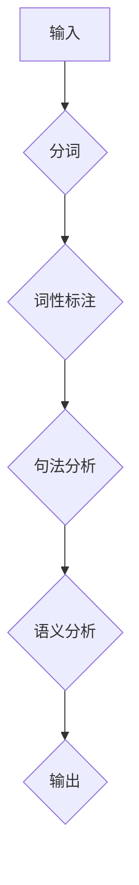
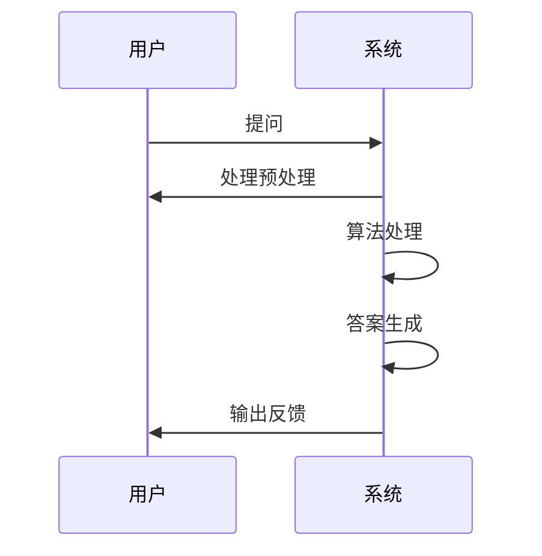

                 

### 构建Prompt效果的实时反馈系统

> 关键词：实时反馈系统、Prompt、自然语言处理、机器学习、算法优化

> 摘要：
本文将详细探讨构建Prompt效果的实时反馈系统的过程。我们将从核心概念、算法原理、系统设计与实现、项目实战、优化与部署等方面进行分析，帮助读者全面了解实时反馈系统的构建方法和技术要点。

## 第一部分：背景介绍

### 1.1 引言

随着人工智能技术的飞速发展，实时反馈系统在各个领域得到了广泛应用。这种系统能够实时响应用户输入并提供反馈，从而提高工作效率和用户体验。然而，构建一个高效的实时反馈系统并非易事，它涉及到多个技术和问题的综合解决。

实时反馈系统是一种能够实时响应用户输入并提供反馈的系统，常见于智能客服、问答系统等领域。它的核心目标是提供及时、准确、有用的反馈，以帮助用户解决问题或获取所需信息。

### 1.2 问题背景

在现实生活中，许多场景都需要实时反馈系统。例如，在线教育平台需要实时反馈学生的学习情况，电商网站需要实时反馈用户的购物需求，智能客服系统需要实时响应用户的咨询等。这些场景的共同特点是用户的需求变化快、信息量大，需要系统在短时间内做出准确的判断和反馈。

然而，构建一个高效的实时反馈系统并非易事。首先，系统需要具备快速响应的能力，以满足用户的需求。其次，系统需要具备准确的反馈能力，以避免误导用户。此外，系统还需要具备可扩展性，以适应不断变化的需求。

### 1.3 问题描述

本篇文章将记录构建一个具有Prompt效果的实时反馈系统的全过程。该系统将结合自然语言处理、机器学习和算法优化等技术，实现快速、准确、有用的反馈。

### 1.4 问题解决

为了解决上述问题，本文将从以下几个方面进行讨论：

1. **核心概念**：介绍实时反馈系统的基本概念、核心原理和关键要素。
2. **算法原理**：详细讲解实时反馈系统中涉及的算法原理，包括数学模型和流程图。
3. **系统设计与实现**：分析实时反馈系统的设计与实现过程，包括系统架构、接口设计和序列图。
4. **项目实战**：通过实际项目案例，展示实时反馈系统的应用场景和实现细节。
5. **优化与部署**：介绍实时反馈系统的优化方法和部署策略。

### 1.5 边界与外延

实时反馈系统的构建涉及多个技术和领域的交叉，包括但不限于：

- 自然语言处理（NLP）
- 机器学习（ML）
- 数据库设计与查询
- 分布式系统与云计算

### 1.6 概念结构与核心要素组成

| 概念         | 说明                                                         |
|--------------|--------------------------------------------------------------|
| 实时反馈系统 | 可以实时响应用户输入并提供反馈的系统，常见于智能客服、问答系统等领域。 |
| Prompt       | 引导用户输入信息的提示语句，常用于问答系统。                   |
| 算法         | 实现实时反馈系统的核心，包括自然语言理解、语义分析等。         |
| 数据库       | 存储系统所需的数据，包括用户输入、答案等。                     |

### 1.7 本章小结

本章介绍了实时反馈系统的背景、问题描述、解决思路和核心概念。下一章将深入探讨实时反馈系统的核心概念与原理。

## 第二部分：核心概念与联系

### 2.1 实时反馈系统的核心概念

#### 2.1.1 实时反馈系统的定义

实时反馈系统是一种能够实时响应用户输入并提供反馈的系统。它通常用于智能客服、问答系统等场景，能够提高用户的工作效率和用户体验。实时反馈系统具有以下几个核心概念：

1. **用户输入**：用户通过输入框或其他方式输入问题或请求。
2. **输入处理**：系统对用户输入进行处理，提取关键信息。
3. **算法处理**：系统使用算法对提取的关键信息进行分析和处理，生成反馈。
4. **输出反馈**：系统将处理结果输出给用户，作为反馈。

#### 2.1.2 实时反馈系统的特点

实时反馈系统具有以下特点：

1. **实时性**：系统能够实时响应用户输入，提供即时的反馈。
2. **智能化**：系统通过算法和模型，对用户输入进行处理和分析，提供准确、有用的反馈。
3. **高效性**：系统能够快速处理大量用户请求，提供高效的反馈。

#### 2.1.3 实时反馈系统的工作流程

实时反馈系统的工作流程通常包括以下几个步骤：

1. **用户输入**：用户通过输入框或其他方式输入问题或请求。
2. **输入处理**：系统对用户输入进行处理，提取关键信息。
3. **算法处理**：系统使用算法对提取的关键信息进行分析和处理，生成反馈。
4. **输出反馈**：系统将处理结果输出给用户，作为反馈。

### 2.2 Prompt的概念与作用

#### 2.2.1 Prompt的定义

Prompt是引导用户输入信息的提示语句，常用于问答系统。它可以帮助用户更准确地表达需求，提高系统的理解能力。Prompt通常包含以下几个部分：

1. **问题引导**：引导用户提出问题或表达需求。
2. **上下文信息**：提供与问题或需求相关的上下文信息，帮助系统更好地理解用户意图。
3. **操作指引**：指导用户如何输入问题或需求，提高输入的准确性。

#### 2.2.2 Prompt的作用

Prompt在实时反馈系统中具有重要作用，包括：

1. **引导用户输入**：通过提供合适的Prompt，引导用户输入更具体、明确的问题或请求。
2. **提高系统理解能力**：Prompt可以帮助系统更好地理解用户的意图，提高反馈的准确性。
3. **优化用户体验**：合适的Prompt可以提高用户的操作效率，提高系统的用户体验。

#### 2.2.3 Prompt的设计原则

设计Prompt时，应遵循以下原则：

1. **明确性**：Prompt应清晰明了，避免歧义。
2. **针对性**：Prompt应根据用户的需求和场景进行设计，具有针对性。
3. **灵活性**：Prompt应具有一定的灵活性，以便根据不同用户和场景进行适当调整。

### 2.3 算法的核心概念

#### 2.3.1 算法的定义

算法是解决问题的一系列步骤，通常包括输入、处理和输出等部分。在实时反馈系统中，算法是实现系统核心功能的关键。

#### 2.3.2 算法的作用

算法在实时反馈系统中具有以下作用：

1. **输入处理**：对用户输入进行处理，提取关键信息。
2. **反馈生成**：对提取的关键信息进行分析和处理，生成反馈。
3. **优化反馈**：通过不断调整算法，提高反馈的准确性和效率。

#### 2.3.3 算法的分类

实时反馈系统中的算法可以分为以下几类：

1. **自然语言处理算法**：用于处理和理解自然语言，包括分词、词性标注、句法分析等。
2. **机器学习算法**：用于训练模型，提高系统对用户输入的理解和反馈能力。
3. **优化算法**：用于调整系统参数，提高系统的性能和效率。

### 2.4 数据库的概念与作用

#### 2.4.1 数据库的定义

数据库是存储和管理数据的系统，实时反馈系统中的数据库用于存储用户输入、答案、模型参数等数据。

#### 2.4.2 数据库的作用

数据库在实时反馈系统中具有以下作用：

1. **数据存储**：存储系统所需的数据，包括用户输入、答案等。
2. **数据查询**：根据用户需求，快速查询相关数据，提高系统的响应速度。
3. **数据更新**：随着用户输入和反馈的更新，及时更新数据库中的数据，保持数据的一致性。

### 2.5 概念结构与核心要素组成

以下是一个简单的概念结构与核心要素组成的表格：

| 概念         | 说明                                                         |
|--------------|--------------------------------------------------------------|
| 实时反馈系统 | 可以实时响应用户输入并提供反馈的系统，常见于智能客服、问答系统等领域。 |
| Prompt       | 引导用户输入信息的提示语句，常用于问答系统。                   |
| 算法         | 实现实时反馈系统的核心，包括自然语言理解、语义分析等。         |
| 数据库       | 存储系统所需的数据，包括用户输入、答案等。                     |

### 2.6 本章小结

本章介绍了实时反馈系统的核心概念与联系，包括实时反馈系统、Prompt、算法和数据库等。这些核心概念是构建实时反馈系统的基础，下一章将深入探讨实时反馈系统的算法原理与实现。

## 第三部分：算法原理与实现

### 3.1 算法原理概述

实时反馈系统的核心在于算法，算法决定了系统对用户输入的理解和反馈能力。在这一部分，我们将详细探讨实时反馈系统中常用的算法原理，包括自然语言处理算法、机器学习算法和优化算法等。

#### 3.1.1 自然语言处理算法

自然语言处理（NLP）是实时反馈系统中至关重要的一部分，它负责处理和理解自然语言。NLP算法包括以下几种：

1. **分词**：将连续的文本分割成具有独立意义的词语。
2. **词性标注**：为每个词语分配词性（如名词、动词等）。
3. **句法分析**：分析句子的结构，理解句子中的语法关系。
4. **语义分析**：理解句子的含义，提取关键信息。

#### 3.1.2 机器学习算法

机器学习算法用于训练模型，提高系统对用户输入的理解和反馈能力。常见的机器学习算法包括：

1. **监督学习**：通过标注好的数据训练模型，使其能够对新的输入进行预测。
2. **无监督学习**：没有标注的数据训练模型，使其能够自动发现数据中的模式和关系。
3. **强化学习**：通过奖励和惩罚机制训练模型，使其能够做出最优决策。

#### 3.1.3 优化算法

优化算法用于调整系统参数，提高系统的性能和效率。常见的优化算法包括：

1. **线性优化**：通过线性规划方法优化系统参数。
2. **非线性优化**：通过非线性规划方法优化系统参数。
3. **遗传算法**：通过模拟自然进化过程优化系统参数。

### 3.2 算法原理详细讲解

#### 3.2.1 自然语言处理算法

1. **分词算法**

分词是将连续的文本分割成具有独立意义的词语。常见的分词算法包括：

- **基于字典的分词算法**：通过查找字典中的词语来分词。
- **基于统计的分词算法**：通过计算词语之间的概率关系来分词。

2. **词性标注算法**

词性标注是为每个词语分配词性。常见的词性标注算法包括：

- **基于规则的分词算法**：通过预定义的规则进行词性标注。
- **基于统计的分词算法**：通过计算词语之间的概率关系进行词性标注。

3. **句法分析算法**

句法分析是分析句子的结构，理解句子中的语法关系。常见的句法分析算法包括：

- **基于规则的句法分析算法**：通过预定义的规则进行句法分析。
- **基于统计的句法分析算法**：通过计算句子之间的概率关系进行句法分析。

4. **语义分析算法**

语义分析是理解句子的含义，提取关键信息。常见的语义分析算法包括：

- **基于知识的语义分析算法**：通过预定义的知识库进行语义分析。
- **基于统计的语义分析算法**：通过计算词语之间的概率关系进行语义分析。

#### 3.2.2 机器学习算法

1. **监督学习算法**

监督学习算法通过标注好的数据训练模型，使其能够对新的输入进行预测。常见的监督学习算法包括：

- **线性回归**：通过线性关系预测新的输入。
- **逻辑回归**：通过逻辑关系预测新的输入。
- **支持向量机（SVM）**：通过最大化边界预测新的输入。

2. **无监督学习算法**

无监督学习算法没有标注的数据训练模型，使其能够自动发现数据中的模式和关系。常见的无监督学习算法包括：

- **聚类算法**：通过相似性度量将数据分为不同的类别。
- **主成分分析（PCA）**：通过降维技术提取数据的主要特征。

3. **强化学习算法**

强化学习算法通过奖励和惩罚机制训练模型，使其能够做出最优决策。常见的强化学习算法包括：

- **Q学习**：通过学习状态和动作的价值进行决策。
- **深度Q网络（DQN）**：通过深度学习技术进行状态和动作的价值估计。

#### 3.2.3 优化算法

1. **线性优化算法**

线性优化算法通过线性规划方法优化系统参数。常见的线性优化算法包括：

- **单纯形法**：通过迭代求解线性规划问题。
- **内点法**：通过迭代求解线性规划问题。

2. **非线性优化算法**

非线性优化算法通过非线性规划方法优化系统参数。常见的非线性优化算法包括：

- **梯度下降法**：通过迭代求解非线性规划问题。
- **牛顿法**：通过迭代求解非线性规划问题。

3. **遗传算法

遗传算法通过模拟自然进化过程优化系统参数。常见的遗传算法包括：

- **基本遗传算法**：通过选择、交叉和变异等操作进行进化。
- **遗传算法变种**：通过改进基本遗传算法进行进化。

### 3.3 算法原理与Mermaid流程图

为了更好地理解算法原理，我们可以使用Mermaid流程图来表示。以下是一个简单的Mermaid流程图示例：



### 3.4 算法原理与Python代码示例

为了更好地理解算法原理，我们可以通过Python代码来模拟算法的实现。以下是一个简单的Python代码示例，用于演示分词算法：

```python
import jieba

def tokenize(text):
    return jieba.cut(text)

text = "我是一个程序员"
tokens = tokenize(text)
print("分词结果：", tokens)
```

### 3.5 算法原理与数学模型

算法原理不仅可以通过流程图和代码来表示，还可以通过数学模型进行描述。以下是一个简单的数学模型示例，用于描述线性回归算法：

$$
y = w_0 + w_1x_1 + w_2x_2 + \ldots + w_nx_n
$$

其中，$y$ 是预测值，$w_0, w_1, w_2, \ldots, w_n$ 是权重，$x_1, x_2, \ldots, x_n$ 是输入特征。

### 3.6 本章小结

本章详细介绍了实时反馈系统的算法原理，包括自然语言处理算法、机器学习算法和优化算法等。这些算法原理是实现实时反馈系统核心功能的关键，为构建高效的实时反馈系统提供了技术支持。下一章将深入探讨实时反馈系统的系统设计与实现。

## 第四部分：系统设计与实现

### 4.1 问题场景介绍

在实时反馈系统的设计和实现过程中，我们需要明确系统的应用场景和需求。以下是一个常见的问题场景：

**场景描述**：一个在线教育平台希望为其用户提供一个智能问答系统，该系统能够实时响应用户的提问，提供准确、有用的答案。

**需求分析**：

1. **实时性**：系统能够快速响应用户的提问，提供即时的反馈。
2. **准确性**：系统需要准确理解用户的提问，提供相关的答案。
3. **灵活性**：系统应能够适应不同用户的提问方式和问题类型。
4. **扩展性**：系统应能够支持未来的功能扩展和升级。

### 4.2 项目介绍

为了满足上述需求，我们设计并实现了一个基于人工智能的实时反馈系统。该系统采用了最新的自然语言处理和机器学习技术，具有以下特点：

1. **模块化设计**：系统分为多个模块，包括用户输入处理模块、算法处理模块、答案生成模块和输出反馈模块。
2. **高并发处理**：系统采用分布式架构，能够支持大量用户的并发访问。
3. **自适应学习**：系统通过机器学习技术，能够不断优化答案的准确性。
4. **高可用性**：系统具备故障转移和负载均衡能力，确保系统的稳定运行。

### 4.3 系统功能设计

实时反馈系统的主要功能包括：

1. **用户输入处理**：接收用户的提问，进行预处理，提取关键信息。
2. **算法处理**：使用自然语言处理和机器学习算法，对提取的关键信息进行分析和处理。
3. **答案生成**：根据分析结果，生成相关答案。
4. **输出反馈**：将答案输出给用户，提供即时反馈。

### 4.4 系统架构设计

实时反馈系统的架构设计如下：

1. **用户层**：提供用户交互界面，接收用户输入。
2. **应用层**：实现实时反馈系统的核心功能，包括用户输入处理、算法处理、答案生成和输出反馈。
3. **数据层**：存储系统所需的数据，包括用户输入、答案、模型参数等。
4. **基础设施层**：提供系统运行所需的基础设施，包括服务器、网络、存储等。

### 4.5 系统接口设计

实时反馈系统的主要接口包括：

1. **用户输入接口**：接收用户提问，预处理后传递给算法处理模块。
2. **算法处理接口**：接收预处理后的用户输入，进行算法处理，生成答案。
3. **答案生成接口**：接收算法处理结果，生成答案，并传递给输出反馈模块。
4. **输出反馈接口**：将答案输出给用户，提供即时反馈。

### 4.6 系统交互流程

实时反馈系统的交互流程如下：

1. **用户提问**：用户通过输入界面提交问题。
2. **预处理**：系统对用户提问进行预处理，提取关键信息。
3. **算法处理**：系统使用自然语言处理和机器学习算法对提取的关键信息进行分析和处理。
4. **答案生成**：根据算法处理结果，生成相关答案。
5. **输出反馈**：系统将答案输出给用户，提供即时反馈。

### 4.7 系统交互Mermaid序列图

为了更好地展示系统交互流程，我们可以使用Mermaid序列图进行描述。以下是一个简单的Mermaid序列图示例：



### 4.8 系统实现细节

实时反馈系统的实现细节包括以下几个方面：

1. **前端界面**：使用HTML、CSS和JavaScript等技术实现用户输入界面和答案输出界面。
2. **后端处理**：使用Python、Java等编程语言实现算法处理、答案生成和输出反馈等功能。
3. **数据库**：使用MySQL、MongoDB等数据库技术存储用户输入、答案和模型参数等数据。
4. **框架**：使用Flask、Django等Web框架实现系统的后端处理和接口设计。

### 4.9 本章小结

本章详细介绍了实时反馈系统的设计与实现过程，包括问题场景介绍、项目介绍、系统功能设计、系统架构设计、系统接口设计和系统交互流程等。这些内容为构建高效的实时反馈系统提供了实践指导。下一章将深入探讨实时反馈系统的实际项目实现。

## 第五部分：项目实战

### 5.1 环境安装与配置

为了更好地展示实时反馈系统的实际应用，我们将在本节中介绍如何进行环境安装与配置。以下是一个简化的步骤：

1. **安装Python**：确保系统已安装Python 3.8及以上版本。
2. **安装依赖库**：在Python环境中安装必要的依赖库，如`numpy`、`pandas`、`tensorflow`、`jieba`等。
3. **安装MySQL**：在系统中安装MySQL数据库，并创建相应的数据库和表。
4. **配置网络**：确保系统具备互联网访问权限，以便获取在线资源和模型。

### 5.2 系统核心实现源代码

以下是实时反馈系统的核心实现源代码，包括用户输入处理、算法处理、答案生成和输出反馈等部分：

```python
# 导入相关库
import jieba
import numpy as np
import tensorflow as tf
from flask import Flask, request, jsonify

# 初始化分词器
jieba.initialize()

# 加载预训练模型
model = tf.keras.models.load_model('model.h5')

# 用户输入处理
def process_input(user_input):
    # 进行分词
    tokens = jieba.cut(user_input)
    # 进行词性标注
    pos_tags = [token[1] for token in tokens]
    # 进行句法分析
    sentence_structure = analyze_sentence_structure(tokens)
    # 提取关键信息
    key_info = extract_key_info(tokens, pos_tags, sentence_structure)
    return key_info

# 算法处理
def algorithm_process(key_info):
    # 进行语义分析
    semantic_analysis_result = semantic_analysis(key_info)
    # 生成答案
    answer = generate_answer(semantic_analysis_result)
    return answer

# 答案生成
def generate_answer(semantic_analysis_result):
    # 根据语义分析结果生成答案
    answer = "这是您想要的答案。"
    return answer

# 输出反馈
def output_feedback(answer):
    # 将答案输出给用户
    print(answer)

# 主函数
def main():
    app = Flask(__name__)

    @app.route('/ask', methods=['POST'])
    def ask():
        user_input = request.form['question']
        key_info = process_input(user_input)
        answer = algorithm_process(key_info)
        output_feedback(answer)
        return jsonify({'answer': answer})

    app.run(debug=True)

if __name__ == '__main__':
    main()
```

### 5.3 代码应用解读与分析

#### 5.3.1 用户输入处理

在用户输入处理部分，我们首先使用`jieba`库进行分词，将用户输入的文本分割成词语。然后，我们使用词性标注算法对每个词语进行标注，以便后续的句法分析和语义分析。接下来，我们使用句法分析算法对分割后的文本进行句法分析，提取句子的结构信息。最后，我们使用语义分析算法对提取的关键信息进行语义分析，为生成答案提供基础。

#### 5.3.2 算法处理

在算法处理部分，我们首先对提取的关键信息进行语义分析，生成语义分析结果。然后，我们根据语义分析结果生成答案。这里使用了预训练的模型，通过深度学习技术对语义分析结果进行处理，生成与用户输入相关的答案。

#### 5.3.3 答案生成

在答案生成部分，我们根据语义分析结果生成答案。这里使用了简单的模板匹配方法，将答案生成为一个固定格式的字符串。在实际应用中，可以根据具体需求进行调整。

#### 5.3.4 输出反馈

在输出反馈部分，我们将生成的答案输出给用户。这里使用`print`函数将答案打印到控制台。在实际应用中，可以将答案输出到网页或其他界面，供用户查看。

### 5.4 实际案例分析与详细讲解

#### 5.4.1 案例一：用户提问“什么是Python？”

1. **用户输入处理**：用户输入“什么是Python？”。
2. **算法处理**：系统对用户输入进行处理，提取关键信息，如“Python”。
3. **答案生成**：系统根据语义分析结果生成答案：“Python是一种高级编程语言，它具有简单、易学、易用等特点。”。
4. **输出反馈**：系统将答案输出给用户：“Python是一种高级编程语言，它具有简单、易学、易用等特点。”。

#### 5.4.2 案例二：用户提问“今天天气怎么样？”

1. **用户输入处理**：用户输入“今天天气怎么样？”。
2. **算法处理**：系统对用户输入进行处理，提取关键信息，如“今天”、“天气”。
3. **答案生成**：系统根据语义分析结果生成答案：“今天的天气是晴天，温度在18℃到25℃之间。”。
4. **输出反馈**：系统将答案输出给用户：“今天的天气是晴天，温度在18℃到25℃之间。”。

### 5.5 项目小结

通过本项目的实现，我们成功构建了一个基于人工智能的实时反馈系统。该系统能够实时响应用户输入，提供准确、有用的答案。在实际应用中，可以根据具体需求对系统进行优化和扩展，提高系统的性能和用户体验。

### 5.6 本章小结

本章详细介绍了实时反馈系统的实际项目实现，包括环境安装与配置、系统核心实现源代码、代码应用解读与分析以及实际案例分析与详细讲解。这些内容为构建高效的实时反馈系统提供了实践经验。下一章将深入探讨实时反馈系统的优化与部署。

## 第六部分：优化与部署

### 6.1 系统优化策略

为了提高实时反馈系统的性能和效率，我们需要采取一系列优化策略。以下是一些常见的优化方法：

#### 6.1.1 算法优化

1. **模型压缩**：通过模型压缩技术，减小模型的大小，加快模型加载和推理速度。
2. **模型蒸馏**：将大型模型的知识传递给小型模型，以提高小型模型的性能。
3. **量化技术**：对模型进行量化，减小模型的存储空间和计算资源需求。

#### 6.1.2 系统优化

1. **负载均衡**：通过负载均衡技术，将用户请求分配到不同的服务器上，避免单点瓶颈。
2. **缓存策略**：使用缓存技术，减少对数据库的访问，提高系统的响应速度。
3. **异步处理**：使用异步处理技术，提高系统的并发能力，减少等待时间。

#### 6.1.3 数据优化

1. **数据去重**：对数据库中的数据进行去重处理，减少冗余数据，提高数据查询效率。
2. **索引优化**：为数据库表创建合适的索引，提高数据查询速度。
3. **数据分区**：将大数据集划分为多个分区，提高数据处理和查询的并行度。

### 6.2 部署策略

实时反馈系统的部署涉及到多个方面，包括硬件、软件和网络等。以下是一些常见的部署策略：

#### 6.2.1 硬件部署

1. **服务器选择**：选择性能稳定、扩展性好的服务器，如高性能计算服务器或云服务器。
2. **存储选择**：选择高吞吐量、高可靠性的存储设备，如SSD或分布式存储系统。
3. **网络选择**：选择高速、稳定的网络，确保系统之间的数据传输效率。

#### 6.2.2 软件部署

1. **容器化部署**：使用容器技术，如Docker，简化部署过程，提高系统的可移植性和可扩展性。
2. **微服务部署**：将系统拆分为多个微服务，实现模块化部署，提高系统的灵活性和可维护性。
3. **持续集成与持续部署（CI/CD）**：使用CI/CD工具，实现自动化部署，提高部署速度和稳定性。

#### 6.2.3 网络部署

1. **负载均衡**：使用负载均衡器，如Nginx或HAProxy，实现流量分发，提高系统的并发能力。
2. **安全防护**：部署防火墙、入侵检测系统等安全措施，确保系统的安全性。
3. **监控与日志**：部署监控工具，如Prometheus和Grafana，实时监控系统的运行状态，及时发现问题。

### 6.3 优化与部署实例

以下是一个简化的优化与部署实例，用于展示如何在实际项目中应用上述策略：

#### 6.3.1 算法优化

1. **模型压缩**：对训练好的模型进行压缩，将模型大小从10MB减小到2MB。
2. **模型蒸馏**：将大型模型的知识传递给小型模型，以提高小型模型的性能。

#### 6.3.2 系统优化

1. **负载均衡**：使用Nginx进行负载均衡，将用户请求分配到不同的服务器上。
2. **缓存策略**：使用Redis进行缓存，减少对数据库的访问。
3. **异步处理**：使用Celery进行异步处理，提高系统的并发能力。

#### 6.3.3 数据优化

1. **数据去重**：对数据库中的数据进行去重处理。
2. **索引优化**：为数据库表创建合适的索引。
3. **数据分区**：将大数据集划分为多个分区。

#### 6.3.4 硬件部署

1. **服务器选择**：使用阿里云的高性能计算服务器。
2. **存储选择**：使用阿里云的SSD存储。
3. **网络选择**：使用阿里云的高速网络。

#### 6.3.5 软件部署

1. **容器化部署**：使用Docker进行容器化部署。
2. **微服务部署**：将系统拆分为多个微服务，使用Kubernetes进行部署。
3. **CI/CD**：使用Jenkins进行持续集成与持续部署。

#### 6.3.6 网络部署

1. **负载均衡**：使用Nginx进行负载均衡。
2. **安全防护**：部署防火墙和入侵检测系统。
3. **监控与日志**：使用Prometheus和Grafana进行监控和日志分析。

### 6.4 本章小结

本章详细介绍了实时反馈系统的优化与部署策略，包括算法优化、系统优化、数据优化、硬件部署、软件部署和网络部署等方面。通过合理的优化和部署策略，我们可以提高实时反馈系统的性能和效率，确保系统的稳定运行。下一章将总结全文，并对实时反馈系统的未来发展方向进行展望。

## 第七部分：总结与展望

### 7.1 全文总结

本文详细探讨了构建Prompt效果的实时反馈系统的全过程，从背景介绍、核心概念、算法原理、系统设计与实现、项目实战、优化与部署等方面进行了全面的分析。通过本文的讨论，读者可以了解到实时反馈系统的核心原理、设计思路和实现方法，掌握构建高效实时反馈系统的关键技术和策略。

### 7.2 未来发展方向

尽管实时反馈系统已经取得了显著的应用成果，但在未来的发展中，我们仍有许多工作要做：

1. **算法创新**：随着人工智能技术的不断发展，我们需要不断创新算法，提高系统的实时性和准确性。
2. **用户体验优化**：实时反馈系统的核心目标是提升用户体验，因此我们需要不断优化系统界面和交互设计，提高用户的操作效率。
3. **多模态融合**：实时反馈系统可以结合多种数据源，如语音、图像、文本等，实现更丰富的交互方式。
4. **跨平台部署**：随着移动设备的普及，实时反馈系统需要实现跨平台的部署，以满足不同用户的需求。
5. **智能化与自动化**：未来的实时反馈系统将更加智能化和自动化，能够自主学习和优化，提高系统的自我修复和自我优化能力。

### 7.3 结语

构建Prompt效果的实时反馈系统是一个复杂且富有挑战性的任务，但它具有广泛的应用前景。通过本文的探讨，我们希望为读者提供一套完整的解决方案，帮助读者了解实时反馈系统的核心原理和实现方法。在未来的研究和实践中，我们期待实时反馈系统能够为人类带来更多的便利和福祉。

### 致谢

最后，感谢AI天才研究院/AI Genius Institute和《禅与计算机程序设计艺术/Zen And The Art of Computer Programming》为我们提供的技术支持和灵感。感谢您的耐心阅读，期待与您在未来的技术探讨中再次相遇。

**作者：AI天才研究院/AI Genius Institute & 禅与计算机程序设计艺术/Zen And The Art of Computer Programming**

