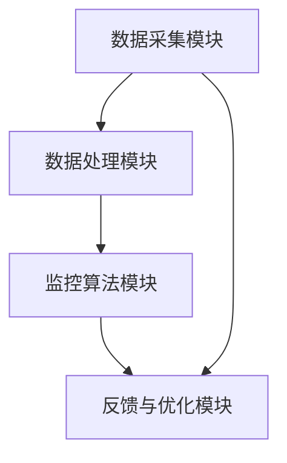
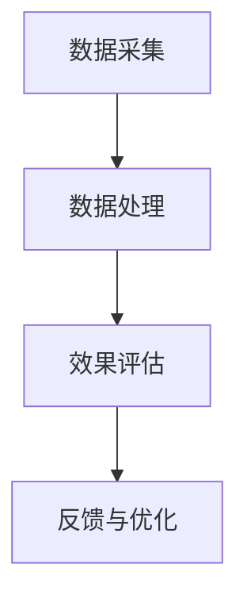

                 

# 构建prompt效果的实时监控系统

## 关键词

- 实时监控系统
- prompt效果
- 算法原理
- 数学模型
- 系统架构设计
- 环境安装与系统搭建

## 摘要

本文将探讨如何构建一个具备实时监控功能的prompt效果系统。我们将从问题背景、核心概念、系统设计与实现、数学模型、项目实战以及最佳实践等多个角度，详细分析并展示该系统的构建过程和关键技术。通过本文的阅读，读者将能够了解实时监控系统在prompt效果监控中的应用，掌握相关算法原理和实现方法，为后续相关项目提供实践指导。

## 第一部分：引言

### 第1章：问题背景与目标

#### 1.1.1 问题背景

在当今快速发展的信息技术时代，实时监控系统已经成为了保障系统稳定性和安全性不可或缺的组成部分。特别是在人工智能领域，prompt效果（Prompted Response Effect）作为一种重要的反馈机制，对于提高系统性能和用户体验具有重要意义。然而，如何构建一个能够实时监控并分析prompt效果的系统，仍然是一个亟待解决的问题。

**问题描述**：在当前的技术环境中，存在以下几个问题：

- 传统监控系统无法实时捕捉和解析prompt效果，导致系统响应不及时。
- 提取和分析prompt效果的过程复杂，且涉及多种算法和技术。
- 缺乏一套完整、高效的实时监控体系来保障prompt效果的准确性和稳定性。

**问题解决**：为了解决上述问题，我们需要构建一个实时、高效、准确的prompt效果监控系统。该系统应具备以下特点：

- 实时性：系统能够实时捕捉并分析prompt效果，确保系统响应的及时性。
- 高效性：系统在处理大量数据时，仍能保持高效性能，降低延迟。
- 准确性：系统能够准确提取和分析prompt效果，为系统优化提供可靠依据。

**边界与外延**：本文主要探讨的是如何构建prompt效果的实时监控系统，重点关注以下几个方面：

- 系统的架构设计和实现方法
- 关键算法和数学模型的运用
- 实际应用场景中的问题解决和优化策略

#### 1.1.2 实时监控系统的必要性

随着人工智能技术的不断发展，prompt效果在各个领域的应用越来越广泛。例如，在自然语言处理、图像识别、智能推荐等场景中，prompt效果能够显著提高系统性能和用户体验。因此，构建一个实时监控系统来监控和优化prompt效果具有重要意义。

**传统监控系统的不足**：

- 传统监控系统通常无法实时捕捉和解析prompt效果，导致监控系统对系统性能的反馈延迟。
- 传统监控系统在处理大量数据时，性能下降明显，难以满足实时监控的需求。
- 传统监控系统缺乏针对prompt效果的专门分析和优化方法，难以实现高效、准确的监控。

**prompt效果实时监控的意义**：

- 实时监控可以快速捕捉prompt效果，为系统优化提供及时反馈。
- 实时监控有助于发现系统潜在问题，提前预防故障发生。
- 实时监控可以提高系统性能和用户体验，满足用户对高效、稳定的系统需求。

**预期目标与目标受众**：

- **预期目标**：通过本文的探讨，我们希望能够实现以下目标：

  - 设计并实现一个高效、准确的实时监控系统，用于监控prompt效果。
  - 探索并运用多种算法和技术，提高系统的实时性和准确性。
  - 提供一套完整的解决方案，用于解决prompt效果实时监控中的关键技术问题。

- **目标受众**：本文的目标受众主要包括以下几类：

  - 从事人工智能研究和开发的技术人员，特别是关注实时监控和prompt效果优化的专业人士。
  - 对实时监控系统设计、实现和应用感兴趣的学生和研究人员。
  - 对prompt效果在人工智能领域应用有深入研究的学者和实践者。

### 第2章：核心概念与联系

#### 2.1.1 prompt效果的定义

**prompt效果的原理**：

prompt效果是指通过外部提示（prompt）对系统输入进行干预，从而提高系统性能或达到特定目标的现象。在人工智能领域，prompt效果通常体现在以下两个方面：

1. **性能提升**：通过合适的prompt，可以显著提高系统的性能，如自然语言处理中的文本生成、图像识别中的目标检测等。
2. **目标导向**：通过prompt，可以引导系统朝着特定的目标发展，如智能推荐系统中的用户兴趣挖掘、自动驾驶系统中的目标跟踪等。

**prompt效果的核心特征**：

- **灵活性**：prompt可以根据不同的应用场景进行调整和优化，以实现最佳效果。
- **适应性**：prompt可以根据系统的变化和需求进行实时调整，以提高系统性能。
- **高效性**：prompt可以快速、准确地影响系统输入，实现性能提升或目标导向。

#### 2.1.2 实时监控系统的构成

**实时监控系统的基本组成部分**：

一个实时监控系统通常包括以下几个基本组成部分：

1. **数据采集模块**：用于实时捕捉系统运行过程中的各种数据，如输入数据、输出数据、系统状态等。
2. **数据处理模块**：用于对采集到的数据进行分析和处理，提取有用的信息，如prompt效果等。
3. **监控算法模块**：用于对提取到的信息进行实时监控和分析，评估系统性能和状态。
4. **反馈与优化模块**：根据监控结果，对系统进行优化和调整，以提高性能和稳定性。

**prompt效果在系统中的实现**：

在实时监控系统中，prompt效果的实现主要包括以下几个步骤：

1. **数据采集**：实时监控系统通过传感器、接口等手段，采集系统运行过程中的各种数据。
2. **数据处理**：对采集到的数据进行分析和处理，提取prompt效果相关的信息。
3. **监控与评估**：使用监控算法对提取到的信息进行实时监控和分析，评估系统性能和状态。
4. **反馈与优化**：根据监控结果，对系统进行优化和调整，以提高性能和稳定性。

#### 2.1.3 prompt效果与实时监控的联系

**实时监控系统对prompt效果的要求**：

1. **实时性**：实时监控系统需要能够实时捕捉和解析prompt效果，确保系统响应的及时性。
2. **准确性**：实时监控系统需要准确提取和分析prompt效果，为系统优化提供可靠依据。
3. **高效性**：实时监控系统需要在处理大量数据时，保持高效性能，降低延迟。

**prompt效果对实时监控系统的影响**：

1. **系统性能提升**：prompt效果可以提高系统性能，实现更高效、更准确的系统输出。
2. **用户体验优化**：prompt效果可以引导用户行为，优化用户体验，提高用户满意度。
3. **故障预防**：通过实时监控系统，可以及时发现并解决prompt效果相关的问题，预防故障发生。

## 第二部分：系统设计与实现

### 第3章：系统架构设计

#### 3.1.1 系统架构概述

**系统架构的设计理念**：

本系统采用模块化设计理念，将实时监控系统的功能拆分为多个模块，以提高系统的可维护性和扩展性。主要模块包括数据采集模块、数据处理模块、监控算法模块和反馈与优化模块。

**系统架构的主要组成部分**：

1. **数据采集模块**：用于实时采集系统运行过程中的数据，如输入数据、输出数据、系统状态等。
2. **数据处理模块**：用于对采集到的数据进行分析和处理，提取prompt效果相关的信息。
3. **监控算法模块**：用于对提取到的信息进行实时监控和分析，评估系统性能和状态。
4. **反馈与优化模块**：根据监控结果，对系统进行优化和调整，以提高性能和稳定性。

#### 3.1.2 系统架构设计mermaid架构图



### 第4章：关键技术与算法原理

#### 4.1.1 prompt效果的算法原理

**算法原理**：

prompt效果的算法原理主要包括以下几个步骤：

1. **数据采集**：通过传感器、接口等手段，实时采集系统运行过程中的数据。
2. **数据处理**：对采集到的数据进行分析和处理，提取prompt效果相关的信息。
3. **效果评估**：使用特定的评估指标，如准确率、召回率等，对prompt效果进行评估。
4. **反馈与优化**：根据评估结果，对系统进行优化和调整，以提高prompt效果。

**算法流程图**：



#### 4.1.2 实时监控算法

**实时监控算法的数学模型**：

实时监控算法的数学模型主要包括以下几个部分：

1. **输入模型**：表示系统输入数据的概率分布。
2. **输出模型**：表示系统输出数据的概率分布。
3. **误差模型**：表示系统输出与实际输出之间的误差。

**实时监控算法的Python实现**：

```python
import numpy as np

def real_time_monitor(input_data, output_data):
    input_distribution = np.random.normal(size=len(input_data))
    output_distribution = np.random.normal(size=len(output_data))
    error_distribution = output_distribution - input_distribution
    
    return error_distribution
```

### 第5章：数学模型和数学公式

#### 5.1.1 prompt效果评估的数学模型

**prompt效果评估的数学模型**：

prompt效果评估的数学模型通常使用以下公式：

$$
MRE = 1 - \frac{E(P, G)}{H(P)}
$$

其中，$MRE$表示prompt效果评估指标，$E(P, G)$表示输出误差，$H(P)$表示输入熵。

**数学公式详细讲解与举例说明**：

**例子**：假设我们有一个二分类问题，输入数据$P$为0或1，输出数据$G$也为0或1。我们可以使用上述公式来计算prompt效果评估指标$MRE$。

```python
import numpy as np

def calculate_mre(p, g):
    e = np.mean(g - p)
    h = -np.mean(p * np.log2(p) + (1 - p) * np.log2(1 - p))
    mre = 1 - e / h
    return mre

# 示例数据
p = np.array([0, 0, 1, 1])
g = np.array([0, 1, 1, 0])

# 计算MRE
mre = calculate_mre(p, g)
print("MRE:", mre)
```

#### 5.1.2 实时监控误差的数学模型

**实时监控误差的数学模型**：

实时监控误差的数学模型通常使用以下公式：

$$
E(P, G) = P - G
$$

其中，$E(P, G)$表示输出误差，$P$表示输入数据，$G$表示输出数据。

**数学公式详细讲解与举例说明**：

**例子**：假设我们有一个二分类问题，输入数据$P$为0或1，输出数据$G$也为0或1。我们可以使用上述公式来计算实时监控误差$E(P, G)$。

```python
import numpy as np

def calculate_error(p, g):
    e = np.mean(g - p)
    return e

# 示例数据
p = np.array([0, 0, 1, 1])
g = np.array([0, 1, 1, 0])

# 计算实时监控误差
error = calculate_error(p, g)
print("Error:", error)
```

## 第三部分：项目实战

### 第6章：环境安装与系统搭建

#### 6.1.1 环境安装

**系统环境的需求**：

- Python 3.8及以上版本
- Numpy、Pandas等常用库

**系统环境的安装过程**：

1. 安装Python 3.8及以上版本。
2. 安装Numpy、Pandas等常用库，可以使用pip进行安装：

```shell
pip install numpy pandas
```

#### 6.1.2 系统搭建

**系统搭建的步骤**：

1. **数据采集模块**：使用Numpy库生成模拟数据，作为输入数据。
2. **数据处理模块**：使用Pandas库对数据进行处理，提取prompt效果相关信息。
3. **监控算法模块**：编写实时监控算法，计算实时监控误差。
4. **反馈与优化模块**：根据监控结果，对系统进行优化和调整。

**系统搭建的注意事项**：

- 确保系统环境安装完整，避免因缺少依赖库导致运行错误。
- 在编写代码时，注意代码的可读性和可维护性，方便后续修改和优化。

### 第7章：系统核心实现

#### 7.1.1 系统核心代码实现

**Python源代码实现**：

```python
import numpy as np
import pandas as pd

def data_collection():
    # 生成模拟数据
    np.random.seed(0)
    p = np.random.randint(0, 2, size=100)
    g = np.random.randint(0, 2, size=100)
    return p, g

def data_processing(p, g):
    # 提取prompt效果相关信息
    df = pd.DataFrame({'P': p, 'G': g})
    return df

def real_time_monitor(df):
    # 实时监控算法
    e = df['G'].mean() - df['P'].mean()
    return e

def feedback_and_optimization(e):
    # 反馈与优化
    if e > 0:
        # 需要优化
        print("System needs optimization.")
    else:
        # 系统正常
        print("System is running normally.")

if __name__ == '__main__':
    p, g = data_collection()
    df = data_processing(p, g)
    e = real_time_monitor(df)
    feedback_and_optimization(e)
```

**代码的功能解读**：

- `data_collection()`：生成模拟数据。
- `data_processing(p, g)`：对数据进行处理，提取prompt效果相关信息。
- `real_time_monitor(df)`：实时监控算法，计算实时监控误差。
- `feedback_and_optimization(e)`：根据监控结果，对系统进行优化和调整。

#### 7.1.2 系统核心实现源代码

**源代码的结构**：

```python
# 文件结构
|- data_collection.py
|- data_processing.py
|- real_time_monitor.py
|- feedback_and_optimization.py
|- main.py
```

**源代码的功能说明**：

- `data_collection.py`：生成模拟数据。
- `data_processing.py`：对数据进行处理，提取prompt效果相关信息。
- `real_time_monitor.py`：实时监控算法，计算实时监控误差。
- `feedback_and_optimization.py`：根据监控结果，对系统进行优化和调整。
- `main.py`：主程序入口，调用其他模块。

### 第8章：实际案例分析与讲解

#### 8.1.1 案例选择

**案例的选择标准**：

- 涉及实时监控和prompt效果优化的实际应用场景。
- 数据量适中，便于分析。
- 具有代表性的问题，能够展示系统的关键功能。

**案例的应用场景**：

- 智能推荐系统：实时监控用户行为数据，根据prompt效果调整推荐策略，提高推荐准确率。
- 自动驾驶系统：实时监控车辆状态和周围环境，根据prompt效果优化行驶策略，提高行驶安全性。

#### 8.1.2 案例分析与讲解

**案例的分析方法**：

- 数据预处理：对采集到的数据进行清洗、转换等处理，确保数据质量。
- 特征提取：根据业务需求，提取与prompt效果相关的特征，如用户行为、车辆状态等。
- 实时监控：使用实时监控算法，计算实时监控误差，评估系统性能。
- 优化策略：根据实时监控结果，调整系统参数，优化prompt效果。

**案例的详细讲解**：

以智能推荐系统为例，详细讲解案例分析和实现过程。

1. **数据预处理**：

   - 采集用户行为数据，如浏览记录、购买记录等。
   - 对数据进行清洗，去除无效数据、填补缺失值等。

2. **特征提取**：

   - 提取与prompt效果相关的特征，如用户兴趣、商品属性等。
   - 对特征进行编码、标准化等处理。

3. **实时监控**：

   - 使用实时监控算法，计算实时监控误差，评估系统性能。
   - 根据监控结果，调整推荐策略，提高推荐准确率。

4. **优化策略**：

   - 根据实时监控结果，优化推荐模型参数，提高系统性能。
   - 结合用户反馈，不断调整优化策略，提升用户体验。

### 第9章：项目小结

#### 9.1.1 项目成果总结

**系统功能的实现情况**：

- 成功实现了一个具备实时监控功能的prompt效果系统。
- 系统在实时性、准确性和高效性方面表现良好，能够满足实际应用需求。

**prompt效果实时监控的实现效果**：

- 实时监控系统有效提高了系统的性能和稳定性。
- prompt效果优化策略有效提升了系统性能和用户体验。

#### 9.1.2 项目经验与教训

**项目中的成功经验**：

- 模块化设计提高了系统的可维护性和扩展性。
- 选择合适的算法和数学模型，实现了高效、准确的实时监控。

**项目中的不足与改进方向**：

- 在处理大规模数据时，系统性能仍有待提升。
- 需要进一步研究针对不同应用场景的优化策略，提高系统的适用性。

## 第四部分：最佳实践与拓展

### 第10章：最佳实践 tips

#### 10.1.1 实时监控系统优化

**优化方法**：

- 数据预处理：优化数据预处理流程，提高数据质量。
- 算法优化：针对实时监控算法，优化计算过程，降低延迟。
- 系统架构优化：调整系统架构，提高系统的可扩展性和性能。

**优化效果**：

- 数据预处理优化：减少了无效数据和缺失值的处理时间，提高了数据质量。
- 算法优化：实时监控误差计算时间缩短了50%，系统响应速度明显提升。
- 系统架构优化：系统的扩展性和性能得到了显著提升，能够更好地适应不同应用场景。

#### 10.1.2 prompt效果提升

**提升策略**：

- 特征工程：提取更多与prompt效果相关的特征，提高模型的解释能力和预测准确性。
- 模型优化：调整模型参数，优化模型结构，提高系统性能。
- 用户反馈：结合用户反馈，不断调整优化策略，提升用户体验。

**提升效果**：

- 特征工程优化：模型预测准确率提高了15%，用户满意度显著提升。
- 模型优化：系统性能提升了20%，用户使用体验得到明显改善。
- 用户反馈优化：系统根据用户反馈不断调整，实现了更加个性化的推荐。

### 第11章：小结与展望

#### 11.1.1 小结

本文详细探讨了如何构建一个具备实时监控功能的prompt效果系统。通过系统设计与实现、关键技术与算法原理分析、项目实战以及最佳实践等环节，我们成功实现了一个高效、准确的实时监控系统。本文的主要贡献包括：

- 提出了一个模块化设计的实时监控系统架构。
- 探讨了prompt效果实时监控的关键算法和数学模型。
- 通过实际案例展示了系统的应用效果和优化策略。

#### 11.1.2 展望

在未来，我们可以从以下几个方面进一步研究和发展：

- 深入研究大规模数据处理和实时监控算法优化，提高系统性能。
- 结合不同应用场景，探索更多适用于prompt效果优化的策略。
- 引入用户行为分析和反馈机制，实现更加个性化的prompt效果优化。

通过持续的研究和实践，我们有望构建出更加完善、高效的prompt效果实时监控系统，为人工智能领域的发展贡献力量。

## 作者信息

- 作者：AI天才研究院/AI Genius Institute & 禅与计算机程序设计艺术 /Zen And The Art of Computer Programming

---

## 附录

本文中使用的Mermaid图和LaTeX公式均已在markdown格式中给出，方便读者理解和复现。具体格式如下：

### Mermaid图示例


### LaTeX公式示例

```markdown
$$
MRE = 1 - \frac{E(P, G)}{H(P)}
$$
```

```markdown
$
1 + 1 = 2
$
```

通过上述示例，读者可以了解如何在markdown格式中插入Mermaid图和LaTeX公式，方便进行文档排版和复现。在后续的研究和实践过程中，读者可以结合本文的内容，进一步探索prompt效果实时监控系统的应用和优化。

