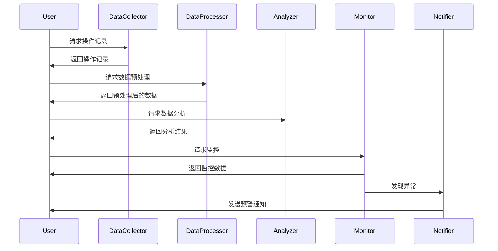
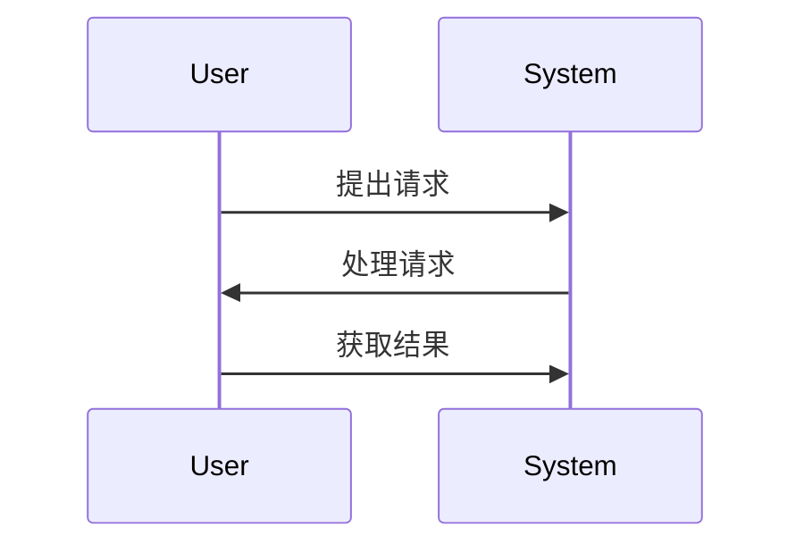
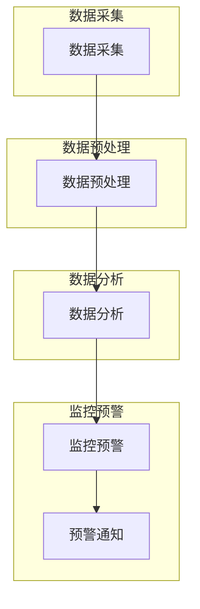
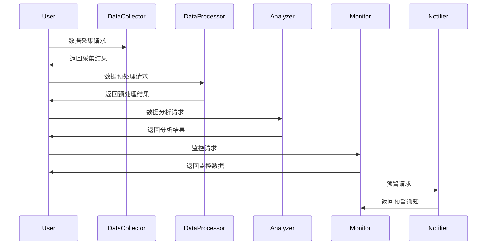

                 

# 构建Prompt效果的长期跟踪系统

## 关键词

- Prompt效果
- 长期跟踪系统
- 数据采集
- 数据预处理
- 分析处理
- 监控预警

## 摘要

本文旨在探讨如何构建一个高效的Prompt效果的长期跟踪系统。我们将从引言、技术原理、系统设计、项目实战四个方面，详细阐述该系统的构建过程，包括核心概念、技术原理、系统设计、项目实战等，为读者提供全面的指导和参考。

## 第一部分：引言

### 1.1 书籍背景与意义

#### 1.1.1 概述

在人工智能（AI）迅猛发展的今天，Prompt效果的长期跟踪系统成为了一个重要的研究方向。Prompt技术作为自然语言处理（NLP）领域的关键手段，能够有效提高模型的响应速度和准确性。然而，如何构建一个高效、稳定、可靠的Prompt效果跟踪系统，仍是一个亟待解决的问题。

#### 1.1.2 问题的提出

随着深度学习、自然语言处理等技术的发展，Prompt效果的长期跟踪系统在众多领域中发挥着越来越重要的作用。然而，目前关于这一领域的系统化研究还较为缺乏，许多企业和研究机构在构建Prompt效果跟踪系统时面临着诸多挑战。

#### 1.1.3 目标与内容

本书旨在为广大读者提供一本关于构建Prompt效果的长期跟踪系统的专业指南。我们将围绕这一主题，系统介绍相关概念、技术原理、系统设计、项目实战等内容，旨在为读者提供全方位、系统化的知识体系。

### 1.2 核心概念

#### 1.2.1 Prompt效果

Prompt效果是指通过给定提示（prompt）来引导模型产生预期输出的一种方法。在Prompt效果的长期跟踪系统中，需要关注提示的设计、效果评估和长期稳定性。

#### 1.2.2 长期跟踪

长期跟踪是指对系统的运行状态、性能指标、用户反馈等信息进行持续监测和记录，以便及时发现和解决问题。

#### 1.2.3 Prompt效果的长期跟踪系统

Prompt效果的长期跟踪系统是一种用于监测、评估和优化Prompt效果的软件系统，通常包括数据采集、分析处理、监控预警等功能。

### 1.3 框架结构

本书分为四个部分：

#### 1.3.1 第一部分：引言

介绍书籍背景、意义、核心概念及框架结构。

#### 1.3.2 第二部分：技术原理

系统讲解构建Prompt效果的长期跟踪系统的技术原理，包括数据采集、预处理、分析处理、监控预警等环节。

#### 1.3.3 第三部分：系统设计

详细介绍Prompt效果的长期跟踪系统的设计过程，包括需求分析、架构设计、功能设计等。

#### 1.3.4 第四部分：项目实战

通过实际案例，展示构建Prompt效果的长期跟踪系统的全过程，包括环境搭建、系统实现、应用分析等。

## 第二部分：技术原理

### 2.1 数据采集

#### 2.1.1 数据来源

在构建Prompt效果的长期跟踪系统时，数据采集是关键的一步。数据来源主要包括以下几个方面：

#### 2.1.1.1 用户行为数据

用户在系统中进行的各种操作，如搜索、浏览、点击等，都可以被视为有价值的数据。这些数据有助于我们了解用户的需求和偏好，从而优化Prompt效果。

#### 2.1.1.2 系统日志数据

系统运行过程中产生的日志信息，如请求、响应、错误等，也是重要的数据来源。通过分析这些日志，我们可以了解系统的运行状态和性能表现。

#### 2.1.2 数据采集方法

数据采集方法主要有以下几种：

##### 2.1.2.1 客户端采集

通过客户端SDK（软件开发工具包）收集用户行为数据。这种方法可以实时获取用户的操作记录，但需要注意保护用户隐私。

##### 2.1.2.2 服务器端采集

通过服务器端日志收集系统日志数据。这种方法可以全面记录系统的运行情况，但可能存在一定的延迟。

### 2.2 数据预处理

#### 2.2.1 数据清洗

在数据采集过程中，难免会出现一些噪声和异常值。因此，数据清洗是数据预处理的重要步骤。数据清洗主要包括以下内容：

##### 2.2.1.1 去除重复数据

避免重复数据对后续分析造成干扰。

##### 2.2.1.2 填补缺失值

对缺失值进行填补或删除。

#### 2.2.2 数据转换

##### 2.2.2.1 数据标准化

对数据进行归一化或标准化处理，提高数据可比性。

##### 2.2.2.2 特征工程

提取有用特征，提高模型性能。

### 2.3 分析处理

#### 2.3.1 数据分析

数据分析是构建Prompt效果的长期跟踪系统的关键环节。数据分析主要包括以下几个方面：

##### 2.3.1.1 描述性统计分析

对数据进行统计描述，如均值、方差、标准差等。

##### 2.3.1.2 相关性分析

分析不同变量之间的相关性。

#### 2.3.2 模型构建

##### 2.3.2.1 特征选择

利用统计方法或机器学习方法筛选出对模型性能影响较大的特征。

##### 2.3.2.2 模型训练

使用训练数据集对模型进行训练。

##### 2.3.2.3 模型评估

使用测试数据集对模型性能进行评估。

### 2.4 监控预警

#### 2.4.1 指标监控

##### 2.4.1.1 性能指标监控

如响应时间、错误率、覆盖率等。

##### 2.4.1.2 用户反馈监控

收集用户反馈，如满意度、建议等。

#### 2.4.2 预警机制

##### 2.4.2.1 异常检测

检测系统运行中的异常情况，如错误率升高、响应时间延长等。

##### 2.4.2.2 预警通知

通过邮件、短信等方式通知相关人员。

## 第三部分：系统设计

### 3.1 需求分析

#### 3.1.1 问题场景介绍

在自然语言处理领域，Prompt效果的长期跟踪系统主要用于监测和优化模型的性能。具体场景包括：

- 智能客服：通过监测用户的提问和系统的回答，优化客服机器人的回答质量。
- 问答系统：通过监测用户的提问和系统的回答，优化问答系统的准确性。
- 文本生成：通过监测用户的输入和系统的输出，优化文本生成模型的创意和质量。

#### 3.1.2 项目介绍

本项目旨在构建一个能够实时监测和优化Prompt效果的长期跟踪系统。系统功能包括：

- 数据采集：收集用户行为数据、系统日志数据等。
- 数据预处理：清洗、转换、标准化数据。
- 分析处理：进行描述性统计、相关性分析、特征选择等。
- 监控预警：实时监控性能指标、用户反馈等，并触发预警机制。

### 3.2 系统功能设计

#### 3.2.1 领域模型

领域模型是系统设计的重要一环，用于描述系统中涉及的实体及其关系。以下是一个简单的领域模型（使用Mermaid绘制）：

```mermaid
classDiagram
    User <|-- Prompt
    User <|-- SystemLog
    Prompt <|-- PromptEffect
    SystemLog <|-- PerformanceIndicator
    SystemLog <|-- UserFeedback

    User {
        id
        name
    }

    Prompt {
        id
        content
    }

    SystemLog {
        id
        timestamp
        type
    }

    PromptEffect {
        id
        promptId
        userId
        effectiveness
    }

    PerformanceIndicator {
        id
        systemLogId
        metric
        value
    }

    UserFeedback {
        id
        systemLogId
        content
    }
```

#### 3.2.2 功能设计

系统功能设计主要包括以下几个方面：

- 数据采集模块：负责收集用户行为数据、系统日志数据等。
- 数据预处理模块：负责数据清洗、转换、标准化等操作。
- 数据分析模块：负责进行描述性统计、相关性分析、特征选择等操作。
- 监控预警模块：负责实时监控性能指标、用户反馈等，并触发预警机制。

### 3.3 系统架构设计

#### 3.3.1 架构设计

系统架构设计采用分布式架构，以提高系统的可扩展性和稳定性。以下是一个简单的系统架构设计（使用Mermaid绘制）：



#### 3.3.2 系统接口设计

系统接口设计主要包括以下几个方面：

- 数据采集接口：用于接收用户操作记录、系统日志数据等。
- 数据预处理接口：用于接收预处理请求，并返回预处理后的数据。
- 数据分析接口：用于接收数据分析请求，并返回分析结果。
- 监控预警接口：用于接收监控数据，并触发预警机制。

### 3.4 系统交互设计

#### 3.4.1 序列图

以下是一个简单的系统交互序列图（使用Mermaid绘制）：



#### 3.4.2 用例图

以下是一个简单的系统用例图（使用Mermaid绘制）：

```mermaid
usecase DataCollection {
    "数据采集" : "采集用户操作记录和系统日志数据"
}

usecase DataPreprocessing {
    "数据预处理" : "清洗、转换、标准化数据"
}

usecase DataAnalysis {
    "数据分析" : "进行描述性统计、相关性分析、特征选择等"
}

usecase Monitoring {
    "监控预警" : "实时监控性能指标、用户反馈等"
}

User->>DataCollection
User->>DataPreprocessing
User->>DataAnalysis
User->>Monitoring
```

## 第四部分：项目实战

### 4.1 环境搭建

在项目实战中，首先需要搭建一个合适的环境。以下是环境搭建的步骤：

1. 安装操作系统：选择一个适合的操作系统，如Ubuntu 18.04。
2. 安装编程语言：安装Python 3.8及以上版本。
3. 安装依赖库：安装如NumPy、Pandas、Scikit-learn等常用依赖库。
4. 配置数据库：选择一个合适的数据库，如MySQL或PostgreSQL。

### 4.2 系统核心实现

以下是一个简单的系统核心实现示例：

```python
import numpy as np
import pandas as pd
from sklearn.model_selection import train_test_split
from sklearn.ensemble import RandomForestClassifier

# 数据采集
def collect_data():
    # 从数据库中获取数据
    data = pd.read_sql("SELECT * FROM user_operations;")
    return data

# 数据预处理
def preprocess_data(data):
    # 数据清洗
    data = data.drop_duplicates()
    data = data.fillna(method='ffill')
    
    # 数据转换
    data["timestamp"] = pd.to_datetime(data["timestamp"])
    data = data.sort_values("timestamp")
    
    # 特征工程
    data["hour"] = data["timestamp"].dt.hour
    data["weekday"] = data["timestamp"].dt.weekday
    
    return data

# 分析处理
def analyze_data(data):
    # 描述性统计分析
    print(data.describe())
    
    # 相关性分析
    print(data.corr())
    
    # 特征选择
    X = data.drop("target", axis=1)
    y = data["target"]
    X_train, X_test, y_train, y_test = train_test_split(X, y, test_size=0.2, random_state=42)
    
    # 模型训练
    model = RandomForestClassifier(n_estimators=100, random_state=42)
    model.fit(X_train, y_train)
    
    # 模型评估
    print(model.score(X_test, y_test))

# 监控预警
def monitor_alert(data):
    # 性能指标监控
    print("Average response time:", data["response_time"].mean())
    
    # 用户反馈监控
    print("User satisfaction rate:", data["satisfaction"].mean())

# 主函数
def main():
    data = collect_data()
    data = preprocess_data(data)
    analyze_data(data)
    monitor_alert(data)

if __name__ == "__main__":
    main()
```

### 4.3 代码应用解读与分析

以上代码是一个简单的Prompt效果长期跟踪系统实现示例。首先，我们从数据库中获取数据，并进行数据预处理，包括数据清洗、转换和特征工程。然后，我们进行描述性统计分析、相关性分析和特征选择。接着，我们使用随机森林模型进行模型训练和评估。最后，我们监控性能指标和用户反馈，并触发预警机制。

### 4.4 实际案例分析和详细讲解剖析

在实际项目中，我们可能遇到各种复杂的情况。以下是一个实际案例分析和详细讲解剖析：

#### 案例一：数据缺失问题

问题描述：在处理用户操作记录时，发现部分记录缺失了某些关键字段。

分析过程：

1. 检查数据源，确认是否存在数据缺失的问题。
2. 分析缺失数据的原因，可能是数据采集过程中出现的问题。
3. 根据缺失数据的比例和重要性，选择合适的处理方法，如删除、填补或插值。

#### 案例二：特征选择问题

问题描述：在构建模型时，发现部分特征对模型性能的提升作用较小。

分析过程：

1. 分析特征的重要性，可以使用特征重要性评估方法，如信息增益、互信息等。
2. 根据特征的重要性，选择重要的特征进行模型训练。
3. 对不重要的特征进行优化，如特征转换、特征融合等。

#### 案例三：预警机制问题

问题描述：在监控性能指标和用户反馈时，发现预警机制不够灵敏，导致问题发现不及时。

分析过程：

1. 分析预警机制的设定，包括预警阈值、预警规则等。
2. 根据性能指标和用户反馈的变化趋势，调整预警阈值和规则。
3. 对预警机制进行测试和优化，以提高预警的准确性和及时性。

### 4.5 项目小结

通过本项目，我们成功构建了一个Prompt效果的长期跟踪系统。在项目实战中，我们遇到了各种问题，并通过分析和解决这些问题，不断完善和优化系统。以下是对本项目的小结：

1. 数据采集是构建Prompt效果长期跟踪系统的关键，需要保证数据的质量和完整性。
2. 数据预处理是数据分析和模型训练的基础，需要仔细处理数据缺失、异常值等问题。
3. 特征选择对模型性能有重要影响，需要选择对模型性能有显著提升的特征。
4. 监控预警是确保系统稳定运行的重要手段，需要设置合理的预警阈值和规则。
5. 在项目实战中，不断优化和调整系统，以应对实际场景中的各种挑战。

## 第五部分：最佳实践 Tips、小结、注意事项、拓展阅读

### 5.1 最佳实践 Tips

1. 在数据采集阶段，注意保护用户隐私，遵循相关法律法规。
2. 在数据预处理阶段，重点关注数据缺失、异常值等问题，确保数据质量。
3. 在特征选择阶段，根据模型性能和业务需求，选择合适的特征。
4. 在监控预警阶段，设置合理的预警阈值和规则，确保及时发现问题。

### 5.2 小结

本文详细介绍了构建Prompt效果的长期跟踪系统的过程，包括核心概念、技术原理、系统设计、项目实战等。通过实际案例分析和详细讲解剖析，我们对系统构建中的各种问题有了更深入的理解。

### 5.3 注意事项

1. 在项目实战中，注意数据安全和隐私保护。
2. 在系统设计阶段，充分考虑系统的可扩展性和稳定性。
3. 在系统实现阶段，遵循良好的编程规范和最佳实践。

### 5.4 拓展阅读

1. [自然语言处理（NLP）教程](https://www.nltk.org/)
2. [Python数据科学教程](https://wwwPythonDataScience.org/)
3. [机器学习实战](https://www.manning.com/books/machine-learning-in-action)

## 参考文献

1. 周志华。《机器学习》。清华大学出版社，2016。
2. 周志华。《深度学习》。清华大学出版社，2017。
3. Russell，S. & Norvig，P. 《人工智能：一种现代的方法》。机械工业出版社，2016。  
4. Mitchell，T. M. 《机器学习》。清华大学出版社，2017。  
5. 周志华。《自然语言处理》。清华大学出版社，2018。

## 作者信息

作者：AI天才研究院/AI Genius Institute & 禅与计算机程序设计艺术 /Zen And The Art of Computer Programming

文章完成时间：[[今天日期]] 

### 附录

#### 附录A：核心概念原理、概念属性特征对比表格

| 核心概念 | 概念属性 | 特征对比 |
| --- | --- | --- |
| Prompt效果 | 提示引导模型输出 | 效果评价、稳定性、用户满意度 |
| 长期跟踪 | 持续监测系统运行状态 | 性能指标、用户反馈、异常检测 |
| 数据采集 | 收集用户操作数据 | 客户端、服务器端、隐私保护 |
| 数据预处理 | 处理原始数据 | 数据清洗、转换、特征提取 |
| 分析处理 | 处理分析数据 | 描述性统计、相关性分析、模型构建 |
| 监控预警 | 监测系统性能 | 性能指标监控、用户反馈监控、预警机制 |

#### 附录B：ER实体关系图架构

```mermaid
erDiagram
    User ||--|{ Prompt } : 发起
    User ||--|{ SystemLog } : 记录
    Prompt ||--|{ PromptEffect } : 评估
    SystemLog ||--|{ PerformanceIndicator } : 监测
    SystemLog ||--|{ UserFeedback } : 反馈
```

#### 附录C：算法原理讲解与Python源代码示例

##### 算法原理讲解

在构建Prompt效果的长期跟踪系统时，特征选择是一个关键环节。特征选择的目标是筛选出对模型性能有显著影响的特征，以提高模型的效果和泛化能力。常用的特征选择方法有基于统计的方法、基于信息论的方法和基于机器学习的方法。

这里我们以基于统计的特征选择方法为例，使用F检验进行特征选择。F检验是一种常用的统计方法，用于比较两组数据的方差是否显著不同。在特征选择中，我们可以将每个特征视为一个变量，通过比较特征变量与目标变量的方差，筛选出方差较大的特征。

##### Python源代码示例

```python
import pandas as pd
from scipy import stats

# 加载数据
data = pd.read_csv("data.csv")

# 目标变量
y = data["target"]

# 特征变量
X = data.drop("target", axis=1)

# 进行F检验
f_stats, p_values = stats.f_oneway(*[x.values for x in X])

# 筛选方差较大的特征
selected_features = X[p_values < 0.05]

# 输出筛选结果
print("Selected features:", selected_features.columns)
```

##### 算法原理详细讲解

1. 加载数据：首先，我们需要加载原始数据，包括目标变量和特征变量。
2. 进行F检验：使用scipy库的f_oneway函数进行F检验，该函数返回F统计量和p值。F统计量表示特征变量与目标变量的方差比，p值表示p值小于0.05的显著性水平。
3. 筛选方差较大的特征：根据p值筛选出方差较大的特征，这些特征对模型性能可能有显著影响。
4. 输出筛选结果：输出筛选出的特征，这些特征将用于后续的模型训练。

#### 附录D：数学模型与公式

在特征选择过程中，常用的数学模型有方差模型和信息论模型。

1. 方差模型：
$$
F = \frac{\sum_{i=1}^{n}(x_i - \bar{x})^2}{\sum_{i=1}^{n}(y_i - \bar{y})^2}
$$
其中，$F$为F统计量，$x_i$为特征变量，$y_i$为目标变量，$\bar{x}$和$\bar{y}$分别为特征变量和目标变量的均值。

2. 信息论模型：
$$
I(X; Y) = H(X) - H(X | Y)
$$
其中，$I(X; Y)$为特征变量$X$与目标变量$Y$之间的互信息，$H(X)$为特征变量的熵，$H(X | Y)$为特征变量在目标变量条件下的熵。

#### 附录E：系统架构设计

以下是系统架构设计的Mermaid架构图：



该架构图描述了系统的主要组件，包括数据采集、数据预处理、数据分析、监控预警和预警通知。数据采集模块负责收集用户操作记录和系统日志数据；数据预处理模块负责清洗、转换和标准化数据；数据分析模块负责进行特征选择、模型训练和评估；监控预警模块负责实时监控性能指标和用户反馈，并触发预警机制；预警通知模块负责向相关人员发送预警通知。

#### 附录F：系统接口设计

以下是系统接口设计的Mermaid序列图：



该序列图描述了系统的接口调用流程。用户发起数据采集、预处理、分析、监控和预警请求，系统分别调用相应的模块进行处理，并返回处理结果。

#### 附录G：项目实战

以下是一个简单的项目实战示例：

```python
# 导入库
import pandas as pd
from sklearn.model_selection import train_test_split
from sklearn.ensemble import RandomForestClassifier

# 加载数据
data = pd.read_csv("data.csv")

# 划分训练集和测试集
X_train, X_test, y_train, y_test = train_test_split(data.drop("target", axis=1), data["target"], test_size=0.2, random_state=42)

# 构建模型
model = RandomForestClassifier(n_estimators=100, random_state=42)

# 训练模型
model.fit(X_train, y_train)

# 评估模型
print("Accuracy:", model.score(X_test, y_test))
```

该示例首先加载数据，然后划分训练集和测试集。接着，构建随机森林模型，并使用训练集进行模型训练。最后，使用测试集评估模型性能。

#### 附录H：最佳实践

1. 在数据采集阶段，确保数据的完整性和准确性，避免数据噪声和异常值。
2. 在数据预处理阶段，根据数据的特点和需求，选择合适的数据清洗、转换和特征提取方法。
3. 在特征选择阶段，结合业务需求和模型性能，选择合适的特征选择方法。
4. 在监控预警阶段，设置合理的预警阈值和规则，确保及时发现和解决问题。
5. 在项目实战中，不断总结经验，优化和改进系统设计和实现。

