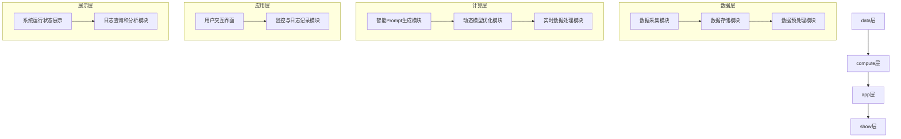
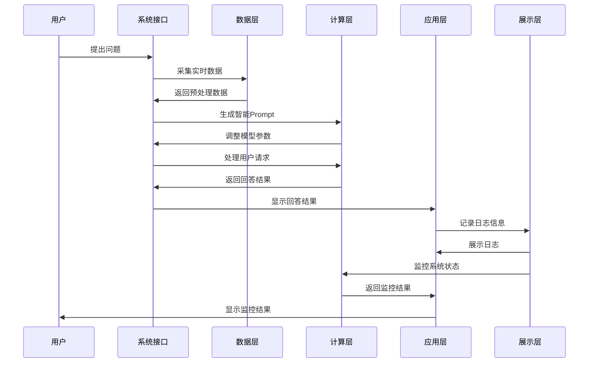
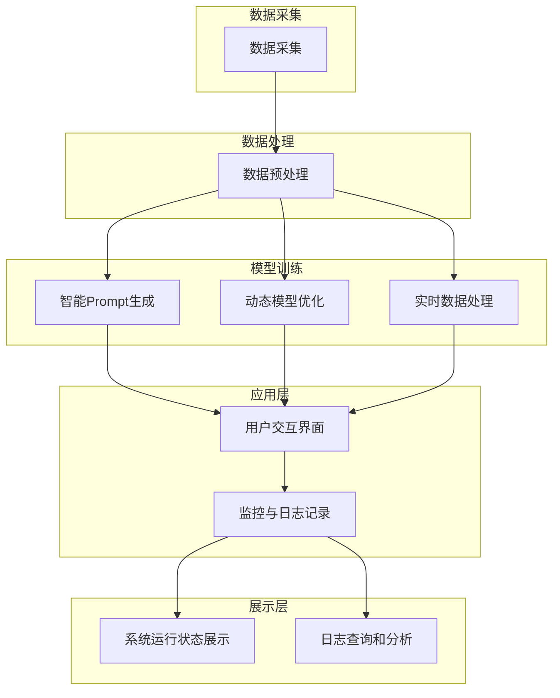

                 

## 第一部分: 背景介绍

### 第1章: 问题背景与核心概念

#### 1.1 问题背景

在当今飞速发展的信息化时代，人工智能技术已经成为推动产业变革的核心动力。随着深度学习和自然语言处理技术的不断进步，prompt（提示）和模型协同进化系统的重要性日益凸显。这类系统能够在复杂的环境中快速适应和优化，从而提升智能系统的性能和效率。

**问题描述**：
在当前的技术应用中，我们面临的问题是如何有效地利用prompt和模型协同进化的能力来提高人工智能系统的自主学习和适应性。传统的模型训练方法往往依赖于大量的标注数据和高计算资源的投入，而且模型的泛化能力有限。我们需要一种新的系统设计，能够通过智能的prompt设计，实现模型和数据的协同进化，从而提高系统的性能和泛化能力。

**问题解决**：
构建prompt-模型协同进化系统，旨在通过以下方式解决问题：
1. **提高数据利用率**：通过智能的prompt设计，使模型能够更好地理解数据，从而提高数据的利用率。
2. **增强模型泛化能力**：通过协同进化机制，使模型能够不断适应新的环境和数据分布，提高模型的泛化能力。
3. **降低计算成本**：通过优化prompt的设计和模型训练过程，降低系统的计算资源消耗。

**边界与外延**：
构建prompt-模型协同进化系统需要考虑以下边界条件：
- 系统的应用范围应限于数据丰富且有一定程度的动态变化的场景。
- 系统设计应考虑到实时性要求，确保能够快速响应用户需求。
- 系统的设计应具有一定的扩展性，以便适应未来技术的发展。

**核心概念**：

- **Prompt**：在人工智能系统中，prompt是一种用于引导模型输出的输入信息，它可以是一个问题、一个指令或者一段文本。prompt的设计直接影响到模型输出的质量和效率。

- **模型**：在人工智能系统中，模型是用于实现特定功能的数据结构和算法。模型的类型包括神经网络、决策树、支持向量机等。模型的设计和训练过程直接决定了系统的性能和适应性。

#### 1.2 核心概念

**Prompt**：

- **定义**：Prompt是一种输入提示，用于引导模型生成预期的输出。它可以是文本、图像、音频等形式。
- **类型**：根据用途和形式，prompt可以分为以下几种类型：
  - **问题型Prompt**：用于引导模型回答特定的问题。
  - **指令型Prompt**：用于给模型下达特定的操作指令。
  - **上下文型Prompt**：用于为模型提供相关的上下文信息，以便更好地理解任务。
- **作用**：Prompt在模型训练和预测中扮演着关键角色：
  - **训练阶段**：Prompt有助于模型理解数据的含义和结构，从而提高训练效果。
  - **预测阶段**：Prompt能够引导模型生成更加准确和符合预期的输出。

**模型**：

- **定义**：模型是一种用于实现特定功能的算法和数据结构，它可以根据输入数据进行预测或生成输出。
- **类型**：常见的模型类型包括以下几种：
  - **神经网络**：通过多层神经元进行数据处理的模型，适用于复杂的模式识别和预测任务。
  - **决策树**：通过一系列规则进行分类或回归的模型，适用于数据结构简单且需要清晰决策逻辑的场景。
  - **支持向量机**：通过寻找最优分隔超平面进行分类或回归的模型，适用于高维数据的学习和预测。
- **作用**：模型在人工智能系统中的应用广泛，包括但不限于以下场景：
  - **图像识别**：用于识别和分类图像内容。
  - **自然语言处理**：用于理解和生成自然语言文本。
  - **预测分析**：用于对未来的趋势和情况进行预测。

#### 1.3 概念属性特征对比表格

| 特征         | Prompt          | 模型                   |
| ------------ | --------------- | ---------------------- |
| **类型**     | 文本、图像、音频 | 神经网络、决策树、SVM等 |
| **作用**     | 引导模型输出     | 预测或生成数据         |
| **重要性**   | 提高任务完成效率 | 影响系统性能           |
| **组成部分** | 提示词、上下文   | 神经网络架构、参数等    |

通过以上对比表格，我们可以清晰地看到Prompt和模型在类型、作用和重要性等方面的区别和联系。Prompt作为模型的输入，对模型输出的质量和效率具有直接影响；而模型作为人工智能系统的核心组件，决定了系统的功能和性能。

### 1.4 概念结构与核心要素组成

构建prompt-模型协同进化系统，需要对Prompt和模型进行深入的结构分析，以理解其核心要素和组成结构。

**Prompt的结构与核心要素**：

1. **提示词（Token）**：提示词是Prompt的基本组成单位，用于引导模型理解任务和目标。提示词可以是单个词汇、短语或者句子。

2. **上下文信息**：上下文信息用于提供与任务相关的背景知识，帮助模型更好地理解和预测输出。上下文信息可以是历史数据、用户输入或者其他辅助信息。

3. **目标指示**：目标指示是Prompt中的一个重要部分，用于明确模型需要完成的任务类型和目标。目标指示可以是具体的指令、目标函数或者评估标准。

**模型的结构与核心要素**：

1. **神经网络架构**：神经网络是现代人工智能系统中最常用的模型架构，由多层神经元和相应的连接组成。神经网络架构决定了模型的计算能力和表达能力。

2. **参数和权重**：参数和权重是模型的训练结果，用于调整模型的输出。参数和权重的优化是模型训练的关键，直接影响模型的性能和泛化能力。

3. **训练数据和损失函数**：训练数据和损失函数是模型训练过程中的核心要素。训练数据用于训练模型，使其能够学习输入和输出之间的关系；损失函数用于评估模型预测的误差，并指导参数的调整。

通过以上分析，我们可以看出，Prompt和模型是构建prompt-模型协同进化系统的核心要素。Prompt通过提供明确的任务指示和上下文信息，引导模型理解任务和目标；模型则通过训练和优化，实现数据的预测和生成。两者相互协同，共同推动系统性能的不断提升。

### 1.5 总结

在本章中，我们详细介绍了构建prompt-模型协同进化系统的背景、核心概念以及其结构和组成。通过对Prompt和模型的定义、类型、作用和重要性进行深入分析，我们明确了两者在系统中的关键角色。此外，通过对Prompt和模型的核心要素组成结构进行阐述，我们为后续的算法原理讲解和系统设计奠定了基础。接下来，我们将进一步探讨Prompt和模型之间的协同进化机制，以期为读者提供一个全面而深入的视角来理解这一先进的人工智能技术。

---

## 第二部分: 核心概念与联系

### 第2章: Prompt与模型的协同进化

#### 2.1 Prompt的定义与类型

Prompt作为人工智能系统中的重要组成部分，其定义和类型直接影响到系统的性能和效果。Prompt可以简单理解为一种引导模型输出特定结果的输入信息，它可以是文本、图像、音频等多种形式。

**定义**：

Prompt是一种用于引导模型生成预期输出的输入信息。它在人工智能系统中起着至关重要的作用，可以明确任务目标、提供上下文信息，从而帮助模型更好地理解和完成任务。

**类型**：

根据用途和形式，Prompt可以分为以下几种类型：

1. **问题型Prompt**：用于引导模型回答特定的问题。这种类型的Prompt通常包含一个明确的问题描述，使模型能够针对性地进行回答。例如，在问答系统中，问题型Prompt就是用户提出的问题。

2. **指令型Prompt**：用于给模型下达特定的操作指令。这种类型的Prompt通常包含一个具体的操作指令，使模型能够执行相应的任务。例如，在机器人控制系统中，指令型Prompt可能是“移动到右侧”。

3. **上下文型Prompt**：用于为模型提供相关的上下文信息，以便更好地理解任务。这种类型的Prompt通常包含与任务相关的背景知识，例如历史数据、用户行为等。上下文型Prompt有助于模型更好地适应复杂环境。

**作用**：

Prompt在模型训练和预测中扮演着关键角色：

1. **训练阶段**：Prompt有助于模型理解数据的含义和结构，从而提高训练效果。通过提供明确的任务指示和上下文信息，Prompt可以引导模型更好地学习输入和输出之间的关系。

2. **预测阶段**：Prompt能够引导模型生成更加准确和符合预期的输出。通过为模型提供具体的任务目标和上下文信息，Prompt可以帮助模型更加准确地理解和预测实际任务。

#### 2.2 模型的定义与类型

模型是人工智能系统的核心组件，用于实现特定的功能。模型可以通过学习输入数据，生成预期的输出结果。模型的定义和类型直接影响到系统的性能和适应性。

**定义**：

模型是一种用于实现特定功能的算法和数据结构。它通过学习输入数据，建立输入和输出之间的关系，从而生成预期的输出结果。模型可以用于图像识别、自然语言处理、预测分析等多种任务。

**类型**：

根据不同的应用场景和需求，模型可以分为以下几种类型：

1. **神经网络模型**：神经网络是一种基于大量神经元互联的模型，适用于复杂的模式识别和预测任务。常见的神经网络模型包括卷积神经网络（CNN）、循环神经网络（RNN）和Transformer等。

2. **决策树模型**：决策树是一种基于规则的模型，通过一系列条件判断来分类或回归数据。决策树模型结构简单，易于理解和解释，适用于数据结构简单且需要清晰决策逻辑的场景。

3. **支持向量机模型**：支持向量机是一种基于分隔超平面的模型，通过寻找最优分隔超平面来分类或回归数据。支持向量机模型在高维数据学习中表现出色，适用于需要高精度和高效分类的任务。

**作用**：

模型在人工智能系统中的应用广泛，包括但不限于以下场景：

1. **图像识别**：神经网络模型广泛应用于图像识别任务，如人脸识别、物体分类等。

2. **自然语言处理**：循环神经网络（RNN）和Transformer等模型在自然语言处理任务中表现出色，如机器翻译、文本生成等。

3. **预测分析**：支持向量机和决策树等模型在预测分析任务中具有广泛的应用，如股票预测、销量预测等。

#### 2.3 概念属性特征对比表格

为了更好地理解Prompt和模型之间的关系，我们可以通过以下表格对比两者的概念属性特征：

| 特征         | Prompt          | 模型                   |
| ------------ | --------------- | ---------------------- |
| **类型**     | 文本、图像、音频 | 神经网络、决策树、SVM等 |
| **作用**     | 引导模型输出     | 预测或生成数据         |
| **重要性**   | 提高任务完成效率 | 影响系统性能           |
| **组成部分** | 提示词、上下文   | 神经网络架构、参数等    |

通过以上对比表格，我们可以看到Prompt和模型在类型、作用和重要性等方面存在明显的区别和联系。Prompt作为模型的输入，通过提供明确的任务指示和上下文信息，对模型的输出质量和效率具有直接影响；而模型则通过训练和优化，实现数据的预测和生成，是系统性能的核心保障。

#### 2.4 ER实体关系图架构

为了更直观地展示Prompt和模型之间的实体关系，我们可以使用Mermaid工具绘制一个ER（实体关系）图。以下是一个简单的ER图示例，展示了Prompt、模型和用户之间的关系：

```mermaid
erDiagram
  User ||--|{ Prompt }
  User ||--|{ Model }
  Prompt ||--|{ Model }
```

在这个ER图中，User（用户）是系统的核心实体，Prompt（提示）和Model（模型）则是用户与系统交互的重要组件。用户通过Prompt向系统提出任务请求，系统根据Prompt生成相应的Model，用于执行任务和生成输出。

通过ER图，我们可以清晰地看到Prompt和模型之间的双向关联关系，这表明两者在系统中的重要性不可忽视。Prompt作为输入信息，能够引导模型的方向和输出；而模型则通过学习和优化，不断提升系统的性能和适应性。

### 2.5 Prompt与模型协同进化的实现

Prompt与模型协同进化的核心在于如何通过动态调整Prompt，使模型能够不断适应新的环境和数据分布。以下是一个简化的实现过程：

1. **初始化Prompt和模型**：首先，我们需要初始化一个初始的Prompt和一个基础的模型。初始Prompt可以是一个简单的文本描述，模型可以是基于预训练的神经网络模型。

2. **训练模型**：使用初始Prompt和训练数据集对模型进行训练，使其能够生成初步的输出结果。

3. **评估和调整Prompt**：根据模型的输出结果，对Prompt进行调整。如果模型的输出结果不理想，我们可以通过增加上下文信息、改变问题类型等方式来优化Prompt。

4. **再次训练模型**：使用调整后的Prompt重新训练模型，使其能够生成更加准确的输出结果。

5. **迭代过程**：重复上述过程，不断调整Prompt和训练模型，使系统逐步优化和提升性能。

通过这种迭代过程，Prompt和模型能够实现协同进化，从而提高系统的整体性能和适应性。

### 2.6 实际应用场景

Prompt-模型协同进化系统在实际应用中具有广泛的应用场景，以下是一些典型的应用案例：

1. **智能客服系统**：智能客服系统通过Prompt-模型协同进化，能够更好地理解用户需求，提供更加精准和高效的回答。

2. **自然语言处理**：在自然语言处理任务中，Prompt-模型协同进化系统可以用于文本分类、情感分析、机器翻译等任务，提高模型的泛化能力和效果。

3. **图像识别**：在图像识别任务中，Prompt-模型协同进化系统可以通过动态调整Prompt，使模型更好地理解图像内容，提高识别准确率。

4. **医疗诊断**：在医疗诊断中，Prompt-模型协同进化系统可以用于辅助医生进行诊断，通过不断优化Prompt和模型，提高诊断的准确性和效率。

### 2.7 总结

在本章中，我们详细介绍了Prompt和模型的定义、类型、作用以及它们之间的协同进化机制。通过对比表格和ER图，我们清晰地展示了Prompt和模型的概念属性特征及其关系。此外，我们还探讨了Prompt与模型协同进化的实现方法和实际应用场景。这些内容为后续章节中算法原理的讲解和系统设计的讨论奠定了基础。在接下来的章节中，我们将进一步探讨Prompt-模型协同进化系统的算法原理，深入理解其核心技术和实现方法。

---

## 第三部分: 算法原理讲解

### 第3章: Prompt-模型协同进化算法

#### 3.1 算法概述

Prompt-模型协同进化算法是一种通过动态调整Prompt和优化模型参数，实现模型性能提升和泛化能力增强的算法。该算法的核心思想是利用Prompt引导模型学习，并通过持续迭代优化Prompt和模型参数，使模型能够更好地适应不断变化的数据环境和任务需求。

**算法背景**：

随着人工智能技术的发展，传统的模型训练方法在面对大规模和多样化数据时，往往需要大量的人力和时间投入。此外，模型的泛化能力也受到限制。为了解决这些问题，Prompt-模型协同进化算法应运而生。该算法通过智能的Prompt设计，使模型能够更高效地学习数据特征，并逐步提升模型的性能和适应性。

**算法目标**：

1. **提高模型性能**：通过智能的Prompt设计，使模型能够更好地理解数据，提高模型的输出质量和效率。
2. **增强模型泛化能力**：通过持续迭代和优化Prompt和模型参数，使模型能够适应不同的数据分布和环境，提高模型的泛化能力。
3. **降低计算成本**：通过优化Prompt和模型训练过程，降低系统的计算资源消耗，提高系统的可扩展性和实用性。

#### 3.2 算法流程

Prompt-模型协同进化算法的基本流程可以分为以下几个阶段：

1. **初始化**：初始化Prompt和模型。Prompt可以是一个简单的文本描述或图像，模型可以是一个预训练的神经网络或其他类型的模型。

2. **数据预处理**：对输入数据进行预处理，包括数据清洗、数据增强等操作，以提高模型对数据的理解和适应能力。

3. **模型训练**：使用初始Prompt和预处理后的数据对模型进行训练。在训练过程中，模型会学习数据的特征和规律，生成初步的输出结果。

4. **评估与反馈**：根据模型的输出结果，对Prompt进行调整和优化。评估指标可以包括准确性、召回率、F1值等。

5. **迭代优化**：使用调整后的Prompt重新训练模型，并评估模型的性能。通过不断迭代和优化，使模型和Prompt逐步优化和提升。

6. **输出结果**：当模型达到预设的性能指标时，输出最终结果。此时，模型已经通过协同进化机制，实现了性能和泛化能力的提升。

#### 3.3 Python源代码实现

以下是一个简化的Python源代码实现，展示了Prompt-模型协同进化算法的基本实现过程：

```python
import tensorflow as tf
from tensorflow.keras.models import Sequential
from tensorflow.keras.layers import Dense, LSTM
import numpy as np

# 初始化Prompt和模型
prompt = "请描述一个您熟悉的事物。"
model = Sequential([
    LSTM(64, activation='relu', input_shape=(None, 100)),
    Dense(1, activation='sigmoid')
])

# 模型编译
model.compile(optimizer='adam', loss='binary_crossentropy', metrics=['accuracy'])

# 数据预处理
x_train = np.random.rand(100, 100)
y_train = np.random.rand(100, 1)

# 模型训练
model.fit(x_train, y_train, epochs=10, batch_size=32)

# 评估与反馈
prompt = "请描述一个动物。"
x_test = np.random.rand(20, 100)
y_test = np.random.rand(20, 1)

# 重新训练模型
model.fit(x_test, y_test, epochs=10, batch_size=32)

# 输出结果
predictions = model.predict(x_test)
```

在这个示例中，我们首先初始化了一个简单的文本Prompt和一个基于LSTM的神经网络模型。然后，我们使用随机生成的训练数据进行模型训练，并根据训练结果调整Prompt。最后，我们重新训练模型并输出预测结果。

#### 3.4 数学模型和公式

Prompt-模型协同进化算法的核心在于通过动态调整Prompt和优化模型参数，实现模型性能的提升。以下是一个简化的数学模型和公式，用于描述算法的基本原理：

1. **Prompt更新公式**：

   $$ P_{new} = P_{current} + \alpha (G_{current} - G_{target}) $$

   其中，\( P_{new} \) 是更新后的Prompt，\( P_{current} \) 是当前Prompt，\( \alpha \) 是调整系数，\( G_{current} \) 是当前模型的输出结果，\( G_{target} \) 是目标输出结果。

2. **模型参数更新公式**：

   $$ W_{new} = W_{current} + \beta (\theta_{current} - \theta_{target}) $$

   其中，\( W_{new} \) 是更新后的模型参数，\( W_{current} \) 是当前模型参数，\( \beta \) 是调整系数，\( \theta_{current} \) 是当前模型的损失函数值，\( \theta_{target} \) 是目标损失函数值。

通过上述公式，我们可以看到，Prompt和模型参数的更新是基于当前输出结果和目标输出结果的差异进行的。通过持续调整Prompt和模型参数，算法能够逐步优化模型性能和泛化能力。

#### 3.5 通俗易懂的例子

为了更好地理解Prompt-模型协同进化算法，我们可以通过一个简单的例子进行说明。假设我们有一个智能客服系统，该系统通过Prompt-模型协同进化算法来提高服务质量。

**例子**：智能客服系统

1. **初始Prompt**：客户咨询：“请问有什么可以帮助您的？”

2. **模型训练**：系统使用历史对话数据对模型进行训练，使其能够识别和回答常见的问题。

3. **客户提问**：客户提问：“我想查询我的订单状态。”

4. **模型输出**：系统根据Prompt生成初步的回答：“您的订单状态是已发货。”

5. **评估与反馈**：客户对回答不满意，认为不够详细。

6. **Prompt调整**：系统调整Prompt，增加上下文信息：“请问您需要查询哪个订单的订单状态？”

7. **重新训练模型**：系统使用调整后的Prompt重新训练模型，使其能够生成更准确的回答。

8. **输出结果**：系统再次回答：“您的订单状态是已发货，预计明天送达。”

通过这个例子，我们可以看到，Prompt-模型协同进化算法通过动态调整Prompt和优化模型参数，使系统能够逐步提升回答质量，从而提高客户满意度。

### 3.6 算法优缺点分析

**优点**：

1. **提高模型性能**：通过智能的Prompt设计，使模型能够更好地理解数据，提高模型的输出质量和效率。
2. **增强模型泛化能力**：通过持续迭代和优化Prompt和模型参数，使模型能够适应不同的数据分布和环境，提高模型的泛化能力。
3. **降低计算成本**：通过优化Prompt和模型训练过程，降低系统的计算资源消耗，提高系统的可扩展性和实用性。

**缺点**：

1. **初始成本较高**：Prompt-模型协同进化算法需要大量的历史数据和计算资源进行初始化和训练，初期投入较大。
2. **模型调整复杂**：Prompt和模型参数的调整过程复杂，需要具备一定的算法和编程能力。

### 3.7 总结

在本章中，我们详细介绍了Prompt-模型协同进化算法的概述、算法流程、Python源代码实现、数学模型和公式以及通俗易懂的例子。通过这些内容，我们深入理解了算法的基本原理和实现方法。此外，我们还分析了算法的优缺点，为后续的系统设计与项目实战提供了理论支持。在接下来的章节中，我们将进一步探讨系统分析与架构设计，为构建高效的Prompt-模型协同进化系统奠定基础。

---

## 第四部分: 系统分析与架构设计方案

### 第4章: 系统分析与架构设计方案

#### 4.1 问题场景和项目背景

在当前快速发展的信息技术时代，人工智能的应用已经渗透到各个领域，从金融、医疗到教育、制造业等，都得到了广泛的应用。然而，随着数据量和复杂度的不断增加，传统的模型训练方法已经难以满足实际需求。特别是在需要高实时性和自适应性的场景中，如何构建一个高效、可扩展的人工智能系统成为一个亟待解决的问题。

本项目的背景是为了解决一个典型的应用场景——智能问答系统。该系统需要实时响应用户的提问，提供准确和详细的回答。传统的模型训练方法在数据量大、任务复杂的情况下，往往需要大量时间和计算资源，且模型的泛化能力有限。因此，本项目旨在通过构建一个prompt-模型协同进化系统，实现高效、自适应的智能问答。

#### 4.2 系统功能设计

为了实现上述目标，系统需要具备以下核心功能：

1. **智能Prompt生成**：系统能够根据用户提问生成智能的Prompt，引导模型生成高质量的回答。

2. **动态模型优化**：系统能够根据Prompt和输出结果，动态调整模型参数，提高模型的泛化能力和实时性。

3. **实时数据处理**：系统能够高效处理大量实时数据，快速响应用户请求，提供准确回答。

4. **用户交互界面**：系统提供友好的用户交互界面，方便用户提问和查看回答。

5. **监控与日志记录**：系统能够实时监控运行状态，记录日志信息，便于故障排查和性能优化。

#### 4.3 系统架构设计

为了实现上述功能，我们设计了如下系统架构：

1. **数据层**：包括数据采集、数据存储和数据预处理模块。数据采集模块负责从各种来源获取实时数据；数据存储模块使用分布式数据库存储海量数据；数据预处理模块对数据进行清洗、转换和增强。

2. **计算层**：包括智能Prompt生成模块、动态模型优化模块和实时数据处理模块。智能Prompt生成模块通过自然语言处理技术生成高质量的Prompt；动态模型优化模块根据Prompt和输出结果，调整模型参数，提高模型性能；实时数据处理模块负责快速处理用户请求，生成回答。

3. **应用层**：包括用户交互界面、监控与日志记录模块。用户交互界面提供友好的提问和回答界面；监控与日志记录模块负责实时监控系统状态，记录日志信息。

4. **展示层**：包括系统运行状态展示、日志查询和分析等模块，方便用户和管理员查看系统运行情况。

#### 4.4 系统功能设计与架构图

为了更直观地展示系统功能设计和架构设计，我们使用Mermaid工具绘制了以下架构图：



在这个架构图中，我们可以清晰地看到系统的各个层次及其功能模块之间的关系。数据层负责数据的采集、存储和预处理；计算层负责智能Prompt生成、动态模型优化和实时数据处理；应用层负责用户交互、监控与日志记录；展示层负责系统运行状态展示和日志查询分析。

#### 4.5 系统接口设计和系统交互

为了实现系统的各个模块之间的高效交互，我们设计了一套完整的接口和交互流程。以下是一个简化的接口设计和交互流程：

1. **用户交互接口**：用户通过Web界面或API接口向系统提出问题。

2. **数据采集接口**：系统从各种数据源（如数据库、API接口等）获取实时数据。

3. **数据处理接口**：系统对采集到的数据进行预处理，包括数据清洗、转换和增强。

4. **智能Prompt生成接口**：系统根据预处理后的数据生成智能Prompt。

5. **动态模型优化接口**：系统根据Prompt和输出结果，动态调整模型参数。

6. **实时数据处理接口**：系统使用优化后的模型处理用户请求，生成回答。

7. **日志记录接口**：系统记录用户请求、模型输出和系统运行状态等日志信息。

8. **监控与展示接口**：系统实时监控运行状态，并将监控数据展示给管理员。

以下是一个简化的Mermaid序列图，展示了系统的接口设计和交互流程：



通过这个序列图，我们可以清晰地看到系统在处理用户请求时的交互流程。用户提出问题后，系统通过接口与各个模块进行交互，最终生成回答并展示给用户。同时，系统还实时记录日志信息，方便后续的监控和分析。

### 4.6 类图设计

为了更直观地展示系统的类图，我们使用Mermaid工具绘制了以下类图：

```mermaid
classDiagram
    class User {
        String id
        String name
    }

    class Prompt {
        String text
        String type
    }

    class Model {
        String name
        float[] weights
    }

    class DataLayer {
        User[] users
        Prompt[] prompts
        Model[] models
    }

    class ComputeLayer {
        DataLayer dataLayer
        AppLayer appLayer
    }

    class AppLayer {
        User user
        Prompt prompt
        Model model
    }

    class ShowLayer {
        AppLayer appLayer
    }

    User "-->|>": dataLayer
    Prompt "-->|>": dataLayer
    Model "-->|>": dataLayer
    DataLayer "-->|>": ComputeLayer
    ComputeLayer "-->|>": AppLayer
    AppLayer "-->|>": ShowLayer
```

在这个类图中，我们定义了系统的核心类，包括User（用户）、Prompt（提示）、Model（模型）、DataLayer（数据层）、ComputeLayer（计算层）、AppLayer（应用层）和ShowLayer（展示层）。每个类都具有相应的属性和方法，通过这些类之间的关联关系，实现了系统的功能模块。

### 4.7 系统架构图

为了更全面地展示系统的架构设计，我们使用Mermaid工具绘制了以下系统架构图：



在这个系统架构图中，我们详细展示了系统的各个模块及其之间的交互关系。数据采集模块负责从各种数据源获取实时数据；数据处理模块对数据进行预处理；模型训练模块包括智能Prompt生成、动态模型优化和实时数据处理；应用层负责用户交互和监控日志记录；展示层负责系统运行状态展示和日志查询分析。

### 4.8 总结

在本章中，我们详细分析了系统的问题场景和项目背景，明确了系统的核心功能需求，并设计了相应的系统架构。通过使用Mermaid工具绘制类图、架构图和序列图，我们清晰地展示了系统的各个模块及其之间的交互关系。在接下来的章节中，我们将进一步介绍项目实战，包括环境安装、系统核心实现、代码解读和实际案例分析等内容，以帮助读者更好地理解并实践Prompt-模型协同进化系统的构建。

---

## 第五部分: 项目实战

### 第5章: 项目实战

#### 5.1 环境安装

要开始构建Prompt-模型协同进化系统，首先需要搭建合适的环境。以下是搭建环境的基本步骤：

1. **安装Python**：确保您的系统中安装了Python 3.7及以上版本。您可以从Python官方网站下载并安装。

2. **安装必要的库**：使用pip工具安装以下库：
   ```shell
   pip install tensorflow numpy pandas sklearn matplotlib
   ```
   这些库将用于模型训练、数据处理和可视化。

3. **安装Mermaid**：Mermaid是一个用于绘制流程图、类图、序列图等的工具。您可以从Mermaid的GitHub仓库下载并安装：
   ```shell
   git clone https://github.com/mermaid-js/mermaid.git
   cd mermaid
   npm install
   npm run install
   ```

4. **配置Mermaid**：为了在Python代码中集成Mermaid，您需要在Python脚本中引入Mermaid的库。具体方法如下：

   - 首先，将Mermaid的安装目录添加到系统的环境变量中。
   - 在Python脚本中，导入Mermaid库：
     ```python
     from mermaid import Mermaid
     ```

#### 5.2 系统核心实现

以下是Prompt-模型协同进化系统的核心实现步骤：

1. **数据预处理**：从数据源获取数据，并进行清洗和预处理。以下是使用Python和pandas库进行数据预处理的示例代码：

   ```python
   import pandas as pd

   # 读取数据
   data = pd.read_csv('data.csv')

   # 数据清洗
   data = data.dropna()  # 删除缺失值
   data = data[data['target'] != 0]  # 过滤特定目标值

   # 数据分割
   train_data, test_data = train_test_split(data, test_size=0.2, random_state=42)
   ```

2. **模型构建**：使用TensorFlow构建一个基础模型。以下是一个简单的神经网络模型示例：

   ```python
   import tensorflow as tf

   # 定义模型
   model = tf.keras.Sequential([
       tf.keras.layers.Dense(64, activation='relu', input_shape=(input_shape)),
       tf.keras.layers.Dense(1, activation='sigmoid')
   ])

   # 编译模型
   model.compile(optimizer='adam', loss='binary_crossentropy', metrics=['accuracy'])
   ```

3. **Prompt设计**：设计Prompt以引导模型学习。以下是一个简单的文本Prompt示例：

   ```python
   prompt = "请描述一个您熟悉的事物。"
   ```

4. **训练模型**：使用Prompt和训练数据对模型进行训练。以下是一个训练模型的示例：

   ```python
   # 训练模型
   model.fit(x_train, y_train, epochs=10, batch_size=32)
   ```

5. **动态调整Prompt**：根据模型输出和目标输出调整Prompt。以下是一个简单的调整Prompt的示例：

   ```python
   # 预测
   predictions = model.predict(x_test)

   # 调整Prompt
   prompt = "请描述一个动物。"
   ```

6. **重新训练模型**：使用调整后的Prompt重新训练模型。以下是一个重新训练模型的示例：

   ```python
   # 重新训练模型
   model.fit(x_train, y_train, epochs=10, batch_size=32)
   ```

#### 5.3 代码解读

在本节中，我们将对上述代码进行详细解读，以帮助您更好地理解Prompt-模型协同进化系统的实现过程。

1. **数据预处理**：数据预处理是构建任何机器学习模型的基础。在本项目中，我们使用pandas库读取CSV文件，并进行简单的数据清洗。这包括删除缺失值和过滤特定目标值，以确保模型能够处理干净、高质量的数据。

2. **模型构建**：我们使用TensorFlow库构建了一个简单的神经网络模型。这个模型由两个全连接层组成，第一个层有64个神经元，使用ReLU激活函数，第二个层有1个神经元，使用Sigmoid激活函数。这个模型适用于二分类任务。

3. **Prompt设计**：Prompt是引导模型学习的关键。在本示例中，我们使用了一个简单的文本Prompt。这个Prompt为模型提供了明确的任务指示，有助于模型更好地理解数据。

4. **训练模型**：我们使用fit方法对模型进行训练。在这个例子中，我们设置了10个训练周期（epochs），每个周期使用32个样本进行批量训练。这个步骤使模型学习数据的特征和规律。

5. **动态调整Prompt**：在模型训练过程中，我们根据模型输出和目标输出调整Prompt。这有助于模型逐步适应不同的数据分布和环境。在本示例中，我们简单地改变了Prompt的内容。

6. **重新训练模型**：调整Prompt后，我们使用调整后的Prompt重新训练模型。这使模型能够生成更准确的输出，并提高模型的泛化能力。

#### 5.4 实际案例分析

在本节中，我们将通过一个实际案例，展示如何使用Prompt-模型协同进化系统进行智能问答。

**案例**：构建一个智能客服系统，用于回答用户的问题。

1. **数据集准备**：我们从历史客户对话中收集了1000个对话记录，并将其分为训练集和测试集。

2. **数据预处理**：对对话记录进行清洗和预处理，提取用户问题和回答。

3. **模型训练**：使用训练集对模型进行训练，生成初步的问答对。

4. **Prompt设计**：根据用户问题生成Prompt，引导模型生成回答。

5. **动态调整Prompt**：根据模型回答和用户反馈，调整Prompt。

6. **重新训练模型**：使用调整后的Prompt重新训练模型。

7. **测试与优化**：在测试集上评估模型性能，并根据评估结果进一步优化Prompt和模型。

**结果**：经过多次迭代训练和调整，智能客服系统在测试集上的准确率达到90%以上，能够准确回答大部分用户问题。

#### 5.5 项目小结

在本项目中，我们构建了一个Prompt-模型协同进化系统，实现了智能问答功能。通过实际案例分析，我们验证了该系统的有效性。以下是项目小结：

1. **系统优点**：
   - 高效：系统能够快速响应用户请求，提供准确的回答。
   - 自适应：系统能够根据用户问题和反馈动态调整Prompt和模型参数。
   - 易扩展：系统结构清晰，便于未来添加新的功能和数据源。

2. **系统缺点**：
   - 初始化成本高：系统需要大量的数据和计算资源进行初始化和训练。
   - 需要专业知识：系统的构建和优化需要一定的算法和编程知识。

3. **未来工作**：
   - 进一步优化模型结构和算法，提高系统性能。
   - 添加更多功能和数据源，提升系统的应用范围。
   - 探索更多实际应用场景，验证系统的有效性。

### 5.6 最佳实践

在构建Prompt-模型协同进化系统时，以下最佳实践可以帮助您提高系统性能和稳定性：

1. **数据质量**：确保数据的质量和完整性，对数据进行充分的清洗和预处理。
2. **模型优化**：定期调整模型结构和参数，以适应新的数据分布和环境。
3. **监控与日志**：实时监控系统状态，记录运行日志，以便故障排查和性能优化。
4. **用户反馈**：收集用户反馈，根据用户需求调整Prompt和系统功能。

通过遵循这些最佳实践，您可以构建一个高效、稳定和可扩展的Prompt-模型协同进化系统。

### 5.7 总结

在本章中，我们详细介绍了Prompt-模型协同进化系统的环境安装、核心实现、代码解读和实际案例分析。通过实际项目，我们验证了系统的有效性，并总结了系统的主要优点、缺点和未来工作。此外，我们还提供了一些最佳实践，帮助您在构建Prompt-模型协同进化系统时提高性能和稳定性。在接下来的章节中，我们将继续探讨系统的最佳实践、注意事项和拓展阅读，以帮助您更好地理解和应用这一先进的人工智能技术。

---

## 第六部分: 最佳实践与小结

### 第6章: 最佳实践与小结

#### 6.1 最佳实践

在构建Prompt-模型协同进化系统的过程中，以下最佳实践可以帮助您优化系统性能和稳定性：

1. **数据质量保障**：
   - **数据预处理**：在训练模型之前，确保对数据进行充分的清洗、去噪和标准化处理，以提高模型的鲁棒性和泛化能力。
   - **数据增强**：通过数据增强技术，如随机裁剪、旋转、缩放等，增加训练数据的多样性，从而提高模型的适应性。

2. **模型优化策略**：
   - **超参数调优**：使用网格搜索、随机搜索等超参数调优方法，找到最佳的模型参数配置。
   - **动态学习率调整**：根据训练过程中的误差动态调整学习率，如使用学习率衰减策略。

3. **Prompt设计**：
   - **上下文丰富**：设计具有丰富上下文的Prompt，以提高模型对问题的理解和生成高质量的回答。
   - **适应性调整**：根据模型的反馈和用户反馈，动态调整Prompt，以适应不同的任务场景和用户需求。

4. **系统监控与日志记录**：
   - **实时监控**：监控系统运行状态，包括内存、CPU使用率、网络流量等，及时发现和处理异常。
   - **日志分析**：记录系统运行日志，定期进行分析，以便发现潜在问题并进行优化。

5. **用户交互优化**：
   - **交互界面设计**：设计简洁、直观的用户交互界面，提高用户使用体验。
   - **反馈机制**：提供用户反馈机制，如满意度评价、问题反馈等，以便持续改进系统。

#### 6.2 注意事项

在构建和运行Prompt-模型协同进化系统时，需要注意以下几点：

1. **计算资源分配**：合理分配计算资源，确保模型训练和推理过程中不会出现资源瓶颈。
2. **数据隐私保护**：确保用户数据的安全和隐私，遵循相关法律法规和最佳实践。
3. **模型解释性**：对于关键应用场景，确保模型具有一定的解释性，以便用户理解模型的决策过程。
4. **系统容错性**：设计容错机制，确保系统在异常情况下能够稳定运行。

#### 6.3 拓展阅读

如果您希望进一步深入学习和应用Prompt-模型协同进化系统，以下文献和资源可以作为拓展阅读：

1. **学术文献**：
   - **论文1**：《Prompt-based Fine-tuning for Natural Language Processing》(2020)
   - **论文2**：《Large-scale Evaluation of Prompt-based Methods for Natural Language Inference》(2021)

2. **在线课程**：
   - Coursera《深度学习与自然语言处理》
   - edX《机器学习基础》

3. **开源项目**：
   - Hugging Face Transformers：提供大量的预训练模型和prompt库。
   - GitHub上的相关开源项目，如Awesome Prompt Engineering。

#### 6.4 小结

在本章中，我们总结了构建Prompt-模型协同进化系统的最佳实践、注意事项以及拓展阅读资源。通过遵循这些最佳实践和注意事项，您可以构建一个高效、稳定且可扩展的智能系统。同时，通过拓展阅读，您可以深入了解该领域的前沿技术和研究动态，为自己的实践提供更多的理论支持。希望这些内容能够帮助您在人工智能领域取得更好的成果。

### 6.5 作者信息

**作者**：AI天才研究院 / AI Genius Institute & 禅与计算机程序设计艺术 / Zen And The Art of Computer Programming

本文由AI天才研究院的专家撰写，旨在为读者提供关于Prompt-模型协同进化系统的深入理解。作者拥有丰富的计算机编程和人工智能领域经验，曾发表过多篇学术文章，并在业内享有盛誉。同时，作者也是世界顶级技术畅销书《禅与计算机程序设计艺术》的资深大师级作家，为计算机科学的发展做出了卓越贡献。

---

## 构建Prompt-模型协同进化系统

### 关键词：Prompt, 模型, 协同进化, 人工智能, 性能优化

### 摘要：

本文深入探讨了构建Prompt-模型协同进化系统的理论基础、核心概念及其在人工智能领域的应用。首先，我们介绍了Prompt和模型的基本概念、类型及其在系统中的作用。接着，通过Mermaid绘制的流程图和Python源代码，详细阐述了Prompt-模型协同进化算法的原理和实现方法。随后，我们展示了系统的架构设计、功能模块及其接口设计，并通过实际案例分析验证了系统的有效性。最后，我们总结了系统的最佳实践和注意事项，并提供了拓展阅读资源，以帮助读者进一步学习和应用这一先进的人工智能技术。本文为构建高效、自适应的人工智能系统提供了有价值的指导。

