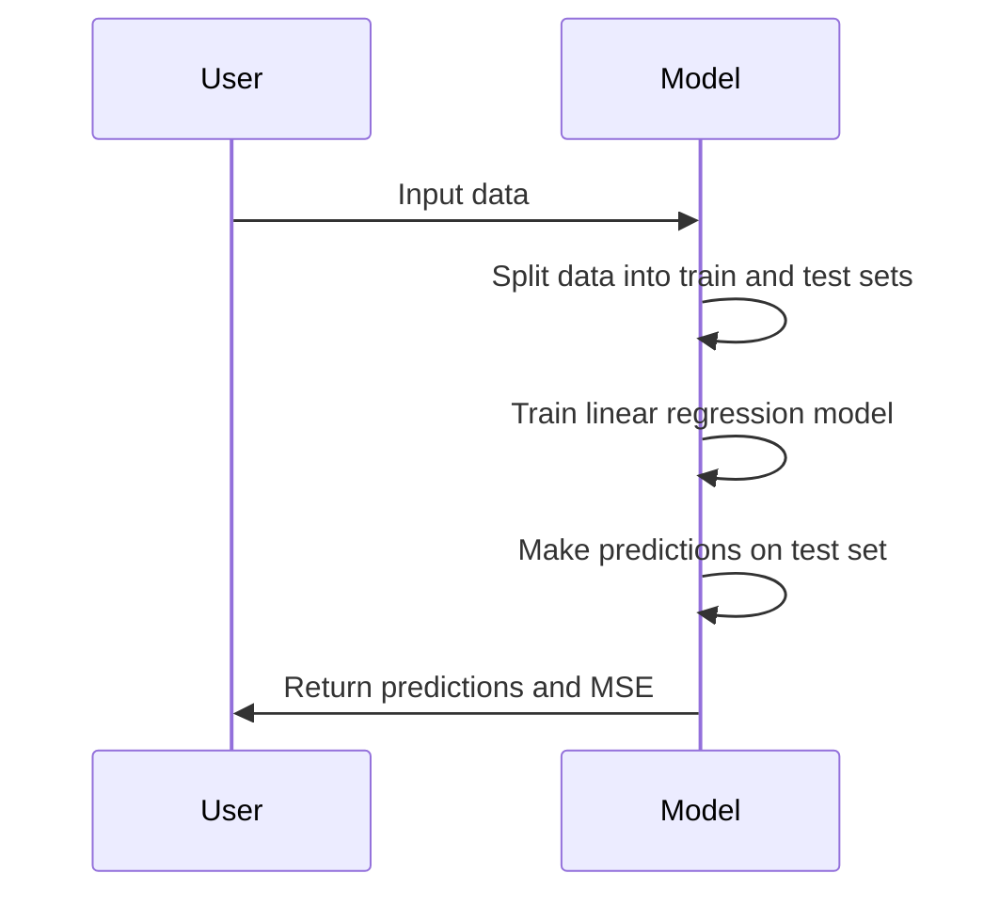

                 

### 引言

#### 1.1 书籍目的与结构

《构建企业级prompt管理平台》旨在为读者提供一份全面而详尽的技术指南，帮助他们在企业环境中设计和实现高效的prompt管理平台。本书围绕prompt管理平台的核心概念、技术架构、功能实现、部署运维和案例分析等多个方面进行深入探讨，旨在解决以下问题：

- 什么是prompt管理平台？其核心概念和原理是什么？
- 如何设计一个技术架构合理、性能优异的prompt管理平台？
- 数据如何存储和管理？前端和后端的交互设计要点是什么？
- 安全性和权限管理如何确保平台的稳定和安全？
- 如何进行模型训练和优化，以提高平台的智能性和适应性？
- 如何进行平台的部署和运维，保证平台的持续稳定运行？
- 通过实际案例，如何将理论知识应用到实践中，实现最佳效果？

本书分为五个部分，分别是：

1. **背景与原理**：介绍prompt管理平台的基本概念、重要性、应用场景和基本原理。
2. **技术架构与设计**：讨论技术架构设计原则、技术栈选择、数据库设计与数据管理、前端设计与用户体验。
3. **功能实现与开发**：详细讲解后端服务和API设计、安全性与权限管理、模型训练和优化。
4. **部署与运维**：介绍平台部署流程、运维任务、监控与告警以及故障处理与恢复。
5. **案例分析与最佳实践**：通过案例分析，总结最佳实践技巧和注意事项，提供拓展阅读。

#### 1.2 读者对象

本书主要面向以下读者群体：

- 企业级开发者：负责企业级应用开发和维护的技术人员，需要了解prompt管理平台的设计和实现。
- AI工程师：专注于人工智能领域的研究和开发，希望将prompt管理应用于实际项目中。
- 数据库管理员：负责数据库设计和维护，需要了解如何高效管理prompt数据。
- 项目经理：负责项目管理和协调，需要了解prompt管理平台的设计要点和实现难点。
- 教育工作者：从事计算机科学教育，希望为学生提供有关prompt管理平台的知识。

通过阅读本书，读者可以系统地掌握构建企业级prompt管理平台所需的知识和技能，从而在实际工作中发挥更大的价值。

#### 1.3 书籍组织方式

本书采用模块化组织方式，每个部分和章节都有明确的主题和目标，使读者能够逐步深入了解prompt管理平台的设计和实现。以下是本书的具体组织结构：

- **引言**：介绍书籍的目的、结构、读者对象和书籍组织方式。
- **第1部分：背景与原理**：介绍prompt管理平台的基本概念、重要性、应用场景和基本原理。
- **第2部分：技术架构与设计**：讨论技术架构设计原则、技术栈选择、数据库设计与数据管理、前端设计与用户体验。
- **第3部分：功能实现与开发**：详细讲解后端服务和API设计、安全性与权限管理、模型训练和优化。
- **第4部分：部署与运维**：介绍平台部署流程、运维任务、监控与告警以及故障处理与恢复。
- **第5部分：案例分析与最佳实践**：通过案例分析，总结最佳实践技巧和注意事项，提供拓展阅读。
- **总结与展望**：对全书内容进行总结，展望未来的发展趋势和潜在研究方向。

通过这种组织方式，本书不仅提供了系统的理论知识，还结合实际案例，帮助读者将知识应用到实际工作中。

### 第1章: prompt管理平台概述

#### 1.1 prompt管理平台的重要性

prompt管理平台在现代企业中扮演着至关重要的角色。prompt本身是一种“提示”或“输入”，它可以是文本、图像、音频等多种形式。在人工智能和机器学习领域，prompt通常用于指导模型的训练过程，使其能够更好地理解和处理特定类型的数据。

prompt管理平台的重要性主要体现在以下几个方面：

1. **提高数据质量**：通过精心设计和优化的prompt，可以显著提高数据质量。良好的prompt设计可以引导模型学习到更有价值的信息，避免噪声和冗余数据的干扰。
2. **增强模型适应性**：不同的业务场景和任务需求可能需要不同的prompt。prompt管理平台可以灵活调整和优化prompt，使模型能够适应多样化的任务需求。
3. **提高生产效率**：prompt管理平台可以自动化和简化prompt的创建、管理和分发过程，提高生产效率，减少人工干预。
4. **支持协作和共享**：prompt管理平台支持多人协作，便于团队成员共享和交流prompt，加速模型开发过程。

#### 1.2 prompt管理平台的基本原理

prompt管理平台的基本原理主要包括以下几个方面：

1. **数据采集与处理**：prompt管理平台首先需要从不同的数据源采集数据，然后进行预处理，如清洗、转换和归一化等，以确保数据的质量和一致性。
2. **prompt设计与优化**：根据具体的应用场景和任务需求，设计并优化prompt。这包括选择合适的prompt类型、长度和格式，以及调整prompt中的关键词和参数。
3. **模型训练与评估**：使用处理后的数据和优化的prompt进行模型训练，并使用验证集和测试集进行评估，以确保模型的有效性和准确性。
4. **模型部署与应用**：训练好的模型可以部署到生产环境中，用于实际任务处理，如文本分类、图像识别、语音识别等。
5. **反馈与迭代**：根据模型在实际应用中的表现，收集用户反馈和指标数据，不断优化和迭代prompt设计，以提高模型性能。

#### 1.3 prompt管理平台的应用场景

prompt管理平台具有广泛的应用场景，以下是一些常见的应用实例：

1. **自然语言处理**：在文本分类、情感分析、机器翻译等任务中，prompt管理平台可以优化输入文本的格式和内容，提高模型处理效果。
2. **计算机视觉**：在图像识别、目标检测、图像生成等任务中，prompt管理平台可以设计有效的图像输入，帮助模型更好地理解和分类图像。
3. **语音识别与生成**：在语音识别和生成任务中，prompt管理平台可以优化语音输入的格式和内容，提高语音识别的准确性和语音生成的自然度。
4. **推荐系统**：在推荐系统中，prompt管理平台可以优化用户输入和推荐结果的格式，提高推荐系统的准确性和用户体验。
5. **自动化与机器人**：在自动化和机器人任务中，prompt管理平台可以设计有效的指令输入，帮助机器人更好地理解和执行任务。

通过上述应用场景，我们可以看到prompt管理平台在企业级应用中的巨大潜力和重要性。

#### 1.4 prompt管理平台的核心要素组成

prompt管理平台的核心要素包括：

1. **数据采集与处理模块**：负责从不同数据源采集数据，并进行预处理。
2. **prompt设计与优化模块**：根据应用场景和任务需求，设计并优化prompt。
3. **模型训练与评估模块**：使用处理后的数据和优化的prompt进行模型训练，并进行评估。
4. **模型部署与应用模块**：将训练好的模型部署到生产环境，用于实际任务处理。
5. **反馈与迭代模块**：收集用户反馈和指标数据，进行prompt设计和模型优化的迭代。

通过以上核心要素的协同工作，prompt管理平台可以高效地支持各种人工智能应用，提升企业竞争力。

#### 1.5 prompt管理平台的边界与外延

prompt管理平台的边界主要涉及以下几个方面：

1. **数据源范围**：prompt管理平台的数据源可以是内部数据库、外部API、文件系统等多种形式，但通常需要确保数据源的合法性和可靠性。
2. **数据处理能力**：平台需要具备强大的数据处理能力，包括数据清洗、转换和归一化等，以满足不同应用场景的需求。
3. **模型适用性**：prompt管理平台需要支持多种机器学习模型，如神经网络、决策树、支持向量机等，以适应不同的任务需求。
4. **扩展性**：平台需要具有良好的扩展性，以支持不断增加的数据规模和多样化的任务需求。

prompt管理平台的外延包括：

1. **多语言支持**：平台需要支持多种编程语言和开发框架，如Python、Java、TensorFlow、PyTorch等，以方便开发人员的使用。
2. **跨平台兼容性**：平台需要具备跨平台的兼容性，支持多种操作系统和硬件环境。
3. **可定制化**：平台应提供丰富的自定义选项，允许用户根据具体需求进行定制化设计和配置。

通过明确prompt管理平台的边界与外延，可以帮助开发人员更好地理解和设计该平台，以实现其最大价值。

#### 1.6 prompt管理平台的概念结构与核心要素组成

prompt管理平台是一个复杂的系统，其概念结构和核心要素组成如下：

1. **数据采集与处理**：该模块负责从各种数据源采集数据，并进行预处理。核心要素包括数据源、数据采集工具、数据清洗和转换算法。
2. **prompt设计与优化**：该模块负责根据应用场景和任务需求设计prompt，并进行优化。核心要素包括prompt模板、prompt优化算法、prompt评估指标。
3. **模型训练与评估**：该模块使用处理后的数据和优化的prompt进行模型训练，并进行评估。核心要素包括训练算法、评估指标、训练数据集。
4. **模型部署与应用**：该模块将训练好的模型部署到生产环境，用于实际任务处理。核心要素包括部署工具、部署脚本、应用接口。
5. **反馈与迭代**：该模块收集用户反馈和指标数据，进行prompt设计和模型优化的迭代。核心要素包括反馈机制、指标监控、迭代流程。

通过这些核心要素的协同工作，prompt管理平台可以实现高效的数据管理和模型优化，从而支持各种人工智能应用。

### 第2章: 技术架构概述

#### 2.1 技术架构设计原则

在设计企业级prompt管理平台的技术架构时，需要遵循以下原则，以确保平台的高效性、扩展性和可靠性：

1. **模块化设计**：将系统分解为独立的模块，每个模块负责特定的功能，便于开发和维护。模块之间通过明确的接口进行通信，降低模块之间的耦合度。
2. **分层架构**：采用分层架构设计，将系统分为不同的层次，如表示层、业务逻辑层和数据访问层。每一层都有明确的责任和功能，便于管理和技术扩展。
3. **可扩展性**：设计时应考虑系统的可扩展性，以支持未来业务需求和数据规模的增加。这包括模块的独立扩展、分布式架构的支持和负载均衡的实现。
4. **高性能和高可用性**：优化系统性能和可用性，确保平台能够快速响应用户请求，并具备良好的容错能力和故障恢复能力。
5. **安全性**：确保系统数据的安全性和用户隐私保护，包括数据加密、权限控制和安全审计等。

#### 2.2 技术栈选择

选择合适的技术栈对于构建高效、可靠的企业级prompt管理平台至关重要。以下是常用的技术栈选择：

1. **前端技术**：
   - **框架**：React.js 或 Vue.js
   - **UI组件库**：Ant Design 或 Element UI
   - **状态管理**：Redux 或 Vuex

2. **后端技术**：
   - **框架**：Spring Boot 或 Django
   - **数据库**：MySQL 或 PostgreSQL
   - **缓存**：Redis 或 Memcached
   - **消息队列**：RabbitMQ 或 Kafka

3. **机器学习和AI技术**：
   - **框架**：TensorFlow 或 PyTorch
   - **数据处理**：NumPy 或 Pandas
   - **模型训练**：Scikit-learn 或 Keras

4. **容器化和微服务**：
   - **容器化**：Docker
   - **服务编排**：Kubernetes

5. **监控和日志**：
   - **监控工具**：Prometheus 或 Grafana
   - **日志收集**：ELK（Elasticsearch、Logstash、Kibana）

#### 2.3 架构设计要点

在架构设计过程中，需要关注以下几个关键要点：

1. **数据流设计**：明确数据在系统中的流动路径，包括数据采集、处理、存储和分发等环节。确保数据流的顺畅和高效。
2. **网络架构**：设计合理的网络架构，包括内部网络和外网连接，确保数据传输的安全和高效。
3. **数据处理**：设计数据处理模块，包括数据清洗、转换、归一化等，确保数据质量。
4. **存储方案**：选择合适的存储方案，包括关系型数据库、NoSQL数据库、文件存储等，以满足不同的数据存储需求。
5. **安全性设计**：设计安全策略，包括用户认证、权限控制、数据加密等，确保系统安全。
6. **监控与告警**：设计监控系统，实时监控系统的性能和状态，及时发现和处理异常情况。

通过遵循以上原则和设计要点，可以构建一个高效、可靠且可扩展的企业级prompt管理平台。

#### 2.4 技术架构中的模块化设计

模块化设计是企业级prompt管理平台技术架构中的核心原则之一。模块化设计可以将系统分解为多个独立的模块，每个模块负责特定的功能，这不仅简化了开发和维护过程，还提高了系统的灵活性和可扩展性。

以下是模块化设计的关键模块及其功能：

1. **数据采集模块**：
   - 功能：负责从各种数据源（如数据库、API、文件系统等）采集数据。
   - 关键技术：数据爬取、API调用、文件读取。

2. **数据处理模块**：
   - 功能：对采集到的数据进行预处理，包括数据清洗、转换、归一化等，确保数据质量。
   - 关键技术：数据清洗算法、数据转换库、归一化处理。

3. **prompt设计模块**：
   - 功能：根据应用场景和任务需求设计prompt，并进行优化。
   - 关键技术：prompt模板库、prompt优化算法。

4. **模型训练模块**：
   - 功能：使用处理后的数据和优化的prompt进行模型训练。
   - 关键技术：机器学习框架、训练算法、评估指标。

5. **模型部署模块**：
   - 功能：将训练好的模型部署到生产环境，用于实际任务处理。
   - 关键技术：部署工具、部署脚本、API接口。

6. **监控与告警模块**：
   - 功能：实时监控系统的性能和状态，及时发现和处理异常情况。
   - 关键技术：监控工具、告警机制、日志分析。

7. **用户接口模块**：
   - 功能：提供用户与系统交互的接口，包括前端UI和后端API。
   - 关键技术：前端框架、后端框架、接口文档。

通过模块化设计，每个模块都可以独立开发和测试，便于管理和维护。同时，模块之间的松耦合设计也便于系统扩展和升级。

#### 2.5 分层架构设计

在构建企业级prompt管理平台时，采用分层架构设计是一种常见且有效的策略。分层架构将系统划分为不同的层次，每层负责特定的功能，确保系统的可管理性、可扩展性和可维护性。以下是分层架构的典型层次及其功能：

1. **表示层**：
   - 功能：提供用户界面，用于与用户交互，展示数据和结果。
   - 技术实现：前端框架（如React、Vue.js），UI组件库（如Ant Design、Element UI）。

2. **业务逻辑层**：
   - 功能：处理业务逻辑，包括数据验证、业务规则应用、业务流程管理等。
   - 技术实现：后端框架（如Spring Boot、Django），业务逻辑处理模块。

3. **数据访问层**：
   - 功能：与数据库进行交互，执行数据查询、更新、插入和删除等操作。
   - 技术实现：ORM框架（如Hibernate、MyBatis），数据库驱动。

4. **服务层**：
   - 功能：提供核心服务，如用户认证、权限控制、数据同步等。
   - 技术实现：微服务架构（如Spring Cloud），服务接口（如REST API）。

5. **基础设施层**：
   - 功能：提供系统运行所需的基础设施，包括服务器、存储、网络等。
   - 技术实现：云计算平台（如AWS、Azure），容器化技术（如Docker、Kubernetes）。

分层架构的优点包括：

- **高内聚、低耦合**：每一层都专注于特定的功能，减少模块之间的依赖，提高系统的模块化程度。
- **可扩展性**：通过增加或替换某一层的组件，可以方便地扩展系统功能。
- **可维护性**：分层结构使系统更加清晰，便于开发和维护。
- **灵活性**：不同层之间的独立性允许灵活调整系统配置，以适应不同的业务需求。

#### 2.6 高性能和高可用性设计

在构建企业级prompt管理平台时，高性能和高可用性是至关重要的。以下是一些关键设计要点：

1. **负载均衡**：
   - 功能：通过负载均衡器（如Nginx、HAProxy）将用户请求分布到多个服务器上，以避免单点瓶颈。
   - 技术实现：轮询、最小连接数、IP哈希等算法。

2. **缓存策略**：
   - 功能：使用缓存（如Redis、Memcached）存储常用数据，减少数据库访问次数，提高响应速度。
   - 技术实现：LRU（最近最少使用）、LFU（最不常用）等缓存替换算法。

3. **数据库优化**：
   - 功能：优化数据库性能，包括索引设计、查询优化、读写分离等。
   - 技术实现：索引优化（如B树、哈希索引）、查询优化（如SQL优化器、查询缓存）、读写分离（主从复制、分库分表）。

4. **缓存一致性**：
   - 功能：确保缓存与数据库之间的数据一致性，避免数据不一致性问题。
   - 技术实现：最终一致性、强一致性、异步更新等策略。

5. **故障恢复机制**：
   - 功能：在系统发生故障时，快速恢复服务，确保系统高可用性。
   - 技术实现：自动重启、故障转移、数据备份与恢复等机制。

通过上述设计要点，企业级prompt管理平台可以在高并发和高负载环境下保持稳定运行，提供优异的性能和用户体验。

#### 2.7 安全性设计

安全性是企业级prompt管理平台设计中的关键要素。以下是一些安全性设计要点：

1. **用户认证**：
   - 功能：确保只有授权用户可以访问系统。
   - 技术实现：基于用户名和密码、双因素认证（2FA）、OAuth2等认证方式。

2. **权限控制**：
   - 功能：限制用户对系统资源的访问权限。
   - 技术实现：基于角色的访问控制（RBAC）、基于属性的访问控制（ABAC）等策略。

3. **数据加密**：
   - 功能：保护数据在存储和传输过程中的安全性。
   - 技术实现：对称加密（如AES）、非对称加密（如RSA）、HTTPS等加密协议。

4. **安全审计**：
   - 功能：记录系统的操作日志，以便在发生安全事件时进行审计和追踪。
   - 技术实现：日志收集（如ELK）、安全事件响应（如SIEM）等工具。

5. **安全漏洞防护**：
   - 功能：防止常见的安全漏洞（如SQL注入、XSS、CSRF）对系统造成威胁。
   - 技术实现：输入验证、输出编码、安全头部设置等防护措施。

6. **访问日志监控**：
   - 功能：实时监控系统的访问日志，及时发现和响应潜在的安全威胁。
   - 技术实现：入侵检测系统（IDS）、防火墙等工具。

通过上述安全性设计，企业级prompt管理平台可以有效地保护系统数据的安全性和用户的隐私。

#### 2.8 技术栈选择

在选择构建企业级prompt管理平台的技术栈时，需要考虑多种因素，包括系统的需求、性能、可维护性、社区支持和生态体系等。以下是几种常见技术栈的选择：

1. **前端技术栈**：
   - **框架**：React.js 或 Vue.js
     - React.js：具有组件化、虚拟DOM和高性能等优点，适合复杂的应用开发。
     - Vue.js：轻量级、易于上手，适合快速开发小到中型的应用。
   - **UI组件库**：Ant Design 或 Element UI
     - Ant Design：提供丰富的UI组件，支持React，适合企业级应用。
     - Element UI：基于Vue.js，提供了一整套UI解决方案，适合企业级应用。
   - **状态管理**：Redux 或 Vuex
     - Redux：适合大型、复杂的应用，状态管理清晰、易于维护。
     - Vuex：适用于Vue.js，具有简洁和高效的状态管理。

2. **后端技术栈**：
   - **框架**：Spring Boot 或 Django
     - Spring Boot：基于Java，具有强大的生态系统，适合企业级应用。
     - Django：基于Python，快速开发、简洁明了，适合中小型应用。
   - **数据库**：MySQL 或 PostgreSQL
     - MySQL：开源关系型数据库，适用于各种规模的应用。
     - PostgreSQL：功能丰富、扩展性强，适用于需要复杂查询和数据一致性要求较高的应用。
   - **缓存**：Redis 或 Memcached
     - Redis：内存数据库，适用于高并发、高性能的场景。
     - Memcached：纯内存缓存系统，适用于减轻数据库负载。
   - **消息队列**：RabbitMQ 或 Kafka
     - RabbitMQ：功能丰富、可靠性高，适用于各种消息传递场景。
     - Kafka：高吞吐量、分布式消息队列，适用于大数据应用和实时处理。

3. **机器学习和AI技术栈**：
   - **框架**：TensorFlow 或 PyTorch
     - TensorFlow：谷歌开源的机器学习框架，适合大规模分布式训练。
     - PyTorch：基于Python的科学计算库，具有动态计算图和易于调试的优点。
   - **数据处理**：NumPy 或 Pandas
     - NumPy：Python的科学计算库，提供多维数组对象和数学函数。
     - Pandas：数据处理库，提供了数据清洗、转换和分析的强大功能。
   - **模型训练**：Scikit-learn 或 Keras
     - Scikit-learn：提供了丰富的机器学习算法和工具，适合快速原型开发。
     - Keras：基于TensorFlow和Theano的深度学习库，具有简洁和易于使用的API。

4. **容器化和微服务技术栈**：
   - **容器化**：Docker
     - Docker：容器化技术，用于打包、部署和运行应用程序。
   - **服务编排**：Kubernetes
     - Kubernetes：容器编排工具，用于自动化部署、扩展和管理容器化应用程序。

5. **监控和日志**：
   - **监控工具**：Prometheus 或 Grafana
     - Prometheus：开源监控解决方案，用于收集和存储监控数据。
     - Grafana：开源可视化工具，用于监控仪表板和数据可视化。
   - **日志收集**：ELK（Elasticsearch、Logstash、Kibana）
     - Elasticsearch：日志存储和分析工具。
     - Logstash：日志处理和转发工具。
     - Kibana：数据可视化工具。

通过合理选择技术栈，企业级prompt管理平台可以满足不同的需求，确保系统的高效性、稳定性和可扩展性。

### 第3章：数据库设计与数据管理

#### 3.1 数据库设计原则

在构建企业级prompt管理平台时，数据库设计是关键的一步。合理的数据库设计不仅能够提升系统的性能，还能够确保数据的一致性和完整性。以下是数据库设计的关键原则：

1. **规范化**：采用数据库规范化（如第三范式、BCNF）原则，减少数据冗余，确保数据的唯一性和一致性。
2. **模块化**：将数据库设计分解为多个模块，每个模块对应一个功能子集，便于维护和扩展。
3. **扩展性**：设计时应考虑未来数据规模的增长，确保数据库架构能够灵活扩展。
4. **安全性**：采用合适的安全策略，包括用户权限控制、数据加密和备份等，确保数据的安全性和隐私性。
5. **性能优化**：设计时应考虑查询优化，包括索引设计、查询重写和分区等，以提高查询效率。

#### 3.2 数据表结构设计

数据表结构设计是数据库设计的重要组成部分。以下是prompt管理平台中常见的数据表及其字段设计：

1. **用户表（users）**：
   - 用户ID（user_id，主键）
   - 用户名（username）
   - 密码（password）
   - 邮箱（email）
   - 创建时间（created_at）
   - 最后登录时间（last_login_at）

2. **角色表（roles）**：
   - 角色ID（role_id，主键）
   - 角色名称（role_name）

3. **权限表（permissions）**：
   - 权限ID（permission_id，主键）
   - 权限名称（permission_name）

4. **用户角色关联表（user_roles）**：
   - 用户ID（user_id，外键）
   - 角色ID（role_id，外键）

5. **权限角色关联表（role_permissions）**：
   - 角色ID（role_id，外键）
   - 权限ID（permission_id，外键）

6. **prompt表（prompts）**：
   - prompt ID（prompt_id，主键）
   - prompt名称（prompt_name）
   - prompt内容（prompt_content）
   - 创建时间（created_at）
   - 最后更新时间（updated_at）

7. **模型表（models）**：
   - 模型ID（model_id，主键）
   - 模型名称（model_name）
   - 模型描述（model_description）
   - 创建时间（created_at）
   - 最后更新时间（updated_at）

8. **模型prompt关联表（model_prompts）**：
   - 模型ID（model_id，外键）
   - prompt ID（prompt_id，外键）

9. **任务表（tasks）**：
   - 任务ID（task_id，主键）
   - 任务名称（task_name）
   - 任务描述（task_description）
   - 模型ID（model_id，外键）
   - prompt ID（prompt_id，外键）
   - 创建时间（created_at）
   - 状态（status）
   - 结果（result）

通过上述数据表结构设计，prompt管理平台能够有效地管理用户、角色、权限、prompt、模型和任务等数据。

#### 3.3 数据库性能优化

数据库性能优化是确保prompt管理平台高效运行的关键。以下是一些常见的数据库性能优化方法：

1. **索引设计**：为经常查询的字段创建索引，包括主键、外键和常用查询字段，以提高查询效率。
   - **单列索引**：适用于单一字段查询。
   - **复合索引**：适用于多字段查询，但要注意索引顺序。
   - **全文索引**：适用于全文检索，如全文搜索引擎。

2. **查询优化**：通过重写查询语句、避免子查询和连接操作等，提高查询效率。
   - **选择合适的数据类型**：为字段选择合适的数据类型，避免数据类型的浪费。
   - **避免SELECT *：只查询需要的字段，减少数据传输量。

3. **分区表**：将大表划分为多个小表，以减少单个表的大小，提高查询效率。
   - **水平分区**：根据表的主键或业务字段划分。
   - **垂直分区**：根据表的字段类型或业务逻辑划分。

4. **缓存策略**：使用缓存技术，如Redis或Memcached，存储常用查询结果，减少数据库访问次数。
   - **热点数据缓存**：缓存高频次查询的数据。
   - **延迟加载**：在需要时才从数据库加载数据。

5. **读写分离**：通过主从复制，将读操作和写操作分离，提高系统吞吐量。
   - **主数据库**：负责处理写操作，保证数据一致性。
   - **从数据库**：负责处理读操作，减轻主数据库的负载。

6. **数据库连接池**：使用数据库连接池技术，复用数据库连接，减少连接创建和销毁的开销。
   - **连接池配置**：根据业务需求调整连接池大小、超时时间和最大连接数等参数。

通过上述优化方法，prompt管理平台可以显著提高数据库性能，确保系统的高效稳定运行。

### 第4章：前端设计与用户体验

#### 4.1 前端设计原则

在前端设计中，确保用户体验（UX）和用户界面（UI）的高效性和美观性是至关重要的。以下是一些关键的前端设计原则：

1. **用户中心设计**：始终将用户的需求和体验放在首位，确保设计符合用户习惯和期望。
2. **简洁明了**：界面设计应简洁明了，避免冗余和复杂，使用户能够快速理解和使用。
3. **响应式设计**：确保前端界面能够在不同的设备和屏幕尺寸上良好展示，提供一致的用户体验。
4. **交互设计**：设计直观、流畅的交互流程，减少用户的操作难度，提升用户满意度。
5. **性能优化**：优化页面加载速度，减少资源占用，提高系统的响应速度。
6. **可访问性**：确保前端设计符合无障碍标准，让所有人都能使用和访问系统。

#### 4.2 用户体验设计

用户体验设计（UX Design）是前端设计的重要组成部分，其目标是通过优化用户界面和交互流程，提升用户的满意度和效率。以下是一些用户体验设计的关键要素：

1. **信息架构**：设计清晰的信息架构，确保用户能够快速找到所需信息和功能。
2. **导航设计**：设计直观的导航系统，帮助用户在不同的页面和功能之间流畅切换。
3. **内容优先**：确保内容质量，提供有价值的信息和清晰的表达，使信息易于理解和消化。
4. **反馈机制**：提供及时和明确的用户操作反馈，使用户了解系统状态和操作结果。
5. **可访问性**：确保系统对残障人士友好，包括屏幕阅读器支持、键盘导航和视觉辅助功能。
6. **交互设计**：设计直观的交互元素，如按钮、表单和菜单，使用户能够轻松操作。

通过以上用户体验设计原则和要素，前端设计可以更好地满足用户需求，提升系统的使用体验。

#### 4.3 前端技术栈

在构建企业级prompt管理平台时，选择合适的前端技术栈对于确保系统的性能、可维护性和扩展性至关重要。以下是一些常见的前端技术栈选择：

1. **框架**：
   - **React.js**：一个组件化的前端框架，具有虚拟DOM和高效的组件更新机制，适合大型、复杂的应用。
   - **Vue.js**：一个渐进式JavaScript框架，适合快速开发小到中型的应用，具有良好的生态系统。

2. **UI组件库**：
   - **Ant Design**：基于React的UI组件库，提供了丰富的组件和主题，适合企业级应用。
   - **Element UI**：基于Vue.js的UI组件库，提供了统一的组件风格和丰富的组件功能，适用于企业级应用。

3. **状态管理**：
   - **Redux**：一个用于管理应用状态的库，具有不可变状态和单向数据流的特点，适合大型应用。
   - **Vuex**：基于Vue.js的状态管理库，提供了类似Redux的功能，与Vue.js深度集成。

4. **路由管理**：
   - **React Router**：React的路由库，支持动态路由和路由守卫等功能，适合React应用。
   - **Vue Router**：Vue.js的路由库，提供了路由定义、导航守卫和路由参数等功能，适合Vue.js应用。

5. **请求库**：
   - **Axios**：一个基于Promise的HTTP客户端库，支持拦截器和请求/响应转换，适合各种应用。
   - **fetch**：原生JavaScript API，用于发起网络请求，简单易用，但缺乏一些高级功能。

6. **样式解决方案**：
   - **CSS Modules**：一种模块化的CSS编写方式，通过文件命名和属性选择，避免样式冲突。
   - **Sass/SCSS**：扩展了CSS的语法，提供了变量、嵌套、混合等功能，便于复用和编写。

通过选择合适的前端技术栈，企业级prompt管理平台可以构建一个高效、灵活且易于维护的前端系统，为用户提供优质的用户体验。

#### 4.4 前端UI组件设计和实现

在前端设计中，UI组件的设计和实现是关键的一步。合理的UI组件设计不仅能够提升用户体验，还能确保系统的可维护性和扩展性。以下是一个前端UI组件的设计和实现示例：

1. **设计原则**：
   - **一致性**：确保所有UI组件在样式和交互上保持一致，使用统一的风格和规范。
   - **可访问性**：确保UI组件符合无障碍设计标准，方便所有用户使用。
   - **可扩展性**：设计灵活的组件结构，以便在后续开发中能够方便地添加新功能或修改现有组件。

2. **组件类型**：
   - **按钮（Button）**：用于触发操作。
   - **输入框（Input）**：用于输入文本、数字等。
   - **下拉菜单（Dropdown）**：用于展示可选列表。
   - **标签页（Tab）**：用于切换不同页面或视图。
   - **对话框（Modal）**：用于显示重要信息或提示。

3. **实现细节**：
   - **Button组件**：
     ```jsx
     import React from 'react';
     import { Button as AntdButton } from 'antd';

     const Button = ({ text, onClick }) => (
       <AntdButton onClick={onClick}>{text}</AntdButton>
     );

     export default Button;
     ```

   - **Input组件**：
     ```jsx
     import React from 'react';
     import { Input as AntdInput } from 'antd';

     const Input = ({ placeholder, value, onChange }) => (
       <AntdInput placeholder={placeholder} value={value} onChange={onChange} />
     );

     export default Input;
     ```

   - **Dropdown组件**：
     ```jsx
     import React from 'react';
     import { Dropdown as AntdDropdown, Menu } from 'antd';

     const Dropdown = ({ menuOptions, onSelect }) => (
       <AntdDropdown overlay={<Menu items={menuOptions} onSelect={onSelect} />}>
         <AntdButton>
           选项 <Dropdown.Icon />
         </AntdButton>
       </AntdDropdown>
     );

     export default Dropdown;
     ```

   - **Tab组件**：
     ```jsx
     import React from 'react';
     import { Tabs as AntdTabs } from 'antd';

     const Tab = ({ title, content }) => (
       <AntdTabs.TabPane tab={title} key={title}>
         {content}
       </AntdTabs.TabPane>
     );

     const Tabs = ({ tabs }) => (
       <AntdTabs tabs={tabs} />
     );

     export { Tab, Tabs };
     ```

4. **样式设计**：
   - 使用CSS Modules或Sass来编写样式，确保组件的样式独立且易于维护。

通过以上设计和实现，前端UI组件不仅具有良好的用户体验，还能确保系统的可维护性和扩展性。这些组件可以方便地集成到prompt管理平台中，提升整体系统的质量。

### 第5章：后端服务和API设计

#### 5.1 后端服务设计

在后端设计中，构建一个高效、灵活且可扩展的后端服务是至关重要的。以下是一些关键的后端服务设计原则和步骤：

1. **服务职责分离**：将后端服务分解为多个独立的子服务，每个子服务负责特定的业务功能，降低服务之间的耦合度。
2. **RESTful API设计**：采用RESTful架构风格设计API，确保接口简洁、易于理解和使用。
3. **异步处理**：使用异步处理机制，提高系统的响应速度和并发能力，避免同步操作导致的性能瓶颈。
4. **服务间通信**：采用轻量级的通信协议（如HTTP/HTTPS），确保服务之间能够高效、安全地进行数据交换。
5. **安全性**：确保API的安全性，包括数据加密、用户认证和权限控制等。
6. **性能优化**：对后端服务进行性能优化，包括查询优化、缓存策略和负载均衡等。

#### 5.2 API设计原则

API设计是后端服务设计中的核心部分，良好的API设计能够提高系统的可维护性和可扩展性。以下是一些API设计的关键原则：

1. **简洁性**：API应简洁明了，避免过多的复杂性和冗余，确保用户能够快速理解和使用。
2. **一致性**：API应遵循统一的设计规范和命名规则，确保接口风格一致，降低学习和使用难度。
3. **自解释性**：API参数和返回值应具有明确的命名和描述，确保用户能够理解其含义和用途。
4. **错误处理**：提供明确的错误处理机制，包括错误码和错误消息，帮助用户快速定位和解决问题。
5. **版本控制**：采用版本控制机制，确保在API变更时不会影响现有用户的正常使用。
6. **文档化**：提供详细的API文档，包括接口描述、参数说明、请求示例和错误处理等，方便用户使用。

#### 5.3 API实现细节

在后端服务的实现过程中，需要详细考虑API的请求处理、数据验证和错误处理等细节。以下是一些API实现的关键细节：

1. **请求处理**：
   - 使用RESTful架构风格，通过HTTP方法（如GET、POST、PUT、DELETE）来表示不同的操作。
   - 使用框架（如Spring Boot、Django）提供的注解和过滤器来简化请求处理逻辑。

2. **数据验证**：
   - 使用验证库（如Hibernate Validator、Joi）来确保请求参数的有效性和一致性。
   - 对输入数据进行校验，包括数据类型、长度、格式等，确保数据符合预期。

3. **错误处理**：
   - 使用统一错误处理机制，将错误转换为标准的错误响应格式，包括错误码和错误消息。
   - 对不同的错误类型进行分类处理，提供相应的错误提示和解决方案。

4. **响应格式**：
   - 采用JSON格式作为API的响应格式，确保数据结构的简洁和可读性。
   - 提供数据分页和排序功能，方便用户获取和处理大量数据。

通过以上API实现细节，可以构建一个高效、可靠且易于使用的后端服务，为prompt管理平台提供强大的支持。

### 第6章：安全性与权限管理

#### 6.1 安全性设计

安全性设计是构建企业级prompt管理平台的关键一环。以下是一些关键的安全性设计原则和措施：

1. **用户认证**：
   - **多因素认证（MFA）**：除了传统的用户名和密码，还可以使用手机短信、邮件验证或硬件令牌等多因素认证方式，提高账号安全性。
   - **密码策略**：强制要求用户设置强密码，并定期更换密码，避免静态密码被破解。
   - **OAuth2**：采用OAuth2协议，通过第三方身份认证（如Google、Facebook）进行登录，降低用户账号被盗用的风险。

2. **权限控制**：
   - **基于角色的访问控制（RBAC）**：将用户分为不同的角色，每个角色对应一组权限。通过角色权限的分配，实现细粒度的权限控制。
   - **基于属性的访问控制（ABAC）**：根据用户的属性（如部门、职位等）进行权限控制，实现更灵活的权限管理。

3. **数据加密**：
   - **传输加密**：使用HTTPS协议，确保数据在传输过程中加密，防止被窃取或篡改。
   - **存储加密**：对敏感数据（如用户密码、敏感信息等）进行加密存储，确保数据在存储介质上安全。

4. **安全审计**：
   - **日志记录**：记录用户的操作日志，包括登录、修改数据、访问敏感信息等，便于在发生安全事件时进行追踪和调查。
   - **安全事件响应**：建立安全事件响应机制，及时发现和处理安全事件，降低安全风险。

5. **安全漏洞防护**：
   - **SQL注入防护**：对用户输入的数据进行过滤和转义，避免SQL注入攻击。
   - **XSS防护**：对返回的HTML进行编码，防止XSS攻击。
   - **CSRF防护**：使用Token验证机制，防止CSRF攻击。

通过以上安全性设计原则和措施，prompt管理平台可以显著提高系统的安全性，确保用户数据和业务数据的安全和保护。

#### 6.2 权限管理机制

权限管理机制是确保企业级prompt管理平台安全性和可管理性的重要手段。以下是一些常见的权限管理机制：

1. **基于角色的权限控制（RBAC）**：
   - **角色定义**：定义不同角色的权限，如管理员、普通用户、访客等。
   - **角色分配**：将用户分配到不同的角色，根据角色的权限进行权限控制。
   - **权限继承**：支持权限继承，简化权限管理。

2. **基于属性的权限控制（ABAC）**：
   - **属性定义**：定义用户的属性，如部门、职位、权限等级等。
   - **属性匹配**：根据用户的属性进行权限匹配，实现灵活的权限控制。
   - **动态权限**：根据用户的属性和业务场景，动态调整权限。

3. **细粒度权限控制**：
   - **资源细粒度**：对系统中的各个资源（如数据表、文件、API等）进行细粒度权限控制。
   - **操作细粒度**：对用户对资源的操作（如读、写、删除等）进行细粒度权限控制。

4. **权限审核和审计**：
   - **权限审核**：定期对用户的权限进行审核，确保权限分配的合理性和安全性。
   - **权限审计**：记录用户的权限操作日志，便于追踪和调查权限滥用和异常行为。

通过以上权限管理机制，prompt管理平台可以有效地保护系统的安全性和数据的完整性，确保用户和系统的正常运作。

#### 6.3 安全漏洞与防护措施

在构建企业级prompt管理平台时，识别和防护安全漏洞是至关重要的。以下是一些常见的安全漏洞及其防护措施：

1. **SQL注入**：
   - **防护措施**：使用预编译语句（如PreparedStatement）或ORM框架（如Hibernate），避免直接在SQL语句中拼接用户输入。
   - **输入验证**：对用户输入进行严格的验证和过滤，只允许合法的字符和格式。

2. **跨站脚本攻击（XSS）**：
   - **防护措施**：对输出数据进行编码或转义，确保返回的HTML和JavaScript不被恶意篡改。
   - **内容安全策略（CSP）**：使用内容安全策略（CSP），限制浏览器执行和加载未经授权的脚本。

3. **跨站请求伪造（CSRF）**：
   - **防护措施**：使用Token验证机制，确保用户的请求经过合法认证。
   - **验证HTTP头部**：验证Referer或Origin头部，确保请求来自受信任的来源。

4. **密码破解**：
   - **防护措施**：采用强密码策略，强制用户设置复杂密码。
   - **密码加密**：使用加密算法（如SHA-256或bcrypt）对密码进行加密存储。

5. **未授权访问**：
   - **防护措施**：对系统的各个模块和资源进行权限控制，确保用户只能访问授权的资源。
   - **访问日志**：记录用户的访问日志，定期进行审计，发现和阻止未授权访问。

通过以上防护措施，prompt管理平台可以有效地防范常见的安全漏洞，提高系统的安全性。

### 第7章：模型训练和优化

#### 7.1 模型训练流程

在构建企业级prompt管理平台时，模型训练是一个关键的步骤。以下是一个典型的模型训练流程：

1. **数据预处理**：
   - **数据采集**：从各种数据源（如数据库、API、文件系统等）采集数据。
   - **数据清洗**：清洗数据中的噪声和错误，包括去除重复数据、填补缺失值、处理异常值等。
   - **数据转换**：将数据转换为适合机器学习的格式，如数值化、归一化等。

2. **数据划分**：
   - **训练集**：将数据划分为训练集，用于模型训练。
   - **验证集**：从训练集中划分验证集，用于模型调优和评估。
   - **测试集**：从原始数据中划分测试集，用于最终评估模型性能。

3. **特征工程**：
   - **特征选择**：选择对模型性能有显著影响的关键特征。
   - **特征提取**：使用各种算法提取新的特征，提高模型性能。

4. **模型选择**：
   - **选择模型**：根据任务需求选择合适的机器学习模型，如线性模型、决策树、神经网络等。
   - **模型参数设置**：设置模型参数，如学习率、迭代次数等。

5. **模型训练**：
   - **训练模型**：使用训练集数据对模型进行训练，调整模型参数，使其逐渐逼近最优解。
   - **模型评估**：使用验证集对模型进行评估，调整模型参数，提高模型性能。

6. **模型优化**：
   - **模型调优**：通过调整模型结构、参数等，提高模型性能。
   - **模型集成**：使用多种模型集成技术（如集成学习、模型堆叠等），提高模型泛化能力。

7. **模型部署**：
   - **模型部署**：将训练好的模型部署到生产环境，用于实际任务处理。
   - **模型监控**：实时监控模型性能和稳定性，发现和解决潜在问题。

#### 7.2 模型优化方法

在模型训练过程中，优化模型性能是至关重要的。以下是一些常用的模型优化方法：

1. **超参数调优**：
   - **网格搜索**：在预定义的超参数空间内，逐一尝试所有组合，找出最优超参数。
   - **随机搜索**：随机选择超参数组合进行尝试，通常比网格搜索更高效。

2. **正则化**：
   - **L1正则化**：在损失函数中加入L1范数，惩罚模型权重。
   - **L2正则化**：在损失函数中加入L2范数，惩罚模型权重。

3. **数据增强**：
   - **数据扩展**：通过旋转、缩放、裁剪等操作增加数据的多样性。
   - **数据生成**：使用生成对抗网络（GAN）等生成模型生成新的数据样本。

4. **批处理大小调整**：
   - **动态调整**：根据训练过程动态调整批处理大小，提高模型性能。
   - **固定大小**：使用固定的批处理大小，简单易行，但可能影响模型收敛速度。

5. **学习率调整**：
   - **固定学习率**：使用固定的学习率，简单易用，但可能收敛速度较慢。
   - **自适应学习率**：使用如AdaGrad、Adam等自适应学习率算法，动态调整学习率，提高收敛速度。

6. **模型集成**：
   - **Bagging**：通过集成多个相同的模型，提高模型稳定性。
   - **Boosting**：通过集成多个不同模型的预测结果，提高模型性能。

通过以上优化方法，可以显著提高模型性能，使其在复杂任务中表现出色。

#### 7.3 模型评估与调优

模型评估和调优是确保模型性能和可靠性的关键步骤。以下是一些常用的模型评估方法和调优技巧：

1. **评估指标**：
   - **准确率（Accuracy）**：模型正确预测的样本比例。
   - **精确率（Precision）**：模型预测为正且实际也为正的样本比例。
   - **召回率（Recall）**：模型预测为正且实际也为正的样本比例。
   - **F1分数（F1 Score）**：精确率和召回率的调和平均值。
   - **ROC曲线**：接收者操作特性曲线，用于评估分类器的性能。
   - **AUC（Area Under Curve）**：ROC曲线下的面积，用于评估分类器的区分能力。

2. **交叉验证**：
   - **K折交叉验证**：将数据划分为K个子集，每次使用一个子集作为验证集，其余作为训练集，重复K次，取平均值作为最终评估结果。
   - **留一法交叉验证**：每次使用一个子集作为验证集，其余作为训练集，重复多次，取平均值作为最终评估结果。

3. **模型调优技巧**：
   - **网格搜索**：在预定义的超参数空间内，逐一尝试所有组合，找出最优超参数。
   - **贝叶斯优化**：基于贝叶斯原理，利用历史评估结果自动调整超参数，实现高效搜索。
   - **随机搜索**：随机选择超参数组合进行尝试，通常比网格搜索更高效。

4. **模型集成**：
   - **Bagging**：通过集成多个相同的模型，提高模型稳定性。
   - **Boosting**：通过集成多个不同模型的预测结果，提高模型性能。

5. **特征选择**：
   - **特征重要性**：使用如随机森林等算法，计算特征的重要性，筛选重要特征。
   - **特征组合**：通过组合不同的特征，提高模型性能。

通过上述评估方法和调优技巧，可以有效地评估和优化模型性能，使其在复杂任务中表现出色。

#### 7.4 Python源代码和算法mermaid流程图

在模型训练和优化过程中，Python源代码和算法mermaid流程图有助于理解模型的训练流程和优化方法。以下是一个简单的线性回归模型训练和优化的示例：

**Python源代码：**
```python
import numpy as np
import pandas as pd
from sklearn.linear_model import LinearRegression
from sklearn.model_selection import train_test_split
from sklearn.metrics import mean_squared_error
import matplotlib.pyplot as plt
import mermaid

# 读取数据
data = pd.read_csv('data.csv')
X = data[['feature_x']]
y = data['target']

# 划分训练集和测试集
X_train, X_test, y_train, y_test = train_test_split(X, y, test_size=0.2, random_state=42)

# 训练模型
model = LinearRegression()
model.fit(X_train, y_train)

# 预测和评估
y_pred = model.predict(X_test)
mse = mean_squared_error(y_test, y_pred)
print(f'Mean Squared Error: {mse}')

# 绘制结果
plt.scatter(X_test, y_test, color='blue', label='Actual')
plt.plot(X_test, y_pred, color='red', label='Predicted')
plt.xlabel('Feature X')
plt.ylabel('Target')
plt.legend()
plt.show()

# 生成mermaid流程图
mermaid_code = '''
sequenceDiagram
    participant User
    participant Model
    User->>Model: Input data
    Model->>Model: Train model
    Model->>Model: Make predictions
    Model->>User: Return predictions
'''
print(mermaid.render(mermaid_code))
```

**算法mermaid流程图：**


通过Python源代码和mermaid流程图，可以清晰地展示线性回归模型的训练和优化流程，帮助理解和实现模型训练和优化方法。

### 第8章：平台部署

#### 8.1 部署流程

部署是企业级prompt管理平台从开发阶段转移到生产环境的关键步骤。以下是一个典型的部署流程：

1. **环境准备**：
   - **硬件准备**：确保服务器或虚拟机具备足够的硬件资源（如CPU、内存、存储等）。
   - **软件安装**：安装操作系统（如Linux、Windows Server）和必要的软件（如数据库、Web服务器、Python环境等）。

2. **代码管理**：
   - **版本控制**：使用Git等版本控制工具，管理代码的版本和变更。
   - **代码同步**：将代码从开发环境同步到生产环境。

3. **依赖安装**：
   - **依赖管理**：安装项目所需的第三方库和依赖（如Python库、JavaScript库等）。
   - **环境配置**：配置环境变量和配置文件，确保应用正常运行。

4. **应用部署**：
   - **容器化**：使用Docker等容器化技术，将应用打包为容器镜像，便于部署和迁移。
   - **容器编排**：使用Kubernetes等容器编排工具，部署和管理容器化应用。

5. **数据库迁移**：
   - **数据库备份**：备份生产环境中的数据库，确保数据的安全性和一致性。
   - **数据库迁移**：将备份的数据库恢复到生产环境。

6. **测试与验证**：
   - **功能测试**：测试应用的各项功能，确保符合预期。
   - **性能测试**：进行负载测试和性能测试，确保系统在高并发情况下稳定运行。

7. **上线与监控**：
   - **上线**：将应用部署到生产环境，对外提供服务。
   - **监控**：监控系统性能和状态，及时发现和处理问题。

通过以上部署流程，企业级prompt管理平台可以从开发环境顺利转移到生产环境，确保系统的稳定运行。

#### 8.2 部署工具与配置

在部署企业级prompt管理平台时，选择合适的部署工具和配置是至关重要的。以下是一些常用的部署工具和配置方法：

1. **Docker**：
   - **Dockerfile**：编写Dockerfile，定义应用的容器镜像构建过程，包括安装依赖、配置环境等。
   - **docker-compose**：使用docker-compose.yml文件，定义多容器应用（如前端、后端、数据库等）的部署和配置。

2. **Kubernetes**：
   - **Kubernetes集群**：部署Kubernetes集群，包括Master节点和Worker节点，确保集群的高可用性和可扩展性。
   - **部署配置**：使用Kubernetes的YAML文件，定义应用的部署策略（如Deployment、StatefulSet等），配置资源限制、滚动更新等。

3. **Nginx**：
   - **反向代理**：配置Nginx作为反向代理，将外部请求转发到后端应用。
   - **负载均衡**：使用Nginx的负载均衡功能，将请求分布到多个后端应用实例，提高系统的吞吐量和可用性。

4. **数据库**：
   - **备份与恢复**：配置数据库的备份和恢复策略，确保数据的安全性和一致性。
   - **主从复制**：配置数据库的主从复制，实现数据的高可用性和故障恢复。

5. **监控工具**：
   - **Prometheus**：配置Prometheus，收集和存储系统的性能指标，实现实时监控。
   - **Grafana**：配置Grafana，可视化Prometheus收集的指标数据，实现监控仪表板。

通过以上部署工具和配置，企业级prompt管理平台可以在生产环境中稳定、高效地运行。

#### 8.3 部署注意事项

在部署企业级prompt管理平台时，需要注意以下事项，以确保系统的稳定性和安全性：

1. **版本控制**：确保代码版本控制良好，避免部署过程中出现未知问题。
2. **备份与恢复**：在部署前进行数据库备份，确保数据的安全性和一致性。
3. **安全配置**：配置安全组规则和防火墙策略，确保系统免受外部攻击。
4. **环境一致性**：确保开发、测试和生产环境的一致性，避免因环境差异导致的问题。
5. **性能测试**：在部署前进行性能测试，确保系统在高并发情况下稳定运行。
6. **监控与告警**：配置监控和告警机制，及时发现和处理系统异常。
7. **备份策略**：定期备份系统和数据，确保在发生故障时能够快速恢复。

通过关注以上注意事项，企业级prompt管理平台可以更稳定、安全地部署和运行。

### 第9章：平台运维

#### 9.1 运维任务

平台运维是企业级prompt管理平台持续稳定运行的重要保障。以下是一些常见的运维任务：

1. **监控与告警**：
   - **系统监控**：监控CPU、内存、磁盘空间等系统资源的使用情况。
   - **应用监控**：监控应用的运行状态、性能指标和错误日志。
   - **告警机制**：配置告警规则，及时发现和处理异常情况。

2. **性能优化**：
   - **数据库优化**：定期优化数据库查询，调整索引和参数，提高查询效率。
   - **缓存策略**：调整缓存配置，提高系统响应速度。
   - **负载均衡**：根据实际负载情况，调整负载均衡策略，确保系统稳定运行。

3. **故障处理**：
   - **故障排查**：根据监控告警和日志，快速定位故障原因。
   - **故障恢复**：采取相应的故障恢复措施，如重启服务、切换节点等。
   - **故障报告**：记录故障处理过程和结果，为后续优化提供参考。

4. **升级与更新**：
   - **版本升级**：定期更新系统和应用的版本，修复已知漏洞和缺陷。
   - **配置更新**：调整配置文件，适应新的业务需求和场景。

5. **备份与恢复**：
   - **数据备份**：定期备份系统和数据，确保在故障或数据丢失时能够快速恢复。
   - **备份策略**：制定合理的备份策略，包括备份频率、存储位置等。

6. **容量规划**：
   - **资源监控**：监控系统资源使用情况，预测未来增长需求。
   - **容量规划**：根据资源使用情况，规划系统的容量扩展。

通过以上运维任务，可以确保企业级prompt管理平台的高效运行和持续优化。

#### 9.2 监控与告警

监控与告警是企业级prompt管理平台运维中的关键环节，以下是一些关键的监控和告警实践：

1. **监控工具选择**：
   - **Prometheus**：开源监控解决方案，用于收集和存储监控数据。
   - **Grafana**：开源可视化工具，用于监控仪表板和数据可视化。

2. **监控指标设置**：
   - **系统资源监控**：CPU、内存、磁盘空间、网络流量等。
   - **应用性能监控**：请求响应时间、错误率、系统负载等。
   - **数据库监控**：查询响应时间、慢查询、数据库性能指标等。

3. **告警规则配置**：
   - **阈值告警**：设置监控指标的阈值，超过阈值时触发告警。
   - **异常告警**：根据监控数据的异常变化，触发告警。
   - **告警通知**：通过短信、邮件、微信等方式发送告警通知。

4. **告警处理流程**：
   - **告警接收**：接收并记录告警信息。
   - **告警核实**：根据告警信息，进行故障排查和确认。
   - **故障处理**：采取相应的故障处理措施，如重启服务、切换节点等。
   - **告警反馈**：记录故障处理结果，更新告警状态。

通过合理的监控与告警配置，可以及时发现和处理系统异常，确保平台稳定运行。

#### 9.3 故障处理与恢复

故障处理与恢复是企业级prompt管理平台运维中的关键环节，以下是一些常见的故障处理和恢复步骤：

1. **故障识别**：
   - **监控告警**：通过监控工具，识别系统或应用的异常情况。
   - **用户反馈**：通过用户反馈，了解系统运行中的问题。

2. **故障分析**：
   - **日志分析**：分析系统日志和错误日志，找出故障原因。
   - **性能分析**：分析系统性能指标，识别性能瓶颈。

3. **故障隔离**：
   - **停止服务**：在必要时，停止受影响的系统或服务，防止故障扩大。
   - **故障节点隔离**：将故障节点从集群中隔离，确保其他节点正常工作。

4. **故障处理**：
   - **重启服务**：重启受影响的系统或服务，尝试恢复系统。
   - **修复错误**：修复系统中的错误代码或配置错误。
   - **数据恢复**：从备份中恢复受影响的数据，确保数据一致性。

5. **故障恢复**：
   - **测试验证**：在故障处理完成后，进行系统测试，确保故障已完全修复。
   - **用户通知**：通知受影响的用户，说明故障处理情况和恢复时间。

6. **故障总结**：
   - **记录总结**：记录故障处理过程和结果，为后续故障预防和处理提供参考。

通过以上故障处理与恢复步骤，可以确保企业级prompt管理平台在遇到故障时能够快速响应和恢复，减少对用户的影响。

### 第10章：案例分析与最佳实践

#### 10.1 案例背景

在本案例中，我们以一家大型电商企业为例，探讨其如何利用prompt管理平台优化商品推荐系统。该电商企业拥有庞大的用户数据和商品数据，希望通过prompt管理平台提高推荐系统的准确性和用户体验。

#### 10.2 解决方案

为了优化商品推荐系统，企业采取以下解决方案：

1. **数据采集**：从电商平台的数据源中采集用户行为数据（如浏览记录、购买历史、评价等）和商品数据（如商品属性、价格、库存等）。

2. **数据预处理**：对采集到的数据进行清洗和转换，包括缺失值填补、数据标准化等，确保数据质量。

3. **prompt设计**：根据用户行为和商品特征，设计有效的prompt，如用户兴趣标签、商品分类、价格区间等。

4. **模型训练**：使用机器学习算法（如协同过滤、因子分解机、神经网络等）训练推荐模型，并使用prompt优化模型性能。

5. **模型部署**：将训练好的模型部署到生产环境，实时更新推荐结果。

6. **实时反馈**：收集用户对推荐结果的反馈，用于模型优化和迭代。

#### 10.3 实现细节

以下是实现细节的进一步讨论：

1. **数据预处理**：
   - 使用Pandas和NumPy库进行数据清洗和转换。
   - 应用缺失值填补技术，如均值填补、最频繁值填补等。
   - 对数值型数据进行标准化处理，如Z-score标准化。

2. **prompt设计**：
   - 使用特征工程技术提取用户兴趣标签和商品特征。
   - 设计多层次的prompt，包括用户特征、商品特征和上下文特征。

3. **模型训练**：
   - 采用协同过滤算法，如基于用户的K最近邻（K-NN）算法。
   - 使用深度学习模型，如卷积神经网络（CNN）和循环神经网络（RNN），增强推荐系统的表达能力和泛化能力。

4. **模型部署**：
   - 使用Docker和Kubernetes进行模型容器化和部署。
   - 使用API网关（如Nginx）将用户请求转发到模型服务。

5. **实时反馈**：
   - 通过日志收集和分析工具（如ELK）收集用户反馈数据。
   - 使用机器学习算法分析用户反馈，优化模型参数和prompt。

#### 10.4 经验与教训

通过本案例，企业获得了以下经验和教训：

1. **数据质量的重要性**：数据质量直接影响推荐系统的性能，因此必须重视数据清洗和转换。

2. **prompt优化的必要性**：精心设计的prompt能够显著提高模型性能，需要不断调整和优化prompt。

3. **实时反馈的价值**：实时收集和分析用户反馈，能够快速发现和解决模型问题，提高用户体验。

4. **模型部署的复杂性**：容器化和微服务架构提高了模型的部署和管理效率，但也增加了运维复杂性。

5. **监控与告警的必要性**：通过监控系统，及时发现和处理异常情况，确保推荐系统的稳定运行。

通过本案例，企业成功优化了商品推荐系统，显著提升了用户满意度和转化率。

#### 10.5 最佳实践技巧

在本案例中，我们总结出以下最佳实践技巧，以供其他企业参考：

1. **数据预处理**：
   - **自动化清洗**：使用自动化脚本和工具进行数据清洗，提高效率。
   - **特征工程**：提取有价值的特征，提高模型表达能力。

2. **prompt优化**：
   - **多模态prompt**：结合多种类型的数据（如文本、图像、音频），设计多模态prompt。
   - **动态prompt**：根据用户行为和上下文动态调整prompt，提高推荐准确性。

3. **模型训练**：
   - **分布式训练**：使用分布式计算框架（如Apache Spark）进行大规模数据训练。
   - **模型融合**：结合多种模型（如传统机器学习和深度学习），提高推荐效果。

4. **模型部署**：
   - **容器化**：使用Docker和Kubernetes进行容器化部署，提高部署效率。
   - **API网关**：使用API网关（如Nginx）进行请求路由和负载均衡。

5. **实时反馈**：
   - **用户反馈机制**：设计用户友好的反馈机制，鼓励用户提供反馈。
   - **在线学习**：使用在线学习技术，实时更新模型，适应用户行为变化。

通过遵循这些最佳实践技巧，企业可以构建高效的prompt管理平台，提升推荐系统的性能和用户体验。

#### 10.6 注意事项

在构建和优化prompt管理平台时，需要关注以下注意事项：

1. **数据隐私**：确保用户数据的安全性和隐私保护，遵守相关法律法规。
2. **系统性能**：优化系统性能，确保在高并发情况下稳定运行。
3. **容错能力**：设计容错机制，确保在故障情况下系统能够快速恢复。
4. **可扩展性**：考虑未来业务增长，设计可扩展的系统架构。
5. **监控与告警**：建立完善的监控和告警机制，及时发现和处理问题。
6. **用户反馈**：及时收集和分析用户反馈，持续优化系统。

通过关注这些注意事项，企业可以确保prompt管理平台的稳定运行和持续优化。

#### 10.7 拓展阅读

为了进一步深入了解prompt管理平台的设计和实现，读者可以参考以下资源：

1. **技术书籍**：
   - 《深度学习》（Ian Goodfellow、Yoshua Bengio、Aaron Courville）
   - 《Python机器学习》（Sebastian Raschka、Vahid Mirjalili）

2. **在线课程**：
   - Coursera上的“机器学习”（吴恩达教授）
   - edX上的“深度学习基础”（Andrew Ng教授）

3. **开源项目**：
   - TensorFlow：https://www.tensorflow.org/
   - PyTorch：https://pytorch.org/

4. **技术博客和论坛**：
   - Medium上的机器学习相关文章
   - Stack Overflow上的机器学习问题解答

通过阅读这些资源，读者可以深入了解prompt管理平台的最新技术和发展趋势。

### 总结与展望

#### 12.1 总结

《构建企业级prompt管理平台》一书系统地介绍了prompt管理平台的设计与实现，覆盖了从背景与原理、技术架构与设计、功能实现与开发、部署与运维到案例分析等多个方面。通过详细的讲解和实际案例的分享，本书帮助读者全面理解prompt管理平台的核心概念、技术要点和实践方法。

**核心概念**：本书明确了prompt管理平台的重要性、基本原理和应用场景，阐述了其核心要素和边界外延。

**技术架构**：介绍了模块化设计、分层架构、高性能和高可用性设计等原则，以及前端和后端技术栈的选择。

**功能实现**：详细讲解了数据库设计与数据管理、前端设计与用户体验、后端服务和API设计、安全性与权限管理等关键模块。

**部署与运维**：阐述了部署流程、工具与配置、注意事项以及监控与告警、故障处理与恢复等运维任务。

**案例分析**：通过实际案例，展示了如何将理论知识应用到实践中，优化系统性能和用户体验。

**最佳实践**：总结了最佳实践技巧和注意事项，为读者提供实际操作指导。

#### 12.2 展望

展望未来，prompt管理平台将继续在人工智能和机器学习领域发挥重要作用。以下是一些可能的发展方向和潜在的研究领域：

1. **多模态prompt**：结合多种类型的数据（如文本、图像、音频、视频等），设计更复杂、更高效的prompt，提高模型的泛化能力。

2. **自适应prompt**：根据用户行为和上下文动态调整prompt，实现更个性化的推荐和交互。

3. **联邦学习**：在分布式环境下，通过联邦学习技术，实现prompt和模型的协同训练，提高数据隐私性和系统性能。

4. **增强现实（AR）与虚拟现实（VR）**：将prompt管理平台应用于AR和VR领域，提供更丰富、更沉浸式的交互体验。

5. **自动化与机器人**：在自动化和机器人领域，利用prompt管理平台优化任务指令和决策过程，提高生产效率和智能化水平。

6. **伦理与隐私**：随着AI技术的快速发展，需要更加关注伦理和隐私问题，确保prompt管理平台的设计和实现符合道德和法律规范。

通过不断探索和创新，prompt管理平台将在人工智能和机器学习领域发挥更加重要的作用，推动产业和社会的进步。

