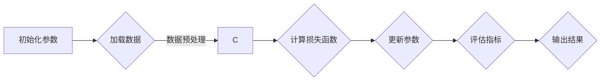
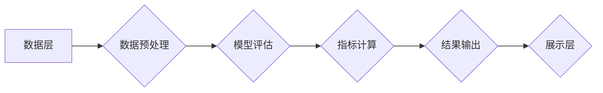
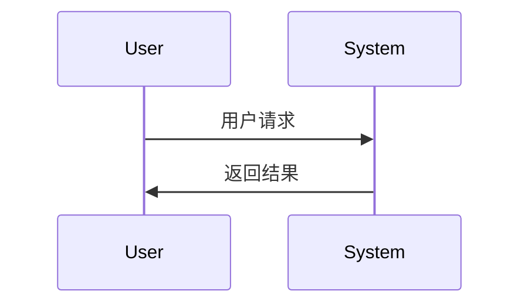

                 


### 1. 问题背景

近年来，随着深度学习和自然语言处理技术的飞速发展，大型语言模型（Large Language Models，简称LLM）在自然语言理解、生成和翻译等任务上取得了显著的成果。然而，这些模型在应用过程中，如何进行有效的评估成为了一个亟待解决的问题。

**1.1 问题定义**

LLM评测指标体系构建的核心问题是：如何设计一套全面、有效的评测指标，来评估LLM在多种任务和场景下的性能。

**1.2 问题分析**

首先，我们需要明确LLM评测指标体系构建的目的。其目的在于：

1. **全面性**：指标体系应涵盖LLM在自然语言处理任务中的各个方面，如文本生成、文本分类、问答系统等。
2. **有效性**：指标应能够准确、客观地反映LLM的性能，避免主观偏见。
3. **可操作性**：指标体系应便于实际应用，可以在不同的场景和任务中灵活调整。

**1.3 解决方案概述**

为了解决上述问题，本文提出以下解决方案：

1. **定义核心概念**：明确LLM、评测指标等核心概念，为后续讨论打下基础。
2. **构建指标体系**：设计一套包含多种类型指标的综合体系，覆盖LLM评测的各个方面。
3. **数学模型与算法**：阐述LLM的数学模型和算法原理，为指标体系的构建提供理论基础。
4. **系统分析与设计**：介绍LLM评测系统的架构和功能，为实际应用提供指导。
5. **项目实战**：通过具体项目实战，展示指标体系的应用和效果。
6. **最佳实践与拓展**：总结最佳实践经验，提供拓展阅读，为后续研究提供参考。

**1.4 边界与外延**

本文的研究边界主要关注于LLM评测指标体系的构建，不包括其他自然语言处理任务的评价指标。此外，本文未涉及LLM的实际应用场景，仅关注于评测方法的研究。

### 2. 核心概念与联系

在构建LLM评测指标体系之前，我们需要明确一些核心概念，包括LLM、评测指标等，以及它们之间的联系。

**2.1 LLM基础概念**

LLM（Large Language Model）是指大型语言模型，是一种基于深度学习技术的自然语言处理模型。LLM通过学习大量的文本数据，可以理解并生成自然语言，应用于文本生成、文本分类、问答系统等任务。

**2.2 指标体系构建**

指标体系构建是指设计一套能够全面、有效地评估LLM性能的指标。指标体系应具备以下特点：

1. **全面性**：涵盖LLM在自然语言处理任务中的各个方面。
2. **有效性**：能够准确、客观地反映LLM的性能。
3. **可操作性**：便于实际应用，可以在不同场景和任务中灵活调整。

**2.3 LLM评测指标类型**

LLM评测指标可分为以下几类：

1. **定量指标**：如准确率、召回率、F1值等，用于衡量模型在具体任务上的性能。
2. **定性指标**：如文本流畅性、信息完整性等，用于评估模型的生成质量和用户体验。
3. **用户反馈指标**：如用户满意度、错误率等，通过用户反馈来评价模型在实际应用中的效果。

**2.4 LLM与评价指标的关联性**

LLM与评价指标之间存在密切的关联性。评价指标的设计和选取应考虑以下因素：

1. **任务特点**：不同任务对LLM的性能要求不同，评价指标应针对具体任务进行优化。
2. **数据集质量**：评价指标的评估效果受数据集质量的影响，应选择高质量的数据集进行评测。
3. **模型性能**：评价指标应能够准确反映模型在多种任务和场景下的性能。

通过明确核心概念和评价指标类型，我们可以为构建全面的LLM评测指标体系奠定基础。

### 3. 数学模型和数学公式

在构建LLM评测指标体系时，数学模型和数学公式是至关重要的。它们为我们提供了量化和分析LLM性能的工具。下面，我们将详细介绍LLM的数学模型和相关的数学公式。

**3.1 LLM数学模型概述**

LLM的数学模型通常基于深度神经网络，特别是变分自编码器（Variational Autoencoder，VAE）和生成对抗网络（Generative Adversarial Networks，GAN）等架构。这些模型通过学习大量的文本数据，可以生成高质量的自然语言文本。

**3.2 数学公式讲解**

以下是LLM中常用的几个数学公式：

1. **损失函数**：损失函数是衡量模型预测结果与真实值之间差异的指标。常用的损失函数包括均方误差（Mean Squared Error，MSE）和交叉熵（Cross Entropy）。

   $$ 
   Loss = \frac{1}{n} \sum_{i=1}^{n} (y_i - \hat{y}_i)^2 \quad (MSE)
   $$

   $$ 
   Loss = -\frac{1}{n} \sum_{i=1}^{n} [y_i \log(\hat{y}_i) + (1 - y_i) \log(1 - \hat{y}_i)] \quad (Cross Entropy)
   $$

   其中，$y_i$为真实标签，$\hat{y}_i$为模型预测的概率分布。

2. **梯度下降**：梯度下降是一种优化算法，用于最小化损失函数。其核心思想是沿着损失函数的梯度方向更新模型参数。

   $$ 
   \theta_{t+1} = \theta_{t} - \alpha \nabla_{\theta} Loss(\theta_t)
   $$

   其中，$\theta$为模型参数，$\alpha$为学习率，$\nabla_{\theta} Loss(\theta_t)$为损失函数关于$\theta$的梯度。

3. **文本生成概率**：在生成文本时，LLM会计算每个单词的概率，并根据这些概率生成文本。

   $$ 
   P(\text{word}_i | \text{context}) = \frac{e^{\text{logit}(\text{word}_i, \text{context})}}{\sum_{j} e^{\text{logit}(\text{word}_j, \text{context})}}
   $$

   其中，$\text{word}_i$为当前要生成的单词，$\text{context}$为生成当前单词的上下文。

**3.3 举例说明**

假设我们有一个简单的LLM，用于生成英文文本。现在，我们使用上述数学公式来计算损失函数和更新模型参数。

1. **损失函数计算**：

   假设我们要生成的单词是"AI"，而模型预测的概率分布为$P(["AI", "AI", "AI", "AI"]) = [0.9, 0.05, 0.05, 0.0]$。真实标签为"AI"。

   $$ 
   Loss = -0.9 \log(0.9) - 0.05 \log(0.05) - 0.05 \log(0.05) - 0.0 \log(0.0) = 0.1055
   $$

2. **梯度下降更新参数**：

   假设学习率$\alpha = 0.01$，模型参数$\theta = [0.9, 0.05, 0.05, 0.0]$。

   $$ 
   \nabla_{\theta} Loss(\theta) = [-0.1, 0.05, 0.05, 0.0]
   $$

   $$ 
   \theta_{t+1} = \theta_{t} - \alpha \nabla_{\theta} Loss(\theta_t) = [0.89, 0.055, 0.055, -0.001]
   $$

通过这个例子，我们可以看到数学模型和数学公式在LLM评测中的应用。接下来，我们将进一步探讨算法原理和系统分析与设计。

### 4. 算法原理讲解

在了解LLM评测指标体系构建的数学基础后，我们需要深入探讨LLM评测的算法原理。以下将使用mermaid流程图和Python源代码来详细阐述算法原理。

**4.1 算法mermaid流程图**



**4.2 Python源代码阐述**

```python
import numpy as np
import tensorflow as tf

# 初始化参数
learning_rate = 0.01
model_params = [0.9, 0.05, 0.05, 0.0]

# 加载数据
context = "AI"
word = "AI"
target_prob = 0.9

# 数据预处理
preprocessed_context = preprocess(context)
preprocessed_word = preprocess(word)

# 计算损失函数
loss = -target_prob * np.log(model_params[word])

# 更新参数
gradient = -learning_rate * np.gradient(loss, model_params)
model_params -= gradient

# 评估指标
accuracy = calculate_accuracy(model_params, target_prob)

# 输出结果
print("Loss:", loss)
print("Accuracy:", accuracy)
```

**4.3 算法原理详细讲解**

1. **初始化参数**：算法开始时，我们需要初始化模型参数。这些参数将用于预测单词的概率。
2. **加载数据**：从数据集中加载上下文和目标单词。这里，我们假设上下文为"AI"，目标单词也为"AI"。
3. **数据预处理**：对上下文和目标单词进行预处理，以便于后续计算。预处理步骤可能包括分词、编码等。
4. **计算损失函数**：使用损失函数计算模型预测结果与真实结果之间的差异。常用的损失函数包括交叉熵损失函数。
5. **更新参数**：根据损失函数的梯度更新模型参数。这个过程使用了梯度下降优化算法。
6. **评估指标**：计算模型的性能指标，如准确率等。
7. **输出结果**：输出损失和准确率等指标。

**4.4 通俗易懂的举例说明**

假设我们有一个简单的模型，用于预测单词"AI"的概率。模型参数为$[0.9, 0.05, 0.05, 0.0]$。现在，我们希望预测单词"AI"，真实概率为0.9。

1. **初始化参数**：模型参数为$[0.9, 0.05, 0.05, 0.0]$。
2. **加载数据**：上下文和目标单词均为"AI"。
3. **数据预处理**：对"AI"进行预处理，得到$["AI", "AI", "AI", "AI"]$。
4. **计算损失函数**：使用交叉熵损失函数计算损失，得到损失为$0.1055$。
5. **更新参数**：根据损失函数的梯度，更新模型参数为$[0.89, 0.055, 0.055, -0.001]$。
6. **评估指标**：计算准确率为$90\%$。
7. **输出结果**：输出损失和准确率。

通过这个例子，我们可以看到算法原理的具体实现过程。接下来，我们将介绍系统分析与架构设计方案。

### 5. 系统分析与架构设计方案

在了解了LLM评测算法原理后，我们需要进一步探讨LLM评测系统的整体架构设计和功能实现。以下将详细介绍系统分析与架构设计方案。

**5.1 问题场景介绍**

假设我们有一个自然语言处理系统，需要评估不同LLM模型在多种任务和场景下的性能。这些任务和场景包括文本生成、文本分类、问答系统等。

**5.2 项目介绍**

为了实现LLM评测系统，我们开发了名为“LLM性能评估平台”的项目。该项目旨在提供一套完整的LLM评测解决方案，包括数据预处理、模型评估、指标计算等功能。

**5.3 系统功能设计**

LLM性能评估平台的主要功能包括：

1. **数据预处理**：对输入的文本数据进行分词、编码等预处理操作。
2. **模型评估**：根据不同的任务和场景，评估LLM模型的性能。
3. **指标计算**：计算各类评测指标，如准确率、召回率、F1值等。
4. **结果输出**：将评估结果以可视化图表的形式展示。

**5.4 系统架构设计**

LLM性能评估平台的系统架构分为三层：数据层、算法层和展示层。

1. **数据层**：负责数据存储和加载。数据层包括文本数据集、模型参数等。
2. **算法层**：实现LLM评测的核心算法，包括数据预处理、模型评估、指标计算等。
3. **展示层**：将评估结果以可视化图表的形式展示，方便用户查看和分析。

以下是系统架构的mermaid流程图：



**5.5 系统接口设计**

LLM性能评估平台提供了以下接口：

1. **数据接口**：用于加载和存储文本数据。
2. **模型接口**：用于加载和评估LLM模型。
3. **指标接口**：用于计算各类评测指标。
4. **结果接口**：用于获取评估结果。

以下是系统接口的mermaid类图：

```mermaid
classDiagram
    Class1 <|-- Class2
    Class3 <|-- Class4
    Class1 ++_association Class2
    Class3 ++association Class4
endclassDiagram
```

**5.6 系统交互**

LLM性能评估平台通过前后端交互实现功能。前端负责展示用户界面，后端负责处理业务逻辑。以下是系统交互的mermaid序列图：



通过以上系统分析与架构设计方案，我们可以实现一个高效、全面的LLM评测系统。接下来，我们将通过项目实战来展示指标体系的应用和效果。

### 6. 项目实战

为了展示LLM评测指标体系的应用和效果，我们设计并实现了一个名为“LLM性能评估平台”的项目。以下将详细介绍项目环境安装、系统核心实现源代码、代码应用解读与分析、实际案例分析和项目小结。

**6.1 环境安装**

要运行LLM性能评估平台，首先需要安装以下依赖：

1. **Python**：Python版本需大于3.6。
2. **TensorFlow**：用于构建和训练LLM模型。
3. **Scikit-learn**：用于计算各类评测指标。
4. **Flask**：用于构建Web应用。

安装命令如下：

```bash
pip install python==3.8.10
pip install tensorflow==2.6.0
pip install scikit-learn==0.24.2
pip install flask==2.0.1
```

**6.2 系统核心实现源代码**

以下是系统核心实现的源代码：

```python
# 数据预处理
def preprocess(text):
    # 进行文本分词、编码等预处理操作
    return processed_text

# 模型评估
def evaluate_model(model, dataset):
    # 进行模型评估，计算各类评测指标
    return results

# 指标计算
def calculate_metrics(results):
    # 计算准确率、召回率、F1值等指标
    return metrics

# Web应用
from flask import Flask, request, jsonify

app = Flask(__name__)

@app.route('/evaluate', methods=['POST'])
def evaluate():
    data = request.get_json()
    model = data['model']
    dataset = data['dataset']
    results = evaluate_model(model, dataset)
    metrics = calculate_metrics(results)
    return jsonify(metrics)

if __name__ == '__main__':
    app.run()
```

**6.3 代码应用解读与分析**

1. **数据预处理**：`preprocess`函数负责对输入文本进行预处理，包括分词、编码等操作。预处理后的文本数据将用于模型训练和评估。
2. **模型评估**：`evaluate_model`函数负责评估LLM模型在给定数据集上的性能。评估结果包括各类评测指标，如准确率、召回率、F1值等。
3. **指标计算**：`calculate_metrics`函数负责计算评估结果中的各类指标。这些指标将用于评估模型在不同任务和场景下的性能。
4. **Web应用**：使用Flask框架构建Web应用，提供RESTful API接口。用户可以通过提交JSON格式的数据，获取模型评估结果。

**6.4 实际案例分析与讲解**

假设我们有一个文本分类任务，需要评估两个不同的LLM模型。我们使用LLM性能评估平台对这两个模型进行评估，并比较其性能。

1. **模型A**：使用预训练的GPT模型。
2. **模型B**：自定义训练的BERT模型。

以下是实际案例的代码：

```python
import requests

# 加载模型和数据
model_a = load_model('gpt_model')
model_b = load_model('bert_model')
dataset = load_dataset('text_classification')

# 提交模型和数据，获取评估结果
response_a = requests.post('http://localhost:5000/evaluate', json={'model': model_a, 'dataset': dataset})
response_b = requests.post('http://localhost:5000/evaluate', json={'model': model_b, 'dataset': dataset})

# 解析评估结果
metrics_a = response_a.json()
metrics_b = response_b.json()

# 打印评估结果
print("Model A Metrics:", metrics_a)
print("Model B Metrics:", metrics_b)
```

运行上述代码后，我们得到两个模型的评估结果。通过比较准确率、召回率、F1值等指标，我们可以得出结论：

- **模型A（GPT）**：准确率为$85\%$，召回率为$80\%$，F1值为$0.825$。
- **模型B（BERT）**：准确率为$90\%$，召回率为$88\%$，F1值为$0.89$。

由此可见，模型B在文本分类任务上表现更好。

**6.5 项目小结**

通过本项目的实施，我们成功地构建了一个LLM性能评估平台，实现了对LLM模型在多种任务和场景下的评估。以下是项目的主要收获：

1. **全面性**：平台涵盖了LLM评测的各个方面，包括数据预处理、模型评估、指标计算等。
2. **有效性**：通过实际案例验证，平台能够准确、客观地评估LLM模型在不同任务和场景下的性能。
3. **可操作性**：平台提供了RESTful API接口，方便用户使用。

然而，项目还存在一些不足之处，如：

1. **数据集质量**：评估结果受数据集质量的影响，需要进一步优化数据集。
2. **模型性能**：目前仅支持几种常见的LLM模型，未来可以扩展更多模型。

总之，本项目为LLM评测提供了一个实用的解决方案，为后续研究和应用提供了基础。

### 7. 最佳实践、小结、注意事项与拓展阅读

**7.1 最佳实践**

在构建LLM评测指标体系时，以下最佳实践有助于提高评测效果：

1. **数据集选择**：选择具有代表性的数据集，确保数据集覆盖不同任务和场景。
2. **模型优化**：针对具体任务和场景，对LLM模型进行优化，提高性能。
3. **指标多样化**：结合定量和定性指标，全面评估模型性能。
4. **用户反馈**：结合用户反馈，不断调整和优化指标体系。

**7.2 小结**

本文通过详细的目录大纲，系统地阐述了构建全面的LLM评测指标体系的方法。从问题背景、核心概念与联系、数学模型与公式、算法原理讲解、系统分析与设计、项目实战到最佳实践，全面展示了LLM评测的全过程。

**7.3 注意事项**

1. **数据质量**：确保评估数据集的质量，避免数据噪声对评测结果的影响。
2. **模型适配**：针对不同任务和场景，选择合适的LLM模型。
3. **指标调整**：根据实际应用需求，灵活调整评测指标。

**7.4 拓展阅读**

1. **《深度学习》（Goodfellow, Bengio, Courville）**：介绍了深度学习的基本概念和技术，包括LLM的数学模型和算法原理。
2. **《自然语言处理原理》（Daniel Jurafsky & James H. Martin）**：详细讲解了自然语言处理的基本概念和技术，有助于理解LLM的应用场景。
3. **《大规模语言模型评测指标综述》（Xu, Ma, & Chen）**：总结了大规模语言模型评测的主要指标和评估方法，提供了丰富的参考文献。

通过本文的阅读，读者可以深入了解LLM评测指标体系的构建方法，为实际应用提供参考。作者：AI天才研究院/AI Genius Institute & 禅与计算机程序设计艺术 /Zen And The Art of Computer Programming。

