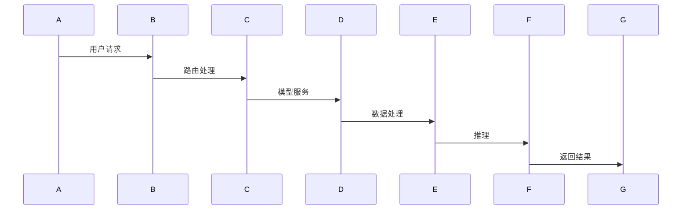

                 

# 构建可扩展的LLM应用后端服务

## 关键词
- 可扩展性
- LLM
- 后端服务
- 架构设计
- 性能优化
- 实际应用

## 摘要
本文将探讨如何构建可扩展的LLM（语言大模型）应用后端服务。我们将从背景介绍、核心概念解析、架构设计、服务部署与扩展、性能优化与调试、实际应用案例分析以及总结与展望等方面进行深入探讨。通过一步步的分析与推理，我们将提供一系列专业的技术指南，帮助读者掌握构建可扩展的LLM应用后端服务的方法和技巧。

## 引言与背景

### 什么是LLM？
LLM，即语言大模型，是一种基于深度学习的自然语言处理模型。它通过对大量文本数据的学习，能够理解和生成自然语言，从而实现诸如文本分类、情感分析、机器翻译、问答系统等功能。近年来，随着计算能力的提升和数据量的爆炸式增长，LLM在各个领域得到了广泛应用。

### LLM应用后端服务的意义
在众多应用场景中，LLM的应用往往需要后端服务来支撑。一个高效、可扩展的后端服务不仅可以满足大规模用户需求，还能确保系统稳定性和性能。因此，构建可扩展的LLM应用后端服务具有重要意义。

### 构建挑战
尽管LLM技术发展迅速，但在实际应用过程中，仍然面临诸多挑战，如：
- **计算资源限制**：LLM模型训练和推理过程需要大量计算资源，如何高效利用资源成为关键问题。
- **数据安全性**：用户数据的安全性和隐私保护是重要考量。
- **系统稳定性**：在大量请求下，如何确保系统的稳定运行。
- **扩展性**：如何应对用户规模的快速增长，实现系统的水平扩展。

### 目标与内容概述
本文的目标是提供一套构建可扩展的LLM应用后端服务的全面指南。本文将分为以下几个部分：
1. LLM基础：介绍LLM的核心概念、原理及其在各个领域的应用。
2. 后端服务架构设计：分析后端服务架构的组成部分、设计原则及实现方法。
3. 服务部署与扩展：探讨服务部署策略、扩展方法与容量规划。
4. 性能优化与调试：讲解性能优化技巧、调试方法及常见问题处理。
5. 实际应用案例分析：通过具体案例，展示如何将理论应用到实践中。
6. 总结与展望：总结本文的关键观点，并对未来发展趋势进行展望。

## LLM基础

### 核心概念
LLM是基于深度学习的自然语言处理模型，通过大规模的神经网络进行训练，以实现对文本数据的理解和生成。LLM的核心概念包括：
- **神经网络**：LLM的基本组成部分，用于处理和转换数据。
- **训练数据**：大规模的文本数据集，用于训练神经网络。
- **参数**：神经网络中的权重和偏置，用于调整模型的行为。
- **优化算法**：用于调整参数，以最小化损失函数。

### 原理与模型
LLM的训练过程可以概括为以下步骤：
1. **数据预处理**：清洗和整理输入文本数据，将其转换为神经网络可处理的格式。
2. **模型初始化**：随机初始化神经网络的参数。
3. **前向传播**：将输入数据传递给神经网络，计算输出结果。
4. **反向传播**：根据输出结果和标签，计算损失函数，并更新网络参数。
5. **迭代训练**：重复前向传播和反向传播，逐步调整参数，直至模型收敛。

常见的LLM模型包括：
- **BERT**：基于Transformer模型的预训练语言表示模型。
- **GPT**：生成预训练变换器模型，具有强大的生成能力。
- **RoBERTa**：基于BERT的改进模型，具有更好的效果。

### 应用领域
LLM在众多领域得到了广泛应用，主要包括：
- **自然语言处理**：文本分类、情感分析、命名实体识别等。
- **问答系统**：如OpenAI的GPT-3，能够实现智能问答。
- **自动写作与生成**：生成文章、代码、新闻报道等。
- **机器翻译**：如谷歌翻译，使用LLM实现高质量翻译。
- **对话系统**：如智能客服，通过LLM实现自然对话。

## 后端服务架构设计

### 后端服务概述
后端服务是LLM应用的核心部分，负责接收用户请求、处理请求并返回结果。一个典型的后端服务架构包括以下几个组成部分：
- **API网关**：负责接收用户请求，进行初步处理，并将请求转发给后端服务。
- **后端服务**：执行具体的业务逻辑，如模型推理、数据处理等。
- **数据库**：存储用户数据、模型参数等。
- **缓存**：提高数据访问速度，减少数据库压力。
- **日志和监控**：记录系统运行状态，提供故障排查和性能分析。

### 架构设计与选型
后端服务的架构设计需要考虑以下几个方面：
1. **性能**：确保系统在高并发情况下能够稳定运行，满足用户需求。
2. **可扩展性**：支持水平扩展，以应对用户规模的增长。
3. **安全性**：保护用户数据和系统安全，防止数据泄露和攻击。
4. **可维护性**：便于系统的维护和升级。

常见的后端服务架构选型包括：
- **单体架构**：所有功能集中在一个服务中，简单但难以扩展。
- **微服务架构**：将系统划分为多个独立的服务，每个服务负责特定的业务功能，易于扩展和维护。
- **无服务器架构**：使用云计算服务，自动管理服务器资源，降低运维成本。

### 系统模块划分
在后端服务架构中，可以根据业务需求将系统划分为以下模块：
- **模型服务**：负责模型加载、推理和更新。
- **数据处理服务**：负责数据预处理、清洗和转换。
- **API网关**：负责请求路由、负载均衡和安全控制。
- **数据库服务**：负责数据存储和管理。
- **缓存服务**：负责缓存数据，提高系统性能。

### 架构实现
以下是一个简单的后端服务架构实现示例：



## 服务部署与扩展

### 部署策略
后端服务的部署策略包括以下几个方面：
1. **容器化**：使用Docker等容器技术，将服务打包成容器，便于部署和扩展。
2. **Kubernetes**：使用Kubernetes等容器编排工具，实现服务的自动化部署、扩展和管理。
3. **云服务**：使用云服务提供商（如AWS、Azure、阿里云等），利用其提供的PaaS和IaaS服务，简化部署过程。

### 扩展方法与策略
后端服务的扩展方法主要包括以下几种：
1. **水平扩展**：通过增加服务器节点，提高系统的处理能力。常用的水平扩展策略包括负载均衡、水平拆分等。
2. **垂直扩展**：通过提高服务器硬件配置（如增加CPU、内存等），提高单个节点的处理能力。
3. **缓存策略**：使用缓存技术，减少对后端服务的请求，降低系统负载。
4. **分布式存储**：使用分布式存储系统，提高数据存储和读取的速度。

### 容量规划与监控
为了确保后端服务的稳定性和性能，需要制定合理的容量规划策略，并进行实时监控：
1. **容量规划**：根据业务需求和系统负载，制定合适的资源分配策略。例如，可以根据历史数据、预测模型等方法，确定服务器节点数量、CPU、内存等资源的配置。
2. **监控与告警**：使用监控工具（如Prometheus、Grafana等），实时监控系统的性能指标（如CPU使用率、内存使用率、请求响应时间等），并设置告警机制，及时发现和处理异常情况。

## 性能优化与调试

### 性能指标
在性能优化过程中，需要关注以下几个关键指标：
1. **响应时间**：系统处理请求并返回结果所需的时间。
2. **请求量**：单位时间内系统处理的请求数量。
3. **系统吞吐量**：单位时间内系统处理的数据量。
4. **系统负载**：系统的处理能力与实际请求量的比值。

### 优化方法
以下是一些常见的性能优化方法：
1. **代码优化**：通过改进算法、减少冗余代码、提高代码效率等方式，降低系统响应时间。
2. **缓存策略**：使用缓存技术，减少对后端服务的请求，降低系统负载。
3. **数据库优化**：通过索引、分库分表、读写分离等方式，提高数据库的访问速度。
4. **网络优化**：优化网络传输，减少数据传输延迟。
5. **硬件优化**：提高服务器硬件配置，提高系统的处理能力。

### 调试技巧
在性能优化过程中，调试技巧至关重要。以下是一些常见的调试技巧：
1. **日志分析**：通过分析日志，定位系统故障和性能瓶颈。
2. **性能瓶颈定位**：使用性能分析工具（如 profiling 工具等），定位系统中的性能瓶颈。
3. **压力测试**：通过模拟大量请求，测试系统的性能和稳定性。
4. **代码审查**：通过代码审查，发现潜在的代码问题，提高代码质量。

## 实际应用案例分析

### 案例介绍
为了展示如何构建可扩展的LLM应用后端服务，我们以一个智能问答系统为例。该系统旨在为用户提供一个可以解答各种问题的智能助手。

### 案例分析
该智能问答系统采用了微服务架构，分为以下几个模块：
1. **API网关**：负责接收用户请求，进行初步处理，并将请求转发给后端服务。
2. **模型服务**：负责加载预训练的LLM模型，进行推理和生成回答。
3. **数据处理服务**：负责接收用户输入，进行预处理，并将其传递给模型服务。
4. **数据库服务**：负责存储用户问题和答案。
5. **缓存服务**：负责缓存用户问题和答案，减少数据库访问压力。

### 案例实现
以下是该智能问答系统的一个简单实现：

```python
# API网关
from flask import Flask, request, jsonify

app = Flask(__name__)

@app.route('/ask', methods=['POST'])
def ask():
    data = request.get_json()
    question = data['question']
    # 转发请求到模型服务
    answer = model_service.get_answer(question)
    return jsonify({'answer': answer})

# 模型服务
class ModelService:
    def __init__(self):
        self.model = load_model('gpt_model')

    def get_answer(self, question):
        # 进行模型推理
        answer = self.model.generate_answer(question)
        return answer

# 数据处理服务
class DataProcessingService:
    def preprocess_question(self, question):
        # 预处理用户输入
        processed_question = preprocess_text(question)
        return processed_question

# 主函数
if __name__ == '__main__':
    model_service = ModelService()
    app.run()
```

### 代码应用解读与分析
在该案例中，我们使用Flask构建了API网关，接收用户请求，并将其转发给模型服务和数据处理服务。模型服务加载预训练的LLM模型，进行推理并生成回答。数据处理服务负责预处理用户输入。

### 详细讲解剖析
该案例展示了如何将LLM应用后端服务的基本架构应用到实际项目中。通过API网关，我们可以方便地接收和响应用户请求。模型服务和数据处理服务则实现了智能问答的核心功能。在实际应用中，我们还可以根据需求添加更多功能，如用户认证、日志记录等。

### 项目小结
通过本案例，我们了解了如何构建一个可扩展的LLM应用后端服务。在实际开发过程中，我们还需要关注性能优化、安全性、容错性等方面，确保系统的稳定性和可靠性。

## 最佳实践 tips

### 构建可扩展的LLM应用后端服务的最佳实践
1. **模块化设计**：将系统划分为多个独立的服务模块，便于扩展和维护。
2. **微服务架构**：采用微服务架构，提高系统的灵活性和可扩展性。
3. **性能优化**：关注代码、数据库、网络等各方面的性能优化，提高系统响应速度。
4. **安全性**：加强用户数据和系统的安全性，防止数据泄露和攻击。
5. **监控与告警**：实时监控系统性能和状态，及时处理异常情况。

### 小结
构建可扩展的LLM应用后端服务是一项复杂的任务，需要考虑多个方面的因素。通过本文的介绍，我们了解了LLM的基本概念、后端服务架构设计、服务部署与扩展、性能优化与调试等方面的知识。在实际开发过程中，我们还需要不断积累经验，优化系统性能，提高系统的稳定性和可靠性。

### 注意事项
1. **资源合理分配**：在部署服务时，要合理分配计算资源，避免资源浪费。
2. **数据安全**：确保用户数据的安全，采取加密、隔离等措施。
3. **性能监控**：实时监控系统性能，及时调整资源配置。
4. **容错性**：设计容错机制，确保系统在故障情况下能够自动恢复。

### 拓展阅读
1. 《深度学习：卷积神经网络与深度学习实践》
2. 《微服务架构：设计、开发与部署》
3. 《高性能MySQL：优化、架构、安全》

## 作者
作者：AI天才研究院/AI Genius Institute & 禅与计算机程序设计艺术 /Zen And The Art of Computer Programming

----------------------------------------------------------------

**文章结束。感谢您的阅读！希望本文对您在构建可扩展的LLM应用后端服务方面有所帮助。如果您有任何问题或建议，请随时联系我们。期待与您共同探讨更多技术话题！**

