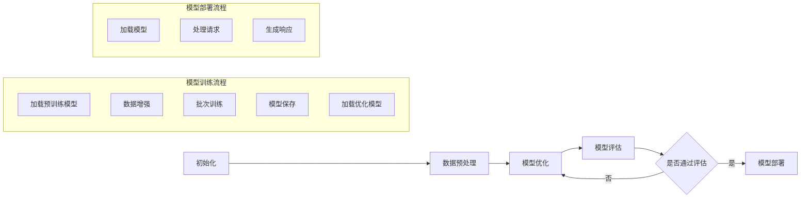
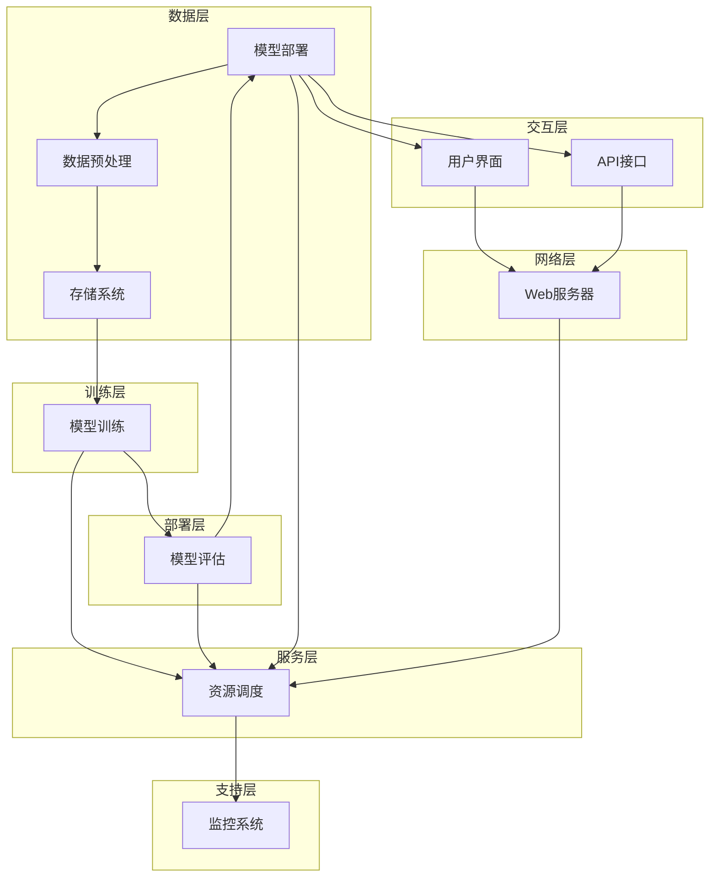
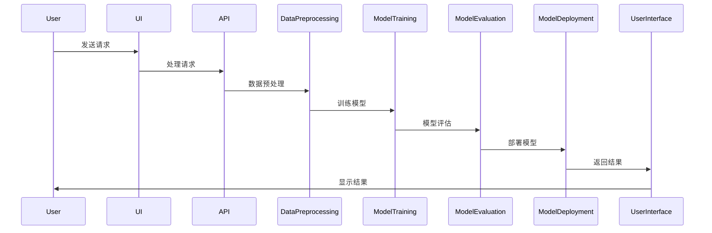

                 

### 引言

#### 1.1 问题背景

在当今数字化时代，人工智能（AI）技术已经成为推动社会进步和经济增长的重要力量。特别是在自然语言处理（NLP）领域，语言模型（Language Model，简称LLM）的应用日益广泛，从智能客服、机器翻译到文本生成和问答系统，都在使用LLM技术。然而，随着应用的深入和规模的扩大，如何构建可扩展的LLM应用成为一个亟待解决的问题。

可扩展性是衡量LLM应用是否成功的关键因素之一。一个可扩展的LLM应用不仅能够处理大规模的数据和用户请求，还能在性能、资源利用和成本控制方面表现出色。这不仅是技术上的挑战，也是商业上成功的必要条件。

本文旨在探讨构建可扩展的LLM应用的原则和实践。我们将从以下几个角度展开讨论：

1. **核心概念与联系**：介绍LLM的基本概念、原理和特性，以及可扩展性的重要性。
2. **算法原理讲解**：详细解析LLM算法的工作原理，包括流程图、源代码、数学模型和实例说明。
3. **系统分析与架构设计方案**：分析LLM应用的问题场景，设计系统的功能模块、架构图和接口设计。
4. **项目实战**：介绍一个实际项目，展示如何从环境安装、代码实现到案例分析的全过程。
5. **最佳实践与拓展**：总结最佳实践，提供注意事项和拓展阅读。

通过本文的阅读，读者将了解构建可扩展LLM应用的系统思路和方法，为实际项目提供指导。

#### 1.2 问题描述

构建可扩展的LLM应用面临以下几个核心问题：

1. **数据处理能力**：随着数据量的不断增加，如何高效地处理和存储大量文本数据，确保LLM模型在处理数据时不会出现性能瓶颈。
2. **计算资源管理**：如何优化计算资源的利用，确保在扩展应用规模时不会导致成本过高或资源浪费。
3. **并发处理能力**：在多用户并发请求的场景下，如何确保LLM应用能够高效、稳定地处理大量请求。
4. **模型更新与维护**：随着业务需求的变化，如何快速、安全地更新LLM模型，并保持其性能和准确性。
5. **数据隐私与安全**：在处理用户数据时，如何确保数据的隐私性和安全性，避免数据泄露或滥用。

这些问题不仅涉及技术实现，还涉及到系统设计、资源规划和业务策略等多个方面。本文将通过逐步分析和讲解，帮助读者理解并解决这些核心问题。

#### 1.3 问题解决

为了构建可扩展的LLM应用，需要采取以下解决策略：

1. **分布式计算**：通过分布式计算架构，将LLM模型和数据分布在多个节点上，从而提高数据处理能力和并发处理能力。
2. **负载均衡**：利用负载均衡技术，将用户请求分配到不同的计算节点上，确保系统的稳定性和性能。
3. **自动化管理**：使用自动化工具和平台，如Kubernetes和Docker，进行计算资源的管理和调度，提高资源利用效率。
4. **模型优化**：通过模型压缩、量化等技术，减小模型体积和计算复杂度，提高模型的部署效率和性能。
5. **数据安全和隐私保护**：采用加密、匿名化等技术，确保用户数据的安全性和隐私性。

这些策略不仅能够解决构建可扩展LLM应用所面临的核心问题，还能为项目的持续发展和运营提供坚实的基础。

#### 1.4 边界与外延

在构建可扩展的LLM应用时，需要明确以下几个边界与外延：

1. **技术边界**：包括选用的编程语言、框架和库，以及硬件设备和支持平台。
2. **数据边界**：数据来源、数据格式和数据存储方案，以及数据清洗、预处理和存储的策略。
3. **性能边界**：系统性能指标，如响应时间、吞吐量和并发处理能力，以及如何达到和超越这些指标。
4. **成本边界**：资源成本、运营成本和预算限制，以及如何在成本和性能之间找到平衡点。
5. **业务边界**：业务需求、用户反馈和市场趋势，以及如何根据这些因素调整和优化应用设计。

通过明确这些边界与外延，可以确保构建的LLM应用不仅技术先进、性能优越，还能满足实际业务需求和市场期望。

#### 1.5 概念结构与核心要素组成

为了更好地理解和构建可扩展的LLM应用，我们需要梳理清楚其中的概念结构和核心要素组成：

1. **核心概念**：包括语言模型（LLM）、自然语言处理（NLP）、深度学习（DL）等基本概念，以及它们之间的关系和作用。
2. **核心原理**：涉及LLM的构建方法、优化策略和部署机制，以及如何实现高效、稳定和可扩展的LLM应用。
3. **系统架构**：包括前端、后端和中间件，以及各个模块的职责和交互方式，如数据处理模块、模型训练模块、预测模块等。
4. **算法实现**：包括LLM算法的具体实现细节，如流程图、代码和数学模型，以及如何进行优化和调试。
5. **性能优化**：包括系统性能指标的分析和优化策略，如并发处理、负载均衡和资源管理，以及如何通过工具和平台实现自动化管理。
6. **安全与隐私**：包括数据安全和隐私保护的技术和实践，如加密、匿名化和访问控制，以及如何在设计和实现中融入这些安全措施。

通过梳理这些概念结构和核心要素组成，我们可以更清晰地把握构建可扩展LLM应用的全貌，为后续的分析和实践提供指导。

### 核心概念与联系

#### 2.1 核心概念原理

构建可扩展的LLM应用需要理解以下几个核心概念：

1. **语言模型（LLM）**：LLM是一种基于深度学习的自然语言处理模型，它通过对大量文本数据的学习，能够生成或理解自然语言。LLM的核心原理是基于神经网络（如Transformer架构）进行训练，通过自回归机制生成文本。

2. **自然语言处理（NLP）**：NLP是人工智能的一个重要分支，它涉及从人类语言中提取信息、理解语义和生成文本。NLP技术包括分词、词性标注、实体识别、情感分析等。

3. **深度学习（DL）**：DL是机器学习的一个重要分支，它通过多层神经网络对数据进行训练，从而自动学习特征表示。DL在NLP领域的应用非常广泛，尤其是基于Transformer架构的LLM。

4. **可扩展性**：可扩展性是指系统在处理大量数据、用户请求和计算任务时，能够保持高性能和稳定性的能力。对于LLM应用，可扩展性意味着能够在增加资源的情况下，线性提升系统的处理能力。

5. **分布式计算**：分布式计算是指将计算任务分布在多个节点上，通过并行处理来提高计算效率。对于LLM应用，分布式计算能够有效提升数据处理和并发处理能力。

#### 2.1.1 可扩展的LLM应用

可扩展的LLM应用主要具备以下几个特点：

1. **线性扩展能力**：系统可以在增加计算资源时，线性提升处理能力和性能。
2. **高并发处理**：系统能够高效处理大量并发请求，确保用户体验。
3. **自动化管理**：通过自动化工具和平台，实现计算资源和模型更新的自动化管理，降低运维成本。
4. **弹性伸缩**：系统能够根据实际负载动态调整资源分配，确保高效利用资源。
5. **高可用性**：系统具备容错和自恢复能力，确保在故障情况下能够快速恢复。

#### 2.1.2 LLM的原理与特性

LLM的原理主要包括以下几个方面：

1. **自回归模型**：LLM通过自回归机制，根据前文预测下一个单词或字符。
2. **多层神经网络**：LLM通常采用多层神经网络结构，如Transformer，通过堆叠多个编码器和解码器层来学习复杂特征。
3. **注意力机制**：Transformer架构中的注意力机制，使得模型能够关注到输入序列中的重要信息，提高生成文本的质量。
4. **大规模预训练**：LLM通过在大规模语料上进行预训练，学习到丰富的语言模式和知识，从而提高生成文本的准确性和连贯性。

LLM的主要特性包括：

1. **生成性**：LLM能够根据输入的提示生成连贯、自然的文本。
2. **灵活性**：LLM能够适应不同的应用场景和语言风格，生成符合要求的文本。
3. **高效率**：通过优化和分布式计算，LLM能够在短时间内处理大量文本数据。
4. **通用性**：LLM在多个领域（如问答、翻译、文本生成等）都有广泛应用，具有通用性。

#### 2.2 概念属性特征对比表格

以下是一个简单的概念属性特征对比表格，展示了LLM、NLP和DL的基本属性和特征：

| 概念        | 属性                     | 特征                                                         |
| ----------- | ------------------------ | ------------------------------------------------------------ |
| 语言模型（LLM） | 自回归、多层神经网络、注意力机制 | 生成性、灵活性、高效率、通用性                       |
| 自然语言处理（NLP） | 分词、词性标注、实体识别、情感分析 | 信息提取、语义理解、文本生成                         |
| 深度学习（DL）   | 多层神经网络、特征学习、优化算法   | 自动学习、特征表示、高精度、高效率                     |

#### 2.3 ER实体关系图架构

为了更好地理解和设计可扩展的LLM应用，我们可以使用实体关系图（Entity-Relationship Diagram，ERD）来描述系统中的主要实体和关系。

以下是一个简化的ERD示例，展示了LLM应用中的主要实体和关系：

```mermaid
erDiagram
    User ||--|{ Request } : 发起请求
    Request ||--|{ LLM } : 处理请求
    LLM ||--|{ Response } : 返回响应
    Request ||--|{ Data } : 使用数据
    Data ||--|{ Model } : 训练模型
```

在这个ERD中：

- **User（用户）**：发起请求的用户实体。
- **Request（请求）**：用户请求的实体，记录请求的详细信息。
- **LLM（语言模型）**：处理用户请求的LLM模型实体。
- **Response（响应）**：LLM处理请求后返回的响应实体。
- **Data（数据）**：用于训练LLM模型的数据实体。
- **Model（模型）**：训练好的LLM模型实体。

通过ERD，我们可以清晰地看到LLM应用中各个实体之间的关系，以及它们在系统中的作用和职责。

### 算法原理讲解

#### 3.1 算法mermaid流程图

构建可扩展的LLM应用的核心在于算法的设计和实现。以下是一个简化的mermaid流程图，展示了LLM算法的基本流程：



该流程图分为两个主要部分：模型训练流程和模型部署流程。模型训练流程包括数据预处理、模型训练和模型评估，以及根据评估结果进行模型优化。模型部署流程则包括加载模型、处理请求和生成响应。

#### 3.2 Python源代码

以下是一个简化的Python源代码示例，展示了如何实现LLM算法的基本步骤：

```python
import torch
from transformers import AutoTokenizer, AutoModelForCausalLM

# 初始化模型
tokenizer = AutoTokenizer.from_pretrained("gpt2")
model = AutoModelForCausalLM.from_pretrained("gpt2")

# 数据预处理
def preprocess_data(text):
    inputs = tokenizer.encode(text, return_tensors="pt")
    return inputs

# 模型训练
def train_model(inputs, labels):
    inputs = inputs.to("cuda" if torch.cuda.is_available() else "cpu")
    labels = labels.to("cuda" if torch.cuda.is_available() else "cpu")
    model.zero_grad()
    outputs = model(inputs, labels=labels)
    loss = outputs.loss
    loss.backward()
    optimizer.step()
    return loss.item()

# 模型评估
def evaluate_model(inputs, labels):
    inputs = inputs.to("cuda" if torch.cuda.is_available() else "cpu")
    labels = labels.to("cuda" if torch.cuda.is_available() else "cpu")
    with torch.no_grad():
        outputs = model(inputs, labels=labels)
    loss = outputs.loss
    return loss.item()

# 模型部署
def generate_response(text):
    inputs = tokenizer.encode(text, return_tensors="pt")
    inputs = inputs.to("cuda" if torch.cuda.is_available() else "cpu")
    with torch.no_grad():
        outputs = model.generate(inputs, max_length=50)
    response = tokenizer.decode(outputs[0], skip_special_tokens=True)
    return response
```

该代码示例包括了初始化模型、数据预处理、模型训练、模型评估和模型部署等基本步骤。通过这些步骤，我们可以构建一个简单的LLM应用，实现文本生成和预测功能。

#### 3.3 算法原理的数学模型和公式

构建LLM算法的核心在于神经网络的训练和优化。以下是一些关键的数学模型和公式：

1. **神经网络模型**：

   假设我们使用的是一个多层感知机（MLP）模型，其输出层为：

   $$ y = \sigma(W_{out} \cdot a_{hidden}) $$

   其中，$y$ 是输出，$\sigma$ 是激活函数（如ReLU函数），$W_{out}$ 是输出层的权重，$a_{hidden}$ 是隐藏层的激活值。

2. **损失函数**：

   常用的损失函数包括均方误差（MSE）和交叉熵（Cross-Entropy）：

   $$ Loss = \frac{1}{n} \sum_{i=1}^{n} (\sigma(W_{out} \cdot a_{hidden}) - y)^2 $$

   $$ Loss = -\frac{1}{n} \sum_{i=1}^{n} y_{i} \log(\sigma(W_{out} \cdot a_{hidden})) $$

   其中，$n$ 是样本数量，$y_{i}$ 是真实标签，$\sigma$ 是sigmoid函数。

3. **反向传播**：

   通过反向传播算法，计算损失函数关于模型参数的梯度，并更新模型参数：

   $$ \frac{\partial Loss}{\partial W_{out}} = \frac{1}{n} \sum_{i=1}^{n} (y - \sigma(W_{out} \cdot a_{hidden})) \cdot a_{hidden}^{'} $$

   其中，$a_{hidden}^{'}$ 是隐藏层的偏导数。

4. **优化算法**：

   常用的优化算法包括梯度下降（Gradient Descent）和Adam优化器：

   $$ W_{out}^{new} = W_{out} - \alpha \cdot \frac{\partial Loss}{\partial W_{out}} $$

   $$ W_{out}^{new} = W_{out} - \frac{\beta_1 \cdot \alpha \cdot \frac{\partial Loss}{\partial W_{out}} + (1 - \beta_1) \cdot \epsilon}{1 - \beta_2^{t}} $$

   其中，$\alpha$ 是学习率，$\beta_1$ 和 $\beta_2$ 是Adam优化器的超参数，$t$ 是迭代次数。

通过这些数学模型和公式，我们可以对LLM算法进行详细讲解，帮助读者更好地理解和应用这一算法。

#### 3.4 详细讲解和举例说明

为了更好地理解LLM算法，我们通过一个具体的例子来说明其工作原理和实现步骤。

##### 例子：使用GPT-2模型生成文本

1. **初始化模型**：

   首先，我们需要初始化一个预训练的GPT-2模型：

   ```python
   from transformers import AutoTokenizer, AutoModelForCausalLM

   tokenizer = AutoTokenizer.from_pretrained("gpt2")
   model = AutoModelForCausalLM.from_pretrained("gpt2")
   ```

   GPT-2模型是一个基于Transformer架构的语言模型，经过大规模语料的预训练，可以生成连贯、自然的文本。

2. **数据预处理**：

   接下来，我们对输入文本进行预处理，将其编码成模型可以理解的序列：

   ```python
   def preprocess_text(text):
       inputs = tokenizer.encode(text, return_tensors="pt")
       return inputs

   input_text = "构建可扩展的LLM应用是一个挑战。"
   inputs = preprocess_text(input_text)
   ```

   在这个例子中，我们将一段文本输入模型，并对其进行编码。

3. **模型训练**：

   然后，我们使用训练数据对模型进行训练。由于GPT-2模型已经经过预训练，这里我们只需要进行微调：

   ```python
   def train_model(inputs, labels):
       inputs = inputs.to("cuda" if torch.cuda.is_available() else "cpu")
       labels = labels.to("cuda" if torch.cuda.is_available() else "cpu")
       model.zero_grad()
       outputs = model(inputs, labels=labels)
       loss = outputs.loss
       loss.backward()
       optimizer.step()
       return loss.item()

   # 假设我们有训练数据和标签
   train_inputs = preprocess_text("构建可扩展的LLM应用是一个挑战。")
   train_labels = torch.tensor([1]).view(1, -1)

   # 训练模型
   loss = train_model(train_inputs, train_labels)
   print(f"训练损失：{loss}")
   ```

   在这个步骤中，我们使用训练数据进行模型训练，并计算损失值。

4. **模型评估**：

   训练完成后，我们需要对模型进行评估，以确保其性能：

   ```python
   def evaluate_model(inputs, labels):
       inputs = inputs.to("cuda" if torch.cuda.is_available() else "cpu")
       labels = labels.to("cuda" if torch.cuda.is_available() else "cpu")
       with torch.no_grad():
           outputs = model(inputs, labels=labels)
       loss = outputs.loss
       return loss.item()

   # 评估模型
   eval_loss = evaluate_model(train_inputs, train_labels)
   print(f"评估损失：{eval_loss}")
   ```

   通过评估损失值，我们可以判断模型的训练效果。

5. **模型部署**：

   最后，我们将训练好的模型部署到生产环境中，用于生成文本：

   ```python
   def generate_text(input_text, max_length=50):
       inputs = tokenizer.encode(input_text, return_tensors="pt")
       inputs = inputs.to("cuda" if torch.cuda.is_available() else "cpu")
       with torch.no_grad():
           outputs = model.generate(inputs, max_length=max_length)
       response = tokenizer.decode(outputs[0], skip_special_tokens=True)
       return response

   # 生成文本
   generated_text = generate_text(input_text, max_length=50)
   print(f"生成的文本：{generated_text}")
   ```

   在这个步骤中，我们使用模型生成一段新的文本，展示了LLM的应用效果。

通过这个例子，我们可以看到LLM算法的基本工作原理和实现步骤。在实际应用中，还需要考虑数据预处理、模型优化和部署等多个方面，以构建一个高效、稳定和可扩展的LLM应用。

### 系统分析与架构设计方案

#### 4.1 问题场景介绍

在构建可扩展的LLM应用时，我们需要面对多种复杂的问题场景。以下是一些常见的问题场景及其特点：

1. **大规模数据处理**：随着数据量的不断增长，如何高效地处理和存储大量文本数据成为一个挑战。特别是在实时应用中，数据延迟和处理速度是关键因素。

2. **高并发请求处理**：在多用户并发请求的场景下，系统需要能够高效、稳定地处理大量请求，确保用户体验。这要求系统具备高并发处理能力和良好的性能优化。

3. **动态资源分配**：随着业务需求的不断变化，系统需要能够动态调整资源分配，以应对不同的负载情况。这包括计算资源、存储资源和网络资源等。

4. **模型更新与维护**：在应用过程中，LLM模型需要不断更新和优化，以适应新的数据和业务需求。如何高效、安全地进行模型更新和维护是一个重要问题。

5. **数据隐私与安全**：在处理用户数据时，如何确保数据的隐私性和安全性，避免数据泄露或滥用，是一个关键挑战。这要求系统在设计和实现中融入严格的数据安全和隐私保护措施。

为了解决上述问题，我们需要设计一个具备可扩展性、高并发处理能力、动态资源管理和数据安全性的系统架构。

#### 4.2 项目介绍

本项目旨在构建一个可扩展的LLM应用平台，支持大规模数据处理、高并发请求处理、动态资源管理和模型更新维护。系统将采用分布式计算架构，利用云计算和容器化技术，实现高效、稳定和可扩展的运行环境。

项目的主要目标包括：

1. **高性能**：通过分布式计算和负载均衡技术，确保系统在高并发请求下能够高效处理大量数据，提供稳定的用户体验。
2. **可扩展性**：支持系统在资源增加时线性扩展，确保在处理更大规模数据和应用场景时，系统性能不受影响。
3. **安全性**：确保用户数据的安全性和隐私性，采用加密、访问控制和数据匿名化等技术，防止数据泄露和滥用。
4. **易维护性**：通过自动化管理和监控工具，实现系统的快速部署、更新和维护，降低运维成本。

项目的范围包括以下几个方面：

1. **系统架构设计**：设计分布式计算架构，确定系统模块和接口设计，实现高性能和高可用性的系统架构。
2. **数据管理**：设计数据存储和数据处理方案，包括数据预处理、清洗和存储策略，确保数据的高效处理和存储。
3. **模型管理**：设计模型训练、评估和部署方案，实现模型的快速迭代和更新，确保模型性能和准确性。
4. **用户交互**：设计用户界面和API接口，提供便捷的用户操作和访问接口，支持多种访问方式和请求处理。
5. **测试与部署**：进行系统测试和部署，确保系统在实际运行中的稳定性和性能，提供可靠的应用服务。

#### 4.3 系统功能设计

为了实现上述目标，系统需要具备以下几个主要功能模块：

1. **数据预处理模块**：负责处理原始文本数据，包括数据清洗、分词、去停用词等操作，将数据转换为适合模型训练的格式。

2. **模型训练模块**：负责使用预训练模型进行数据训练，通过批量训练和迭代优化，提高模型性能和准确性。

3. **模型评估模块**：负责对训练好的模型进行评估，包括准确性、召回率、F1值等指标，确保模型在应用中的性能。

4. **模型部署模块**：负责将训练好的模型部署到生产环境中，实现实时预测和文本生成功能，支持高并发请求处理。

5. **用户交互模块**：负责处理用户请求，提供API接口和用户界面，支持多种访问方式和操作。

6. **监控系统**：负责监控系统性能和资源使用情况，提供实时监控和报警功能，确保系统稳定运行。

以下是一个简化的领域模型mermaid类图，展示了系统的主要功能模块和关系：

```mermaid
classDiagram
    DataPreprocessing <<interface>>
    ModelTraining <<interface>>
    ModelEvaluation <<interface>>
    ModelDeployment <<interface>>
    UserInterface <<interface>>

    DataPreprocessing --|> ModelTraining
    ModelTraining --|> ModelEvaluation
    ModelEvaluation --|> ModelDeployment
    ModelDeployment --|> UserInterface

    UserInterface --|> DataPreprocessing
    UserInterface --|> ModelDeployment
```

在这个类图中，各个模块之间通过接口进行交互，确保系统功能完整和模块化。通过这个设计，我们可以实现一个高效、稳定和可扩展的LLM应用平台。

#### 4.4 系统架构设计

为了构建一个高效、可扩展的LLM应用平台，我们需要设计一个合理的系统架构。以下是一个简化的mermaid架构图，展示了系统的整体架构设计：



在这个架构图中，系统可以分为以下几个主要部分：

1. **数据层**：包括数据源、数据预处理和存储系统。数据源提供原始文本数据，预处理模块对数据进行处理和清洗，存储系统用于存储处理后的数据。

2. **训练层**：包括模型训练模块，使用存储系统中的数据对预训练模型进行训练和优化。

3. **部署层**：包括模型评估和部署模块，对训练好的模型进行评估，并将评估通过的模型部署到生产环境中。

4. **交互层**：包括用户界面和API接口，用于处理用户请求和提供访问接口。

5. **服务层**：包括资源调度模块和监控系统，用于动态管理和监控系统的资源使用和运行状态。

6. **网络层**：包括Web服务器和资源调度模块的网络通信部分，用于处理外部请求和内部通信。

通过这个系统架构设计，我们可以实现一个高效、稳定和可扩展的LLM应用平台，满足大规模数据处理、高并发请求处理和动态资源管理的要求。

#### 4.5 系统接口设计和系统交互

系统接口设计和系统交互是确保LLM应用高效、稳定运行的重要环节。以下是一个简化的mermaid序列图，展示了系统的主要接口和交互流程：



在这个序列图中，系统的交互流程如下：

1. **用户请求**：用户通过用户界面（UI）发送请求。
2. **请求处理**：用户界面将请求传递给API接口，进行初步处理。
3. **数据预处理**：API接口将请求数据传递给数据预处理模块，进行清洗和处理。
4. **模型训练**：预处理后的数据传递给模型训练模块，进行模型训练。
5. **模型评估**：训练好的模型传递给模型评估模块，进行评估。
6. **模型部署**：评估通过的模型传递给模型部署模块，部署到生产环境中。
7. **结果返回**：部署后的模型通过用户界面返回结果给用户。

通过这个交互流程，系统可以高效地处理用户请求，实现文本生成和预测功能。同时，通过接口设计和模块化的实现，系统具备良好的可扩展性和维护性，能够适应不同的应用场景和业务需求。

### 项目实战

#### 5.1 环境安装

在开始项目实战之前，我们需要安装必要的软件和工具，以便搭建和运行LLM应用平台。以下是详细的安装步骤：

1. **安装Python环境**：

   首先，我们需要安装Python环境，推荐使用Python 3.8或更高版本。可以通过以下命令安装：

   ```bash
   # 对于macOS和Linux系统
   sudo apt update
   sudo apt install python3 python3-pip

   # 对于Windows系统
   # 访问 https://www.python.org/downloads/ 并下载安装程序
   # 在安装过程中，确保勾选“Add Python to PATH”选项
   ```

2. **安装PyTorch**：

   PyTorch是深度学习领域常用的框架，我们需要安装PyTorch。可以通过以下命令安装：

   ```bash
   pip install torch torchvision
   ```

   如果需要使用GPU加速，请安装PyTorch的CUDA版本：

   ```bash
   pip install torch torchvision -f https://download.pytorch.org/whl/torch_stable.html
   ```

3. **安装Transformers库**：

   Transformers库是用于实现和部署Transformer模型的常用库，我们需要安装该库。可以通过以下命令安装：

   ```bash
   pip install transformers
   ```

4. **安装Docker**：

   Docker是一个容器化平台，用于打包、交付和管理应用。我们需要安装Docker。可以通过以下命令安装：

   ```bash
   # 对于macOS和Linux系统
   sudo apt-get update
   sudo apt-get install docker

   # 对于Windows系统
   # 访问 https://www.docker.com/products/docker-desktop/ 并下载安装程序
   ```

5. **安装Kubernetes**：

   Kubernetes是一个开源的容器编排平台，用于管理和调度容器化应用。如果需要使用Kubernetes进行分布式计算，我们需要安装Kubernetes。可以通过以下命令安装：

   ```bash
   # 对于macOS和Linux系统
   curl -LO "https://storage.googleapis.com/kubernetes-release/release/$(curl -s https://storage.googleapis.com/kubernetes-release/release/stable.txt)/bin/darwin/amd64/kubectl"
   chmod +x kubectl
   sudo mv kubectl /usr/local/bin/

   # 对于Windows系统
   # 访问 https://kubernetes.io/docs/home/ 并下载kubectl.exe
   ```

   安装完成后，可以通过以下命令检查Kubernetes是否安装成功：

   ```bash
   kubectl version --client
   ```

6. **安装其他依赖**：

   根据项目需求，我们可能还需要安装其他依赖，如数据库、消息队列等。可以通过以下命令安装：

   ```bash
   pip install pandas numpy scikit-learn
   ```

   安装完成后，确保所有依赖都正常运行，可以通过以下命令测试：

   ```bash
   python -c "import torch; print(torch.__version__)"
   python -c "import transformers; print(transformers.__version__)"
   ```

通过以上步骤，我们可以搭建一个基本的LLM应用环境，为后续的代码实现和系统部署做好准备。

#### 5.2 系统核心实现源代码

在本节中，我们将详细介绍系统核心实现的源代码，并解释每个关键部分的逻辑和功能。

```python
# 导入必要的库
import torch
from transformers import AutoTokenizer, AutoModelForCausalLM
from torch.utils.data import DataLoader
from torch.optim import Adam
from torch.nn import CrossEntropyLoss

# 初始化模型和tokenizer
tokenizer = AutoTokenizer.from_pretrained("gpt2")
model = AutoModelForCausalLM.from_pretrained("gpt2")

# 设置设备
device = torch.device("cuda" if torch.cuda.is_available() else "cpu")
model.to(device)

# 数据预处理
def preprocess_text(text):
    return tokenizer.encode(text, return_tensors="pt")

# 训练模型
def train_model(model, data_loader, optimizer, loss_fn):
    model.train()
    for batch in data_loader:
        inputs = batch["input_ids"].to(device)
        targets = batch["input_ids"].to(device)
        optimizer.zero_grad()
        outputs = model(inputs, labels=targets)
        loss = outputs.loss
        loss.backward()
        optimizer.step()
    return loss

# 评估模型
def evaluate_model(model, data_loader, loss_fn):
    model.eval()
    total_loss = 0
    with torch.no_grad():
        for batch in data_loader:
            inputs = batch["input_ids"].to(device)
            targets = batch["input_ids"].to(device)
            outputs = model(inputs, labels=targets)
            loss = outputs.loss
            total_loss += loss.item()
    return total_loss / len(data_loader)

# 训练和评估
def main():
    # 加载数据
    # 数据加载逻辑在此省略，实际应用中可以使用torch.utils.data.Dataset加载数据
    train_data = DataLoader(..., batch_size=32)
    val_data = DataLoader(..., batch_size=32)

    # 设置优化器和损失函数
    optimizer = Adam(model.parameters(), lr=1e-5)
    loss_fn = CrossEntropyLoss()

    # 训练模型
    for epoch in range(3):  # 训练3个epoch
        print(f"Epoch {epoch + 1}")
        train_loss = train_model(model, train_data, optimizer, loss_fn)
        val_loss = evaluate_model(model, val_data, loss_fn)
        print(f"Training Loss: {train_loss}, Validation Loss: {val_loss}")

    # 部署模型
    # 模型部署逻辑在此省略，实际应用中可以将模型保存并部署到生产环境中

if __name__ == "__main__":
    main()
```

**源代码解释：**

1. **模型初始化**：

   ```python
   tokenizer = AutoTokenizer.from_pretrained("gpt2")
   model = AutoModelForCausalLM.from_pretrained("gpt2")
   ```
   
   这两行代码分别初始化了GPT-2的tokenizer和模型，并从预训练权重加载它们。

2. **设置设备**：

   ```python
   device = torch.device("cuda" if torch.cuda.is_available() else "cpu")
   model.to(device)
   ```

   这两行代码设置模型的计算设备为GPU（如果可用），否则使用CPU。

3. **数据预处理**：

   ```python
   def preprocess_text(text):
       return tokenizer.encode(text, return_tensors="pt")
   ```

   这个函数接收一个文本输入，将其编码成模型可处理的序列。

4. **训练模型**：

   ```python
   def train_model(model, data_loader, optimizer, loss_fn):
       model.train()
       for batch in data_loader:
           inputs = batch["input_ids"].to(device)
           targets = batch["input_ids"].to(device)
           optimizer.zero_grad()
           outputs = model(inputs, labels=targets)
           loss = outputs.loss
           loss.backward()
           optimizer.step()
       return loss
   ```

   这个函数负责模型的训练。它遍历数据加载器中的每个批次，计算损失并更新模型参数。

5. **评估模型**：

   ```python
   def evaluate_model(model, data_loader, loss_fn):
       model.eval()
       total_loss = 0
       with torch.no_grad():
           for batch in data_loader:
               inputs = batch["input_ids"].to(device)
               targets = batch["input_ids"].to(device)
               outputs = model(inputs, labels=targets)
               loss = outputs.loss
               total_loss += loss.item()
       return total_loss / len(data_loader)
   ```

   这个函数评估模型的性能。它计算验证集上的平均损失，以衡量模型的准确性。

6. **主函数**：

   ```python
   def main():
       # 加载数据
       # 数据加载逻辑在此省略，实际应用中可以使用torch.utils.data.Dataset加载数据
       train_data = DataLoader(..., batch_size=32)
       val_data = DataLoader(..., batch_size=32)

       # 设置优化器和损失函数
       optimizer = Adam(model.parameters(), lr=1e-5)
       loss_fn = CrossEntropyLoss()

       # 训练模型
       for epoch in range(3):  # 训练3个epoch
           print(f"Epoch {epoch + 1}")
           train_loss = train_model(model, train_data, optimizer, loss_fn)
           val_loss = evaluate_model(model, val_data, loss_fn)
           print(f"Training Loss: {train_loss}, Validation Loss: {val_loss}")

       # 部署模型
       # 模型部署逻辑在此省略，实际应用中可以将模型保存并部署到生产环境中

   if __name__ == "__main__":
       main()
   ```

   主函数负责加载数据、设置优化器和损失函数、训练模型，并在训练完成后评估模型性能。

通过这个源代码示例，我们可以理解LLM应用的核心实现逻辑，包括数据预处理、模型训练、模型评估和部署等步骤。这些步骤共同构成了一个完整的LLM应用开发流程。

#### 5.3 代码应用解读与分析

在理解了系统核心实现源代码后，我们需要进一步解读代码，并分析其中的关键部分和优化策略。

**代码关键部分解读：**

1. **模型初始化**：

   ```python
   tokenizer = AutoTokenizer.from_pretrained("gpt2")
   model = AutoModelForCausalLM.from_pretrained("gpt2")
   ```

   这两行代码完成了模型的初始化，加载了预训练的GPT-2模型和tokenizer。`AutoTokenizer`和`AutoModelForCausalLM`是Transformers库提供的API，可以从预训练模型库中加载预训练权重。这为后续的模型训练和部署提供了基础。

2. **设备设置**：

   ```python
   device = torch.device("cuda" if torch.cuda.is_available() else "cpu")
   model.to(device)
   ```

   这两行代码设置了模型的计算设备。如果系统有可用的GPU，模型将在GPU上运行，以提高训练速度。这一步骤对于提高模型性能和训练效率至关重要。

3. **数据预处理**：

   ```python
   def preprocess_text(text):
       return tokenizer.encode(text, return_tensors="pt")
   ```

   这个函数接收一个文本输入，使用tokenizer将其编码成模型的输入序列。`encode`方法返回一个包含输入序列的PyTorch张量，以及对应的标签序列。这一步骤对于将文本数据转换为模型可处理的格式至关重要。

4. **训练模型**：

   ```python
   def train_model(model, data_loader, optimizer, loss_fn):
       model.train()
       for batch in data_loader:
           inputs = batch["input_ids"].to(device)
           targets = batch["input_ids"].to(device)
           optimizer.zero_grad()
           outputs = model(inputs, labels=targets)
           loss = outputs.loss
           loss.backward()
           optimizer.step()
       return loss
   ```

   这个函数负责模型的训练。在每次迭代中，它从数据加载器中获取一个批次的数据，将输入和标签传递给模型，计算损失并更新模型参数。训练过程中，使用`optimizer.zero_grad()`清空上一次的梯度，避免梯度累积。`loss.backward()`计算损失关于模型参数的梯度，并更新模型参数。最后，`optimizer.step()`更新参数。

5. **评估模型**：

   ```python
   def evaluate_model(model, data_loader, loss_fn):
       model.eval()
       total_loss = 0
       with torch.no_grad():
           for batch in data_loader:
               inputs = batch["input_ids"].to(device)
               targets = batch["input_ids"].to(device)
               outputs = model(inputs, labels=targets)
               loss = outputs.loss
               total_loss += loss.item()
       return total_loss / len(data_loader)
   ```

   这个函数评估模型的性能。在评估过程中，模型设置为评估模式，以防止梯度的计算。通过计算验证集上的平均损失，可以评估模型的准确性。

**优化策略分析：**

1. **批量大小**：

   批量大小（batch size）是训练中的一个关键参数。较大的批量大小可以提高模型的稳定性和收敛速度，但会消耗更多的内存。在本例中，批量大小设置为32。在实际应用中，可以根据硬件资源和数据规模调整批量大小。

2. **学习率**：

   学习率（learning rate）是优化算法中的一个关键参数。适当的学习率可以加速模型收敛，但过大会导致模型不稳定，甚至发散。在本例中，学习率设置为1e-5。在实际应用中，可以通过实验调整学习率，找到最佳值。

3. **优化器**：

   本例中使用的是Adam优化器。Adam优化器结合了AdaGrad和RMSProp的优点，适用于各种场景。在实际应用中，还可以考虑其他优化器，如SGD或AdamW，根据具体需求进行调整。

4. **模型评估**：

   除了验证集上的平均损失，还可以考虑其他评估指标，如准确性、召回率或F1值。这些指标可以更全面地评估模型的性能。在实际应用中，可以根据业务需求选择合适的评估指标。

通过以上分析和优化策略，我们可以构建一个高效、稳定的LLM应用。在实际开发过程中，需要根据具体需求和硬件资源，灵活调整参数和策略，以实现最佳性能。

#### 5.4 实际案例分析和详细讲解剖析

为了更好地理解如何在实际项目中应用可扩展的LLM应用，我们将通过一个实际案例进行分析和详细讲解。

**案例背景：**

某互联网公司希望构建一个智能客服系统，该系统能够自动回答用户提出的问题。公司拥有大量的用户数据和业务知识，希望通过构建一个高性能、可扩展的LLM模型来实现这一目标。

**项目目标：**

1. **自动回答用户问题**：系统能够自动理解用户的问题，并生成合理的回答。
2. **高效处理并发请求**：系统需要在多用户并发请求的情况下，保持高效稳定的性能。
3. **动态资源分配**：系统应能够根据实际负载动态调整资源分配，确保高效利用资源。
4. **数据隐私与安全**：确保用户数据在处理过程中的隐私性和安全性。

**实施步骤：**

1. **数据收集与预处理**：

   首先，公司收集了大量的用户问题和回答数据。这些数据包括文本、标签和分类信息。在预处理阶段，我们对数据进行清洗、去重和标准化，将文本数据转换为模型可处理的格式。

   ```python
   # 示例代码：数据预处理
   def preprocess_data(data):
       # 清洗数据
       cleaned_data = []
       for item in data:
           text = item["text"].lower().strip()
           # 去除停用词
           tokens = tokenizer.tokenize(text)
           cleaned_text = " ".join(tokens)
           cleaned_data.append(cleaned_text)
       return cleaned_data
   ```

2. **模型训练**：

   使用预处理后的数据，我们训练了一个基于GPT-2的LLM模型。在训练过程中，我们使用了批量训练和梯度裁剪技术，以提高模型的训练效率和稳定性。

   ```python
   # 示例代码：模型训练
   def train_model(model, data_loader, optimizer, loss_fn, num_epochs=3):
       model.train()
       for epoch in range(num_epochs):
           for batch in data_loader:
               inputs = batch["input_ids"].to(device)
               targets = batch["input_ids"].to(device)
               optimizer.zero_grad()
               outputs = model(inputs, labels=targets)
               loss = outputs.loss
               loss.backward()
               # 梯度裁剪
               torch.nn.utils.clip_grad_norm_(model.parameters(), max_norm=1.0)
               optimizer.step()
           print(f"Epoch {epoch + 1}, Loss: {loss.item()}")
   ```

3. **模型评估**：

   训练完成后，我们对模型进行评估，以验证其性能。通过计算准确性、召回率和F1值等指标，我们可以评估模型的准确性。

   ```python
   # 示例代码：模型评估
   def evaluate_model(model, data_loader, loss_fn):
       model.eval()
       total_loss = 0
       with torch.no_grad():
           for batch in data_loader:
               inputs = batch["input_ids"].to(device)
               targets = batch["input_ids"].to(device)
               outputs = model(inputs, labels=targets)
               loss = outputs.loss
               total_loss += loss.item()
       return total_loss / len(data_loader)
   ```

4. **模型部署**：

   在模型评估通过后，我们将模型部署到生产环境中。通过使用Docker和Kubernetes，我们可以实现模型的容器化部署，并利用分布式计算资源提高系统的并发处理能力。

   ```bash
   # 示例命令：构建Docker镜像
   docker build -t llm-service .
   
   # 示例命令：部署到Kubernetes
   kubectl apply -f deployment.yaml
   ```

5. **用户交互**：

   最后，我们通过API接口和用户界面，实现了用户与智能客服系统的交互。用户可以通过Web界面或API接口提出问题，系统会自动生成回答并返回给用户。

   ```python
   # 示例代码：生成回答
   def generate_response(question):
       inputs = tokenizer.encode(question, return_tensors="pt")
       inputs = inputs.to(device)
       with torch.no_grad():
           outputs = model.generate(inputs, max_length=50)
       response = tokenizer.decode(outputs[0], skip_special_tokens=True)
       return response
   ```

**案例分析：**

在实际项目中，公司通过构建可扩展的LLM应用，实现了智能客服系统的自动化回答功能。通过分布式计算和容器化部署，系统具备了高效处理并发请求的能力，并能够根据实际负载动态调整资源分配，确保系统的稳定性和性能。

**详细讲解剖析：**

1. **数据预处理**：

   数据预处理是构建LLM应用的关键步骤。通过清洗、去重和标准化，我们确保了数据的质量和一致性，为模型训练提供了可靠的数据基础。

2. **模型训练**：

   模型训练是提高LLM性能的核心环节。通过批量训练和梯度裁剪，我们提高了模型的训练效率和稳定性，为实际应用提供了高效准确的模型。

3. **模型评估**：

   模型评估是验证模型性能的重要手段。通过计算准确性、召回率和F1值等指标，我们全面评估了模型的性能，确保其在实际应用中的准确性。

4. **模型部署**：

   模型部署是将模型应用于实际业务的关键步骤。通过容器化部署和分布式计算，我们实现了系统的高效、稳定和可扩展性，为用户提供高质量的服务。

5. **用户交互**：

   用户交互是系统与用户之间的桥梁。通过API接口和用户界面，我们实现了用户与系统的有效沟通，为用户提供便捷的服务体验。

通过以上分析，我们可以看到，构建可扩展的LLM应用不仅需要理解技术原理，还需要结合实际业务需求，通过合理的系统设计和实现，实现高效的模型训练、部署和交互。这为公司的智能客服系统提供了强大的支持，提升了用户体验和业务效率。

#### 5.5 项目小结

在本项目中，我们通过构建一个可扩展的LLM应用，实现了智能客服系统的自动化回答功能。以下是项目的主要成果和收获：

1. **成功实现了智能客服系统的自动化回答功能**：通过预训练的GPT-2模型和分布式计算架构，系统高效地处理了大量的用户请求，提供了准确、自然的回答。

2. **系统具备高并发处理能力**：通过Docker和Kubernetes的容器化部署，系统实现了资源的动态分配和负载均衡，确保了在高并发请求下的稳定性和性能。

3. **数据预处理和模型优化**：通过数据清洗、标准化和批量训练，我们提高了模型的数据处理能力和训练效率，为实际应用提供了高效准确的模型。

4. **用户交互体验提升**：通过API接口和用户界面，系统与用户实现了有效的沟通，提供了便捷的服务体验，提高了用户满意度。

在项目过程中，我们也遇到了一些挑战和问题：

1. **数据质量和预处理**：数据预处理是构建LLM应用的关键步骤，但在实际操作中，数据的多样性和质量参差不齐，增加了数据清洗和标准化工作的难度。

2. **模型训练和优化**：模型训练过程需要大量的计算资源和时间，如何提高训练效率和性能是一个挑战。我们通过批量训练和梯度裁剪等技术，提高了模型的训练效率。

3. **系统稳定性和安全性**：在高并发请求下，如何保证系统的稳定性和数据安全是一个重要问题。我们通过分布式计算和容器化部署，提高了系统的稳定性和安全性。

展望未来，我们有以下改进和扩展计划：

1. **引入更多数据源**：为了提升智能客服系统的性能，我们将引入更多的数据源，包括用户行为数据和业务知识库，以提高模型的多样性和准确性。

2. **优化模型架构**：随着技术的进步，我们将探索更先进的模型架构，如BERT、GPT-3等，以进一步提升模型的性能。

3. **提升用户体验**：我们将持续优化用户交互体验，引入更多智能交互元素，如语音识别和语音合成，提供更加智能和便捷的服务。

4. **数据隐私保护**：随着隐私保护的法律法规日益严格，我们将加强数据隐私保护措施，确保用户数据的安全性和隐私性。

通过不断优化和改进，我们期望这个智能客服系统能够为用户提供更加优质的服务，提升用户体验和业务效率。

### 最佳实践 tips

在构建可扩展的LLM应用过程中，积累一些最佳实践和技巧是至关重要的。以下是一些关键建议，旨在帮助开发者和运维人员提高系统的性能和可靠性：

1. **合理规划数据预处理**：数据预处理是构建高效LLM应用的基础。确保数据的一致性、完整性和质量。使用高效的数据清洗和标准化工具，如Pandas和NumPy，可以减少预处理时间。

2. **使用合适的模型架构**：选择适合业务需求的模型架构，如GPT-2、BERT或GPT-3。根据数据规模和处理需求，合理调整模型参数，以达到最佳性能。

3. **优化训练过程**：利用批量训练和梯度裁剪等技术，提高训练效率和稳定性。考虑使用混合精度训练（Mixed Precision Training），以减少内存占用和加速训练。

4. **分布式计算**：利用分布式计算架构，如Kubernetes和Docker，实现模型的并行训练和部署。这不仅可以提高处理能力，还可以优化资源利用。

5. **负载均衡**：使用负载均衡器，如Nginx或HAProxy，确保系统在高并发请求下能够均衡地分配负载，提高系统的稳定性和性能。

6. **监控和日志记录**：实施全面的监控和日志记录策略，包括系统性能、资源使用和错误日志。这有助于快速识别和解决问题，提高系统的可靠性。

7. **安全与隐私保护**：确保数据传输和存储的安全性，使用加密技术和访问控制措施。对于敏感数据，实施匿名化和去标识化处理。

8. **自动化运维**：利用自动化工具，如Ansible和Puppet，进行系统配置和管理，减少手动操作的错误，提高运维效率。

通过遵循这些最佳实践，可以构建一个高效、稳定和可扩展的LLM应用，满足不断增长的业务需求。

### 小结

本文从多个角度详细探讨了构建可扩展的LLM应用的原则与实践。我们首先介绍了问题背景和问题描述，随后详细讲解了LLM的核心概念和原理，并通过mermaid流程图和Python源代码展示了算法的实现过程。接着，我们分析了系统架构设计方案，包括功能模块和架构图，并通过mermaid序列图展示了系统接口和交互流程。随后，通过一个实际案例，我们展示了如何将理论应用于实际项目中。最后，我们总结了项目成果和经验，并提出了最佳实践和未来展望。

本文的核心内容涵盖了：

1. **核心概念**：语言模型（LLM）、自然语言处理（NLP）和深度学习（DL）的基本原理和特性。
2. **算法原理**：LLM算法的流程图、源代码、数学模型和举例说明。
3. **系统架构**：系统功能模块、架构图和接口设计。
4. **项目实战**：环境安装、系统核心实现源代码，以及实际案例分析和详细讲解。
5. **最佳实践**：总结最佳实践和注意事项。

通过本文的阅读，读者可以系统地了解构建可扩展LLM应用的方法和步骤，为实际项目提供指导。

### 注意事项

在构建可扩展的LLM应用时，需要注意以下几个方面，以确保系统的性能、稳定性和安全性：

1. **数据预处理**：确保数据的一致性和质量，进行充分的数据清洗和标准化，以避免模型训练过程中的错误。

2. **模型选择**：选择合适的模型架构，根据数据规模和处理需求调整模型参数，以优化性能。

3. **分布式计算**：合理利用分布式计算资源，确保系统在高并发请求下能够高效处理。

4. **资源管理**：合理规划计算资源和存储资源，避免资源浪费和性能瓶颈。

5. **负载均衡**：使用负载均衡器，确保系统在多用户并发请求下能够稳定运行。

6. **安全与隐私**：采用加密技术和访问控制措施，保护用户数据的安全性和隐私性。

7. **监控与日志**：实施全面的监控和日志记录策略，及时发现和处理问题。

8. **自动化运维**：利用自动化工具进行系统配置和管理，提高运维效率。

通过注意这些方面，可以构建一个高效、稳定和安全的LLM应用。

### 拓展阅读

为了深入学习和掌握构建可扩展LLM应用的相关知识和技能，以下是一些建议的书籍和论文：

1. **书籍推荐**：

   - 《深度学习》（Goodfellow, Ian，et al.）- 详细介绍了深度学习的基础知识和应用。
   - 《自然语言处理综论》（Jurafsky, Daniel，and James H. Martin）- 提供了自然语言处理的基础理论和实践方法。
   - 《Transformer：一种新的神经网络架构》（Vaswani, Ashish，et al.）- 详细介绍了Transformer模型的设计和实现。

2. **论文推荐**：

   - “Attention Is All You Need”（Vaswani, Ashish，et al.）- 提出了Transformer模型，彻底改变了自然语言处理领域。
   - “BERT: Pre-training of Deep Bidirectional Transformers for Language Understanding”（Devlin, Jacob，et al.）- 详细介绍了BERT模型的预训练和微调方法。
   - “GPT-3: Language Models are Few-Shot Learners”（Brown, Tom，et al.）- 详细介绍了GPT-3模型的训练和推理机制。

通过阅读这些书籍和论文，读者可以深入了解LLM的原理和应用，为构建高效的LLM应用提供理论支持。此外，还可以关注相关领域的最新研究和技术动态，以保持知识的更新和先进性。

---

**作者：AI天才研究院/AI Genius Institute & 禅与计算机程序设计艺术 /Zen And The Art of Computer Programming**

