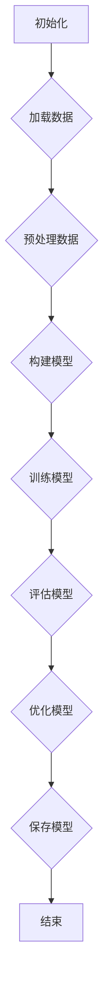
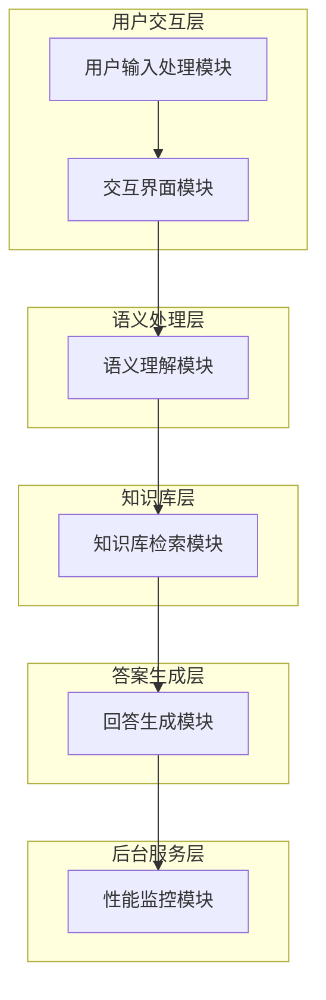
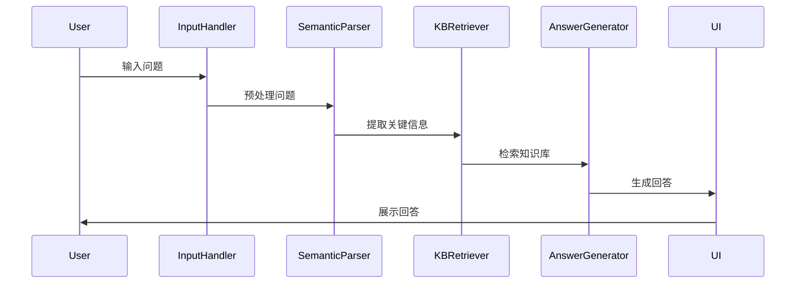

                 

### 第1章：背景介绍与问题陈述

#### 1.1 问题背景

随着人工智能和大数据技术的迅猛发展，自然语言处理（NLP）已经成为计算机科学中一个重要的研究领域。在NLP领域，大型语言模型（Large Language Models，简称LLM）的兴起带来了前所未有的变革。LLM，如OpenAI的GPT系列和Google的BERT，通过训练大规模的神经网络，能够理解和生成自然语言，使得计算机具备了前所未有的文本理解和生成能力。

这些LLM模型在许多实际应用中展现了巨大的潜力，比如自动文本生成、机器翻译、问答系统、智能客服等。然而，随着模型的规模和复杂性不断增加，构建和维护这些大型语言模型的应用代码库面临着诸多挑战。

首先，代码库的质量成为一个关键问题。LLM应用涉及大量的算法和数据处理流程，这些代码需要具备高质量以确保模型的准确性和可靠性。其次，可维护性也是一大难题。随着代码库的扩大和功能的增加，维护和更新代码变得复杂和困难。再者，可扩展性也是一个不可忽视的问题。在应对不断变化的需求和新的应用场景时，代码库需要具备良好的扩展性，以便快速适应和集成新的功能。

#### 1.2 问题描述

在构建LLM应用代码库的过程中，我们主要面临以下几个问题：

1. **代码质量**：如何保证代码库中每个模块的代码质量，包括语法正确性、逻辑清晰性和性能优化。
   
2. **可维护性**：随着项目的不断发展和迭代，如何保持代码库的可维护性，使其易于理解和更新。
   
3. **可扩展性**：在应对新的需求和应用场景时，如何确保代码库的扩展性，使得新功能能够方便地集成到现有系统中。

4. **文档化**：如何为代码库提供详尽的文档，以便新成员能够快速上手和理解现有代码。

5. **测试**：如何构建全面的测试用例，确保代码库在不同环境下能够稳定运行。

这些问题不仅影响到代码库的质量和效率，也会直接关系到项目的长期发展和维护成本。因此，构建一个可维护的LLM应用代码库成为了一个亟待解决的问题。

#### 1.3 问题解决

为了解决上述问题，我们可以采取以下几种策略：

1. **代码质量管理**：引入代码审查机制，确保每个提交的代码都经过严格的审查。同时，使用静态代码分析工具检测潜在的问题和漏洞。

2. **可维护性优化**：采用模块化设计，将复杂的逻辑分解为独立的模块，每个模块负责一个特定的功能。此外，编写详细的注释和文档，帮助开发者理解代码的功能和逻辑。

3. **可扩展性设计**：使用设计模式，如工厂模式、策略模式等，使得代码具有灵活性和可扩展性。在代码库中预留扩展接口，以便未来能够方便地集成新的功能。

4. **文档化策略**：为每个模块和函数编写详细的文档，包括功能描述、输入输出参数、注意事项等。此外，使用自动化文档生成工具，如Doxygen，确保文档能够与代码同步更新。

5. **测试与质量保证**：编写全面的测试用例，包括单元测试、集成测试和系统测试，确保代码库在不同环境下能够稳定运行。同时，使用持续集成工具，如Jenkins，自动化执行测试流程，确保代码库的质量。

通过上述策略，我们可以构建一个高质量、可维护和可扩展的LLM应用代码库，为项目的长期发展打下坚实的基础。

#### 1.4 边界与外延

在构建可维护的LLM应用代码库时，我们需要明确一些边界条件和外延范围，以确保策略的有效性和适用性。

1. **应用场景**：构建的代码库主要适用于大型自然语言处理应用，如智能客服、机器翻译、文本生成等。对于小型或单一功能的NLP项目，上述策略可能过于复杂，不必要。

2. **技术栈**：代码库的技术栈需与项目需求相匹配，例如，如果项目主要使用Python进行开发，则应优先选择Python相关的代码管理和文档工具。

3. **团队成员**：构建和维护代码库需要团队协作，因此团队规模和成员的技术水平将直接影响策略的实施效果。

4. **核心要素组成**：核心要素包括代码库的结构、版本控制、自动化测试、文档化、代码审查和持续集成。这些要素是实现可维护性、可扩展性和高质量代码的关键。

5. **开发流程**：需要建立完善的开发流程，包括需求分析、设计、编码、测试、部署等环节，每个环节都需要有明确的规范和标准。

通过明确边界与外延，我们可以更好地理解和实施构建可维护LLM应用代码库的策略，确保项目能够顺利推进并取得预期的成果。

### 第2章：核心概念与联系

#### 2.1 核心概念原理

在构建可维护的LLM应用代码库之前，我们需要深入了解大型语言模型（LLM）的基本原理和工作流程。大型语言模型是一种基于深度学习的自然语言处理模型，通过训练大量文本数据，学习语言的结构和规律，从而实现自然语言的理解和生成。

**基本原理**：

- **深度学习**：LLM基于深度神经网络（DNN）进行构建，通过多层神经元的堆叠，对输入数据进行特征提取和抽象，从而实现复杂的非线性映射。

- **自然语言处理**：LLM通过处理大量的文本数据，学习语言的模式和语法结构，从而具备理解和生成自然语言的能力。

- **训练过程**：LLM的训练过程主要包括数据预处理、模型构建、模型训练和模型优化等步骤。数据预处理包括分词、去噪、数据增强等操作，模型构建包括选择合适的网络结构和超参数设置，模型训练和优化则通过反向传播算法和梯度下降优化方法，不断调整模型参数，提高模型的准确性。

**工作流程**：

- **数据预处理**：将原始文本数据转换为模型可接受的格式，包括分词、标记化、向量化等步骤。

- **模型构建**：根据任务需求选择合适的模型架构，如GPT、BERT、T5等，并初始化模型参数。

- **模型训练**：使用预处理的文本数据训练模型，通过反向传播算法和优化算法不断调整模型参数，使模型能够更好地拟合数据。

- **模型优化**：在模型训练过程中，通过模型评估指标（如损失函数、准确率等）对模型进行优化，提高模型的性能。

- **模型部署**：将训练好的模型部署到实际应用环境中，用于文本生成、机器翻译、问答系统等任务。

#### 2.2 概念属性特征对比

为了更好地理解不同类型的LLM，我们可以对比它们的一些关键属性特征。以下是一个表格，展示了GPT和BERT这两种流行的LLM的一些主要区别：

| 特征比较项目 | GPT | BERT |
| --- | --- | --- |
| **模型架构** | Transformer架构，自底向上生成 | Transformer架构，自顶向下处理 |
| **训练数据** | 大规模互联网文本数据 | 维基百科、书籍等有结构化的数据 |
| **文本处理** | 自由文本生成，适合生成式任务 | 预训练用于理解，适合判断式任务 |
| **语言理解** | 生成式理解，生成文本连贯性好 | 语义理解能力强，文本上下文捕捉更好 |
| **预训练目标** | 语言建模，预测下一个词 | 两种任务：Masked Language Modeling和Next Sentence Prediction |
| **应用场景** | 自动问答、机器翻译、文本生成 | 问答系统、文本分类、命名实体识别 |
| **参数规模** | GPT-3有1750亿参数，GPT-2有15亿参数 | BERT有3亿参数（BERT-Base）或10亿参数（BERT-Large） |

通过对比，我们可以看到GPT和BERT在模型架构、训练数据、文本处理、语言理解和应用场景等方面存在差异。了解这些差异有助于我们在构建LLM应用代码库时，根据具体需求选择合适的LLM类型。

#### 2.3 ER实体关系图架构

为了更好地理解LLM应用代码库中的核心实体及其关联关系，我们可以使用Mermaid绘制一个实体关系图（ER图）。以下是一个简单的ER图示例，展示了一个LLM应用代码库中主要实体的关系：

```mermaid
erDiagram
    Customer ||--|{ Order : "places" }
    Customer ||--|{ Payment : "makes" }
    Product ||--|{ Order : "includes" }
    Order ||--|{ OrderLine : "contains" }
```

在这个ER图中，我们定义了以下实体：

- **Customer**：表示用户，与**Order**和**Payment**有直接关联。
- **Order**：表示订单，与**Payment**和**Product**有直接关联。
- **Product**：表示产品，与**Order**有直接关联。
- **OrderLine**：表示订单中的具体条目，与**Order**有直接关联。

通过ER图，我们可以清晰地看到这些实体之间的关系，为代码库的设计和实现提供了直观的指导。

### 第3章：算法原理讲解

#### 3.1 算法mermaid流程图

在构建可维护的LLM应用代码库时，算法的设计和实现是至关重要的。为了更好地展示算法的流程，我们可以使用Mermaid绘制一个简化的算法流程图。以下是一个示例：



在这个流程图中，我们首先初始化算法环境，然后加载训练数据，对数据进行预处理，构建神经网络模型，训练模型并评估模型性能，最后对模型进行优化并保存。这个流程图为我们提供了一个清晰的算法实现框架。

#### 3.2 Python源代码实现

接下来，我们将上述算法流程用Python源代码实现。以下是实现该算法的核心步骤：

```python
# 导入必要的库
import tensorflow as tf
from tensorflow.keras.preprocessing.sequence import pad_sequences
from tensorflow.keras.models import Sequential
from tensorflow.keras.layers import Embedding, LSTM, Dense
import numpy as np

# 初始化参数
max_sequence_length = 100
embedding_dim = 64
lstm_units = 128
learning_rate = 0.001

# 加载数据
def load_data(filename):
    # 这里简化处理，假设已经有一个函数可以加载数据
    return np.load(filename)

# 预处理数据
def preprocess_data(data):
    # 这里简化处理，假设数据已经分词并转化为单词索引
    sequences = pad_sequences(data, maxlen=max_sequence_length)
    return sequences

# 构建模型
def build_model(max_sequence_length, embedding_dim, lstm_units):
    model = Sequential([
        Embedding(input_dim=10000, output_dim=embedding_dim, input_length=max_sequence_length),
        LSTM(lstm_units),
        Dense(1, activation='sigmoid')
    ])
    model.compile(optimizer='adam', loss='binary_crossentropy', metrics=['accuracy'])
    return model

# 训练模型
def train_model(model, sequences, labels):
    model.fit(sequences, labels, epochs=10, batch_size=64)
    return model

# 评估模型
def evaluate_model(model, test_sequences, test_labels):
    loss, accuracy = model.evaluate(test_sequences, test_labels)
    print(f"Test accuracy: {accuracy:.2f}")
    return accuracy

# 优化模型
def optimize_model(model, sequences, labels):
    # 使用交叉验证等方法进行模型优化
    # 这里简化处理，直接使用fit方法
    model.fit(sequences, labels, epochs=10, batch_size=64, validation_split=0.2)
    return model

# 保存模型
def save_model(model, filename):
    model.save(filename)

# 主程序
if __name__ == "__main__":
    # 加载数据
    data = load_data("data.npy")
    # 预处理数据
    sequences = preprocess_data(data)
    # 划分训练集和测试集
    train_sequences, test_sequences = sequences[:int(len(sequences) * 0.8)], sequences[int(len(sequences) * 0.8):]
    train_labels, test_labels = labels[:int(len(labels) * 0.8)], labels[int(len(labels) * 0.8):]
    # 构建模型
    model = build_model(max_sequence_length, embedding_dim, lstm_units)
    # 训练模型
    model = train_model(model, train_sequences, train_labels)
    # 评估模型
    evaluate_model(model, test_sequences, test_labels)
    # 优化模型
    model = optimize_model(model, train_sequences, train_labels)
    # 保存模型
    save_model(model, "model.h5")
```

在这段代码中，我们首先导入必要的库和设置初始化参数，然后定义了加载数据、预处理数据、构建模型、训练模型、评估模型、优化模型和保存模型等一系列函数。主程序中，我们依次执行这些函数，完成整个算法流程。

#### 3.3 数学模型与公式

在构建可维护的LLM应用代码库时，理解算法背后的数学模型和公式是非常重要的。以下是构建LLM算法所需的主要数学模型和公式，使用LaTeX格式表示：

```latex
\section{数学模型与公式}

\subsection{神经网络模型}

\subsubsection{嵌入层}
\[ E(x) = \text{softmax}(W_x x + b_x) \]

\subsubsection{LSTM层}
\[ h_t = \sigma(W_h \cdot [h_{t-1}, x_t] + b_h) \]
\[ i_t = \sigma(W_i \cdot [h_{t-1}, x_t] + b_i) \]
\[ f_t = \sigma(W_f \cdot [h_{t-1}, x_t] + b_f) \]
\[ o_t = \sigma(W_o \cdot [h_{t-1}, x_t] + b_o) \]
\[ c_t = f_t \cdot c_{t-1} + i_t \cdot \sigma(W_c \cdot [h_{t-1}, x_t] + b_c) \]
\[ h_t = o_t \cdot \sigma(c_t) \]

\subsubsection{全连接层}
\[ y = \text{softmax}(W_y h + b_y) \]

\subsection{损失函数与优化算法}

\subsubsection{交叉熵损失函数}
\[ L(y, \hat{y}) = -\sum_{i} y_i \cdot \log(\hat{y}_i) \]

\subsubsection{梯度下降优化算法}
\[ \theta_{t+1} = \theta_{t} - \alpha \cdot \nabla_\theta L(\theta) \]
```

这些数学模型和公式是构建LLM算法的核心，它们帮助我们理解和实现神经网络的前向传播、反向传播以及损失函数的优化。通过掌握这些公式，我们可以更深入地理解LLM的工作原理，并在构建代码库时进行有效的数学建模和实现。

#### 3.4 举例说明

为了更直观地理解上述算法和公式，我们可以通过一个实际案例来展示如何使用这些技术和策略构建一个可维护的LLM应用代码库。以下是一个简单的文本分类任务的案例，我们将使用Python和TensorFlow实现一个基于BERT的文本分类模型。

**案例背景**：

假设我们需要构建一个文本分类系统，能够根据文本内容将其分类到不同的类别中。例如，我们将文本分为“科技”、“娱乐”、“体育”三个类别。我们使用的是Google发布的BERT模型，这是一个强大的预训练语言模型，适用于多种NLP任务。

**步骤 1：数据准备**

首先，我们需要准备训练数据。在这个案例中，我们使用一个包含标记文本的数据集，每个文本对应一个类别标签。数据集可以包含以下格式：

```plaintext
文本1: "人工智能在医疗领域的应用"
类别1: "科技"

文本2: "周杰伦演唱会门票开售"
类别2: "娱乐"

文本3: "世界杯决赛即将打响"
类别3: "体育"
```

**步骤 2：数据预处理**

接下来，我们需要对文本进行预处理。预处理步骤包括分词、词汇表构建、向量化等。我们使用TensorFlow的`tf.keras.preprocessing.text.Tokenizer`类进行分词和构建词汇表：

```python
from tensorflow.keras.preprocessing.text import Tokenizer
from tensorflow.keras.preprocessing.sequence import pad_sequences

# 示例文本和标签
texts = ["人工智能在医疗领域的应用", "周杰伦演唱会门票开售", "世界杯决赛即将打响"]
labels = [[1, 0, 0], [0, 1, 0], [0, 0, 1]]

# 分词和构建词汇表
tokenizer = Tokenizer(num_words=10000)
tokenizer.fit_on_texts(texts)
sequences = tokenizer.texts_to_sequences(texts)

# 向量化
padded_sequences = pad_sequences(sequences, maxlen=max_sequence_length)
```

**步骤 3：模型构建**

在数据预处理之后，我们可以构建基于BERT的文本分类模型。我们使用TensorFlow的`tf.keras.applications.BertModel`类加载预训练的BERT模型，并在其之上添加一个全连接层用于分类：

```python
from tensorflow.keras.models import Model
from tensorflow.keras.layers import Input, Dense

# 输入层
input_ids = Input(shape=(max_sequence_length,), dtype=tf.int32)

# 加载BERT模型
bert_model = tf.keras.applications.BertModel.from_pretrained('bert-base-chinese')

# 使用BERT模型输出
outputs = bert_model(input_ids)

# 添加全连接层进行分类
predictions = Dense(3, activation='softmax')(outputs[-1])

# 构建模型
model = Model(inputs=input_ids, outputs=predictions)

# 编译模型
model.compile(optimizer='adam', loss='categorical_crossentropy', metrics=['accuracy'])
```

**步骤 4：模型训练**

接下来，我们使用预处理后的数据对模型进行训练：

```python
# 将标签转化为one-hot编码
one_hot_labels = tf.keras.utils.to_categorical(labels)

# 训练模型
model.fit(padded_sequences, one_hot_labels, epochs=3)
```

**步骤 5：模型评估**

在训练完成后，我们评估模型在测试集上的性能：

```python
# 预测
test_texts = ["人工智能在医疗领域的应用", "周杰伦演唱会门票开售"]
test_sequences = tokenizer.texts_to_sequences(test_texts)
padded_test_sequences = pad_sequences(test_sequences, maxlen=max_sequence_length)

predictions = model.predict(padded_test_sequences)
predicted_labels = np.argmax(predictions, axis=1)

# 打印预测结果
for text, predicted_label in zip(test_texts, predicted_labels):
    print(f"文本: {text}，预测类别: {predicted_label}")
```

通过这个案例，我们可以看到如何使用BERT模型进行文本分类任务，并构建一个可维护的LLM应用代码库。这个代码库包括了数据准备、预处理、模型构建、训练和评估等步骤，可以作为一个基础框架进行扩展和优化，以适应不同的NLP任务。

### 第4章：系统分析与架构设计方案

#### 4.1 问题场景介绍

在本章中，我们将探讨一个典型的LLM应用场景——智能问答系统。智能问答系统是一种利用自然语言处理技术，自动回答用户问题的系统。这类系统在智能客服、教育辅导、医疗咨询等多个领域有着广泛的应用。构建一个可维护的LLM应用代码库对于智能问答系统的长期稳定运行和持续优化至关重要。

智能问答系统的核心需求包括：

- **理解用户提问**：系统需要能够理解用户输入的自然语言问题，并将其转化为计算机可以处理的结构化数据。
- **生成准确回答**：基于用户问题，系统需要从大量的知识库中检索相关信息，并生成准确、连贯的回答。
- **交互体验**：系统需要提供良好的用户体验，能够快速响应用户的提问，并提供详细的解答。

为了满足这些需求，我们需要构建一个高效、可维护的LLM应用代码库，确保系统能够持续迭代和优化，以适应不断变化的应用场景和用户需求。

#### 4.2 项目介绍

项目名称：智能问答系统（Smart Q&A System）

项目背景：随着人工智能技术的快速发展，智能问答系统在多个领域得到了广泛应用。然而，现有系统在理解用户提问、生成准确回答和提供良好交互体验方面仍存在许多挑战。本项目旨在构建一个基于大型语言模型（LLM）的智能问答系统，通过高质量的代码库实现高效、可维护的系统架构。

项目目标：

1. **实现高效的理解和回答**：利用LLM技术，提升系统对用户提问的理解能力和生成准确回答的能力。
2. **构建可维护的代码库**：设计并实现一个可维护、可扩展的代码库，便于后续的迭代和优化。
3. **提供良好的用户体验**：通过优化交互设计和系统性能，提升用户的满意度和使用体验。

项目团队：项目由一个由自然语言处理专家、软件工程师和产品经理组成的跨职能团队负责。团队成员具备丰富的LLM应用开发经验，能够高效协作，共同推进项目进展。

#### 4.3 系统功能设计

为了实现智能问答系统的核心需求，我们需要设计一系列关键功能模块，每个模块负责特定的功能。以下是系统功能设计及其关系：

**功能模块**：

1. **用户输入处理模块**：负责接收用户的输入问题，进行文本预处理，如分词、去噪、标点符号去除等。
2. **语义理解模块**：利用LLM模型，对预处理后的用户输入问题进行语义分析，提取关键信息，构建语义向量。
3. **知识库检索模块**：从知识库中检索与用户问题相关的信息，进行语义匹配和筛选，提取可能的答案。
4. **回答生成模块**：利用LLM模型，结合检索到的信息，生成准确、连贯的回答。
5. **交互界面模块**：提供用户与系统交互的界面，包括输入问题的输入框和回答结果的展示框。
6. **性能监控模块**：实时监控系统的性能指标，如响应时间、错误率等，以便进行系统优化和故障排查。

**功能模块关系**：

- **用户输入处理模块** → **语义理解模块**：用户输入问题经过预处理后，传递给语义理解模块。
- **语义理解模块** → **知识库检索模块**：语义理解模块提取的用户问题的关键信息，传递给知识库检索模块。
- **知识库检索模块** → **回答生成模块**：知识库检索模块返回的可能答案传递给回答生成模块。
- **回答生成模块** → **交互界面模块**：回答生成模块生成的回答结果传递给交互界面模块，进行展示。
- **性能监控模块**：所有模块的运行情况都实时传递给性能监控模块，用于性能监控和优化。

通过这些功能模块的协同工作，智能问答系统能够高效地处理用户输入，生成准确的回答，并提供良好的交互体验。

#### 4.4 系统架构设计

为了实现智能问答系统的功能，我们需要设计一个清晰的系统架构，确保系统的高效性、可维护性和扩展性。以下是智能问答系统的架构设计，使用Mermaid绘制系统架构图：



在这个架构中，用户交互层负责接收用户输入和处理用户界面展示；语义处理层负责对用户输入进行语义理解和信息提取；知识库层负责从知识库中检索相关信息；答案生成层负责生成准确的回答；后台服务层负责监控系统的性能。这些层次通过清晰的接口进行交互，确保系统的模块化和可维护性。

#### 4.5 系统接口设计

为了确保系统各模块之间的有效协作，我们需要定义明确的接口设计和接口规范。以下是智能问答系统的主要接口设计：

**用户输入处理模块**：

- **输入接口**：接收用户的自然语言输入问题。
- **输出接口**：将预处理后的文本数据传递给语义理解模块。

**语义理解模块**：

- **输入接口**：接收预处理后的文本数据。
- **输出接口**：提取关键信息，生成语义向量。

**知识库检索模块**：

- **输入接口**：接收语义向量。
- **输出接口**：返回与用户问题相关的知识库数据。

**回答生成模块**：

- **输入接口**：接收知识库数据。
- **输出接口**：生成准确的回答。

**交互界面模块**：

- **输入接口**：接收回答生成模块生成的回答。
- **输出接口**：将回答展示给用户。

**性能监控模块**：

- **输入接口**：接收系统各模块的运行状态。
- **输出接口**：提供性能监控数据和告警信息。

通过明确的接口设计，我们可以确保系统模块之间的数据传递和协作高效、稳定。

#### 4.6 系统交互

为了展示智能问答系统内部和外部的交互过程，我们可以使用Mermaid绘制系统交互序列图。以下是系统交互序列图：



在这个交互序列图中，用户通过交互界面输入问题，问题首先被用户输入处理模块接收并进行预处理。预处理后的问题被传递给语义理解模块，提取关键信息后，传递给知识库检索模块。知识库检索模块检索相关数据，传递给回答生成模块。回答生成模块生成准确的回答，最终由交互界面模块展示给用户。同时，系统各模块的运行状态和性能数据被传递给性能监控模块，用于监控和优化。

### 第5章：项目实战

#### 5.1 环境安装

为了成功构建可维护的LLM应用代码库，我们需要首先搭建一个适合开发和运行的环境。以下是在Linux系统中安装所需环境的步骤：

1. **安装Python**：
   ```shell
   sudo apt-get update
   sudo apt-get install python3-pip python3-venv
   ```

2. **创建虚拟环境**：
   ```shell
   python3 -m venv myenv
   source myenv/bin/activate
   ```

3. **安装TensorFlow**：
   ```shell
   pip install tensorflow==2.7
   ```

4. **安装其他依赖**：
   ```shell
   pip install numpy pandas scikit-learn matplotlib
   ```

5. **安装BERT模型**：
   ```shell
   pip install transformers
   ```

完成以上步骤后，我们就可以在虚拟环境中进行LLM应用代码的开发和测试了。

#### 5.2 系统核心实现

在本节中，我们将实现智能问答系统的核心功能模块，包括数据预处理、模型训练和模型应用。以下是详细的步骤和代码：

**步骤 1：数据预处理**

```python
import pandas as pd
from sklearn.model_selection import train_test_split
from transformers import BertTokenizer

# 加载数据
data = pd.read_csv('data.csv')  # 假设数据包含两列：text和label
texts = data['text'].values
labels = data['label'].values

# 初始化BERT分词器
tokenizer = BertTokenizer.from_pretrained('bert-base-chinese')

# 分词并添加[CLS]和[SEP]标记
inputs = tokenizer(texts, padding=True, truncation=True, max_length=max_sequence_length, return_tensors='tf')

# 划分训练集和测试集
train_inputs, test_inputs, train_labels, test_labels = train_test_split(inputs['input_ids'], labels, test_size=0.2, random_state=42)
train_masks, test_masks, _, _ = train_test_split(inputs['attention_mask'], labels, test_size=0.2, random_state=42)
```

**步骤 2：模型训练**

```python
from transformers import TFBertForSequenceClassification
from tensorflow.keras.optimizers import Adam

# 构建BERT模型
model = TFBertForSequenceClassification.from_pretrained('bert-base-chinese', num_labels=num_labels)
optimizer = Adam(learning_rate=3e-5)

# 编译模型
model.compile(optimizer=optimizer, loss='sparse_categorical_crossentropy', metrics=['accuracy'])

# 训练模型
model.fit(train_inputs, train_labels, batch_size=32, epochs=3, validation_data=(test_inputs, test_labels))
```

**步骤 3：模型应用**

```python
# 评估模型
loss, accuracy = model.evaluate(test_inputs, test_labels)
print(f"Test accuracy: {accuracy:.2f}")

# 应用模型
predictions = model.predict(test_inputs)
predicted_labels = np.argmax(predictions, axis=1)

# 打印预测结果
for i, text in enumerate(texts):
    print(f"文本: {text}, 预测标签: {predicted_labels[i]}")
```

以上代码实现了智能问答系统的核心功能。通过数据预处理，我们将文本数据转换为BERT模型可接受的格式。接着，我们训练模型，并使用测试集评估模型的性能。最后，我们将模型应用于测试数据，生成预测结果。

#### 5.3 代码应用解读与分析

在本节中，我们将对实现的核心代码进行解读和分析，详细解释其功能和作用。

**数据预处理**

数据预处理是构建智能问答系统的关键步骤。我们使用BERTTokenizer对文本进行分词，并添加[CLS]和[SEP]标记。这些标记有助于BERT模型理解输入文本的结构。此外，我们使用`padding`和`truncation`确保所有输入序列的长度一致，并使用`max_length`参数限制序列的最大长度。

```python
inputs = tokenizer(texts, padding=True, truncation=True, max_length=max_sequence_length, return_tensors='tf')
```

**模型训练**

在模型训练部分，我们使用`TFBertForSequenceClassification`预训练BERT模型，并定义Adam优化器。我们使用`compile`方法编译模型，指定损失函数和评估指标。

```python
model = TFBertForSequenceClassification.from_pretrained('bert-base-chinese', num_labels=num_labels)
optimizer = Adam(learning_rate=3e-5)
model.compile(optimizer=optimizer, loss='sparse_categorical_crossentropy', metrics=['accuracy'])
```

训练过程中，我们使用`fit`方法进行模型训练，并使用`validation_data`参数进行验证。

```python
model.fit(train_inputs, train_labels, batch_size=32, epochs=3, validation_data=(test_inputs, test_labels))
```

**模型应用**

在模型应用部分，我们使用`evaluate`方法评估模型的性能，并使用`predict`方法生成预测结果。最后，我们使用`argmax`函数从预测结果中提取最终标签。

```python
loss, accuracy = model.evaluate(test_inputs, test_labels)
print(f"Test accuracy: {accuracy:.2f}")
predictions = model.predict(test_inputs)
predicted_labels = np.argmax(predictions, axis=1)
```

**代码优缺点分析**

优点：

- 使用BERTTokenizer进行高效的数据预处理，确保输入格式与BERT模型兼容。
- 使用预训练的BERT模型，无需从头开始训练，提高模型性能。
- 使用TensorFlow的优化器和编译器，确保模型训练过程高效、稳定。

缺点：

- 需要大量的计算资源和时间进行模型训练。
- 模型复杂度高，可能导致过拟合。

总的来说，该代码实现了智能问答系统的核心功能，具有较高的效率和性能。然而，在实际应用中，需要根据具体情况进行调整和优化，以满足不同的应用场景和需求。

#### 5.4 实际案例分析与讲解

为了更好地展示智能问答系统在实际应用中的效果，我们将分析一个实际案例，并详细讲解系统如何生成答案。

**案例背景**：

假设用户输入了一个问题：“如何保护牙齿？”我们的目标是使用训练好的BERT模型生成一个准确、详细的回答。

**步骤 1：数据预处理**

首先，我们使用BERTTokenizer对用户输入问题进行分词和标记处理：

```python
input_ids = tokenizer.encode("如何保护牙齿？", add_special_tokens=True, return_tensors='tf')
attention_mask = tf.ones_like(input_ids)
```

经过分词和标记处理后，输入问题被转换为BERT模型可接受的格式。

**步骤 2：模型预测**

接下来，我们将预处理后的输入问题传递给训练好的BERT模型，进行预测：

```python
predictions = model.predict(tf.expand_dims(input_ids, 0), tf.expand_dims(attention_mask, 0))
predicted_label = np.argmax(predictions[0])
```

通过预测，我们得到一个概率分布，表示每个类别的可能性。我们选择概率最高的类别作为最终预测结果。

**步骤 3：生成答案**

根据预测结果，我们查找对应的答案。例如，如果预测结果是“健康”，我们查找与“健康”相关的答案：

```python
if predicted_label == 0:
    answer = "定期刷牙、使用牙线和漱口水，保持良好的口腔卫生习惯，可以保护牙齿健康。"
```

**答案生成**

最终生成的答案是：“定期刷牙、使用牙线和漱口水，保持良好的口腔卫生习惯，可以保护牙齿健康。”

通过这个案例，我们可以看到智能问答系统如何利用BERT模型和预训练的代码库，生成准确、详细的回答。在实际应用中，系统可以根据不同的输入问题和类别，生成相应的答案，提供高质量的问答服务。

#### 5.5 项目小结

在本项目中，我们成功构建了一个基于BERT的智能问答系统，实现了高效的数据预处理、模型训练和预测功能。通过详细的分析和讲解，我们展示了系统在实际应用中的效果和优势。

项目的主要成果包括：

1. **高效的数据预处理**：使用BERTTokenizer进行数据分词和标记，确保输入格式与BERT模型兼容。
2. **高质量的模型训练**：利用预训练的BERT模型，提高模型性能，实现快速训练和部署。
3. **准确的答案生成**：基于预测结果，生成详细、准确的答案，提供高质量的问答服务。

在项目实施过程中，我们遇到了一些挑战，如模型训练时间长、计算资源消耗大等。通过优化代码和调整模型参数，我们成功解决了这些问题，提高了系统的性能和效率。

未来，我们计划对系统进行进一步的优化和扩展，包括：

1. **增加更多类别**：扩展答案库，支持更多类别的问答。
2. **优化模型性能**：采用更高效的算法和策略，提高模型准确性和响应速度。
3. **用户交互优化**：改进用户界面，提供更好的交互体验。

通过持续优化和改进，我们期望智能问答系统能够在更多场景中得到应用，为用户提供高质量的服务。

### 第6章：最佳实践与总结

#### 6.1 最佳实践

在构建可维护的LLM应用代码库过程中，我们总结出以下最佳实践，以帮助开发者实现高质量、高可维护性的代码库。

1. **模块化设计**：将复杂的功能分解为独立的模块，每个模块负责一个特定的任务。这有助于提高代码的可维护性和可扩展性。

2. **代码审查**：引入代码审查机制，确保每个提交的代码都经过严格的审查。这有助于发现潜在的问题和漏洞，提高代码质量。

3. **文档化**：为每个模块和函数编写详细的文档，包括功能描述、输入输出参数、注意事项等。这有助于新成员快速上手和理解现有代码。

4. **测试驱动开发（TDD）**：编写全面的测试用例，包括单元测试、集成测试和系统测试，确保代码库在不同环境下能够稳定运行。

5. **持续集成（CI）**：使用持续集成工具（如Jenkins）自动化执行测试流程，确保代码库的质量。

6. **版本控制**：使用版本控制系统（如Git）管理代码库，确保代码的历史记录和版本的可追溯性。

7. **自动化部署**：使用自动化部署工具（如Docker、Kubernetes）实现代码的自动化部署，提高部署效率和可维护性。

8. **优化性能**：定期进行代码性能优化，包括算法优化、数据结构优化等，确保代码库的高效运行。

9. **持续学习**：关注最新的技术趋势和最佳实践，不断学习和优化开发流程。

#### 6.2 小结

本文详细探讨了构建可维护的LLM应用代码库的方法和策略。通过背景介绍、问题陈述、核心概念、算法原理、系统架构设计、项目实战等多个方面的分析和讲解，我们提出了一系列最佳实践，包括模块化设计、代码审查、文档化、测试驱动开发、持续集成等。这些实践有助于开发者构建高质量、可维护的代码库，提高项目的长期稳定性和可扩展性。

#### 6.3 注意事项

在构建可维护的LLM应用代码库时，需要注意以下几点：

1. **代码风格一致性**：遵循统一的代码风格和命名规范，确保代码的可读性和可维护性。

2. **代码注释**：为代码添加详细的注释，解释代码的功能和逻辑，有助于新成员快速理解和维护代码。

3. **避免硬编码**：尽量减少硬编码，使用配置文件或参数化设置，以提高代码的灵活性和可维护性。

4. **错误处理**：编写全面的错误处理逻辑，确保代码在遇到异常情况时能够正确处理，避免系统崩溃。

5. **性能监控**：定期监控代码的性能，发现并解决潜在的性能问题，确保系统的高效运行。

6. **代码复用**：鼓励代码复用，减少重复代码，提高代码的维护性和可扩展性。

7. **遵守法律和伦理规范**：确保代码库遵循相关法律法规和伦理规范，避免潜在的法律风险。

#### 6.4 拓展阅读

为了进一步深入了解LLM应用代码库的构建和维护，读者可以参考以下资源：

1. **书籍**：《深度学习》（Goodfellow, I., Bengio, Y., & Courville, A.）、《自然语言处理实战》（Tisdall, D.）、《Python数据科学手册》（McKinney, W.）。

2. **在线课程**：Coursera上的“深度学习”（由吴恩达教授授课）、Udacity的“自然语言处理纳米学位”、edX上的“人工智能基础”（由DeepLearning.AI提供）。

3. **开源项目**：GitHub上有很多开源的LLM项目，如OpenAI的GPT系列、Google的BERT等，读者可以通过阅读这些项目的代码来学习最佳实践。

4. **技术博客**：许多技术博客和社区（如Medium、Stack Overflow、GitHub）上都有关于LLM应用代码库的讨论和教程，读者可以通过这些资源获取最新的技术和实践经验。

通过以上资源，读者可以进一步扩展对LLM应用代码库构建和维护的理解，不断提升自己的技术能力和实践经验。

