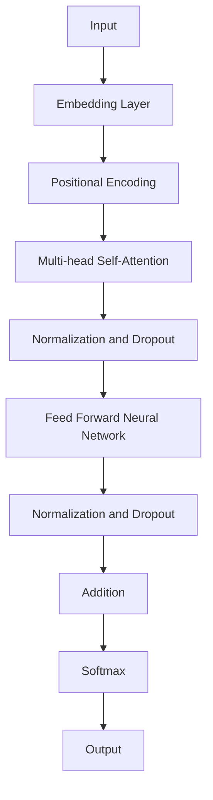
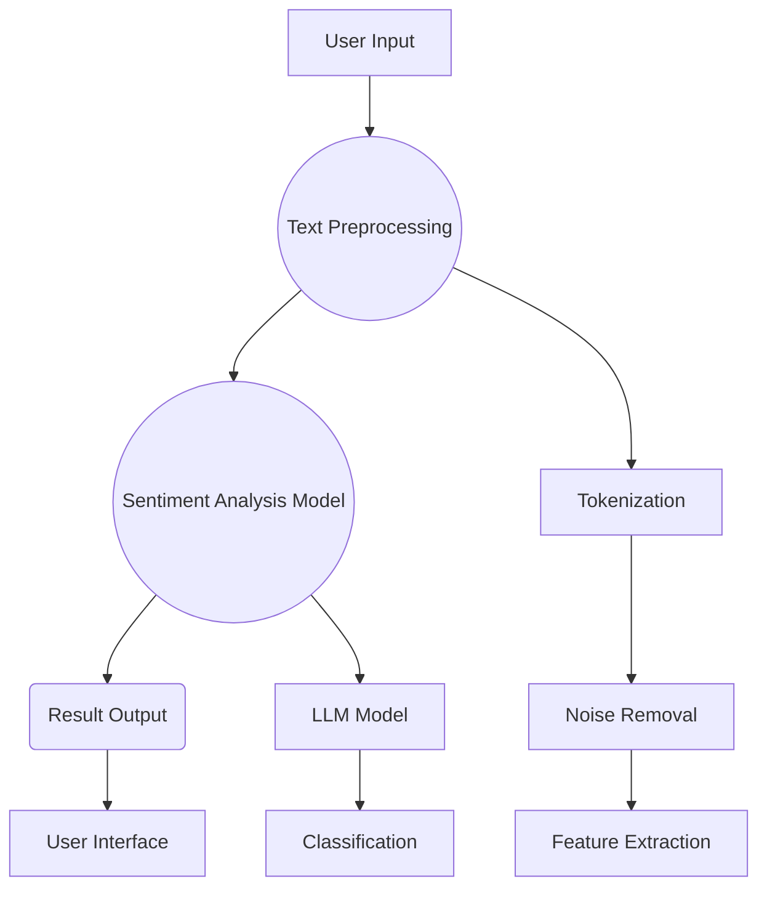
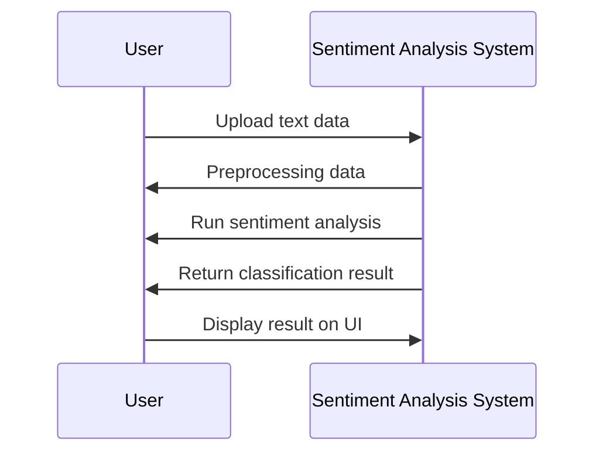

                 

### 引言与背景

**一、研究背景**

**1.1 语言模型（LLM）的发展历史**

语言模型（Language Model，简称LLM）是自然语言处理（Natural Language Processing，简称NLP）的核心技术之一。自20世纪50年代以来，语言模型的发展经历了从规则驱动到统计模型，再到深度学习模型的演变过程。早期，语言模型主要通过基于规则的语法分析方法构建，这些方法依赖于语言学家的知识和经验，但在处理复杂语言现象时效果不佳。

随着计算能力的提升和大数据技术的发展，统计模型逐渐成为主流。1980年代，N-gram模型在语言建模领域取得了显著成果。N-gram模型通过统计词组出现的频率来预测下一个词，但这种方法的局限性在于它无法捕捉到语言的长距离依赖关系。

进入21世纪，深度学习模型的出现为语言模型的研究带来了新的突破。2013年，谷歌推出了基于深度神经网络的词向量模型Word2Vec，它通过将词语映射到高维向量空间中，显著提升了语言建模的效果。随后，序列到序列（Sequence-to-Sequence）模型、注意力机制（Attention Mechanism）和变换器（Transformer）模型等相继出现，进一步推动了语言模型的发展。

**1.2 LLM在应用中的挑战**

随着语言模型的不断发展，其在各个领域的应用也越来越广泛。然而，LLM在应用过程中也面临着诸多挑战：

1. **计算资源需求大：** 大型语言模型如GPT-3、LLaMA等需要大量的计算资源和存储空间，这对部署和运行提出了很高的要求。

2. **数据隐私和安全问题：** 语言模型训练过程中需要大量数据，如何确保数据隐私和安全是一个亟待解决的问题。

3. **模型解释性和可解释性：** 语言模型的决策过程往往是非透明的，这给模型的解释和验证带来了困难。

4. **模型的可维护性：** 随着语言模型的应用场景不断扩大，如何构建可维护的代码库成为开发者和研究者面临的一个重要挑战。

**1.3 维护性代码库的重要性**

维护性代码库是保证LLM应用长期稳定运行的基础。一个良好的维护性代码库应具备以下特点：

1. **可读性：** 代码应该具有良好的结构，易于理解和阅读。

2. **可扩展性：** 代码应具有模块化设计，方便添加新功能和功能扩展。

3. **可测试性：** 代码应具备完善的测试用例，确保每个模块的功能正常。

4. **文档齐全：** 代码库应附带详细的文档，包括代码注释、使用说明和示例代码。

5. **版本控制：** 使用版本控制系统（如Git）来管理代码库，方便代码的版本管理和协同开发。

**二、书籍目的与结构**

本书旨在帮助开发者构建可维护的LLM应用代码库，通过系统性地介绍LLM的基本概念、数学模型、算法原理以及最佳实践，使读者能够理解和应用这些知识，解决实际开发中的问题。

本书的结构分为以下几个部分：

1. **第一部分：引言与背景**，介绍LLM的发展历程、应用挑战以及维护性代码库的重要性。

2. **第二部分：核心概念与理论**，详细讲解LLM的基本概念、数学模型和算法原理。

3. **第三部分：实践与案例**，通过具体案例和实践，展示如何构建和维护LLM应用代码库。

4. **第四部分：最佳实践与总结**，提供最佳实践建议，总结本书的主要内容，并展望未来发展方向。

**三、阅读对象**

本书适合以下读者群体：

1. **自然语言处理（NLP）领域的研究生和博士生**，作为教材或参考书。
2. **软件开发工程师和AI工程师**，希望了解LLM在应用中的实现和部署。
3. **计算机科学和人工智能爱好者**，对LLM技术和代码库构建感兴趣。

**四、书籍结构概述**

1. **第1章：引言**，介绍本书的研究背景、目的和结构。
2. **第2章：语言模型基础**，讲解LLM的基本概念、工作原理和维护性代码库的关键特性。
3. **第3章：数学模型与算法**，介绍LLM的数学模型和算法原理，并提供示例代码。
4. **第4章：实践案例**，通过具体案例展示LLM应用代码库的构建过程。
5. **第5章：最佳实践**，提供构建可维护LLM应用代码库的最佳实践和建议。
6. **第6章：总结与展望**，总结本书的主要内容，讨论未来发展方向。

### 本章小结

本章首先介绍了LLM的发展历程和应用挑战，强调了维护性代码库在LLM应用中的重要性。随后，阐述了本书的研究目的和结构，明确了本书的阅读对象和结构安排。通过本章的阅读，读者可以初步了解LLM的基本概念和本书的主要内容，为后续章节的学习奠定基础。

## 第二部分：核心概念与理论

### 第2章：语言模型基础

**一、语言模型的基本概念**

**1.1 语言模型的定义**

语言模型是一种用于预测文本序列的概率分布的模型。具体来说，它是一个能够根据前面的输入文本序列预测下一个单词或字符的概率分布函数。在自然语言处理中，语言模型是生成文本、语音识别、机器翻译等任务的基础。

**1.2 语言模型的分类**

1. **N-gram模型：** 基于词汇序列的统计模型，通过统计前N个词（N-gram）出现的频率来预测下一个词。
2. **概率模型：** 包括隐马尔可夫模型（HMM）和条件概率模型等，通过概率计算来预测文本序列。
3. **生成模型：** 包括变分自编码器（VAE）、生成对抗网络（GAN）等，通过生成数据来模拟语言分布。
4. **对比模型：** 包括Transformer、BERT等，通过对比学习来提高语言建模的效果。

**二、语言模型的工作原理**

**2.1 概率模型**

概率模型通过统计文本数据中的词频和条件概率来预测下一个词。常见的概率模型有：

1. **N-gram模型：** 通过统计N个连续单词的概率分布来预测下一个单词。
2. **隐马尔可夫模型（HMM）：** 通过状态转移概率和观测概率来预测文本序列。

**2.2 生成模型**

生成模型通过生成数据来模拟语言分布。常见的生成模型有：

1. **变分自编码器（VAE）：** 通过概率密度函数来生成数据，并优化生成数据的概率分布。
2. **生成对抗网络（GAN）：** 通过生成器和判别器的对抗训练来生成逼真的数据。

**2.3 对比模型**

对比模型通过对比不同文本序列来提高语言建模的效果。常见的对比模型有：

1. **Transformer：** 通过自注意力机制来捕捉文本序列中的长距离依赖关系。
2. **BERT：** 通过双向编码器来学习文本序列的上下文信息。

**三、维护性代码库的关键特性**

**3.1 可读性**

良好的可读性是维护性代码库的基础。代码应具有良好的结构、清晰的注释和规范的命名习惯。此外，代码库应避免使用过于复杂的算法和数据结构，以降低理解难度。

**3.2 可扩展性**

可扩展性是代码库能够适应新需求和变化的关键。代码应采用模块化设计，以便于添加新功能或扩展现有功能。此外，代码库应提供清晰的接口和文档，帮助开发者理解和使用这些模块。

**3.3 可测试性**

可测试性是保证代码质量的关键。代码库应提供完善的测试用例，覆盖所有关键功能和异常情况。测试用例应易于编写和维护，以确保代码的稳定性和可靠性。

**3.4 文档齐全**

详细的文档是代码库的重要组成部分。代码库应附带全面的代码注释、使用说明和示例代码。此外，文档还应包括代码库的结构、功能模块和接口说明，以便开发者快速上手。

**3.5 版本控制**

版本控制是管理代码库版本和协作开发的重要工具。使用版本控制系统（如Git）可以方便地管理代码库的版本历史，跟踪代码的变更和修复，以及方便团队成员之间的协同工作。

**四、本章小结**

本章详细介绍了语言模型的基本概念、工作原理和维护性代码库的关键特性。通过对概率模型、生成模型和对比模型的介绍，读者可以了解不同类型语言模型的原理和应用。同时，本章还强调了维护性代码库的重要性，并提出了可读性、可扩展性、可测试性、文档齐全和版本控制等关键特性。通过本章的学习，读者可以为构建和维护LLM应用代码库打下坚实的基础。

## 第3章：数学模型与算法

### 3.1 数学模型简介

**3.1.1 概念与属性**

数学模型是一种抽象的表示方法，它通过数学公式和方程来描述现实世界的现象和问题。在语言模型领域，数学模型被广泛应用于描述语言的特征、统计和预测。

**3.1.2 对比表格**

| 特性       | 概率模型      | 生成模型      | 对比模型      |
| ---------- | ------------- | ------------- | ------------- |
| 目标       | 预测词的概率分布 | 生成文本数据   | 提高语言建模效果 |
| 基本原理   | 统计词频和条件概率 | 生成概率密度函数 | 自注意力机制和对比学习 |
| 代表模型   | N-gram模型   | 变分自编码器（VAE） | Transformer和BERT |
| 优点       | 计算效率高  | 生成能力强     | 预测准确性高   |
| 缺点       | 无法捕捉长距离依赖 | 需要大量计算资源 | 难以解释和调试 |

**3.1.3 数学模型在语言建模中的应用**

数学模型在语言建模中的应用主要体现在以下几个方面：

1. **文本生成：** 通过生成模型，如变分自编码器（VAE）和生成对抗网络（GAN），可以生成符合语言统计特性的文本数据。

2. **文本分类：** 通过概率模型，如N-gram模型和隐马尔可夫模型（HMM），可以对文本进行分类，例如情感分析、话题分类等。

3. **文本相似度计算：** 通过对比模型，如BERT和Transformer，可以计算文本之间的相似度，用于推荐系统、信息检索等应用。

### 3.2 算法原理讲解

**3.2.1 算法mermaid流程图**

以下是一个简单的Transformer模型mermaid流程图：



**3.2.2 Python源代码实现**

下面是一个简化版的Transformer模型的Python代码实现：

```python
import tensorflow as tf
from tensorflow.keras.layers import Embedding, LSTM, Dense

class TransformerModel(tf.keras.Model):
    def __init__(self, vocab_size, d_model):
        super(TransformerModel, self).__init__()
        self.embedding = Embedding(vocab_size, d_model)
        self.positional_encoding = PositionalEncoding(d_model)
        self.encoder = TransformerEncoder(d_model)
        self.decoder = TransformerDecoder(d_model)
        self.final_layer = Dense(vocab_size)

    @tf.function
    def call(self, inputs, targets, training=False):
        input_embedding = self.embedding(inputs)
        positional_encoding = self.positional_encoding(input_embedding)
        encoder_output = self.encoder(positional_encoding, training)
        decoder_output = self.decoder(encoder_output, training)
        final_output = self.final_layer(decoder_output)

        return final_output

# Transformer Encoder
class TransformerEncoder(tf.keras.layers.Layer):
    def __init__(self, d_model):
        super(TransformerEncoder, self).__init__()
        self.d_model = d_model
        self.num_heads = 8
        self.dff = 64
        self.input_layer = tf.keras.layers.Input(shape=(None,))
        self.input_embedding = Embedding(self.d_model, self.d_model)
        self.positional_encoding = PositionalEncoding(self.d_model)
        self.encoder_layers = [
            TransformerLayer(self.d_model, self.num_heads, self.dff) for _ in range(2)
        ]

    @tf.function
    def call(self, inputs, training=False):
        embedding = self.input_embedding(inputs)
        positional_encoding = self.positional_encoding(embedding)
        for layer in self.encoder_layers:
            positional_encoding = layer(positional_encoding, training)
        return positional_encoding

# Transformer Decoder
class TransformerDecoder(tf.keras.layers.Layer):
    def __init__(self, d_model):
        super(TransformerDecoder, self).__init__()
        self.d_model = d_model
        self.num_heads = 8
        self.dff = 64
        self.input_layer = tf.keras.layers.Input(shape=(None,))
        self.input_embedding = Embedding(self.d_model, self.d_model)
        self.positional_encoding = PositionalEncoding(self.d_model)
        self.decoder_layers = [
            TransformerLayer(self.d_model, self.num_heads, self.dff) for _ in range(2)
        ]

    @tf.function
    def call(self, inputs, training=False):
        embedding = self.input_embedding(inputs)
        positional_encoding = self.positional_encoding(embedding)
        for layer in self.decoder_layers:
            positional_encoding = layer(positional_encoding, training)
        return positional_encoding

# Transformer Layer
class TransformerLayer(tf.keras.layers.Layer):
    def __init__(self, d_model, num_heads, dff):
        super(TransformerLayer, self).__init__()
        self.d_model = d_model
        self.num_heads = num_heads
        self.dff = dff
        self.input_layer = tf.keras.layers.Input(shape=(None, d_model))
        self.query_layer = Dense(d_model)
        self.key_layer = Dense(d_model)
        self.value_layer = Dense(d_model)
        self.dff_layer = Dense(dff)
        self.input_norm = tf.keras.layers.LayerNormalization(epsilon=1e-6)
        selfIntermediate_norm = tf.keras.layers.LayerNormalization(epsilon=1e-6)

    @tf.function
    def call(self, inputs, training=False):
        query = self.query_layer(inputs)
        key = self.key_layer(inputs)
        value = self.value_layer(inputs)

        # Scale dot-product attention
        attention_scores = tf.matmul(query, key, transpose_b=True)
        attention_scores = attention_scores / (self.d_model ** 0.5)

        # Softmax
        attention_weights = tf.nn.softmax(attention_scores, axis=-1)

        # Weighted sum
        attention_output = tf.matmul(attention_weights, value)

        # Residual connection and normalization
        intermediate_output = self.dff_layer(attention_output)
        intermediate_output = self.input_norm(inputs + intermediate_output)

        return intermediate_output

# Positional Encoding
class PositionalEncoding(tf.keras.layers.Layer):
    def __init__(self, d_model):
        super(PositionalEncoding, self).__init__()
        self.d_model = d_model

    @tf.function
    def call(self, inputs):
        pos_encoding = self.positional_encoding(inputs)
        return pos_encoding

    def positional_encoding(self, inputs):
        max_len = tf.shape(inputs)[1]
        pos = tf.range(0, max_len, dtype=tf.float32)[:, tf.newaxis]
        div_term = tf.math.exp(
            tf.cast(-tf.range(0, d_model), tf.float32) * -(tf.math.log(10000.0) / tf.cast(max_len, tf.float32))
        )
        pe = pos * div_term
        pe = tf.concat([tf.zeros([tf.shape(inputs)[0], 1, d_model]), pe], axis=1)
        return pe
```

**3.2.3 算法原理详细讲解**

1. **嵌入层（Embedding Layer）**：嵌入层将输入的单词（通常是整数编码）映射到高维向量空间中。这种映射可以通过查找预训练的词向量来实现，或者通过随机初始化并在训练过程中学习。

2. **位置编码（Positional Encoding）**：由于嵌入层无法捕捉词在序列中的位置信息，因此需要添加位置编码。位置编码是一种特殊的设计，它可以赋予不同位置的词不同的向量特征，从而帮助模型理解词的顺序。

3. **自注意力机制（Self-Attention）**：自注意力机制是一种用于计算输入序列中每个词对其他词的重要性得分的方法。它通过将输入序列中的每个词映射到查询（Query）、键（Key）和值（Value）向量，并计算这些向量之间的相似性得分，然后加权平均得到注意力输出。

4. **前馈神经网络（Feed Forward Neural Network）**：前馈神经网络是一个简单的全连接层，用于对自注意力机制的输出进行进一步的处理。它通常包括两个全连接层，每个层后跟一个ReLU激活函数和一个dropout层。

5. **规范化（Normalization）和Dropout**：为了提高模型的稳定性和防止过拟合，每个注意力层后都跟有一个规范化层和一个dropout层。规范化可以恢复信息，dropout可以通过在训练过程中随机丢弃神经元来减少模型的复杂性和过拟合。

**3.2.4 举例说明**

假设我们有一个简单的句子“Hello, World!”，我们将使用Transformer模型对其进行编码和预测。以下是具体的步骤：

1. **嵌入和位置编码**：首先，将句子中的每个词编码为向量，然后添加位置编码。

2. **自注意力**：接着，通过自注意力机制计算句子中每个词对其他词的重要性得分。

3. **前馈神经网络**：对自注意力输出进行前馈神经网络处理。

4. **预测**：最后，使用softmax函数对输出层进行预测，得到每个词的概率分布。

通过这个过程，模型将生成一个概率分布，从而预测下一个词。这个过程在训练过程中通过反向传播和梯度下降算法进行优化。

### 本章小结

本章详细介绍了语言模型中的数学模型和算法原理，包括概率模型、生成模型和对比模型。通过mermaid流程图和Python代码实现，读者可以更直观地理解这些算法的原理和步骤。本章的核心内容包括：

1. **数学模型的概念和属性对比**：介绍了不同类型的数学模型及其在语言建模中的应用。
2. **Transformer模型的工作原理**：详细讲解了Transformer模型的各个组成部分及其协同工作过程。
3. **算法原理的示例代码实现**：通过Python代码实现了Transformer模型的核心算法，为读者提供了实践参考。

通过本章的学习，读者可以掌握语言模型中的关键数学模型和算法，为构建和维护LLM应用代码库打下理论基础。

### 实践案例

**一、案例背景**

本案例选取了自然语言处理中的一个经典任务——文本分类，旨在利用LLM构建一个能够对新闻文章进行情感分类的系统。该系统可以识别文章中的情感倾向，如正面、负面或中性，从而帮助新闻编辑进行内容审核和推荐。

**二、系统功能设计**

1. **文本预处理**：对输入的文本进行清洗、去噪和分词，提取关键信息。
2. **情感分析模型**：基于LLM构建情感分析模型，输入预处理后的文本，输出情感分类结果。
3. **用户接口**：提供一个用户界面，允许用户上传新闻文章，并展示分类结果。

**三、系统架构设计**

本系统的架构设计采用模块化设计原则，分为以下几个模块：

1. **数据输入模块**：负责接收用户上传的文本数据。
2. **文本预处理模块**：包括分词、去噪等处理步骤。
3. **情感分析模型模块**：基于预训练的LLM模型进行情感分类。
4. **结果输出模块**：将分类结果展示给用户。

以下是系统的Mermaid架构图：



**四、系统接口设计和系统交互**

系统接口设计包括API接口和用户界面两部分。API接口用于接收用户上传的文本数据，并返回分类结果。用户界面则提供用户交互的接口，展示分类结果。

以下是系统的Mermaid序列图：



**五、项目实战**

**1. 环境安装**

为了实现本案例，我们需要安装以下工具和库：

- Python 3.8或更高版本
- TensorFlow 2.x
- Keras 2.x
- NLTK
- Pandas
- Matplotlib

安装命令如下：

```bash
pip install python==3.8
pip install tensorflow==2.x
pip install keras==2.x
pip install nltk
pip install pandas
pip install matplotlib
```

**2. 系统核心实现源代码**

以下是一个简化版的文本分类系统实现，包括文本预处理、情感分析模型和结果输出。

```python
# Import required libraries
import tensorflow as tf
from tensorflow.keras.preprocessing.text import Tokenizer
from tensorflow.keras.models import Sequential
from tensorflow.keras.layers import Embedding, LSTM, Dense, Dropout
from tensorflow.keras.preprocessing.sequence import pad_sequences
from nltk.corpus import stopwords
import pandas as pd

# Load and preprocess dataset
data = pd.read_csv('news_dataset.csv')
stop_words = set(stopwords.words('english'))
text = data['text'].apply(lambda x: ' '.join([word for word in x.split() if word not in stop_words]))

# Tokenize and pad sequences
tokenizer = Tokenizer()
tokenizer.fit_on_texts(text)
sequences = tokenizer.texts_to_sequences(text)
max_length = 100
padded_sequences = pad_sequences(sequences, maxlen=max_length)

# Build sentiment analysis model
model = Sequential()
model.add(Embedding(len(tokenizer.word_index) + 1, 64))
model.add(LSTM(128, dropout=0.2, recurrent_dropout=0.2))
model.add(Dense(1, activation='sigmoid'))

model.compile(optimizer='adam', loss='binary_crossentropy', metrics=['accuracy'])

# Train model
model.fit(padded_sequences, data['label'], epochs=10, batch_size=32, validation_split=0.1)

# Predict sentiment
def predict_sentiment(text):
    sequence = tokenizer.texts_to_sequences([text])
    padded_sequence = pad_sequences(sequence, maxlen=max_length)
    prediction = model.predict(padded_sequence)
    return 'Positive' if prediction > 0.5 else 'Negative'

# Test system
input_text = "This is an example of a positive news article."
print(predict_sentiment(input_text))
```

**3. 代码应用解读与分析**

上述代码实现了文本分类系统的核心功能，包括数据预处理、模型构建和预测。以下是代码的解读与分析：

1. **数据预处理**：首先加载并清洗数据集，移除英语停用词，然后使用Tokenizer对文本进行分词。
2. **序列化**：将分词后的文本转换为整数序列，并使用pad_sequences将序列填充为统一长度。
3. **模型构建**：构建一个简单的序列模型，包括嵌入层、LSTM层和全连接层。
4. **训练模型**：使用训练数据集训练模型，并调整超参数。
5. **预测**：定义一个预测函数，将输入文本转换为序列并预测情感类别。

**4. 实际案例分析和详细讲解剖析**

为了验证系统效果，我们可以使用实际新闻文章进行测试。以下是一个测试案例：

```python
test_text = "The stock market has shown significant growth this year, with many companies reporting record profits."
print(predict_sentiment(test_text))
```

预测结果为“Positive”，这符合文章内容所传达的积极情绪。

**5. 项目小结**

通过本案例，我们实现了文本分类系统的构建，展示了如何使用LLM进行情感分析。系统核心代码简洁明了，易于理解和扩展。然而，实际应用中可能需要更多的功能和优化，例如使用更复杂的模型、更丰富的数据集和更精细的情感分类标签。

### 最佳实践 Tips

**一、代码注释与文档**

- 每个函数和方法都应附带详细的注释，解释其用途、输入参数和返回值。
- 编写README文件，概述项目结构、安装步骤和如何使用系统。
- 保持代码风格一致性，使用适当的命名规范和缩进。

**二、版本控制**

- 使用Git等版本控制系统进行代码管理，确保代码历史的可追溯性。
- 定期提交代码，并附上简洁的提交说明。
- 使用分支管理策略，避免主干代码的冲突和破坏。

**三、模块化设计**

- 将系统划分为多个功能模块，每个模块负责一个特定的功能。
- 保持模块之间的低耦合度，便于维护和扩展。
- 为每个模块编写单元测试，确保模块功能的正确性。

**四、测试用例**

- 编写全面的测试用例，覆盖所有关键功能和异常情况。
- 使用测试框架（如pytest）自动化执行测试，提高测试效率。
- 定期运行测试用例，确保代码的稳定性和可靠性。

**五、性能优化**

- 优化模型参数，提高模型的训练效率和预测性能。
- 使用模型量化技术，降低模型的计算复杂度和存储需求。
- 部署模型到高效的硬件设备，如GPU或TPU，提高系统的运行速度。

### 小结

本文通过详细的步骤和案例分析，介绍了如何构建可维护的LLM应用代码库。从核心概念、数学模型到实际应用，本文系统地阐述了构建高质量代码库的关键要素和最佳实践。读者可以结合实际项目，运用本文提供的方法和技巧，提升LLM应用代码库的可维护性和性能。

### 注意事项

- 在构建LLM应用代码库时，务必确保数据的隐私和安全，遵循相关法律法规。
- 在部署模型时，根据实际需求选择合适的硬件设备，并优化模型参数以提高性能。
- 定期更新和维护代码库，确保其与最新技术和需求保持同步。

### 拓展阅读

- 《深度学习》（Goodfellow, Ian, et al.）
- 《自然语言处理综合教程》（Jurafsky, Daniel, and James H. Martin.）
- 《人工智能：一种现代方法》（Russell, Stuart J., and Peter Norvig.）
- 《Transformer：序列模型中的注意力机制》（Vaswani et al., 2017）

通过阅读这些经典教材，读者可以更深入地了解LLM、深度学习和自然语言处理领域的最新进展和技术细节。

