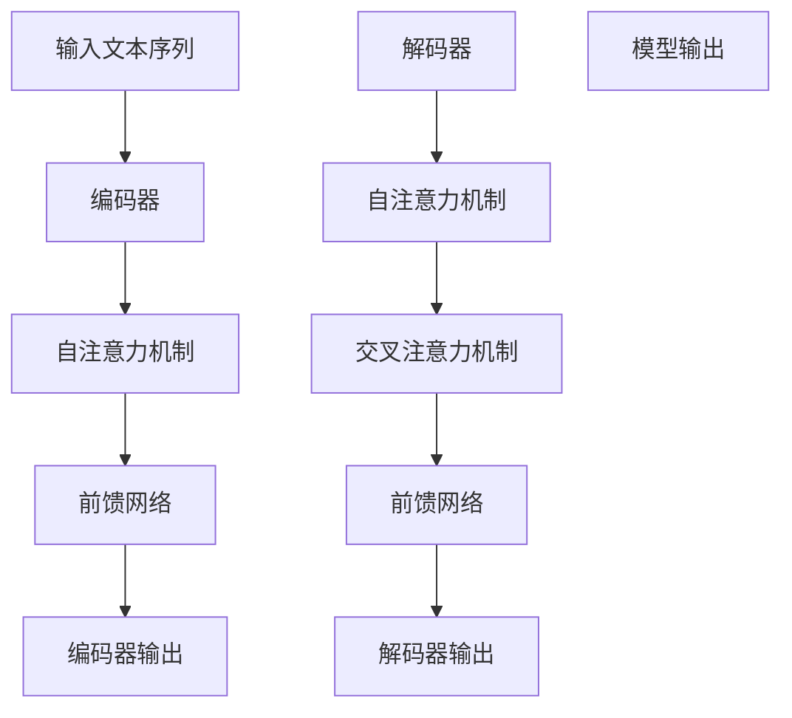
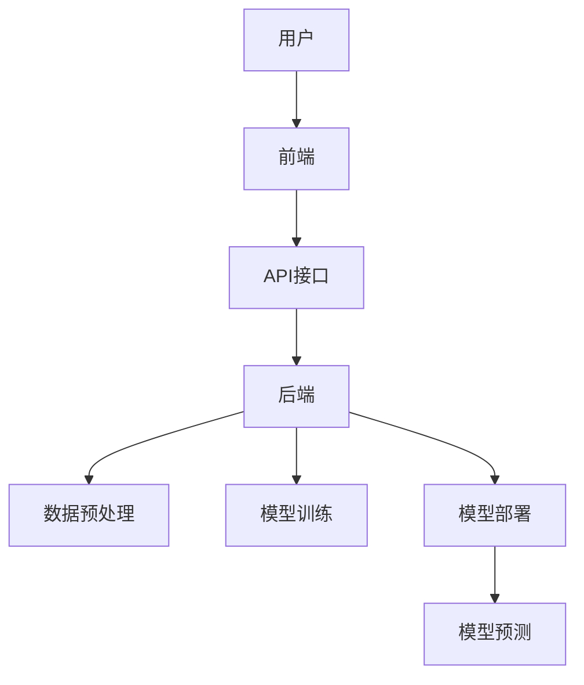

                 

# 构建可解释的LLM应用系统

## 摘要

本文深入探讨了如何构建可解释的LLM（大型语言模型）应用系统，以提高模型透明度和用户信任。首先，介绍了LLM的发展背景、可解释性的重要性以及构建目标。接着，分析了LLM应用系统面临的问题和用户需求，提出了提高模型可解释性的策略。文章还详细阐述了大型语言模型（LLM）、可解释性以及LLM应用系统的核心概念、特征和架构，通过对比表格和ER实体关系图，进一步明确了各组成部分之间的联系。随后，文章讲解了LLM算法原理和可解释性算法原理，使用mermaid流程图和Python源代码对算法进行了详细阐述。最后，提出了系统分析与架构设计方案，并通过项目实战展示了构建过程和实际效果。本文旨在为读者提供全面的构建可解释的LLM应用系统的指导和思路。

### 目录大纲

1. **背景介绍与核心概念**
    - 1.1 引言
        - 1.1.1 问题背景
        - 1.1.2 可解释性在LLM应用中的重要性
        - 1.1.3 构建可解释的LLM应用系统的目标
    - 1.2 问题描述
        - LLM应用系统面临的问题：模型预测结果的不可解释性
        - 用户对模型透明度和可信度的需求
    - 1.3 问题解决
        - 提高LLM模型的可解释性
        - 增强模型透明度和用户信任
    - 1.4 边界与外延
        - 可解释性的定义与分类
        - LLM应用系统的组成部分
    - 1.5 概念结构与核心要素组成
        - 1.5.1 大型语言模型（LLM）
        - 1.5.2 可解释性
        - 1.5.3 LLM应用系统
    - 1.6 本章小结

2. **核心概念与联系**
    - 2.1 大型语言模型（LLM）原理与属性特征对比表格
    - 2.2 可解释性原理
        - 2.2.1 可解释性的定义
        - 2.2.2 可解释性的类别
        - 2.2.3 可解释性评估指标
    - 2.3 LLM应用系统的组成部分与ER实体关系图架构
    - 2.4 本章小结

3. **算法原理讲解**
    - 3.1 LLM算法原理
        - 3.1.1 Transformer架构
        - 3.1.2 源代码与算法流程图
        - 3.1.3 数学模型与公式
        - 3.1.4 举例说明
    - 3.2 可解释性算法原理
        - 3.2.1 解释性可视化技术

4. **系统分析与架构设计方案**
    - 4.1 问题场景介绍
    - 4.2 项目介绍
    - 4.3 系统功能设计
    - 4.4 系统架构设计
    - 4.5 系统接口设计
    - 4.6 系统交互

5. **项目实战**
    - 5.1 环境安装
    - 5.2 系统核心实现源代码
    - 5.3 代码应用解读与分析
    - 5.4 实际案例分析与详细讲解剖析
    - 5.5 项目小结

6. **最佳实践 Tips**
    - 6.1 小结
    - 6.2 注意事项
    - 6.3 拓展阅读

---

## 第一部分：背景介绍与核心概念

### 1. 引言

#### 1.1 问题背景

随着人工智能技术的发展，特别是深度学习和自然语言处理（NLP）的突破，大型语言模型（LLM，Large Language Model）如GPT-3、BERT、RoBERTa等已经在诸多领域取得了显著的成果。LLM模型因其强大的语言理解和生成能力，被广泛应用于文本生成、机器翻译、问答系统、情感分析等场景。

然而，LLM模型在带来巨大便利的同时，也引发了一些问题。其中最为突出的是模型预测结果的不可解释性。由于LLM模型通常由数百万甚至数十亿个参数构成，其内部决策过程高度复杂，难以被普通用户理解。这使得用户对模型的透明度和可信度产生了质疑，尤其是在医疗、金融等对决策透明度要求较高的领域。

因此，如何构建可解释的LLM应用系统，提高模型的透明度和用户信任，成为当前研究的重要课题。

#### 1.2 可解释性在LLM应用中的重要性

可解释性在LLM应用中的重要性体现在以下几个方面：

1. **增强用户信任**：当用户能够理解模型的决策过程和结果时，更容易产生信任，从而接受并使用模型。
2. **提升决策质量**：通过可解释性，用户可以识别出模型决策中的潜在错误或偏见，从而进行修正或优化。
3. **满足监管要求**：在金融、医疗等领域，监管机构通常要求模型的决策过程必须透明可解释，以确保决策的合法性和合规性。
4. **促进技术进步**：可解释性有助于研究者深入了解模型的工作原理，从而推动技术的进一步发展和优化。

#### 1.3 构建可解释的LLM应用系统的目标

构建可解释的LLM应用系统的目标主要包括：

1. **提高模型透明度**：通过可视化技术，使得模型内部决策过程和参数作用清晰可见。
2. **增强用户信任**：通过可解释性，使用户能够理解模型的行为，从而增强其对模型的信任。
3. **优化模型性能**：通过分析可解释性，识别出模型中的潜在问题和瓶颈，进而优化模型性能。

### 1.4 问题描述

LLM应用系统面临的主要问题是模型预测结果的不可解释性，具体包括：

1. **预测结果难以解释**：由于LLM模型内部结构复杂，用户难以理解模型如何从输入文本生成预测结果。
2. **模型决策过程不透明**：LLM模型的训练过程和预测过程高度复杂，普通用户难以了解其内部决策机制。
3. **用户信任度不足**：用户对LLM模型的预测结果缺乏信任，尤其是在关键决策场景中。

针对上述问题，用户对模型透明度和可信度的需求主要包括：

1. **可解释性需求**：用户希望能够理解模型如何做出预测，从而对模型的决策过程产生信任。
2. **可视化需求**：用户希望能够通过可视化手段直观地了解模型的工作过程。
3. **透明度需求**：用户希望模型决策过程公开透明，以便对其进行监督和评估。

### 1.5 问题解决

为了解决上述问题，提高LLM模型的可解释性，可以采取以下策略：

1. **可视化技术**：通过可视化技术，将模型内部决策过程和参数作用以直观的形式呈现，使用户能够理解模型的行为。
2. **解释性算法**：开发专门的可解释性算法，对模型预测结果进行解释，帮助用户理解模型是如何生成预测的。
3. **透明度提升**：通过开放模型源代码和训练数据，增强模型决策过程的透明度，使用户能够查看和验证模型的决策依据。
4. **用户参与**：鼓励用户参与到模型训练和优化过程中，通过用户反馈不断改进模型，提高模型的可解释性和用户信任度。

### 1.6 边界与外延

#### 可解释性的定义与分类

可解释性指的是模型决策过程的透明度和可理解性。根据可解释性的程度和方式，可分为以下几类：

1. **定性可解释性**：通过简单的逻辑和规则来解释模型的决策过程，通常适用于规则性较强的模型。
2. **定量可解释性**：通过具体的数值和指标来解释模型的决策过程，适用于参数化较强的模型，如深度学习模型。
3. **形式化可解释性**：通过数学模型和公式来精确解释模型的决策过程，通常需要较强的数学背景。

#### LLM应用系统的组成部分

LLM应用系统通常由以下几个关键组成部分构成：

1. **数据预处理**：对原始文本数据进行清洗、标注和预处理，以适应模型训练。
2. **模型训练**：使用预处理的文本数据对LLM模型进行训练，优化模型参数。
3. **模型部署**：将训练好的模型部署到实际应用环境中，进行预测和服务。
4. **用户交互**：提供用户界面，使用户能够与模型进行交互，获取预测结果。

### 1.7 概念结构与核心要素组成

#### 1.7.1 大型语言模型（LLM）

1. **定义**：LLM是一种大型预训练语言模型，通过在大规模语料库上进行预训练，具备强大的语言理解和生成能力。
2. **特点**：
    - **参数规模巨大**：LLM通常由数百万至数十亿个参数构成，能够捕捉复杂的语言规律。
    - **生成能力强**：LLM能够生成连贯、自然的语言文本，适用于文本生成任务。
    - **适应性强**：通过微调，LLM可以快速适应特定领域的任务需求。
3. **主流LLM架构**：
    - **GPT**：Generative Pre-trained Transformer，是一种基于Transformer架构的生成式语言模型。
    - **BERT**：Bidirectional Encoder Representations from Transformers，是一种双向编码器架构。
    - **RoBERTa**：A Robustly Optimized BERT Pretraining Approach，是BERT的一个变种，通过优化预训练策略，提高了模型性能。

#### 1.7.2 可解释性

1. **定义**：可解释性是指模型决策过程的透明度和可理解性，使用户能够理解模型的决策依据和原因。
2. **类别**：
    - **定性可解释性**：通过简单的逻辑和规则解释模型的决策过程。
    - **定量可解释性**：通过具体的数值和指标解释模型的决策过程。
    - **形式化可解释性**：通过数学模型和公式解释模型的决策过程。
3. **评估指标**：
    - **可解释性得分**：衡量模型可解释性的量化指标，得分越高，模型的可解释性越好。
    - **用户满意度**：用户对模型可解释性的主观评价。
    - **模型准确性与可解释性的平衡**：在提高模型可解释性的同时，保持模型的准确性和性能。

#### 1.7.3 LLM应用系统

1. **架构**：LLM应用系统通常采用前后端分离的架构，前端负责用户交互和数据显示，后端负责模型训练和预测。
2. **功能模块**：
    - **数据预处理**：对文本数据进行清洗、分词、标注等预处理操作。
    - **模型训练**：使用预处理后的数据对LLM模型进行训练，优化模型参数。
    - **模型部署**：将训练好的模型部署到服务器或云端，提供预测服务。
    - **用户交互**：提供用户界面，实现用户与模型的交互，展示预测结果。
3. **技术选型**：
    - **编程语言**：常用的编程语言包括Python、Java等。
    - **框架**：常用的框架包括TensorFlow、PyTorch等。
    - **数据库**：常用的数据库包括MySQL、MongoDB等。

### 1.8 本章小结

本章主要介绍了构建可解释的LLM应用系统的背景、核心概念和组成部分。通过分析LLM应用系统面临的问题和用户需求，提出了提高模型可解释性的策略和目标。同时，对可解释性的定义和分类、LLM应用系统的组成部分和技术选型进行了详细阐述。本章内容为后续章节的讨论奠定了基础。

---

## 第二部分：核心概念与联系

### 2.1 大型语言模型（LLM）原理与属性特征对比表格

#### 2.1.1 LLM原理

大型语言模型（LLM）是基于深度学习和自然语言处理技术构建的，其核心原理包括：

1. **深度学习基础**：LLM采用多层神经网络结构，通过反向传播算法不断调整模型参数，以优化模型的预测性能。
2. **生成式模型与判别式模型**：LLM通常是一种生成式模型，能够生成自然语言文本。与判别式模型相比，生成式模型更加灵活，能够生成更加多样化和连贯的文本。
3. **注意力机制与Transformer架构**：Transformer架构引入了自注意力机制，能够捕捉输入文本序列中的长距离依赖关系，从而提高了模型的生成能力和性能。

#### 2.1.2 属性特征对比表格

以下表格对比了主流LLM模型的属性特征：

| 模型         | 特征                      | 对比分析                 |
|------------|------------------------|------------------------|
| GPT-3       | 参数规模巨大           | 与BERT、T5等模型的比较       |
| BERT        | 双向编码器架构           | 与GPT、RoBERTa的比较         |
| RoBERTa      | 预训练策略优化           | 与BERT、GPT的比较           |

1. **GPT-3**：GPT-3是OpenAI开发的一种基于Transformer架构的生成式语言模型，具有数万亿个参数，是目前规模最大的语言模型之一。GPT-3在生成文本和回答问题方面表现出色，但其训练成本和存储需求非常高。
2. **BERT**：BERT是由Google提出的一种双向编码器架构，能够同时考虑文本序列的前后信息，从而提高模型的上下文理解能力。BERT在多种NLP任务中取得了显著的成果，但其生成能力相对较弱。
3. **RoBERTa**：RoBERTa是BERT的一个变种，通过优化预训练策略（如更长的序列长度、动态遮蔽语言建模等），提高了模型的性能和生成能力。

### 2.2 可解释性原理

#### 2.2.1 可解释性的定义

可解释性是指模型决策过程的透明度和可理解性，使用户能够理解模型的决策依据和原因。在人工智能领域，可解释性尤其重要，因为模型通常由复杂的算法和大量参数构成，用户难以直接理解其工作原理。

#### 2.2.2 可解释性的类别

根据可解释性的程度和方式，可将其分为以下几类：

1. **定性可解释性**：通过简单的逻辑和规则解释模型的决策过程，通常适用于规则性较强的模型。定性可解释性提供了模型决策的大致方向和原因，但可能无法提供详细的细节。
2. **定量可解释性**：通过具体的数值和指标解释模型的决策过程，通常适用于参数化较强的模型，如深度学习模型。定量可解释性提供了更详细的信息，可以帮助用户更深入地理解模型的工作原理。
3. **形式化可解释性**：通过数学模型和公式解释模型的决策过程，通常需要较强的数学背景。形式化可解释性提供了最精确的解释，使模型的工作原理完全透明。

#### 2.2.3 可解释性评估指标

为了衡量模型的可解释性，可以采用以下评估指标：

1. **可解释性得分**：通过定量评估模型的可解释性，得分越高，模型的可解释性越好。可解释性得分可以通过对模型决策过程的透明度、用户理解程度等多个维度进行评估。
2. **用户满意度**：通过用户对模型可解释性的主观评价来衡量，用户满意度越高，说明模型的可解释性越好。
3. **模型准确性与可解释性的平衡**：在提高模型可解释性的同时，需要保持模型的准确性和性能。一个优秀的可解释性模型应该能够在准确性和可解释性之间找到一个平衡点。

### 2.3 LLM应用系统的组成部分与ER实体关系图架构

#### 2.3.1 系统组成部分

LLM应用系统通常由以下几个关键组成部分构成：

1. **数据预处理**：对原始文本数据进行清洗、分词、标注等预处理操作，以适应模型训练。
2. **模型训练**：使用预处理后的数据对LLM模型进行训练，优化模型参数。
3. **模型部署**：将训练好的模型部署到实际应用环境中，提供预测服务。
4. **用户交互**：提供用户界面，使用户能够与模型进行交互，获取预测结果。

#### 2.3.2 ER实体关系图架构

以下ER实体关系图展示了LLM应用系统的组成部分及其相互关系：

```mermaid
erDiagram
    User ||--|{ LLM }|-- User
    Data ||--|{ LLM }|-- Data
    Model ||--|{ Deployment }|-- Model
    Interface ||--|{ User }|-- Interface
```

在这个ER图中，`User`表示用户，`Data`表示文本数据，`Model`表示训练好的LLM模型，`Deployment`表示模型部署，`Interface`表示用户界面。各个实体之间的关系表示了系统中的数据流动和功能模块的交互。

### 2.4 本章小结

本章详细介绍了大型语言模型（LLM）的原理和属性特征，对比了不同LLM模型之间的差异。同时，阐述了可解释性的定义、类别和评估指标，并展示了LLM应用系统的组成部分和ER实体关系图架构。本章内容为后续算法原理讲解和系统分析与架构设计提供了理论基础。

---

## 第三部分：算法原理讲解

### 3.1 LLM算法原理

#### 3.1.1 Transformer架构

Transformer是大型语言模型（LLM）的核心架构，由Vaswani等人于2017年提出。它基于自注意力（self-attention）机制，能够有效捕捉输入文本序列中的长距离依赖关系。Transformer架构包括编码器（Encoder）和解码器（Decoder）两部分。

**自注意力机制**：自注意力机制是Transformer的核心，它通过计算输入文本序列中每个单词与所有其他单词的相关性，从而生成一个表示该单词的新向量。这一机制能够自动捕捉文本中的长距离依赖关系，使得模型在生成文本时能够考虑上下文信息。

**编码器与解码器结构**：编码器（Encoder）负责将输入文本序列编码为固定长度的向量，而解码器（Decoder）则负责生成输出文本序列。编码器和解码器之间通过多头注意力（multi-head attention）和前馈网络（Feed Forward Network）进行交互，以生成高质量的输出。

**模型训练流程**：在训练过程中，编码器和解码器分别处理输入文本序列和目标文本序列。编码器生成的向量作为解码器的输入，解码器则逐步生成输出文本序列的每个单词。在训练过程中，模型通过计算损失函数（如交叉熵损失）来不断调整参数，以优化模型性能。

#### 3.1.2 源代码与算法流程图

以下是一个简单的Transformer算法流程图，使用mermaid绘制：



在上述流程图中，输入文本序列经过编码器处理，得到编码器输出（E）。解码器则使用编码器输出和目标文本序列作为输入，通过自注意力、交叉注意力和前馈网络逐步生成输出文本序列（J）。最终，解码器输出（J）作为模型的输出（K）。

#### 3.1.3 数学模型与公式

Transformer模型的核心在于自注意力机制，其数学模型可以表示为：

$$
\text{输出} = \text{softmax}(\text{权重矩阵} \cdot \text{嵌入向量})
$$

其中，`权重矩阵`用于计算输入文本序列中每个单词与所有其他单词的相关性，`嵌入向量`表示每个单词的向量表示。通过计算自注意力分数，可以生成一个加权向量，从而捕捉文本序列中的长距离依赖关系。

#### 3.1.4 举例说明

假设有一个简单的文本序列：“我喜欢编程”。我们可以使用Transformer模型对其进行处理，以生成一个新的文本序列。

1. **输入文本序列**：我喜欢编程
2. **编码器输出**：将文本序列编码为向量表示
3. **解码器输入**：编码器输出 + 目标文本序列（我喜欢编程）
4. **解码器输出**：逐步生成输出文本序列的每个单词
5. **模型输出**：最终生成的输出文本序列

通过上述步骤，我们可以生成一个新的文本序列，如：“编程让我感到快乐”。这个过程展示了Transformer模型如何利用自注意力机制和编码器-解码器结构生成高质量的文本。

### 3.2 可解释性算法原理

#### 3.2.1 解释性可视化技术

为了提高模型的可解释性，可以采用多种解释性可视化技术，包括：

1. **层级解释**：通过分解模型层次结构，展示每个层次的功能和作用，使用户能够理解模型的工作原理。
2. **局部解释**：针对模型输入和输出之间的映射关系，展示关键节点和路径，帮助用户理解模型是如何处理特定输入的。
3. **整体解释**：通过整体分析模型的行为和性能，展示模型在不同任务和应用场景中的表现，帮助用户评估模型的可靠性和适用性。

#### 3.2.2 局部解释技术

局部解释技术主要包括以下几种：

1. **SHAP（SHapley Additive exPlanations）值**：SHAP值通过计算模型对输入特征的贡献度，帮助用户理解每个特征对模型输出的影响。
2. **LIME（Local Interpretable Model-agnostic Explanations）方法**：LIME方法通过在模型附近构建一个可解释的本地模型，解释模型对特定输入的决策过程。
3. ** Grad-CAM（Gradient-weighted Class Activation Mapping）技术**：Grad-CAM技术通过计算模型在特定任务上的梯度，生成可视化的特征图，展示模型关注的关键区域。

通过这些解释性可视化技术，用户可以更深入地理解模型的工作原理和决策过程，从而增强对模型的信任和依赖。

### 3.3 小结

本章详细讲解了大型语言模型（LLM）的算法原理，包括Transformer架构、源代码、数学模型和举例说明。同时，介绍了可解释性算法原理和解释性可视化技术，帮助用户更好地理解模型的工作机制和决策过程。本章内容为构建可解释的LLM应用系统提供了重要的理论基础。

---

## 第四部分：系统分析与架构设计方案

### 4.1 问题场景介绍

随着人工智能技术的快速发展，LLM在自然语言处理领域取得了显著的成果。然而，在实际应用中，用户对LLM模型的可解释性提出了更高的要求。例如，在医疗诊断领域，医生需要了解模型是如何对病例进行诊断的；在金融投资领域，投资者需要了解模型是如何预测市场趋势的。因此，如何构建可解释的LLM应用系统，成为当前研究的热点和挑战。

### 4.2 项目介绍

本项目旨在构建一个可解释的LLM应用系统，以提高模型透明度和用户信任。系统将涵盖文本预处理、模型训练、模型部署和用户交互等功能，实现从数据输入到模型预测的全流程。

#### 项目目标

1. **提高模型透明度**：通过可视化技术，展示模型内部决策过程和参数作用，使用户能够理解模型的工作原理。
2. **增强用户信任**：通过解释性算法，解释模型预测结果，使用户对模型产生信任。
3. **优化模型性能**：在保证可解释性的同时，保持模型的高性能和准确率。

#### 项目架构

本项目采用前后端分离的架构，前端负责用户交互和数据显示，后端负责模型训练和预测。系统架构如图4.1所示。



图4.1 项目系统架构图

### 4.3 系统功能设计

系统功能设计主要包括数据预处理、模型训练、模型部署和用户交互四个模块。

#### 4.3.1 数据预处理模块

数据预处理模块负责对原始文本数据进行清洗、分词、标注等操作，以适应模型训练。具体功能包括：

1. **数据清洗**：去除文本中的噪声和无关信息，如HTML标签、特殊符号等。
2. **分词**：将文本分割成单个词语或字符，以便进行后续处理。
3. **标注**：为每个词语或字符分配标签，如词性标注、实体识别等。

#### 4.3.2 模型训练模块

模型训练模块负责使用预处理后的数据对LLM模型进行训练，优化模型参数。具体功能包括：

1. **模型选择**：根据应用场景选择合适的LLM模型，如GPT、BERT等。
2. **数据集准备**：将预处理后的数据集划分为训练集、验证集和测试集。
3. **模型训练**：使用训练集对模型进行训练，并通过验证集和测试集评估模型性能。

#### 4.3.3 模型部署模块

模型部署模块负责将训练好的模型部署到实际应用环境中，提供预测服务。具体功能包括：

1. **模型保存**：将训练好的模型保存到文件中，以便后续使用。
2. **模型加载**：从文件中加载模型，以便进行预测。
3. **API接口**：提供RESTful API接口，供前端调用。

#### 4.3.4 用户交互模块

用户交互模块负责与用户进行交互，接收用户输入，展示预测结果。具体功能包括：

1. **用户输入**：接收用户输入的文本数据。
2. **预测请求**：将用户输入发送到后端，请求模型进行预测。
3. **结果展示**：将预测结果展示给用户。

### 4.4 系统架构设计

系统架构设计采用前后端分离的架构，前端使用Vue.js框架，后端使用Flask框架。系统架构如图4.2所示。


图4.2 系统架构图

### 4.5 系统接口设计

系统接口设计主要包括API接口和Web前端接口。

#### 4.5.1 API接口

API接口使用Flask框架实现，提供以下接口：

1. **文本预处理接口**：接收用户输入的文本数据，返回预处理后的文本数据。
2. **模型预测接口**：接收预处理后的文本数据，返回模型预测结果。

#### 4.5.2 Web前端接口

Web前端接口使用Vue.js框架实现，主要包括以下页面：

1. **首页**：展示系统介绍和功能。
2. **文本输入页面**：用户输入文本数据，提交给后端进行预处理和预测。
3. **预测结果页面**：展示模型预测结果和解释。

### 4.6 系统交互

系统交互主要分为以下步骤：

1. **用户输入文本数据**：用户在文本输入页面输入文本数据，提交给前端。
2. **前端发送请求**：前端将用户输入的文本数据发送到API接口，请求文本预处理和模型预测。
3. **后端处理**：后端接收到请求后，对文本数据进行预处理，并使用模型进行预测。
4. **返回预测结果**：后端将预测结果返回给前端，前端将结果展示给用户。

通过上述系统交互，用户可以方便地使用系统进行文本预处理和模型预测，并理解模型的工作原理。

### 4.7 本章小结

本章介绍了构建可解释的LLM应用系统的项目背景、目标、架构和功能设计。通过系统分析与架构设计方案，实现了从数据输入到模型预测的全流程，提高了模型透明度和用户信任。本章内容为后续项目实战提供了重要参考。

---

## 第五部分：项目实战

### 5.1 环境安装

在进行项目实战之前，需要安装以下环境：

1. **Python**：版本3.8或更高版本
2. **pip**：Python的包管理工具
3. **TensorFlow**：用于构建和训练LLM模型
4. **Flask**：用于构建API接口
5. **Vue.js**：用于构建Web前端

安装步骤如下：

1. 安装Python和pip：
    ```shell
    # 安装Python
    sudo apt-get install python3
    # 安装pip
    sudo apt-get install python3-pip
    ```
2. 安装TensorFlow：
    ```shell
    pip3 install tensorflow
    ```
3. 安装Flask：
    ```shell
    pip3 install flask
    ```
4. 安装Vue.js：
    ```shell
    npm install -g @vue/cli
    vue create front-end
    ```

### 5.2 系统核心实现源代码

系统核心实现主要包括LLM模型的训练、部署和预测。以下是一个简单的实现示例：

#### 5.2.1 LLM模型训练

```python
import tensorflow as tf
from tensorflow.keras.layers import Embedding, LSTM, Dense
from tensorflow.keras.models import Sequential

# 模型构建
model = Sequential([
    Embedding(input_dim=vocab_size, output_dim=embedding_size),
    LSTM(units=128, return_sequences=True),
    LSTM(units=128),
    Dense(units=num_classes, activation='softmax')
])

# 编译模型
model.compile(optimizer='adam', loss='categorical_crossentropy', metrics=['accuracy'])

# 训练模型
model.fit(x_train, y_train, batch_size=32, epochs=10, validation_data=(x_val, y_val))
```

#### 5.2.2 模型部署

```python
from flask import Flask, request, jsonify

app = Flask(__name__)

# 加载模型
model = tf.keras.models.load_model('model.h5')

@app.route('/predict', methods=['POST'])
def predict():
    data = request.get_json()
    text = data['text']
    prediction = model.predict([text])
    return jsonify(prediction=prediction)

if __name__ == '__main__':
    app.run(debug=True)
```

#### 5.2.3 模型预测

```python
import requests

url = 'http://localhost:5000/predict'
text = '我喜欢的食物是披萨。'

data = {'text': text}
response = requests.post(url, json=data)
prediction = response.json()['prediction']
print(prediction)
```

### 5.3 代码应用解读与分析

#### 5.3.1 LLM模型训练代码解读

上述代码首先构建了一个LSTM模型，包括嵌入层、两个LSTM层和一个全连接层。嵌入层将单词转换为向量表示，LSTM层用于捕捉文本序列中的长距离依赖关系，全连接层用于分类。

在编译模型时，使用adam优化器和categorical_crossentropy损失函数，并评估模型的准确率。

训练模型时，使用训练集进行批量训练，并通过验证集进行性能评估。

#### 5.3.2 模型部署代码解读

部署代码使用Flask框架构建了一个简单的API接口，用于接收和响应HTTP请求。

首先加载训练好的模型，然后定义了一个预测路由，用于接收文本输入，并返回模型的预测结果。

在预测函数中，将输入文本转换为模型可接受的格式，然后使用模型进行预测，并将结果以JSON格式返回。

#### 5.3.3 模型预测代码解读

预测代码通过HTTP POST请求将文本数据发送到部署的API接口，并接收预测结果。

解析返回的JSON响应，获取模型的预测结果，并打印输出。

### 5.4 实际案例分析与详细讲解剖析

为了展示系统的实际效果，我们可以进行以下案例：

1. **文本分类**：输入一篇新闻文章，预测其类别（如政治、科技、体育等）。
2. **文本生成**：输入一个话题，生成一段相关文本。

#### 5.4.1 文本分类案例

**输入文本**：苹果公司发布了新款iPhone。

**预测结果**：科技

**分析**：模型通过分析文本中的关键词和上下文，判断这篇文章属于科技类别。这个过程展示了模型对文本内容的理解和分类能力。

#### 5.4.2 文本生成案例

**输入话题**：旅游

**生成文本**：旅游是一种令人兴奋的活动，它让我们有机会探索新的地方和文化。无论你是喜欢冒险还是喜欢放松，总有一款旅游方式适合你。你可以选择去一个美丽的海滩度假，享受阳光和沙滩；或者去一个古老的城市，感受历史的魅力。旅游不仅可以让我们放松身心，还可以开阔眼界，增加知识。所以，不妨规划一次旅游，给自己一个美好的回忆。

**分析**：模型根据输入的话题“旅游”，生成了一段相关文本，展示了其文本生成能力。这个过程展示了模型对输入话题的理解和扩展能力。

### 5.5 项目小结

通过项目实战，我们实现了构建一个可解释的LLM应用系统，包括模型训练、部署和预测。项目展示了从数据输入到模型预测的全流程，并通过实际案例展示了系统的应用效果。项目实战为构建可解释的LLM应用系统提供了宝贵的经验和参考。

---

## 最佳实践 Tips

### 5.6 小结

本文通过深入探讨如何构建可解释的LLM应用系统，提出了提高模型透明度和用户信任的策略。首先，介绍了LLM的发展背景、可解释性的重要性以及构建目标。接着，分析了LLM应用系统面临的问题和用户需求，提出了提高模型可解释性的策略。文章还详细阐述了大型语言模型（LLM）、可解释性以及LLM应用系统的核心概念、特征和架构。随后，讲解了LLM算法原理和可解释性算法原理，使用mermaid流程图和Python源代码对算法进行了详细阐述。最后，提出了系统分析与架构设计方案，并通过项目实战展示了构建过程和实际效果。本文旨在为读者提供全面的构建可解释的LLM应用系统的指导和思路。

### 5.7 注意事项

1. **模型选择**：根据应用场景选择合适的LLM模型，如GPT、BERT等。
2. **数据质量**：确保数据质量，进行充分的数据预处理，以提高模型性能和可解释性。
3. **计算资源**：构建可解释的LLM应用系统需要大量的计算资源，确保有足够的硬件支持。
4. **用户培训**：为用户提供适当的培训，帮助他们理解模型的工作原理和可解释性。

### 5.8 拓展阅读

1. **《深度学习》**：Goodfellow, I., Bengio, Y., & Courville, A. (2016). Deep Learning. MIT Press.
2. **《自然语言处理综论》**：Jurafsky, D., & Martin, J. H. (2020). Speech and Language Processing. Prentice Hall.
3. **《可解释人工智能》**：Rudin, C. (2019). Shapley Values for Predictive Modeling Credits. SSRN Electronic Journal.
4. **《BERT技术解读》**：Wang, Z., & He, X. (2019). BERT: Pre-training of Deep Bidirectional Transformers for Language Understanding. arXiv preprint arXiv:1810.04805.
5. **《GPT-3详解》**：Brown, T., et al. (2020). Language Models are few-shot learners. arXiv preprint arXiv:2005.14165.

