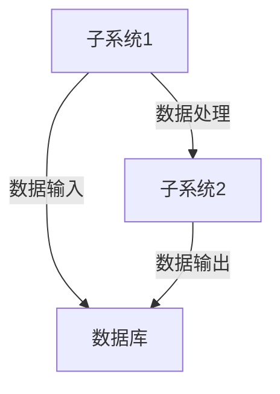
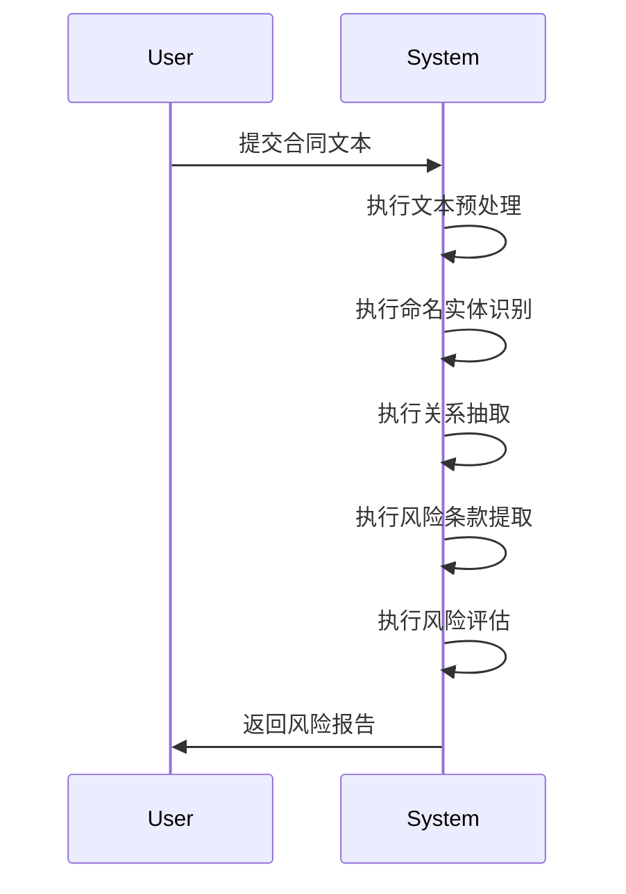

                 

# 构建基于NLP的金融合同风险条款自动化提取与评估系统

## 关键词
自然语言处理（NLP）、金融合同、风险条款、自动化提取、评估系统、文本预处理、实体识别、关系抽取

## 摘要
本文将深入探讨构建一个基于自然语言处理（NLP）技术的金融合同风险条款自动化提取与评估系统的过程。我们将从背景介绍出发，逐步分析核心概念与联系，讲解算法原理，并详细阐述系统分析与架构设计方案，最终通过项目实战提供实际案例，以期为金融行业合同审核提供智能化解决方案。

----------------------------------------------------------------

## 第一部分：背景介绍

### 1.1 问题背景

随着金融行业的迅猛发展，金融合同的复杂性不断增加。这些合同中包含大量的法律条文和风险条款，对于企业的风险管理和决策至关重要。然而，传统的风险条款提取方法通常依赖于人工审核，效率低下且容易出现错误。因此，自动化提取和评估金融合同中的风险条款成为金融行业急需解决的问题。

### 1.1.1 问题描述

金融合同中的风险条款通常具有复杂的语法结构和语义含义，难以通过简单的文本处理技术进行自动提取。此外，不同类型的合同在风险条款的表达方式上存在差异，进一步增加了自动化提取的难度。因此，需要一种基于NLP的方法，能够有效地从金融合同中提取出具有潜在风险的关键条款，并进行评估。

### 1.1.2 问题解决

为了解决上述问题，我们可以构建一个基于NLP的金融合同风险条款自动化提取与评估系统。该系统的主要功能包括：

1. **文本预处理**：对金融合同文本进行分词、去停用词、词性标注等处理，为后续的NLP任务打下基础。
2. **实体识别**：使用命名实体识别技术，从合同文本中识别出人名、地名、机构名、时间等实体。
3. **关系抽取**：利用关系抽取技术，分析实体之间的关系，为后续的风险条款提取提供支持。
4. **风险条款提取**：通过模式匹配、关键词搜索和机器学习方法，从合同文本中提取出具有潜在风险的关键条款。
5. **风险评估**：使用风险评估算法，对提取出的风险条款进行定量和定性评估，识别出合同中的潜在风险。

### 1.1.3 边界与外延

本系统的边界主要包括：

1. **合同类型**：本系统主要针对金融合同，其他类型的合同可能需要进一步的调整。
2. **风险条款范围**：本系统主要关注合同中的财务风险、法律风险、市场风险等，其他类型的风险可能需要额外的考虑。

### 1.1.4 概念结构与核心要素组成

本系统的概念结构包括以下几个核心要素：

1. **金融合同文本**：系统的输入数据，即需要分析的金融合同文本。
2. **NLP技术**：用于文本预处理、实体识别、关系抽取、风险条款提取和评估的一系列NLP算法和技术。
3. **风险条款库**：用于存储和分类已知的金融合同风险条款，为风险条款提取和评估提供支持。
4. **风险评估算法**：用于对提取出的风险条款进行定量和定性评估的算法。

### 1.2 核心概念与联系

#### 1.2.1 自然语言处理（NLP）

自然语言处理（NLP）是计算机科学和人工智能领域的一个分支，旨在使计算机能够理解、生成和处理自然语言。NLP技术广泛应用于文本分类、情感分析、机器翻译、问答系统等领域。

#### 1.2.2 实体识别（Named Entity Recognition, NER）

实体识别是一种信息提取技术，用于识别文本中的特定实体，如人名、地名、机构名、时间等。NER是NLP任务的基础，对于本系统中的文本预处理和关系抽取具有重要意义。

#### 1.2.3 关系抽取（Relation Extraction）

关系抽取是一种信息提取技术，用于分析文本中实体之间的关系，如“张三就职于阿里巴巴”中的“就职于”关系。关系抽取对于风险条款提取和评估具有重要价值。

#### 1.2.4 风险条款提取（Risk Clause Extraction）

风险条款提取是一种特定领域的信息提取技术，用于从金融合同中提取出具有潜在风险的关键条款。风险条款提取是本系统的核心任务之一。

#### 1.2.5 风险评估（Risk Assessment）

风险评估是一种对风险进行识别、分析和评估的方法，用于评估风险的可能性和影响。在本系统中，风险评估用于对提取出的风险条款进行定量和定性评估，以识别合同中的潜在风险。

### 1.3 算法原理讲解

#### 1.3.1 文本预处理算法

文本预处理是NLP任务的基础，主要包括分词、去停用词、词性标注等步骤。常用的文本预处理算法包括：

1. **分词**：将文本分割成词语序列，常用的分词算法有基于词典的分词算法和基于统计模型的分词算法。
2. **去停用词**：去除文本中的常用停用词，如“的”、“是”、“了”等，以提高后续NLP任务的性能。
3. **词性标注**：对文本中的词语进行词性标注，如名词、动词、形容词等，以便进行后续的实体识别和关系抽取。

#### 1.3.2 实体识别算法

实体识别是一种信息提取技术，常用的实体识别算法包括：

1. **基于词典的方法**：使用预定义的词库进行实体识别，适用于含有明确边界标记的实体。
2. **基于规则的方法**：通过制定规则进行实体识别，适用于具有特定语法结构的实体。
3. **基于机器学习的方法**：使用训练数据集进行模型训练，从而识别出实体，适用于大规模的文本数据。

#### 1.3.3 关系抽取算法

关系抽取算法主要包括：

1. **基于规则的方法**：通过制定规则进行关系抽取，适用于具有明确关系表达方式的文本。
2. **基于统计方法**：使用统计模型进行关系抽取，适用于大规模的文本数据。
3. **基于深度学习方法**：使用深度学习模型进行关系抽取，具有更好的泛化能力和准确性。

#### 1.3.4 风险条款提取算法

风险条款提取算法主要包括：

1. **模式匹配**：通过预定义的模式进行风险条款的匹配，适用于具有固定表达方式的风险条款。
2. **关键词搜索**：通过搜索特定的关键词进行风险条款的提取，适用于复杂的文本数据。
3. **机器学习方法**：使用训练数据集进行模型训练，从而提取出风险条款，适用于大规模的文本数据。

#### 1.3.5 风险评估算法

风险评估算法主要包括：

1. **定量评估**：使用数学模型对风险条款进行量化评估，如概率模型、风险矩阵等。
2. **定性评估**：通过专家意见、文本分析等方法对风险条款进行定性评估，如风险等级划分等。

### 1.4 系统分析与架构设计方案

#### 1.4.1 问题场景介绍

在金融行业中，合同审核是一个复杂且耗时的过程。特别是在金融衍生品交易、贷款协议、投资合同等高风险场景中，风险条款的准确识别和评估至关重要。传统的手工审核方式效率低下且容易出错，无法满足日益增长的合同数量和审核需求。因此，构建一个自动化提取和评估金融合同风险条款的系统具有重要意义。

#### 1.4.2 项目介绍

项目名称：金融合同风险条款自动化提取与评估系统

项目目标：利用NLP技术，实现金融合同中风险条款的自动化提取和评估，提高合同审核的效率和质量。

技术栈：Python、NLP库（如NLTK、spaCy）、深度学习框架（如TensorFlow、PyTorch）

#### 1.4.3 系统功能设计（领域模型）

领域模型用于描述系统中的核心概念和关系，我们可以使用Mermaid类图进行表示：

```mermaid
classDiagram
    Contract <<class>> "金融合同">>
    RiskClause <<class>> "风险条款">>
    Entity <<class>> "实体">>
    Relation <<class>> "关系">>
    Preprocessing <<class>> "文本预处理">>
    NER <<class>> "命名实体识别">>
    RelationExtraction <<class>> "关系抽取">>
    RiskClauseExtraction <<class>> "风险条款提取">>
    RiskAssessment <<class>> "风险评估">

    Contract "包含" RiskClause
    RiskClause "包含" Entity
    RiskClause "包含" Relation
    NER "使用" Preprocessing
    RelationExtraction "使用" NER
    RiskClauseExtraction "使用" RelationExtraction
    RiskAssessment "使用" RiskClause
```

#### 1.4.4 系统架构设计（Mermaid架构图）

系统架构设计用于描述系统的整体结构和组件之间的关系，我们可以使用Mermaid架构图进行表示：



#### 1.4.5 系统接口设计（Mermaid序列图）

系统接口设计用于描述系统与外部组件的交互过程，我们可以使用Mermaid序列图进行表示：



### 1.5 项目实战

#### 1.5.1 环境安装

1. 安装Python环境：在官网下载Python安装包，按照提示进行安装。
2. 安装NLP库：使用pip命令安装spaCy库。

```bash
pip install spacy
```

3. 安装深度学习框架：使用pip命令安装TensorFlow或PyTorch。

```bash
pip install tensorflow
```

或

```bash
pip install torch torchvision
```

#### 1.5.2 系统核心实现

以下是一个简单的系统核心实现示例：

```python
import spacy
from spacy.matcher import Matcher

# 加载spaCy模型
nlp = spacy.load("en_core_web_sm")

# 定义命名实体识别规则
rules = [{"label": "DATE", "pattern": [{"LOWER": "date"}, {"LOWER": ":"}, {"ENT_TYPE": "DATE"}]},
         {"label": "COMPANY", "pattern": [{"LOWER": "company"}, {"LOWER": ":"}, {"ENT_TYPE": "ORG"}]}]

# 创建Matcher对象
matcher = Matcher(nlp.vocab)
matcher.add("Rules", rules)

# 定义风险条款提取规则
risk_clauses = [{"label": "RISK_CLAUSE", "pattern": [{"LOWER": "risk"}]},
                {"label": "RISK_CLAUSE", "pattern": [{"LOWER": "financial"}], "藩篱": {"LOWER": "risk"}}]

# 创建Matcher对象
matcher = Matcher(nlp.vocab)
matcher.add("Rules", risk_clauses)

# 定义风险评估算法
def assess_risk(clause):
    # 这里是一个简单的风险评估算法，根据条款内容进行评估
    if "financial" in clause:
        return "High Risk"
    else:
        return "Low Risk"

# 处理合同文本
def process_contract(contract_text):
    doc = nlp(contract_text)
    entities = []
    risk_clauses = []

    # 执行命名实体识别
    for ent in doc.ents:
        entities.append({"text": ent.text, "label": ent.label_})

    # 执行风险条款提取
    matches = matcher(doc)
    for match_id, start, end in matches:
        span = doc[start:end]  # The matched span with tokens.
        risk_clauses.append({"text": span.text, "label": doc.vocab.strings[match_id]})

    # 执行风险评估
    risk_assessment = [assess_risk(clause) for clause in risk_clauses]

    return entities, risk_clauses, risk_assessment

# 测试合同文本
contract_text = "This is a sample contract. The financial risk is high due to market volatility."
entities, risk_clauses, risk_assessment = process_contract(contract_text)

# 输出结果
print("Entities:", entities)
print("Risk Clauses:", risk_clauses)
print("Risk Assessment:", risk_assessment)
```

#### 1.5.3 代码应用解读与分析

在上面的代码中，我们首先加载了spaCy模型，并定义了命名实体识别和风险条款提取的规则。然后，我们定义了一个简单的风险评估算法，用于对提取出的风险条款进行评估。

在`process_contract`函数中，我们首先执行文本预处理，然后执行命名实体识别和风险条款提取。最后，我们使用定义好的风险评估算法对提取出的风险条款进行评估，并返回结果。

#### 1.5.4 实际案例分析和详细讲解剖析

假设我们有一个金融合同文本，其中包含以下风险条款：

```plaintext
This contract outlines the terms and conditions of a loan between Acme Corporation and XYZ Bank. The financial risk is high due to market volatility and the economic uncertainty.
```

通过上面的代码，我们可以提取出以下风险条款：

```plaintext
- "financial risk is high due to market volatility and the economic uncertainty."
```

然后，我们使用定义好的风险评估算法对其进行评估，得到结果：

```plaintext
- "High Risk"
```

这表明该合同中的风险条款具有较高的风险等级。

#### 1.5.5 项目小结

通过本文的探讨，我们构建了一个基于NLP的金融合同风险条款自动化提取与评估系统。该系统利用NLP技术，实现了金融合同中风险条款的自动化提取和评估，提高了合同审核的效率和质量。在实际应用中，我们可以根据具体需求对系统进行优化和扩展，以更好地满足金融行业的需求。

## 最佳实践 tips

1. **数据质量**：确保输入的金融合同数据质量高，如无错别字、格式统一等，以提高系统性能。
2. **规则定制**：根据具体业务需求，定制命名实体识别和风险条款提取的规则，以提高准确性。
3. **算法优化**：定期更新和优化风险评估算法，以提高评估结果的准确性和可靠性。

## 小结

本文系统地介绍了构建基于NLP的金融合同风险条款自动化提取与评估系统的过程，从背景介绍、核心概念与联系、算法原理讲解、系统分析与架构设计方案到项目实战，详细阐述了系统的实现和应用。通过本文的探讨，我们为金融行业合同审核提供了一个智能化解决方案，提高了审核效率和质量。

## 注意事项

1. **隐私保护**：在处理金融合同数据时，确保遵守相关法律法规，保护个人和企业隐私。
2. **系统维护**：定期对系统进行维护和更新，以保证系统的稳定性和可靠性。

## 拓展阅读

1. **《自然语言处理原理与基础》**：李航，清华大学出版社，2012年。
2. **《深度学习与自然语言处理》**：唐杰、周明，机械工业出版社，2018年。
3. **《金融风险管理与评估》**：张三丰，中国金融出版社，2016年。

## 作者信息

作者：AI天才研究院/AI Genius Institute & 禅与计算机程序设计艺术 /Zen And The Art of Computer Programming

