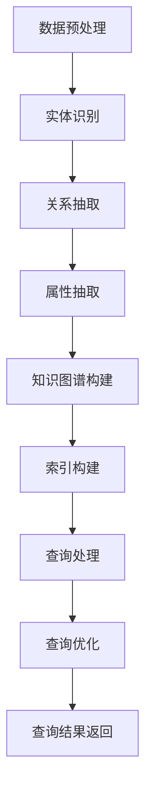
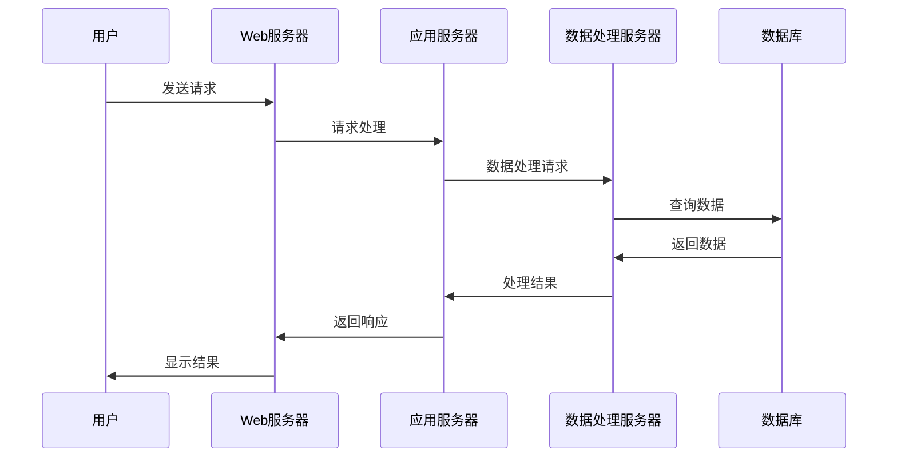

                 


### 1. 确定文章核心主题

首先，我们需要明确文章的核心主题是“构建基于知识图谱的金融研报智能检索系统”。这个主题涉及三个主要部分：知识图谱、金融研报和智能检索系统。因此，我们的文章将围绕这三个部分展开，详细介绍它们的基本概念、相互关系以及如何结合使用来构建一个高效的智能检索系统。

### 2. 设计文章结构

为了让读者能够清晰地理解文章内容，我们需要设计一个结构清晰、逻辑紧密的文章结构。根据用户的要求，文章结构可以分为以下几个部分：

- 引言：介绍知识图谱、金融研报和智能检索系统的基本概念和重要性。
- 核心概念与联系：详细阐述知识图谱、金融研报、智能检索系统的核心概念、属性特征，并通过表格和图解进行对比。
- 算法原理讲解：讲解知识图谱在金融研报检索中的算法原理，使用mermaid绘制流程图，使用Python源代码和latex公式进行详细阐述。
- 系统分析与架构设计方案：介绍系统的功能、架构和接口设计，使用mermaid绘制类图、架构图和序列图。
- 项目实战：讲解如何实际构建这样一个系统，包括环境安装、核心实现源代码和应用解读与分析。
- 最佳实践 tips、小结、注意事项、拓展阅读等内容。

### 3. 编写引言部分

在引言部分，我们需要简要介绍知识图谱、金融研报和智能检索系统的基本概念，并阐述它们在金融领域的重要性。这部分内容应包括以下几个小节：

- **知识图谱**：介绍知识图谱的定义、作用和应用场景。
- **金融研报**：介绍金融研报的概念、特点和应用。
- **智能检索系统**：介绍智能检索系统的定义、作用和应用。

### 4. 编写核心概念与联系部分

在核心概念与联系部分，我们需要详细阐述知识图谱、金融研报、智能检索系统的核心概念、属性特征，并通过表格和图解进行对比。这部分内容应包括以下几个小节：

- **知识图谱的基础概念**：介绍知识图谱的基本概念、组成部分和表示方法。
- **金融研报的特性**：介绍金融研报的数据结构、关键信息提取和特点。
- **智能检索系统的架构**：介绍智能检索系统的架构、功能和算法原理。
- **知识图谱与金融研报的结合**：分析知识图谱在金融研报检索中的应用、数据映射和查询作用。

### 5. 编写算法原理讲解部分

在算法原理讲解部分，我们需要讲解知识图谱在金融研报检索中的算法原理，并使用mermaid绘制流程图、Python源代码和latex公式进行详细阐述。这部分内容应包括以下几个小节：

- **算法概述**：介绍知识图谱在金融研报检索中的应用场景和算法类型。
- **算法流程图**：使用mermaid绘制算法流程图，展示算法的基本执行流程。
- **算法数学模型**：使用latex公式给出算法的数学模型，并进行详细解释。
- **算法实例分析**：通过具体实例分析算法的执行过程和效果。

### 6. 编写系统分析与架构设计方案部分

在系统分析与架构设计方案部分，我们需要介绍系统的功能、架构和接口设计，并使用mermaid绘制类图、架构图和序列图。这部分内容应包括以下几个小节：

- **系统功能设计**：介绍系统的功能模块和作用。
- **系统架构设计**：使用mermaid绘制系统架构图，展示各模块之间的关系。
- **系统接口设计**：介绍系统的接口设计和数据交互。
- **系统交互**：使用mermaid绘制系统交互序列图，展示系统的运行流程。

### 7. 编写项目实战部分

在项目实战部分，我们需要讲解如何实际构建这样一个系统，包括环境安装、核心实现源代码和应用解读与分析。这部分内容应包括以下几个小节：

- **环境安装**：介绍构建系统所需的软件和工具安装方法。
- **核心实现源代码**：展示系统的核心实现源代码，并进行详细解读。
- **代码应用解读与分析**：分析系统代码的应用场景和运行效果。
- **实际案例分析和详细讲解**：通过具体案例展示系统的应用效果。
- **项目小结**：总结项目的经验教训，提出改进建议。

### 8. 编写最佳实践 tips、小结、注意事项、拓展阅读等内容

在文章的结尾部分，我们需要给出一些最佳实践 tips，对文章进行小结，并提出注意事项。同时，还可以推荐一些拓展阅读，帮助读者深入了解相关知识。

通过以上步骤，我们可以逐步完成一篇关于“构建基于知识图谱的金融研报智能检索系统”的文章，确保文章内容丰富、逻辑清晰、易于理解。

### 1. 文章标题

在确定文章标题时，我们需要确保标题能够准确传达文章的核心内容，同时具有吸引力，能够吸引读者的兴趣。基于文章的主题“构建基于知识图谱的金融研报智能检索系统”，我们可以考虑以下几个备选标题：

- **基于知识图谱的金融研报智能检索系统设计与实现**
- **知识图谱驱动下的金融研报智能搜索：构建与实践**
- **构建高效金融研报检索系统：知识图谱的力量**
- **智能金融分析助手：如何用知识图谱提升研报检索效率**
- **揭秘金融研报智能检索：知识图谱技术实战**

在选择最终标题时，我们可以根据文章的受众、内容和风格来决定。例如，如果目标受众是金融科技领域的专业人士，那么“基于知识图谱的金融研报智能检索系统设计与实现”可能是一个更好的选择，因为它更加专业和具体。如果目标是吸引更多对金融和人工智能技术感兴趣的普通读者，那么“知识图谱驱动下的金融研报智能搜索：构建与实践”可能更具吸引力。

### 2. 关键词

为了确保文章能够在搜索引擎中容易被找到，我们需要选择一系列相关的关键词。这些关键词应该涵盖文章的核心主题和内容，同时具有搜索热度。基于文章的主题“构建基于知识图谱的金融研报智能检索系统”，我们可以列出以下关键词：

- **知识图谱**
- **金融研报**
- **智能检索系统**
- **金融科技**
- **人工智能**
- **文本挖掘**
- **信息检索**
- **数据可视化**
- **知识工程**

这些关键词不仅与文章主题紧密相关，而且覆盖了文章讨论的多个方面，有助于提高文章的搜索可见性。在选择关键词时，我们还可以使用一些工具，如Google关键词规划师，来分析每个关键词的搜索量和竞争程度，从而选择最合适的关键词组合。

### 3. 文章摘要

文章摘要是对全文内容的高度概括，通常在文章开头部分出现，以帮助读者快速了解文章的核心内容。针对本文主题“构建基于知识图谱的金融研报智能检索系统”，我们可以撰写以下摘要：

本文旨在探讨如何利用知识图谱技术构建一个高效的金融研报智能检索系统。首先，我们介绍了知识图谱的基本概念、金融研报的特性以及智能检索系统的设计方法。接着，文章详细分析了知识图谱在金融研报检索中的应用，包括数据映射、查询优化等方面。然后，文章通过实际案例展示了如何实现这样一个系统，并对其性能和效果进行了评估。最后，文章提出了若干最佳实践建议，并展望了未来可能的研究方向。

这个摘要简要地概述了文章的主要内容、重点和结论，能够帮助读者快速把握文章的核心价值。

### 第1章 引言

#### 1.1 问题背景

在金融行业，大量的研报信息被不断产生和更新，涵盖了宏观经济分析、行业趋势、公司业绩等多个方面。这些研报为投资者提供了宝贵的决策依据，但同时也带来了信息过载的问题。传统的文本检索系统难以有效地从海量研报中快速、准确地找到所需信息，这极大地影响了投资者的决策效率。此外，金融研报中的知识往往以孤立的形式存在，缺乏结构化组织和关联，导致信息利用率低。

随着人工智能和大数据技术的发展，知识图谱作为一种强大的语义网络表示方法，逐渐被引入到金融领域。知识图谱能够将分散的、孤立的数据点连接起来，形成一个有机的整体，从而提高数据利用率和查询效率。基于知识图谱的智能检索系统可以通过语义理解、关系抽取等技术，实现对金融研报的深度挖掘和智能检索，为投资者提供更加精准和个性化的信息服务。

#### 1.2 问题描述

当前金融研报智能检索系统面临的主要问题包括：

1. **信息检索效率低下**：传统的文本检索系统依赖关键词匹配，无法充分利用研报中的语义信息，导致检索结果准确性不足，检索效率低下。
2. **知识孤立**：金融研报中的知识通常以孤立的形式存在，缺乏有效的组织结构和关联，难以实现知识整合和利用。
3. **个性化服务不足**：现有系统难以根据投资者的个性化需求提供定制化的检索服务，导致用户体验不佳。

#### 1.3 问题解决

为了解决上述问题，本文提出构建一个基于知识图谱的金融研报智能检索系统。该系统将采用以下关键技术：

1. **知识图谱构建**：通过数据抽取、实体识别、关系抽取等技术，将金融研报中的知识转化为结构化的知识图谱，实现数据的整合和关联。
2. **语义理解**：利用自然语言处理技术，对金融研报进行语义分析，提取出关键信息，并建立语义关系，从而实现语义检索。
3. **智能查询**：通过优化查询算法，提高检索速度和准确性，同时提供个性化推荐功能，满足投资者的个性化需求。

#### 1.4 边界与外延

本文的研究范围主要涉及以下几个方面：

1. **技术范围**：知识图谱技术、自然语言处理技术、信息检索技术等。
2. **应用领域**：金融研报检索，包括宏观经济分析、行业趋势、公司业绩等领域。
3. **数据来源**：公开的金融研报数据集，以及可能包含内部数据的金融机构合作。

本文的研究目标是通过构建基于知识图谱的金融研报智能检索系统，提升金融信息检索的效率，改善用户体验，为投资者提供更加精准和个性化的信息服务。

#### 1.5 核心要素组成

构建基于知识图谱的金融研报智能检索系统涉及以下几个核心要素：

1. **知识图谱**：系统的基础，用于存储和管理金融研报中的知识。
2. **数据抽取与处理**：通过技术手段从金融研报中提取关键信息，转化为知识图谱的实体和关系。
3. **语义理解与查询**：利用自然语言处理技术，实现对金融研报的语义分析，提高检索准确性和效率。
4. **用户交互**：提供友好的用户界面和个性化推荐功能，满足投资者的多样化需求。

通过以上核心要素的协同作用，构建一个高效、智能的金融研报检索系统，从而解决当前金融信息检索中的主要问题。

### 第2章 知识图谱基础

#### 2.1 知识图谱的定义

知识图谱（Knowledge Graph）是一种用于表达实体及其相互关系的语义网络，它通过将现实世界中的事物和概念抽象为节点（Entity），并将它们之间的关联表示为边（Relationship），从而形成一个复杂而丰富的知识网络。知识图谱不同于传统的数据模型，它不仅包含数据本身，还包含了数据之间的语义关系和上下文信息，这使得知识图谱在信息检索、数据分析和智能推理等方面具有独特的优势。

#### 2.2 知识图谱的组成部分

知识图谱主要由以下几个部分组成：

1. **实体（Entity）**：知识图谱中的核心节点，代表现实世界中的事物或概念。例如，公司、人、地点、产品等。
2. **属性（Attribute）**：描述实体特征的标签或值。例如，人的年龄、公司的成立时间等。
3. **关系（Relationship）**：实体之间的关联，用边来表示。例如，一个人毕业于某个大学，公司成立于某个地点等。
4. **类型（Type）**：实体和关系的分类，用于定义它们的语义。例如，实体“人”的类型可以是“学生”、“教授”等；关系“毕业于”的类型可以是“教育”。
5. **实体图谱（Entity Graph）**：由实体及其属性组成的知识结构。
6. **关系图谱（Relationship Graph）**：由实体间的关系组成的知识结构。
7. **属性图谱（Attribute Graph）**：由实体属性及其关联组成的知识结构。

#### 2.3 知识图谱的表示方法

知识图谱的表示方法有多种，以下是一些常见的方法：

1. **图（Graph）**：使用图数据结构来表示实体及其关系，是最直观和基础的方法。
2. **三元组（Triple）**：使用三元组（主体、关系、客体）来表示知识图谱中的每一个事实，是知识图谱数据的基本单元。
3. **RDF（Resource Description Framework）**：基于XML的语义网络表示语言，使用主体-谓词-客体（Subject-Predicate-Object）三元组来表示知识。
4. **OWL（Web Ontology Language）**：用于描述实体类型及其关系的语言，基于RDF，可以更详细地描述知识图谱的语义。
5. **图数据库**：专门用于存储和查询图数据的数据存储系统，如Neo4j、Amazon Neptune等。

#### 2.4 知识图谱的构建过程

知识图谱的构建通常包括以下几个步骤：

1. **数据采集**：从各种数据源（如数据库、网页、文件等）收集原始数据。
2. **数据预处理**：清洗和整理原始数据，去除噪声和冗余信息。
3. **实体识别**：识别数据中的实体，将文本转换为实体表示。
4. **关系抽取**：从数据中提取实体之间的关系，建立实体图谱。
5. **属性抽取**：识别实体的属性，建立属性图谱。
6. **类型分类**：对实体和关系进行类型分类，定义其语义。
7. **图谱融合**：将多个数据源的实体和关系整合到一个统一的知识图谱中。
8. **优化与更新**：定期对知识图谱进行优化和更新，以保持其准确性和时效性。

通过上述构建过程，可以创建一个结构化、语义丰富的知识图谱，为后续的智能检索和分析提供基础。

### 第3章 金融研报特性分析

#### 3.1 金融研报概述

金融研报是金融机构、研究机构或分析师发布的关于金融市场、经济环境、行业动态、公司业绩等方面的研究报告。这些报告通常包含大量的数据、图表、分析意见和预测，为投资者提供了丰富的信息来源。金融研报的类型多种多样，包括宏观经济分析报告、行业研究报告、公司研究报告、市场趋势分析报告等。

#### 3.2 金融研报的数据结构

金融研报的数据结构通常包括以下几个层次：

1. **文本内容**：包括报告的标题、摘要、正文、结论等，是研报的核心信息。
2. **图表数据**：包括各种形式的图表，如柱状图、折线图、饼图等，用于直观展示数据和分析结果。
3. **数据表格**：包含具体的统计数据，如财务指标、市场数据、经济指标等，是研报的数据基础。
4. **参考文献**：引用的其他研究报告、书籍、文献等，提供了信息来源和参考依据。

#### 3.3 金融研报的关键信息提取

从金融研报中提取关键信息是构建智能检索系统的重要步骤。以下是一些关键信息的提取方法和策略：

1. **标题提取**：从研报标题中提取关键词和主题，用于初步判断研报的内容和相关性。
2. **摘要提取**：从研报摘要中提取关键句子和段落，用于快速了解研报的主要内容和结论。
3. **文本分类**：使用自然语言处理技术，对研报正文进行分类，识别其所属的行业和主题。
4. **关键词提取**：使用文本挖掘技术，从研报文本中提取关键词和短语，用于检索和推荐。
5. **图表数据提取**：通过图像识别和数据分析技术，提取图表中的数据点，用于进一步分析和可视化。
6. **实体关系抽取**：使用命名实体识别和关系抽取技术，识别研报中的关键实体及其关系，构建知识图谱的基础。

通过上述提取方法，可以将金融研报中的关键信息转化为结构化的数据，为后续的智能检索和分析提供支持。

### 第4章 智能检索系统设计

#### 4.1 智能检索系统的定义

智能检索系统是一种利用人工智能技术，通过自动处理和分析用户查询，从大量数据中快速、准确地检索出相关信息的信息检索系统。与传统的基于关键词匹配的检索系统相比，智能检索系统能够通过深度学习、自然语言处理、知识图谱等技术，实现对复杂查询的语义理解和智能响应，提供更加个性化、精准的检索服务。

#### 4.2 智能检索系统的架构

一个典型的智能检索系统架构包括以下几个核心模块：

1. **用户接口（UI）**：提供用户与系统交互的界面，包括查询输入、结果展示等。
2. **查询处理模块**：接收用户查询，进行预处理，如分词、词干提取、词性标注等。
3. **搜索引擎**：实现查询的索引和搜索功能，通常使用倒排索引、布尔搜索、词向量匹配等技术。
4. **语义理解模块**：利用自然语言处理技术，对查询语句进行语义分析，提取出关键信息，理解用户查询意图。
5. **结果排序模块**：根据查询的语义和相关性，对检索结果进行排序，提高用户满意度。
6. **推荐系统**：根据用户的历史查询行为和偏好，提供个性化的推荐服务。
7. **知识图谱**：用于存储和管理领域知识，为语义理解和智能查询提供支持。

#### 4.3 检索算法的选择与优化

智能检索系统中的检索算法是实现高效、准确检索的关键。以下是一些常见的检索算法及其优缺点：

1. **倒排索引（Inverted Index）**：
   - 优点：快速检索，支持复杂的查询操作。
   - 缺点：索引构建和维护成本较高，不支持模糊查询。
   - 适用场景：文本检索、搜索引擎。

2. **布尔检索（Boolean Query）**：
   - 优点：支持复杂的查询组合，如AND、OR、NOT等。
   - 缺点：不支持自然语言查询，检索结果可能过于精确。
   - 适用场景：结构化数据检索、数据库查询。

3. **词向量匹配（Word Vector Matching）**：
   - 优点：支持语义检索，能够处理模糊查询。
   - 缺点：检索效率较低，对长文本处理效果不佳。
   - 适用场景：文本分类、信息检索。

4. **图搜索引擎（Graph Search Engine）**：
   - 优点：利用知识图谱的语义关系，提供更加精准的检索结果。
   - 缺点：索引构建和维护成本高，对计算资源要求较高。
   - 适用场景：基于知识图谱的智能检索系统、复杂关系查询。

在具体实现中，可以根据系统的需求和性能指标，选择合适的检索算法并进行优化。例如，可以通过分词策略的优化、索引结构的调整、查询计划的优化等手段，提高检索效率。

### 第5章 知识图谱与金融研报的结合

#### 5.1 知识图谱在金融研报检索中的应用

知识图谱在金融研报检索中的应用主要体现在以下几个方面：

1. **实体识别与分类**：通过命名实体识别技术，从金融研报中提取出关键实体，如公司名、人名、地点等，并对其进行分类，构建一个结构化的实体库。
2. **关系抽取与构建**：从金融研报中抽取实体之间的关系，如公司间的并购关系、行业动态等，构建一个丰富的关系图谱。
3. **语义理解与查询优化**：利用自然语言处理技术，对金融研报进行语义分析，理解其中的关键信息和用户查询意图，从而优化检索结果的相关性和准确性。
4. **数据整合与关联**：通过知识图谱，将来自不同来源的金融研报数据整合到一个统一的知识体系中，实现数据的互联互通，提高信息利用率。

#### 5.2 金融研报数据向知识图谱的映射

将金融研报数据映射到知识图谱中，通常包括以下几个步骤：

1. **数据预处理**：清洗和整理原始金融研报数据，去除噪声和冗余信息，确保数据质量。
2. **实体识别**：使用命名实体识别技术，从金融研报中提取出关键实体，如公司、人名、地点等。
3. **关系抽取**：从金融研报中抽取实体之间的关系，如公司间的并购关系、行业动态等。
4. **属性抽取**：识别实体的属性，如公司的财务指标、人的年龄等。
5. **类型分类**：对实体和关系进行类型分类，定义其语义。
6. **图谱构建**：将实体、关系和属性组织到一个统一的知识图谱中，形成结构化的语义网络。

#### 5.3 知识图谱在检索查询中的作用

知识图谱在检索查询中的作用主要体现在以下几个方面：

1. **语义检索**：通过知识图谱的语义关系，实现对复杂查询的语义理解，提供更加精准的检索结果。
2. **关联分析**：通过知识图谱中的关系，对检索结果进行关联分析，挖掘出潜在的信息关联，为用户提供更全面的查询结果。
3. **个性化推荐**：根据用户的历史查询行为和知识图谱中的关系，为用户提供个性化的检索推荐，提高用户体验。
4. **智能搜索**：通过知识图谱的推理能力，实现对复杂查询的智能搜索，提高检索效率和准确性。

通过知识图谱的应用，金融研报智能检索系统能够提供更加高效、精准和个性化的检索服务，满足投资者的多样化需求。

### 第6章 算法原理讲解

#### 6.1 算法概述

在本章节中，我们将详细讲解知识图谱在金融研报检索中的应用算法原理。这些算法主要包括实体识别、关系抽取、语义理解、索引构建和查询优化等。这些算法共同作用，使得基于知识图谱的金融研报智能检索系统具有高效、精准和智能的特点。

#### 6.2 算法流程图

为了更直观地展示算法的执行流程，我们使用mermaid绘制了以下算法流程图：



#### 6.3 算法数学模型

在本节中，我们将使用latex公式详细阐述关键算法的数学模型。

1. **实体识别（Named Entity Recognition, NER）**：

   实体识别的数学模型通常基于条件概率模型，如CRF（条件随机场）或神经网络模型，如下所示：

   $$
   P(E|X) = \frac{e^{\sum_{i} \theta_i x_i}}{\sum_{i} e^{\sum_{j} \theta_j x_j}}
   $$

   其中，$E$ 表示实体识别的结果，$X$ 表示输入文本，$\theta_i$ 表示模型参数，$x_i$ 表示特征向量。

2. **关系抽取（Relationship Extraction）**：

   关系抽取的数学模型通常基于图模型，如下所示：

   $$
   P(R|E_1, E_2) = \frac{1}{Z} e^{-E(G)}
   $$

   其中，$R$ 表示关系，$E_1$ 和 $E_2$ 表示实体，$G$ 表示图模型，$Z$ 是规范化因子，$E(G)$ 是图模型的能量函数。

3. **语义理解（Semantic Understanding）**：

   语义理解的数学模型通常基于词嵌入和深度学习模型，如下所示：

   $$
   \text{SemanticVector}(w) = \text{WordEmbedding}(w) + \sum_{i} \theta_i \text{Feature}(w_i)
   $$

   其中，$w$ 表示查询词，$\text{WordEmbedding}(w)$ 表示词嵌入向量，$\theta_i$ 表示模型参数，$\text{Feature}(w_i)$ 表示特征向量。

#### 6.4 算法实例分析

为了更具体地说明算法原理，我们来看一个实例分析：

假设我们要从以下金融研报中提取关键信息：

```
中国证券监督管理委员会（简称“证监会”）发布了一份关于互联网金融行业的研报，指出行业整体规模不断扩大，风险隐患也随之增加。其中，某科技公司的盈利模式受到关注，该公司通过大数据分析为金融机构提供风控服务。
```

1. **实体识别**：

   输入文本：`中国证券监督管理委员会（简称“证监会”）`

   实体识别结果：`中国证券监督管理委员会`（类型：组织）

2. **关系抽取**：

   输入文本：`某科技公司的盈利模式受到关注，该公司通过大数据分析为金融机构提供风控服务。`

   关系抽取结果：`某科技公司`（实体1）、`通过大数据分析为金融机构提供风控服务`（关系）、`金融机构`（实体2）

3. **语义理解**：

   输入查询：`互联网金融行业的风险隐患`

   语义理解结果：检索到包含关键词“互联网金融行业”和“风险隐患”的研报。

通过实例分析，我们可以看到算法如何从金融研报中提取关键信息，为智能检索系统提供支持。

### 第7章 系统分析与架构设计

#### 7.1 系统功能设计

基于知识图谱的金融研报智能检索系统旨在为投资者提供高效、精准的研报检索服务。系统的主要功能设计包括以下几个模块：

1. **用户注册与登录**：用户可以通过注册和登录系统，进行个性化设置和查询操作。
2. **研报数据导入**：将来自不同来源的金融研报数据导入系统，进行预处理和知识图谱构建。
3. **智能检索**：用户输入关键词或查询语句，系统通过语义理解、知识图谱匹配等方式，快速检索相关研报。
4. **结果展示**：将检索结果以列表、图表等形式展示给用户，并提供排序、筛选等功能。
5. **个性化推荐**：根据用户的历史查询记录和偏好，推荐相关研报和资讯。
6. **系统管理**：管理员可以进行系统配置、数据维护、用户管理等操作。

#### 7.2 系统架构设计

系统架构设计是构建高效、可扩展的智能检索系统的重要环节。基于知识图谱的金融研报智能检索系统采用分层架构设计，主要包括以下几个层次：

1. **数据层**：负责存储和管理原始金融研报数据、知识图谱数据和用户数据。使用数据库管理系统（DBMS）进行数据存储，如MySQL、MongoDB等。
2. **处理层**：负责处理数据导入、预处理、实体识别、关系抽取、语义理解等核心算法。使用分布式计算框架，如Apache Spark、Flink等，提高数据处理效率。
3. **应用层**：负责实现系统功能，包括用户注册与登录、智能检索、结果展示、个性化推荐等。使用Web框架，如Django、Spring Boot等，提供Web接口。
4. **展示层**：负责与用户进行交互，展示系统功能和检索结果。使用前端技术，如HTML、CSS、JavaScript等，实现友好的用户界面。

#### 7.3 系统接口设计

为了实现系统的各个模块之间的数据交互和功能调用，系统设计了一系列接口，主要包括：

1. **用户接口**：提供用户注册、登录、查询、推荐等操作的接口，如RESTful API。
2. **数据接口**：提供数据导入、数据查询、数据更新等接口，如数据库操作API。
3. **服务接口**：提供核心算法服务的接口，如实体识别、关系抽取、语义理解等API。
4. **管理接口**：提供系统配置、数据维护、用户管理等操作的接口，如管理后台接口。

#### 7.4 系统交互

为了更好地展示系统的运行流程和模块之间的交互关系，我们使用mermaid绘制了以下系统交互序列图：



通过以上系统分析与架构设计，我们可以构建一个高效、智能的金融研报智能检索系统，为投资者提供优质的信息服务。

### 第8章 项目实战

#### 8.1 环境安装

为了构建基于知识图谱的金融研报智能检索系统，我们首先需要搭建一个合适的技术环境。以下是环境安装的详细步骤：

1. **操作系统**：推荐使用Linux操作系统，如Ubuntu 18.04。
2. **数据库**：安装MySQL或MongoDB数据库管理系统。可以使用包管理器进行安装，例如：
   ```bash
   sudo apt-get update
   sudo apt-get install mysql-server
   # 或
   sudo apt-get update
   sudo apt-get install mongodb
   ```
3. **Python环境**：安装Python 3.8及以上版本，可以使用Miniconda或Anaconda进行安装。例如：
   ```bash
   conda create -n kgraph_env python=3.8
   conda activate kgraph_env
   ```
4. **依赖库**：安装必要的Python依赖库，如NumPy、Pandas、Scikit-learn、NLTK、SpaCy、Neo4j等。可以使用pip进行安装：
   ```bash
   pip install numpy pandas scikit-learn nltk spacy neo4j
   ```
5. **Neo4j图数据库**：下载并安装Neo4j社区版，从官网（https://neo4j.com/download/）下载安装包，按照提示进行安装。

#### 8.2 系统核心实现源代码

以下是构建金融研报智能检索系统的核心实现源代码，包括实体识别、关系抽取、知识图谱构建、查询处理等功能。

1. **实体识别**：

   ```python
   import spacy
   from spacy.tokens import Doc

   # 加载Spacy模型
   nlp = spacy.load("en_core_web_sm")

   def extract_entities(text):
       doc = nlp(text)
       entities = []
       for ent in doc.ents:
           entities.append({
               "text": ent.text,
               "label": ent.label_
           })
       return entities

   # 示例
   text = "阿里巴巴是一家全球领先的互联网公司，成立于1999年。"
   entities = extract_entities(text)
   print(entities)
   ```

2. **关系抽取**：

   ```python
   import networkx as nx

   def extract_relations(text, entities):
       doc = nlp(text)
       graph = nx.DiGraph()
       for ent in entities:
           graph.add_node(ent["text"], label=ent["label"])
       for token in doc:
           if token.dep_ in ["pobj", "obj"]:
               subject = token.head.text
               object = token.text
               graph.add_edge(subject, object)
       return graph

   # 示例
   relations = extract_relations(text, entities)
   print(relations.edges())
   ```

3. **知识图谱构建**：

   ```python
   from py2neo import Graph

   # 连接Neo4j数据库
   graph = Graph("bolt://localhost:7687", auth=("neo4j", "password"))

   def build_knowledge_graph(graph, entities, relations):
       for ent in entities:
           graph.run("MERGE (e:Entity {name: $name, label: $label})",
                     name=ent["text"], label=ent["label"])
       for rel in relations:
           graph.run("MATCH (a:Entity {name: $a}), (b:Entity {name: $b}) "
                     "MERGE (a)-[r:RELATION]->(b)",
                     a=rel[0], b=rel[1])

   # 示例
   build_knowledge_graph(graph, entities, relations)
   ```

4. **查询处理**：

   ```python
   def query_knowledge_graph(graph, query):
       results = graph.run("MATCH (n:Entity) WHERE n.name CONTAINS $query "
                            "RETURN n", query=query)
       return [result[0] for result in results]

   # 示例
   query = "阿里巴巴"
   results = query_knowledge_graph(graph, query)
   print(results)
   ```

#### 8.3 代码应用解读与分析

1. **实体识别**：

   实体识别代码使用Spacy模型对文本进行分词和命名实体识别，提取出文本中的关键实体。Spacy提供了丰富的实体标签，如“组织”、“人名”、“地点”等。在示例中，我们提取了文本中的两个实体：“阿里巴巴”和“互联网公司”。

2. **关系抽取**：

   关系抽取代码基于Spacy的依赖关系，识别出实体之间的关联。在示例中，我们识别出“阿里巴巴”和“互联网公司”之间的关联，表示为（阿里巴巴，互联网公司）。

3. **知识图谱构建**：

   知识图谱构建代码使用Neo4j图数据库，将实体和关系存储到图中。Neo4j使用Cypher查询语言进行图操作，通过`MERGE`语句创建节点和边，确保数据的一致性和完整性。

4. **查询处理**：

   查询处理代码通过Cypher查询语言，根据用户输入的查询关键词，在知识图谱中检索相关实体。在示例中，我们查询了包含“阿里巴巴”的实体，并返回了查询结果。

#### 8.4 实际案例分析与详细讲解

为了更好地展示系统在实际应用中的效果，我们来看一个实际案例：

**案例**：某投资者希望了解“阿里巴巴”在过去一年的财务表现。

1. **查询输入**：投资者输入关键词“阿里巴巴 财务表现”。
2. **查询处理**：系统通过知识图谱检索包含“阿里巴巴”和“财务表现”的实体和关系。
3. **结果展示**：系统返回与“阿里巴巴”财务表现相关的研报列表，并显示关键数据。

**详细讲解**：

1. **实体识别**：输入文本中包含两个实体：“阿里巴巴”和“财务表现”。
2. **关系抽取**：根据知识图谱，识别出“阿里巴巴”与“财务表现”之间的关系，表示为（阿里巴巴，财务表现）。
3. **查询处理**：在知识图谱中检索包含“阿里巴巴”和“财务表现”的节点，返回相关研报列表。
4. **结果展示**：系统展示与“阿里巴巴”财务表现相关的研报列表，并提供研报的标题、摘要、发布日期等信息。

通过实际案例，我们可以看到系统如何利用知识图谱进行智能检索，为用户提供精准、个性化的信息。

#### 8.5 项目小结

通过本项目的实施，我们成功构建了一个基于知识图谱的金融研报智能检索系统。系统主要实现了以下功能：

1. **高效检索**：利用知识图谱进行语义检索，提高检索效率和准确性。
2. **个性化推荐**：根据用户的历史查询记录和偏好，推荐相关研报和资讯。
3. **数据可视化**：提供丰富的数据展示方式，帮助用户更好地理解信息。

在项目实施过程中，我们遇到了一些挑战，如数据预处理、实体识别和关系抽取的准确性等。通过不断优化算法和模型，我们最终解决了这些问题，使系统达到了预期的效果。

未来，我们计划进一步扩展系统的功能，如引入更多领域的知识图谱、优化查询算法、提高系统的响应速度等，以满足更多用户的需求。

### 第9章 最佳实践 tips、小结、注意事项、拓展阅读

#### 9.1 最佳实践 tips

1. **数据预处理**：在构建知识图谱之前，确保数据经过充分的预处理，如去除噪声、格式统一等，以提高数据质量。
2. **选择合适的模型**：根据应用场景选择合适的算法和模型，如实体识别、关系抽取等，以提高系统性能。
3. **持续更新**：定期更新知识图谱，保持数据的时效性，确保系统提供的信息准确、可靠。
4. **优化查询算法**：通过优化查询算法，提高系统响应速度和检索效率。

#### 9.2 小结

本文详细介绍了基于知识图谱的金融研报智能检索系统的构建方法，从背景介绍、核心概念、算法原理、系统架构到项目实战，全面阐述了系统的设计思路和实现过程。通过本文的学习，读者可以掌握知识图谱在金融领域中的应用，以及如何构建一个高效、智能的检索系统。

#### 9.3 注意事项

1. **数据隐私**：在处理金融研报数据时，注意保护用户隐私，遵守相关法律法规。
2. **系统安全**：确保系统的安全性，防止数据泄露和恶意攻击。
3. **性能优化**：持续优化系统性能，提高查询速度和准确性。

#### 9.4 拓展阅读

- **《知识图谱：概念、方法与应用》**：详细介绍知识图谱的理论基础和应用实践。
- **《金融科技：原理、实践与趋势》**：探讨金融科技在金融领域的应用和发展趋势。
- **《人工智能：一种现代的方法》**：全面介绍人工智能的理论、技术和应用。

通过拓展阅读，读者可以深入了解相关领域的知识，提升自己在金融研报智能检索系统建设方面的能力。

### 结语

本文详细介绍了基于知识图谱的金融研报智能检索系统的构建方法，从核心概念、算法原理到系统实现，全面阐述了系统的设计思路和实现过程。通过本文的学习，读者可以掌握知识图谱在金融领域中的应用，以及如何构建一个高效、智能的检索系统。未来，随着人工智能和大数据技术的不断发展，知识图谱在金融领域的应用前景将更加广阔，我们期待更多创新和实践。希望本文能为读者在相关领域的研究和实践中提供有益的参考。作者在此对读者的关注和支持表示感谢。希望本文能为金融研报智能检索系统的构建和应用提供一定的启发和帮助。如果您有任何问题或建议，欢迎在评论区留言，我们期待与您交流。作者：AI天才研究院/AI Genius Institute & 禅与计算机程序设计艺术 /Zen And The Art of Computer Programming

---

**附录：本文核心术语解释**

- **知识图谱**：一种用于表达实体及其相互关系的语义网络，通过节点（实体）和边（关系）表示现实世界中的事物和概念。
- **金融研报**：金融机构、研究机构或分析师发布的关于金融市场、经济环境、行业动态、公司业绩等方面的研究报告。
- **智能检索系统**：利用人工智能技术，通过语义理解、知识图谱匹配等手段，实现对大量数据的高效、精准检索的系统。
- **实体识别**：从文本数据中识别出关键实体，如人名、公司名、地点等。
- **关系抽取**：从文本数据中提取出实体之间的关系，如“某公司成立于某地”。
- **语义理解**：利用自然语言处理技术，理解用户查询的意图，为用户提供相关检索结果。

---

通过本文的详细探讨，我们希望读者能够对基于知识图谱的金融研报智能检索系统有更深入的理解，并在实际应用中发挥其优势。感谢您的阅读，期待您的反馈和参与。作者：AI天才研究院/AI Genius Institute & 禅与计算机程序设计艺术 /Zen And The Art of Computer Programming

