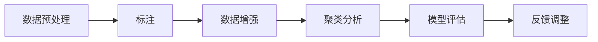

                 


### 《构建多样化示例集的策略》

---

#### 关键词：示例集构建、多样化策略、数据预处理、算法优化、案例分析

#### 摘要：
本文旨在探讨如何构建多样化示例集的策略。通过分析示例集构建的基础、多样性度量、优化方法以及具体实践，为读者提供一整套系统的构建方案。本文将详细阐述核心概念，分析算法原理，并借助实际案例进行深入剖析，以期为相关领域的研究和实践提供参考。

---

#### 第一部分: 引言

##### 引言

在当今快速发展的技术时代，数据驱动的人工智能和机器学习已经成为各行业的核心驱动力。然而，数据的质量和多样性直接影响到模型的性能和泛化能力。构建多样化示例集是实现高质量机器学习模型的关键步骤。本文将围绕这一主题，详细讨论示例集构建的策略和方法。

##### 问题背景

随着人工智能技术的不断进步，大量的机器学习模型被应用于各种场景。然而，模型的性能不仅依赖于算法的先进性，还与训练数据的质量和多样性密切相关。单一的示例集往往无法涵盖现实世界的复杂性和多样性，导致模型泛化能力受限。

##### 问题解决

为了解决这一问题，研究者们提出了多种方法来构建多样化的示例集。这些方法包括数据预处理、标注、优化和评估等步骤。本文将详细介绍这些方法，并探讨如何在实际应用中实施。

##### 边界与外延

本文主要讨论示例集的构建策略，而不涉及具体的机器学习算法实现。此外，本文的讨论将侧重于通用策略，不考虑特定领域的特殊性。

##### 核心概念

在构建多样化示例集的过程中，以下几个核心概念至关重要：

1. **示例集**：一组用于训练机器学习模型的样本数据。
2. **多样性**：示例集内样本的差异性。
3. **标注**：对示例进行标记，以便模型理解其特征。
4. **数据预处理**：对数据进行清洗、归一化等处理，以提高数据质量。
5. **优化策略**：通过调整模型参数和示例集，提高模型性能。

---

#### 第二部分: 示例集构建基础

##### 核心概念原理

在构建示例集之前，我们需要了解几个核心概念的基本原理。

1. **示例集定义**：示例集是机器学习模型训练的基础，它由一组具有特定标签的样本组成。
2. **示例集分类**：示例集可以按照数据类型（如文本、图像、音频等）进行分类。
3. **示例集构建方法**：示例集可以通过数据采集、标注、清洗和合成等方法构建。

##### 概念属性特征对比表格

下面是一个概念属性特征对比表格，用于展示不同示例集构建方法的优缺点。

| 方法         | 优点                                       | 缺点                                       |
|------------|------------------------------------------|------------------------------------------|
| 数据采集   | 可以获取真实世界的多样数据               | 可能存在数据偏差和噪声                     |
| 数据标注   | 数据具有明确的标签，有助于模型训练       | 需要大量人力和时间成本                   |
| 数据清洗   | 去除无效和错误的数据，提高数据质量       | 可能会丢失部分数据信息                   |
| 数据合成   | 可以生成大量具有多样性的数据             | 合成数据可能不够真实，影响模型泛化能力 |

##### ER实体关系图架构

为了更好地理解示例集构建的复杂性，我们可以通过ER（Entity-Relationship）实体关系图来描述不同实体之间的关系。

```mermaid
erDiagram
    DataSample ||--|{ Label : 被标注}
    DataPreprocessing ||--|{ DataSample : 处理后}
    DataAnnotation ||--|{ DataSample : 标注}
    DataQualityControl ||--|{ DataSample : 控制}
```

在这个ER图中，`DataSample` 是核心实体，它与 `Label`、`DataPreprocessing`、`DataAnnotation` 和 `DataQualityControl` 之间存在关联。

---

#### 第三部分: 示例集构建原理

##### 数据预处理与标注

数据预处理是示例集构建的基础步骤，它包括数据清洗、归一化、去噪等操作。以下是数据预处理的具体步骤：

1. **数据清洗**：去除无效和错误的数据。
2. **归一化**：将数据缩放到统一的范围内。
3. **去噪**：去除或减轻噪声对数据的影响。

标注则是将数据标签化的过程，它对于训练有监督学习模型至关重要。以下是标注方法：

1. **手工标注**：通过人工对数据进行标注。
2. **自动标注**：利用现有算法或模型对数据进行自动标注。

##### 示例集优化与评估

为了提高示例集的质量和多样性，我们需要采取一系列优化策略：

1. **数据增强**：通过变换、旋转、缩放等操作增加数据的多样性。
2. **聚类分析**：将相似的数据聚类，以便进行更有效的标注和优化。
3. **模型评估**：使用交叉验证、ROC曲线等指标评估示例集的质量。

以下是示例集优化的流程：



通过这个流程，我们可以逐步优化示例集，提高其质量。

##### 示例集构建案例分析

为了更好地理解示例集构建的过程，我们来看几个实际案例。

**案例一：文本分类**

在文本分类任务中，我们需要构建一个包含不同主题和情感倾向的文本示例集。以下是构建流程：

1. **数据采集**：从互联网上收集大量文本数据。
2. **数据预处理**：清洗文本，去除停用词和标点符号。
3. **标注**：人工标注文本类别。
4. **数据增强**：使用同义词替换和文本生成模型生成新的文本数据。
5. **模型训练**：使用增强后的数据训练文本分类模型。

**案例二：图像识别**

在图像识别任务中，我们需要构建一个包含不同类别和场景的图像示例集。以下是构建流程：

1. **数据采集**：从公开数据集或互联网上收集图像数据。
2. **数据预处理**：对图像进行缩放、裁剪等处理。
3. **标注**：对图像进行类别标注。
4. **数据增强**：使用图像合成技术生成新的图像数据。
5. **模型训练**：使用增强后的数据训练图像识别模型。

---

#### 第四部分: 多样化示例集构建策略

##### 多样性度量与评估

多样性度量是评估示例集质量的重要指标。以下是几种常用的多样性度量指标：

1. **信息熵**：用于衡量示例集中各类别的分布均匀性。
2. **标准差**：用于衡量示例集中各类别之间的差异性。
3. **交集与并集比**：用于衡量示例集中不同类别之间的相似性。

以下是一个信息熵的计算示例：

```python
import numpy as np

def entropy(p):
    return -np.sum(p * np.log2(p))

# 假设示例集的分布为 [0.5, 0.3, 0.2]
p = [0.5, 0.3, 0.2]
entropy(p)
```

##### 多样化示例集构建实践

在构建多样化示例集时，我们可以采用以下实践方法：

1. **多源数据融合**：从多个数据源获取数据，以提高示例集的多样性。
2. **多模态数据结合**：结合不同类型的数据（如文本、图像、音频），以构建更丰富的示例集。
3. **数据增强**：使用数据增强技术生成新的示例，以增加示例集的多样性。

以下是一个多源数据融合的示例：

```python
import pandas as pd

# 假设我们有两个数据源 A 和 B
data_source_a = pd.DataFrame({'text': ['text1', 'text2', 'text3']})
data_source_b = pd.DataFrame({'image': ['image1.jpg', 'image2.jpg', 'image3.jpg']})

# 融合数据源
data_source = pd.merge(data_source_a, data_source_b, on='common_key')
```

##### 多样化示例集构建工具与应用

在构建多样化示例集时，我们可以使用多种工具和技术。以下是一些常用工具：

1. **数据采集工具**：如 BeautifulSoup、Scrapy 等，用于从互联网上收集数据。
2. **标注工具**：如 LabelImg、VGG Image Annotator 等，用于对图像进行标注。
3. **数据增强工具**：如 Image augmenter、Text augmenter 等，用于生成新的示例数据。

以下是一个使用图像增强工具的示例：

```python
from imgaug import augmenters as iaa

# 定义增强策略
augmentation = iaa.Sequential([
    iaa.Fliplr(0.5), # 水平翻转
    iaa.Crop(percent=(0, 0.1)), # 裁剪
    iaa.Affine(
        scale={"x": (0.8, 1.2), "y": (0.8, 1.2)}, 
        translate_percent={"x": (-0.1, 0.1), "y": (-0.1, 0.1)}, 
        rotate=(-25, 25), 
        shear=(-8, 8)
    )
])

# 应用增强策略
augmented_images = augmentation.augment_images(images)
```

---

#### 第五部分: 拓展与总结

##### 拓展阅读

为了深入了解示例集构建的策略和方法，读者可以参考以下文献：

1. **相关研究**：研究多样化示例集在机器学习中的应用，如《Diversity in Data: A Survey》。
2. **未来趋势**：探讨多样化示例集构建的最新发展趋势和挑战，如《Toward Robust Deep Learning with Diverse Datasets》。
3. **开发者指南**：提供示例集构建的最佳实践和工具推荐，如《Building Diverse Datasets for Machine Learning》。

##### 小结

本文详细阐述了构建多样化示例集的策略和方法。通过分析示例集构建的基础、多样性度量、优化方法以及具体实践，我们为读者提供了一整套系统的构建方案。多样化示例集的构建对于提升机器学习模型的性能和泛化能力具有重要意义。

##### 注意事项

在构建多样化示例集时，需要注意以下几点：

1. **数据质量**：确保数据干净、无噪声。
2. **标注准确性**：标注过程需要高度准确。
3. **多样性度量**：合理选择多样性度量指标。

##### 进一步研究方向

未来研究可以关注以下几个方面：

1. **自动化标注技术**：研究自动化标注技术，以减少人力成本。
2. **新型多样性度量方法**：探索更有效的多样性度量方法。
3. **跨领域示例集构建**：研究跨领域示例集构建的方法和挑战。

---

### 作者：AI天才研究院/AI Genius Institute & 禅与计算机程序设计艺术 /Zen And The Art of Computer Programming

---

以上是本文《构建多样化示例集的策略》的完整内容。通过逐步分析和推理，我们深入探讨了示例集构建的核心概念、原理和实践方法。希望本文能为您在构建多样化示例集的过程中提供有益的参考和启示。在人工智能和机器学习领域，不断探索和优化是推动技术进步的关键。希望您在阅读本文后，能够有所收获，并继续在技术前沿探索新的可能性。

