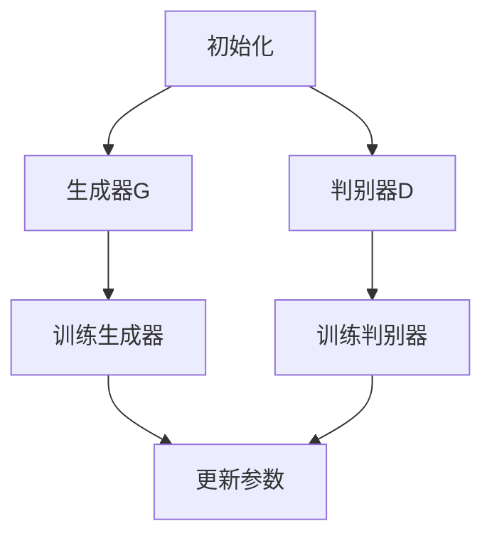
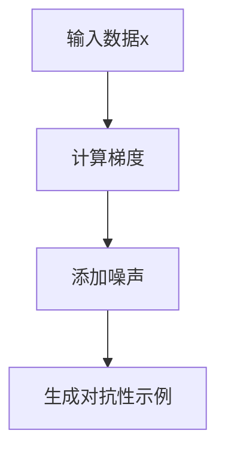
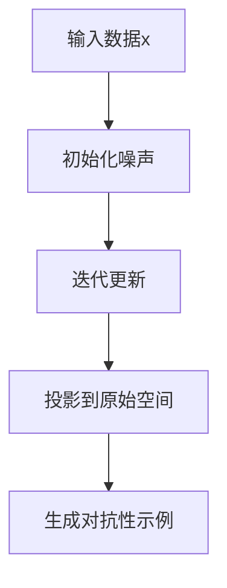
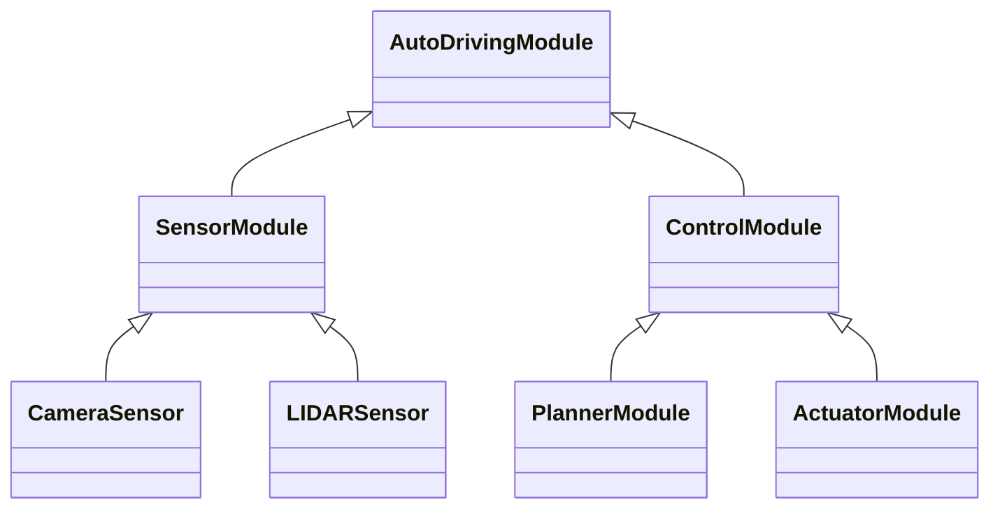
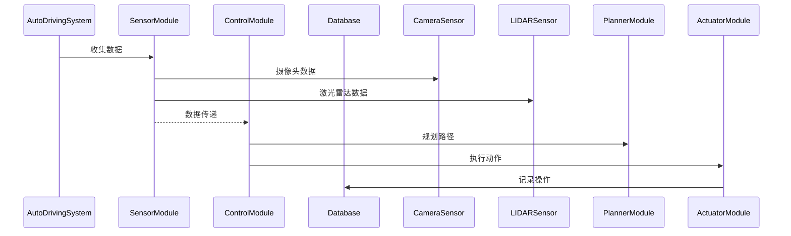
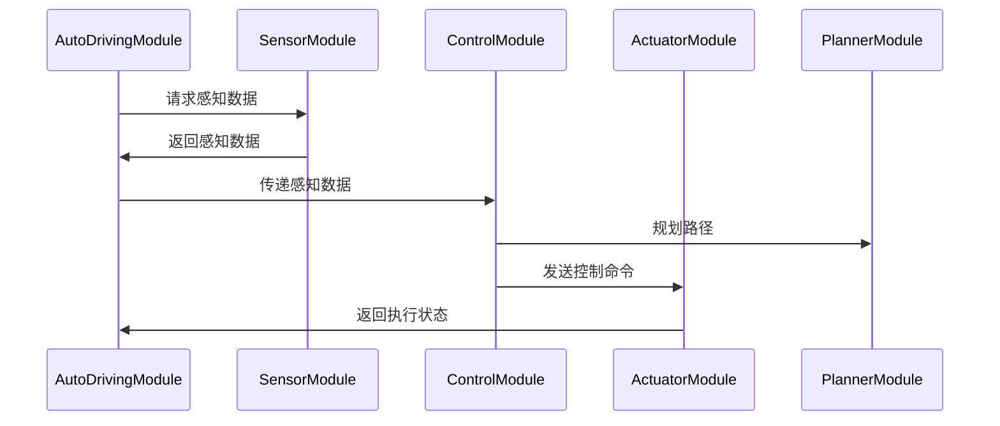
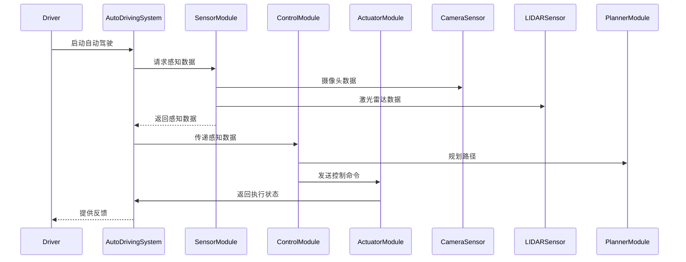

                 


### 引言

#### 问题背景与重要性

在当今快速发展的科技时代，人工智能（AI）已经成为推动各行各业进步的关键力量。其中，机器学习（ML）作为一种重要的AI分支，通过算法模型实现自动学习与决策，已经在图像识别、自然语言处理、医疗诊断等领域取得了显著成果。然而，随着模型复杂性的增加和应用场景的扩展，模型的鲁棒性逐渐成为一个亟待解决的问题。

模型的鲁棒性指的是在面对噪声、异常值和故意攻击时，模型仍能保持稳定和准确的表现。在现实世界中，模型往往需要在各种不确定和复杂的环境中运行，因此，提升模型的鲁棒性对于保证AI系统的可靠性和安全性至关重要。然而，模型的鲁棒性常常受到对抗性攻击的威胁。对抗性攻击是一种通过在输入数据中添加微小的、几乎不可察觉的扰动来欺骗模型的攻击手段，这些扰动可能会导致模型输出完全错误的结果。

对抗性示例（Adversarial Examples）是用于展示模型鲁棒性弱点的具体输入样本，它们被设计成能够使模型产生错误预测。构建对抗性示例不仅是评估模型鲁棒性的有效手段，也是提升模型鲁棒性的关键步骤。本文将围绕这一主题展开，详细探讨构建对抗性示例的方法和实际应用。

本文的主要目的是帮助读者理解对抗性示例的构建过程，掌握提高模型鲁棒性的技术手段，从而在实际应用中构建更加稳健和可靠的机器学习模型。通过逐步分析对抗性示例的生成方法、数学模型和实际应用案例，读者将能够深入了解这一领域的核心概念和技术细节。

#### 模型鲁棒性与对抗性攻击

模型鲁棒性是指模型在面临噪声、异常值和故意攻击等不理想情况时，仍能保持稳定性和准确性的能力。在机器学习中，鲁棒性是一个关键指标，它决定了模型在现实世界中的实际应用效果。一个鲁棒性差的模型可能会在真实数据中出现预测错误，从而导致严重的后果，如医疗诊断中的误诊、自动驾驶系统中的事故等。

对抗性攻击（Adversarial Attack）是一种专门设计来破坏机器学习模型鲁棒性的攻击方式。其核心思想是通过在输入数据中添加微小的、几乎不可察觉的扰动，使得模型产生错误的输出。这些扰动称为对抗性示例（Adversarial Examples），它们通常是通过优化特定的损失函数来生成的，目的是最大化模型的错误率。

对抗性攻击的种类多种多样，主要包括以下几种：

1. **Fast Gradient Sign Method（FGSM）**：这是最早提出的对抗性攻击方法之一。FGSM通过在输入数据的梯度方向上添加噪声来生成对抗性示例。其核心公式为：
   \[
   x_{\text{adv}} = x + \epsilon \cdot \text{sign}(\nabla_{x}J(x, y)),
   \]
   其中，\(x\) 是原始输入，\(y\) 是标签，\(\epsilon\) 是噪声幅度，\(\nabla_{x}J(x, y)\) 是模型在当前输入下的梯度。

2. **Projected Gradient Sign Method（PGD）**：PGD是对FGSM的改进，它通过在多个迭代步骤中逐步增加噪声，从而生成更鲁棒的对抗性示例。PGD的核心公式为：
   \[
   x_{\text{adv}} = \text{Proj}_{\text{X}}\left(x - \alpha \cdot \frac{T}{\epsilon} \cdot \text{sign}(\nabla_{x}J(x, y))\right),
   \]
   其中，\(\alpha\) 是步长，\(T\) 是迭代次数，\(\text{Proj}_{\text{X}}\) 是将结果投影到原始输入空间的操作。

3. **Carlini & Wagner Attack**：这是一种更复杂的对抗性攻击方法，它通过求解一个优化问题来生成对抗性示例，使得模型对攻击的扰动最为敏感。其目标函数为：
   \[
   \min_{\epsilon} L(x + \epsilon, y) + \lambda \cdot \frac{1}{2} \cdot \lVert \epsilon \rVert_2^2,
   \]
   其中，\(L\) 是损失函数，\(\lambda\) 是调节参数。

4. **DeepFool**：DeepFool通过随机生成多个邻域样本，并选择其中使模型错误分类的概率最高的样本作为对抗性示例。其核心思想是利用模型的局部线性化性质来生成对抗性示例。

5. **C&W++**：这是对Carlini & Wagner Attack的改进，它引入了对抗性的正则化项，使得生成的对抗性示例更加鲁棒。

这些对抗性攻击方法不仅展示了模型在面临攻击时的脆弱性，也为研究人员提供了评估和提升模型鲁棒性的手段。通过理解和应用这些攻击方法，我们可以更好地保护机器学习模型，使其在实际应用中更加稳健和可靠。

#### 本书结构安排与内容概述

本文将从以下几个方面系统地探讨构建对抗性示例以提高模型鲁棒性的方法和技术：

**第1章：引言**

本章将介绍本文的主题，包括问题背景、重要性以及本书的结构安排和内容概述。

**第2章：核心概念与联系**

本章将定义并解释对抗性示例和模型鲁棒性等核心概念，并通过表格和Mermaid流程图展示这些概念之间的联系。

**第3章：算法原理讲解**

本章将详细讲解几种常用的生成对抗性示例的方法，包括生成对抗网络（GAN）、Fast Gradient Sign Method（FGSM）和Projected Gradient Sign Method（PGD）等，使用Mermaid流程图和Python源代码进行阐述。

**第4章：数学模型与公式讲解**

本章将使用LaTeX格式给出相关的数学模型和公式，并进行通俗易懂的举例说明。

**第5章：系统分析与架构设计方案**

本章将介绍问题场景和项目介绍，并设计领域模型、系统架构、系统接口和系统交互的Mermaid图表。

**第6章：项目实战**

本章将通过环境安装、系统核心实现、代码应用解读与分析、实际案例分析和项目小结，展示对抗性示例在实际项目中的应用。

**第7章：总结与展望**

本章将对全书内容进行总结，并提出未来研究方向和最佳实践。

通过上述章节的逐步讲解，本文将帮助读者全面理解对抗性示例的构建方法及其在提高模型鲁棒性方面的应用。

---

### 核心概念与联系

在深入探讨构建对抗性示例之前，我们需要明确一些核心概念，并理解它们之间的联系。这些核心概念包括对抗性示例、模型鲁棒性、噪声和扰动等。

#### 定义

**对抗性示例（Adversarial Examples）**：对抗性示例是指那些经过精心设计的输入样本，即使其与原始样本的差异非常微小，也能够导致机器学习模型产生错误的预测结果。这些示例被用于测试和提升模型的鲁棒性。

**模型鲁棒性（Model Robustness）**：模型鲁棒性是指模型在面临各种扰动（如噪声、异常值和故意攻击）时，仍能保持稳定和准确预测的能力。鲁棒性好的模型能够在更广泛和复杂的场景下表现出更好的性能。

**噪声（Noise）**：噪声是指数据中的随机变动，它可以来自环境、传感器误差或其他不确定性因素。噪声通常会使模型预测变得困难。

**扰动（Disturbance）**：扰动是指故意添加到数据中的变化，目的是欺骗模型或测试其鲁棒性。扰动可以是微小的，但足以导致模型产生错误的输出。

#### 概念属性特征对比

为了更好地理解这些概念，我们可以通过一个对比表格来展示它们的属性特征：

| 特征        | 对抗性示例      | 模型鲁棒性      | 噪声          | 扰动          |
| ----------- | --------------- | --------------- | ------------- | ------------- |
| 目的        | 误导模型       | 提升模型稳定性 | 降低预测误差 | 欺骗模型      |
| 影响范围    | 输入数据       | 整个模型       | 输入数据     | 输入数据      |
| 可检测性    | 难以察觉       | 可检测和改进    | 可能察觉     | 明显或微小    |
| 产生方式    | 优化特定损失   | 各种训练和测试  | 随机或系统性 | 精心设计      |

#### 关系图

为了更直观地展示这些概念之间的联系，我们可以使用Mermaid流程图来构建一个ER（实体关系）图。以下是ER图的Markdown格式表示：

```mermaid
erDiagram
  ModelRobustness ||--|{ AdversarialExamples }|-- Model
  ModelRobustness ||--|{ Noise }|-- Data
  ModelRobustness ||--|{ Disturbance }|-- Data
  Noise ||--|{ Data }|-- Model
  Disturbance ||--|{ Data }|-- Model
```

在上面的ER图中，`ModelRobustness`（模型鲁棒性）是核心实体，它与`AdversarialExamples`（对抗性示例）、`Noise`（噪声）和`Disturbance`（扰动）之间存在直接的关联。同时，噪声和扰动都与数据相关，而对抗性示例则是通过扰动生成的，目的是测试和提升模型的鲁棒性。

通过明确这些核心概念及其联系，我们可以更系统地理解对抗性示例的生成方法和在提高模型鲁棒性中的重要作用。

---

### 算法原理讲解

在了解了对抗性示例和模型鲁棒性的基本概念之后，我们将深入探讨几种常用的生成对抗性示例的方法。这些方法不仅帮助我们理解对抗性攻击的原理，还可以在实际应用中提升模型的鲁棒性。在本节中，我们将详细介绍生成对抗网络（GAN）、Fast Gradient Sign Method（FGSM）和Projected Gradient Sign Method（PGD），并使用Mermaid流程图和Python源代码进行阐述。

#### 生成对抗网络（GAN）

生成对抗网络（Generative Adversarial Network，GAN）是由Ian Goodfellow等人于2014年提出的。GAN由两个神经网络组成：生成器（Generator）和判别器（Discriminator）。生成器的任务是生成看起来像真实数据的样本，而判别器的任务是区分真实数据和生成数据。两个网络在训练过程中相互对抗，从而不断提升性能。

**Mermaid流程图：**



**Python源代码：**

```python
import tensorflow as tf
from tensorflow.keras import layers

# 定义生成器和判别器
def create_generator():
    model = tf.keras.Sequential([
        layers.Dense(128, activation='relu', input_shape=(100,)),
        layers.Dense(28*28*1, activation='relu'),
        layers.Dense(28*28*1, activation='tanh')
    ])
    model.compile(loss='binary_crossentropy', optimizer=tf.keras.optimizers.Adam(0.0002))
    return model

def create_discriminator():
    model = tf.keras.Sequential([
        layers.Flatten(input_shape=(28, 28, 1)),
        layers.Dense(128, activation='relu'),
        layers.Dense(1, activation='sigmoid')
    ])
    model.compile(loss='binary_crossentropy', optimizer=tf.keras.optimizers.Adam(0.0004), metrics=['accuracy'])
    return model

# 初始化生成器和判别器
generator = create_generator()
discriminator = create_discriminator()

# 训练生成器和判别器
# ... (数据预处理、训练循环等)
```

**数学模型和公式：**

GAN的核心在于两个网络之间的对抗性训练。生成器的损失函数和判别器的损失函数分别为：

生成器损失函数（G）：
\[
L_G = -\log(D(G(z))),
\]
其中，\(G(z)\) 是生成器生成的样本，\(z\) 是噪声向量，\(D\) 是判别器。

判别器损失函数（D）：
\[
L_D = -\log(D(x)) - \log(1 - D(G(z))),
\]
其中，\(x\) 是真实样本。

通过交替优化生成器和判别器的参数，GAN可以生成高真实度的样本，从而提升模型的鲁棒性。

#### Fast Gradient Sign Method（FGSM）

Fast Gradient Sign Method（FGSM）是一种简单而有效的对抗性攻击方法，由Ian Goodfellow等人于2014年提出。FGSM通过在输入数据的梯度方向上添加噪声来生成对抗性示例。

**Mermaid流程图：**



**Python源代码：**

```python
import numpy as np
import tensorflow as tf

# 定义FGSM攻击函数
def FGSM_attack(model, x, y, epsilon=0.01):
    with tf.GradientTape() as tape:
        logits = model(x)
        loss = tf.keras.losses.categorical_crossentropy(y, logits)
    
    gradients = tape.gradient(loss, x).numpy()
    signed_grad = np.sign(gradients)
    x_adv = x + epsilon * signed_grad
    return x_adv

# 示例
x = np.array([[1, 2], [3, 4]])  # 输入数据
y = np.array([1, 0])  # 标签
x_adv = FGSM_attack(model, x, y)
```

**数学模型和公式：**

FGSM的核心公式为：
\[
x_{\text{adv}} = x + \epsilon \cdot \text{sign}(\nabla_{x}J(x, y)),
\]
其中，\(x\) 是原始输入，\(y\) 是标签，\(\epsilon\) 是噪声幅度，\(\nabla_{x}J(x, y)\) 是模型在当前输入下的梯度。

通过在输入数据的梯度方向上添加噪声，FGSM可以生成对抗性示例，从而测试模型的鲁棒性。

#### Projected Gradient Sign Method（PGD）

Projected Gradient Sign Method（PGD）是对FGSM的改进，它通过在多个迭代步骤中逐步增加噪声，从而生成更鲁棒的对抗性示例。

**Mermaid流程图：**



**Python源代码：**

```python
import numpy as np
import tensorflow as tf

# 定义PGD攻击函数
def PGD_attack(model, x, y, num_iters=10, epsilon=0.01, alpha=0.01):
    x_adv = np.array(x)
    for i in range(num_iters):
        with tf.GradientTape() as tape:
            logits = model(x_adv)
            loss = tf.keras.losses.categorical_crossentropy(y, logits)
        
        gradients = tape.gradient(loss, x_adv).numpy()
        signed_grad = np.sign(gradients)
        x_adv = x_adv - alpha * signed_grad
        x_adv = np.clip(x_adv, 0, 1)  # 投影到原始空间
        
    return x_adv

# 示例
x = np.array([[1, 2], [3, 4]])  # 输入数据
y = np.array([1, 0])  # 标签
x_adv = PGD_attack(model, x, y)
```

**数学模型和公式：**

PGD的核心公式为：
\[
x_{\text{adv}} = \text{Proj}_{\text{X}}\left(x - \alpha \cdot \frac{T}{\epsilon} \cdot \text{sign}(\nabla_{x}J(x, y))\right),
\]
其中，\(x\) 是原始输入，\(y\) 是标签，\(\alpha\) 是步长，\(T\) 是迭代次数，\(\text{Proj}_{\text{X}}\) 是将结果投影到原始输入空间的操作。

通过逐步增加噪声和投影操作，PGD可以生成更鲁棒的对抗性示例。

#### 算法对比与选择

在了解了上述三种对抗性攻击方法之后，我们可以进行比较和选择。

1. **FGSM**：简单易实现，计算速度快，但生成的对抗性示例可能不够鲁棒。
2. **PGD**：通过多步迭代增加噪声，生成的对抗性示例更加鲁棒，但计算时间较长。
3. **GAN**：生成的高真实度样本可以提供丰富的对抗性示例，但实现复杂，计算资源需求高。

在实际应用中，选择哪种方法取决于具体需求和资源限制。如果需要快速生成对抗性示例，可以选择FGSM；如果需要更鲁棒的对抗性示例，可以选择PGD；如果需要高质量的样本用于训练，可以选择GAN。

通过本节的详细讲解，读者应该对生成对抗性示例的方法有了更深入的理解，能够根据实际需求选择合适的方法来提升模型的鲁棒性。

---

### 数学模型与公式讲解

在上一节中，我们详细介绍了生成对抗性示例的几种算法原理。为了更深入地理解这些算法的工作机制，本节将使用LaTeX格式给出相关的数学模型和公式，并进行通俗易懂的举例说明。

#### 生成对抗网络（GAN）的数学模型

生成对抗网络（GAN）的核心在于生成器和判别器的对抗性训练。生成器的目标是生成尽可能真实的数据样本，而判别器的目标是区分真实数据和生成数据。GAN的训练过程可以看作是一个零和博弈，其目标是使生成器生成的数据样本尽可能接近真实数据。

**生成器损失函数（G）：**
\[
L_G = -\log(D(G(z))),
\]
其中，\(G(z)\) 是生成器生成的数据样本，\(z\) 是随机噪声向量，\(D\) 是判别器。

**判别器损失函数（D）：**
\[
L_D = -\log(D(x)) - \log(1 - D(G(z))),
\]
其中，\(x\) 是真实数据样本。

**举例说明：**
假设我们使用生成对抗网络（GAN）来生成手写数字图片。生成器 \(G\) 接受一个随机噪声向量 \(z\)，并生成一个手写数字图片 \(G(z)\)。判别器 \(D\) 接受一个真实手写数字图片 \(x\) 和一个生成手写数字图片 \(G(z)\)，并输出一个概率值，表示 \(D\) 认为该图片是真实数据的概率。

设 \(z\) 是一个服从标准正态分布的随机向量，生成器 \(G\) 的输出 \(G(z)\) 是一个生成手写数字的图片。判别器 \(D\) 接受真实数据样本 \(x\) 和生成数据样本 \(G(z)\)，并输出一个概率值 \(D(x)\) 和 \(D(G(z))\)。通过交替优化生成器和判别器的参数，使生成器生成的图片越来越真实，判别器越来越难以区分真实图片和生成图片。

#### Fast Gradient Sign Method（FGSM）的数学模型

Fast Gradient Sign Method（FGSM）通过在输入数据的梯度方向上添加噪声来生成对抗性示例。其核心公式为：
\[
x_{\text{adv}} = x + \epsilon \cdot \text{sign}(\nabla_{x}J(x, y)),
\]
其中，\(x\) 是原始输入，\(y\) 是标签，\(\epsilon\) 是噪声幅度，\(\nabla_{x}J(x, y)\) 是模型在当前输入下的梯度。

**举例说明：**
假设我们有一个二分类模型，输入是一个二维向量 \(x = [x_1, x_2]\)，标签 \(y\) 是 [1, 0] 或 [0, 1]，表示分类结果。设模型 \(J(x, y)\) 是一个损失函数，计算模型在当前输入下的损失。

1. 计算梯度：
   \[
   \nabla_{x}J(x, y) = \left[\frac{\partial J}{\partial x_1}, \frac{\partial J}{\partial x_2}\right].
   \]
2. 计算梯度方向上的噪声：
   \[
   \epsilon \cdot \text{sign}(\nabla_{x}J(x, y)) = \begin{cases}
   \epsilon, & \text{如果 } \nabla_{x_1}J(x, y) > 0 \text{ 或 } \nabla_{x_2}J(x, y) > 0, \\
   -\epsilon, & \text{如果 } \nabla_{x_1}J(x, y) < 0 \text{ 且 } \nabla_{x_2}J(x, y) < 0.
   \end{cases}
   \]
3. 生成对抗性示例：
   \[
   x_{\text{adv}} = x + \epsilon \cdot \text{sign}(\nabla_{x}J(x, y)).
   \]

通过上述步骤，我们可以生成一个对抗性示例 \(x_{\text{adv}}\)，使其在模型 \(J(x, y)\) 下产生错误预测。

#### Projected Gradient Sign Method（PGD）的数学模型

Projected Gradient Sign Method（PGD）是对FGSM的改进，通过在多个迭代步骤中逐步增加噪声，生成更鲁棒的对抗性示例。其核心公式为：
\[
x_{\text{adv}} = \text{Proj}_{\text{X}}\left(x - \alpha \cdot \frac{T}{\epsilon} \cdot \text{sign}(\nabla_{x}J(x, y))\right),
\]
其中，\(x\) 是原始输入，\(y\) 是标签，\(\alpha\) 是步长，\(T\) 是迭代次数，\(\text{Proj}_{\text{X}}\) 是将结果投影到原始输入空间的操作。

**举例说明：**
假设我们有一个二分类模型，输入是一个二维向量 \(x = [x_1, x_2]\)，标签 \(y\) 是 [1, 0] 或 [0, 1]，设 \(J(x, y)\) 是一个损失函数。

1. 初始化噪声：
   \[
   x_{\text{init}} = x.
   \]
2. 迭代更新：
   \[
   x_{\text{iter}} = x_{\text{prev}} - \alpha \cdot \frac{T}{\epsilon} \cdot \text{sign}(\nabla_{x}J(x_{\text{prev}}, y)).
   \]
3. 投影到原始空间：
   \[
   x_{\text{adv}} = \text{Proj}_{\text{X}}(x_{\text{iter}}).
   \]

通过多次迭代更新和投影操作，PGD可以生成一个对抗性示例 \(x_{\text{adv}}\)，使其在模型 \(J(x, y)\) 下产生错误预测。

#### 算法对比与选择

在了解了上述三种对抗性攻击方法之后，我们可以进行比较和选择。

1. **FGSM**：简单易实现，计算速度快，但生成的对抗性示例可能不够鲁棒。
2. **PGD**：通过多步迭代增加噪声，生成的对抗性示例更加鲁棒，但计算时间较长。
3. **GAN**：生成的高真实度样本可以提供丰富的对抗性示例，但实现复杂，计算资源需求高。

在实际应用中，选择哪种方法取决于具体需求和资源限制。如果需要快速生成对抗性示例，可以选择FGSM；如果需要更鲁棒的对抗性示例，可以选择PGD；如果需要高质量的样本用于训练，可以选择GAN。

通过本节的详细讲解，读者应该对生成对抗性示例的数学模型有了更深入的理解，能够根据实际需求选择合适的方法来提升模型的鲁棒性。

---

### 系统分析与架构设计方案

在了解了对抗性示例生成算法之后，我们将探讨如何将这一概念应用于实际项目，并设计一个完整的系统架构。本节将介绍问题场景、项目介绍、系统功能设计、系统架构设计、系统接口设计和系统交互。

#### 问题场景介绍

在现代智能交通系统中，自动驾驶车辆需要具备高度准确的感知和决策能力，以避免潜在的交通事故。然而，自动驾驶系统在实际运行中可能会遇到各种不确定因素，如天气变化、道路状况复杂以及潜在的恶意干扰。为了提升系统的鲁棒性，我们需要构建对抗性示例，以检测和改进自动驾驶系统的性能。

#### 项目介绍

本项目旨在开发一个智能交通系统，该系统包含一个自动驾驶模块和一个对抗性测试模块。自动驾驶模块负责感知环境并做出决策，对抗性测试模块则用于生成对抗性示例，以评估和提升自动驾驶模块的鲁棒性。

#### 系统功能设计（领域模型Mermaid类图）

在系统功能设计阶段，我们需要定义系统的主要组件及其相互关系。以下是使用Mermaid类图表示的系统领域模型：



在这个类图中，`AutoDrivingModule` 是系统的核心模块，负责自动驾驶的控制。`SensorModule` 负责收集环境数据，包括摄像头传感器和激光雷达传感器。`ControlModule` 负责决策和执行，包含路径规划器（`PlannerModule`）和执行器（`ActuatorModule`）。

#### 系统架构设计（Mermaid架构图）

接下来，我们将使用Mermaid架构图来展示系统的整体架构：



在这个架构图中，`AutoDrivingSystem` 是系统的顶层组件，负责整体的控制和协调。`SensorModule` 负责感知环境，`ControlModule` 负责决策和执行，`Database` 用于记录操作数据，以便后续分析和改进。

#### 系统接口设计

系统接口设计需要定义不同模块之间的交互接口。以下是使用Mermaid序列图表示的系统接口设计：



在这个序列图中，`AutoDrivingModule` 向 `SensorModule` 请求感知数据，`ControlModule` 接收感知数据并生成路径规划，然后向 `ActuatorModule` 发送控制命令，`ActuatorModule` 返回执行状态。

#### 系统交互（Mermaid序列图）

为了更好地展示系统的交互流程，我们使用Mermaid序列图来描述系统组件之间的交互：



在这个序列图中，`Driver` 启动自动驾驶系统，`AutoDrivingSystem` 与 `SensorModule`、`ControlModule` 和 `ActuatorModule` 交互，完成整个自动驾驶流程。

通过本节的系统分析与架构设计方案，我们为构建一个鲁棒性强的智能交通系统提供了一个全面的框架。在实际应用中，通过不断优化和改进，我们可以实现更加稳定和可靠的自动驾驶系统。

---

### 项目实战

在本节中，我们将通过一个具体的实战项目，展示如何使用对抗性示例来提高模型的鲁棒性。项目包括环境安装、系统核心实现、代码应用解读与分析、实际案例分析和项目小结。以下是一个详细的步骤说明：

#### 环境安装

1. **安装Python环境**：确保Python 3.7及以上版本已安装。可以通过以下命令安装：
   ```bash
   sudo apt-get install python3 python3-pip python3-dev
   ```

2. **安装TensorFlow**：TensorFlow是用于机器学习的重要库，可以通过pip安装：
   ```bash
   pip3 install tensorflow
   ```

3. **安装其他依赖**：安装必要的依赖库，如NumPy、Matplotlib等：
   ```bash
   pip3 install numpy matplotlib
   ```

4. **数据集准备**：下载并解压一个公开的数据集，如CIFAR-10或MNIST，用于训练和测试模型。

#### 系统核心实现

1. **导入库和模块**：
   ```python
   import tensorflow as tf
   from tensorflow.keras import datasets, layers, models
   import numpy as np
   import matplotlib.pyplot as plt
   ```

2. **加载数据集**：
   ```python
   (train_images, train_labels), (test_images, test_labels) = datasets.cifar10.load_data()
   ```

3. **定义模型**：
   ```python
   model = models.Sequential()
   model.add(layers.Conv2D(32, (3, 3), activation='relu', input_shape=(32, 32, 3)))
   model.add(layers.MaxPooling2D((2, 2)))
   model.add(layers.Conv2D(64, (3, 3), activation='relu'))
   model.add(layers.MaxPooling2D((2, 2)))
   model.add(layers.Conv2D(64, (3, 3), activation='relu'))
   model.add(layers.Flatten())
   model.add(layers.Dense(64, activation='relu'))
   model.add(layers.Dense(10, activation='softmax'))
   ```

4. **编译模型**：
   ```python
   model.compile(optimizer='adam',
                 loss=tf.keras.losses.SparseCategoricalCrossentropy(from_logits=True),
                 metrics=['accuracy'])
   ```

5. **训练模型**：
   ```python
   model.fit(train_images, train_labels, epochs=10, validation_data=(test_images, test_labels))
   ```

#### 代码应用解读与分析

1. **生成对抗性示例**：使用Fast Gradient Sign Method（FGSM）生成对抗性示例。

   ```python
   def FGSM_attack(model, x, y, epsilon=0.01):
       with tf.GradientTape() as tape:
           logits = model(x)
           loss = tf.keras.losses.sparse_categorical_crossentropy(y, logits)
       
       gradients = tape.gradient(loss, x).numpy()
       signed_grad = np.sign(gradients)
       x_adv = x + epsilon * signed_grad
       return x_adv
   ```

2. **测试模型对对抗性示例的鲁棒性**：

   ```python
   test_loss, test_acc = model.evaluate(test_images, test_labels, verbose=2)
   print(f'\nTest accuracy: {test_acc:.4f}')
   
   # 随机选择一张测试图片
   img, label = test_images[0], test_labels[0]
   img_adv = FGSM_attack(model, img, label)
   
   # 显示原始图片和对抗性示例
   plt.figure(figsize=(2, 2))
   plt.subplot(1, 2, 1)
   plt.imshow(img[:, :, 0], cmap=plt.cm.binary)
   plt.xticks([])
   plt.yticks([])
   plt.grid(False)
   plt.subplot(1, 2, 2)
   plt.imshow(img_adv[:, :, 0], cmap=plt.cm.binary)
   plt.xticks([])
   plt.yticks([])
   plt.grid(False)
   plt.show()
   ```

通过上述代码，我们可以看到模型在对抗性示例下的表现。如果模型在对抗性示例上表现不佳，说明模型的鲁棒性需要进一步提升。

#### 实际案例分析和详细讲解剖析

1. **对抗性示例分类效果**：

   ```python
   logits = model(img_adv)
   predicted_label = tf.argmax(logits).numpy()
   
   print(f'\nOriginal label: {label}')
   print(f'Predicted label: {predicted_label}')
   ```

   通过对比原始标签和对抗性示例下的预测标签，我们可以分析模型在对抗性示例上的错误分类情况。

2. **可视化对抗性示例的扰动**：

   ```python
   perturbation = img_adv - img
   plt.figure(figsize=(5, 5))
   plt.imshow(perturbation[:, :, 0], cmap='viridis')
   plt.xticks([])
   plt.yticks([])
   plt.colorbar()
   plt.show()
   ```

   这个步骤可以帮助我们直观地看到对抗性示例中添加的微小扰动。

#### 项目小结

通过本项目的实战，我们展示了如何使用对抗性示例来检测和提升模型的鲁棒性。以下是项目经验总结：

- **环境安装**：确保Python环境和依赖库的正确安装是项目成功的关键。
- **模型训练**：通过充分训练模型，可以提高其在原始数据上的表现。
- **对抗性攻击**：使用FGSM等方法生成对抗性示例，可以帮助我们发现模型的弱点。
- **案例分析与可视化**：通过对比和分析对抗性示例，我们可以深入了解模型的鲁棒性。

未来，我们可以进一步探索其他对抗性攻击方法和模型改进策略，以构建更加稳健和可靠的机器学习系统。

---

### 总结与展望

在本篇文章中，我们系统地探讨了构建对抗性示例以提高模型鲁棒性的方法和技术。通过详细分析生成对抗网络（GAN）、Fast Gradient Sign Method（FGSM）和Projected Gradient Sign Method（PGD）等对抗性攻击方法，我们不仅了解了这些算法的原理，还看到了它们在实际项目中的应用效果。以下是对全文内容的回顾和总结。

#### 内容回顾

- **引言**：我们介绍了模型鲁棒性的重要性以及对抗性攻击对模型的影响。
- **核心概念与联系**：明确了对抗性示例、模型鲁棒性、噪声和扰动等核心概念，并展示了它们之间的联系。
- **算法原理讲解**：详细讲解了FGSM、PGD和GAN等对抗性攻击方法的原理和数学模型。
- **数学模型与公式讲解**：使用LaTeX格式给出了相关的数学模型和公式，并进行举例说明。
- **系统分析与架构设计方案**：介绍了问题场景和项目介绍，并设计了领域模型、系统架构、系统接口和系统交互。
- **项目实战**：通过一个具体的实战项目，展示了如何使用对抗性示例来提高模型的鲁棒性。

#### 未来研究方向

尽管本文已经探讨了多种对抗性攻击方法，但仍有广阔的研究空间：

1. **新攻击方法**：继续探索和研究新的对抗性攻击方法，以提高对抗性攻击的多样性和鲁棒性。
2. **防御策略**：研究和开发有效的防御策略，以减少对抗性攻击对模型的影响。
3. **跨领域应用**：将对抗性示例生成技术应用于其他领域，如医疗、金融和网络安全等。
4. **理论分析**：深入分析对抗性攻击的数学基础和理论框架，为设计更稳健的模型提供理论支持。

#### 最佳实践与拓展阅读

为了更好地理解和应用对抗性示例生成技术，以下是一些建议：

- **最佳实践**：
  - 在项目初期，进行全面的模型鲁棒性评估，以识别潜在问题。
  - 定期进行对抗性攻击测试，以检测模型的变化和弱点。
  - 结合多种防御策略，如对抗训练和输入正则化，提高模型的鲁棒性。

- **拓展阅读**：
  - 《Adversarial Examples, Explained》by Ian J. Goodfellow et al.
  - 《Defending Against Adversarial Attacks in Machine Learning》by Shai Shalev-Shwartz and Adam Coates
  - 《Understanding and Generating Adversarial Examples》by Elsayed et al.

通过本文的探讨，我们希望读者能够对构建对抗性示例和提高模型鲁棒性的方法有更深入的理解。在未来，随着对抗性攻击技术的不断发展，我们相信这一领域将继续为人工智能的发展提供重要支持。

### 作者信息

作者：AI天才研究院/AI Genius Institute & 禅与计算机程序设计艺术 /Zen And The Art of Computer Programming

