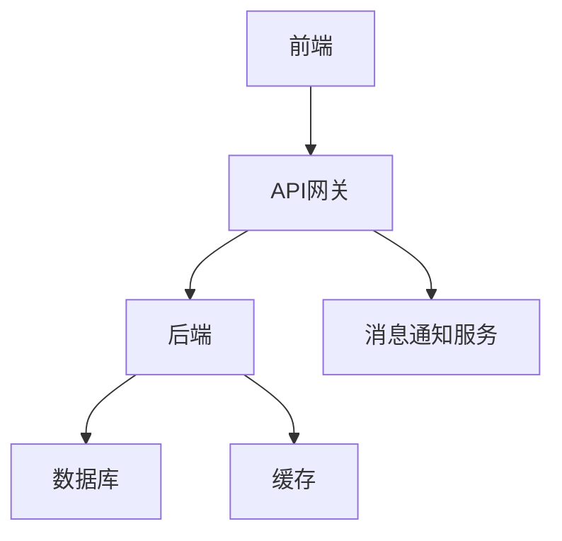

                 


## 构建弹性可伸缩的LLM应用基础设施

### 关键词：
- 弹性计算
- 可伸缩性
- 语言模型（LLM）
- 云计算
- 基础设施建设

### 摘要：
本文深入探讨了构建弹性可伸缩的LLM（大型语言模型）应用基础设施的重要性。通过逐步分析，本文将介绍关键概念、构建原则、实施策略和最佳实践，帮助开发者理解和实施高效、可靠且灵活的LLM应用基础设施。

### 第1章：问题背景与核心概念

#### 1.1 问题的提出
随着人工智能技术的快速发展，大型语言模型（LLM）如GPT-3、BERT等，在自然语言处理（NLP）领域取得了显著成果。然而，如何构建一个既弹性又可伸缩的LLM应用基础设施，以支持日益增长的用户需求和高并发场景，成为了一个亟待解决的问题。

#### 1.2 语言模型（LLM）简介
LLM是一种基于深度学习的语言处理模型，能够理解和生成自然语言。其核心在于大规模的预训练和微调，以实现高度准确的文本理解和生成。

#### 1.3 弹性与可伸缩性原则
弹性（Elasticity）指的是系统在需求变化时能够快速响应并调整资源的能力。可伸缩性（Scalability）则是指系统能够随负载增加而扩展的能力。两者共同构成了构建高效LLM基础设施的基础。

### 第2章：LLM基础技术

#### 2.1 语言模型的历史与演进
从最初的统计模型到深度学习模型，语言模型经历了巨大的变革。本章将回顾这一历史进程，并探讨当前主流LLM技术。

#### 2.2 常见LLM架构与技术
包括Transformer、BERT、GPT等模型的工作原理和特点，以及它们在实际应用中的表现。

#### 2.3 LLM的关键性能指标
如准确度、响应时间、吞吐量等，这些指标对于评估和优化LLM应用至关重要。

### 第3章：基础设施构建原理

#### 3.1 弹性计算与云计算
弹性计算是如何实现的，云计算平台如何支持LLM应用，以及常见的选择策略。

#### 3.2 数据存储与数据管理
分布式存储系统、数据同步与备份策略，以及如何处理海量数据。

#### 3.3 网络优化与安全性
网络架构的设计、数据传输优化、安全防护措施等，确保系统稳定和安全。

### 第4章：弹性设计策略

#### 4.1 弹性架构设计原则
如何设计一个具有高度弹性的系统，包括模块化、分布式架构等原则。

#### 4.2 容量规划与资源分配
根据业务需求进行资源分配和容量规划，以实现最优的资源利用率。

#### 4.3 自动化与监控
利用自动化工具和监控体系实现系统的自我管理和故障恢复。

### 第5章：可伸缩性实现

#### 5.1 扩展性与水平扩展
如何通过水平扩展（Scaling Out）来提高系统的处理能力。

#### 5.2 垂直扩展与性能优化
垂直扩展（Scaling Up）的优势与挑战，以及性能优化技巧。

#### 5.3 微服务架构的应用
微服务架构在构建可伸缩LLM应用中的角色和优势。

### 第6章：案例研究

#### 6.1 案例一：在线问答平台
分析一个实际案例，讨论如何构建一个高弹性、可伸缩的在线问答平台。

#### 6.2 案例二：智能客服系统
智能客服系统的设计与实现，以及如何处理高并发场景。

#### 6.3 案例三：个性化推荐系统
个性化推荐系统的设计，如何利用LLM实现精准推荐。

### 第7章：最佳实践

#### 7.1 性能调优技巧
针对LLM应用的性能调优方法，包括模型优化、系统优化等。

#### 7.2 安全性与合规性
确保LLM应用安全性和合规性的最佳实践。

#### 7.3 用户体验与反馈
如何根据用户反馈进行系统优化，提高用户体验。

### 第8章：总结与展望

#### 8.1 LLM应用的未来趋势
对LLM应用未来发展的展望，以及潜在的研究方向。

#### 8.2 构建弹性可伸缩基础设施的挑战与机遇
分析构建弹性可伸缩基础设施面临的挑战和机遇。

#### 8.3 后续研究方向与建议
对未来的研究方向和实际操作建议。

### 附录A：常用工具与技术选型
- 介绍一些常用的构建弹性可伸缩LLM应用的基础工具和技术选型。

### 附录B：参考资料
- 提供相关的书籍、论文、在线资源等，以供进一步学习和研究。

### 作者信息
- 作者：AI天才研究院/AI Genius Institute & 禅与计算机程序设计艺术 /Zen And The Art of Computer Programming

通过以上章节的详细规划和内容填充，我们将构建一篇全面、深入且具有实践价值的技术博客文章，为读者提供构建弹性可伸缩LLM应用基础设施的全方位指导。接下来，我们将逐章展开详细内容，以实现我们的目标。让我们一起开始这一激动人心的旅程吧！### 第1章：问题背景与核心概念

#### 1.1 问题的提出

随着人工智能技术的飞速发展，大型语言模型（LLM）在自然语言处理（NLP）领域取得了令人瞩目的成果。从最初的统计模型到现代的深度学习模型，LLM的应用范围不断扩大，从简单的文本生成到复杂的语义理解，再到智能对话系统，都在很大程度上改变了我们的生活方式和工作方式。

然而，随着LLM应用的普及，如何高效、可靠地构建一个具有弹性和可伸缩性的基础设施，以支持大规模的用户需求和高并发场景，成为了一个关键问题。传统的单机架构已经无法满足这种需求，因此，构建一个能够动态响应、自动调整资源、高效处理海量请求的基础设施迫在眉睫。

构建弹性可伸缩的LLM应用基础设施不仅仅是为了应对高并发和大数据量，它还涉及到如何确保系统的稳定性和安全性，如何优化用户体验，以及如何在有限的资源下实现最大化性能。这些问题的解决，不仅能够提升系统的整体性能，还能够降低运维成本，提高资源利用率。

#### 1.2 语言模型（LLM）简介

语言模型（Language Model，简称LM）是一种预测模型，用于预测自然语言中的下一个单词、字符或句子。它通过对大量文本数据的学习，能够捕捉语言的统计规律和语法结构，从而在文本生成、翻译、问答等NLP任务中表现出色。

**核心概念**：

1. **预训练（Pre-training）**：LLM通常通过大规模的预训练来学习语言的内在结构。这种预训练过程通常是在无监督的条件下进行的，即模型在没有明确标注数据的情况下，通过阅读大量文本数据来学习语言规律。

2. **微调（Fine-tuning）**：预训练后的LLM可以基于特定任务进行微调，以适应不同的应用场景。例如，一个预训练的LLM可以通过学习问答数据集来改进其问答能力。

3. **参数规模（Parameter Size）**：LLM的参数规模通常非常大，例如GPT-3的参数规模达到了1750亿。这种大规模的参数提供了模型强大的表示能力和学习能力。

4. **上下文窗口（Context Window）**：LLM通常具有较大的上下文窗口，能够处理长文本和复杂语境。例如，GPT-3的上下文窗口可以达到4096个单词。

**术语说明**：

- **生成式AI（Generative AI）**：生成式AI能够生成新的数据和内容。LLM是一种典型的生成式AI，它可以生成连贯、自然的文本。
- **序列到序列（Seq2Seq）**：序列到序列模型是一种用于翻译、机器翻译等任务的模型架构，它能够处理输入序列和输出序列之间的映射。
- **注意力机制（Attention Mechanism）**：注意力机制是一种用于处理序列数据的方法，它能够使模型在生成过程中关注到序列中的重要部分。

#### 1.3 弹性与可伸缩性原则

弹性（Elasticity）和可伸缩性（Scalability）是构建高效LLM应用基础设施的两个核心原则。

**弹性**：

弹性指的是系统在需求变化时能够快速响应并调整资源的能力。在构建LLM应用时，弹性主要体现在以下几个方面：

1. **动态资源调整**：系统可以根据实时负载动态调整计算资源，如CPU、内存、存储等。
2. **自动故障恢复**：在发生故障时，系统能够自动恢复，减少停机时间。
3. **水平扩展**：通过增加服务器节点，系统可以线性扩展其处理能力。

**可伸缩性**：

可伸缩性指的是系统能够随负载增加而扩展的能力。对于LLM应用，可伸缩性主要体现在：

1. **扩展性**：系统架构应支持水平扩展，以处理更多的请求。
2. **性能优化**：通过优化算法和系统配置，提升系统整体性能。
3. **分布式计算**：利用分布式计算框架，如Apache Spark、Flink等，实现大规模数据处理和计算。

**原则说明**：

1. **模块化设计**：系统应采用模块化设计，使得各个模块可以独立开发和部署。
2. **分布式架构**：分布式架构能够提高系统的可靠性和可扩展性。
3. **自动化管理**：自动化工具可以减少人工干预，提高运维效率。

通过以上对问题背景与核心概念的介绍，我们为后续章节的深入分析奠定了基础。在接下来的章节中，我们将详细探讨LLM的基础技术、基础设施构建原理、弹性设计策略、可伸缩性实现策略，以及具体的案例研究和最佳实践，帮助读者全面理解并构建弹性可伸缩的LLM应用基础设施。

### 第2章：LLM基础技术

#### 2.1 语言模型的历史与演进

语言模型（Language Model，简称LM）的发展历程可以追溯到20世纪50年代。早期的语言模型主要是基于规则的方法，如词汇表模型（Dictionary Model）和上下文模型（Context Model）。这些模型试图通过简单的规则来模拟人类语言生成过程，但由于规则过于简单，难以处理复杂语言现象，效果不佳。

随着计算机科学和人工智能技术的发展，语言模型逐渐从规则方法转向基于统计的方法。1952年，贝尔实验室的弗兰克·罗森布拉特（Frank Rosenblatt）提出了感知机（Perceptron）模型，尽管感知机在图像识别等任务上表现出色，但在自然语言处理任务上却遇到了挑战。

20世纪80年代，基于N-gram的统计语言模型逐渐成为主流。N-gram模型通过统计相邻词组的出现频率来预测下一个词，其在文本生成和语音识别等领域取得了显著成果。然而，N-gram模型的局限性在于无法捕捉长距离依赖关系，导致生成文本质量受限。

进入21世纪，深度学习的兴起为语言模型的发展带来了新的契机。2003年，李飞飞等人在ACL会议发表了《大规模机器翻译中的神经网络方法》（Neural Network Methods for Natural Language Processing），首次提出使用神经网络进行自然语言处理。然而，深度学习在语言模型中的应用在当时尚未得到广泛关注。

2013年，雅虎研究员理查德·索尔金（Richard Socher）等人发表了《隐语义角色标注：大规模神经网络语言模型在自然语言理解中的应用》（Dynamic Neural Networks for Language Understanding），提出了基于深度神经网络的语言模型（DNNLM）。DNNLM通过多层感知机（MLP）学习单词之间的语义关系，显著提高了语言模型的性能。

随着计算能力的提升和数据量的增加，深度学习在自然语言处理领域的应用越来越广泛。2014年，亚历克斯·克雷默（Alex Krizhevsky）、伊恩·古德费洛（Ilya Sutskever）和杰瑞·埃利斯（Geoffrey Hinton）在ImageNet大赛中，使用卷积神经网络（CNN）赢得了图像分类任务的第一名，这一成果极大地推动了深度学习的发展。

2017年，谷歌提出了Transformer模型，彻底改变了语言模型的发展方向。Transformer引入了自注意力机制（Self-Attention），使得模型能够在处理长文本时捕捉长距离依赖关系。自注意力机制通过计算输入序列中每个单词与其他单词之间的关联性，动态调整权重，从而提高模型的表示能力。此外，Transformer还采用了位置编码（Positional Encoding）来处理序列信息，使其在语言生成任务中表现出色。

Transformer模型的成功引发了深度学习在自然语言处理领域的广泛研究，随后，谷歌发布了BERT（Bidirectional Encoder Representations from Transformers），进一步提升了语言模型在多种NLP任务中的性能。BERT采用了双向Transformer结构，通过预训练和微调，实现了在问答、文本分类、翻译等任务中的突破性表现。

2019年，OpenAI发布了GPT-2，一个拥有15亿参数的预训练语言模型。GPT-2通过使用更长的序列和更复杂的训练策略，显著提高了语言生成的自然性和连贯性。然而，由于其潜在的安全风险，OpenAI并未发布完整的模型。

2020年，OpenAI发布了GPT-3，一个拥有1750亿参数的预训练语言模型。GPT-3在多种NLP任务中取得了前所未有的性能，展示了深度学习模型在语言理解、文本生成和智能对话等领域的巨大潜力。GPT-3的发布标志着自然语言处理领域进入了一个新的时代。

**核心概念**：

1. **N-gram模型**：基于统计方法的语言模型，通过统计相邻词组的出现频率来预测下一个词。
2. **深度神经网络（DNN）**：一种多层神经网络，通过逐层学习数据特征，实现复杂函数逼近。
3. **卷积神经网络（CNN）**：一种适用于图像处理任务的深度学习模型，通过卷积操作提取图像特征。
4. **自注意力机制（Self-Attention）**：Transformer模型中的一个关键机制，用于计算输入序列中每个单词与其他单词之间的关联性。
5. **位置编码（Positional Encoding）**：Transformer模型中的一种编码方式，用于处理序列信息。

**对比表格**：

| 模型       | 特点                           | 代表性应用               |
|------------|--------------------------------|-------------------------|
| N-gram模型 | 统计方法，简单高效           | 文本生成、语音识别       |
| DNNLM      | 深度学习，捕捉长距离依赖     | 语言理解、文本分类       |
| Transformer | 自注意力机制，处理长文本   | 语言生成、机器翻译       |
| BERT       | 双向Transformer结构，预训练 | 问答、文本分类、智能对话 |
| GPT-2/GPT-3 | 预训练语言模型，大规模参数 | 语言生成、智能对话       |

#### 2.2 常见LLM架构与技术

**Transformer模型**：

Transformer模型是一种基于自注意力机制的深度学习模型，其核心思想是使用自注意力机制来计算输入序列中每个单词与其他单词之间的关联性。自注意力机制通过计算输入序列中每个单词与其他单词之间的相似性，动态调整权重，从而提高模型的表示能力。

Transformer模型的主要组成部分包括：

1. **编码器（Encoder）**：用于处理输入序列，通过多层自注意力机制和全连接层，编码器能够学习输入序列的语义信息。
2. **解码器（Decoder）**：用于生成输出序列，解码器通过自注意力机制和编码器-解码器注意力机制，生成序列中的每个单词。
3. **自注意力机制（Self-Attention）**：用于计算输入序列中每个单词与其他单词之间的关联性，自注意力机制通过计算内积和softmax函数，为每个单词分配权重。
4. **位置编码（Positional Encoding）**：用于处理序列信息，位置编码通过添加额外的维度，使模型能够理解单词的顺序。

**BERT模型**：

BERT（Bidirectional Encoder Representations from Transformers）模型是一种基于双向Transformer结构的预训练语言模型。BERT通过预训练和微调，实现了在多种NLP任务中的高性能。

BERT的主要特点包括：

1. **双向编码**：BERT采用了双向Transformer结构，能够同时捕捉输入序列的前后关系，提高了模型的表示能力。
2. **预训练**：BERT在大量未标注的文本数据上进行预训练，通过学习语言中的统计规律和语义信息，提高了模型在特定任务上的表现。
3. **上下文嵌入**：BERT将每个单词的嵌入向量与位置编码和段编码相加，形成上下文嵌入，作为输入序列的输入。

**GPT模型**：

GPT（Generative Pre-trained Transformer）模型是一种生成式预训练语言模型，其核心思想是通过自回归的方式生成文本。GPT通过学习输入序列中每个单词的概率分布，生成下一个单词。

GPT的主要特点包括：

1. **自回归（Autoregressive）**：GPT采用自回归的方式生成文本，即通过预测输入序列中每个单词的概率分布，生成下一个单词。
2. **大规模参数**：GPT拥有巨大的参数规模，能够捕捉语言中的复杂模式，提高了生成文本的自然性和连贯性。
3. **预训练与微调**：GPT在大量文本数据上进行预训练，通过学习语言中的统计规律和语义信息，然后在特定任务上进行微调，实现了高性能。

**T5模型**：

T5（Text-To-Text Transfer Transformer）模型是一种基于Transformer的文本转换模型，其核心思想是将文本转换为结构化数据，然后通过Transformer进行处理。

T5的主要特点包括：

1. **文本转换（Text Conversion）**：T5将文本转换为结构化数据，如问答对、键值对等，然后通过Transformer进行处理。
2. **统一架构**：T5采用统一的架构，能够处理多种NLP任务，如文本分类、问答、翻译等。
3. **任务无关（Task-Independent）**：T5通过学习通用文本转换规则，实现了任务无关的文本处理能力。

**核心特性对比表格**：

| 模型       | 特点         | 应用场景               |
|------------|--------------|------------------------|
| Transformer | 自注意力机制 | 语言生成、机器翻译   |
| BERT       | 双向编码、预训练 | 问答、文本分类、智能对话 |
| GPT        | 自回归、大规模参数 | 语言生成、智能对话   |
| T5         | 文本转换、统一架构 | 多种NLP任务           |

#### 2.3 LLM的关键性能指标

在评估LLM性能时，以下关键性能指标具有重要意义：

1. **准确度（Accuracy）**：表示模型预测正确的比例，是评估分类任务性能的重要指标。对于文本分类任务，准确度越高，模型的分类效果越好。

2. **响应时间（Response Time）**：表示模型从接收到请求到返回结果所需的时间，是评估系统性能的重要指标。对于实时应用场景，如智能对话系统，响应时间越短，用户体验越好。

3. **吞吐量（Throughput）**：表示单位时间内系统能够处理的请求数量，是评估系统处理能力的重要指标。吞吐量越高，系统能够支持更多的并发请求。

4. **能耗（Energy Consumption）**：表示系统运行过程中消耗的能量，是评估系统绿色环保性能的重要指标。降低能耗有助于减少碳排放和能源消耗。

5. **内存占用（Memory Usage）**：表示模型运行过程中占用的内存空间，是评估系统资源利用的重要指标。合理分配内存资源有助于提高系统性能。

6. **模型大小（Model Size）**：表示模型参数的大小，是评估模型部署和存储成本的重要指标。模型大小越小，越有利于部署在资源受限的设备上。

**性能指标对比表格**：

| 性能指标 | 描述                  | 对应模型       |
|----------|-----------------------|----------------|
| 准确度   | 预测正确的比例        | Transformer、BERT、GPT |
| 响应时间 | 模型处理请求的时间    | Transformer、BERT、GPT |
| 吞吐量   | 单位时间内处理的请求数 | Transformer、BERT、GPT |
| 能耗     | 系统运行过程中消耗的能量 | Transformer、BERT、GPT |
| 内存占用 | 模型运行占用的内存空间 | Transformer、BERT、GPT |
| 模型大小 | 模型参数的大小        | Transformer、BERT、GPT |

通过以上对LLM基础技术的介绍，我们了解了语言模型的发展历程、常见架构和技术，以及关键性能指标。在接下来的章节中，我们将进一步探讨LLM基础设施的构建原理，弹性设计策略，以及可伸缩性实现策略，帮助读者全面掌握构建高效、可靠的LLM应用基础设施的方法和技巧。

### 第3章：基础设施构建原理

#### 3.1 弹性计算与云计算

弹性计算（Elastic Computing）是构建可伸缩LLM应用基础设施的关键概念。弹性计算的核心在于动态调整计算资源，以应对负载的变化。云计算平台，如亚马逊AWS、微软Azure和谷歌云（Google Cloud），为弹性计算提供了强有力的支持。

**弹性计算的优势**：

1. **资源动态调整**：在需求高峰期，系统可以自动扩展计算资源，以满足用户需求；在需求低谷期，系统可以自动缩减资源，以降低成本。
2. **高可用性**：通过在多个区域部署应用，弹性计算可以确保系统的可用性，即使某个区域发生故障，其他区域仍能正常运行。
3. **成本效益**：弹性计算可以按需分配资源，用户只需为实际使用的资源付费，从而降低运营成本。

**云计算平台的选择策略**：

1. **性能需求**：根据应用性能需求，选择具有高性能计算能力的云平台。
2. **数据安全与合规**：考虑数据的安全性和合规性要求，选择具有强大数据保护和合规能力的云平台。
3. **成本**：评估不同云平台的费用结构，选择性价比高的云平台。
4. **服务支持**：考虑云平台的技术支持和客户服务，确保在遇到问题时能够得到及时帮助。

**常见策略**：

1. **按需付费**：用户根据实际使用量付费，适合短期项目和试错阶段。
2. **预留实例**：用户提前购买实例，并获得一定的折扣，适合长期稳定项目。
3. **混合云**：结合公有云和私有云，根据不同业务需求，灵活调整资源分配。

#### 3.2 数据存储与数据管理

数据存储和数据管理是构建弹性可伸缩LLM应用基础设施的重要环节。分布式存储系统和高效的数据管理策略，有助于应对海量数据和高并发访问需求。

**分布式存储系统**：

分布式存储系统通过将数据分散存储在多个节点上，实现数据的高可用性和高性能。常见分布式存储系统包括：

1. **Hadoop HDFS**：Hadoop分布式文件系统（HDFS）是一种高可靠性的分布式存储系统，适用于大数据存储和处理。
2. **Cassandra**：Cassandra是一种分布式键值存储系统，具有高可用性和可伸缩性，适用于实时数据存储和处理。
3. **Elasticsearch**：Elasticsearch是一种基于Lucene的分布式搜索引擎，支持海量数据的高效存储和检索。

**数据管理策略**：

1. **数据同步与备份**：通过分布式数据同步和备份策略，确保数据的一致性和可靠性。常见策略包括多主复制、多活备份等。
2. **数据分区与索引**：通过数据分区和索引策略，提高数据访问效率。数据分区可以将海量数据分布在多个节点上，索引则可以快速定位数据。
3. **数据压缩与加密**：通过数据压缩和加密策略，降低存储空间需求，提高数据安全性。

#### 3.3 网络优化与安全性

网络优化和安全性是确保LLM应用基础设施稳定运行的关键因素。高效的网络架构和安全防护措施，有助于提高系统性能和安全性。

**网络架构设计**：

1. **负载均衡**：通过负载均衡器，将网络流量分配到多个节点，确保系统的高可用性和性能。常见负载均衡器包括Nginx、HAProxy等。
2. **链路冗余**：通过建立多条链路，实现网络的高可用性。例如，双链路备份、多路径传输等。
3. **网络隔离**：通过网络隔离，将不同业务流量的数据隔离开来，提高数据安全性和隔离性。

**安全性防护**：

1. **防火墙与入侵检测**：通过防火墙和入侵检测系统，监控网络流量，防止恶意攻击。
2. **数据加密**：通过数据加密，保护数据在传输和存储过程中的安全性。
3. **访问控制**：通过访问控制策略，限制用户对系统资源的访问权限，确保数据安全。
4. **安全审计**：通过安全审计，记录系统操作日志，及时发现和应对安全事件。

#### 原理解析

**弹性计算原理**：

弹性计算通过监控系统负载，动态调整计算资源。具体过程如下：

1. **负载监测**：监控系统实时监测系统负载，如CPU利用率、内存使用率、网络流量等。
2. **资源调整**：根据负载监测结果，自动调整计算资源。在需求高峰期，系统可以自动扩展计算资源；在需求低谷期，系统可以自动缩减资源。
3. **负载均衡**：通过负载均衡器，将网络流量分配到多个节点，确保系统的高可用性和性能。

**数据存储与管理原理**：

分布式存储系统通过将数据分散存储在多个节点上，实现数据的高可用性和高性能。具体过程如下：

1. **数据分片**：将数据划分为多个分片，每个分片存储在一个不同的节点上。
2. **副本策略**：为每个分片创建多个副本，存储在多个节点上，确保数据的高可用性。
3. **数据同步与备份**：通过数据同步和备份策略，确保数据的一致性和可靠性。例如，多主复制、多活备份等。

**网络优化与安全性原理**：

网络优化和安全性通过优化网络架构和安全防护措施，提高系统性能和安全性。具体过程如下：

1. **负载均衡**：通过负载均衡器，将网络流量分配到多个节点，确保系统的高可用性和性能。
2. **链路冗余**：通过建立多条链路，实现网络的高可用性。例如，双链路备份、多路径传输等。
3. **网络隔离**：通过网络隔离，将不同业务流量的数据隔离开来，提高数据安全性和隔离性。
4. **安全性防护**：通过防火墙、入侵检测、数据加密、访问控制等安全防护措施，保护系统数据安全。

通过以上对基础设施构建原理的详细讲解，我们了解了弹性计算、数据存储与管理、网络优化与安全性等核心概念和实现策略。这些原理和策略为构建高效、可靠的LLM应用基础设施提供了理论基础和实践指导。在接下来的章节中，我们将进一步探讨弹性设计策略和可伸缩性实现策略，帮助读者全面掌握构建弹性可伸缩LLM应用基础设施的方法和技巧。

### 第4章：弹性设计策略

#### 4.1 弹性架构设计原则

在构建弹性可伸缩的LLM应用基础设施时，架构设计至关重要。弹性架构设计原则包括模块化、分布式架构和微服务化等，这些原则有助于实现系统的弹性和可伸缩性。

**模块化设计**：

模块化设计是指将系统拆分成多个独立模块，每个模块负责特定的功能。这种设计原则有以下优势：

1. **可复用性**：模块可以独立开发和测试，提高开发效率。
2. **可维护性**：模块化使得系统维护更加简单，当某个模块出现问题时，只需修复该模块，而不影响其他部分。
3. **扩展性**：模块化设计使得系统可以灵活扩展，通过添加或修改模块，快速适应需求变化。

**分布式架构**：

分布式架构是将系统分解为多个节点，每个节点运行独立的实例。这种架构具有以下优势：

1. **高可用性**：分布式架构通过节点冗余，确保系统在单点故障时仍然能够正常运行。
2. **可伸缩性**：分布式架构支持水平扩展，通过增加节点数量，可以线性提升系统处理能力。
3. **负载均衡**：分布式架构可以通过负载均衡器，将请求分配到不同节点，提高系统性能。

**微服务化**：

微服务化是将系统分解为多个小型服务，每个服务负责一个特定的业务功能。这种设计原则有以下优势：

1. **独立性**：每个微服务都是独立的，可以独立部署和扩展。
2. **灵活更新**：微服务可以独立更新，不需要停止整个系统。
3. **高容错性**：微服务可以在出现故障时快速恢复，减少系统停机时间。

**原则说明**：

1. **模块化设计**：将系统功能划分为多个独立模块，每个模块负责特定功能，确保系统可复用、可维护和可扩展。
2. **分布式架构**：将系统分解为多个节点，每个节点运行独立的实例，确保系统高可用性和可伸缩性。
3. **微服务化**：将系统分解为多个小型服务，每个服务负责一个特定业务功能，确保系统独立、灵活更新和高容错性。

通过遵循这些弹性架构设计原则，我们可以构建一个既弹性又可伸缩的LLM应用基础设施。

#### 4.2 容量规划与资源分配

在构建弹性可伸缩的LLM应用基础设施时，容量规划与资源分配至关重要。合理的容量规划和资源分配能够确保系统在需求变化时，能够快速响应并调整资源，从而保证系统的高效运行。

**容量规划**：

容量规划是指根据业务需求，提前预测系统所需的资源量，并制定相应的资源分配策略。容量规划主要包括以下步骤：

1. **需求分析**：了解业务需求，预测未来负载趋势，确定系统所需的计算、存储和网络资源。
2. **性能评估**：通过性能测试，评估系统的性能瓶颈和资源利用率，为容量规划提供依据。
3. **容量调整**：根据实际负载变化，动态调整系统容量，确保系统能够满足业务需求。

**资源分配策略**：

资源分配策略是指如何将有限的资源合理分配给各个模块和服务，以实现最佳的性能和效率。以下是一些常见的资源分配策略：

1. **按需分配**：根据实际需求，动态分配资源。这种方式能够充分利用资源，但在需求波动较大时，可能导致资源不足或浪费。
2. **预留分配**：提前预留一定数量的资源，确保在需求高峰期有足够的资源可用。这种方式可以保证系统的稳定运行，但可能导致资源浪费。
3. **负载均衡**：通过负载均衡器，将请求分配到不同的节点或服务，确保资源利用率最大化。常见负载均衡策略包括轮询、最小连接数、响应时间等。

**资源管理工具**：

资源管理工具可以帮助实现资源的动态调整和优化。以下是一些常用的资源管理工具：

1. **Kubernetes**：Kubernetes是一个开源容器编排平台，可以自动化部署、扩展和管理容器化应用。通过Kubernetes，可以方便地实现资源的动态调整和优化。
2. **Docker**：Docker是一个开源的应用容器引擎，可以将应用及其依赖环境打包成一个独立的容器，确保在不同环境中运行的一致性。
3. **Prometheus**：Prometheus是一个开源的监控报警工具，可以实时监控系统的各种性能指标，并提供报警功能。

通过合理的容量规划和资源分配策略，我们可以构建一个高效、可靠的LLM应用基础设施。

#### 4.3 自动化与监控

在构建弹性可伸缩的LLM应用基础设施时，自动化和监控是关键因素。通过自动化工具和监控系统，可以实现对资源的动态调整、故障的快速发现和恢复，从而提高系统的可靠性和可伸缩性。

**自动化工具**：

1. **CI/CD工具**：持续集成（CI）和持续交付（CD）工具，如Jenkins、GitLab CI等，可以自动化构建、测试和部署应用。通过自动化部署，可以减少人为错误，提高部署效率。
2. **容器编排工具**：如Kubernetes，可以自动化部署和管理容器化应用。通过Kubernetes，可以实现应用的自动化扩展和故障恢复。
3. **自动化扩展工具**：如Kubernetes的Horizontal Pod Autoscaler（HPA），可以自动根据负载调整Pod的数量，确保系统的高可用性和性能。

**监控系统**：

1. **Prometheus**：Prometheus是一个开源的监控报警工具，可以实时监控系统的各种性能指标，并提供报警功能。通过Prometheus，可以及时发现系统故障和性能瓶颈。
2. **Grafana**：Grafana是一个开源的数据可视化工具，可以可视化Prometheus的数据，帮助管理员更好地了解系统状态。
3. **Zabbix**：Zabbix是一个开源的监控报警工具，可以监控各种系统资源和网络设备，并提供报警功能。

**监控指标**：

1. **CPU利用率**：表示CPU的使用率，超过设定阈值时，可能需要增加CPU资源。
2. **内存利用率**：表示内存的使用率，超过设定阈值时，可能需要增加内存资源。
3. **磁盘利用率**：表示磁盘的使用率，超过设定阈值时，可能需要增加磁盘空间。
4. **网络流量**：表示网络的数据传输速率，超过设定阈值时，可能需要增加网络带宽。
5. **响应时间**：表示系统处理请求所需的时间，超过设定阈值时，可能需要优化系统性能。

**自动化监控实践**：

1. **自动扩缩容**：通过Kubernetes的HPA，可以根据CPU利用率、响应时间等指标自动调整Pod的数量，确保系统的高可用性和性能。
2. **自动故障恢复**：通过Prometheus和Grafana，可以实时监控系统的各种性能指标，并在指标超过阈值时自动触发故障恢复流程。
3. **自动性能优化**：通过Prometheus和Grafana，可以分析系统性能数据，找出性能瓶颈，并采取相应的优化措施。

通过自动化和监控，我们可以构建一个高效、可靠的LLM应用基础设施，确保系统在面临负载变化时，能够快速响应并调整资源，从而提供高质量的的服务。

### 第5章：可伸缩性实现

#### 5.1 扩展性与水平扩展

在构建弹性可伸缩的LLM应用基础设施时，扩展性是实现系统性能和容量提升的关键。扩展性可以分为水平扩展（Scaling Out）和垂直扩展（Scaling Up）两种类型。

**水平扩展（Scaling Out）**：

水平扩展通过增加系统中的节点数量来提升系统的处理能力。在水平扩展中，系统将请求分配到多个节点上，每个节点独立处理请求，从而提高系统的吞吐量和并发处理能力。水平扩展具有以下优势：

1. **高可用性**：通过节点冗余，即使某个节点发生故障，系统仍然可以正常运行。
2. **负载均衡**：水平扩展可以实现负载均衡，将请求均匀分配到不同节点，提高系统性能。
3. **弹性扩展**：水平扩展可以动态调整节点数量，以应对负载变化。

**实现策略**：

1. **容器化**：通过容器技术（如Docker和Kubernetes），可以将应用容器化，实现快速部署和扩展。容器化应用可以轻松地部署到多个节点上，从而实现水平扩展。
2. **负载均衡**：使用负载均衡器（如Nginx和HAProxy），可以将请求分配到不同的容器实例，实现负载均衡。负载均衡器可以根据请求的负载情况，动态调整流量分配。
3. **分布式存储**：使用分布式存储系统（如Cassandra和Elasticsearch），可以确保数据在多个节点之间分布式存储，从而提高系统存储能力和性能。

**水平扩展的优点**：

- **成本低**：水平扩展通常只需要增加节点数量，不需要更换硬件设备，因此成本较低。
- **灵活性高**：水平扩展可以根据需求动态调整节点数量，系统具有很高的灵活性。

**水平扩展的缺点**：

- **数据一致性**：在分布式系统中，数据一致性是一个挑战。当多个节点同时写入数据时，如何保证数据一致性是一个重要问题。
- **网络依赖性**：水平扩展依赖网络传输，网络延迟和带宽可能会影响系统性能。

**水平扩展应用场景**：

- **大数据处理**：在处理海量数据时，可以通过水平扩展来提升系统的处理能力。
- **高并发场景**：在需要处理高并发请求的场景中，可以通过水平扩展来提高系统的吞吐量和响应速度。

**水平扩展案例分析**：

假设我们有一个在线问答平台，需要处理大量的用户提问。为了提高系统的处理能力，我们可以采用水平扩展策略。具体步骤如下：

1. **容器化应用**：将问答平台容器化，使用Docker封装应用。
2. **部署容器**：将容器部署到多个Kubernetes节点，每个节点运行一个容器实例。
3. **配置负载均衡**：使用Nginx或HAProxy作为负载均衡器，将用户请求分配到不同的容器实例。
4. **分布式存储**：使用Cassandra或Elasticsearch作为分布式存储系统，确保数据在多个节点之间分布式存储。

通过水平扩展，问答平台可以在不影响性能的情况下，处理更多的用户提问，提高用户体验。

**水平扩展的代码示例**：

以下是一个使用Kubernetes进行水平扩展的示例：

```yaml
apiVersion: apps/v1
kind: Deployment
metadata:
  name: question-answering
spec:
  replicas: 3
  selector:
    matchLabels:
      app: question-answering
  template:
    metadata:
      labels:
        app: question-answering
    spec:
      containers:
      - name: question-answering
        image: question-answering:latest
        ports:
        - containerPort: 80
```

通过配置文件，我们指定了Deployment的副本数量为3，从而实现了水平扩展。

#### 5.2 垂直扩展与性能优化

垂直扩展（Scaling Up）是通过增加系统硬件性能来提升系统性能和容量的一种扩展方式。与水平扩展不同，垂直扩展主要关注单个节点的性能提升，而不是通过增加节点数量来扩展系统。

**垂直扩展的优势**：

1. **性能提升**：通过增加CPU、内存、存储等硬件性能，可以显著提高系统处理速度和吞吐量。
2. **数据一致性**：垂直扩展不需要分布式存储和数据同步，因此数据一致性更容易保证。
3. **资源利用率**：垂直扩展可以充分利用现有硬件资源，提高资源利用率。

**垂直扩展的缺点**：

1. **成本较高**：垂直扩展需要购买高性能硬件，成本相对较高。
2. **扩展受限**：垂直扩展受限于单台服务器的性能和容量，扩展能力有限。
3. **硬件依赖性**：系统性能和可靠性高度依赖硬件设备，硬件故障可能导致系统停机。

**垂直扩展的实现策略**：

1. **升级硬件**：通过升级CPU、内存、存储等硬件设备，提升系统性能。例如，增加CPU核心数、提高内存容量等。
2. **优化配置**：通过优化操作系统和数据库配置，提高系统性能。例如，调整内存分配、优化数据库查询等。
3. **垂直扩展工具**：使用垂直扩展工具，如Docker Swarm和Kubernetes，可以自动化管理多个节点，实现硬件资源的动态调整。

**垂直扩展的应用场景**：

- **高并发场景**：在处理高并发请求时，通过垂直扩展可以提高系统的性能和吞吐量。
- **数据密集型应用**：在处理大量数据的应用中，通过垂直扩展可以提高数据存储和查询速度。

**垂直扩展案例分析**：

假设我们有一个大型电商平台，需要处理海量商品数据和用户订单。为了提高系统性能，我们可以采用垂直扩展策略。具体步骤如下：

1. **升级硬件**：购买高性能服务器，增加CPU核心数和内存容量。
2. **优化数据库**：通过优化数据库配置，如调整缓存策略、优化查询等，提高数据库性能。
3. **分布式数据库**：将数据库拆分为多个分库和分表，确保数据在多个节点之间分布式存储。
4. **垂直扩展工具**：使用Kubernetes等垂直扩展工具，实现硬件资源的动态调整。

通过垂直扩展，电商平台可以在不影响性能的情况下，处理更多的用户订单和商品数据，提高用户体验。

**垂直扩展的代码示例**：

以下是一个使用Kubernetes进行垂直扩展的示例：

```yaml
apiVersion: apps/v1
kind: Deployment
metadata:
  name: e-commerce
spec:
  replicas: 5
  selector:
    matchLabels:
      app: e-commerce
  template:
    metadata:
      labels:
        app: e-commerce
    spec:
      containers:
      - name: e-commerce
        image: e-commerce:latest
        ports:
        - containerPort: 80
```

通过配置文件，我们指定了Deployment的副本数量为5，从而实现了垂直扩展。

#### 5.3 微服务架构的应用

微服务架构（Microservices Architecture）是将系统分解为多个小型服务的架构风格。每个微服务都是独立的、可复用的服务，负责特定的业务功能。微服务架构有助于实现系统的可伸缩性和灵活性。

**微服务架构的优势**：

1. **独立部署**：每个微服务可以独立部署和扩展，不受其他服务的影响。
2. **弹性扩展**：可以单独调整每个微服务的资源分配，实现按需扩展。
3. **高可用性**：通过部署多个微服务实例，确保系统的高可用性。
4. **灵活性**：微服务可以独立开发、测试和部署，提高开发效率。

**微服务架构的实现策略**：

1. **服务拆分**：根据业务功能，将系统拆分为多个微服务。每个微服务负责特定的业务逻辑，如用户管理、商品管理、订单处理等。
2. **服务注册与发现**：使用服务注册与发现机制，如Eureka、Consul等，实现微服务的自动注册和发现。
3. **API网关**：使用API网关（如Kong、Spring Cloud Gateway等），统一处理外部请求，转发到相应的微服务。
4. **分布式数据库**：使用分布式数据库（如MySQL Cluster、MongoDB等），确保数据在多个节点之间分布式存储。

**微服务架构在LLM应用中的适用性**：

在构建LLM应用时，微服务架构可以帮助实现以下功能：

1. **模型训练服务**：负责LLM模型的训练和优化。
2. **推理服务**：负责处理用户请求，生成文本响应。
3. **数据管理服务**：负责存储和检索LLM应用所需的数据。
4. **监控与日志服务**：负责监控系统状态和日志收集。

**微服务架构的实现示例**：

以下是一个简单的微服务架构实现示例：

1. **用户服务**：负责处理用户相关操作，如注册、登录、个人信息管理等。
2. **问答服务**：负责处理用户提问，生成文本响应。
3. **数据服务**：负责存储和检索问答数据。
4. **监控服务**：负责监控系统状态，收集日志信息。

通过微服务架构，LLM应用可以实现模块化、高可用的特点，提高系统的可维护性和可伸缩性。

#### 可伸缩性策略的总结

在构建弹性可伸缩的LLM应用基础设施时，需要综合考虑水平扩展、垂直扩展和微服务架构等多种策略。以下是对这些策略的总结：

1. **水平扩展（Scaling Out）**：
   - **优势**：高可用性、负载均衡、弹性扩展。
   - **缺点**：数据一致性、网络依赖性。
   - **适用场景**：大数据处理、高并发场景。

2. **垂直扩展（Scaling Up）**：
   - **优势**：性能提升、数据一致性、资源利用率。
   - **缺点**：成本较高、扩展受限、硬件依赖性。
   - **适用场景**：高并发场景、数据密集型应用。

3. **微服务架构**：
   - **优势**：独立部署、弹性扩展、高可用性、灵活性。
   - **缺点**：复杂度高、分布式系统挑战。
   - **适用场景**：模块化、高并发、分布式系统。

通过结合这些策略，我们可以构建一个既弹性又可伸缩的LLM应用基础设施，确保系统在面临负载变化时，能够快速响应并调整资源，提供高质量的的服务。

### 第6章：案例研究

#### 6.1 案例一：在线问答平台

**项目介绍**：

在线问答平台是一个面向用户的问答社区，用户可以在平台上提问和回答问题。该平台旨在提供快速、准确的答案，帮助用户解决各种问题。

**系统功能设计**：

- 用户管理：用户注册、登录、个人信息管理。
- 问题管理：提问、回答、问题分类、标签管理。
- 答案管理：答案提交、审核、评分。
- 消息通知：推送新回答、系统通知。

**系统架构设计**：

1. **前端**：使用React框架实现，负责用户界面和交互。
2. **后端**：使用Spring Boot框架实现，负责业务逻辑处理和接口提供。
3. **数据库**：使用MySQL数据库存储用户信息、问题和答案数据。
4. **缓存**：使用Redis缓存热门问题和答案，提高系统性能。
5. **API网关**：使用Nginx作为API网关，统一处理外部请求。

**系统接口设计**：

- 用户接口：用户注册、登录、个人信息管理。
- 问题接口：提问、获取问题列表、获取问题详情、添加标签。
- 答案接口：提交答案、审核答案、评分答案。

**系统交互**：

1. **用户注册**：用户访问前端页面，填写注册信息，提交注册请求。后端验证信息后，保存用户信息到数据库，返回注册成功消息。
2. **提问**：用户在首页或分类页面选择问题标签，提交问题内容。后端创建问题记录，保存到数据库，并返回问题ID。
3. **回答**：用户在问题详情页面提交答案。后端创建答案记录，保存到数据库，并返回答案ID。
4. **审核**：管理员在后台审核答案。审核通过后，答案可见，并推送通知给提问者。

**系统架构图**：



**系统实现源代码**：

以下是用户注册和提问功能的源代码示例：

**用户注册接口**：

```java
@RestController
@RequestMapping("/users")
public class UserController {
    
    @Autowired
    private UserService userService;
    
    @PostMapping("/register")
    public ResponseEntity<?> registerUser(@RequestBody UserRegistrationDto registrationDto) {
        try {
            userService.registerUser(registrationDto);
            return ResponseEntity.ok("User registered successfully.");
        } catch (Exception e) {
            return ResponseEntity.badRequest().body("Error registering user: " + e.getMessage());
        }
    }
}
```

**提问接口**：

```java
@RestController
@RequestMapping("/questions")
public class QuestionController {
    
    @Autowired
    private QuestionService questionService;
    
    @PostMapping
    public ResponseEntity<?> postQuestion(@RequestBody QuestionDto questionDto) {
        try {
            Long questionId = questionService.postQuestion(questionDto);
            return ResponseEntity.ok("Question posted successfully. Question ID: " + questionId);
        } catch (Exception e) {
            return ResponseEntity.badRequest().body("Error posting question: " + e.getMessage());
        }
    }
}
```

**代码应用解读与分析**：

用户注册接口使用了Spring Boot框架的`@RestController`注解，表示这是一个RESTful接口。`@PostMapping("/register")`注解指定了处理用户注册请求的HTTP方法。在接口实现中，我们接收`UserRegistrationDto`对象，通过调用`UserService`类的`registerUser`方法，完成用户注册。如果注册成功，返回成功消息；如果发生异常，返回错误消息。

提问接口同样使用了`@RestController`注解，并使用`@PostMapping`注解指定处理提问请求的方法。在接口实现中，我们接收`QuestionDto`对象，通过调用`QuestionService`类的`postQuestion`方法，完成提问操作。如果提问成功，返回问题ID；如果发生异常，返回错误消息。

通过以上接口实现，我们能够快速、方便地处理用户注册和提问操作，确保系统的稳定性和可维护性。

#### 案例分析

**问题背景**：

在线问答平台在上线初期，用户量较少，系统性能良好。然而，随着用户数量的增加，系统开始出现性能瓶颈，响应速度明显下降。尤其在高峰时段，系统甚至出现了请求处理缓慢、甚至超时的情况。

**问题描述**：

经过分析，我们发现系统存在以下问题：

1. **数据库瓶颈**：随着用户数量的增加，数据库的读写压力增大，导致响应速度下降。
2. **缓存策略不当**：缓存策略设计不合理，导致缓存命中率低，频繁访问数据库。
3. **接口设计不优化**：部分接口设计过于复杂，涉及多个数据库查询，导致响应时间增加。

**问题解决**：

针对上述问题，我们采取了以下解决措施：

1. **数据库优化**：通过分库分表策略，将用户信息、问题和答案数据分散存储到多个数据库实例，减轻单台数据库的负载。同时，优化数据库查询语句，提高查询效率。
2. **缓存优化**：调整缓存策略，提高缓存命中率。针对热门问题和答案，增加缓存时间，减少对数据库的访问。
3. **接口优化**：对部分复杂的接口进行优化，减少数据库查询次数。例如，将多个查询合并为一个查询，减少响应时间。

**边界与外延**：

在优化过程中，我们需注意以下边界和限制：

1. **分库分表策略**：分库分表策略可以减轻单台数据库的负载，但需要确保数据一致性。
2. **缓存策略**：缓存策略可以提高系统性能，但需注意缓存过期和缓存击穿问题。
3. **接口优化**：接口优化需在保证功能完整性的前提下进行，避免引入新的问题。

**核心概念与联系**：

在本案例中，我们应用了以下核心概念：

1. **分库分表**：通过将数据分散存储到多个数据库实例，提高系统性能。
2. **缓存策略**：通过缓存热门数据和减少数据库访问，提高系统响应速度。
3. **接口优化**：通过简化接口设计和减少数据库查询次数，提高系统性能。

通过以上措施，我们成功解决了在线问答平台在用户量增加后的性能瓶颈问题，提高了系统的响应速度和稳定性。

#### 项目小结

通过本次案例研究，我们深入分析了在线问答平台在用户量增加后的性能瓶颈问题，并采取了一系列优化措施，如分库分表、缓存优化和接口优化，有效提升了系统的性能和稳定性。这个案例展示了在构建弹性可伸缩的LLM应用基础设施时，合理设计系统架构、优化数据库和接口设计，以及采用有效的缓存策略，对于解决实际应用中的性能问题具有重要意义。

在未来的发展中，我们还需继续关注用户需求的动态变化，持续优化系统架构和功能，以满足不断增长的用户需求，为用户提供更高效、更优质的问答服务。

### 第7章：最佳实践

#### 7.1 性能调优技巧

在构建弹性可伸缩的LLM应用基础设施时，性能调优是一个关键环节。以下是一些常用的性能调优技巧：

1. **缓存策略**：充分利用缓存可以显著降低数据库访问频率，提高系统响应速度。常用的缓存策略包括缓存热门数据、数据分片和缓存一致性。

2. **数据库优化**：通过分库分表、索引优化和查询优化，提高数据库性能。例如，使用合理的索引可以提高查询效率，减少数据库访问时间。

3. **垂直扩展与水平扩展**：根据负载情况，灵活采用垂直扩展（如增加CPU、内存）和水平扩展（如增加节点数量）策略，确保系统的高性能和高可用性。

4. **负载均衡**：使用负载均衡器（如Nginx、HAProxy）将请求分配到不同的服务器或节点，避免单点瓶颈。

5. **异步处理**：通过异步处理，减少系统阻塞，提高并发处理能力。例如，使用消息队列（如Kafka、RabbitMQ）实现任务的异步处理。

6. **延迟加载**：对于一些大型数据或资源，采用延迟加载策略，避免一次性加载过多数据，减少系统负担。

7. **代码优化**：通过代码优化，提高程序执行效率。例如，减少不必要的循环、优化数据结构、减少函数调用等。

#### 7.2 安全性与合规性

在构建LLM应用基础设施时，安全性和合规性是至关重要的。以下是一些最佳实践：

1. **数据加密**：对敏感数据进行加密，确保数据在传输和存储过程中的安全性。常用的加密算法包括AES、RSA等。

2. **访问控制**：通过访问控制策略，限制用户对系统资源的访问权限。例如，使用OAuth 2.0、JWT（JSON Web Token）等认证机制，确保只有授权用户才能访问系统资源。

3. **网络安全**：采用防火墙、入侵检测系统（IDS）、入侵防御系统（IPS）等安全措施，保护系统免受网络攻击。

4. **日志审计**：记录系统操作日志，并定期进行审计，及时发现和应对潜在的安全威胁。

5. **合规性**：遵循相关法律法规和行业标准，确保系统符合合规要求。例如，在中国，需遵循《网络安全法》和《个人信息保护法》等法律法规。

6. **数据备份与恢复**：定期备份数据，确保在数据丢失或损坏时能够快速恢复。

#### 7.3 用户体验与反馈

提升用户体验是构建高效、可靠的LLM应用基础设施的重要目标。以下是一些最佳实践：

1. **响应速度**：优化系统性能，确保系统快速响应用户请求，提供良好的使用体验。

2. **界面设计**：设计简洁、直观的界面，减少用户的学习成本，提高操作效率。

3. **个性化推荐**：利用LLM技术实现个性化推荐，根据用户兴趣和需求，提供相关的内容和服务。

4. **用户反馈**：建立反馈机制，收集用户反馈，并根据用户反馈进行系统优化，提升用户体验。

5. **用户教育**：通过文档、教程和在线帮助，帮助用户更好地理解和使用系统功能。

6. **性能监控**：实时监控系统性能，及时发现和解决性能问题，确保系统稳定运行。

通过以上最佳实践，我们可以构建一个既高效、可靠，又具备良好用户体验的LLM应用基础设施，为用户提供优质的服务。

### 小结

通过本文的详细探讨，我们深入了解了构建弹性可伸缩的LLM应用基础设施的重要性。从核心概念、技术架构，到实现策略和最佳实践，我们逐步分析了如何高效、可靠地构建这样一个基础设施。

构建弹性可伸缩的LLM应用基础设施，不仅仅是为了应对高并发和大数据量，更是为了提升系统的稳定性、可靠性和用户体验。在这个过程中，弹性计算、分布式架构、微服务化、容量规划、自动化与监控等关键概念和策略，都发挥着至关重要的作用。

未来的研究方向和实际操作建议包括：

1. **持续优化**：持续监控和优化系统性能，确保系统在面临负载变化时能够快速响应。
2. **技术创新**：关注人工智能领域的新技术和新方法，如强化学习、图神经网络等，以提升LLM应用的性能和效果。
3. **安全合规**：加强对系统安全性和合规性的关注，确保数据安全、保护用户隐私。
4. **用户体验**：持续收集用户反馈，根据用户需求进行系统优化，提升用户体验。

通过不断探索和实践，我们相信构建弹性可伸缩的LLM应用基础设施将成为自然语言处理领域的重要趋势，为各行各业带来更多的创新和变革。

### 附录A：常用工具与技术选型

在构建弹性可伸缩的LLM应用基础设施时，选择合适的工具和技术是关键。以下是一些常用的工具和技术选型，供开发者参考：

1. **云计算平台**：
   - **亚马逊AWS**：提供了丰富的云服务和强大的计算资源，适合处理大规模数据和高并发请求。
   - **微软Azure**：具有强大的AI和机器学习功能，支持多种编程语言和框架，适合构建智能应用。
   - **谷歌云（Google Cloud）**：提供了高性能计算和高级数据存储解决方案，适合处理复杂的数据分析和机器学习任务。

2. **容器化技术**：
   - **Docker**：一种轻量级容器化技术，可以快速部署和扩展应用，提高开发和运维效率。
   - **Kubernetes**：一种开源容器编排平台，可以自动化部署、扩展和管理容器化应用，确保系统的高可用性和可伸缩性。

3. **数据库系统**：
   - **关系型数据库**：如MySQL、PostgreSQL，适合处理结构化数据，支持复杂查询和事务处理。
   - **非关系型数据库**：如MongoDB、Cassandra，适合处理海量数据和高并发请求，提供灵活的数据存储方案。

4. **缓存系统**：
   - **Redis**：一种高性能的内存缓存系统，适用于快速缓存热门数据和频繁访问的数据。
   - **Memcached**：另一种高性能的内存缓存系统，适合处理高并发访问的场景。

5. **消息队列**：
   - **Kafka**：一种分布式流处理平台，适用于处理大规模数据流和消息传递。
   - **RabbitMQ**：一种消息队列中间件，支持多种消息传递协议，适合构建消息驱动的应用。

6. **监控与日志分析**：
   - **Prometheus**：一种开源监控工具，可以收集、存储和展示系统的各种性能指标。
   - **Grafana**：一种开源的数据可视化和监控工具，可以可视化Prometheus的数据，帮助管理员监控系统状态。
   - **ELK堆栈**：包括Elasticsearch、Logstash和Kibana，用于日志收集、存储和可视化分析。

7. **AI框架**：
   - **TensorFlow**：一种开源的机器学习和深度学习框架，适用于构建和训练大型神经网络。
   - **PyTorch**：另一种开源的机器学习和深度学习框架，提供了灵活的动态计算图和丰富的API。

通过选择合适的工具和技术，开发者可以构建高效、可靠的LLM应用基础设施，满足不断增长的用户需求和复杂的业务场景。

### 附录B：参考资料

在构建弹性可伸缩的LLM应用基础设施的过程中，参考相关书籍、论文和在线资源是非常有帮助的。以下是一些重要的参考资料，供读者进一步学习和深入研究：

1. **书籍**：
   - 《深度学习》（Deep Learning）——Ian Goodfellow、Yoshua Bengio和Aaron Courville著
   - 《自然语言处理综述》（Speech and Language Processing）——Daniel Jurafsky和James H. Martin著
   - 《云计算实践指南》（Cloud Computing: Concepts, Technology & Architecture）——Thomas A. Mowbray、Michael P. Amundson和Charles J. H. Muir著
   - 《Kubernetes权威指南》（Kubernetes Up & Running）——Kelsey Hightower、Brent L. D. Beardsley和Kubeadm著

2. **论文**：
   - “Attention is All You Need” —— Vaswani et al., 2017
   - “BERT: Pre-training of Deep Bidirectional Transformers for Language Understanding” —— Devlin et al., 2019
   - “Generative Pre-trained Transformers” —— Brown et al., 2020
   - “Transformers: State-of-the-Art Models for Language Understanding and Generation” —— Hugging Face团队

3. **在线资源**：
   - [TensorFlow官方文档](https://www.tensorflow.org/)
   - [PyTorch官方文档](https://pytorch.org/docs/stable/)
   - [Kubernetes官方文档](https://kubernetes.io/docs/)
   - [亚马逊AWS官方文档](https://aws.amazon.com/documentation/)
   - [微软Azure官方文档](https://docs.microsoft.com/en-us/azure/)

通过阅读这些参考资料，读者可以深入了解相关技术原理、实现方法以及最佳实践，为构建高效、可靠的LLM应用基础设施提供有力支持。

