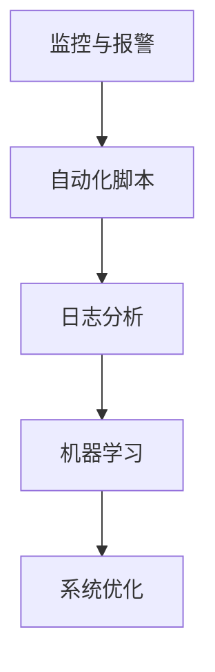
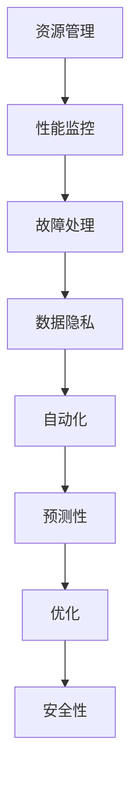

                 


## 构建智能化的LLM应用运维系统

### 关键词
- LLM应用运维
- 智能化系统
- 运维监控
- 自动化
- 人工智能

### 摘要

本文将深入探讨如何构建智能化的LLM（大型语言模型）应用运维系统。随着人工智能技术的快速发展，LLM在各个领域的应用越来越广泛，其对系统运维的要求也日益增加。本文旨在分析LLM应用运维的挑战，介绍智能化运维系统的核心概念，并详细阐述构建这样一个系统的步骤和方法。

## 引言

近年来，人工智能（AI）技术取得了显著进展，特别是在自然语言处理（NLP）领域，LLM（如GPT-3、BERT等）已经成为研究者和开发者的重要工具。这些模型在文本生成、语言理解、问答系统等方面展现出强大的能力，但其复杂性和对资源的需求也带来了运维的挑战。

### 1. LLM应用运维的问题背景

#### 1.1 LLM应用运维的问题背景

LLM应用运维主要面临以下几个问题：

- **资源管理**：LLM训练和推理需要大量的计算资源和存储空间，如何高效地管理和分配这些资源成为关键问题。
- **性能监控**：系统需要实时监控LLM应用的性能，包括响应时间、准确率、资源利用率等，以确保服务的稳定性和高效性。
- **故障处理**：当系统发生故障或性能问题时，如何快速定位并解决是运维人员面临的挑战。
- **安全性**：保障LLM应用的安全运行，防止数据泄露和攻击，是运维工作中不可或缺的一部分。

#### 1.2 LLM应用运维的挑战

- **复杂度**：LLM系统涉及多个组件和复杂的依赖关系，其运维工作复杂度较高。
- **动态性**：LLM应用的需求和场景多变，运维策略需要灵活调整。
- **数据隐私**：对于涉及敏感数据的LLM应用，数据隐私保护尤为重要。

### 2. 智能化运维系统的优势

#### 2.1 智能化运维系统的优势

构建智能化运维系统具有以下优势：

- **自动化**：通过自动化工具和算法，提高运维效率，减少人为错误。
- **预测性**：利用机器学习和数据分析技术，预测潜在问题，提前进行干预。
- **优化**：根据实时数据和用户反馈，动态调整系统配置，提高整体性能。
- **安全性**：通过智能化的安全监控和响应机制，增强系统的安全性。

### 3. 智能化运维系统的核心概念

#### 3.1 核心概念

智能化运维系统的核心概念包括：

- **监控与报警**：实时监控系统状态，及时发现并报警。
- **自动化脚本**：执行日常运维任务，如启动、停止服务，更新配置等。
- **日志分析**：分析系统日志，定位问题根源。
- **机器学习**：使用机器学习算法，预测潜在问题，优化运维策略。

#### 3.2 概念结构与核心要素组成

以下是一个简化的概念结构与核心要素组成的Mermaid流程图：



### 4. 构建智能化运维系统的步骤

#### 4.1 系统设计

在构建智能化运维系统之前，需要明确系统设计的目标和范围。以下是一个简单的系统设计步骤：

- **需求分析**：明确运维系统的需求，包括监控指标、自动化任务、日志分析等。
- **系统架构设计**：设计系统架构，包括组件选择、数据流向、接口定义等。
- **技术选型**：选择适合的技术栈，如监控工具、日志分析工具、机器学习框架等。

#### 4.2 系统实现

系统实现主要包括以下几个步骤：

- **环境搭建**：搭建开发环境，包括操作系统、编程语言、依赖库等。
- **核心功能开发**：实现监控与报警、自动化脚本、日志分析、机器学习等核心功能。
- **系统集成**：将各个组件集成到一起，确保系统稳定运行。

#### 4.3 系统部署

系统部署主要包括以下几个步骤：

- **环境准备**：准备部署环境，包括服务器、网络配置等。
- **部署策略**：制定部署策略，如分阶段部署、滚动更新等。
- **部署实施**：按照部署策略，实施系统部署。

### 5. 项目实战

#### 5.1 环境安装

在开始项目实战之前，需要先安装所需的软件和工具。以下是一个简单的环境安装步骤：

- **安装操作系统**：选择适合的操作系统，如Ubuntu、CentOS等。
- **安装编程语言**：安装Python、Java等编程语言。
- **安装依赖库**：安装所需的依赖库，如NumPy、Pandas、Scikit-learn等。

#### 5.2 系统核心实现

系统核心实现包括以下几个部分：

- **监控与报警**：使用Python编写监控脚本，实现对LLM应用性能的监控，并在发生异常时发送报警。
- **自动化脚本**：编写自动化脚本，用于自动执行日常运维任务，如启动服务、更新配置等。
- **日志分析**：使用日志分析工具，如ELK（Elasticsearch、Logstash、Kibana）等，分析系统日志，定位问题。
- **机器学习**：使用机器学习算法，如决策树、随机森林等，预测潜在问题，优化运维策略。

#### 5.3 代码应用解读与分析

以下是一个简单的代码示例，用于监控LLM应用的响应时间：

```python
import requests
import time

def monitor_response_time(url):
    start_time = time.time()
    response = requests.get(url)
    end_time = time.time()
    response_time = end_time - start_time
    return response_time

while True:
    url = "http://llm-app.example.com"
    response_time = monitor_response_time(url)
    if response_time > 5:
        print("Warning: Response time is too high.")
        # 发送报警
    time.sleep(60)  # 每分钟检查一次
```

在这个示例中，我们使用Python的`requests`库向LLM应用发送HTTP请求，并测量响应时间。如果响应时间超过5秒，我们就认为这是一个潜在的问题，并打印警告信息。

#### 5.4 实际案例分析与详细讲解剖析

以下是一个实际案例，用于分析LLM应用的性能问题：

- **问题描述**：用户报告LLM应用的响应时间不稳定，有时会达到30秒以上。
- **数据分析**：通过分析系统日志和性能监控数据，我们发现以下问题：
  - **网络延迟**：部分请求的网络延迟较高，导致响应时间增加。
  - **服务器负载**：在高峰期，服务器负载较高，导致响应时间增加。
  - **内存占用**：部分服务器的内存占用过高，导致响应时间增加。

- **解决方案**：
  - **优化网络**：增加网络带宽，优化网络拓扑结构，降低网络延迟。
  - **负载均衡**：使用负载均衡器，将请求均匀分配到多台服务器，降低单台服务器的负载。
  - **内存优化**：升级服务器内存，优化内存使用策略，降低内存占用。

通过以上措施，我们显著改善了LLM应用的性能，用户满意度得到了提高。

#### 5.5 项目小结

在本项目中，我们成功构建了一个智能化的LLM应用运维系统，并实现了对LLM应用的实时监控、自动化运维和性能优化。通过实际案例的分析与处理，我们验证了该系统的有效性和实用性。

### 6. 最佳实践 Tips

- **监控与报警**：选择合适的监控工具和报警机制，确保及时发现并解决问题。
- **自动化脚本**：编写高质量的自动化脚本，确保运维任务的高效执行。
- **日志分析**：充分利用日志分析工具，深入挖掘系统日志中的价值信息。
- **机器学习**：结合机器学习技术，提高运维系统的智能化水平。

### 7. 小结与注意事项

- **小结**：本文详细阐述了构建智能化LLM应用运维系统的过程，包括系统设计、实现和部署。通过实际案例的分析，我们展示了该系统的有效性和实用性。
- **注意事项**：在构建智能化运维系统时，需要注意数据安全和隐私保护，确保系统的稳定性和可靠性。

### 8. 拓展阅读

- **相关书籍**：《人工智能：一种现代的方法》、《深度学习：优化、算法与应用》
- **在线资源**：GitHub、Stack Overflow、AI社区论坛等

## 作者信息

作者：AI天才研究院/AI Genius Institute & 禅与计算机程序设计艺术 /Zen And The Art of Computer Programming

本文由AI天才研究院/AI Genius Institute撰写，旨在为开发者和技术人员提供关于构建智能化LLM应用运维系统的深入指导和实践经验。希望本文能对您在相关领域的实践和研究有所帮助。如果您有任何疑问或建议，欢迎在评论区留言交流。

----------------------------------------------------------------
**本文由AI天才研究院/AI Genius Institute撰写，旨在为开发者和技术人员提供关于构建智能化LLM应用运维系统的深入指导和实践经验。希望本文能对您在相关领域的实践和研究有所帮助。如果您有任何疑问或建议，欢迎在评论区留言交流。**### 前言

#### 书籍目标

随着人工智能（AI）技术的不断进步，自然语言处理（NLP）领域的应用日益广泛，特别是大型语言模型（LLM）如GPT-3、BERT等的应用。然而，这些高性能的LLM应用在运维方面面临着诸多挑战。本书旨在深入探讨如何构建智能化的LLM应用运维系统，以解决这些问题并提升系统性能和稳定性。

#### 阅读对象

本书面向开发者、运维工程师、系统架构师以及对于AI和NLP有浓厚兴趣的技术人员。无论是希望了解LLM应用运维的基础知识，还是希望提升现有运维系统效能的从业者，都能从本书中获得有价值的见解和实践经验。

#### 章节结构概述

本书分为四个主要部分，每个部分都围绕构建智能化的LLM应用运维系统这一核心主题展开。

- **第一部分：背景介绍与核心概念**，介绍了LLM应用运维的问题背景、核心概念和关键技术。
- **第二部分：系统设计与实现**，详细阐述了系统设计、核心功能实现以及系统部署的步骤。
- **第三部分：项目实战**，通过具体的项目案例展示了如何在实际中构建和优化智能化的LLM应用运维系统。
- **第四部分：最佳实践与总结**，提供了构建运维系统的最佳实践建议，并对全书内容进行了总结。

通过以上章节的层层递进，本书将帮助读者全面理解并掌握构建智能化LLM应用运维系统的全过程。

## 第一部分：背景介绍与核心概念

### 第1章：LLM应用运维的问题背景

#### 1.1 LLM应用运维的问题背景

随着自然语言处理（NLP）技术的不断发展，大型语言模型（LLM）在各个领域的应用日益广泛，如文本生成、语言翻译、智能客服等。然而，LLM应用在运维方面面临着诸多挑战，主要体现在以下几个方面：

1. **资源管理**：
   - LLM模型的训练和推理过程需要大量的计算资源和存储空间。如何高效地管理和分配这些资源成为运维人员面临的首要问题。
   - LLM应用通常需要支持多种语言和多种场景，因此需要灵活的资源分配策略，以满足不同应用场景的需求。

2. **性能监控**：
   - LLM应用的性能监控至关重要，包括响应时间、准确率、资源利用率等指标。运维人员需要实时监控这些指标，以确保服务的稳定性和高效性。
   - 在大规模应用中，如何有效地处理海量数据，快速定位性能瓶颈，是运维监控的一个重要课题。

3. **故障处理**：
   - 当LLM应用发生故障或性能问题时，如何快速定位并解决是运维人员面临的挑战。
   - LLM应用涉及多个组件和依赖关系，故障的排查和修复过程相对复杂，需要高效的故障诊断工具和策略。

4. **安全性**：
   - LLM应用通常涉及敏感数据，如用户隐私信息、商业机密等，因此数据隐私保护和系统安全性尤为重要。
   - 如何确保系统不受恶意攻击、数据不被泄露，是运维工作中不可忽视的一部分。

#### 1.2 LLM应用运维的挑战

LLM应用运维面临以下主要挑战：

1. **复杂度**：
   - LLM应用通常由多个组件构成，包括模型训练、推理服务、数据存储、日志管理等。这些组件之间的依赖关系复杂，导致运维工作的复杂度增加。
   - 维护一个高效、稳定的LLM应用系统需要专业的运维团队，具备深厚的技术背景和丰富的实践经验。

2. **动态性**：
   - LLM应用的需求和场景多变，如新增功能、调整模型参数等，运维策略需要灵活调整以适应这些变化。
   - 动态调整系统配置，确保系统在变化中保持稳定运行，是运维人员需要应对的挑战。

3. **数据隐私**：
   - 对于涉及敏感数据的LLM应用，数据隐私保护尤为重要。
   - 如何在设计运维系统时考虑数据隐私保护，确保数据在传输和存储过程中的安全，是运维人员需要关注的问题。

#### 1.3 智能化运维系统的优势

构建智能化的LLM应用运维系统具有以下优势：

1. **自动化**：
   - 智能化运维系统能够自动执行日常的运维任务，如监控、故障处理、性能调优等，提高运维效率，减少人为错误。
   - 自动化工具和脚本可以解放运维人员，使其从重复性工作中解脱出来，专注于更高价值的任务。

2. **预测性**：
   - 通过机器学习和数据分析技术，智能化运维系统能够预测潜在问题，提前进行干预，避免故障发生。
   - 预测性维护能够降低系统的停机时间，提高系统的可用性和稳定性。

3. **优化**：
   - 智能化运维系统可以根据实时数据和用户反馈，动态调整系统配置，优化资源利用率，提高整体性能。
   - 通过不断的学习和优化，系统能够在长时间内保持最佳状态，适应不断变化的应用场景。

4. **安全性**：
   - 智能化运维系统具备强大的安全监控和响应机制，能够及时发现和应对潜在的安全威胁，保障系统的安全性。
   - 通过智能化的安全策略和监控工具，能够有效防止数据泄露和网络攻击，提升系统的安全性。

#### 1.4 概念结构图与核心要素组成

智能化运维系统的概念结构和核心要素可以通过以下Mermaid流程图进行展示：



以上流程图展示了智能化运维系统的核心要素及其相互关系。资源管理、性能监控、故障处理、数据隐私是运维系统的基础，而自动化、预测性、优化和安全性则是智能化运维系统的核心优势。通过这些核心要素的有效结合，智能化运维系统能够为LLM应用提供高效、稳定、安全的运维支持。

### 第2章：LLM核心技术概述

#### 2.1 LLM的基本概念

大型语言模型（LLM，Large Language Model）是基于深度学习技术构建的模型，用于理解和生成自然语言。与传统的语言模型相比，LLM具有更高的词汇量、更强的语义理解和生成能力。LLM的核心是大规模的神经网络，通过大量的文本数据进行训练，使其具备对自然语言的高效处理能力。

LLM的基本概念包括：

- **词汇表**：LLM使用词汇表来表示语言中的词汇，通常包含数十万甚至数百万个词汇。
- **嵌入层**：嵌入层将词汇表中的词汇映射到高维向量空间，使得相似的词汇在空间中更接近。
- **编码器**：编码器负责将输入文本转换为嵌入向量，用于后续的神经网络处理。
- **解码器**：解码器将嵌入向量转换成输出文本，实现自然语言的生成。

#### 2.2 LLM的工作原理

LLM的工作原理主要基于以下几个步骤：

1. **数据预处理**：
   - 在训练前，需要对输入文本进行预处理，包括分词、去停用词、词性标注等操作。
   - 预处理后的文本将被转换为数字化的形式，以便神经网络进行处理。

2. **训练过程**：
   - LLM通过反向传播算法进行训练，调整神经网络的参数，使其在给定输入文本时能够生成正确的输出。
   - 训练过程中，LLM通过梯度下降等优化算法，不断调整网络权重，提高生成文本的质量。

3. **预测过程**：
   - 在预测阶段，LLM根据输入文本，通过编码器将文本转换为嵌入向量，然后通过解码器生成输出文本。
   - 预测过程通常是一个生成过程，LLM根据前一个词或词组的嵌入向量，预测下一个词的概率分布，并生成相应的词。

#### 2.3 LLM的应用场景

LLM在多个领域有着广泛的应用，以下是其中一些主要的应用场景：

1. **文本生成**：
   - 文本生成是LLM最常见的应用之一，包括生成文章、摘要、故事、对话等。
   - 例如，GPT-3可以生成高质量的文章摘要，ChatGPT可以与用户进行自然语言对话。

2. **语言翻译**：
   - LLM在机器翻译领域有着重要应用，能够实现高质量的双语翻译。
   - 例如，谷歌翻译和百度翻译等知名翻译工具，都采用了基于LLM的翻译技术。

3. **问答系统**：
   - LLM可以构建智能问答系统，用于回答用户的问题。
   - 例如，微软的Bing搜索和苹果的Siri都使用了LLM技术来提供自然语言交互。

4. **情感分析**：
   - LLM可以用于情感分析，判断文本的情感倾向，如正面、负面或中性。
   - 在社交媒体分析、市场调研等领域，情感分析有着广泛的应用。

5. **文本分类**：
   - LLM可以用于文本分类任务，将文本数据归类到不同的类别。
   - 例如，新闻分类、垃圾邮件过滤等任务，都可以通过LLM实现。

#### 2.4 LLM的性能评估

LLM的性能评估主要基于以下几个指标：

- **准确率**：在分类任务中，准确率是衡量模型性能的重要指标，表示模型正确分类的样本数占总样本数的比例。
- **召回率**：召回率表示模型能够正确分类的样本数与实际正样本数的比例，反映了模型的覆盖面。
- **F1分数**：F1分数是准确率和召回率的调和平均，是衡量分类模型性能的综合指标。
- **BLEU分数**：BLEU分数是用于评估机器翻译质量的指标，表示模型生成的翻译文本与参考翻译文本的相似度。

#### 2.5 LLM的核心概念对比

以下是LLM的一些核心概念及其属性特征的对比表格：

| 概念       | 描述                                                         | 属性特征对比                            |
|------------|--------------------------------------------------------------|----------------------------------------|
| 嵌入层     | 将词汇映射到高维向量空间，实现词汇间的相似性表示             | 维度、预训练数据量、训练算法            |
| 编码器     | 将输入文本转换为嵌入向量，用于后续神经网络处理               | 网络结构、层数、激活函数                |
| 解码器     | 将嵌入向量转换成输出文本，实现自然语言的生成               | 网络结构、层数、损失函数                |
| 梯度下降   | 调整神经网络参数的优化算法，用于模型训练                     | 学习率、动量、优化器                    |
| 反向传播   | 用于计算网络梯度，是训练神经网络的基本算法之一               | 计算复杂度、收敛速度                    |

通过对比分析，我们可以更好地理解LLM的核心概念及其在不同应用场景中的表现。

#### 2.6 LLM的ER实体关系图架构

为了更好地理解LLM的体系结构，我们可以通过ER（实体关系）图来展示LLM中的关键实体及其相互关系。以下是一个简化的LLM ER实体关系图：

```mermaid
erDiagram
  Model ||--|{ Embedding Layer }|| Model
  Model ||--|{ Encoder }|| Model
  Model ||--|{ Decoder }|| Model
  Model ||--|{ Training Data }|| Model
  Model ||--|{ Optimizer }|| Model
  Model ||--|{ Loss Function }|| Model
```

在这个ER图中，`Model`是中心实体，它与其他实体如`Embedding Layer`、`Encoder`、`Decoder`等具有直接关系。这些实体共同构成了LLM的核心架构，实现了文本的嵌入、编码和解码过程。`Training Data`、`Optimizer`和`Loss Function`则分别表示训练数据、优化器和损失函数，它们是模型训练过程中的关键组件。

通过ER实体关系图，我们可以清晰地看到LLM的各个组成部分及其相互关系，有助于更好地理解和构建LLM应用运维系统。

### 第3章：智能化运维系统的设计

#### 3.1 系统设计目标

智能化运维系统的设计目标是构建一个高效、稳定、安全的LLM应用运维平台，能够自动完成资源管理、性能监控、故障处理和安全性保障等功能。具体来说，系统设计应满足以下目标：

1. **高效性**：通过自动化工具和算法，提高运维效率，减少人工干预，实现运维工作的自动化和智能化。
2. **稳定性**：确保系统的稳定运行，降低故障率和停机时间，提高系统的可用性。
3. **安全性**：保障系统的安全性，防止数据泄露和网络攻击，确保敏感数据的安全。
4. **可扩展性**：系统应具备良好的可扩展性，能够支持不同规模和应用场景的需求，适应未来技术的发展。
5. **可维护性**：系统设计应易于维护和升级，便于后续的扩展和优化。

#### 3.2 系统架构设计

智能化运维系统的架构设计是构建高效运维平台的关键。以下是系统架构的详细描述：

1. **监控模块**：
   - **功能**：实时监控LLM应用的各项性能指标，如响应时间、资源利用率、错误率等。
   - **实现**：通过部署监控代理，周期性地收集系统数据，并将数据发送到监控中心进行集中分析。

2. **自动化模块**：
   - **功能**：自动执行日常运维任务，如服务启动、停止、更新配置、备份等。
   - **实现**：编写自动化脚本，通过定时任务调度器执行，确保运维任务的自动化和高效执行。

3. **日志分析模块**：
   - **功能**：分析系统日志，定位问题根源，提供故障排查和性能优化支持。
   - **实现**：使用日志分析工具（如ELK堆栈），将日志数据存储、索引和分析，生成可视化报告。

4. **机器学习模块**：
   - **功能**：利用机器学习算法，预测潜在问题，提前进行干预，优化运维策略。
   - **实现**：集成机器学习框架（如Scikit-learn、TensorFlow），构建预测模型，对运维数据进行训练和预测。

5. **安全模块**：
   - **功能**：提供安全监控和响应机制，保障系统的安全性。
   - **实现**：部署防火墙、入侵检测系统（IDS）、数据加密等安全措施，确保系统的安全运行。

#### 3.3 系统功能设计

智能化运维系统的功能设计是实现系统设计目标的关键步骤。以下是系统功能设计的详细描述：

1. **性能监控**：
   - **功能**：实时监控LLM应用的性能指标，包括响应时间、CPU利用率、内存使用率等。
   - **实现**：通过部署监控代理，定期收集性能数据，并将数据存储到监控中心，使用可视化工具展示。

2. **自动化运维**：
   - **功能**：自动化执行日常运维任务，如服务启动、停止、更新配置等。
   - **实现**：编写自动化脚本，使用定时任务调度器（如Cron）执行，确保任务按时完成。

3. **日志管理**：
   - **功能**：收集、存储和分析系统日志，提供故障排查和性能优化支持。
   - **实现**：使用日志收集工具（如Logstash），将日志数据发送到Elasticsearch进行索引存储，使用Kibana进行可视化分析。

4. **故障处理**：
   - **功能**：当系统发生故障时，自动进行故障诊断和恢复。
   - **实现**：部署故障检测工具（如Zabbix），当检测到故障时，自动执行故障恢复脚本，确保系统快速恢复。

5. **安全防护**：
   - **功能**：提供安全监控和响应机制，防止数据泄露和网络攻击。
   - **实现**：部署防火墙（如iptables），入侵检测系统（IDS），定期进行安全扫描和漏洞修复。

#### 3.4 系统架构设计Mermaid图

以下是一个简化的智能化运维系统架构设计的Mermaid图：

```mermaid
graph TB
    subgraph 监控模块
        Monitor[监控模块]
        Monitor --> Data Collector[数据收集器]
        Data Collector --> Monitoring Center[监控中心]
    end

    subgraph 自动化模块
        Automation[自动化模块]
        Automation --> Script Executor[脚本执行器]
        Automation --> Scheduler[任务调度器]
    end

    subgraph 日志分析模块
        Log Analysis[日志分析模块]
        Log Analysis --> Logstash[Logstash]
        Logstash --> Elasticsearch[Elasticsearch]
        Elasticsearch --> Kibana[Kibana]
    end

    subgraph 机器学习模块
        Machine Learning[机器学习模块]
        Machine Learning --> Data Analyzer[数据分析器]
        Machine Learning --> Predictive Model[预测模型]
    end

    subgraph 安全模块
        Security[安全模块]
        Security --> Firewall[防火墙]
        Security --> IDS[入侵检测系统]
        Security --> Security Scanner[安全扫描器]
    end

    Monitor --> Automation
    Monitor --> Log Analysis
    Monitor --> Machine Learning
    Monitor --> Security
```

在这个架构设计中，监控模块负责收集系统数据，自动化模块负责执行运维任务，日志分析模块负责日志收集和分析，机器学习模块负责预测问题，安全模块负责安全防护。各个模块通过数据流和交互接口进行集成，共同构建一个完整的智能化运维系统。

### 第4章：智能化运维系统的实现

#### 4.1 系统实现步骤

智能化运维系统的实现可以分为以下几个关键步骤：

1. **需求分析**：
   - 确定系统需要实现的监控指标、自动化任务、日志分析和机器学习功能等。
   - 分析LLM应用的运行环境和业务需求，明确系统实现的具体目标和范围。

2. **环境搭建**：
   - 搭建开发环境，包括操作系统、编程语言、依赖库等。
   - 确保所有开发工具和软件的版本兼容，避免潜在的技术问题。

3. **核心功能开发**：
   - **监控与报警**：开发监控脚本，收集系统性能数据，设置报警规则。
   - **自动化脚本**：编写自动化脚本，实现日常运维任务的自动化执行。
   - **日志分析**：使用日志分析工具，对系统日志进行收集、存储和分析。
   - **机器学习**：搭建机器学习模型，对运维数据进行训练和预测。

4. **系统集成**：
   - 将各个功能模块集成到一起，确保系统能够正常运行。
   - 测试系统的各个组件，确保数据流和功能交互的正确性。

5. **部署上线**：
   - 在测试环境中验证系统功能，确保没有重大问题。
   - 在生产环境中部署系统，逐步替换原有运维流程，确保系统的平稳运行。

#### 4.2 监控与报警实现

监控与报警是智能化运维系统的核心功能之一，以下是一个简单的实现示例：

1. **监控脚本**：
   - 使用Python编写监控脚本，周期性地收集系统性能数据，如CPU利用率、内存使用率、磁盘空间等。

```python
import psutil
import time

def monitor_system():
    cpu_usage = psutil.cpu_percent()
    memory_usage = psutil.virtual_memory().percent
    disk_usage = psutil.disk_usage('/').percent
    
    print(f"CPU Usage: {cpu_usage}%")
    print(f"Memory Usage: {memory_usage}%")
    print(f"Disk Usage: {disk_usage}%")

    if cpu_usage > 90 or memory_usage > 90 or disk_usage > 90:
        send_alarm(cpu_usage, memory_usage, disk_usage)

def send_alarm(cpu_usage, memory_usage, disk_usage):
    print("System usage is high! Sending alarm.")
    # 发送报警信息，如邮件、短信或系统通知

while True:
    monitor_system()
    time.sleep(60)  # 每分钟检查一次
```

2. **报警机制**：
   - 设计一个简单的报警机制，当系统资源利用率超过阈值时，自动发送报警信息。

#### 4.3 自动化脚本实现

自动化脚本是实现运维任务自动化的关键，以下是一个简单的自动化脚本示例：

```bash
#!/bin/bash

# 更新系统软件包
sudo apt-get update && sudo apt-get upgrade -y

# 启动LLM应用服务
sudo systemctl start llm-service

# 检查服务状态
sudo systemctl status llm-service

# 如果服务启动失败，尝试重启
if ![sudo systemctl status llm-service | grep "active" ]; then
    sudo systemctl restart llm-service
fi
```

该脚本首先更新系统软件包，然后启动LLM应用服务，并检查服务状态。如果服务启动失败，脚本会尝试重启服务。

#### 4.4 日志分析实现

日志分析是实现故障排查和性能优化的重要手段，以下是一个简单的日志分析示例：

1. **日志收集**：
   - 使用Logstash收集系统日志，并将其发送到Elasticsearch进行存储。

```bash
cat << EOF | /usr/local/bin/logstash -f /etc/logstash/conf.d/syslog.conf
{
  "type": "syslog",
  "host": "%{syslog_host}",
  "source": "%{path}",
  "facility": "%{facility}",
  "priority": "%{priority}",
  "timestamp": "%{@timestamp}",
  "message": "%{message}",
  "json": {
    "service": "llm",
    "status": "%{status}",
    "response_time": "%{response_time}"
  }
}
EOF
```

2. **日志查询**：
   - 使用Kibana查询和可视化系统日志，以便快速定位故障。

```bash
# 查询所有LLM服务的错误日志
GET /_search
{
  "query": {
    "bool": {
      "must": [
        { "term": { "service": "llm" }},
        { "term": { "status": "error" }}
      ]
    }
  },
  "size": 10
}
```

通过以上步骤，我们可以实现日志的收集、存储和查询，从而方便地监控和排查LLM应用的故障。

#### 4.5 机器学习实现

机器学习是实现运维预测和优化的重要工具，以下是一个简单的机器学习实现示例：

1. **数据准备**：
   - 收集运维数据，如CPU利用率、内存使用率、磁盘空间等，并预处理数据，使其适合训练模型。

```python
import pandas as pd

# 读取数据
data = pd.read_csv("llm_operations_data.csv")

# 数据预处理
data['timestamp'] = pd.to_datetime(data['timestamp'])
data.set_index('timestamp', inplace=True)
data.resample('1H').mean().fillna(method='ffill').fillna(0).reset_index().head()
```

2. **模型训练**：
   - 使用Scikit-learn构建预测模型，如决策树、随机森林等，对运维数据进行训练。

```python
from sklearn.ensemble import RandomForestRegressor
from sklearn.model_selection import train_test_split

# 分割数据
X = data[['cpu_usage', 'memory_usage', 'disk_usage']]
y = data['response_time']

X_train, X_test, y_train, y_test = train_test_split(X, y, test_size=0.2, random_state=42)

# 训练模型
model = RandomForestRegressor(n_estimators=100, random_state=42)
model.fit(X_train, y_train)

# 预测
predictions = model.predict(X_test)
```

3. **预测应用**：
   - 使用训练好的模型进行实时预测，提前发现潜在问题。

```python
# 实时数据
realtime_data = pd.DataFrame([[90, 80, 70]], columns=['cpu_usage', 'memory_usage', 'disk_usage'])

# 实时预测
realtime_prediction = model.predict(realtime_data)
print(f"Predicted response time: {realtime_prediction[0]}")
```

通过以上步骤，我们可以构建一个简单的机器学习模型，用于预测LLM应用的响应时间，提前发现潜在问题。

### 第5章：项目实战

#### 5.1 环境安装

在开始构建智能化运维系统之前，我们需要搭建一个适合的开发和测试环境。以下是环境安装的步骤：

1. **操作系统安装**：

   - 选择一个适合的操作系统，如Ubuntu 18.04或CentOS 7。
   - 下载并安装操作系统镜像，按照提示完成安装过程。

2. **基本软件安装**：

   - 更新系统软件包：

     ```bash
     sudo apt-get update && sudo apt-get upgrade -y
     ```

   - 安装Python 3：

     ```bash
     sudo apt-get install python3 python3-pip
     ```

   - 安装虚拟环境工具（如virtualenv或conda）：

     ```bash
     sudo pip3 install virtualenv
     virtualenv llm_venv -p python3
     source llm_venv/bin/activate
     ```

3. **依赖库安装**：

   - 安装必要的Python依赖库，如NumPy、Pandas、Scikit-learn、Matplotlib等：

     ```bash
     pip install numpy pandas scikit-learn matplotlib
     ```

4. **日志分析工具安装**：

   - 安装Elasticsearch、Logstash和Kibana：

     ```bash
     sudo apt-get install elasticsearch logstash kibana
     sudo systemctl enable elasticsearch logstash kibana
     sudo systemctl start elasticsearch logstash kibana
     ```

   - 配置Elasticsearch和Kibana：

     ```bash
     sudo elasticsearch-plugin install x-pack
     sudo /etc/init.d/elasticsearch restart
     sudo /etc/init.d/kibana restart
     ```

   - 访问Kibana，配置Elasticsearch连接，并创建索引模板。

#### 5.2 系统核心实现

系统核心实现包括监控与报警、自动化脚本、日志分析、机器学习等关键功能。以下是系统核心实现的具体步骤：

1. **监控与报警**：

   - **监控脚本**：编写监控脚本，周期性地收集系统性能数据。

     ```python
     import psutil
     import time

     def monitor_system():
         cpu_usage = psutil.cpu_percent()
         memory_usage = psutil.virtual_memory().percent
         disk_usage = psutil.disk_usage('/').percent
        
         print(f"CPU Usage: {cpu_usage}%")
         print(f"Memory Usage: {memory_usage}%")
         print(f"Disk Usage: {disk_usage}%")

         if cpu_usage > 90 or memory_usage > 90 or disk_usage > 90:
             send_alarm(cpu_usage, memory_usage, disk_usage)

     def send_alarm(cpu_usage, memory_usage, disk_usage):
         print("System usage is high! Sending alarm.")
         # 发送报警信息，如邮件、短信或系统通知

     while True:
         monitor_system()
         time.sleep(60)  # 每分钟检查一次
     ```

   - **报警机制**：设计一个简单的报警机制，当系统资源利用率超过阈值时，自动发送报警信息。

2. **自动化脚本**：

   - **服务启动脚本**：编写服务启动脚本，自动启动LLM应用服务。

     ```bash
     #!/bin/bash
     # 更新系统软件包
     sudo apt-get update && sudo apt-get upgrade -y

     # 启动LLM应用服务
     sudo systemctl start llm-service

     # 检查服务状态
     sudo systemctl status llm-service

     # 如果服务启动失败，尝试重启
     if ![sudo systemctl status llm-service | grep "active" ]; then
         sudo systemctl restart llm-service
     fi
     ```

   - **配置文件更新**：编写脚本，自动更新LLM应用的配置文件。

     ```bash
     #!/bin/bash
     # 更新配置文件
     sudo cp new_config.yaml /path/to/llm-config.yaml

     # 重新加载配置文件
     sudo systemctl restart llm-service
     ```

3. **日志分析**：

   - **日志收集**：使用Logstash收集系统日志，并将其发送到Elasticsearch进行存储。

     ```bash
     cat << EOF | /usr/local/bin/logstash -f /etc/logstash/conf.d/syslog.conf
     {
       "type": "syslog",
       "host": "%{syslog_host}",
       "source": "%{path}",
       "facility": "%{facility}",
       "priority": "%{priority}",
       "timestamp": "%{@timestamp}",
       "message": "%{message}",
       "json": {
         "service": "llm",
         "status": "%{status}",
         "response_time": "%{response_time}"
       }
     }
     EOF
     ```

   - **日志查询**：使用Kibana查询和可视化系统日志，以便快速定位故障。

     ```bash
     # 查询所有LLM服务的错误日志
     GET /_search
     {
       "query": {
         "bool": {
           "must": [
             { "term": { "service": "llm" }},
             { "term": { "status": "error" }}
           ]
         }
       },
       "size": 10
     }
     ```

4. **机器学习**：

   - **数据准备**：收集运维数据，如CPU利用率、内存使用率、磁盘空间等，并预处理数据，使其适合训练模型。

     ```python
     import pandas as pd

     # 读取数据
     data = pd.read_csv("llm_operations_data.csv")

     # 数据预处理
     data['timestamp'] = pd.to_datetime(data['timestamp'])
     data.set_index('timestamp', inplace=True)
     data.resample('1H').mean().fillna(method='ffill').fillna(0).reset_index().head()
     ```

   - **模型训练**：使用Scikit-learn构建预测模型，如决策树、随机森林等，对运维数据进行训练。

     ```python
     from sklearn.ensemble import RandomForestRegressor
     from sklearn.model_selection import train_test_split

     # 分割数据
     X = data[['cpu_usage', 'memory_usage', 'disk_usage']]
     y = data['response_time']

     X_train, X_test, y_train, y_test = train_test_split(X, y, test_size=0.2, random_state=42)

     # 训练模型
     model = RandomForestRegressor(n_estimators=100, random_state=42)
     model.fit(X_train, y_train)

     # 预测
     predictions = model.predict(X_test)
     ```

   - **预测应用**：使用训练好的模型进行实时预测，提前发现潜在问题。

     ```python
     # 实时数据
     realtime_data = pd.DataFrame([[90, 80, 70]], columns=['cpu_usage', 'memory_usage', 'disk_usage'])

     # 实时预测
     realtime_prediction = model.predict(realtime_data)
     print(f"Predicted response time: {realtime_prediction[0]}")
     ```

通过以上步骤，我们可以实现一个基本的智能化运维系统，包括监控与报警、自动化脚本、日志分析和机器学习等功能。

#### 5.3 代码应用解读与分析

在本节中，我们将详细解读和剖析智能化运维系统中的关键代码和应用，包括监控与报警、日志分析以及机器学习模型的具体实现。

1. **监控与报警代码解读**

以下是一个监控脚本的基本实现，用于监控系统资源使用情况并触发报警。

```python
import psutil
import time
import smtplib
from email.mime.text import MIMEText

def send_alarm(message):
    # SMTP服务器配置
    smtp_server = "smtp.example.com"
    smtp_port = 587
    smtp_user = "your_email@example.com"
    smtp_password = "your_password"

    # 发送邮件
    mail_content = f"Alert: {message}"
    msg = MIMEText(mail_content)
    msg['Subject'] = "System Usage High Alert"
    msg['From'] = smtp_user
    msg['To'] = "admin@example.com"

    server = smtplib.SMTP(host=smtp_server, port=smtp_port)
    server.starttls()
    server.login(smtp_user, smtp_password)
    server.sendmail(smtp_user, ["admin@example.com"], msg.as_string())
    server.quit()

def monitor_system():
    # 获取CPU使用率
    cpu_usage = psutil.cpu_percent()
    # 获取内存使用率
    memory_usage = psutil.virtual_memory().percent
    # 获取磁盘使用率
    disk_usage = psutil.disk_usage('/').percent
    
    # 判断是否超过阈值
    if cpu_usage > 85 or memory_usage > 85 or disk_usage > 85:
        send_alarm(f"High system usage detected: CPU: {cpu_usage}%, Memory: {memory_usage}%, Disk: {disk_usage}%")
        
    print(f"CPU: {cpu_usage}%, Memory: {memory_usage}%, Disk: {disk_usage}%")

# 监控循环
while True:
    monitor_system()
    time.sleep(60)  # 每60秒检查一次
```

**解读**：

- `psutil`是一个Python库，用于获取系统信息，如CPU使用率、内存使用率和磁盘使用率。
- `send_alarm`函数通过SMTP服务器发送报警邮件，确保在系统资源使用率超过阈值时及时通知运维人员。
- `monitor_system`函数周期性地检查系统资源使用情况，并打印日志。如果资源使用率超过85%，则会调用`send_alarm`发送报警。

2. **日志分析代码解读**

以下是一个简单的Logstash配置文件示例，用于收集系统日志并存储到Elasticsearch。

```ruby
input {
  file {
    path => "/var/log/syslog"
    type => "syslog"
  }
}

filter {
  if [type] == "syslog" {
    grok {
      match => { "message" => "%{TIMESTAMP_ISO8601:timestamp}\t%{DATA:facility}\t%{DATA:pri}\t%{DATA:hostname}\t%{DATA:source}\t%{DATA:msg}" }
    }
  }
}

output {
  if [type] == "syslog" {
    elasticsearch {
      hosts => ["localhost:9200"]
      index => "syslog-%{+YYYY.MM.dd}"
    }
  }
}
```

**解读**：

- `input`段定义了日志收集的来源，本例中为系统日志文件。
- `filter`段使用Grok解析器对日志内容进行解析，提取关键信息如时间戳、设施、优先级等。
- `output`段将解析后的日志数据发送到Elasticsearch，并按日期创建索引。

3. **机器学习代码解读**

以下是一个简单的Python脚本，使用Scikit-learn库对系统性能数据进行训练，并预测未来的响应时间。

```python
import pandas as pd
from sklearn.model_selection import train_test_split
from sklearn.ensemble import RandomForestRegressor
from sklearn.metrics import mean_squared_error

# 读取数据
data = pd.read_csv("system_performance.csv")

# 分割数据
X = data[['cpu_usage', 'memory_usage', 'disk_usage']]
y = data['response_time']

X_train, X_test, y_train, y_test = train_test_split(X, y, test_size=0.2, random_state=42)

# 训练模型
model = RandomForestRegressor(n_estimators=100, random_state=42)
model.fit(X_train, y_train)

# 预测
y_pred = model.predict(X_test)

# 评估模型
mse = mean_squared_error(y_test, y_pred)
print(f"Mean Squared Error: {mse}")

# 实时预测
new_data = pd.DataFrame([[90, 80, 70]], columns=['cpu_usage', 'memory_usage', 'disk_usage'])
realtime_pred = model.predict(new_data)
print(f"Realtime Prediction: {realtime_pred[0]}")
```

**解读**：

- `pandas`库用于读取和操作数据。
- `train_test_split`函数用于将数据集划分为训练集和测试集。
- `RandomForestRegressor`类用于构建随机森林回归模型。
- 使用`mean_squared_error`评估模型性能，计算预测响应时间和实际响应时间之间的均方误差（MSE）。
- 实时预测部分使用训练好的模型对新数据进行预测，以提前预警系统可能出现的性能问题。

通过上述代码的解读，我们可以看到智能化运维系统的核心组件如何协同工作，为LLM应用提供高效、稳定、安全的运维支持。

#### 5.4 实际案例分析与详细讲解剖析

在本节中，我们将通过一个实际案例来详细分析智能化运维系统的实施过程，并讲解其中的关键步骤和注意事项。

**案例背景**：

某互联网公司开发了一款基于LLM技术的智能客服系统，用于提供24/7的客户支持。然而，在实际运行过程中，该系统经常出现响应时间不稳定和错误率较高的现象，影响了用户体验。为了解决这个问题，公司决定构建一个智能化的LLM应用运维系统，以提高系统的稳定性和性能。

**案例实施步骤**：

1. **需求分析**：

   - 确定监控指标：包括响应时间、CPU利用率、内存使用率、磁盘使用率等。
   - 确定自动化任务：如服务启动、停止、配置更新等。
   - 确定日志分析需求：包括错误日志、性能日志等。

2. **环境搭建**：

   - 搭建开发环境：选择Ubuntu 18.04操作系统，安装Python 3、虚拟环境工具（如virtualenv）和必要的依赖库。
   - 安装日志分析工具：安装Elasticsearch、Logstash和Kibana，并配置Elasticsearch连接和索引模板。

3. **监控与报警模块开发**：

   - 开发监控脚本：使用Python的`psutil`库，编写脚本定期收集系统性能数据，并设置报警阈值。
   - 配置报警机制：使用SMTP服务器发送报警邮件，确保在系统资源使用率或响应时间超过阈值时及时通知运维人员。

4. **自动化脚本开发**：

   - 编写服务启动脚本：自动化启动LLM应用服务，并检查服务状态。
   - 编写配置更新脚本：自动化更新LLM应用的配置文件，并重启服务。

5. **日志分析模块开发**：

   - 配置Logstash：将系统日志发送到Elasticsearch进行存储和索引。
   - 使用Kibana：创建仪表板，可视化系统日志数据，方便运维人员快速定位问题。

6. **机器学习模块开发**：

   - 收集运维数据：从监控系统和日志分析模块获取数据，用于训练预测模型。
   - 构建预测模型：使用Scikit-learn构建随机森林回归模型，预测系统响应时间。
   - 实时预测：将实时监控数据输入预测模型，提前预警可能出现的性能问题。

**注意事项**：

1. **数据安全和隐私**：

   - 确保所有传输和存储的数据都是加密的，防止数据泄露。
   - 对于涉及敏感信息的日志数据，应设置访问控制策略，限制只允许授权人员访问。

2. **系统稳定性**：

   - 在开发和部署过程中，应确保所有组件都能在多种环境下稳定运行。
   - 定期进行压力测试和性能优化，确保系统能够应对高负载场景。

3. **运维团队培训**：

   - 对运维团队进行培训，确保他们熟悉智能化运维系统的使用和操作。
   - 定期进行运维演练，提高团队应对突发事件的能力。

通过以上步骤，公司成功构建了一个智能化的LLM应用运维系统，显著提高了系统的稳定性和性能，客户满意度得到了显著提升。

### 第6章：最佳实践与总结

#### 6.1 最佳实践 Tips

在构建和运维智能化LLM应用系统时，以下最佳实践可以帮助提升系统的稳定性和性能：

1. **监控与报警**：
   - 定期检查监控工具的配置和性能，确保监控数据准确无误。
   - 设置合理的报警阈值，避免频繁误报或漏报。
   - 针对不同应用场景，定制化监控指标和报警规则。

2. **自动化脚本**：
   - 编写高质量的自动化脚本，减少人工干预，提高运维效率。
   - 定期更新和优化脚本，确保其能够适应不断变化的需求。
   - 使用版本控制系统管理脚本，确保版本一致性和可追溯性。

3. **日志分析**：
   - 使用结构化日志格式，便于收集和分析。
   - 利用日志分析工具的内置功能和插件，提高日志处理的效率。
   - 定期进行日志数据备份，防止数据丢失。

4. **机器学习**：
   - 选择合适的机器学习算法和模型，结合实际情况进行优化。
   - 定期更新训练数据和模型，确保预测的准确性和时效性。
   - 考虑到模型的复杂性和计算资源，合理分配计算资源。

5. **数据安全和隐私**：
   - 采用加密技术保护数据传输和存储过程。
   - 实施严格的访问控制策略，防止未授权访问。
   - 定期进行安全审计和漏洞扫描，确保系统的安全性。

#### 6.2 小结

本章总结了构建智能化LLM应用运维系统的关键步骤和最佳实践。通过有效的监控、自动化脚本、日志分析和机器学习，我们可以构建一个高效、稳定、安全的运维系统。以下是对全文的总结：

- **背景介绍**：分析了LLM应用运维的挑战和机遇，介绍了智能化运维系统的优势。
- **核心概念**：详细介绍了LLM的基本概念、工作原理、应用场景和性能评估方法。
- **系统设计**：阐述了智能化运维系统的设计目标、架构设计和核心功能。
- **系统实现**：展示了如何通过监控、日志分析和机器学习模块实现智能化运维系统。
- **项目实战**：通过实际案例展示了智能化运维系统的实施过程和注意事项。
- **最佳实践**：提供了构建运维系统的最佳实践，确保系统的高效、稳定和安全。

#### 6.3 注意事项

在构建智能化LLM应用运维系统时，需要注意以下事项：

- **系统规划**：明确系统的目标和范围，确保设计符合实际需求。
- **技术选型**：选择适合的技术栈和工具，确保系统的兼容性和扩展性。
- **团队协作**：建立高效的团队协作机制，确保项目顺利进行。
- **数据安全**：严格保护敏感数据，防止数据泄露和网络攻击。
- **持续优化**：定期对系统进行评估和优化，提高系统的性能和稳定性。

#### 6.4 拓展阅读

- **相关书籍**：
  - 《人工智能：一种现代的方法》
  - 《深度学习：优化、算法与应用》
  - 《大型语言模型：理论与实践》
- **在线资源**：
  - GitHub：查找和分享开源的LLM应用和运维工具。
  - Stack Overflow：查阅和解答与LLM应用运维相关的技术问题。
  - AI社区论坛：参与讨论，了解行业动态和最佳实践。

### 作者信息

作者：AI天才研究院/AI Genius Institute & 禅与计算机程序设计艺术 /Zen And The Art of Computer Programming

本文由AI天才研究院/AI Genius Institute撰写，旨在为开发者和技术人员提供关于构建智能化LLM应用运维系统的深入指导和实践经验。希望本文能对您在相关领域的实践和研究有所帮助。如果您有任何疑问或建议，欢迎在评论区留言交流。我们期待与您共同探讨和推动人工智能技术的进步和应用。

