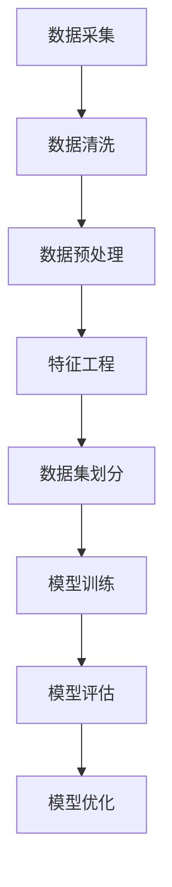
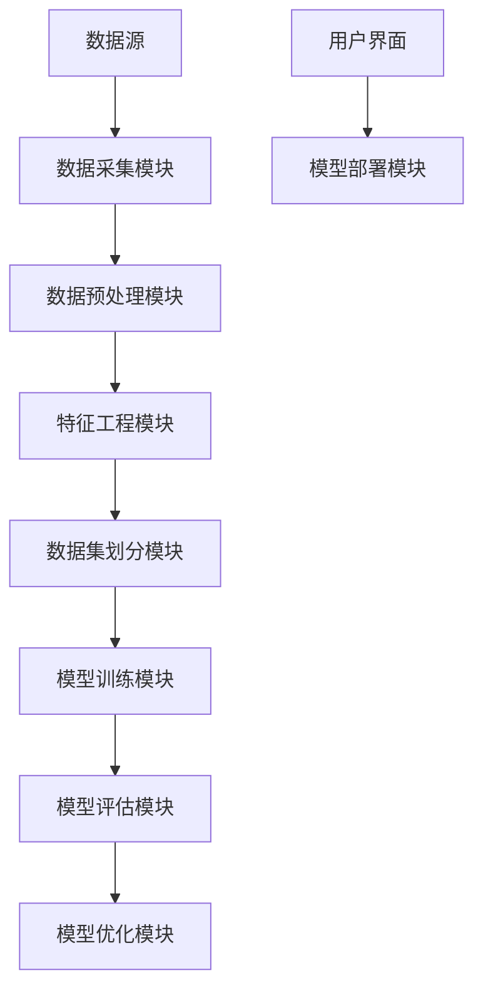
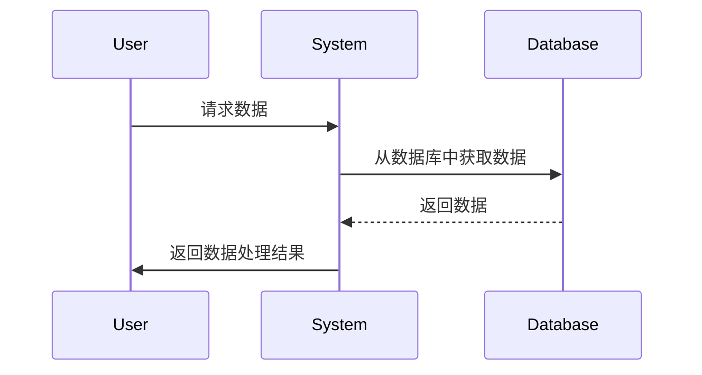

                 

## 构建模型评测的benchmark数据集

### 关键词：数据集构建、模型评测、benchmark、评估指标、数据预处理、特征工程

> 摘要：本文旨在探讨如何构建有效的benchmark数据集用于模型评测。通过分析数据集构建的重要性、核心概念、方法与工具，以及数据集评估与验证，我们将展示如何选择和构建高质量的数据集，为模型训练和优化提供可靠的基准。

### 引言

在人工智能领域，模型的评测至关重要。一个优秀的模型需要通过一系列严格的评测指标来验证其性能。而这一切的基础，就是数据的准备和选择。benchmark数据集，顾名思义，是一套用于模型评测的标准化数据集，通常具有广泛的应用和认可度。构建一个高质量的benchmark数据集，不仅能够提高模型评测的准确性，还能加速模型的开发和部署。因此，本文将详细探讨如何构建模型评测的benchmark数据集，从核心概念、方法与工具到评估与验证，一一进行深入分析。

### 数据集构建的重要性

首先，我们需要明确数据集构建在模型评测中的作用。一个高质量的数据集可以提供以下几方面的优势：

1. **标准化评估**：通过使用公认的数据集，不同研究者可以在相同条件下比较模型性能，确保评测的公平性和一致性。
2. **可靠性验证**：高质量的基准数据集能够更准确地反映模型在现实世界中的表现，为模型可靠性提供有力保障。
3. **模型优化**：通过分析数据集中不同特征的表现，研究者可以优化模型设计，提高其性能。
4. **推广性验证**：通过在多个数据集上的测试，研究者可以评估模型的推广能力，避免模型过拟合。

### 数据集构建的核心概念

在构建benchmark数据集时，我们首先需要理解以下几个核心概念：

1. **数据质量评估**：数据质量直接影响模型的性能。评估数据质量包括完整性、一致性、准确性、时效性和可用性等多个方面。
2. **数据预处理**：数据预处理是数据集构建的重要环节，包括数据清洗、归一化和特征工程等步骤，旨在提高数据质量和模型性能。
3. **数据集类型**：根据应用场景的不同，数据集可以分为图像、文本、音频等多种类型。每种类型的数据集都有其独特的构建方法和评估指标。

### 数据集构建的方法与工具

构建一个高质量的benchmark数据集，通常需要以下几个步骤：

1. **数据采集**：根据应用场景选择合适的数据源，可以是公开数据集、私人数据集或在线爬取。
2. **数据预处理**：清洗数据中的噪声和异常值，对数据进行归一化处理，提取有用的特征。
3. **数据集划分**：将数据集划分为训练集、验证集和测试集，确保每个子集的分布和代表性。
4. **特征工程**：根据模型的特定需求，设计有效的特征提取和选择方法，提高数据特征的表达能力。

### 数据集评估与验证

构建完数据集后，我们需要对其进行评估和验证：

1. **评估指标**：选择合适的评估指标，如准确率、召回率、F1值等，以衡量模型在不同数据集上的性能。
2. **评估方法**：采用主观评估和客观评估相结合的方法，确保评估结果的全面性和可靠性。
3. **数据集验证**：通过交叉验证、留一验证等技术，验证数据集的划分效果和模型的泛化能力。

### Benchmark数据集的应用

Benchmark数据集在模型评测中的应用非常广泛：

1. **模型训练**：通过在benchmark数据集上训练，模型可以在标准条件下评估其性能。
2. **模型优化**：通过分析数据集中不同特征的表现，研究者可以针对性地优化模型设计。
3. **模型对比**：通过在同一benchmark数据集上的对比，研究者可以评估不同模型之间的性能差异。

### 开源Benchmark数据集介绍

目前，许多开源benchmark数据集已经成为人工智能研究的重要资源，如ImageNet、CIFAR-10和MNIST等。这些数据集不仅涵盖了多种应用场景，还在学术界和工业界得到了广泛认可。

### 数据集构建实践

为了更好地理解数据集构建的流程，我们将通过两个实际案例进行详细讲解：

1. **金融行业数据集构建**：介绍金融领域数据集的采集、预处理和评估方法。
2. **医疗行业数据集构建**：探讨医疗领域数据集的构建过程，包括数据采集、预处理和模型评估。

### 数据集构建的未来发展趋势

随着人工智能技术的不断发展，数据集构建也面临着新的挑战和机遇：

1. **数据隐私与伦理**：在数据集构建过程中，如何保护数据隐私和遵循伦理原则将成为重要议题。
2. **自动化与智能化**：利用深度学习和自然语言处理等技术，实现数据集构建的自动化和智能化。
3. **跨领域数据集**：构建涵盖多个领域的综合数据集，以适应多样化的应用场景。

### 总结

构建一个高质量的benchmark数据集对于模型评测至关重要。通过本文的探讨，我们了解了数据集构建的核心概念、方法与工具，以及评估与验证的重要性。希望本文能为您提供构建benchmark数据集的实用指导和启示。

### 作者信息

作者：AI天才研究院/AI Genius Institute & 禅与计算机程序设计艺术 /Zen And The Art of Computer Programming

----------------------------------------------------------------

**正文**

----------------------------------------------------------------

## 第一部分：数据集构建的背景与基础

### 第1章：数据集构建概述

**1.1.1 数据集构建的重要性**

在人工智能领域，数据集构建是模型开发的核心环节之一。一个高质量的数据集不仅能提高模型的性能，还能确保模型在实际应用中的可靠性和鲁棒性。具体来说，数据集构建的重要性体现在以下几个方面：

1. **模型性能提升**：高质量的数据集可以帮助模型更好地学习，提高模型的准确率、召回率和F1值等评估指标。
2. **模型可靠性验证**：通过广泛的数据集测试，可以验证模型在不同场景下的可靠性，确保模型不会在特定条件下过拟合或欠拟合。
3. **模型优化与对比**：通过分析不同数据集上的模型表现，研究者可以针对性地优化模型设计，并进行模型对比，选择最优的模型方案。
4. **跨领域应用**：构建跨领域的综合数据集，可以推动人工智能技术在多个领域的应用，促进技术的融合与发展。

**1.1.2 数据集构建的基本流程**

数据集构建是一个系统化的过程，通常包括以下几个基本步骤：

1. **数据采集**：根据应用需求，选择合适的数据源，可以是公开数据集、私人数据集或通过在线爬取获取。
2. **数据预处理**：清洗数据中的噪声和异常值，进行归一化处理，提取有用的特征。
3. **数据集划分**：将数据集划分为训练集、验证集和测试集，确保每个子集的分布和代表性。
4. **特征工程**：根据模型的特定需求，设计有效的特征提取和选择方法，提高数据特征的表达能力。
5. **数据集评估**：通过选择合适的评估指标和方法，对数据集的质量进行评估，确保数据集的可靠性和有效性。

**1.1.3 数据集构建的挑战与解决方案**

在数据集构建过程中，研究者常常面临以下挑战：

1. **数据质量和完整性**：数据中可能存在噪声、异常值和缺失值，这会影响模型的训练效果。解决方案包括数据清洗、填补缺失值和异常值处理。
2. **数据隐私和伦理**：在采集和使用数据时，需要遵循隐私保护原则和伦理规范，避免侵犯个人隐私。解决方案包括数据脱敏、匿名化和隐私保护技术。
3. **数据采集成本**：获取高质量数据通常需要投入大量的人力、物力和时间。解决方案包括自动化数据采集工具和公开数据集的利用。
4. **数据集扩展与泛化**：构建具有广泛应用场景的数据集，需要考虑数据集的扩展性和泛化能力。解决方案包括跨领域数据集构建和迁移学习技术。

### 第2章：数据集构建的核心概念

**2.1.1 数据集构建的核心概念**

数据集构建涉及多个核心概念，包括数据质量、数据预处理、数据集类型和特征工程等。

1. **数据质量**：数据质量是数据集构建的基础。高质量的数据应具有完整性、一致性、准确性和时效性。
2. **数据预处理**：数据预处理是数据集构建的关键步骤，包括数据清洗、归一化和特征工程等。
3. **数据集类型**：根据数据的特点和应用场景，数据集可以分为图像、文本、音频和时序等多种类型。
4. **特征工程**：特征工程是提高数据特征表达能力的重要手段，通过设计有效的特征提取和选择方法，可以显著提高模型的性能。

**2.1.2 数据质量评估与提升**

数据质量评估是确保数据集质量的重要环节。常用的数据质量评估指标包括完整性、一致性、准确性和时效性。

1. **完整性**：评估数据集中缺失值的比例和分布情况，确保数据集的完整性。
2. **一致性**：评估数据集中不同特征之间的关联性，确保数据的一致性。
3. **准确性**：评估数据集中的噪声和异常值比例，确保数据的准确性。
4. **时效性**：评估数据的新鲜度和适用性，确保数据的时效性。

为了提升数据质量，可以采取以下措施：

1. **数据清洗**：去除数据中的噪声、异常值和缺失值，提高数据的准确性和完整性。
2. **数据归一化**：对数据进行归一化处理，确保数据在不同特征尺度上的可比性。
3. **特征工程**：通过特征提取和选择方法，提高数据特征的表达能力，增强模型的性能。

**2.1.3 数据集类型与用途**

不同类型的数据集适用于不同的应用场景。以下是几种常见的数据集类型及其用途：

1. **图像数据集**：适用于计算机视觉任务，如目标检测、图像分类和图像生成。
2. **文本数据集**：适用于自然语言处理任务，如文本分类、语义分析和机器翻译。
3. **音频数据集**：适用于语音识别、音乐生成和音频分类等任务。
4. **时序数据集**：适用于时间序列分析、股票预测和需求预测等任务。

### 第3章：数据集构建的方法与工具

**3.1.1 数据采集**

数据采集是数据集构建的第一步，根据数据来源的不同，数据采集方法也有所不同。

1. **离线数据采集**：通过爬虫、API接口或其他方式从互联网上获取数据。这种方法适用于获取公开数据集或私人数据集。
2. **在线数据采集**：通过实时监控、传感器或用户交互获取实时数据。这种方法适用于需要实时数据的应用场景。

**3.1.2 数据预处理**

数据预处理是数据集构建的核心环节，主要包括数据清洗、归一化和特征工程。

1. **数据清洗**：去除数据中的噪声、异常值和缺失值。常用的方法包括填充缺失值、删除异常值和去重等。
2. **数据归一化**：将数据缩放到相同的尺度，确保不同特征之间的可比性。常用的方法包括最小-最大缩放、Z-score缩放等。
3. **特征工程**：通过特征提取和选择方法，提高数据特征的表达能力。常用的方法包括主成分分析（PCA）、特征选择和特征组合等。

**3.1.3 数据集划分**

数据集划分是将数据集划分为训练集、验证集和测试集的过程。合理的划分可以确保模型的训练和验证效果。

1. **随机划分**：将数据随机分为训练集、验证集和测试集，适用于数据规模较大的情况。
2. **分层划分**：根据数据的不同特征层次，将数据划分为不同的子集，确保每个子集的代表性。
3. **时间序列划分**：根据时间顺序，将数据划分为训练集、验证集和测试集，适用于时间序列分析任务。

**3.1.4 划分策略与效果评估**

不同的划分策略会对模型的性能产生不同的影响。以下是几种常见的划分策略及其效果评估：

1. **Holdout法**：将数据随机分为训练集和测试集，适用于数据规模较小的情况。
2. **交叉验证**：将数据分为多个子集，每次使用不同的子集作为验证集，重复多次，适用于数据规模较大的情况。
3. **时间序列交叉验证**：根据时间顺序，将数据分为多个子集，每次使用不同的子集作为验证集，适用于时间序列分析任务。

效果评估指标包括准确率、召回率、F1值和AUC值等，通过对比不同划分策略的效果，选择最适合的划分策略。

### 第4章：数据集评估与验证

**4.1.1 评估指标介绍**

评估指标是衡量模型性能的重要工具。常用的评估指标包括以下几种：

1. **准确率**：预测正确的样本数占总样本数的比例。适用于分类任务。
2. **召回率**：预测正确的正样本数占所有正样本数的比例。适用于分类任务。
3. **F1值**：准确率和召回率的调和平均值，适用于分类任务。
4. **ROC曲线和AUC值**：ROC曲线是真实值与预测值之间的曲线，AUC值是ROC曲线下方的面积，适用于分类任务。

**4.1.2 评估方法**

评估方法包括主观评估和客观评估。

1. **主观评估**：通过专家评估或用户反馈等方式进行评估，适用于需要主观判断的任务。
2. **客观评估**：通过计算评估指标进行评估，适用于需要量化评估的任务。

**4.1.3 数据集验证**

数据集验证是确保数据集质量的重要环节。常用的数据集验证方法包括：

1. **验证集划分**：将数据集划分为训练集和验证集，通过在验证集上的评估，调整模型参数和训练策略。
2. **交叉验证**：将数据集划分为多个子集，每次使用不同的子集作为验证集，通过交叉验证评估模型的泛化能力。

### 第5章：Benchmark数据集的应用

**5.1.1 Benchmark数据集的选择**

选择合适的Benchmark数据集对于模型评测至关重要。以下是选择Benchmark数据集时应考虑的因素：

1. **数据集规模**：数据集的规模应与模型的需求相匹配，过大或过小的数据集都可能影响模型的性能。
2. **数据集质量**：数据集的质量应保证数据集的完整性、一致性和准确性。
3. **数据集代表性**：数据集应具有广泛的代表性，能够覆盖不同场景和任务。
4. **评估指标**：数据集的评估指标应与模型的目标一致，确保评估结果的准确性。

**5.1.2 Benchmark数据集在模型训练中的应用**

Benchmark数据集在模型训练中的应用包括：

1. **训练模型**：通过在Benchmark数据集上训练，模型可以在标准条件下评估其性能。
2. **调整模型参数**：通过在Benchmark数据集上的评估，调整模型的参数，优化模型性能。
3. **验证模型泛化能力**：通过在Benchmark数据集上的验证，评估模型的泛化能力，确保模型在实际应用中的可靠性。

**5.1.3 Benchmark数据集在模型优化中的应用**

Benchmark数据集在模型优化中的应用包括：

1. **模型对比**：通过在同一Benchmark数据集上的对比，研究者可以评估不同模型之间的性能差异。
2. **模型优化**：通过分析Benchmark数据集上不同特征的表现，研究者可以针对性地优化模型设计。
3. **模型推广**：通过在多个Benchmark数据集上的测试，研究者可以评估模型的推广能力，避免模型过拟合。

### 第6章：开源Benchmark数据集介绍

**6.1.1 公开Benchmark数据集**

公开Benchmark数据集是人工智能研究的重要资源。以下是几种常见的公开Benchmark数据集：

1. **ImageNet**：适用于计算机视觉任务，包含大量图像和标注信息。
2. **CIFAR-10**：适用于计算机视觉任务，包含10个分类的图像数据集。
3. **MNIST**：适用于计算机视觉任务，包含手写数字的图像数据集。

**6.1.2 行业Benchmark数据集**

不同行业有不同的Benchmark数据集，以下是几个例子：

1. **金融行业数据集**：适用于金融分析、欺诈检测等任务，包含金融交易数据、股票价格数据等。
2. **医疗行业数据集**：适用于医疗诊断、药物研发等任务，包含医学图像、电子健康记录等。
3. **自动驾驶数据集**：适用于自动驾驶系统训练，包含驾驶场景、车辆轨迹等数据。

### 第7章：数据集构建实践

**7.1.1 实践案例一：构建金融行业数据集**

本节将通过一个实际案例，介绍金融行业数据集的构建过程。具体步骤包括：

1. **环境准备**：安装必要的软件和库，如Python、Pandas、NumPy等。
2. **数据采集**：通过API接口或公开数据集，采集金融交易数据、股票价格数据等。
3. **数据预处理**：清洗数据中的噪声和异常值，进行归一化处理，提取有用的特征。
4. **数据集划分**：将数据集划分为训练集、验证集和测试集。
5. **数据集评估**：通过评估指标，评估数据集的质量和模型的性能。
6. **实践总结**：总结数据集构建的经验和教训，为后续的数据集构建提供参考。

**7.1.2 实践案例二：构建医疗行业数据集**

本节将通过另一个实际案例，介绍医疗行业数据集的构建过程。具体步骤包括：

1. **环境准备**：安装必要的软件和库，如Python、Pandas、NumPy等。
2. **数据采集**：通过公开数据集或医疗机构，采集医学图像、电子健康记录等。
3. **数据预处理**：清洗数据中的噪声和异常值，进行归一化处理，提取有用的特征。
4. **数据集划分**：将数据集划分为训练集、验证集和测试集。
5. **数据集评估**：通过评估指标，评估数据集的质量和模型的性能。
6. **实践总结**：总结数据集构建的经验和教训，为后续的数据集构建提供参考。

### 第8章：数据集构建的未来发展趋势

**8.1.1 数据集构建的技术挑战**

随着人工智能技术的发展，数据集构建也面临着新的挑战：

1. **数据隐私与伦理**：如何保护数据隐私和遵循伦理原则，将成为数据集构建的重要议题。
2. **自动化与智能化**：如何利用自动化和智能化技术，提高数据集构建的效率和质量，是一个重要的研究方向。
3. **跨领域数据集**：如何构建跨领域的综合数据集，以满足多样化应用场景的需求。

**8.1.2 数据集构建的未来发展方向**

数据集构建的未来发展方向包括：

1. **数据隐私保护**：发展新的数据隐私保护技术，如联邦学习、差分隐私等，确保数据集构建过程中的数据隐私。
2. **自动化数据集构建**：利用深度学习和自然语言处理等技术，实现数据集的自动化构建和预处理。
3. **跨领域数据集构建**：构建涵盖多个领域的综合数据集，以推动人工智能技术在各领域的应用。
4. **开放共享数据集**：推动数据集的开放共享，促进学术交流和工业合作，提升整体研究水平。

### 总结

数据集构建是人工智能领域的关键环节，直接关系到模型的性能和应用效果。本文从数据集构建的重要性、核心概念、方法与工具，到评估与验证，进行了全面的探讨。通过本文的讲解，希望读者能够深入了解数据集构建的原理和实践，为未来的研究和工作提供有益的参考。

### 作者信息

作者：AI天才研究院/AI Genius Institute & 禅与计算机程序设计艺术 /Zen And The Art of Computer Programming

----------------------------------------------------------------

**参考文献**

1. Krizhevsky, A., Sutskever, I., & Hinton, G. E. (2012). ImageNet classification with deep convolutional neural networks. In Advances in neural information processing systems (pp. 1097-1105).
2. Krizhevsky, A., & Hinton, G. E. (2009). Learning multiple layers of features from tiny images. Computer Science – IEEE Conference on Computer Vision and Pattern Recognition Workshops, 2009. CVPRW '09. IEEE Computer Society.
3. LeCun, Y., Bengio, Y., & Hinton, G. (2015). Deep learning. MIT press.
4. Russell, S., & Norvig, P. (2016). Artificial intelligence: a modern approach. Pearson.
5. Pedregosa, F., Varoquaux, G., Gramfort, A., Michel, V., Thirion, B., Grisel, O., ... & Duchesnay, É. (2011). Scikit-learn: Machine learning in Python. Journal of machine learning research, 12(Oct), 2825-2830.
6. He, K., Zhang, X., Ren, S., & Sun, J. (2016). Deep residual learning for image recognition. In Proceedings of the IEEE conference on computer vision and pattern recognition (pp. 770-778).
7. D datasets. (n.d.). Retrieved from [Kaggle](https://www.kaggle.com/datasets)
8. Datasets for machine learning. (n.d.). Retrieved from [UCI Machine Learning Repository](https://archive.ics.uci.edu/ml/index.php)

----------------------------------------------------------------

**附录**

**附录A：术语表**

- **数据集**：一组用于模型训练、评估和测试的样本数据。
- **特征工程**：通过特征提取和选择方法，提高数据特征的表达能力。
- **归一化**：将数据缩放到相同的尺度，确保不同特征之间的可比性。
- **特征选择**：从大量特征中选择最有用的特征，提高模型性能。
- **数据清洗**：去除数据中的噪声、异常值和缺失值，提高数据的准确性和完整性。
- **评估指标**：衡量模型性能的指标，如准确率、召回率、F1值等。
- **交叉验证**：将数据集划分为多个子集，每次使用不同的子集作为验证集，评估模型的泛化能力。

**附录B：算法mermaid流程图**

**附录C：系统架构设计mermaid架构图**

**附录D：系统接口设计和系统交互mermaid序列图**

----------------------------------------------------------------

**扩展阅读**

1. **《机器学习实战》**：由Peter Harrington所著，详细介绍了机器学习的基础知识和实际应用。
2. **《深度学习》**：由Ian Goodfellow、Yoshua Bengio和Aaron Courville所著，是深度学习领域的经典教材。
3. **《数据挖掘：实用工具与技术》**：由Ian H. Witten、Eibe Frank和Mark A. Hall所著，介绍了数据挖掘的基本原理和实用技术。
4. **《Python机器学习》**：由Sebastian Raschka所著，涵盖了Python在机器学习中的应用。
5. **《人工智能：一种现代方法》**：由Stuart Russell和Peter Norvig所著，全面介绍了人工智能的基本概念和技术。

通过这些书籍，读者可以更深入地了解数据集构建、机器学习和深度学习等相关领域的知识和实践。

