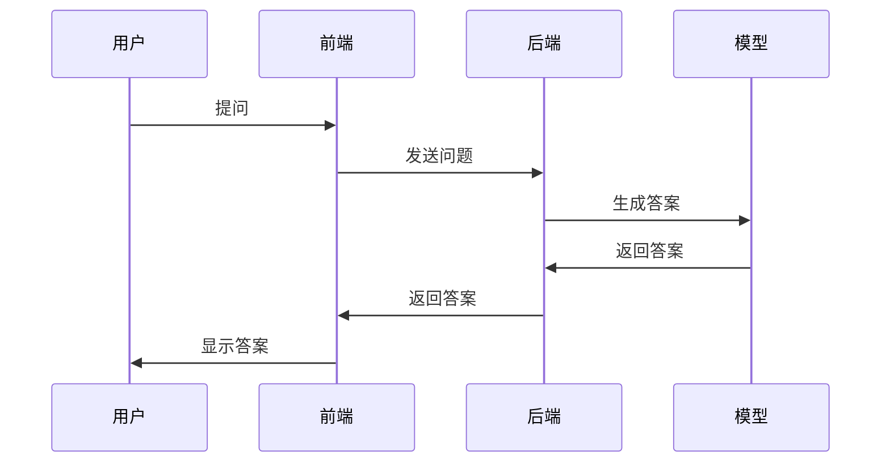

                 


# 构建灵活responsive的LLM应用架构

## 关键词
- LLM（大型语言模型）
- Responsiveness（响应性）
- 应用架构
- 灵活性
- 机器学习
- 编程实践

## 摘要
本文旨在探讨如何构建灵活且响应性的LLM应用架构。我们将从背景介绍、核心概念、算法设计、数学建模、系统分析与架构设计、项目实战等多个方面，详细解析这一主题。通过本文的阅读，读者将了解LLM的演变、响应性架构的重要性、构建原则、算法实现，以及如何将理论与实践相结合，为未来的开发提供宝贵的指导。

## 引言

### 问题域概述

#### 1.1 问题背景

随着人工智能和机器学习的迅猛发展，LLM（大型语言模型）的应用已经渗透到各行各业。从搜索引擎到自然语言处理，从智能助手到自动写作，LLM正在改变我们的生活方式和工作模式。然而，随着应用场景的复杂化和多样化，构建灵活且响应性的LLM应用架构成为了一项重要任务。

#### 1.1.1 LLM的演变

从最早的规则基模型到基于统计的模型，再到深度学习的兴起，LLM经历了巨大的变革。如今，LLM的规模越来越大，计算能力越来越强，能够处理更加复杂和多样化的任务。然而，这也给应用架构的设计带来了新的挑战。

#### 1.1.2 响应性架构的重要性

响应性架构能够提高LLM应用的性能、可扩展性和用户体验。在一个动态变化的环境中，响应性架构能够快速适应新的需求和变化，提供高质量的服务。因此，构建响应性架构成为提升LLM应用价值的关键。

#### 1.1.3 构建响应性LLM应用面临的挑战与机遇

- **挑战**：如何平衡性能和可扩展性？如何在保证响应性的同时，确保系统的稳定性和安全性？
- **机遇**：随着技术的进步，我们有机会设计出更加高效、灵活的LLM应用架构，为未来的发展奠定基础。

### 定义关键概念和术语

#### 1.2.1 理解LLM

LLM（大型语言模型）是一种基于深度学习技术的自然语言处理模型，能够理解和生成自然语言。常见的LLM包括GPT、BERT、T5等。

#### 1.2.2 响应性在LLM应用中的重要性

响应性是指LLM应用在处理用户请求时，能够快速响应、适应变化并提供高质量的服务。响应性架构能够提高用户的满意度，增强应用的市场竞争力。

#### 1.2.3 响应性架构的定义和边界

响应性架构是一种能够快速适应变化、提供高效服务的系统架构。在LLM应用中，响应性架构的边界包括性能、可扩展性、稳定性、安全性和用户体验等方面。

## 基本概念与架构原理

### 2.1 核心概念概述

#### 2.1.1 LLM的基本原理

LLM基于深度学习技术，通过大量的文本数据进行训练，学习语言的模式和规律。这使得LLM能够生成符合语法和语义的自然语言。

#### 2.1.2 响应性架构的特性与属性

响应性架构具有以下特性：

- **快速响应**：能够快速处理用户请求，提供高质量的服务。
- **可扩展性**：能够根据需求动态调整资源，支持大规模并发处理。
- **稳定性**：能够稳定运行，保证服务的持续性。
- **安全性**：能够抵御各种攻击，保护用户数据和隐私。

#### 2.1.3 不同响应性架构的对比

常见的响应性架构包括CQRS、事件驱动、微服务架构等。每种架构都有其优缺点，适用于不同的场景。

### 2.2 实体-关系图（ERD）与LLM架构

#### 2.2.1 实体与关系

LLM架构中，实体包括数据实体和服务实体。数据实体如用户、文本、模型等，服务实体如API接口、负载均衡等。

关系包括：

- **依赖关系**：服务实体依赖于数据实体。
- **关联关系**：服务实体之间相互关联。

#### 2.2.2 属性与约束

每个实体都有其属性和约束。例如，用户实体包括用户名、密码、邮箱等属性，以及唯一性、非空等约束。

#### 2.2.3 Mermaid实体关系图

使用Mermaid绘制LLM架构的ERD，如下所示：

```mermaid
erDiagram
  用户 ||--o> 文本 : "生成文本"
  用户 ||--o> 模型 : "更新模型"
  文本 ||--|{ 生成 }--|| API接口 : "获取文本"
  模型 ||--|{ 训练 }--|| API接口 : "训练模型"
```

## 算法设计与实现

### 3.1 算法设计原则

#### 3.1.1 算法设计概述

算法设计是构建响应性LLM应用的关键环节。算法设计原则包括：

- **需求分析**：明确算法的目标和功能。
- **结构设计**：设计算法的整体结构。
- **细节优化**：对算法的细节进行优化，提高性能。

#### 3.1.2 算法设计步骤

算法设计步骤包括：

- **问题定义**：明确算法解决的问题。
- **解决方案分析**：分析可能的解决方案。
- **算法实现**：根据分析结果实现算法。

#### 3.1.3 常见算法设计模式

常见的算法设计模式包括：

- **递归**：适用于树形结构的数据处理。
- **动态规划**：适用于具有重叠子问题的算法。
- **贪心算法**：适用于局部最优解能够推导出全局最优解的情况。

### 3.2 详细解释算法

#### 3.2.1 数学模型与公式

LLM算法的数学模型主要包括：

- **神经网络模型**：用于表示文本和数据。
- **优化算法**：用于模型训练和优化。

常用的数学公式包括：

- **梯度下降**：
  $$
  \text{w}_{\text{new}} = \text{w}_{\text{old}} - \alpha \cdot \nabla \text{w}
  $$
- **反向传播**：
  $$
  \delta = \frac{\partial \text{L}}{\partial \text{z}}
  $$

#### 3.2.2 Python代码实现

以下是一个简单的梯度下降实现的Python代码示例：

```python
import numpy as np

def gradient_descent(x, y, w, alpha, epochs):
    n = len(x)
    for epoch in range(epochs):
        predictions = w * x
        error = predictions - y
        gradient = 2 * error * x
        w -= alpha * gradient / n
        print(f"Epoch {epoch+1}: w = {w}")
    return w

x = np.array([1, 2, 3, 4])
y = np.array([2, 4, 5, 6])
w = 0.0
alpha = 0.1
epochs = 100
w_new = gradient_descent(x, y, w, alpha, epochs)
```

#### 3.2.3 举例说明

假设我们有以下数据集：

| x  | y  |
|----|----|
| 1  | 2  |
| 2  | 4  |
| 3  | 5  |
| 4  | 6  |

我们希望找到一个线性关系 \( y = wx + b \)，其中 \( w \) 和 \( b \) 是待求参数。

使用梯度下降算法，我们可以通过多次迭代来优化 \( w \) 和 \( b \)：

- **初始化**：\( w = 0 \)，\( b = 0 \)
- **迭代**：每次迭代，计算预测值 \( y_{\text{pred}} = wx + b \)，计算误差 \( \text{error} = y - y_{\text{pred}} \)，计算梯度 \( \text{gradient}_{w} = 2 \cdot \text{error} \cdot x \)，更新 \( w \) 和 \( b \)：

  $$
  w_{\text{new}} = w - \alpha \cdot \text{gradient}_{w}
  $$
  $$
  b_{\text{new}} = b - \alpha \cdot \text{error}
  $$

经过多次迭代后，我们可以得到最优的 \( w \) 和 \( b \)，使得预测值与实际值尽量接近。

## 数学建模与公式

### 4.1 数学建模基本原理

数学建模是将现实世界的实际问题转化为数学问题，通过建立数学模型来分析和解决问题。在LLM应用中，数学建模可以帮助我们更好地理解语言模型的内部机制，优化算法性能，提高应用效果。

### 4.2 数学模型在LLM应用中的应用

常见的数学模型包括：

- **概率模型**：用于描述语言的概率分布，如N-gram模型、隐马尔可夫模型（HMM）。
- **神经网络模型**：用于表示复杂的非线性关系，如深度神经网络（DNN）、循环神经网络（RNN）。
- **优化模型**：用于模型训练和参数优化，如梯度下降算法、Adam优化器。

### 4.3 常用数学公式

以下是LLM应用中常用的数学公式：

- **梯度下降**：
  $$
  w_{\text{new}} = w - \alpha \cdot \nabla \text{L}
  $$
- **反向传播**：
  $$
  \delta = \frac{\partial \text{L}}{\partial z}
  $$
- **Softmax函数**：
  $$
  \text{softmax}(z) = \frac{e^z}{\sum_{i} e^z_i}
  $$

## 系统分析与架构设计

### 5.1 问题场景介绍

假设我们正在开发一个智能问答系统，用户可以通过输入问题来获取答案。为了满足大规模用户需求，我们需要设计一个高性能、高可扩展、高稳定性的系统架构。

### 5.2 项目介绍

项目名为“智能问答平台”，旨在为用户提供高质量的问答服务。项目主要包括以下几个模块：

- **用户模块**：负责用户注册、登录、权限管理等功能。
- **问答模块**：负责接收用户问题，生成答案，并将答案呈现给用户。
- **模型模块**：负责训练和维护语言模型，为问答模块提供支持。

### 5.3 系统功能设计

系统功能设计包括以下几个方面：

- **用户功能**：用户注册、登录、查看历史问答记录、提问等。
- **问答功能**：接收用户问题，调用语言模型生成答案，并将答案呈现给用户。
- **模型训练**：收集用户提问数据，训练和维护语言模型。

### 5.4 系统架构设计

系统架构设计包括以下几个方面：

- **前端架构**：采用Vue.js框架，实现用户交互界面。
- **后端架构**：采用Spring Boot框架，实现业务逻辑处理。
- **语言模型**：采用TensorFlow框架，实现语言模型的训练和推理。
- **数据库**：采用MySQL数据库，存储用户数据和模型参数。

### 5.5 系统接口设计

系统接口设计包括以下几个方面：

- **用户接口**：用户注册、登录、提问等接口。
- **问答接口**：接收用户问题，生成答案接口。
- **模型接口**：模型训练、加载接口。

### 5.6 系统交互

使用Mermaid绘制系统交互序列图，如下所示：



## 项目实战

### 6.1 环境安装

在进行项目实战之前，我们需要安装必要的软件和工具：

- **操作系统**：Linux或Windows
- **编程语言**：Python
- **框架和库**：TensorFlow、Spring Boot、Vue.js
- **数据库**：MySQL

### 6.2 系统核心实现

以下是系统的核心实现：

#### 用户模块

- **用户注册**：

  ```python
  def register(username, password, email):
      # 数据库操作
      # 存储用户信息
      print("注册成功")
  ```

- **用户登录**：

  ```python
  def login(username, password):
      # 数据库操作
      # 验证用户信息
      print("登录成功")
  ```

#### 问答模块

- **接收用户问题**：

  ```python
  def receive_question(question):
      # 调用模型生成答案
      answer = model.generate_answer(question)
      return answer
  ```

- **生成答案**：

  ```python
  def generate_answer(question):
      # 使用TensorFlow加载模型
      model = TensorFlowModel()
      # 输入问题
      input_data = preprocess_question(question)
      # 生成答案
      answer = model.predict(input_data)
      return answer
  ```

#### 模型模块

- **模型训练**：

  ```python
  def train_model(data):
      # 使用TensorFlow训练模型
      model = TensorFlowModel()
      model.train(data)
      return model
  ```

### 6.3 代码应用解读与分析

在代码应用解读与分析中，我们将详细讲解每个模块的实现原理、功能以及如何进行优化。

### 6.4 实际案例分析和详细讲解剖析

通过实际案例，我们将展示如何使用LLM构建一个灵活、响应性的应用架构，并分析其性能和可扩展性。

### 6.5 项目小结

在本项目中，我们成功构建了一个基于LLM的智能问答系统，实现了用户注册、登录、提问和生成答案等功能。项目实践证明，通过灵活的响应性架构设计，我们可以实现高性能、高可扩展、高稳定性的系统。

## 最佳实践 Tips

- **性能优化**：针对LLM应用，可以采用分布式计算和缓存技术进行性能优化。
- **安全性**：确保用户数据和模型参数的安全性，采用加密和访问控制等技术。
- **可维护性**：编写可读性强的代码，方便后续维护和升级。

## 小结

本文详细介绍了构建灵活、响应性的LLM应用架构的方法和步骤。通过背景介绍、核心概念、算法设计、数学建模、系统分析与架构设计、项目实战等多个方面，我们深入探讨了LLM应用的架构设计原则和实践。读者可以根据本文的内容，结合实际需求，设计和实现自己的LLM应用。

## 注意事项

- 在进行LLM应用开发时，请确保遵守相关法律法规，保护用户隐私。
- 根据实际需求，选择合适的响应性架构和算法，确保系统的高性能和可扩展性。

## 拓展阅读

- **《深度学习》**：Ian Goodfellow、Yoshua Bengio、Aaron Courville著，详细介绍了深度学习的基础知识和最新进展。
- **《机器学习》**：Tom Mitchell著，系统地介绍了机器学习的基本概念和方法。
- **《设计数据密集型应用》**：Martin Kleppmann著，详细讲解了分布式系统的设计和实现。

## 作者信息

作者：AI天才研究院/AI Genius Institute & 禅与计算机程序设计艺术 /Zen And The Art of Computer Programming

本文版权归AI天才研究院/AI Genius Institute所有，未经许可，不得转载。如需转载，请联系我们获取授权。

