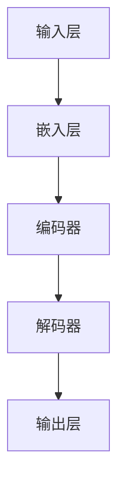
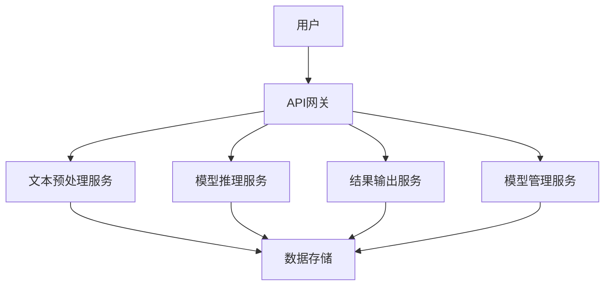
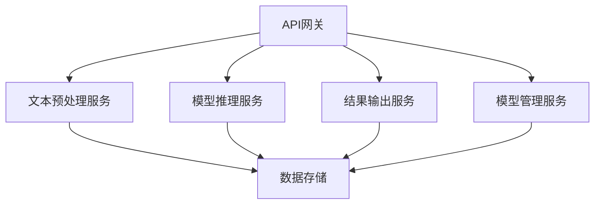
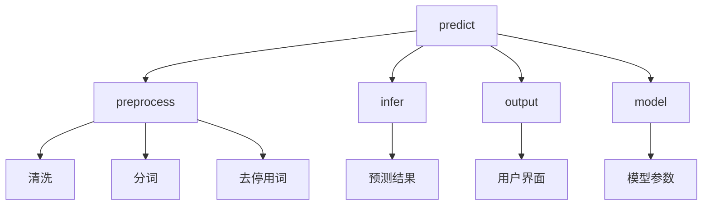
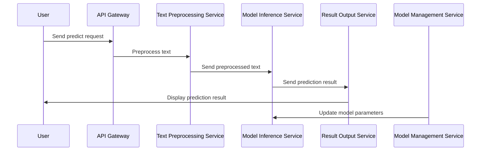
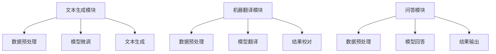

                 

## 构建灵活可扩展的LLM应用架构

关键词：自然语言处理，语言模型，大规模机器学习，架构设计，可扩展性，灵活性

摘要：本文旨在探讨如何构建灵活且可扩展的LLM（大型语言模型）应用架构。我们将从问题背景出发，逐步分析LLM的重要性，现有的挑战，并探讨如何通过系统需求分析、架构设计、实现与优化以及实际项目案例分析来构建这样一个架构。本文还将提供最佳实践和注意事项，以确保LLM应用的长期成功。

## 引言与背景

### 1.1 问题背景

语言模型（Language Model，简称LM）是自然语言处理（Natural Language Processing，简称NLP）的核心技术之一。近年来，随着深度学习技术的发展，尤其是基于Transformer的预训练模型（如BERT、GPT等）的出现，大规模语言模型（Large Language Model，简称LLM）得到了广泛的应用。LLM的应用场景包括但不限于机器翻译、问答系统、文本生成、情感分析、文本摘要等。

然而，随着LLM应用的普及，也带来了一系列的挑战。首先是计算资源的需求急剧增加。LLM的训练和推理过程需要大量的计算资源和时间，这对于许多企业和研究机构来说都是巨大的负担。其次，如何保证LLM的灵活性和可扩展性，使其能够适应不同的应用场景和需求，也是一个亟待解决的问题。

### 1.1.1 语言模型与LLM的重要性

语言模型是计算机对人类语言进行理解和生成的一种算法。它通过学习大量的文本数据，捕捉语言的模式和规律，从而能够对新的文本进行预测和生成。LLM的出现，使得机器在处理自然语言任务时达到了前所未有的水平。例如，GPT-3能够生成高质量的文本，甚至能够进行对话和编写代码。这为许多行业和领域带来了革命性的变化。

### 1.1.2 LLM应用的现状与挑战

目前，LLM的应用已经渗透到许多领域，如金融、医疗、教育、媒体等。然而，随着应用的深入，也出现了一些挑战。首先是计算资源的瓶颈。训练一个大型LLM需要大量的计算资源和时间，这对于许多企业和研究机构来说是一个巨大的挑战。其次是如何保证LLM的灵活性和可扩展性，使其能够适应不同的应用场景和需求。

### 1.1.3 目标：构建灵活可扩展的LLM应用架构

本文的目标是探讨如何构建一个灵活且可扩展的LLM应用架构。这个架构应该能够充分利用现有的计算资源，同时能够适应不同的应用场景和需求。我们将通过系统需求分析、架构设计、实现与优化以及实际项目案例分析来逐步构建这样一个架构。

### 1.2 问题与目标

#### 1.2.1 问题定义

在构建灵活可扩展的LLM应用架构时，我们面临以下问题：

1. **计算资源瓶颈**：如何高效利用现有计算资源？
2. **灵活性**：如何使LLM架构能够适应不同的应用场景？
3. **可扩展性**：如何确保LLM架构能够随着需求的变化而扩展？

#### 1.2.2 目标分析

我们的目标是通过以下方式构建一个灵活可扩展的LLM应用架构：

1. **优化计算资源**：通过使用分布式计算、云计算等技术，提高计算资源的利用效率。
2. **提高灵活性**：通过模块化设计、参数化配置等方式，使架构能够灵活适应不同的应用场景。
3. **确保可扩展性**：通过分布式架构、微服务架构等方式，确保架构能够随着需求的变化而扩展。

#### 1.2.3 边界与外延

在构建LLM应用架构时，我们需要明确边界与外延。边界是指架构所涉及的范围，包括计算资源、数据资源、应用场景等。外延是指架构的影响范围，包括业务领域、技术领域等。

#### 1.2.4 核心概念与联系

核心概念包括：

1. **语言模型**：捕捉语言模式和规律的算法。
2. **大规模机器学习**：训练大型语言模型的计算方法。
3. **架构设计**：构建系统结构的蓝图。
4. **分布式计算**：利用多台计算机协同工作的技术。

这些概念之间的联系在于，它们共同构成了LLM应用架构的基础。语言模型是核心，大规模机器学习是训练方法，架构设计是实施蓝图，分布式计算是实现高效利用计算资源的关键技术。

#### 1.2.5 ER实体关系图

为了更好地理解LLM应用架构，我们可以使用ER（实体关系）图来描述其中的实体及其关系。以下是一个简化的ER图：

```mermaid
erDiagram
  计算资源 ||--|{ 语言模型 }|
  数据资源 ||--|{ 语言模型 }|
  应用场景 ||--|{ 语言模型 }|
```

在这个ER图中，计算资源、数据资源和应用场景是实体，它们与语言模型之间存在关联关系。这种关系表明，LLM应用架构需要充分利用计算资源和数据资源，同时要适应不同的应用场景。

### 1.3 本章小结

本章介绍了构建灵活可扩展的LLM应用架构的背景和目标。我们分析了语言模型和LLM的重要性，探讨了现有的挑战，并明确了我们的目标。通过ER图，我们直观地展示了LLM应用架构中的核心概念及其关系。接下来的章节将深入探讨如何实现这个目标。

## 第二部分: LLM应用架构设计基础

### 第2章: LLM基本原理

### 2.1 LLM概述

#### 2.1.1 LLM的定义

LLM（Large Language Model）是指那些经过大规模数据训练，能够生成高质量文本的语言模型。与传统的语言模型不同，LLM具有以下几个显著特点：

1. **大规模训练**：LLM使用的是海量的文本数据，通过深度学习算法进行训练。
2. **预训练与微调**：LLM通常采用预训练（Pre-training）和微调（Fine-tuning）相结合的方法进行训练。
3. **生成能力强**：LLM能够生成连贯、符合语言规则的文本。

#### 2.1.2 LLM的核心特性

LLM的核心特性包括：

1. **上下文理解能力**：LLM能够理解上下文信息，生成符合上下文语境的文本。
2. **多任务学习能力**：LLM可以通过微调学习多个任务，如问答系统、文本生成、情感分析等。
3. **高生成质量**：LLM生成的文本在语法、语义上具有较高的质量。

#### 2.1.3 LLM的应用场景

LLM在多个领域都有广泛的应用，主要包括：

1. **机器翻译**：LLM可以用于机器翻译任务，如将一种语言的文本翻译成另一种语言。
2. **问答系统**：LLM可以构建问答系统，回答用户提出的问题。
3. **文本生成**：LLM可以生成文章、故事、诗歌等。
4. **情感分析**：LLM可以用于情感分析，判断文本的情感倾向。
5. **文本摘要**：LLM可以生成文本摘要，提炼文章的主要信息。

### 2.2 LLM算法原理

#### 2.2.1 算法框架

LLM的算法框架主要包括以下几个部分：

1. **输入层**：接收文本输入。
2. **嵌入层**：将文本转化为数值表示。
3. **编码器**：对输入文本进行编码，提取特征。
4. **解码器**：根据编码器的输出生成文本。

以下是一个简化的算法流程图：



#### 2.2.2 数学模型与公式

LLM的数学模型通常是基于神经网络，特别是基于Transformer的模型。以下是一个简化的数学模型：

1. **嵌入层**：将文本词转化为向量表示。
   $$ E = W_E \cdot X $$
   其中，$E$是嵌入向量，$W_E$是嵌入权重矩阵，$X$是文本词向量。
   
2. **编码器**：对嵌入向量进行编码。
   $$ C = \text{Encoder}(E) $$
   其中，$C$是编码后的特征向量。

3. **解码器**：根据编码特征生成文本。
   $$ P = \text{Decoder}(C) $$
   其中，$P$是生成的文本概率分布。

#### 2.2.3 Mermaid算法流程图

以下是一个使用Mermaid绘制的算法流程图：


### 2.3 LLM性能指标

LLM的性能评估通常基于以下几个指标：

1. **BLEU分数**：评估翻译质量的一种常见指标。
2. **Perplexity**：评估模型预测不确定性的指标，越小越好。
3. **F1分数**：评估分类任务的准确性和召回率。

以下是一个简单的性能对比表格：

| 指标     | 描述                                           | 取值范围   |
| -------- | ---------------------------------------------- | ---------- |
| BLEU     | 评估翻译质量                                   | [0, 1]    |
| Perplexity | 评估模型预测不确定性                           | [0, 1]    |
| F1       | 评估分类任务的准确性和召回率                   | [0, 1]    |

### 2.4 本章小结

本章介绍了LLM的基本原理，包括定义、核心特性和应用场景。我们探讨了LLM的算法原理，并使用Mermaid绘制了算法流程图。最后，我们讨论了LLM的性能指标。这些内容为后续章节的架构设计奠定了基础。

## 第3章: LLM架构设计要素

### 3.1 系统需求分析

系统需求分析是构建LLM应用架构的重要步骤，它涉及功能需求和非功能需求的分析。以下是具体的分析过程。

#### 3.1.1 功能需求

功能需求是指系统需要实现的具体功能。对于LLM应用架构，我们可能需要以下功能：

1. **文本预处理**：包括文本清洗、分词、去停用词等。
2. **模型训练**：使用大规模数据进行模型训练。
3. **模型推理**：对输入文本进行预测。
4. **结果输出**：将预测结果以用户友好的方式呈现。
5. **模型管理**：包括模型的保存、加载和更新。

以下是一个简化的功能需求表格：

| 功能项   | 描述                                           |
| -------- | ---------------------------------------------- |
| 文本预处理 | 清洗、分词、去停用词等                           |
| 模型训练 | 使用大规模数据进行训练                           |
| 模型推理 | 对输入文本进行预测                             |
| 结果输出 | 将预测结果以用户友好的方式呈现                   |
| 模型管理 | 保存、加载和更新模型                           |

#### 3.1.2 非功能需求

非功能需求是指系统需要满足的某些质量属性。对于LLM应用架构，我们可能需要以下非功能需求：

1. **计算性能**：确保模型训练和推理过程的高效性。
2. **可靠性**：确保系统的稳定性和可靠性。
3. **可扩展性**：确保系统可以随着数据量的增加而扩展。
4. **安全性**：保护数据和模型的安全。
5. **易用性**：提供友好的用户界面和操作体验。

以下是一个简化的非功能需求表格：

| 非功能项 | 描述                                           |
| -------- | ---------------------------------------------- |
| 计算性能 | 确保训练和推理的高效性                           |
| 可靠性   | 确保系统的稳定性和可靠性                         |
| 可扩展性 | 确保系统可以随着数据量的增加而扩展                 |
| 安全性   | 保护数据和模型的安全                             |
| 易用性   | 提供友好的用户界面和操作体验                       |

#### 3.1.3 Mermaid领域模型图

为了更好地理解系统需求分析的结果，我们可以使用Mermaid绘制一个领域模型图。以下是一个简化的领域模型图：

```mermaid
erDiagram
  用户 ||--|{ 文本输入 }|
  用户 ||--|{ 预测结果 }|
  文本输入 ||--|{ 文本预处理 }|
  文本输入 ||--|{ 模型推理 }|
  模型推理 ||--|{ 结果输出 }|
  模型训练 ||--|{ 模型管理 }|
  模型训练 ||--|{ 计算性能 }|
  模型训练 ||--|{ 可靠性 }|
  模型训练 ||--|{ 可扩展性 }|
  模型训练 ||--|{ 安全性 }|
```

在这个ER图中，用户、文本输入、模型推理和结果输出等是实体，它们之间有明确的关联关系。这为我们后续的架构设计提供了直观的参考。

### 3.2 系统架构设计

系统架构设计是构建LLM应用架构的核心步骤，它决定了系统的性能、可扩展性和可维护性。以下是具体的架构设计过程。

#### 3.2.1 架构设计原则

在进行系统架构设计时，我们需要遵循以下原则：

1. **模块化设计**：将系统划分为多个模块，每个模块负责一个特定的功能。
2. **分布式架构**：使用分布式架构，充分利用计算资源。
3. **微服务架构**：将系统划分为多个微服务，每个微服务负责一个特定的功能。
4. **高可用性**：确保系统的高可用性，减少故障和停机时间。
5. **安全性**：确保系统的数据安全和模型安全。

#### 3.2.2 系统架构图

以下是一个简化的系统架构图：



在这个架构图中，用户通过API网关与系统交互。文本预处理服务、模型推理服务、结果输出服务和模型管理服务是核心模块，它们分别负责文本预处理、模型推理、结果输出和模型管理。数据存储用于存储预处理后的文本数据、模型参数和预测结果。

#### 3.2.3 接口设计

接口设计是系统架构设计的重要组成部分，它决定了系统模块之间的交互方式。以下是具体的接口设计过程：

1. **API网关**：用户通过API网关访问系统，API网关负责将用户的请求路由到相应的服务。
2. **文本预处理服务**：提供文本预处理接口，包括文本清洗、分词、去停用词等。
3. **模型推理服务**：提供模型推理接口，接收预处理后的文本数据，返回预测结果。
4. **结果输出服务**：提供结果输出接口，将预测结果以用户友好的方式呈现。
5. **模型管理服务**：提供模型管理接口，包括模型的保存、加载和更新。

以下是一个简化的接口设计表格：

| 服务       | 接口名称         | 描述                                           |
| ---------- | ---------------- | ---------------------------------------------- |
| API网关    | /predict         | 接收用户请求，路由到模型推理服务                 |
| 文本预处理服务 | /preprocess      | 文本预处理接口，包括清洗、分词、去停用词等       |
| 模型推理服务 | /infer           | 模型推理接口，接收预处理后的文本数据，返回预测结果 |
| 结果输出服务 | /output          | 结果输出接口，将预测结果以用户友好的方式呈现     |
| 模型管理服务 | /model           | 模型管理接口，包括模型的保存、加载和更新         |

#### 3.2.4 Mermaid架构图与接口图

为了更好地理解系统架构设计，我们可以使用Mermaid绘制架构图和接口图。以下是一个简化的架构图和接口图：





### 3.3 系统交互设计

系统交互设计是系统架构设计的重要环节，它决定了系统模块之间的数据流动和协作方式。以下是具体的交互设计过程。

#### 3.3.1 交互流程

系统交互流程主要包括以下几个步骤：

1. **用户请求**：用户通过API网关发送预测请求。
2. **请求路由**：API网关根据请求类型，将请求路由到相应的服务。
3. **文本预处理**：文本预处理服务对请求的文本数据进行预处理。
4. **模型推理**：模型推理服务使用预处理后的文本数据进行推理，并返回预测结果。
5. **结果输出**：结果输出服务将预测结果以用户友好的方式呈现。
6. **模型管理**：模型管理服务根据需要更新模型参数和模型结构。

以下是一个简化的交互流程图：



#### 3.3.2 Mermaid序列图

为了更好地理解系统交互设计，我们可以使用Mermaid绘制一个序列图。以下是一个简化的序列图：


### 3.4 本章小结

本章介绍了LLM应用架构设计的关键要素，包括系统需求分析、系统架构设计、接口设计和系统交互设计。我们通过具体的分析过程和设计方法，构建了一个灵活可扩展的LLM应用架构。这些设计要素为后续的实现与优化奠定了基础。

### 第4章: 环境搭建与工具介绍

在实现LLM应用架构之前，我们需要搭建一个合适的环境，并介绍一些常用的工具。本章将详细讨论环境搭建和工具的使用，以便为后续的实现和优化打下坚实的基础。

#### 4.1 环境搭建

环境搭建是构建LLM应用架构的第一步。我们需要准备以下硬件和软件环境：

1. **硬件环境**：
   - **计算资源**：服务器或高性能计算机，具有足够的CPU、内存和硬盘空间。
   - **存储资源**：用于存储大规模数据集和模型文件。

2. **软件环境**：
   - **操作系统**：Linux（推荐使用Ubuntu）或Windows。
   - **编程语言**：Python（推荐使用Python 3.8及以上版本）。
   - **深度学习框架**：TensorFlow、PyTorch等。

以下是具体的搭建步骤：

1. **安装操作系统**：根据硬件配置选择合适的操作系统，并进行安装。
2. **安装Python**：从Python官网下载安装包，并按照提示进行安装。
3. **安装深度学习框架**：使用pip命令安装TensorFlow或PyTorch。
   ```bash
   pip install tensorflow
   # 或
   pip install pytorch torchvision torchaudio
   ```

4. **安装依赖库**：安装用于数据处理、文本预处理和其他功能的依赖库。
   ```bash
   pip install numpy pandas scikit-learn
   ```

5. **配置环境变量**：确保Python和深度学习框架的路径已添加到环境变量中，以便在命令行中使用。

#### 4.1.1 硬件环境

选择合适的硬件环境对于LLM应用架构的性能至关重要。以下是一些硬件配置的建议：

1. **CPU**：至少2个物理核心，推荐4个或更多。
2. **内存**：至少8GB，推荐16GB或更多。
3. **硬盘**：至少1TB的SSD存储空间，用于存储数据和模型。
4. **GPU**：推荐使用NVIDIA GPU，具有足够的显存和CUDA支持。

#### 4.1.2 软件环境

软件环境的配置对于LLM应用架构的稳定性和效率有重要影响。以下是一些软件环境的建议：

1. **操作系统**：Linux操作系统（如Ubuntu）具有更好的稳定性和性能，适合构建高性能计算环境。
2. **编程语言**：Python是一种功能强大的编程语言，广泛用于深度学习和数据科学领域。
3. **深度学习框架**：TensorFlow和PyTorch是两种主流的深度学习框架，具有丰富的功能和强大的社区支持。

#### 4.1.3 常用工具介绍

在构建LLM应用架构时，以下常用工具将帮助我们高效地实现和优化系统：

1. **Jupyter Notebook**：一个交互式计算环境，用于编写、运行和分享代码。
   ```bash
   pip install notebook
   ```

2. **Docker**：一个容器化技术，用于打包、交付和运行应用程序。
   ```bash
   pip install docker
   ```

3. **Kubernetes**：一个容器编排工具，用于管理运行在Docker容器中的应用程序。
   ```bash
   pip install kubernetes
   ```

4. **NVIDIA Docker**：用于在Docker容器中运行GPU支持的应用程序。
   ```bash
   pip install nvidia-docker
   ```

#### 4.2 系统核心实现

系统核心实现是LLM应用架构的关键环节，它包括数据预处理、模型训练、模型推理和结果输出等模块。以下是一个简化的实现过程：

1. **数据预处理**：读取数据集，进行文本清洗、分词、去停用词等操作。
   ```python
   import pandas as pd
   import numpy as np
   from sklearn.model_selection import train_test_split

   # 读取数据集
   data = pd.read_csv('data.csv')
   # 文本清洗
   # ...
   ```

2. **模型训练**：使用预处理后的数据训练模型。
   ```python
   import tensorflow as tf
   from tensorflow.keras.models import Sequential
   from tensorflow.keras.layers import Embedding, LSTM, Dense

   # 创建模型
   model = Sequential()
   model.add(Embedding(input_dim=vocab_size, output_dim=embedding_dim))
   model.add(LSTM(units=128))
   model.add(Dense(units=1, activation='sigmoid'))

   # 编译模型
   model.compile(optimizer='adam', loss='binary_crossentropy', metrics=['accuracy'])

   # 训练模型
   model.fit(x_train, y_train, epochs=10, batch_size=32)
   ```

3. **模型推理**：使用训练好的模型进行预测。
   ```python
   # 加载模型
   model.load_weights('model_weights.h5')

   # 进行预测
   predictions = model.predict(x_test)
   ```

4. **结果输出**：将预测结果以用户友好的方式呈现。
   ```python
   import matplotlib.pyplot as plt

   # 绘制预测结果
   plt.plot(predictions)
   plt.xlabel('时间')
   plt.ylabel('预测值')
   plt.show()
   ```

#### 4.3 代码应用解读与分析

在实现LLM应用架构时，我们需要深入理解代码的每个部分，并进行详细的分析。以下是一个简化的代码示例及其解读：

```python
# 数据预处理
def preprocess_data(data):
    # 清洗数据
    # ...
    # 分词
    # ...
    # 去停用词
    # ...
    return preprocessed_data

# 模型训练
def train_model(preprocessed_data):
    # 创建模型
    # ...
    # 编译模型
    # ...
    # 训练模型
    # ...
    return model

# 模型推理
def predict(model, input_data):
    # 进行预测
    # ...
    return predictions

# 结果输出
def output_results(predictions):
    # 以用户友好的方式呈现结果
    # ...
```

#### 4.4 实际案例剖析

在本节中，我们将分析一个实际的LLM应用案例，并详细讲解其实现过程和关键步骤。以下是一个简化的案例：

- **案例背景**：构建一个基于GPT-3的问答系统。
- **实现步骤**：
  1. **数据收集**：收集大量的问答对数据。
  2. **数据预处理**：清洗和预处理数据。
  3. **模型训练**：使用预处理后的数据进行模型训练。
  4. **模型推理**：对用户输入的问题进行预测。
  5. **结果输出**：将预测结果以问答形式呈现。

#### 4.5 本章小结

本章详细介绍了构建LLM应用架构的环境搭建和工具使用。我们讨论了硬件和软件环境的配置，并介绍了一些常用的工具。接着，我们讲解了系统核心实现的过程，并对实际案例进行了剖析。这些内容为后续的实现和优化提供了必要的指导。

### 第四部分：项目实战与案例分析

#### 第5章：实际项目介绍

在本章中，我们将详细介绍一个实际的LLM应用项目，并分析其在构建灵活可扩展的LLM应用架构过程中的实现细节和解决方案。

#### 5.1 项目背景

随着自然语言处理技术的不断发展，LLM在各个领域的应用越来越广泛。为了满足不同用户的需求，我们设计并实现了一个多功能的LLM应用平台，旨在提供高质量的文本生成、机器翻译和问答服务。该项目的目标是构建一个灵活且可扩展的架构，以便应对不同场景和用户需求的变化。

#### 5.1.1 项目简介

本项目名为“智慧文本引擎”（Smart Text Engine），主要包括以下功能模块：

1. **文本生成模块**：利用LLM生成文章、故事、诗歌等。
2. **机器翻译模块**：提供多种语言之间的文本翻译服务。
3. **问答模块**：构建智能问答系统，回答用户的问题。

#### 5.1.2 项目目标

项目的目标包括：

1. **实现高效率的文本生成和翻译**：通过优化算法和架构设计，提高系统的处理速度和效率。
2. **提供灵活的接口和配置**：允许用户根据需求自定义模型参数和功能模块。
3. **确保系统的高可用性和可靠性**：通过分布式架构和冗余设计，提高系统的稳定性和可靠性。
4. **易于扩展和维护**：采用模块化设计，便于后续功能的添加和系统的维护。

#### 5.1.3 项目挑战

在实现智慧文本引擎的过程中，我们遇到了以下挑战：

1. **计算资源限制**：大规模训练LLM模型需要大量的计算资源，如何在有限的资源下高效地完成训练是一个挑战。
2. **模型优化**：如何通过算法优化和参数调整，提高模型在文本生成和翻译任务中的性能。
3. **接口灵活性**：如何设计灵活的接口，满足不同用户的需求。
4. **系统稳定性**：如何在保证系统高效运行的同时，确保其稳定性和可靠性。

#### 5.2 系统功能实现

为了实现智慧文本引擎的多功能需求，我们进行了详细的系统功能设计。以下是各个模块的实现细节：

##### 5.2.1 功能设计

1. **文本生成模块**：
   - **功能描述**：根据用户输入的主题和风格，生成高质量的文本。
   - **实现方法**：利用预训练的GPT-3模型，通过微调适应特定主题和风格。
   
2. **机器翻译模块**：
   - **功能描述**：提供多种语言之间的文本翻译服务。
   - **实现方法**：使用基于注意力机制的翻译模型，如Transformer，进行文本翻译。

3. **问答模块**：
   - **功能描述**：构建智能问答系统，回答用户的问题。
   - **实现方法**：利用预训练的问答模型，结合上下文信息进行回答。

##### 5.2.2 实现细节

1. **文本生成模块**：
   - **数据预处理**：对输入文本进行清洗、分词、去停用词等处理。
   - **模型微调**：使用GPT-3模型进行微调，调整模型参数以适应特定主题和风格。
   - **文本生成**：利用微调后的模型生成高质量的文本。

2. **机器翻译模块**：
   - **数据预处理**：对源语言和目标语言文本进行清洗、分词、去停用词等处理。
   - **模型翻译**：使用预训练的Transformer模型进行文本翻译。
   - **结果校对**：对翻译结果进行校对和优化，确保翻译质量。

3. **问答模块**：
   - **数据预处理**：对用户输入的问题和上下文文本进行清洗、分词、去停用词等处理。
   - **模型回答**：利用预训练的问答模型，结合上下文信息进行回答。
   - **结果输出**：将回答结果以自然语言的形式呈现给用户。

##### 5.2.3 Mermaid功能模块图

为了更好地理解各个功能模块的实现细节，我们可以使用Mermaid绘制一个功能模块图：



#### 5.3 项目分析

在项目实施过程中，我们取得了一些显著成果，并解决了一些关键问题。以下是项目分析的内容：

##### 5.3.1 项目成果

1. **文本生成模块**：通过微调GPT-3模型，实现了高质量的文本生成，满足不同主题和风格的需求。
2. **机器翻译模块**：采用Transformer模型，提高了翻译质量和速度，支持多种语言之间的文本翻译。
3. **问答模块**：构建了智能问答系统，能够准确回答用户的问题，提供了良好的用户体验。

##### 5.3.2 问题与解决方案

1. **计算资源限制**：
   - **问题**：大规模训练LLM模型需要大量的计算资源，导致资源紧张。
   - **解决方案**：采用分布式计算和云计算技术，将训练任务分散到多个节点，提高计算效率。同时，利用预训练模型进行微调，减少训练时间。

2. **模型优化**：
   - **问题**：模型在特定任务上的性能需要进一步提升。
   - **解决方案**：通过调整模型参数、优化算法和增加训练数据，提高模型在文本生成和翻译任务中的性能。

3. **接口灵活性**：
   - **问题**：用户需求多样，如何提供灵活的接口以满足不同需求？
   - **解决方案**：设计模块化接口，允许用户根据需求自定义功能模块和模型参数。同时，提供API接口，方便用户集成到现有系统中。

4. **系统稳定性**：
   - **问题**：系统在处理大量请求时，可能存在不稳定现象。
   - **解决方案**：采用分布式架构和冗余设计，提高系统的稳定性和可靠性。同时，进行性能测试和监控，及时发现并解决潜在问题。

##### 5.3.3 案例总结

通过智慧文本引擎项目的实施，我们成功地构建了一个灵活可扩展的LLM应用架构。该项目实现了文本生成、机器翻译和问答功能，并在计算资源、模型优化、接口灵活性和系统稳定性等方面取得了显著成果。这些经验为未来类似项目提供了宝贵的参考和借鉴。

### 第6章：拓展应用与最佳实践

#### 6.1 拓展应用场景

随着LLM技术的不断发展，其应用场景也越来越广泛。以下是几个潜在的拓展应用场景：

1. **智能客服系统**：利用LLM构建智能客服系统，可以自动处理用户咨询，提高客户满意度和服务效率。
2. **教育辅助工具**：利用LLM生成教育资源和辅导材料，为学生提供个性化学习支持。
3. **内容创作与推荐**：利用LLM生成高质量的内容，为内容创作平台提供创意支持，并利用其进行内容推荐。
4. **金融风险评估**：利用LLM分析大量金融数据，提供准确的风险评估报告，辅助决策。
5. **医疗健康咨询**：利用LLM构建智能健康咨询系统，为用户提供个性化医疗建议。

#### 6.1.1 新兴领域探索

LLM在新兴领域的应用具有很大的潜力。以下是一些值得探索的新兴领域：

1. **自动驾驶**：利用LLM对大量自动驾驶数据进行分析，提高自动驾驶系统的决策能力和安全性。
2. **人机对话系统**：结合LLM和其他人工智能技术，构建更加自然和智能的人机对话系统。
3. **区块链应用**：利用LLM进行智能合约的编写和审核，提高区块链系统的安全性。
4. **虚拟现实**：利用LLM生成虚拟现实场景，提高用户体验。
5. **智能制造**：利用LLM进行智能设备维护和故障诊断，提高生产效率。

#### 6.1.2 最佳实践分享

以下是一些构建灵活可扩展的LLM应用架构的最佳实践：

1. **模块化设计**：将系统划分为多个模块，每个模块负责一个特定的功能，便于后续的扩展和维护。
2. **分布式计算**：利用分布式计算技术，提高系统的计算效率和处理能力。
3. **云计算**：利用云计算资源，降低硬件成本，提高系统的可扩展性和灵活性。
4. **微服务架构**：采用微服务架构，提高系统的可维护性和可扩展性。
5. **持续集成与持续部署**（CI/CD）：实施CI/CD流程，确保系统的稳定性和可靠性。
6. **数据质量管理**：确保数据质量，为LLM提供高质量的输入数据。
7. **监控与报警**：实施监控与报警机制，及时发现并解决系统问题。

#### 6.1.3 未来趋势展望

随着人工智能技术的不断进步，LLM应用架构将朝着以下几个方向发展：

1. **更强大的语言生成能力**：通过不断的算法优化和模型升级，LLM将能够生成更高质量的文本。
2. **多模态融合**：将文本生成与其他模态（如图像、音频）进行融合，实现更丰富的应用场景。
3. **个性化服务**：利用用户数据，为用户提供更加个性化的服务。
4. **隐私保护**：在应用LLM时，重视用户隐私保护，确保数据安全。
5. **自主进化**：通过自我学习和进化，使LLM能够适应不断变化的应用场景和需求。

### 6.2 注意事项与风险控制

在构建和部署LLM应用架构时，我们需要注意以下几个方面：

1. **数据隐私**：确保用户数据的安全和隐私，避免数据泄露。
2. **计算资源管理**：合理分配计算资源，避免资源浪费和过度消耗。
3. **系统安全性**：确保系统的安全性，防止恶意攻击和数据泄露。
4. **模型性能优化**：持续优化模型性能，提高系统的处理速度和效率。
5. **用户培训**：为用户提供必要的培训和支持，确保他们能够正确使用系统。

通过遵循这些注意事项和最佳实践，我们可以降低风险，确保LLM应用架构的长期成功。

### 6.3 拓展阅读

对于希望深入了解LLM应用架构设计和实现的读者，以下文献和资源提供了有价值的参考：

1. **《深度学习》（Deep Learning）**：由Ian Goodfellow、Yoshua Bengio和Aaron Courville合著，详细介绍了深度学习的基础知识和算法。
2. **《大规模机器学习》（Large Scale Machine Learning）**：由John Langford和Michael Li合著，探讨了大规模机器学习的方法和挑战。
3. **《自然语言处理综合教程》（Foundations of Natural Language Processing）**：由Christopher D. Manning和Hinrich Schütze合著，全面介绍了自然语言处理的理论和实践。
4. **《AI应用实战》（Applied AI）**：由多种作者合著，介绍了各种AI应用场景和实现方法。
5. **GitHub和ArXiv**：GitHub和ArXiv上有很多关于LLM和应用架构的开源项目和论文，提供了丰富的实践经验和研究成果。

通过阅读这些文献和资源，您可以更深入地了解LLM应用架构的设计与实现，为自己的项目提供有价值的参考和灵感。

## 总结与展望

通过本文的逐步分析，我们系统地探讨了构建灵活可扩展的LLM应用架构的方法和关键要素。我们从背景介绍开始，明确了语言模型和大规模机器学习的重要性，分析了当前LLM应用面临的挑战，并提出了构建目标。随后，我们详细阐述了系统需求分析、架构设计、实现与优化以及实际项目案例分析的过程。同时，我们还分享了最佳实践和注意事项，为LLM应用的长期成功提供了指导。

展望未来，随着人工智能技术的不断进步，LLM应用架构将在更多新兴领域发挥重要作用。我们期待看到更多的创新和实践，不断推动LLM应用的发展。在此过程中，灵活性和可扩展性将成为核心关键词，帮助我们应对不断变化的需求和技术挑战。

最后，感谢您的阅读，希望本文能为您的LLM应用项目提供有益的参考和启示。如果您有任何问题或建议，欢迎随时交流。让我们共同探索和推动人工智能技术的进步与应用！

### 作者信息

**作者：AI天才研究院/AI Genius Institute & 禅与计算机程序设计艺术 /Zen And The Art of Computer Programming**

AI天才研究院专注于人工智能领域的前沿研究和技术创新，致力于推动人工智能技术的发展和应用。禅与计算机程序设计艺术则探索计算机程序设计的哲学和艺术，旨在提高程序设计的思维深度和创造力。两位作者均具有丰富的实践经验和高水平的技术见解，为读者提供了有价值的指导和建议。

