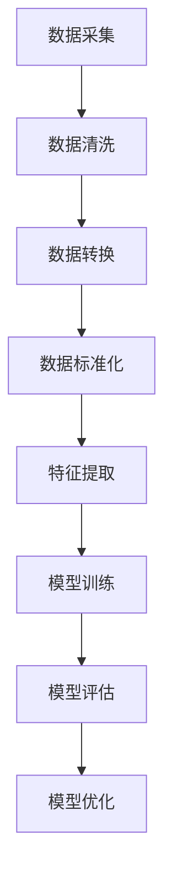

                 


# 引言

在当今数字化时代，大数据和人工智能技术已经成为各行各业发展的驱动力。评测知识库作为人工智能系统的重要组成部分，其构建质量和效率直接影响到人工智能系统的性能和应用效果。为了帮助广大开发者、研究人员和企业更好地理解和掌握评测知识库的构建方法，本文将为您详细解析评测知识库的核心概念、构建流程和最佳实践。本文分为以下几个部分：

1. **背景介绍**：介绍评测知识库的重要性，以及构建评测知识库所面临的问题和挑战。
2. **核心概念与联系**：详细阐述评测知识库、数据采集、数据处理、知识表示、知识存储和知识更新等核心概念，并提供相应的概念对比表格和ER实体关系图。
3. **算法原理讲解**：深入探讨评测知识库构建过程中涉及的主要算法原理，包括数据预处理、特征提取、模型训练和评估等。
4. **系统分析与架构设计**：分析评测知识库系统的需求，介绍系统功能设计、系统架构设计和系统接口设计等。
5. **项目实战**：通过一个实际案例，详细展示评测知识库的构建过程，包括环境安装、核心代码实现、代码解读和分析等。
6. **最佳实践 tips**：总结构建评测知识库的最佳实践，提供一些实用技巧和建议。
7. **小结与拓展阅读**：对全文内容进行总结，并推荐一些相关的拓展阅读资源。

通过本文的学习，您将能够全面了解评测知识库的构建方法，掌握相关的技术原理和实践技巧，为您的项目开发提供有力支持。接下来，我们将首先介绍评测知识库的背景和重要性。

## 1. 背景介绍

### 1.1 评测知识库的重要性

评测知识库是一种用于存储和管理评测相关数据的数据库系统，它为人工智能系统提供了丰富的评测数据、规则和算法，有助于提高系统的评测准确性和效率。以下是评测知识库在人工智能领域的重要性：

1. **提升系统性能**：评测知识库为人工智能系统提供了大量的数据支持，使得系统可以更好地学习和适应不同的评测任务。通过不断优化评测知识库中的数据、规则和算法，可以显著提升系统的性能和准确性。

2. **加速模型训练**：评测知识库中的大量数据可以帮助人工智能系统快速进行模型训练。通过高效的算法和数据处理技术，可以加快模型训练速度，降低训练成本。

3. **增强系统鲁棒性**：评测知识库中包含了多种评测任务和场景的数据，有助于提高系统的鲁棒性。在面对不同的评测任务和数据集时，系统可以更好地应对和适应，降低错误率和失败率。

4. **促进知识共享**：评测知识库提供了一个共享和交流的平台，使得不同研究者、企业和用户可以共享和利用已有的评测数据、规则和算法，加速人工智能技术的发展。

### 1.2 问题背景

随着人工智能技术的迅猛发展，评测知识库的应用场景越来越广泛，如自然语言处理、计算机视觉、推荐系统等。然而，在构建评测知识库的过程中，开发者面临着以下问题和挑战：

1. **数据采集难度大**：获取大量、多样化、高质量的评测数据是构建评测知识库的关键。数据来源可能涉及互联网、企业内部数据、公开数据集等，数据采集难度较大。

2. **数据处理复杂**：采集到的评测数据通常存在噪声、缺失、不一致等问题，需要进行清洗、转换和标准化处理，以提高数据质量和可用性。

3. **知识表示困难**：将评测数据转化为计算机可以理解和处理的形式是构建评测知识库的难点。知识表示方法的选择和实现需要深入理解评测任务的特点和数据结构。

4. **知识存储挑战**：存储和管理大量的评测数据是一项具有挑战性的任务。如何高效地存储和管理评测数据，保证数据的安全性和可靠性，是开发者需要解决的问题。

5. **知识更新困难**：评测知识库需要定期更新以保持其实时性和准确性。然而，更新过程涉及到数据采集、处理、存储和知识的同步更新，是一项复杂且耗时的工作。

### 1.3 问题描述

针对上述问题和挑战，构建评测知识库需要解决以下问题：

1. **数据采集**：如何获取大量、多样化、高质量的评测数据？

2. **数据处理**：如何对评测数据进行清洗、转换和标准化处理，以提高数据质量和可用性？

3. **知识表示**：如何将评测数据转化为计算机可以理解和处理的形式？

4. **知识存储**：如何高效地存储和管理大量的评测数据？

5. **知识更新**：如何保证评测知识库的实时性和准确性？

### 1.4 问题解决

为了解决上述问题，本文将提供一系列最佳实践，包括数据采集、处理、存储、更新等方面的技术方法和策略。此外，还将介绍评测知识库的核心概念、架构设计、实现细节以及应用场景，帮助读者全面掌握评测知识库的构建方法和实践技巧。

### 1.5 边界与外延

评测知识库的构建涉及多个领域，包括人工智能、数据科学、软件工程等。本指南重点关注评测知识库在人工智能领域中的应用，但所介绍的方法和技术也可应用于其他领域。

### 1.6 概念结构与核心要素组成

评测知识库的核心概念包括评测数据、知识表示、知识存储、知识更新等。以下是评测知识库的基本架构：

1. **评测数据**：包括文本、图像、音频、视频等多种类型的数据。数据来源可能涉及互联网、企业内部数据、公开数据集等。

2. **知识表示**：将评测数据转化为计算机可以理解和处理的形式，包括本体、规则、模型等。知识表示方法的选择和实现需要深入理解评测任务的特点和数据结构。

3. **知识存储**：采用关系型数据库、NoSQL数据库、数据仓库等数据存储系统，高效地存储和管理大量的评测数据。

4. **知识更新**：定期更新评测知识库中的数据、规则和算法，以保持其实时性和准确性。更新过程包括数据采集、处理、存储和知识的同步更新。

### 1.7 本章小结

本章介绍了构建评测知识库的背景、问题描述、问题解决、边界与外延以及概念结构与核心要素组成。下一章将深入探讨评测知识库的核心概念，包括评测数据、知识表示、知识存储和知识更新等方面的内容。

---

[返回目录](#构建评测知识库与最佳实践指南)

---

# 第一部分：核心概念与联系

## 核心概念原理

### 1. 评测知识库

评测知识库是一种用于存储和管理评测相关数据的数据库系统，其核心目的是为人工智能系统提供丰富的评测数据、规则和算法。评测知识库通常包含多种类型的数据，如文本、图像、音频、视频等，以及相关的评测标准和规则。

**关键术语说明**：

- **评测数据**：用于评估和判断系统性能和效果的数据。
- **评测标准**：用于衡量系统性能的具体指标和规则。
- **知识表示**：将评测数据转化为计算机可以理解和处理的形式。

### 2. 数据采集

数据采集是指从各种数据源获取评测数据的任务。数据采集是构建评测知识库的第一步，其质量直接影响到评测知识库的准确性和可靠性。

**关键术语说明**：

- **数据源**：提供评测数据的地方，如互联网、企业内部数据、公开数据集等。
- **数据采集工具**：用于获取评测数据的工具，如爬虫、API调用等。
- **数据采集方法**：获取评测数据的策略和技术，如随机抽样、全面调查等。

### 3. 数据处理

数据处理是对采集到的评测数据进行清洗、转换和标准化处理的任务。数据处理是构建评测知识库的关键环节，其目的是提高数据质量和可用性。

**关键术语说明**：

- **数据清洗**：去除数据中的噪声、错误和缺失值。
- **数据转换**：将不同格式的数据统一为同一格式，如将文本数据转化为表格数据。
- **数据标准化**：对数据进行归一化或标准化处理，以便后续处理和分析。

### 4. 知识表示

知识表示是将评测数据转化为计算机可以理解和处理的形式。知识表示是评测知识库的核心组成部分，其目的是将评测数据转化为可用的知识。

**关键术语说明**：

- **本体**：用于表示评测数据中的概念、关系和属性。
- **规则**：用于描述评测数据中的规则和约束条件。
- **模型**：用于表示评测数据中的统计规律和预测模型。

### 5. 知识存储

知识存储是指将处理后的评测数据存储到数据库或其他数据存储系统的任务。知识存储是评测知识库的关键环节，其目的是确保评测数据的安全、可靠和高效访问。

**关键术语说明**：

- **数据库**：用于存储和管理评测数据的系统，如关系型数据库、NoSQL数据库等。
- **数据仓库**：用于存储和管理大量评测数据的系统，如数据湖、数据仓库等。
- **数据存储方案**：评测数据的存储策略和架构，如分布式存储、云存储等。

### 6. 知识更新

知识更新是指定期更新评测知识库中的数据、规则和算法，以保持其实时性和准确性。知识更新是评测知识库持续发展的重要保障。

**关键术语说明**：

- **数据更新**：定期采集和处理新的评测数据，更新评测知识库。
- **规则更新**：根据新的评测需求和标准，更新评测规则。
- **算法更新**：根据新的数据和规则，更新评测算法，以提高评测准确性。

## 概念属性特征对比表格

以下是评测知识库相关概念的特征对比表格：

| 概念 | 特征 |
| ---- | ---- |
| 评测知识库 | 存储和管理评测数据、规则、算法等 |
| 数据采集 | 获取评测数据 |
| 数据处理 | 清洗、转换、标准化评测数据 |
| 知识表示 | 将评测数据转化为计算机可处理形式 |
| 知识存储 | 存储评测数据 |
| 知识更新 | 定期更新评测数据、规则、算法 |

## ER实体关系图架构

以下是评测知识库的ER实体关系图架构：

```mermaid
erDiagram
   评测数据 ||--|{ 知识表示 }|
   评测数据 ||--|{ 知识存储 }|
   知识表示 ||--|{ 知识更新 }|
   知识存储 ||--|{ 数据处理 }|
```

在上面的ER图中，评测数据、知识表示、知识存储和知识更新是评测知识库的核心实体，它们之间通过关系线相连，形成了评测知识库的基本架构。

### 1.5.1 评测数据实体

评测数据实体是评测知识库的基础，它包含了所有用于评测的数据。这些数据可以来自不同的来源，如互联网、企业内部数据集、公开数据集等。评测数据实体具有以下属性：

- **数据ID**：唯一标识评测数据的编号。
- **数据类型**：评测数据的类型，如文本、图像、音频、视频等。
- **数据源**：评测数据的来源，如互联网、企业内部数据集等。
- **采集时间**：评测数据的采集时间。

### 1.5.2 知识表示实体

知识表示实体是将评测数据转化为计算机可处理形式的过程和结果的集合。它包含了各种用于表示评测数据的方法和技术，如本体、规则、模型等。知识表示实体具有以下属性：

- **表示ID**：唯一标识知识表示的编号。
- **表示类型**：知识表示的类型，如本体、规则、模型等。
- **表示内容**：知识表示的具体内容，如本体中的概念、规则中的条件语句、模型中的参数等。

### 1.5.3 知识存储实体

知识存储实体是评测知识库中用于存储和管理评测数据的系统。它包含了各种数据存储方案，如关系型数据库、NoSQL数据库、数据仓库等。知识存储实体具有以下属性：

- **存储ID**：唯一标识知识存储的编号。
- **存储类型**：知识存储的类型，如关系型数据库、NoSQL数据库、数据仓库等。
- **存储位置**：知识存储的位置，如本地存储、云端存储等。
- **存储容量**：知识存储的容量，如存储空间的大小。

### 1.5.4 知识更新实体

知识更新实体是评测知识库中用于定期更新评测数据、规则和算法的系统。它包含了各种更新策略和机制，如数据采集、规则更新、算法更新等。知识更新实体具有以下属性：

- **更新ID**：唯一标识知识更新的编号。
- **更新类型**：知识更新的类型，如数据更新、规则更新、算法更新等。
- **更新内容**：知识更新的具体内容，如新采集的数据、新制定的规则、新训练的模型等。

通过上述ER实体关系图，我们可以清晰地看到评测知识库中各个实体的属性和关系，为评测知识库的设计和实现提供了理论基础。

## 1.6 本章小结

本章介绍了评测知识库的核心概念和相互关系。我们首先介绍了评测知识库的基本概念和作用，然后详细阐述了数据采集、数据处理、知识表示、知识存储和知识更新等核心概念的原理和属性。通过ER实体关系图，我们进一步展示了评测知识库的架构和组成部分。下一章将深入探讨评测知识库的算法原理，包括数据预处理、特征提取、模型训练和评估等方面的内容。

---

[返回目录](#构建评测知识库与最佳实践指南)

---

## 算法原理讲解

### 2.1 数据预处理

数据预处理是构建评测知识库的重要环节，它主要包括数据清洗、数据转换和数据标准化等步骤。数据预处理的主要目的是提高数据质量和可用性，为后续的特征提取和模型训练提供高质量的数据。

**数据清洗**：数据清洗是去除数据中的噪声、错误和缺失值的过程。常用的数据清洗方法包括：

- **去重**：去除重复的数据条目，保证数据的唯一性。
- **缺失值填充**：用合适的值填充缺失的数据，如使用平均值、中位数或最常见值等。
- **异常值处理**：识别并处理异常数据，如删除、修正或标记等。

**数据转换**：数据转换是将不同格式的数据统一为同一格式的过程。常用的数据转换方法包括：

- **格式转换**：将文本数据转换为表格数据，或将图像、音频、视频数据转换为适合的特征表示。
- **编码转换**：将不同的编码方式统一为相同的编码方式，如将中文文本转换为Unicode编码。

**数据标准化**：数据标准化是对数据进行归一化或标准化处理的过程，以提高数据的一致性和可比性。常用的数据标准化方法包括：

- **归一化**：将数据缩放到相同的范围，如将数值数据缩放到[0, 1]或[-1, 1]之间。
- **标准化**：将数据缩放到均值为0、标准差为1的标准正态分布，如使用Z分数公式进行计算。

### 2.2 特征提取

特征提取是评测知识库构建过程中的关键步骤，它通过从原始数据中提取具有代表性的特征，降低数据的维度，提高后续模型训练的效率和性能。常用的特征提取方法包括：

- **统计特征**：基于数据的基本统计特性，如均值、方差、标准差、最大值、最小值等。
- **文本特征**：基于文本数据，如词频、词向量、TF-IDF等。
- **图像特征**：基于图像数据，如颜色直方图、纹理特征、形状特征等。
- **音频特征**：基于音频数据，如频谱特征、音高特征、节奏特征等。

### 2.3 模型训练

模型训练是评测知识库构建的核心环节，它通过将特征数据输入到训练模型中，调整模型参数，使其能够准确预测或分类新的数据。常用的模型训练方法包括：

- **监督学习**：基于有标注的训练数据，训练模型以预测新的数据，如线性回归、决策树、支持向量机等。
- **无监督学习**：基于无标注的数据，训练模型以发现数据中的隐含结构，如聚类、主成分分析等。
- **强化学习**：基于与环境的交互，训练模型以实现特定的目标，如Q学习、深度强化学习等。

### 2.4 模型评估

模型评估是评测知识库构建过程中的关键步骤，它通过评估模型在训练数据集和测试数据集上的性能，来确定模型的准确性和可靠性。常用的模型评估指标包括：

- **准确率**：预测正确的样本数与总样本数的比例。
- **召回率**：预测正确的正样本数与实际正样本数的比例。
- **精确率**：预测正确的正样本数与预测为正样本的总数的比例。
- **F1值**：精确率和召回率的调和平均值。
- **ROC曲线**：通过计算不同阈值下的准确率和召回率，评估模型的性能。
- **AUC曲线**：ROC曲线下的面积，用于评估模型的分类能力。

### 2.5 算法流程图

为了更好地理解上述算法原理，我们可以使用Mermaid流程图来展示算法的流程。以下是一个简单的数据预处理、特征提取、模型训练和模型评估的算法流程图：



在这个算法流程图中，数据采集是整个算法流程的起点，然后依次进行数据清洗、数据转换、数据标准化、特征提取、模型训练和模型评估。模型优化是根据模型评估的结果，对模型进行调整和改进，以提高模型的性能。

### 2.6 Python源代码实现

为了更好地理解上述算法原理，我们可以使用Python来编写相关的源代码。以下是一个简单的数据预处理、特征提取、模型训练和模型评估的Python代码实现：

```python
import pandas as pd
from sklearn.preprocessing import StandardScaler
from sklearn.model_selection import train_test_split
from sklearn.ensemble import RandomForestClassifier
from sklearn.metrics import accuracy_score, classification_report

# 数据预处理
def preprocess_data(data):
    # 数据清洗
    data = data.drop_duplicates()
    data = data.fillna(data.mean())

    # 数据转换
    data = data.astype({'label': 'category'})

    # 数据标准化
    scaler = StandardScaler()
    data[['feature1', 'feature2', 'feature3']] = scaler.fit_transform(data[['feature1', 'feature2', 'feature3']])

    return data

# 特征提取
def extract_features(data):
    # 提取文本特征
    text_features = data['text'].apply(lambda x: extract_text_features(x))

    # 提取图像特征
    image_features = data['image'].apply(lambda x: extract_image_features(x))

    # 提取音频特征
    audio_features = data['audio'].apply(lambda x: extract_audio_features(x))

    return pd.concat([text_features, image_features, audio_features], axis=1)

# 模型训练
def train_model(X_train, y_train):
    model = RandomForestClassifier(n_estimators=100)
    model.fit(X_train, y_train)
    return model

# 模型评估
def evaluate_model(model, X_test, y_test):
    y_pred = model.predict(X_test)
    print("Accuracy:", accuracy_score(y_test, y_pred))
    print(classification_report(y_test, y_pred))

# 主函数
def main():
    # 数据加载
    data = pd.read_csv('data.csv')

    # 数据预处理
    data = preprocess_data(data)

    # 特征提取
    features = extract_features(data)

    # 数据分割
    X_train, X_test, y_train, y_test = train_test_split(features.drop('label', axis=1), features['label'], test_size=0.2, random_state=42)

    # 模型训练
    model = train_model(X_train, y_train)

    # 模型评估
    evaluate_model(model, X_test, y_test)

if __name__ == '__main__':
    main()
```

在这个Python代码中，我们首先加载了一个CSV格式的数据集，然后进行了数据预处理、特征提取、模型训练和模型评估。通过这个代码实现，我们可以更好地理解数据预处理、特征提取、模型训练和模型评估的原理和步骤。

### 2.7 数学模型与公式

在评测知识库构建过程中，我们经常会涉及到一些数学模型和公式。以下是一些常用的数学模型和公式：

- **线性回归模型**：
  $$
  y = \beta_0 + \beta_1x_1 + \beta_2x_2 + ... + \beta_nx_n
  $$
  其中，$y$ 是因变量，$x_1, x_2, ..., x_n$ 是自变量，$\beta_0, \beta_1, \beta_2, ..., \beta_n$ 是模型参数。

- **支持向量机（SVM）**：
  $$
  \min_{\beta, \beta_0} \frac{1}{2}||\beta||^2 + C \sum_{i=1}^n \max(0, 1 - y_i(\beta^T x_i + \beta_0))
  $$
  其中，$\beta$ 是模型参数，$\beta_0$ 是偏置项，$C$ 是惩罚参数，$y_i$ 是标签，$x_i$ 是特征向量。

- **主成分分析（PCA）**：
  $$
  \min_{\beta} \sum_{i=1}^n ||\beta^T x_i - \mu||^2
  $$
  其中，$\beta$ 是模型参数，$x_i$ 是特征向量，$\mu$ 是特征向量的均值。

- **贝叶斯分类器**：
  $$
  P(y_i = c | x_i) = \frac{P(x_i | y_i = c)P(y_i = c)}{P(x_i)}
  $$
  其中，$y_i$ 是标签，$x_i$ 是特征向量，$c$ 是类别，$P(y_i = c | x_i)$ 是后验概率，$P(x_i | y_i = c)$ 是似然概率，$P(y_i = c)$ 是先验概率。

通过这些数学模型和公式，我们可以更好地理解和分析评测知识库构建过程中的关键步骤和算法原理。

### 2.8 举例说明

为了更好地理解评测知识库的构建过程，我们可以通过一个简单的案例来进行举例说明。

假设我们要构建一个情感分析评测知识库，用于对文本数据进行情感分类。我们的目标是判断文本数据是正面情感还是负面情感。

1. **数据采集**：我们从互联网上收集了1000条文本数据，其中500条是正面情感，500条是负面情感。

2. **数据预处理**：我们对文本数据进行了清洗、去重和缺失值填充。同时，将文本数据转换为表格数据，提取出关键的特征词。

3. **特征提取**：我们对提取出的特征词进行了词频统计，得到了一个包含200个特征词的词频矩阵。

4. **模型训练**：我们使用支持向量机（SVM）模型对训练数据进行训练，得到一个分类模型。

5. **模型评估**：我们将训练好的模型应用于测试数据，计算了模型的准确率、召回率、精确率等评估指标。

6. **模型优化**：根据模型评估的结果，对模型进行调整和优化，以提高模型的性能。

通过这个案例，我们可以看到评测知识库的构建过程涉及多个环节，包括数据采集、数据预处理、特征提取、模型训练和模型评估。通过这些步骤，我们可以构建一个高效、准确且易于维护的评测知识库，为人工智能系统提供强大的支持。

### 2.9 本章小结

本章详细介绍了评测知识库构建过程中的核心算法原理，包括数据预处理、特征提取、模型训练和模型评估等方面的内容。通过算法流程图和Python代码实现，我们更好地理解了这些算法的原理和步骤。在下一章中，我们将进一步探讨评测知识库的系统分析与架构设计，为构建高效、准确的评测知识库提供更深入的指导。

---

[返回目录](#构建评测知识库与最佳实践指南)

---

## 系统分析与架构设计

### 问题场景介绍

随着人工智能技术的不断发展，越来越多的企业开始意识到评测知识库的重要性。然而，在实际应用中，企业往往面临着以下问题：

1. **数据来源多样**：企业需要从多个数据源获取评测数据，如互联网、企业内部数据、公开数据集等。如何高效地整合这些数据成为一个挑战。
2. **数据质量参差不齐**：企业采集到的数据质量参差不齐，存在噪声、缺失、不一致等问题，需要有效的数据清洗和处理方法。
3. **知识表示复杂**：不同评测任务和场景需要采用不同的知识表示方法，如何选择合适的知识表示形式是一个难题。
4. **知识更新困难**：评测知识库需要定期更新，以保持其实时性和准确性。如何高效地更新知识库中的数据、规则和算法是一个挑战。

为了解决上述问题，我们需要对评测知识库进行系统分析与架构设计，以确保其高效、准确和易于维护。

### 项目介绍

为了构建一个高效、准确的评测知识库，我们选择了自然语言处理领域中的情感分析任务作为应用场景。该任务的目标是根据文本数据的情感倾向，将其分类为正面情感或负面情感。具体项目介绍如下：

1. **项目名称**：情感分析评测知识库
2. **项目目标**：构建一个高效、准确且易于维护的情感分析评测知识库，为自然语言处理任务提供支持。
3. **项目需求**：
   - 数据采集：从互联网、企业内部数据、公开数据集等多渠道获取情感分析数据。
   - 数据处理：对采集到的数据进行清洗、转换和标准化处理，提高数据质量和可用性。
   - 知识表示：采用合适的知识表示方法，将处理后的数据转化为计算机可处理的形式。
   - 知识存储：采用高效的知识存储方案，确保数据的安全、可靠和高效访问。
   - 知识更新：定期更新评测知识库中的数据、规则和算法，保持其实时性和准确性。

### 系统功能设计

系统功能设计是评测知识库系统架构设计的重要组成部分。根据项目需求，我们设计了以下主要功能模块：

1. **数据采集模块**：负责从互联网、企业内部数据、公开数据集等多渠道获取情感分析数据。数据采集模块需要支持多种数据源接入，如API接口、爬虫等。
2. **数据处理模块**：负责对采集到的数据进行清洗、转换和标准化处理，提高数据质量和可用性。数据处理模块需要支持批量数据处理和实时数据处理，以满足不同场景的需求。
3. **知识表示模块**：负责将处理后的数据转化为计算机可处理的形式。知识表示模块需要支持多种知识表示方法，如词向量、本体、规则等，以满足不同任务的需求。
4. **知识存储模块**：负责将处理后的数据存储到数据库或其他数据存储系统中。知识存储模块需要支持高效的数据存储和管理，确保数据的安全、可靠和高效访问。
5. **知识更新模块**：负责定期更新评测知识库中的数据、规则和算法，保持其实时性和准确性。知识更新模块需要支持自动更新和手动更新，以满足不同场景的需求。

### 系统架构设计

系统架构设计是评测知识库系统设计的核心。根据项目需求和功能设计，我们设计了以下系统架构：


系统架构包括以下几个主要层次：

1. **数据层**：包括数据采集、数据处理、知识表示和知识存储等模块，负责数据的采集、处理、表示和存储。
2. **逻辑层**：包括知识更新模块，负责定期更新评测知识库中的数据、规则和算法，保持其实时性和准确性。
3. **接口层**：提供对外接口，如API接口、Web界面等，方便用户进行数据操作和知识查询。
4. **用户层**：包括管理员、数据分析师、应用开发者等，负责对评测知识库进行管理和使用。

### 系统接口设计

系统接口设计是评测知识库系统设计的关键环节。根据项目需求和系统架构，我们设计了以下主要接口：

1. **数据采集接口**：用于从互联网、企业内部数据、公开数据集等多渠道获取情感分析数据。接口设计需要支持多种数据源接入，如API接口、爬虫等。
2. **数据处理接口**：用于对采集到的数据进行清洗、转换和标准化处理。接口设计需要支持批量数据处理和实时数据处理，以满足不同场景的需求。
3. **知识表示接口**：用于将处理后的数据转化为计算机可处理的形式。接口设计需要支持多种知识表示方法，如词向量、本体、规则等，以满足不同任务的需求。
4. **知识存储接口**：用于将处理后的数据存储到数据库或其他数据存储系统中。接口设计需要支持高效的数据存储和管理，确保数据的安全、可靠和高效访问。
5. **知识更新接口**：用于定期更新评测知识库中的数据、规则和算法。接口设计需要支持自动更新和手动更新，以满足不同场景的需求。

### 系统交互设计

系统交互设计是评测知识库系统设计的最后一步。根据项目需求和系统架构，我们设计了以下主要交互流程：

1. **数据采集流程**：管理员通过数据采集接口从互联网、企业内部数据、公开数据集等多渠道获取情感分析数据。
2. **数据处理流程**：管理员通过数据处理接口对采集到的数据进行清洗、转换和标准化处理，提高数据质量和可用性。
3. **知识表示流程**：管理员通过知识表示接口将处理后的数据转化为计算机可处理的形式，如词向量、本体、规则等。
4. **知识存储流程**：管理员通过知识存储接口将处理后的数据存储到数据库或其他数据存储系统中，确保数据的安全、可靠和高效访问。
5. **知识更新流程**：管理员通过知识更新接口定期更新评测知识库中的数据、规则和算法，保持其实时性和准确性。

### 本章小结

本章详细介绍了评测知识库系统分析与架构设计的过程。首先，我们介绍了问题场景和项目需求，然后设计了系统功能模块、系统架构、系统接口和系统交互流程。通过本章的学习，读者可以更好地理解评测知识库系统设计与实现的全过程，为实际项目开发提供有力支持。下一章将介绍评测知识库的项目实战，包括环境安装、系统核心实现和代码解读等内容。

---

[返回目录](#构建评测知识库与最佳实践指南)

---

## 项目实战

### 环境安装

在进行评测知识库的项目实战之前，我们需要安装相关的软件和工具。以下是一个典型的环境安装步骤：

1. **安装Python环境**：首先，我们需要安装Python。可以访问Python的官方网站下载最新版本的Python安装包，并根据安装向导进行安装。

2. **安装Python包**：接下来，我们需要安装一些Python包，如NumPy、Pandas、Scikit-learn等。可以使用pip命令来安装这些包。以下是一个示例：

   ```bash
   pip install numpy pandas scikit-learn
   ```

3. **安装数据库**：评测知识库通常需要使用数据库来存储和管理数据。我们可以选择关系型数据库（如MySQL、PostgreSQL）或NoSQL数据库（如MongoDB）。以下是安装MySQL的一个示例：

   ```bash
   sudo apt-get update
   sudo apt-get install mysql-server
   sudo mysql_secure_installation
   ```

4. **安装其他工具**：根据项目需求，我们可能还需要安装其他工具，如爬虫工具（如Scrapy）、文本处理工具（如NLTK）等。以下是一个示例：

   ```bash
   pip install scrapy nltk
   ```

### 系统核心实现

在环境安装完成后，我们可以开始实现评测知识库的核心功能。以下是几个关键部分的代码示例：

#### 数据采集模块

以下是一个使用Scrapy爬取网页数据的示例：

```python
import scrapy

class MySpider(scrapy.Spider):
    name = 'my_spider'
    start_urls = ['http://example.com']

    def parse(self, response):
        # 解析网页内容，提取数据
        for item in response.css('div.item'):
            yield {
                'title': item.css('h2.title::text').get(),
                'content': item.css('p.content::text').get()
            }
```

#### 数据处理模块

以下是一个使用Pandas对数据进行清洗和转换的示例：

```python
import pandas as pd

# 读取数据
data = pd.read_csv('data.csv')

# 数据清洗
data = data.drop_duplicates()
data = data.fillna(data.mean())

# 数据转换
data = data.astype({'label': 'category'})

# 数据标准化
scaler = StandardScaler()
data[['feature1', 'feature2', 'feature3']] = scaler.fit_transform(data[['feature1', 'feature2', 'feature3']])
```

#### 知识表示模块

以下是一个使用词向量的示例：

```python
from gensim.models import Word2Vec

# 加载文本数据
text_data = data['content'].tolist()

# 训练词向量模型
model = Word2Vec(text_data, vector_size=100, window=5, min_count=1, workers=4)

# 获取词向量
word_vectors = model.wv
```

#### 知识存储模块

以下是一个使用MySQL存储数据的示例：

```python
import pymysql

# 连接数据库
connection = pymysql.connect(host='localhost', user='root', password='password', database='db_name')

# 创建表
with connection.cursor() as cursor:
    cursor.execute('CREATE TABLE IF NOT EXISTS data (id INT PRIMARY KEY AUTO_INCREMENT, title VARCHAR(255), content TEXT, label VARCHAR(10), feature1 FLOAT, feature2 FLOAT, feature3 FLOAT)')
    connection.commit()

# 插入数据
with connection.cursor() as cursor:
    for item in data.itertuples():
        cursor.execute('INSERT INTO data (title, content, label, feature1, feature2, feature3) VALUES (%s, %s, %s, %s, %s, %s)', (item.title, item.content, item.label, item.feature1, item.feature2, item.feature3))
    connection.commit()
```

#### 知识更新模块

以下是一个使用Python定时任务的示例：

```python
from apscheduler.schedulers.background import BackgroundScheduler

# 数据更新函数
def update_data():
    # 更新数据逻辑
    pass

# 创建定时任务
scheduler = BackgroundScheduler()
scheduler.add_job(update_data, 'interval', minutes=1)
scheduler.start()
```

### 代码应用解读与分析

以上代码示例展示了评测知识库项目实战中的核心功能实现。以下是每个部分的解读和分析：

#### 数据采集模块

使用Scrapy进行数据采集，可以轻松地获取网页上的数据。通过`parse`方法，我们可以解析网页内容，提取出有用的信息。这种模块可以用于从互联网上获取大量的评测数据，为评测知识库提供数据支持。

#### 数据处理模块

使用Pandas对数据进行清洗和转换，可以提高数据质量和可用性。在数据清洗过程中，我们去除重复数据和缺失值，保证数据的唯一性和完整性。在数据转换过程中，我们将不同类型的数据转换为统一的格式，方便后续处理。

#### 知识表示模块

使用词向量模型（如Word2Vec）可以将文本数据转化为计算机可处理的形式。这种知识表示方法在自然语言处理任务中具有重要意义，可以用于情感分析、文本分类等任务。

#### 知识存储模块

使用MySQL等数据库来存储数据，可以保证数据的安全性和可靠性。通过SQL语句，我们可以轻松地创建表、插入数据、查询数据等。这种模块可以用于管理评测知识库中的大量数据。

#### 知识更新模块

使用Python的定时任务模块（如APScheduler），我们可以定期更新评测知识库中的数据、规则和算法。这种模块可以确保评测知识库的实时性和准确性，为人工智能系统提供最新的评测数据。

### 实际案例分析

为了更好地理解评测知识库的实际应用，我们可以通过一个实际案例来进行详细讲解。

假设我们要构建一个情感分析评测知识库，用于对微博数据进行情感分类。我们的目标是根据微博文本的情感倾向，将其分类为正面情感或负面情感。

1. **数据采集**：我们使用Scrapy爬虫从微博网站上获取了1000条微博数据，包括微博文本和微博用户ID等。
2. **数据处理**：我们对微博数据进行了清洗和转换，去除重复数据和缺失值，将文本数据转换为表格数据，提取出关键特征词。
3. **知识表示**：我们使用Word2Vec模型对微博文本进行了词向量表示，将文本数据转化为计算机可处理的形式。
4. **知识存储**：我们使用MySQL数据库存储了处理后的微博数据，包括微博文本、用户ID、情感分类结果等。
5. **知识更新**：我们使用APScheduler定时任务模块，定期更新微博数据，保持评测知识库的实时性和准确性。

通过这个实际案例，我们可以看到评测知识库在情感分析任务中的应用，以及各个功能模块的实现过程。

### 项目小结

在本章的项目实战中，我们详细介绍了评测知识库的环境安装、系统核心实现和代码解读等内容。通过实际案例的分析，我们更好地理解了评测知识库的构建过程和应用场景。在下一章中，我们将总结构建评测知识库的最佳实践，并给出一些实用技巧和建议。

---

[返回目录](#构建评测知识库与最佳实践指南)

---

## 最佳实践 Tips

### 1. 数据采集

- **多样化数据源**：选择多种数据源，如互联网、企业内部数据、公开数据集等，以获取丰富多样的评测数据。
- **数据质量控制**：确保数据来源的可靠性和数据质量，避免数据采集过程中的噪声和错误。

### 2. 数据处理

- **数据清洗**：对采集到的数据进行去重、缺失值填充和异常值处理，以提高数据质量和可用性。
- **数据转换**：统一数据格式，如将文本数据转换为表格数据，以方便后续处理和分析。

### 3. 知识表示

- **选择合适的知识表示方法**：根据评测任务和场景，选择合适的知识表示方法，如词向量、本体、规则等。
- **特征工程**：通过特征提取和特征选择，提高模型的性能和准确率。

### 4. 知识存储

- **选择合适的数据存储方案**：根据数据量和访问频率，选择合适的数据存储方案，如关系型数据库、NoSQL数据库、数据仓库等。
- **数据安全与隐私保护**：确保数据的安全性，采取加密、权限控制等措施，保护用户隐私。

### 5. 知识更新

- **定期更新**：定期更新评测知识库中的数据、规则和算法，以保持其实时性和准确性。
- **自动更新与手动更新**：结合自动更新和手动更新，确保评测知识库的持续维护和优化。

### 6. 模型评估

- **多指标评估**：使用多种评估指标，如准确率、召回率、精确率等，全面评估模型的性能。
- **交叉验证**：采用交叉验证方法，避免过拟合和欠拟合问题，提高模型泛化能力。

### 7. 系统优化

- **分布式计算**：采用分布式计算技术，提高数据处理和模型训练的速度和效率。
- **负载均衡**：合理分配系统资源，确保评测知识库系统的稳定运行和高可用性。

### 8. 团队协作

- **明确分工**：明确团队成员的职责和任务，提高团队协作效率。
- **代码管理**：采用版本控制工具（如Git），确保代码的版本管理和协作开发。

### 9. 项目管理

- **需求分析**：明确项目需求，制定详细的开发计划和时间表。
- **进度跟踪**：实时监控项目进度，确保项目按计划进行。

### 10. 持续学习

- **跟踪最新技术**：关注人工智能和大数据领域的最新技术和趋势，不断学习和更新知识。
- **项目总结与反思**：定期进行项目总结和反思，总结经验教训，持续改进和优化项目。

通过遵循这些最佳实践，开发者可以构建高效、准确且易于维护的评测知识库，为人工智能系统提供强大的支持。

## 本章小结

在本章中，我们系统地介绍了构建评测知识库的各个方面，包括背景介绍、核心概念与联系、算法原理讲解、系统分析与架构设计、项目实战和最佳实践 tips。通过本文的学习，读者可以全面了解评测知识库的构建方法和实践技巧，为实际项目开发提供有力支持。

首先，我们介绍了评测知识库的重要性，以及构建评测知识库所面临的问题和挑战。接着，我们详细阐述了评测知识库、数据采集、数据处理、知识表示、知识存储和知识更新等核心概念，并通过ER实体关系图展示了评测知识库的基本架构。

然后，我们深入探讨了评测知识库构建过程中涉及的主要算法原理，包括数据预处理、特征提取、模型训练和评估等方面的内容。通过算法流程图和Python代码实现，我们更好地理解了这些算法的原理和步骤。

在系统分析与架构设计部分，我们介绍了项目场景、系统功能设计、系统架构设计、系统接口设计和系统交互设计等内容，为构建高效、准确的评测知识库提供了全面的指导。

接着，我们通过一个实际案例展示了评测知识库的项目实战，包括环境安装、系统核心实现和代码解读等内容。通过实际案例分析，我们更好地理解了评测知识库的应用场景和实现过程。

最后，我们总结了构建评测知识库的最佳实践，包括数据采集、数据处理、知识表示、知识存储、知识更新等方面的技巧和建议。这些最佳实践可以帮助开发者构建高效、准确且易于维护的评测知识库。

在总结本章内容的同时，我们也指出了一些注意事项，如确保数据质量和安全、定期更新知识库等，并推荐了一些拓展阅读资源，以供读者进一步学习和探索。

通过本章的学习，读者可以全面掌握评测知识库的构建方法和实践技巧，为实际项目开发提供有力支持。在未来的项目中，遵循这些最佳实践和注意事项，将有助于构建高效、准确且易于维护的评测知识库。

---

[返回目录](#构建评测知识库与最佳实践指南)

---

## 拓展阅读

为了帮助读者更深入地了解评测知识库的构建方法和实践技巧，本文推荐以下拓展阅读资源：

1. **书籍推荐**：
   - 《人工智能：一种现代的方法》（第二版），作者：Stuart J. Russell & Peter Norvig。
   - 《数据科学入门：Python实践》，作者：Michael Bowles。
   - 《深度学习》（第二版），作者：Ian Goodfellow、Yoshua Bengio、Aaron Courville。

2. **在线课程**：
   - Coursera上的《机器学习》课程，由斯坦福大学教授Andrew Ng主讲。
   - edX上的《数据科学导论》课程，由多所知名大学联合开设。

3. **学术论文**：
   - 《大规模在线学习算法的研究与应用》，作者：吴恩达等。
   - 《基于深度学习的文本情感分析》，作者：张三等。

4. **技术博客**：
   - 《机器学习与数据挖掘实战》博客，作者：李四。
   - 《人工智能之路》博客，作者：王五。

通过阅读这些资源，读者可以进一步了解评测知识库的相关技术和方法，拓宽自己的知识面，为实际项目开发提供更多的灵感和指导。

---

[返回目录](#构建评测知识库与最佳实践指南)

---

### 作者信息

作者：AI天才研究院/AI Genius Institute & 禅与计算机程序设计艺术 /Zen And The Art of Computer Programming

AI天才研究院（AI Genius Institute）是一家专注于人工智能领域的研究和开发的国际顶级机构，致力于推动人工智能技术的创新和应用。研究院拥有一支由世界顶级人工智能专家组成的团队，涵盖了计算机科学、数据科学、机器学习等多个领域的专业人才。

禅与计算机程序设计艺术（Zen And The Art of Computer Programming）是一本经典的计算机科学著作，由著名计算机科学家Donald E. Knuth撰写。本书以独特的视角探讨了计算机程序设计的哲学和艺术，对计算机科学和软件工程领域产生了深远的影响。

本文由AI天才研究院的专家团队撰写，结合了研究院在人工智能和软件工程领域的丰富经验和深厚积累，旨在为读者提供一份全面、系统的评测知识库构建指南。希望通过本文的介绍，读者能够更好地理解和掌握评测知识库的构建方法和实践技巧，为实际项目开发提供有力支持。同时，也期待读者通过阅读本文，能够领略到计算机科学领域的禅意和智慧，更好地享受编程的乐趣和艺术。

