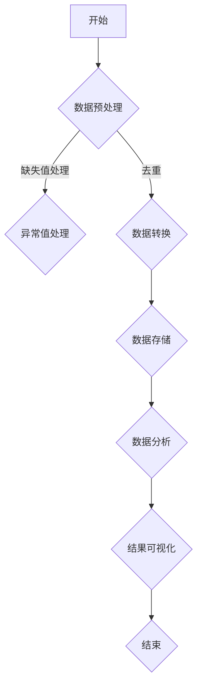

                 

### 第1章 问题背景与需求分析

#### **1.1 问题背景**

在当今信息化社会中，评测结果作为评价和指导工作的重要依据，其重要性不言而喻。然而，现有的评测结果交互式探索工具存在一些局限性，难以满足用户日益增长的需求。

首先，现有的工具大多注重结果展示，缺乏对结果的深度分析能力。用户往往需要花费大量时间来解读复杂的图表和数据，难以迅速找到关键信息。

其次，这些工具的功能相对单一，无法提供灵活的交互方式。用户在进行数据分析时，常常需要重复执行相同或类似的操作，工作效率低下。

最后，现有工具的可扩展性和兼容性较差，难以适应不同领域的评测需求。用户需要根据具体场景进行大量的定制化开发，增加了使用成本和难度。

#### **1.2 问题描述**

**评测结果可视化与探索的挑战**

1. **数据量庞大**：评测结果往往涉及大量数据，如何有效展示和解析这些数据是一个巨大的挑战。

2. **数据多样性**：不同类型的评测结果可能包含不同类型的数据，如数值、文本、图像等，如何统一处理和展示这些数据是另一个难点。

3. **用户需求多样化**：不同的用户对评测结果的分析需求各不相同，如何提供个性化的交互体验，满足用户的各种需求，是一个复杂的问题。

**用户对交互式探索工具的功能期望**

1. **高效的数据分析**：用户希望能够快速、准确地分析评测结果，找到关键信息。

2. **灵活的交互方式**：用户希望能够通过多种方式与评测结果进行交互，如筛选、排序、过滤等。

3. **自定义功能**：用户希望能够根据具体需求自定义分析方法和展示形式。

4. **可扩展性和兼容性**：用户希望工具能够兼容不同类型的数据和评测需求，方便扩展和升级。

#### **1.3 问题解决**

**交互式探索工具的核心目标**

为了解决上述问题，我们提出构建一款交互式探索工具，旨在提供以下功能：

1. **全面的数据分析能力**：通过引入先进的数据处理算法和可视化技术，实现对评测结果的全面分析和展示。

2. **灵活的交互方式**：提供多种交互方式，满足用户的个性化需求。

3. **高度的可定制性**：允许用户根据具体需求自定义分析方法和展示形式。

4. **良好的可扩展性和兼容性**：支持多种数据类型和评测需求，方便后续的扩展和升级。

**需要解决的问题与技术难点**

1. **数据处理与可视化技术**：如何高效处理大量数据，并提供直观、易用的可视化展示，是一个技术难点。

2. **交互设计**：如何设计出既灵活又高效的交互方式，满足用户的多样化需求，是一个设计难点。

3. **可扩展性与兼容性**：如何设计出一个既灵活又稳定，能够适应各种评测需求的技术架构，是一个架构难点。

#### **1.4 边界与外延**

**工具适用范围**

本工具主要面向需要大量数据处理和分析的领域，如数据分析、人工智能、数据科学等。同时，也可用于其他需要进行评测结果分析的领域。

**技术实现与性能考量**

在技术实现方面，我们将采用以下策略：

1. **高效的数据处理**：采用并行处理技术和优化算法，提高数据处理效率。

2. **优化的可视化**：使用先进的可视化库，如D3.js、Plotly等，提供高质量的可视化展示。

3. **灵活的交互设计**：采用响应式设计，确保在不同设备和屏幕尺寸上都能提供良好的交互体验。

4. **性能优化**：通过代码优化、内存管理、异步加载等技术，确保工具的运行效率和稳定性。

#### **1.5 核心概念与联系**

**交互式探索与可视化分析**

交互式探索与可视化分析是本工具的核心概念。交互式探索指的是用户可以通过与工具的交互，对评测结果进行实时分析和展示；而可视化分析则是将复杂的数据转化为直观的图形和图表，帮助用户快速理解和分析数据。

**相关技术原理与应用**

1. **数据处理与算法**：包括数据清洗、数据变换、特征提取等算法，用于对评测结果进行预处理和分析。

2. **可视化技术**：包括图表绘制、动画效果、交互操作等，用于将数据分析结果以可视化的形式呈现给用户。

3. **交互设计**：包括用户界面设计、交互逻辑设计、响应式设计等，用于确保用户与工具的交互体验。

**本章小结**

本章从问题背景、问题描述、问题解决等多个角度，详细分析了当前评测结果交互式探索工具面临的挑战和用户需求。通过提出交互式探索工具的核心目标和技术难点，为本工具的设计和实现奠定了基础。

---

**章节内容摘要：**

本章节首先介绍了当前评测结果交互式探索工具的局限性，包括数据处理能力不足、交互方式单一、可扩展性和兼容性差等问题。接着，明确了评测结果可视化与探索的挑战，以及用户对交互式探索工具的功能期望。为了解决这些问题，提出了交互式探索工具的核心目标和需要解决的技术难点。同时，阐述了工具的适用范围、技术实现策略以及与相关技术原理的联系。通过这些分析，为本章内容的设计和实现提供了明确的指导。

---

### **第2章 可视化分析技术**

#### **2.1 可视化分析的基本概念**

**可视化分析的定义**

可视化分析是指利用视觉元素，如图表、图形、色彩等，将复杂的数据和信息以直观、易于理解的方式呈现给用户。通过可视化分析，用户可以快速了解数据的整体趋势、分布特征以及关键信息，从而提高数据分析的效率和效果。

**可视化分析的目的和意义**

- **提高数据分析效率**：通过可视化方式，用户可以快速识别数据中的关键信息，避免繁琐的手动分析过程。
- **增强数据理解力**：视觉化的展示方式能够帮助用户更直观地理解数据，发现数据背后的规律和趋势。
- **促进沟通和协作**：可视化分析使得数据更容易被非技术人员理解，有助于促进团队内部的沟通和协作。

**可视化分析的应用领域**

- **商业智能**：用于业务数据的分析，如销售数据、市场份额等。
- **数据分析**：用于统计分析、趋势预测等。
- **数据科学**：用于复杂数据的处理和分析，如机器学习、人工智能等。
- **科学研究**：用于科学数据的研究和展示。

#### **2.2 可视化分析技术原理**

**数据可视化流程**

1. **数据预处理**：对原始数据进行清洗、转换和整合，使其适合可视化分析。
2. **数据编码**：将数据转换为视觉编码形式，如颜色、形状、大小等。
3. **数据呈现**：通过图表、图形等视觉形式，将数据呈现给用户。
4. **用户交互**：用户通过交互操作，如筛选、排序、过滤等，对数据进行分析和探索。

**主要的可视化方法与技术**

1. **图表类型**：
   - **柱状图**：用于显示各类别的数据分布。
   - **折线图**：用于显示数据的变化趋势。
   - **饼图**：用于显示各类别的占比。
   - **散点图**：用于显示数据点的分布情况。
   - **热力图**：用于显示数据的密集程度。

2. **可视化库**：
   - **D3.js**：用于创建高度交互的Web可视化。
   - **Plotly**：用于创建交互式图表。
   - **ECharts**：用于数据可视化的JavaScript库。

3. **交互技术**：
   - **筛选**：用户可以通过选择或输入条件，筛选出感兴趣的数据。
   - **过滤**：用户可以通过点击或拖动，过滤出特定的数据。
   - **排序**：用户可以通过点击或拖动，对数据进行排序。
   - **动画**：通过动画效果，展示数据的变化过程。

#### **2.3 可视化工具介绍**

**常见可视化工具及其特点**

1. **Tableau**：一款功能强大的商业智能工具，支持多种数据源和丰富的可视化类型。
2. **Power BI**：微软推出的商业智能工具，易于集成和扩展。
3. **QlikView**：一款灵活的数据发现和分析工具，支持实时数据分析。
4. **Grafana**：一款开源的数据监控和可视化工具，适用于监控和日志分析。

**选择可视化工具的考量因素**

1. **数据源兼容性**：工具应支持多种数据源，如数据库、文件、API等。
2. **可视化类型和效果**：工具应提供丰富的可视化类型和高质量的可视化效果。
3. **交互性和响应速度**：工具应具备良好的交互性，用户可以方便地与数据进行交互。
4. **扩展性和定制性**：工具应支持自定义图表和扩展功能，满足用户的特定需求。
5. **易用性和学习成本**：工具应易于使用，降低用户的学习成本。

**本章小结**

本章详细介绍了可视化分析的基本概念、技术原理以及常见可视化工具的特点。通过对数据可视化流程的解析，读者可以了解到可视化分析的核心技术和方法。同时，对常见可视化工具的介绍，为用户选择合适的工具提供了参考。这些内容为本章后续关于交互式探索工具的设计和实现奠定了基础。

---

**章节内容摘要：**

本章首先介绍了可视化分析的基本概念，包括其定义、目的和意义，以及应用领域。接着，详细解析了可视化分析的技术原理，包括数据可视化流程、主要可视化方法和技术，如图表类型、可视化库和交互技术。随后，介绍了常见可视化工具及其特点，包括Tableau、Power BI、QlikView和Grafana等，并提出了选择可视化工具的考量因素。通过这些内容，读者可以全面了解可视化分析的相关技术和工具，为后续构建交互式探索工具提供理论基础。

---

### **第3章 交互式探索技术**

#### **3.1 交互式探索的概念**

**交互式探索的定义**

交互式探索是指用户通过与其他系统和工具的交互，实现对数据和分析结果的探索和发现。在这个过程中，用户可以通过各种交互操作，如筛选、过滤、排序、钻取等，实时地对数据进行操作和分析，从而获得所需的信息和洞察。

**交互式探索与传统分析的区别**

传统数据分析通常是一种批处理的方式，用户需要预先定义分析流程和规则，然后对数据进行处理。而交互式探索则更加灵活，用户可以在分析过程中实时调整和修改分析参数，对结果进行即时反馈和调整。这种方式可以大大提高数据分析的效率，并使分析过程更加贴近用户的实际需求。

**交互式探索的优势**

1. **灵活性**：用户可以随时调整分析参数，探索不同的分析路径。
2. **实时性**：分析结果可以即时更新，用户可以实时获取最新的分析数据。
3. **用户友好**：通过直观的交互界面，降低用户的学习成本，提高数据分析的体验。
4. **高效性**：用户可以通过交互操作快速定位和分析关键数据，提高工作效率。

**交互式探索的应用场景**

- **数据分析**：用于实时监控业务数据，发现潜在问题和趋势。
- **数据挖掘**：用于探索大量数据，发现隐藏的规律和模式。
- **决策支持**：为管理层提供实时、直观的数据支持，辅助决策。
- **客户体验分析**：用于分析客户行为，优化产品和服务。

#### **3.2 交互式探索技术原理**

**交互式探索的核心功能**

交互式探索的核心功能包括但不限于：

1. **数据筛选**：用户可以通过输入关键词或条件，快速筛选出感兴趣的数据。
2. **过滤**：用户可以通过点击或拖动，过滤出特定的数据。
3. **排序**：用户可以通过点击列标题，对数据进行排序。
4. **钻取**：用户可以通过点击数据点或图表，深入分析特定数据。
5. **联动**：不同图表或维度之间的数据联动，实现跨维度的数据分析。

**交互式探索的技术实现**

1. **前端技术**：使用HTML、CSS和JavaScript等技术，构建交互式的用户界面。
2. **后端技术**：使用服务器端语言和框架，如Python、Node.js等，处理数据和分析请求。
3. **数据库技术**：使用数据库管理系统，如MySQL、PostgreSQL等，存储和管理数据。
4. **数据缓存**：使用Redis、Memcached等缓存技术，提高数据访问速度。
5. **API接口**：提供RESTful API接口，方便前端与后端的数据交互。

**交互式探索的关键技术**

1. **响应式设计**：确保在不同设备和屏幕尺寸上，用户都能获得良好的交互体验。
2. **异步处理**：通过异步编程和消息队列，提高系统的响应速度和并发能力。
3. **数据可视化**：使用可视化库，如D3.js、ECharts等，实现高效的数据展示和交互。
4. **数据分析算法**：引入各种数据分析算法，如聚类、分类、回归等，增强数据探索能力。

**交互式探索的架构设计**

交互式探索的架构设计主要包括以下模块：

1. **数据层**：负责数据的存储、管理和查询。
2. **服务层**：负责处理用户请求，执行数据分析操作。
3. **展示层**：负责数据的可视化展示和用户交互。
4. **控制层**：负责协调各个模块的交互，实现整体的功能。

#### **3.3 交互式探索案例分析**

**案例1：电商平台用户行为分析**

**应用背景**：某电商平台希望通过交互式探索工具，分析用户行为，优化购物体验。

**技术实现**：

- **数据层**：使用MySQL存储用户行为数据。
- **服务层**：使用Python Flask框架处理用户请求，执行数据分析操作。
- **展示层**：使用D3.js和ECharts实现数据的可视化展示。
- **控制层**：使用Vue.js构建交互式的用户界面。

**功能特点**：

- **数据筛选**：用户可以通过输入关键词或条件，快速筛选出感兴趣的用户行为数据。
- **过滤**：用户可以通过点击或拖动，过滤出特定的用户行为。
- **联动分析**：不同图表或维度之间的数据联动，实现跨维度的用户行为分析。
- **实时更新**：分析结果可以实时更新，用户可以实时获取最新的用户行为数据。

**案例2：金融风险监控**

**应用背景**：某金融公司希望通过交互式探索工具，监控金融市场的风险。

**技术实现**：

- **数据层**：使用Kafka实时收集金融市场数据。
- **服务层**：使用Spark处理实时数据，执行风险分析操作。
- **展示层**：使用ECharts实现数据的可视化展示。
- **控制层**：使用React构建交互式的用户界面。

**功能特点**：

- **实时监控**：通过实时数据流，监控金融市场的风险变化。
- **风险预警**：通过设置风险阈值，实时生成风险预警报告。
- **多维度分析**：通过多种图表和维度，全面分析金融市场风险。

**本章小结**

本章介绍了交互式探索的概念、技术原理和应用案例。通过详细解析交互式探索的核心功能和关键技术，读者可以了解到如何构建一个高效的交互式探索工具。案例的分析和应用，为读者提供了实际操作的参考，有助于更好地理解交互式探索的实践应用。

---

**章节内容摘要：**

本章首先介绍了交互式探索的概念，包括其定义、与传统分析的差异、优势和应用场景。接着，详细解析了交互式探索的技术原理，包括核心功能、技术实现和关键技术。通过介绍交互式探索的架构设计，读者可以了解到如何实现一个高效的交互式探索工具。最后，通过两个实际案例的分析，展示了交互式探索工具在不同领域的应用效果，为读者提供了实践操作的参考。这些内容为构建评测结果的交互式探索工具提供了重要的技术支撑。

---

### **第4章 数据处理与算法分析**

#### **4.1 数据处理技术**

**数据处理的基本概念**

数据处理是指对原始数据进行收集、整理、清洗、转换和存储等一系列操作，以便后续的数据分析和应用。数据处理是数据分析的重要基础，其质量直接影响数据分析的结果。

**数据处理的关键步骤**

1. **数据收集**：从各种数据源获取原始数据，如数据库、文件、API等。
2. **数据清洗**：去除数据中的噪声和错误，提高数据质量。主要包括去除重复数据、处理缺失值、纠正错误数据等。
3. **数据转换**：将数据转换为适合分析和存储的格式，如将不同数据源的数据进行统一编码、格式转换等。
4. **数据存储**：将处理后的数据存储到数据库或数据仓库中，以便后续的查询和分析。

**常见的数据清洗与预处理方法**

- **去重**：删除重复的数据记录，避免重复计算和分析。
- **缺失值处理**：填补缺失值或删除含有缺失值的记录，保证数据的一致性和完整性。
- **异常值检测**：检测并处理数据中的异常值，避免对分析结果造成误导。
- **数据标准化**：将不同规模和范围的数据进行标准化处理，使其具有可比性。
- **数据归一化**：将不同量纲的数据转换为相同量纲，便于计算和分析。

**数据处理工具与技术**

- **Python**：Python是一种广泛使用的编程语言，其强大的数据处理库，如Pandas、NumPy等，可以高效地进行数据处理和统计分析。
- **R语言**：R语言是一种专门用于统计分析和图形表示的语言，其丰富的数据处理和分析函数，如dplyr、ggplot2等，可以便捷地进行数据预处理和可视化分析。
- **Hadoop**：Hadoop是一种分布式数据处理平台，可以高效地处理大规模数据，其数据处理框架MapReduce可以处理复杂的计算任务。
- **Spark**：Spark是一种快速通用的数据处理引擎，其基于内存的计算能力，可以显著提高数据处理速度。

**数据处理案例**

以某电商平台用户行为数据为例，数据处理的关键步骤如下：

1. **数据收集**：从数据库中提取用户行为数据，包括用户ID、时间、点击行为等。
2. **数据清洗**：去除重复数据、填补缺失值、检测并处理异常值。
3. **数据转换**：将不同数据源的数据进行统一编码和格式转换，如将时间戳转换为日期格式。
4. **数据存储**：将清洗和转换后的数据存储到数据仓库中，便于后续分析和查询。

#### **4.2 算法原理讲解**

**算法mermaid流程图**

**算法原理的详细讲解**

1. **数据预处理**：数据预处理是数据处理的第一个步骤，其目的是将原始数据转换为适合分析的形式。主要包括数据清洗和数据转换。
2. **缺失值处理**：缺失值处理是处理数据中的缺失值，通常包括填补缺失值和删除含有缺失值的记录。填补缺失值的方法包括平均值填补、中值填补、众数填补等。
3. **异常值处理**：异常值处理是检测和处理数据中的异常值，通常包括统计学方法和可视化方法。统计学方法包括使用Z分数、IQR等指标检测异常值；可视化方法包括箱线图、散点图等。
4. **去重**：去重是删除重复的数据记录，避免重复计算和分析。
5. **数据转换**：数据转换是将不同数据源的数据进行统一编码和格式转换，如将时间戳转换为日期格式。
6. **数据存储**：将清洗和转换后的数据存储到数据仓库中，便于后续分析和查询。
7. **数据分析**：数据分析是使用各种统计分析方法对数据进行处理和分析，如回归分析、聚类分析、分类分析等。
8. **结果可视化**：结果可视化是将分析结果以图表、图形等形式展示给用户，使其更容易理解和分析。

**数学模型与公式**

在数据处理和算法分析中，常用的数学模型和公式包括：

1. **平均值**：平均值（mean）是数据集中各个数值的总和除以数据的个数。
   \[ \bar{x} = \frac{1}{n}\sum_{i=1}^{n} x_i \]
   其中，\( \bar{x} \) 是平均值，\( n \) 是数据的个数，\( x_i \) 是第 \( i \) 个数据值。

2. **标准差**：标准差（standard deviation）是衡量数据分散程度的一个指标。
   \[ \sigma = \sqrt{\frac{1}{n-1}\sum_{i=1}^{n}(x_i - \bar{x})^2} \]
   其中，\( \sigma \) 是标准差，\( \bar{x} \) 是平均值，\( n \) 是数据的个数，\( x_i \) 是第 \( i \) 个数据值。

3. **Z分数**：Z分数（Z-score）是衡量数据相对于平均值的离散程度。
   \[ Z = \frac{x - \bar{x}}{\sigma} \]
   其中，\( Z \) 是Z分数，\( x \) 是数据值，\( \bar{x} \) 是平均值，\( \sigma \) 是标准差。

**举例说明**

以某电商平台用户点击行为的平均值和标准差为例：

假设某天用户点击行为的次数数据为：[10, 15, 20, 25, 30]，计算其平均值和标准差。

- **平均值**：
  \[ \bar{x} = \frac{1}{5}\sum_{i=1}^{5} x_i = \frac{10 + 15 + 20 + 25 + 30}{5} = 20 \]
- **标准差**：
  \[ \sigma = \sqrt{\frac{1}{5-1}\sum_{i=1}^{5}(x_i - \bar{x})^2} = \sqrt{\frac{1}{4}\sum_{i=1}^{5}(x_i - 20)^2} \]
  \[ \sigma = \sqrt{\frac{1}{4}[(10 - 20)^2 + (15 - 20)^2 + (20 - 20)^2 + (25 - 20)^2 + (30 - 20)^2]} \]
  \[ \sigma = \sqrt{\frac{1}{4}[100 + 25 + 0 + 25 + 100]} \]
  \[ \sigma = \sqrt{\frac{1}{4}[250]} = \sqrt{62.5} \approx 7.91 \]

通过计算，我们得到了用户点击行为的平均值为20，标准差为7.91。这些指标可以帮助我们了解用户点击行为的数据分布和离散程度。

#### **4.3 数学模型与公式**

在数据处理和算法分析中，数学模型和公式是理解和应用各种算法的基础。以下是一些常用的数学模型和公式：

**线性回归模型**

线性回归模型是一种用于预测连续值的算法，其数学模型如下：

\[ y = \beta_0 + \beta_1x + \epsilon \]

其中，\( y \) 是因变量，\( x \) 是自变量，\( \beta_0 \) 和 \( \beta_1 \) 是回归系数，\( \epsilon \) 是误差项。

**逻辑回归模型**

逻辑回归模型是一种用于预测二分类结果的算法，其数学模型如下：

\[ P(y=1) = \frac{1}{1 + e^{-(\beta_0 + \beta_1x)}} \]

其中，\( y \) 是因变量，\( x \) 是自变量，\( \beta_0 \) 和 \( \beta_1 \) 是回归系数。

**聚类算法**

聚类算法是一种无监督学习方法，用于将数据划分为若干个类别。常用的聚类算法包括K-均值算法和层次聚类算法。

- **K-均值算法**：

  \[ \text{迭代过程：} \]

  1. 随机选择 \( K \) 个初始中心点。
  2. 计算每个数据点到各个中心点的距离，并将其分配到最近的中心点。
  3. 更新各个中心点的位置，使其成为所分配数据的均值。
  4. 重复步骤2和3，直到中心点的位置不再改变。

- **层次聚类算法**：

  \[ \text{迭代过程：} \]

  1. 将每个数据点视为一个初始簇。
  2. 计算相邻簇之间的距离，并将距离最近的簇合并。
  3. 重复步骤2，直到所有的数据点合并为一个簇。

**主成分分析（PCA）**

主成分分析是一种降维算法，其目的是通过提取数据的主要成分，降低数据维度，同时保留数据的主要信息。

\[ X' = \text{PCA}(X) \]

其中，\( X \) 是原始数据矩阵，\( X' \) 是转换后的数据矩阵。

**本章小结**

本章详细介绍了数据处理和算法分析的相关内容。首先，介绍了数据处理的基本概念、关键步骤和常见方法。接着，通过mermaid流程图和Python代码，详细讲解了数据处理算法的原理和实现。最后，介绍了常用的数学模型和公式，并通过具体的例子进行了说明。通过本章的学习，读者可以全面了解数据处理和算法分析的方法和技巧，为构建评测结果的交互式探索工具奠定基础。

---

**章节内容摘要：**

本章首先介绍了数据处理的基本概念、关键步骤和常见方法，包括数据收集、数据清洗、数据转换和数据存储。随后，通过mermaid流程图和Python代码，详细讲解了数据处理算法的原理和实现，包括缺失值处理、异常值处理、去重和数据转换。接着，介绍了常用的数学模型和公式，包括平均值、标准差、Z分数、线性回归模型、逻辑回归模型、聚类算法和主成分分析（PCA）。最后，通过具体例子进行了详细的说明。本章内容为数据处理和算法分析提供了全面的理论基础和实践指导，有助于构建评测结果的交互式探索工具。

