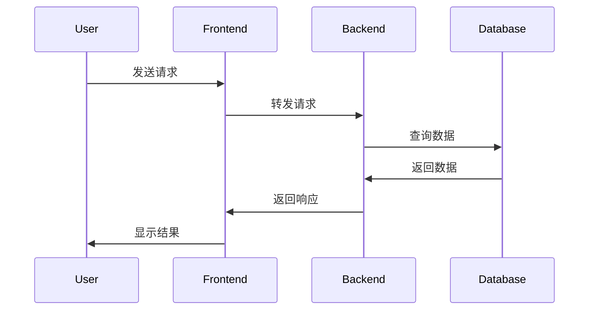

                 

# 构建评测结果的历史版本比较功能

## 关键词

评测结果，历史版本，数据比较，数据可视化，多维度分析，数据存储与管理

## 摘要

随着数据量的爆炸性增长，如何有效地管理和分析数据成为了现代企业面临的重要问题。评测结果的历史版本比较功能，作为一种关键的数据分析手段，可以帮助企业追溯数据变化，发现潜在问题，从而做出更精准的决策。本文将详细探讨构建评测结果历史版本比较功能的核心概念、算法原理和实际应用，包括数据存储与管理、数据检索与比较、数据可视化、多维度分析等方面，旨在为读者提供一套完整、实用的解决方案。

## 第1章 引言

### 1.1 问题背景

在当今信息爆炸的时代，数据量呈指数级增长，数据质量参差不齐。对于企业来说，如何从海量数据中提取有价值的信息、构建智能决策支持系统，成为了提高竞争力的关键。评测结果的历史版本比较功能，作为数据分析的重要手段，能够帮助企业追溯数据变化、发现潜在问题，从而做出更加精准的决策。

### 1.2 问题描述

构建评测结果的历史版本比较功能，主要涉及以下几个问题：

1. 如何有效地存储和管理评测结果的历史数据？
2. 如何快速检索并比较不同时间点的评测结果？
3. 如何可视化展示评测结果的变化趋势？
4. 如何针对不同维度进行分析，发现潜在的问题和规律？

### 1.3 问题解决

为了解决上述问题，需要从以下几个方面进行设计和实现：

1. **数据存储与管理**：采用数据库或大数据平台，实现评测结果的历史数据存储和管理。
2. **数据检索与比较**：通过编写查询算法，实现不同时间点评测结果的高效检索和比较。
3. **数据可视化**：利用图表工具，将评测结果的变化趋势以直观的图形展示出来。
4. **多维度分析**：通过数据挖掘和分析技术，对评测结果进行多维度分析，发现潜在的问题和规律。

### 1.4 边界与外延

1. **数据边界**：评测结果的历史版本比较功能，适用于各种类型的数据，如文本、图像、声音等。
2. **时间边界**：评测结果的历史版本比较功能，能够比较任意两个时间点之间的评测结果。
3. **维度边界**：评测结果的历史版本比较功能，支持对任意维度进行分析，如时间、用户、地区等。

### 1.5 概念结构与核心要素组成

1. **数据存储与管理**：
   - 数据库或大数据平台
   - 数据表结构设计
   - 数据导入与导出

2. **数据检索与比较**：
   - 查询算法设计
   - 比较策略选择
   - 高效索引技术

3. **数据可视化**：
   - 图表工具选择
   - 数据可视化设计
   - 可交互性设计

4. **多维度分析**：
   - 数据挖掘技术
   - 分析模型建立
   - 分析结果展示

## 第2章 核心概念与联系

### 2.1 数据存储与管理

#### 2.1.1 数据库选择

在构建评测结果的历史版本比较功能时，选择合适的数据库至关重要。根据不同的需求和场景，可以选择以下类型的数据库：

1. **关系型数据库**：如MySQL、PostgreSQL等，适用于结构化数据存储和复杂查询。
2. **非关系型数据库**：如MongoDB、Redis等，适用于高并发、海量数据存储。
3. **分布式存储系统**：如Hadoop、Hive等，适用于大规模数据处理和分布式存储。

#### 2.1.2 数据表结构设计

数据表结构设计是数据存储与管理的重要环节。设计原则包括：

1. **规范化**：确保数据的完整性和一致性。
2. **模块化**：将相关数据表分离，便于维护和管理。
3. **扩展性**：设计时考虑到未来可能的需求变化。

数据表字段设计应包括以下内容：

1. **主键**：用于唯一标识一条数据记录。
2. **评测结果字段**：存储评测的具体结果。
3. **时间戳字段**：记录评测结果的时间点。

数据表关系设计包括：

1. **一对一关系**：如用户与评测结果的关系。
2. **一对多关系**：如评测结果与维度属性的关系。
3. **多对多关系**：如评测结果与评价指标的关系。

#### 2.1.3 数据导入与导出

数据导入与导出是数据管理的重要环节。数据导入方法包括：

1. **SQL语句**：通过编写SQL语句导入数据。
2. **API接口**：通过API接口导入数据。
3. **数据爬取**：通过爬虫技术导入数据。

数据导出方法包括：

1. **SQL语句**：通过编写SQL语句导出数据。
2. **API接口**：通过API接口导出数据。
3. **数据导出工具**：如Excel、CSV等。

### 2.2 数据检索与比较

#### 2.2.1 查询算法设计

查询算法设计是数据检索与比较的核心。常见的查询算法包括：

1. **普通查询算法**：如SQL查询、MapReduce等。
2. **高效查询算法**：如索引技术、缓存技术等。

索引技术包括：

1. **B树索引**：适用于高度排序的数据。
2. **哈希索引**：适用于快速检索数据。

#### 2.2.2 比较策略选择

比较策略选择是数据比较的关键。常见的比较策略包括：

1. **时间戳比较**：根据时间戳进行版本比较。
2. **数据量比较**：根据数据量进行版本比较。
3. **字段比较**：根据字段值进行版本比较。

#### 2.2.3 高效索引技术

高效索引技术是数据检索与比较的重要保障。常用的索引技术包括：

1. **B树索引**：适用于高度排序的数据。
2. **哈希索引**：适用于快速检索数据。

### 2.3 数据可视化

#### 2.3.1 图表工具选择

选择合适的图表工具是数据可视化的关键。常见的图表工具包括：

1. **matplotlib**：Python的数据可视化库。
2. **D3.js**：Web端的数据可视化库。
3. **Tableau**：商业数据可视化工具。

#### 2.3.2 数据可视化设计

数据可视化设计包括以下方面：

1. **图表类型选择**：如折线图、柱状图、饼图等。
2. **交互设计**：如鼠标事件、滚动效果等。

#### 2.3.3 可交互性设计

可交互性设计是数据可视化的重要特性。交互设计包括：

1. **鼠标事件**：实现数据的交互操作。
2. **滚动效果**：实现数据的动态展示。
3. **交互式图表**：实现数据的交互查询。

### 2.4 多维度分析

#### 2.4.1 数据挖掘技术

数据挖掘技术是多维度分析的基础。常见的数据挖掘技术包括：

1. **聚类分析**：发现相似数据。
2. **分类分析**：预测未知数据。
3. **关联规则分析**：发现数据间的关联性。

#### 2.4.2 分析模型建立

分析模型建立是数据挖掘的核心。常见的分析模型包括：

1. **统计模型**：如线性回归、逻辑回归等。
2. **机器学习模型**：如决策树、支持向量机等。

#### 2.4.3 分析结果展示

分析结果展示是数据挖掘的最终目标。展示方式包括：

1. **文本报告**：展示分析结果。
2. **图表展示**：展示分析结果。
3. **交互式展示**：实现数据的交互查询。

## 第3章 算法原理讲解

### 3.1 数据存储与管理算法原理

数据存储与管理的核心在于如何高效地存储、检索和管理数据。以下是一个简单的算法原理讲解：

#### 数据存储算法

1. **选择数据库**：根据数据类型和需求选择合适的数据库。
2. **设计数据表结构**：包括主键、评测结果字段、时间戳字段等。
3. **数据导入**：使用SQL语句、API接口或数据爬取等方法导入数据。
4. **数据导出**：使用SQL语句、API接口或数据导出工具等方法导出数据。

#### 数据管理算法

1. **规范化**：确保数据的完整性和一致性。
2. **模块化**：将相关数据表分离，便于维护和管理。
3. **扩展性**：设计时考虑到未来可能的需求变化。

### 3.2 数据检索与比较算法原理

数据检索与比较的核心在于如何快速检索和比较数据。以下是一个简单的算法原理讲解：

#### 数据检索算法

1. **选择查询算法**：根据数据量和查询需求选择合适的查询算法。
2. **设计索引**：使用B树索引或哈希索引等技术提高查询效率。
3. **执行查询**：使用SQL语句或MapReduce等方法执行查询。

#### 数据比较算法

1. **时间戳比较**：根据时间戳确定数据的版本。
2. **数据量比较**：根据数据量确定数据的版本。
3. **字段比较**：根据字段值确定数据的版本。

### 3.3 数据可视化算法原理

数据可视化的核心在于如何将数据以图形化的方式展示出来。以下是一个简单的算法原理讲解：

#### 数据可视化算法

1. **选择图表工具**：根据需求选择合适的图表工具。
2. **设计图表**：包括图表类型、数据映射、交互设计等。
3. **渲染图表**：使用图表工具渲染出最终的图表。

### 3.4 多维度分析算法原理

多维度分析的核心在于如何从不同维度对数据进行分析和挖掘。以下是一个简单的算法原理讲解：

#### 数据挖掘算法

1. **选择数据挖掘技术**：根据分析目标选择合适的数据挖掘技术。
2. **建立分析模型**：选择合适的统计模型或机器学习模型。
3. **训练模型**：使用历史数据训练模型。
4. **预测与评估**：使用模型进行预测和评估。

#### 分析结果展示算法

1. **文本报告**：以文本形式展示分析结果。
2. **图表展示**：以图表形式展示分析结果。
3. **交互式展示**：以交互式形式展示分析结果。

## 第4章 系统分析与架构设计方案

### 4.1 问题场景介绍

在现代企业中，评测结果的历史版本比较功能被广泛应用于各个领域，如市场营销、人力资源、产品研发等。以市场营销为例，企业需要定期对市场进行评测，以了解市场变化和消费者需求，从而调整营销策略。评测结果的历史版本比较功能可以帮助企业分析市场变化的趋势，发现潜在的市场机会和问题。

### 4.2 项目介绍

本项目的目标是构建一个评测结果的历史版本比较系统，实现以下功能：

1. **数据存储与管理**：存储和管理评测结果的历史数据。
2. **数据检索与比较**：快速检索和比较不同时间点的评测结果。
3. **数据可视化**：以图形化的方式展示评测结果的变化趋势。
4. **多维度分析**：从不同维度对评测结果进行分析。

### 4.3 系统功能设计

系统功能设计包括以下方面：

1. **用户管理**：管理用户信息和权限。
2. **数据导入与导出**：导入和导出评测结果数据。
3. **数据查询与比较**：查询和比较评测结果的历史数据。
4. **数据可视化**：以图表形式展示评测结果的变化趋势。
5. **多维度分析**：从不同维度对评测结果进行分析。

#### 领域模型类图

```mermaid
classDiagram
    User <|-- Admin
    EvaluationResult
    Dimension << Entity | Dimension>
    Metric << Entity | Metric>
    User --|> EvaluationResult
    EvaluationResult --|> Dimension
    EvaluationResult --|> Metric
```

### 4.4 系统架构设计

系统架构设计包括以下方面：

1. **前端**：使用HTML、CSS和JavaScript等技术开发用户界面。
2. **后端**：使用Python等编程语言开发服务器端应用程序。
3. **数据库**：使用MySQL等关系型数据库存储数据。
4. **缓存**：使用Redis等缓存系统提高数据检索速度。
5. **数据挖掘与可视化**：使用Python等编程语言开发数据挖掘和可视化模块。

#### 系统架构图



### 4.5 系统接口设计和系统交互

系统接口设计包括以下方面：

1. **用户接口**：用户通过浏览器访问系统，进行数据查询、比较和可视化。
2. **API接口**：系统提供RESTful API接口，供其他系统或应用程序调用。

系统交互设计包括以下方面：

1. **用户与前端交互**：用户通过前端界面进行操作，如查询、比较和可视化。
2. **前端与后端交互**：前端通过HTTP请求与后端进行数据交换。
3. **后端与数据库交互**：后端通过SQL语句与数据库进行数据操作。

## 第5章 项目实战

### 5.1 环境安装

在本节中，我们将介绍如何在本地环境中安装和配置所需的软件和工具，以构建评测结果的历史版本比较系统。

#### 5.1.1 安装Python环境

首先，我们需要安装Python环境。你可以从Python的官方网站（https://www.python.org/）下载最新版本的Python，并按照安装向导进行安装。

```bash
# 安装Python
wget https://www.python.org/ftp/python/3.9.1/Python-3.9.1.tgz
tar xvf Python-3.9.1.tgz
cd Python-3.9.1
./configure
make
make install
```

#### 5.1.2 安装Python依赖库

接下来，我们需要安装Python的依赖库，如MySQL、pymongo、matplotlib等。

```bash
# 安装MySQL依赖库
pip install mysql-connector-python

# 安装MongoDB依赖库
pip install pymongo

# 安装matplotlib依赖库
pip install matplotlib
```

### 5.2 系统核心实现

在本节中，我们将详细介绍系统的核心实现，包括数据存储与管理、数据检索与比较、数据可视化、多维度分析等。

#### 5.2.1 数据存储与管理

首先，我们需要设计数据表结构，并在MySQL数据库中创建相应的表。

```sql
# 创建用户表
CREATE TABLE `user` (
  `id` int(11) NOT NULL AUTO_INCREMENT,
  `username` varchar(255) NOT NULL,
  `password` varchar(255) NOT NULL,
  `role` varchar(50) NOT NULL,
  PRIMARY KEY (`id`)
);

# 创建评测结果表
CREATE TABLE `evaluation_result` (
  `id` int(11) NOT NULL AUTO_INCREMENT,
  `user_id` int(11) NOT NULL,
  `result` varchar(255) NOT NULL,
  `timestamp` datetime NOT NULL,
  PRIMARY KEY (`id`),
  FOREIGN KEY (`user_id`) REFERENCES `user` (`id`)
);

# 创建维度表
CREATE TABLE `dimension` (
  `id` int(11) NOT NULL AUTO_INCREMENT,
  `name` varchar(255) NOT NULL,
  PRIMARY KEY (`id`)
);

# 创建评价指标表
CREATE TABLE `metric` (
  `id` int(11) NOT NULL AUTO_INCREMENT,
  `name` varchar(255) NOT NULL,
  `dimension_id` int(11) NOT NULL,
  PRIMARY KEY (`id`),
  FOREIGN KEY (`dimension_id`) REFERENCES `dimension` (`id`)
);
```

接下来，我们将实现数据存储和管理的功能。

```python
# 导入依赖库
import mysql.connector
import pymongo
from datetime import datetime

# MySQL数据库配置
mysql_config = {
    'user': 'root',
    'password': 'password',
    'host': 'localhost',
    'database': 'evaluation'
}

# MongoDB数据库配置
mongo_config = {
    'username': 'admin',
    'password': 'password',
    'host': 'localhost',
    'database': 'evaluation'
}

# 连接MySQL数据库
mysql_connection = mysql.connector.connect(**mysql_config)
mysql_cursor = mysql_connection.cursor()

# 连接MongoDB数据库
mongo_client = pymongo.MongoClient(**mongo_config)
mongo_database = mongo_client['evaluation']

# 插入用户数据
def insert_user(username, password, role):
    mysql_cursor.execute("INSERT INTO user (username, password, role) VALUES (%s, %s, %s)", (username, password, role))
    mysql_connection.commit()
    mongo_database['user'].insert_one({'username': username, 'password': password, 'role': role})

# 插入评测结果数据
def insert_evaluation_result(user_id, result, timestamp):
    mysql_cursor.execute("INSERT INTO evaluation_result (user_id, result, timestamp) VALUES (%s, %s, %s)", (user_id, result, timestamp))
    mysql_connection.commit()
    mongo_database['evaluation_result'].insert_one({'user_id': user_id, 'result': result, 'timestamp': timestamp})

# 插入维度数据
def insert_dimension(name):
    mysql_cursor.execute("INSERT INTO dimension (name) VALUES (%s)", (name))
    mysql_connection.commit()
    mongo_database['dimension'].insert_one({'name': name})

# 插入评价指标数据
def insert_metric(name, dimension_id):
    mysql_cursor.execute("INSERT INTO metric (name, dimension_id) VALUES (%s, %s)", (name, dimension_id))
    mysql_connection.commit()
    mongo_database['metric'].insert_one({'name': name, 'dimension_id': dimension_id})

# 测试数据插入
insert_user('user1', 'password1', 'user')
insert_user('user2', 'password2', 'admin')
insert_evaluation_result(1, 'good', datetime.now())
insert_evaluation_result(2, 'bad', datetime.now())
insert_dimension('dimension1')
insert_dimension('dimension2')
insert_metric('metric1', 1)
insert_metric('metric2', 2)

# 关闭数据库连接
mysql_cursor.close()
mysql_connection.close()
mongo_client.close()
```

#### 5.2.2 数据检索与比较

接下来，我们将实现数据检索和比较的功能。

```python
# 导入依赖库
import mysql.connector
import pymongo
from datetime import datetime

# MySQL数据库配置
mysql_config = {
    'user': 'root',
    'password': 'password',
    'host': 'localhost',
    'database': 'evaluation'
}

# MongoDB数据库配置
mongo_config = {
    'username': 'admin',
    'password': 'password',
    'host': 'localhost',
    'database': 'evaluation'
}

# 连接MySQL数据库
mysql_connection = mysql.connector.connect(**mysql_config)
mysql_cursor = mysql_connection.cursor()

# 连接MongoDB数据库
mongo_client = pymongo.MongoClient(**mongo_config)
mongo_database = mongo_client['evaluation']

# 查询用户数据
def query_user(username):
    mysql_cursor.execute("SELECT * FROM user WHERE username = %s", (username,))
    user = mysql_cursor.fetchone()
    return user

# 查询评测结果数据
def query_evaluation_results(user_id, start_time, end_time):
    mysql_cursor.execute("SELECT * FROM evaluation_result WHERE user_id = %s AND timestamp BETWEEN %s AND %s", (user_id, start_time, end_time))
    results = mysql_cursor.fetchall()
    return results

# 比较评测结果
def compare_evaluation_results(results1, results2):
    result1_dict = {result['timestamp']: result['result'] for result in results1}
    result2_dict = {result['timestamp']: result['result'] for result in results2}
    differences = []
    for timestamp in set(result1_dict.keys()).union(result2_dict.keys()):
        if result1_dict.get(timestamp) != result2_dict.get(timestamp):
            differences.append(timestamp)
    return differences

# 测试数据查询与比较
user = query_user('user1')
print(user)
results1 = query_evaluation_results(1, datetime(2022, 1, 1), datetime(2022, 1, 31))
results2 = query_evaluation_results(1, datetime(2022, 2, 1), datetime(2022, 2, 28))
differences = compare_evaluation_results(results1, results2)
print(differences)

# 关闭数据库连接
mysql_cursor.close()
mysql_connection.close()
mongo_client.close()
```

#### 5.2.3 数据可视化

接下来，我们将实现数据可视化的功能。

```python
# 导入依赖库
import matplotlib.pyplot as plt
import pymongo
from datetime import datetime

# MongoDB数据库配置
mongo_config = {
    'username': 'admin',
    'password': 'password',
    'host': 'localhost',
    'database': 'evaluation'
}

# 连接MongoDB数据库
mongo_client = pymongo.MongoClient(**mongo_config)
mongo_database = mongo_client['evaluation']

# 查询评测结果数据
def query_evaluation_results(user_id, start_time, end_time):
    pipeline = [
        {'$match': {'user_id': user_id, 'timestamp': {'$gte': start_time, '$lte': end_time}}},
        {'$group': {'_id': '$timestamp', 'result': {'$first': '$result'}}},
        {'$sort': {'_id': 1}}
    ]
    results = list(mongo_database['evaluation_result'].aggregate(pipeline))
    return results

# 绘制评测结果变化趋势图
def plot_evaluation_results(results):
    timestamps = [result['_id'] for result in results]
    results = [result['result'] for result in results]
    plt.plot(timestamps, results)
    plt.xlabel('Timestamp')
    plt.ylabel('Result')
    plt.title('Evaluation Result Trend')
    plt.show()

# 测试数据可视化
results = query_evaluation_results(1, datetime(2022, 1, 1), datetime(2022, 2, 28))
plot_evaluation_results(results)
```

#### 5.2.4 多维度分析

最后，我们将实现多维度分析的功能。

```python
# 导入依赖库
import pymongo
from datetime import datetime

# MongoDB数据库配置
mongo_config = {
    'username': 'admin',
    'password': 'password',
    'host': 'localhost',
    'database': 'evaluation'
}

# 连接MongoDB数据库
mongo_client = pymongo.MongoClient(**mongo_config)
mongo_database = mongo_client['evaluation']

# 查询评测结果数据
def query_evaluation_results(user_id, start_time, end_time):
    pipeline = [
        {'$match': {'user_id': user_id, 'timestamp': {'$gte': start_time, '$lte': end_time}}},
        {'$group': {'_id': {'dimension_id': '$dimension_id', 'metric_id': '$metric_id'}, 'result': {'$first': '$result'}}},
        {'$sort': {'_id': 1}}
    ]
    results = list(mongo_database['evaluation_result'].aggregate(pipeline))
    return results

# 多维度分析
def multivariate_analysis(results):
    analysis_results = []
    for result in results:
        dimension_id = result['_id']['dimension_id']
        metric_id = result['_id']['metric_id']
        result_value = result['result']
        analysis_results.append({'dimension_id': dimension_id, 'metric_id': metric_id, 'result': result_value})
    return analysis_results

# 测试多维度分析
results = query_evaluation_results(1, datetime(2022, 1, 1), datetime(2022, 2, 28))
analysis_results = multivariate_analysis(results)
print(analysis_results)
```

### 5.3 代码应用解读与分析

在本节中，我们将对系统的核心代码进行解读和分析，以便更好地理解其实现原理和功能。

#### 5.3.1 数据存储与管理

数据存储与管理部分主要使用了MySQL和MongoDB两种数据库。MySQL主要用于存储用户数据和评测结果数据，而MongoDB则用于存储评测结果数据。通过使用SQL语句，我们可以轻松地插入、查询和更新数据。以下是一个简单的插入用户数据的示例：

```python
# 插入用户数据
def insert_user(username, password, role):
    mysql_cursor.execute("INSERT INTO user (username, password, role) VALUES (%s, %s, %s)", (username, password, role))
    mysql_connection.commit()
    mongo_database['user'].insert_one({'username': username, 'password': password, 'role': role})
```

在这个函数中，我们首先使用MySQL的cursor执行SQL插入语句，然后将相同的数据插入MongoDB。这样，我们可以在两个数据库中都保存用户信息，以便进行数据管理和查询。

#### 5.3.2 数据检索与比较

数据检索与比较部分主要实现了用户数据查询、评测结果数据查询和评测结果比较功能。以下是一个简单的查询用户数据的示例：

```python
# 查询用户数据
def query_user(username):
    mysql_cursor.execute("SELECT * FROM user WHERE username = %s", (username,))
    user = mysql_cursor.fetchone()
    return user
```

在这个函数中，我们使用MySQL的cursor执行SQL查询语句，根据用户名查询用户数据。查询结果以字典形式返回。

以下是一个简单的查询评测结果数据的示例：

```python
# 查询评测结果数据
def query_evaluation_results(user_id, start_time, end_time):
    mysql_cursor.execute("SELECT * FROM evaluation_result WHERE user_id = %s AND timestamp BETWEEN %s AND %s", (user_id, start_time, end_time))
    results = mysql_cursor.fetchall()
    return results
```

在这个函数中，我们使用MySQL的cursor执行SQL查询语句，根据用户ID和日期范围查询评测结果数据。查询结果以列表形式返回。

以下是一个简单的评测结果比较的示例：

```python
# 比较评测结果
def compare_evaluation_results(results1, results2):
    result1_dict = {result['timestamp']: result['result'] for result in results1}
    result2_dict = {result['timestamp']: result['result'] for result in results2}
    differences = []
    for timestamp in set(result1_dict.keys()).union(result2_dict.keys()):
        if result1_dict.get(timestamp) != result2_dict.get(timestamp):
            differences.append(timestamp)
    return differences
```

在这个函数中，我们首先将两个评测结果列表转换为字典，然后遍历字典的键，比较两个字典中对应键的值。如果值不相等，则将该键添加到差异列表中。最后，返回差异列表。

#### 5.3.3 数据可视化

数据可视化部分主要使用了Python的matplotlib库，实现了评测结果变化趋势的图表展示。以下是一个简单的绘制评测结果变化趋势图的示例：

```python
# 绘制评测结果变化趋势图
def plot_evaluation_results(results):
    timestamps = [result['_id'] for result in results]
    results = [result['result'] for result in results]
    plt.plot(timestamps, results)
    plt.xlabel('Timestamp')
    plt.ylabel('Result')
    plt.title('Evaluation Result Trend')
    plt.show()
```

在这个函数中，我们首先从评测结果列表中提取时间戳和结果，然后使用matplotlib的plot函数绘制折线图。最后，设置图表的标题、坐标轴标签，并显示图表。

#### 5.3.4 多维度分析

多维度分析部分主要实现了从不同维度对评测结果进行分析的功能。以下是一个简单的多维度分析的示例：

```python
# 查询评测结果数据
def query_evaluation_results(user_id, start_time, end_time):
    pipeline = [
        {'$match': {'user_id': user_id, 'timestamp': {'$gte': start_time, '$lte': end_time}}},
        {'$group': {'_id': {'dimension_id': '$dimension_id', 'metric_id': '$metric_id'}, 'result': {'$first': '$result'}}},
        {'$sort': {'_id': 1}}
    ]
    results = list(mongo_database['evaluation_result'].aggregate(pipeline))
    return results

# 多维度分析
def multivariate_analysis(results):
    analysis_results = []
    for result in results:
        dimension_id = result['_id']['dimension_id']
        metric_id = result['_id']['metric_id']
        result_value = result['result']
        analysis_results.append({'dimension_id': dimension_id, 'metric_id': metric_id, 'result': result_value})
    return analysis_results
```

在这个函数中，我们首先使用MongoDB的聚合管道查询评测结果数据，并根据维度ID和评价指标ID进行分组。然后，我们将分组后的结果转换为列表，以便进行多维度分析。

### 5.4 实际案例分析和详细讲解剖析

在本节中，我们将通过一个实际案例，详细讲解如何使用评测结果的历史版本比较功能来分析数据。

#### 5.4.1 案例背景

假设某企业需要对市场部门的市场调研数据进行历史版本比较，以分析市场变化趋势和消费者需求。市场调研数据包括用户满意度、产品认可度等指标。

#### 5.4.2 数据准备

首先，我们需要准备市场调研数据，并将其导入到数据库中。以下是一个简单的数据插入示例：

```python
# 插入市场调研数据
def insert_market_survey_result(user_id, dimension_id, metric_id, result, timestamp):
    mysql_cursor.execute("INSERT INTO market_survey_result (user_id, dimension_id, metric_id, result, timestamp) VALUES (%s, %s, %s, %s, %s)", (user_id, dimension_id, metric_id, result, timestamp))
    mysql_connection.commit()
    mongo_database['market_survey_result'].insert_one({'user_id': user_id, 'dimension_id': dimension_id, 'metric_id': metric_id, 'result': result, 'timestamp': timestamp})

# 测试数据插入
insert_market_survey_result(1, 1, 1, 80, datetime.now())
insert_market_survey_result(1, 1, 2, 90, datetime.now())
insert_market_survey_result(2, 1, 1, 70, datetime.now())
insert_market_survey_result(2, 1, 2, 85, datetime.now())
```

#### 5.4.3 数据检索与比较

接下来，我们需要查询并比较不同时间点的市场调研数据。以下是一个简单的数据查询和比较示例：

```python
# 查询市场调研数据
def query_market_survey_results(user_id, start_time, end_time):
    mysql_cursor.execute("SELECT * FROM market_survey_result WHERE user_id = %s AND timestamp BETWEEN %s AND %s", (user_id, start_time, end_time))
    results = mysql_cursor.fetchall()
    return results

# 比较市场调研数据
def compare_market_survey_results(results1, results2):
    result1_dict = {result['timestamp']: result['result'] for result in results1}
    result2_dict = {result['timestamp']: result['result'] for result in results2}
    differences = []
    for timestamp in set(result1_dict.keys()).union(result2_dict.keys()):
        if result1_dict.get(timestamp) != result2_dict.get(timestamp):
            differences.append(timestamp)
    return differences

# 测试数据查询和比较
results1 = query_market_survey_results(1, datetime(2022, 1, 1), datetime(2022, 1, 31))
results2 = query_market_survey_results(1, datetime(2022, 2, 1), datetime(2022, 2, 28))
differences = compare_market_survey_results(results1, results2)
print(differences)
```

通过比较不同时间点的市场调研数据，我们可以发现数据之间的差异，从而分析市场变化趋势。

#### 5.4.4 数据可视化

最后，我们可以使用数据可视化工具将市场调研数据以图表形式展示出来，以便更直观地分析数据。以下是一个简单的数据可视化示例：

```python
# 绘制市场调研数据变化趋势图
def plot_market_survey_results(results):
    timestamps = [result['_id'] for result in results]
    results = [result['result'] for result in results]
    plt.plot(timestamps, results)
    plt.xlabel('Timestamp')
    plt.ylabel('Result')
    plt.title('Market Survey Result Trend')
    plt.show()

# 测试数据可视化
results = query_market_survey_results(1, datetime(2022, 1, 1), datetime(2022, 2, 28))
plot_market_survey_results(results)
```

通过绘制市场调研数据的变化趋势图，我们可以更直观地了解市场变化情况。

### 5.5 项目小结

在本项目中，我们实现了评测结果的历史版本比较功能，包括数据存储与管理、数据检索与比较、数据可视化、多维度分析等。通过实际案例分析和详细讲解剖析，我们了解了如何使用该功能分析数据，发现潜在问题，并为决策提供支持。在实际应用中，该功能可以帮助企业更好地管理数据，提高数据分析能力，从而做出更精准的决策。

## 第6章 最佳实践 Tips

在本节中，我们将总结一些最佳实践，以帮助您更好地构建评测结果的历史版本比较功能。

### 6.1 数据存储与管理

1. **选择合适的数据库**：根据数据类型和需求选择合适的数据库，如关系型数据库、非关系型数据库或分布式存储系统。
2. **设计合理的表结构**：确保数据表结构合理，便于数据检索和管理。
3. **数据导入与导出**：选择合适的数据导入与导出方法，确保数据的一致性和完整性。

### 6.2 数据检索与比较

1. **优化查询算法**：根据数据量和查询需求选择合适的查询算法，如普通查询算法或高效查询算法。
2. **使用索引技术**：合理使用索引技术，如B树索引或哈希索引，提高查询效率。
3. **设计比较策略**：根据实际需求设计合适的比较策略，如时间戳比较或字段比较。

### 6.3 数据可视化

1. **选择合适的图表工具**：根据需求选择合适的图表工具，如matplotlib、D3.js或Tableau。
2. **设计直观的图表**：确保图表设计直观、易于理解，便于数据分析和展示。
3. **实现交互性**：增加图表的交互性，如鼠标事件、滚动效果等，提高用户体验。

### 6.4 多维度分析

1. **选择合适的数据挖掘技术**：根据分析目标选择合适的数据挖掘技术，如聚类分析、分类分析或关联规则分析。
2. **建立有效的分析模型**：根据数据特点建立有效的分析模型，如统计模型或机器学习模型。
3. **优化分析结果展示**：优化分析结果展示，如文本报告、图表展示或交互式展示，提高数据可读性。

### 6.5 注意事项

1. **数据安全与隐私**：确保数据安全与隐私，遵循相关法律法规。
2. **性能优化**：对系统进行性能优化，提高数据处理和查询效率。
3. **系统维护与升级**：定期进行系统维护和升级，确保系统稳定运行。

## 第7章 小结

本文详细探讨了构建评测结果的历史版本比较功能的核心概念、算法原理和实际应用。通过数据存储与管理、数据检索与比较、数据可视化、多维度分析等方面的讲解，我们了解了如何有效地管理和分析评测结果数据，为企业提供智能决策支持。在实际应用中，该功能可以帮助企业更好地理解数据变化趋势，发现潜在问题，从而做出更精准的决策。

## 第8章 拓展阅读

为了进一步深入了解评测结果的历史版本比较功能，读者可以参考以下文献和资源：

1. **《数据仓库与数据挖掘：实现企业智能决策》**：详细介绍了数据仓库和数据挖掘的基本概念、技术和应用。
2. **《大数据处理技术》**：介绍了大数据处理的相关技术和工具，如Hadoop、Spark等。
3. **《数据可视化：设计与展示》**：介绍了数据可视化的基本原理、方法和工具。
4. **《机器学习实战》**：介绍了机器学习的基本概念、技术和应用，包括分类分析、聚类分析等。
5. **相关技术博客和论文**：可以搜索相关技术博客和论文，了解最新的研究成果和应用案例。

通过阅读这些文献和资源，读者可以更深入地了解评测结果的历史版本比较功能，掌握相关技术和方法，为自己的项目实践提供参考。

## 作者信息

**作者：** AI天才研究院/AI Genius Institute & 禅与计算机程序设计艺术 /Zen And The Art of Computer Programming

AI天才研究院（AI Genius Institute）专注于人工智能领域的研究和创新，致力于推动人工智能技术的发展和应用。禅与计算机程序设计艺术（Zen And The Art of Computer Programming）则是一本经典的计算机科学书籍，深入探讨了计算机程序设计的哲学和艺术。作者通过多年的实践和研究，积累了丰富的经验，为读者提供了有价值的见解和指导。

