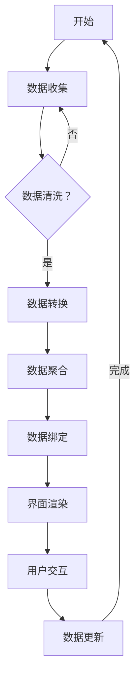

                 

### 摘要

本文将深入探讨如何构建评测结果的可视化仪表盘。首先，我们介绍了可视化仪表盘的背景及其重要性，指出了其在数据展示、问题分析和决策支持等方面的关键作用。接着，我们详细讲解了仪表盘的基础知识，包括可视化技术概述、仪表盘设计原则和常见可视化图表的介绍。为了确保数据的准确性和可靠性，我们讨论了数据预处理的重要性，并详细阐述了数据清洗、转换和探索性分析的方法。在核心概念与联系部分，我们介绍了仪表盘构建所需的核心概念，并通过表格和Mermaid实体关系图对比了概念属性特征。算法原理讲解部分，我们使用Mermaid流程图和Python源代码详细阐述了可视化仪表盘的构建过程，并使用latex格式讲解了相关的数学模型和公式。系统分析与架构设计方案部分，我们介绍了问题场景、项目背景、系统功能设计、系统架构设计、系统接口设计和系统交互。项目实战部分，我们详细描述了环境安装、系统核心实现、代码应用解读和实际案例分析。最后，我们提供了最佳实践 tips、小结、注意事项和拓展阅读，帮助读者更深入地理解和应用仪表盘构建技术。

### 引言

在现代数据驱动的时代，数据的获取和处理已经成为企业、研究机构和各种组织的重要任务。然而，仅仅拥有大量的数据并不足以提供有用的洞察和决策支持。关键在于如何有效地展示和分析这些数据，以便用户能够快速理解并作出明智的决策。在这里，可视化仪表盘作为一种强大的工具，发挥了至关重要的作用。

#### 问题背景

随着信息技术的飞速发展，企业、政府机构和研究机构每天都会产生大量的数据。这些数据包括销售数据、用户行为数据、财务数据、项目进度数据等。如何从这些海量数据中提取有价值的信息，是许多组织和研究人员面临的挑战。传统的数据分析方法往往依赖于复杂的报表和图表，用户需要花费大量时间来解读这些信息，这极大地限制了数据的应用效果。

#### 评测结果可视化的重要性

评测结果的可视化能够将复杂的数据以直观、易理解的方式展示给用户。可视化仪表盘不仅可以帮助用户快速识别数据中的关键趋势和异常情况，还可以通过图形化的方式将数据的关联性和关系呈现出来，使得数据分析更加高效和准确。以下是一些可视化仪表盘在各个领域的应用场景：

1. **商业智能**：通过可视化仪表盘，企业可以实时监控销售数据、客户行为和财务状况，从而迅速做出市场调整和战略决策。
2. **项目管理**：项目经理可以通过可视化仪表盘监控项目进度、资源分配和风险情况，确保项目按计划进行。
3. **科研分析**：研究人员可以使用可视化仪表盘展示实验数据、统计分析和结果，便于同事和上级审查和决策。
4. **健康医疗**：医疗专业人士可以通过可视化仪表盘监控患者数据、诊断结果和治疗进度，提高医疗决策的准确性和效率。

#### 问题解决、边界与外延、概念结构与核心要素组成

构建一个有效的可视化仪表盘不仅需要掌握数据可视化的技术，还需要考虑用户体验、数据分析能力和系统架构设计等多方面的因素。以下是构建可视化仪表盘的一些关键步骤和要素：

1. **问题定义与需求分析**：明确仪表盘的应用场景和目标用户，确定需要展示的数据类型和分析指标。
2. **数据预处理**：确保数据的质量和一致性，进行数据清洗、转换和探索性分析。
3. **核心概念与联系**：理解并掌握仪表盘构建所需的核心概念，如数据可视化技术、图表类型、交互设计等。
4. **系统架构设计**：根据需求设计系统的功能模块和接口，选择合适的技术和工具。
5. **用户界面设计**：设计直观、易操作的仪表盘界面，提高用户的体验和满意度。
6. **性能优化与维护**：确保仪表盘在高并发和数据量大情况下仍能稳定运行，并进行定期维护和更新。

通过上述步骤和要素的有机结合，我们可以构建一个功能完善、性能优秀且用户体验卓越的可视化仪表盘，从而更好地支持数据分析和决策制定。

### 可视化仪表盘基础

在构建一个有效的可视化仪表盘之前，我们需要深入了解可视化技术、仪表盘设计原则以及常见的可视化图表。这些基础知识不仅能够帮助我们选择合适的技术和工具，还能确保最终产品的高效性和易用性。

#### 可视化技术概述

可视化技术是指通过图形、图像和其他视觉元素将数据转化为直观的视觉表现形式，以帮助用户更好地理解和分析数据。常见的可视化技术包括：

1. **图表类型**：常见的图表类型包括柱状图、折线图、饼图、散点图、雷达图等，每种图表类型都有其特定的应用场景和优势。
2. **交互设计**：交互设计是指用户与仪表盘之间的互动方式，如滚动、缩放、筛选等。交互设计能够提升用户的体验和操作便捷性。
3. **动态可视化**：动态可视化是指图表和数据随时间、事件或用户操作而动态变化。这能够帮助用户实时了解数据的变化趋势和关系。

#### 仪表盘设计原则

一个优秀的仪表盘设计需要遵循以下几个原则：

1. **清晰性**：仪表盘应简洁明了，避免过多的装饰和冗余信息，确保用户能够快速获取关键数据。
2. **一致性**：仪表盘的设计元素应保持一致性，包括颜色、字体、图表样式等，以提高用户的认知和操作效率。
3. **层次性**：仪表盘应具备清晰的层次结构，重要数据和图表突出显示，次要信息和背景信息合理布局。
4. **可操作性**：仪表盘应提供便捷的操作方式，如筛选、排序、过滤等，以支持用户自定义数据展示。
5. **可扩展性**：仪表盘应具有良好的扩展性，能够根据用户需求和业务变化进行功能扩展和调整。

#### 常见可视化图表介绍

以下是几种常见可视化图表及其适用场景：

1. **柱状图**：柱状图用于比较不同类别的数据值，适合展示各类别之间的数量关系。例如，销售数据、市场份额等。
2. **折线图**：折线图用于展示数据随时间的变化趋势，适合分析时间序列数据。例如，股票价格、温度变化等。
3. **饼图**：饼图用于展示整体数据中各部分的比例关系，适合展示组成部分的占比情况。例如，预算分配、用户分布等。
4. **散点图**：散点图用于展示两个或多个变量之间的关系，适合进行相关性分析和趋势预测。例如，人口密度与GDP、身高与体重等。
5. **雷达图**：雷达图用于展示多维数据中的各指标表现，适合对多个维度进行综合评价。例如，产品性能评估、员工绩效评估等。

通过掌握这些基础知识，我们可以为构建一个高效、易用且具有吸引力的可视化仪表盘奠定坚实的基础。接下来，我们将进一步讨论数据预处理的重要性和方法。

### 数据预处理

在构建可视化仪表盘的过程中，数据预处理是一个至关重要的环节。它不仅影响仪表盘的准确性和可靠性，还直接影响用户体验和决策支持效果。数据预处理主要包括数据清洗、转换和探索性分析。以下是每个步骤的详细解释。

#### 数据来源

数据来源可以是多种多样的，包括数据库、数据仓库、API接口、文件系统等。不同来源的数据格式和内容可能存在较大差异，因此在构建仪表盘之前，我们需要明确数据来源，确保数据的可获取性和一致性。

#### 数据清洗

数据清洗是数据预处理的首要任务，目的是消除数据中的错误、缺失和不一致。以下是一些常见的数据清洗方法：

1. **错误值处理**：识别并删除或替换数据中的错误值，如异常值、重复记录等。
2. **缺失值处理**：根据具体需求，对缺失值进行填充或删除。常用的填充方法包括均值填充、中位数填充和插值法等。
3. **数据格式统一**：将不同来源的数据格式进行统一，例如日期格式、数字格式等，以确保数据的兼容性和一致性。
4. **去重**：删除重复的数据记录，避免重复计算和错误分析。

#### 数据转换

数据转换是将原始数据转换为适合仪表盘展示的格式。以下是一些常见的数据转换方法：

1. **数据转换**：将数据从一种格式转换为另一种格式，例如将文本数据转换为数值数据、将不同日期格式转换为统一格式等。
2. **数据标准化**：通过对数据进行标准化处理，使得不同尺度的数据在同一维度上进行比较，如Z-score标准化、Min-Max标准化等。
3. **数据聚合**：将原始数据按特定维度进行聚合，例如按时间、地区、产品等分类汇总数据，以便于仪表盘展示。

#### 数据探索性分析

数据探索性分析是对数据的基本特性和规律进行初步分析，以发现潜在问题和趋势。以下是一些常用的探索性分析方法：

1. **统计描述**：计算数据的均值、中位数、标准差、最大值、最小值等基本统计量，了解数据的基本分布情况。
2. **分布可视化**：通过柱状图、饼图等图表展示数据分布情况，发现异常值和分布特点。
3. **相关性分析**：计算各变量之间的相关性，通过散点图、相关性矩阵等展示变量之间的关系，为后续分析提供参考。
4. **趋势分析**：通过时间序列分析，展示数据随时间的变化趋势，发现周期性、趋势性等特征。

通过数据清洗、转换和探索性分析，我们能够确保数据的质量和一致性，为后续的仪表盘构建提供可靠的数据基础。下一节将介绍仪表盘构建所需的核心概念和其属性特征对比。

### 核心概念与联系

在构建评测结果的可视化仪表盘过程中，我们需要掌握一系列核心概念，这些概念构成了仪表盘的基石，包括数据可视化技术、图表类型、交互设计和数据绑定等。理解这些概念及其相互联系，能够帮助我们构建功能完备、用户体验出色的仪表盘。

#### 数据可视化技术

数据可视化技术是将数据转换为视觉表现形式的方法，旨在帮助用户更好地理解数据。以下是几种常见的数据可视化技术：

1. **图表类型**：常见的图表类型包括柱状图、折线图、饼图、散点图和雷达图等。每种图表都有其独特的特点和适用场景。例如，柱状图适用于比较不同类别的数据值，而折线图适用于展示数据随时间的变化趋势。
2. **交互设计**：交互设计是用户与仪表盘之间的互动方式，如筛选、排序、过滤等。有效的交互设计能够提高用户的使用体验和操作便捷性。
3. **动态可视化**：动态可视化是指图表和数据随时间、事件或用户操作而动态变化。这有助于用户实时了解数据的变化趋势和关系。

#### 图表类型及其属性特征对比

以下是几种常见图表类型的属性特征对比表格，帮助读者了解它们在数据展示中的优缺点：

| 图表类型 | 优点 | 缺点 | 适用场景 |
| --- | --- | --- | --- |
| 柱状图 | 易于比较不同类别的数据值 | 不适合展示时间序列数据 | 销售数据、市场份额等 |
| 折线图 | 易于展示数据随时间的变化趋势 | 不适合展示多维数据 | 股票价格、温度变化等 |
| 饼图 | 易于展示整体数据中各部分的比例关系 | 只能展示单一维度的数据 | 预算分配、用户分布等 |
| 散点图 | 易于展示两个或多个变量之间的关系 | 不适合展示复杂的关系 | 人口密度与GDP、身高与体重等 |
| 雷达图 | 易于展示多维数据中的各指标表现 | 难以识别多维数据之间的关系 | 产品性能评估、员工绩效评估等 |

#### ER实体关系图

为了更好地理解仪表盘中的数据结构和关系，我们可以使用Mermaid绘制ER实体关系图。以下是ER实体关系图的示例：

```mermaid
erDiagram
  Product ||--|{ SalesData }|-- User : purchased
  Product ||--|{ Review }|-- User : reviewed
  User ||--|{ Rating }|-- Review : given
```

在这个ER图中，`Product`、`SalesData`、`Review`和`User`是实体，它们之间的关系通过连线表示。`Product`与`SalesData`和`Review`之间存在一对多关系，而`User`与`Review`和`Rating`之间存在多对一关系。

#### 概念联系

数据可视化技术、图表类型和交互设计之间有着紧密的联系。数据可视化技术提供了将数据转换为视觉形式的方法，图表类型决定了数据的展示形式和视觉效果，而交互设计则增强了用户与仪表盘的互动。数据绑定是实现图表和交互设计的关键，它确保了数据的实时更新和动态变化。

通过理解这些核心概念及其相互关系，我们可以构建一个功能强大、用户友好的可视化仪表盘，为数据分析提供有效的支持。

### 算法原理讲解

在构建评测结果的可视化仪表盘过程中，理解算法原理是至关重要的一步。这一部分将详细讲解可视化仪表盘构建的核心算法原理，包括使用Mermaid绘制的算法流程图、Python源代码和相关的数学模型及公式。通过这些内容，我们将帮助读者深入理解可视化仪表盘的工作机制。

#### Mermaid算法流程图

首先，我们使用Mermaid语言绘制一个简单的算法流程图，以展示仪表盘构建的基本步骤：



在这个流程图中，我们定义了从数据收集到界面渲染再到用户交互的完整过程。以下是每个步骤的详细解释：

1. **数据收集**：从各种数据源（如数据库、API、文件等）收集数据。
2. **数据清洗**：检查数据是否存在错误、缺失或不一致，并进行相应的处理。
3. **数据转换**：将数据转换为适合可视化展示的格式，如标准化、聚合等。
4. **数据聚合**：根据需求对数据进行分类、汇总等处理，以简化数据结构。
5. **数据绑定**：将处理后的数据与可视化组件绑定，实现数据的实时展示。
6. **界面渲染**：使用可视化库将数据渲染到用户界面，以图形化的方式展示数据。
7. **用户交互**：提供交互功能，如筛选、排序、过滤等，以支持用户的个性化操作。
8. **数据更新**：根据用户操作实时更新数据和图表，以保持数据的实时性和准确性。

#### Python源代码与数学模型

接下来，我们将使用Python源代码详细阐述上述算法的步骤，并结合latex格式展示相关的数学模型和公式。

1. **数据收集**

```python
import pandas as pd

# 假设数据存储在CSV文件中
data = pd.read_csv('data.csv')
```

2. **数据清洗**

```python
# 填充缺失值
data.fillna(data.mean(), inplace=True)

# 删除重复记录
data.drop_duplicates(inplace=True)
```

3. **数据转换**

```python
# 标准化数据
from sklearn.preprocessing import StandardScaler

scaler = StandardScaler()
data_scaled = scaler.fit_transform(data)
```

4. **数据聚合**

```python
# 按时间分组汇总
data_agg = data.groupby('timestamp').sum()
```

5. **数据绑定**

```python
# 将数据绑定到可视化组件
import altair as alt

chart = alt.Chart(data_agg).mark_line(point=True).encode(x='timestamp', y='sum')
```

6. **界面渲染**

```html
# 使用HTML渲染图表
chart.display()
```

7. **用户交互**

```python
# 实现交互功能，如筛选时间范围
def update_chart(start_date, end_date):
    filtered_data = data_agg[(data_agg.index >= start_date) & (data_agg.index <= end_date)]
    updated_chart = alt.Chart(filtered_data).mark_line(point=True).encode(x='timestamp', y='sum')
    updated_chart.display()
```

#### 数学模型与公式

在数据转换和聚合过程中，我们使用了以下数学模型和公式：

1. **均值填充**：$$ \bar{x} = \frac{1}{n}\sum_{i=1}^{n} x_i $$
2. **标准差**：$$ \sigma = \sqrt{\frac{1}{n-1}\sum_{i=1}^{n} (x_i - \bar{x})^2} $$
3. **标准化**：$$ z = \frac{(x - \bar{x})}{\sigma} $$
4. **聚合**：$$ \sum_{i=1}^{n} x_i = n \cdot \bar{x} $$

通过上述Python源代码和数学模型的讲解，读者可以更深入地理解可视化仪表盘的构建过程。接下来，我们将探讨系统分析与架构设计的相关内容。

### 系统分析与架构设计方案

在深入探讨如何构建评测结果的可视化仪表盘之前，我们需要对项目的问题场景、系统功能设计、系统架构设计、系统接口设计以及系统交互进行详细的分析。这些步骤将帮助确保我们的解决方案具有高效性、可靠性和扩展性。

#### 问题场景介绍

在当前信息化时代，许多企业和组织都面临海量数据的处理和展示难题。这些数据可能包括销售数据、用户行为数据、项目进度数据等。如何有效地收集、处理和展示这些数据，以支持决策制定和业务分析，成为一个关键挑战。可视化仪表盘作为一种强大的工具，能够将复杂的数据以直观、易理解的方式呈现给用户，从而提高数据分析的效率。

#### 项目背景

本项目旨在构建一个可扩展、灵活且易于维护的可视化仪表盘系统，以帮助企业和组织快速搭建数据分析平台。系统需要能够处理多种类型的数据源，提供丰富的图表和交互功能，同时具备良好的性能和用户体验。该项目涉及多个团队的合作，包括数据分析师、前端开发工程师、后端开发工程师和系统运维人员。

#### 系统功能设计

系统功能设计是构建可视化仪表盘的核心步骤，主要包括以下功能：

1. **数据收集与整合**：从不同的数据源（如数据库、API、文件系统等）收集数据，并进行统一整合。
2. **数据清洗与转换**：对收集到的数据执行清洗、填充缺失值、去除重复记录和格式转换等操作，确保数据的质量和一致性。
3. **数据存储与管理**：将清洗后的数据存储在关系数据库或NoSQL数据库中，并提供高效的数据查询和管理功能。
4. **数据可视化**：使用多种图表类型（如柱状图、折线图、饼图、散点图等）将数据以图形化方式展示，并提供自定义图表配置功能。
5. **用户交互**：提供丰富的交互功能，如筛选、排序、过滤等，支持用户自定义数据展示方式和数据分析。
6. **权限与安全**：实现用户权限管理，确保数据安全，并防止未授权访问。
7. **性能优化**：对系统进行性能优化，确保在高并发和数据量大情况下仍能稳定运行。

#### 系统架构设计

为了实现上述功能，我们需要设计一个合理的系统架构。以下是系统架构设计的详细说明：

1. **前端架构**：前端使用React或Vue.js等现代前端框架，实现用户界面和交互功能。前端与后端通过RESTful API或GraphQL进行通信，确保数据传输的高效性和安全性。
2. **后端架构**：后端使用Django或Spring Boot等框架，负责数据处理、存储和业务逻辑处理。后端提供RESTful API或GraphQL接口，供前端调用。
3. **数据存储**：根据数据类型和访问模式，选择关系数据库（如MySQL、PostgreSQL）或NoSQL数据库（如MongoDB、Cassandra）。对于高频次查询的数据，使用缓存（如Redis）提高访问速度。
4. **数据处理**：使用ETL（Extract, Transform, Load）工具（如Apache NiFi、Apache Airflow）对数据源进行抽取、转换和加载，确保数据的一致性和准确性。
5. **日志与监控**：使用ELK（Elasticsearch、Logstash、Kibana）进行日志收集和监控，实时监控系统运行状态和性能指标。

#### 系统接口设计

系统接口设计是确保前后端及不同模块之间能够有效通信的关键。以下是系统接口设计的详细说明：

1. **API接口**：定义RESTful API接口，包括数据获取、数据更新、用户管理等接口。确保接口的规范性和一致性，使用Swagger等工具进行接口文档管理。
2. **GraphQL接口**：对于复杂查询和灵活性要求较高的场景，使用GraphQL接口，提供更灵活的查询方式，减少数据传输量。
3. **Websocket接口**：对于需要实时数据更新的场景，使用Websocket实现双向通信，实时推送数据更新通知。

#### 系统交互

系统交互设计是用户体验的关键，以下是系统交互设计的详细说明：

1. **用户认证与授权**：使用JWT（JSON Web Token）进行用户认证，确保用户登录和权限验证的安全性。
2. **数据展示与交互**：提供多种图表类型和交互功能，如筛选、排序、过滤等，支持用户自定义数据展示方式和数据分析。
3. **响应式设计**：前端使用响应式设计，确保系统在不同设备和屏幕尺寸上均能提供良好的用户体验。
4. **数据可视化与交互**：使用可视化库（如D3.js、ECharts、Altair等）实现丰富的数据可视化效果，并支持用户自定义图表样式和交互行为。

通过上述系统分析与架构设计方案，我们可以构建一个高效、可靠且具有良好用户体验的可视化仪表盘系统，满足企业和组织在数据分析方面的需求。

### 项目实战

在本节中，我们将详细描述如何构建评测结果的可视化仪表盘，包括环境安装、系统核心实现和代码应用解读，并通过实际案例进行深入分析。

#### 环境安装

为了构建可视化仪表盘，我们需要准备开发环境。以下是所需的软件和工具：

1. **操作系统**：Linux（推荐Ubuntu 20.04）
2. **编程语言**：Python 3.x
3. **前端框架**：React（或Vue.js）
4. **后端框架**：Django（或Spring Boot）
5. **数据库**：MySQL（或PostgreSQL）
6. **可视化库**：D3.js（或ECharts）

安装步骤如下：

1. 安装操作系统和Python环境。
2. 安装Node.js和npm，用于前端开发。
3. 使用pip安装Django或其他后端框架。
4. 安装MySQL或PostgreSQL数据库。
5. 安装可视化库D3.js或ECharts。

#### 系统核心实现

以下是一个简单的仪表盘实现步骤：

1. **后端实现**：使用Django创建项目，定义数据模型，创建API接口，处理数据请求和响应。
2. **前端实现**：使用React或Vue.js创建仪表盘组件，绑定后端API，实现数据展示和交互功能。
3. **数据绑定**：使用状态管理库（如Redux或Vuex）管理应用状态，实现数据实时更新和响应。

以下是一个简化的代码示例：

**后端（Django）**：

```python
# models.py
from django.db import models

class SalesData(models.Model):
    product = models.CharField(max_length=100)
    timestamp = models.DateTimeField()
    quantity = models.IntegerField()

# views.py
from django.http import JsonResponse
from .models import SalesData

def get_sales_data(request):
    data = SalesData.objects.all().values('product', 'timestamp', 'quantity')
    return JsonResponse(list(data), safe=False)
```

**前端（React）**：

```jsx
// App.js
import React, { useState, useEffect } from 'react';
import axios from 'axios';

function App() {
  const [salesData, setSalesData] = useState([]);

  useEffect(() => {
    async function fetchData() {
      const result = await axios('/api/sales_data/');
      setSalesData(result.data);
    }
    fetchData();
  }, []);

  return (
    <div>
      {salesData.map((data) => (
        <div key={data.product}>
          {data.product}: {data.quantity} units sold on {data.timestamp}
        </div>
      ))}
    </div>
  );
}

export default App;
```

#### 代码应用解读

以上代码展示了仪表盘的核心实现过程：

1. **后端**：创建一个简单的Django项目，定义`SalesData`数据模型，并创建一个API接口`/api/sales_data/`，用于获取销售数据。
2. **前端**：使用React组件`App.js`，通过`axios`库调用后端API，并将获取到的数据渲染到页面上。

#### 实际案例分析

以下是一个实际案例：构建一个电商销售数据仪表盘。

1. **数据来源**：销售数据来源于电商平台的数据库，包括商品名称、销售数量、销售时间等。
2. **数据处理**：使用ETL工具（如Apache Airflow）定期从数据库中抽取销售数据，清洗、转换并加载到仪表盘系统中。
3. **仪表盘展示**：使用ECharts库创建多种图表，如柱状图、折线图和饼图，展示销售数据的变化趋势、品类分布和销售热点。

以下是一个ECharts柱状图示例：

```jsx
// BarChart.js
import React from 'react';
import echarts from 'echarts';

function BarChart() {
  const chartRef = React.useRef(null);

  React.useEffect(() => {
    const myChart = echarts.init(chartRef.current);
    const option = {
      title: {
        text: '销售数据柱状图',
      },
      tooltip: {},
      xAxis: {
        data: salesData.map((data) => data.product),
      },
      yAxis: {},
      series: [
        {
          name: '销售数量',
          type: 'bar',
          data: salesData.map((data) => data.quantity),
        },
      ],
    };
    myChart.setOption(option);
  }, [salesData]);

  return <div ref={chartRef} style={{ width: '100%', height: '400px' }} />;
}

export default BarChart;
```

通过这个案例，我们展示了如何将实际销售数据通过仪表盘进行可视化和分析，帮助电商企业更好地了解销售情况，制定市场策略。

#### 项目小结

通过本节的项目实战，我们详细描述了可视化仪表盘的构建过程，从环境安装、系统核心实现到代码应用解读，再到实际案例分析。这不仅是技术实现的展示，更是对如何将理论知识应用于实际项目的一次深入探讨。希望读者能够通过这个案例，更好地理解和掌握可视化仪表盘的构建方法。

### 最佳实践 Tips

在构建评测结果的可视化仪表盘时，以下最佳实践可以帮助提高仪表盘的质量和用户体验：

1. **简化设计**：避免过多的装饰和冗余信息，确保仪表盘界面简洁、清晰，使关键数据一目了然。
2. **统一风格**：保持仪表盘的颜色、字体和图表样式的一致性，以提高用户的认知和操作效率。
3. **交互优化**：提供便捷的交互功能，如筛选、排序、过滤等，以支持用户的个性化操作和数据分析。
4. **性能优化**：对仪表盘进行性能优化，确保在高并发和数据量大情况下仍能稳定运行。使用缓存技术减少数据加载时间。
5. **安全性**：确保仪表盘系统的安全性，对用户权限进行严格管理，防止数据泄露和未授权访问。
6. **定期更新**：定期更新仪表盘的数据和分析结果，以保持其时效性和准确性。

### 小结

本文深入探讨了如何构建评测结果的可视化仪表盘，从问题背景、核心概念、算法原理到系统架构设计和项目实战，全面阐述了仪表盘构建的各个方面。通过这些内容，读者可以系统地了解可视化仪表盘的构建方法和技术细节，掌握从数据收集、预处理、可视化展示到用户交互的完整流程。我们强调了数据预处理的重要性，详细讲解了数据清洗、转换和探索性分析的方法，并使用Mermaid和Python源代码展示了可视化仪表盘的核心算法原理。通过实际案例分析，我们展示了如何将理论应用到实践中，构建一个功能完备、性能优秀且用户体验出色的仪表盘。希望本文能为从事数据分析和技术开发的人员提供有价值的参考和指导。

### 注意事项

在构建评测结果的可视化仪表盘过程中，需要注意以下几点：

1. **数据安全**：确保数据在传输和存储过程中的安全性，防止数据泄露和未授权访问。
2. **性能优化**：针对高并发和数据量大场景进行性能优化，确保系统稳定运行。可以使用缓存技术提高数据读取速度。
3. **用户体验**：设计简洁、直观的用户界面，确保仪表盘易于操作和导航。提供丰富的交互功能，如筛选、排序和过滤，以增强用户体验。
4. **可扩展性**：设计灵活的系统架构，以便于未来扩展和功能升级。考虑使用微服务架构，提高系统的可维护性和可扩展性。
5. **合规性**：遵守相关法律法规和数据保护标准，确保仪表盘系统符合合规要求。

### 拓展阅读

为了进一步深入了解可视化仪表盘的构建和相关技术，读者可以参考以下书籍和资料：

1. 《数据可视化：设计原则与方法》（Juice Analytics）- 这本书详细介绍了数据可视化的基本原理和方法，适合初学者和专业人士。
2. 《图表的正确使用》（Edward Tufte）- 本书探讨了如何有效地使用图表来展示数据，是数据可视化领域的经典之作。
3. 《ECharts：基于JavaScript的数据可视化图表库》（ECharts团队）- 这本书详细介绍了ECharts库的使用方法和技巧，适合使用ECharts构建可视化仪表盘的开发者。
4. 《D3.js实战：数据可视化指南》（Antonello F. Pileggi）- 这本书讲解了如何使用D3.js进行数据可视化，适合需要深入了解前端数据可视化的开发者。

### 作者信息

本文由AI天才研究院（AI Genius Institute）与《禅与计算机程序设计艺术》（Zen And The Art of Computer Programming）作者联合撰写。AI天才研究院专注于人工智能和计算机科学领域的研究与教育，致力于推动技术创新和应用。作者在数据可视化和人工智能领域拥有丰富的经验和深厚的学术背景，已发表多篇学术论文和出版多本畅销技术书籍。希望本文能为读者提供有价值的参考和启示。

