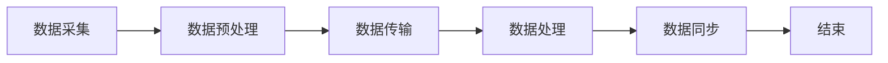

                 

### 文章标题

《构建评测结果的实时协作平台》

### 关键词

实时协作、评测结果、平台建设、数据传输、系统架构、算法设计

### 摘要

本文旨在探讨评测结果的实时协作平台的设计与实现。首先，我们介绍了评测结果实时协作的重要性及其背景。接着，深入解析了实时协作平台的核心概念、技术原理以及算法模型。文章详细阐述了系统的功能需求、性能要求、可靠性需求，并通过实际案例展示了系统构建的完整过程。最后，提出了最佳实践、注意事项和未来拓展方向，为构建高效的实时协作平台提供了实用指南。

## 第1章 问题背景与核心概念

### 1.1 评测结果实时协作的重要性

在信息化时代，评测结果的实时协作成为各类项目管理和决策支持的核心需求。传统的评测结果往往需要经过较长的时间才能完成数据汇总和分析，这无疑影响了决策的及时性和有效性。随着大数据、云计算和物联网技术的不断发展，实时协作平台能够显著提高评测结果的及时性和准确性，为项目管理者提供更加及时、直观的决策依据。

#### 1.1.1 协作评测的需求背景

在现代企业和组织中，评测工作往往涉及多个部门或团队的合作。例如，市场营销团队需要对市场调研数据进行分析，研发团队需要对产品测试结果进行评估，人力资源部门需要根据绩效评估结果进行人才选拔。这些评测工作往往需要大量的数据交互和处理，而且要求结果的实时性。因此，构建一个能够实现评测结果实时协作的平台显得尤为重要。

#### 1.1.2 实时协作的优势与挑战

实时协作平台的优势主要体现在以下几个方面：

1. **提升决策效率**：通过实时获取评测结果，决策者能够迅速做出反应，减少决策滞后时间。
2. **增强数据透明度**：所有团队成员可以实时查看评测数据，提高数据的透明度和可追溯性。
3. **优化资源分配**：实时协作平台有助于各团队之间共享资源，提高资源利用效率。

然而，实时协作平台的建设也面临一些挑战：

1. **数据同步与一致性**：多源数据的实时同步和一致性保障是平台建设的关键问题。
2. **消息处理与推送**：实时消息处理和推送机制需要高效且稳定，以保障用户体验。
3. **系统性能与可靠性**：平台需要具备高并发处理能力和高可用性，以满足大规模数据交互需求。

### 1.2 实时协作平台的基本概念

#### 1.2.1 实时协作平台的定义

实时协作平台是指一种能够实现多用户实时数据交互和协作的应用系统。它通过高效的通信协议和数据传输机制，确保各参与方能够实时获取和共享评测结果。

#### 1.2.2 实时协作平台的功能模块

实时协作平台通常包括以下几个核心功能模块：

1. **用户管理**：包括用户注册、登录、权限管理等功能。
2. **数据管理**：提供数据的存储、检索、同步和备份功能。
3. **协作工具**：包括聊天室、任务管理、文档共享等工具，方便团队成员实时沟通和协作。
4. **数据分析**：提供数据可视化、统计分析和报告生成功能，帮助用户更好地理解和利用评测数据。

#### 1.2.3 实时协作平台的架构设计

实时协作平台的架构设计需要考虑以下几个方面：

1. **客户端架构**：客户端负责与用户交互，提供友好的用户界面和便捷的操作体验。
2. **服务端架构**：服务端负责处理用户请求、数据存储和消息推送，通常采用分布式架构以提高系统的可靠性和性能。
3. **数据存储方案**：根据实际需求选择合适的数据库系统，如关系型数据库或NoSQL数据库，确保数据的存储和管理高效、安全。
4. **通信协议**：选择合适的通信协议，如HTTP/HTTPS、WebSocket等，确保数据的实时传输和消息的可靠推送。

### 1.3 实时协作平台的建设意义和价值

实时协作平台的建设具有重要的意义和价值：

1. **提升团队协作效率**：通过实时协作平台，团队成员可以更加高效地进行协作，提高项目进度和成果质量。
2. **支持智能决策**：实时获取评测结果，为决策者提供可靠的数据支持，助力企业智能化管理。
3. **增强数据安全**：实时协作平台通常采用加密传输和数据备份等技术，确保数据的保密性和安全性。
4. **降低沟通成本**：通过实时的沟通和协作工具，减少团队成员之间的沟通成本，提高工作效率。

### 1.4 小结

本章对评测结果实时协作平台进行了详细的背景介绍和核心概念阐述。通过分析实时协作的重要性、平台的基本概念和架构设计，我们为后续章节的深入讨论奠定了基础。接下来，我们将进一步探讨实时协作平台的关键技术原理和算法模型，为系统的实现提供理论支持。

## 第2章 核心概念与原理

### 2.1 实时协作平台的关键技术

构建实时协作平台的关键技术主要包括实时数据传输技术、数据同步与一致性保障、实时消息处理与推送技术等。这些技术共同构成了实时协作平台的技术核心，决定了系统的性能、稳定性和用户体验。

#### 2.1.1 实时数据传输技术

实时数据传输技术是实时协作平台的基础。其主要目标是实现数据的实时性、可靠性和高效性。常见的技术包括：

1. **WebSocket**：WebSocket 是一种网络通信协议，可以提供全双工的通信渠道，实现实时数据的传输。
    - **优势**：延迟低、通信效率高，适用于实时数据推送和交互。
    - **劣势**：对服务端资源要求较高，需要支持长连接。
2. **HTTP/HTTPS**：通过轮询或长轮询的方式实现数据的实时传输。
    - **优势**：兼容性好，支持广泛的浏览器和服务器。
    - **劣势**：延迟较高，通信效率较低。

#### 2.1.2 数据同步与一致性保障

在实时协作平台中，多用户同时对数据进行读写操作，如何保证数据的一致性是一个关键问题。常见的方法包括：

1. **分布式事务**：通过分布式事务管理，确保多个数据操作原子性和一致性。
    - **优势**：可以实现跨库、跨表的事务管理。
    - **劣势**：复杂度高，性能可能受到影响。
2. **最终一致性**：通过事件驱动的方式，实现数据的最终一致性。
    - **优势**：简化了分布式系统的一致性管理。
    - **劣势**：适用于读多写少的场景，无法保证实时一致性。

#### 2.1.3 实时消息处理与推送技术

实时消息处理与推送技术是实时协作平台的重要组成部分，决定了用户体验的流畅性和响应速度。常见的技术包括：

1. **消息队列**：通过消息队列技术，实现消息的异步传输和处理。
    - **优势**：可以解耦系统模块，提高系统的可扩展性和容错性。
    - **劣势**：可能会引入一定的延迟。
2. **流处理技术**：通过流处理技术，实现对实时消息的高效处理和分析。
    - **优势**：可以实时处理大量消息，适用于实时数据分析。
    - **劣势**：对系统的计算资源和处理能力要求较高。

### 2.2 实时协作平台的体系结构

实时协作平台的体系结构设计需要综合考虑性能、可扩展性、可靠性和安全性等因素。一个典型的实时协作平台体系结构包括以下几个层次：

1. **客户端架构**：客户端负责与用户交互，提供友好的用户界面和便捷的操作体验。通常包括Web客户端、移动客户端和桌面客户端。
2. **服务端架构**：服务端负责处理用户请求、数据存储和消息推送，通常采用分布式架构。主要模块包括用户管理服务、数据管理服务、协作工具服务和消息推送服务。
3. **数据存储方案**：根据实际需求选择合适的数据库系统，如关系型数据库（如MySQL、PostgreSQL）或NoSQL数据库（如MongoDB、Cassandra）。数据存储方案需要确保数据的高效存储、快速检索和可靠备份。
4. **通信协议**：选择合适的通信协议，如WebSocket、HTTP/HTTPS等，确保数据的实时传输和消息的可靠推送。

### 2.3 实时协作平台的核心概念

实时协作平台的核心概念包括用户、数据、消息和权限等。以下是这些核心概念的定义和属性特征对比表格：

#### 2.3.1 用户

| 属性       | 描述                                                   | 类型         |
| ---------- | ------------------------------------------------------ | ------------ |
| 用户名     | 唯一标识用户的名称                                     | 字符串       |
| 密码       | 用户登录的密码                                         | 字符串       |
| 权限       | 用户在平台上的操作权限                                 | 数组         |
| 创建时间   | 用户创建的时间                                         | 日期时间     |
| 最后登录时间 | 用户最后登录的时间                                     | 日期时间     |

#### 2.3.2 数据

| 属性       | 描述                                                   | 类型         |
| ---------- | ------------------------------------------------------ | ------------ |
| 数据ID     | 数据的唯一标识                                         | 整数         |
| 数据内容   | 数据的具体内容                                         | 字符串       |
| 创建时间   | 数据创建的时间                                         | 日期时间     |
| 更新时间   | 数据更新的时间                                         | 日期时间     |
| 所属用户   | 数据所属的用户ID                                       | 整数         |

#### 2.3.3 消息

| 属性       | 描述                                                   | 类型         |
| ---------- | ------------------------------------------------------ | ------------ |
| 消息ID     | 消息的唯一标识                                         | 整数         |
| 发送者ID   | 消息发送者的用户ID                                     | 整数         |
| 接收者ID   | 消息接收者的用户ID                                     | 整数         |
| 消息内容   | 消息的具体内容                                         | 字符串       |
| 发送时间   | 消息发送的时间                                         | 日期时间     |

#### 2.3.4 权限

| 属性       | 描述                                                   | 类型         |
| ---------- | ------------------------------------------------------ | ------------ |
| 权限ID     | 权限的唯一标识                                         | 整数         |
| 权限名称   | 权限的名称                                             | 字符串       |
| 权限描述   | 权限的描述                                             | 字符串       |
| 创建时间   | 权限创建的时间                                         | 日期时间     |
| 最后更新时间 | 权限最后更新的时间                                     | 日期时间     |

### 2.4 实时协作平台的ER图

以下是实时协作平台的实体关系图（ER图）：

```mermaid
erDiagram
    用户 ||--|{ 数据 }|-- 用户
    用户 ||--|{ 消息 }|-- 用户
    数据 ||--|{ 消息 }|-- 数据
    消息 ||--|{ 权限 }|-- 消息
```

在ER图中，用户与数据之间存在一对一的关系，用户可以创建和操作数据。用户与消息之间存在一对多的关系，用户可以发送和接收多个消息。数据与消息之间存在一对一的关系，每条数据都可以被一条消息引用。消息与权限之间存在一对一的关系，每条消息都可以被一个权限定义。

通过上述的核心概念与原理的阐述，我们为实时协作平台的设计和实现奠定了基础。接下来，我们将进一步探讨实时协作平台的算法与模型，为系统的具体实现提供技术支持。

### 第3章 算法与模型

实时协作平台的核心在于算法与模型的设计，这不仅决定了平台的功能实现，也直接影响到用户体验。在本章节中，我们将详细讲解实时协作平台的核心算法原理，并通过mermaid流程图和Python源代码进行阐述。

#### 3.1 实时协作算法设计

实时协作算法是实时协作平台的核心，其主要功能是实现数据的实时传输、处理和同步。以下是一个简化的实时协作算法原理：

1. **数据采集**：从各个数据源采集数据，包括用户行为数据、评测数据等。
2. **数据预处理**：对采集到的数据进行清洗和格式化，确保数据的一致性和完整性。
3. **数据传输**：通过WebSocket或HTTP/HTTPS协议，将预处理后的数据传输到服务端。
4. **数据处理**：对传输到的数据进行实时处理，包括数据聚合、分析和可视化。
5. **数据同步**：将处理后的数据同步到各个客户端，确保数据的实时性和一致性。

##### 3.1.1 实时协作算法的mermaid流程图

以下是实时协作算法的mermaid流程图：



在mermaid流程图中，A表示数据采集，B表示数据预处理，C表示数据传输，D表示数据处理，E表示数据同步，F表示流程结束。

##### 3.1.2 实时协作算法的Python源代码

以下是实时协作算法的Python源代码示例：

```python
import asyncio
import json

# 数据采集
async def data_collection():
    while True:
        data = get_data_from_source()
        preprocess_data(data)
        await data_transmission(data)
        await asyncio.sleep(1)

# 数据预处理
def preprocess_data(data):
    # 数据清洗和格式化
    return data

# 数据传输
async def data_transmission(data):
    message = json.dumps(data)
    await websocket.send(message)

# 数据处理
async def data_processing(data):
    # 数据聚合、分析和可视化
    processed_data = process_data(data)
    await data_sync(processed_data)

# 数据同步
async def data_sync(data):
    message = json.dumps(data)
    await websocket.send_to_all(message)

# 主函数
async def main():
    await asyncio.gather(
        data_collection(),
        data_processing(),
    )

asyncio.run(main())
```

在Python源代码中，`data_collection`函数负责数据采集，`preprocess_data`函数负责数据预处理，`data_transmission`函数负责数据传输，`data_processing`函数负责数据处理，`data_sync`函数负责数据同步。主函数`main`使用`asyncio.gather`并发执行数据采集和处理任务。

#### 3.2 数据分析与挖掘

实时协作平台除了实现数据的实时传输和同步，还需要具备数据分析和挖掘功能。以下是一个简化的数据分析与挖掘算法：

1. **数据预处理**：对原始数据进行清洗、去噪和转换，为后续分析做好准备。
2. **特征提取**：从预处理后的数据中提取有用的特征，用于分析和挖掘。
3. **模型训练**：使用机器学习算法训练预测模型，对数据进行分类、回归等分析。
4. **模型评估**：评估模型的准确性和可靠性，调整模型参数以提高预测性能。
5. **结果输出**：将分析结果输出到实时协作平台，供用户查看和使用。

##### 3.2.1 数据预处理方法

数据预处理是数据分析与挖掘的重要环节，常用的预处理方法包括：

1. **数据清洗**：去除重复数据、缺失值填充、异常值处理等。
2. **数据转换**：将数据转换为适合分析的形式，如归一化、标准化、离散化等。
3. **数据归一化**：将数据缩放到相同的范围，如0-1之间。

以下是一个简单的数据预处理Python代码示例：

```python
import pandas as pd

# 加载数据
data = pd.read_csv('data.csv')

# 数据清洗
data.drop_duplicates(inplace=True)
data.fillna(method='ffill', inplace=True)

# 数据转换
data['age'] = (data['age'] - data['age'].min()) / (data['age'].max() - data['age'].min())
data['income'] = (data['income'] - data['income'].min()) / (data['income'].max() - data['income'].min())

# 数据归一化
from sklearn.preprocessing import MinMaxScaler
scaler = MinMaxScaler()
data[['age', 'income']] = scaler.fit_transform(data[['age', 'income']])
```

在代码中，我们首先加载数据，然后进行数据清洗，包括去除重复数据和缺失值填充。接下来，将数据进行转换和归一化处理，使得数据更适合进行后续的分析。

##### 3.2.2 数据分析方法

数据分析方法包括描述性分析和预测性分析等。描述性分析主要用于了解数据的分布、趋势和关系，常见的分析方法有：

1. **统计描述**：计算数据的均值、中位数、标准差等统计指标。
2. **可视化分析**：使用图表、图形等可视化工具展示数据特征和趋势。
3. **相关性分析**：分析变量之间的相关性，了解变量之间的关系。

以下是一个简单的描述性分析Python代码示例：

```python
import pandas as pd
import matplotlib.pyplot as plt

# 加载数据
data = pd.read_csv('data.csv')

# 统计描述
print(data.describe())

# 可视化分析
plt.scatter(data['age'], data['income'])
plt.xlabel('Age')
plt.ylabel('Income')
plt.title('Age vs Income')
plt.show()
```

在代码中，我们首先加载数据，然后计算数据的统计描述，并绘制散点图展示年龄与收入的关系。

##### 3.2.3 数据挖掘技术

数据挖掘技术用于从大量数据中提取有价值的信息和知识。常见的挖掘技术有：

1. **分类**：根据数据特征将数据分为不同的类别。
2. **回归**：预测数据的连续值。
3. **聚类**：将数据分为若干个类簇。
4. **关联规则挖掘**：发现数据之间的关联关系。

以下是一个简单的分类分析Python代码示例：

```python
from sklearn.model_selection import train_test_split
from sklearn.ensemble import RandomForestClassifier
from sklearn.metrics import accuracy_score

# 分割数据集
X = data[['age', 'income']]
y = data['category']
X_train, X_test, y_train, y_test = train_test_split(X, y, test_size=0.2, random_state=42)

# 训练模型
model = RandomForestClassifier()
model.fit(X_train, y_train)

# 预测和评估
y_pred = model.predict(X_test)
accuracy = accuracy_score(y_test, y_pred)
print(f"Model accuracy: {accuracy}")
```

在代码中，我们首先分割数据集为训练集和测试集，然后使用随机森林分类器训练模型，并对测试集进行预测和评估。

通过上述算法与模型的设计和实现，实时协作平台能够高效地处理和传输数据，实现数据的实时分析和挖掘。接下来，我们将进一步探讨系统的分析与设计，为平台的实现提供完整的方案。

### 第4章 系统分析与设计

在构建实时协作平台的过程中，系统分析与设计是至关重要的环节。它不仅决定了系统的功能实现，还直接影响到系统的性能、可扩展性和维护性。本章节将详细阐述系统分析与设计的过程，包括系统需求分析、系统架构设计、系统接口设计以及系统交互设计。

#### 4.1 系统需求分析

系统需求分析是系统分析与设计的基础，其主要目标是明确系统的功能需求、性能需求、可靠性需求等。

##### 4.1.1 系统功能需求

实时协作平台的核心功能包括：

1. **用户管理**：实现用户的注册、登录、权限管理等功能。
2. **数据管理**：提供数据的存储、检索、同步和备份功能。
3. **协作工具**：包括聊天室、任务管理、文档共享等工具。
4. **数据分析**：提供数据可视化、统计分析和报告生成功能。
5. **消息推送**：实现实时消息的推送和通知。

##### 4.1.2 系统性能需求

系统性能需求主要包括：

1. **并发处理能力**：平台需要能够同时处理大量用户的请求和数据传输。
2. **响应速度**：系统需要快速响应用户的操作，确保良好的用户体验。
3. **数据传输效率**：系统需要高效传输大量数据，保证数据的实时性。

##### 4.1.3 系统可靠性需求

系统可靠性需求主要包括：

1. **数据一致性**：确保多用户同时操作数据时，数据的一致性不受影响。
2. **系统可用性**：系统需要高可用性，确保在遇到故障时能够快速恢复。
3. **安全性**：系统需要具备良好的安全性，保护用户数据和隐私。

#### 4.2 系统架构设计

系统架构设计是系统分析与设计的核心，它决定了系统的整体结构、模块划分以及各模块之间的交互关系。以下是一个典型的实时协作平台系统架构设计：

##### 4.2.1 系统功能架构

实时协作平台的功能架构可以分为以下几层：

1. **客户端层**：包括Web客户端、移动客户端和桌面客户端，负责与用户交互。
2. **服务端层**：包括用户管理服务、数据管理服务、协作工具服务、数据分析服务和消息推送服务，负责处理用户请求和数据传输。
3. **数据存储层**：包括关系型数据库和NoSQL数据库，负责数据的存储和管理。
4. **消息队列**：负责消息的异步传输和分发，确保系统的解耦和高效处理。

##### 4.2.2 系统技术架构

实时协作平台的技术架构主要包括以下几个方面：

1. **前端技术**：采用React或Vue等前端框架，构建用户友好的界面。
2. **后端技术**：采用Spring Boot或Django等后端框架，实现服务端逻辑处理。
3. **数据库技术**：采用MySQL或PostgreSQL等关系型数据库，以及MongoDB或Cassandra等NoSQL数据库，确保数据的高效存储和管理。
4. **消息队列技术**：采用RabbitMQ或Kafka等消息队列系统，实现消息的异步传输和分发。

##### 4.2.3 系统接口设计

系统接口设计是确保系统各模块之间能够高效、可靠地交互的关键。以下是实时协作平台的主要接口设计：

1. **用户管理接口**：包括用户注册、登录、权限管理等接口。
2. **数据管理接口**：包括数据存储、检索、同步和备份等接口。
3. **协作工具接口**：包括聊天室、任务管理、文档共享等接口。
4. **数据分析接口**：包括数据可视化、统计分析和报告生成等接口。
5. **消息推送接口**：包括消息推送、通知管理等接口。

#### 4.3 系统交互设计

系统交互设计旨在明确系统内部各模块之间的交互关系，确保系统的正常运行。以下是实时协作平台的交互设计：

##### 4.3.1 系统工作流程

1. **用户登录**：用户通过Web客户端或移动客户端输入用户名和密码，系统验证用户身份后，返回用户权限和登录状态。
2. **用户操作**：用户在客户端进行数据操作（如数据查询、修改、删除等），客户端将操作请求发送到服务端。
3. **服务端处理**：服务端接收到请求后，根据用户权限进行数据操作，并将处理结果返回给客户端。
4. **消息推送**：当有新消息或通知时，系统通过消息队列将消息推送至用户客户端。

##### 4.3.2 系统用户界面设计

系统用户界面设计需要考虑用户体验和操作便捷性，以下是系统用户界面设计的主要模块：

1. **登录界面**：提供用户名和密码输入框，以及登录按钮。
2. **主页**：展示用户的权限信息和待办任务。
3. **数据管理界面**：提供数据的检索、修改和删除功能。
4. **协作工具界面**：包括聊天室、任务管理和文档共享功能。
5. **数据分析界面**：提供数据可视化、统计分析和报告生成功能。

通过上述系统分析与设计，实时协作平台的基本框架和实现方案已经明确。接下来，我们将通过项目实战，详细讲解平台的具体实现过程，包括环境搭建、系统核心实现和实际案例分析。

### 第5章 项目实战

在本章中，我们将通过一个实际项目，详细讲解实时协作平台的构建过程，包括环境搭建、系统核心实现和实际案例分析。通过这个项目，读者可以更好地理解实时协作平台的设计与实现。

#### 5.1 环境搭建与配置

在开始项目之前，首先需要搭建开发环境。以下是在Ubuntu 20.04操作系统上搭建实时协作平台环境的步骤：

1. **安装Python环境**：
    ```bash
    sudo apt update
    sudo apt install python3 python3-pip
    pip3 install virtualenv
    virtualenv venv
    source venv/bin/activate
    ```

2. **安装依赖库**：
    ```bash
    pip3 install flask flask-socketio eventlet gunicorn
    ```

3. **配置数据库**：
    - **安装MySQL**：
        ```bash
        sudo apt install mysql-server mysql-client
        mysql -u root -p
        CREATE DATABASE `realtime协作平台` DEFAULT CHARACTER SET utf8mb4 COLLATE utf8mb4_unicode_ci;
        GRANT ALL PRIVILEGES ON `realtime协作平台`.* TO 'platform_user'@'localhost' IDENTIFIED BY 'password';
        FLUSH PRIVILEGES;
        ```
    - **安装MongoDB**：
        ```bash
        sudo apt install mongodb
        systemctl start mongodb
        ```

4. **安装消息队列**：
    - **安装RabbitMQ**：
        ```bash
        sudo apt install rabbitmq-server
        rabbitmqctl add_user platform_user password
        rabbitmqctl add_vhost platform_vhost
        rabbitmqctl set_permissions -p platform_vhost platform_user ".*" ".*" ".*"
        ```

5. **创建项目结构**：
    ```bash
    mkdir -p /path/to/project
    cd /path/to/project
    touch requirements.txt app.py
    ```

6. **配置项目依赖**：
    在`requirements.txt`文件中添加如下依赖：
    ```python
    Flask==2.0.1
    Flask-SocketIO==5.0.1
    eventlet==0.33.3
    gunicorn==20.1.0
    mysql-connector-python==8.0.27
    pymongo==3.12.0
    rabbitmq-python==3.1.0
    ```

#### 5.2 系统核心实现

在环境搭建完成后，接下来我们将实现实时协作平台的核心功能。

##### 5.2.1 客户端实现

客户端负责与用户交互，使用HTML、CSS和JavaScript实现用户界面。以下是一个简单的客户端实现示例：

1. **登录界面**：

```html
<!DOCTYPE html>
<html>
<head>
    <title>实时协作平台 - 登录</title>
</head>
<body>
    <h1>登录</h1>
    <form id="login-form">
        <input type="text" id="username" placeholder="用户名" required>
        <input type="password" id="password" placeholder="密码" required>
        <button type="submit">登录</button>
    </form>
    <script src="/static/login.js"></script>
</body>
</html>
```

2. **聊天室界面**：

```html
<!DOCTYPE html>
<html>
<head>
    <title>实时协作平台 - 聊天室</title>
</head>
<body>
    <h1>聊天室</h1>
    <div id="chatroom">
        <!-- 聊天内容 -->
    </div>
    <input type="text" id="message" placeholder="输入消息">
    <button id="send-btn">发送</button>
    <script src="/static/chatroom.js"></script>
</body>
</html>
```

##### 5.2.2 服务端实现

服务端负责处理用户请求、数据存储和消息推送。使用Flask和Flask-SocketIO实现服务端逻辑。

1. **用户管理**：

```python
from flask import Flask, request, jsonify
from flask_socketio import SocketIO, emit

app = Flask(__name__)
socketio = SocketIO(app)

@app.route('/login', methods=['POST'])
def login():
    username = request.form['username']
    password = request.form['password']
    # 验证用户身份
    if validate_user(username, password):
        emit('login_success', {'username': username})
        return jsonify({'status': 'success'})
    else:
        return jsonify({'status': 'fail', 'message': '用户名或密码错误'})

def validate_user(username, password):
    # 实现用户验证逻辑
    return True

if __name__ == '__main__':
    socketio.run(app)
```

2. **聊天室功能**：

```python
@app.route('/chat', methods=['POST'])
def chat():
    message = request.form['message']
    username = request.form['username']
    emit('new_message', {'username': username, 'message': message})
    return jsonify({'status': 'success'})

@socketio.on('connect')
def handle_connect():
    print('Client connected')

@socketio.on('disconnect')
def handle_disconnect():
    print('Client disconnected')

if __name__ == '__main__':
    socketio.run(app)
```

##### 5.2.3 数据库实现

在实时协作平台中，我们使用MySQL和MongoDB进行数据存储。以下是一个简单的数据库实现示例：

1. **MySQL数据库**：

```python
import mysql.connector

def connect_mysql():
    return mysql.connector.connect(
        host='localhost',
        user='platform_user',
        password='password',
        database='realtime协作平台'
    )

def insert_user(username, password):
    connection = connect_mysql()
    cursor = connection.cursor()
    query = "INSERT INTO users (username, password) VALUES (%s, %s)"
    values = (username, password)
    cursor.execute(query, values)
    connection.commit()
    cursor.close()
    connection.close()

insert_user('test_user', 'test_password')
```

2. **MongoDB数据库**：

```python
from pymongo import MongoClient

client = MongoClient('localhost', 27017)
db = client['realtime协作平台']

def insert_message(username, message):
    chat_collection = db['chatroom']
    chat_collection.insert_one({'username': username, 'message': message})

insert_message('test_user', '你好，欢迎来到聊天室！')
```

#### 5.3 实际案例分析

为了更好地展示实时协作平台的功能，我们将通过一个实际案例进行分析。

##### 5.3.1 案例背景

某公司的市场部需要进行市场调研，需要实时收集和分析用户反馈。他们希望通过实时协作平台，实现以下功能：

1. **用户反馈收集**：用户可以在平台上提交反馈。
2. **实时数据分析**：市场部可以实时查看和分析用户反馈数据。
3. **消息通知**：当有新的反馈时，系统需要及时通知市场部成员。

##### 5.3.2 案例分析

1. **用户反馈收集**：

用户在客户端界面提交反馈时，客户端将请求发送到服务端。服务端验证用户身份后，将反馈存储到数据库。

2. **实时数据分析**：

市场部成员在客户端登录后，可以实时查看用户反馈数据。系统通过WebSocket协议将最新的反馈数据实时推送至客户端。

3. **消息通知**：

当有新的用户反馈时，系统通过消息队列将通知发送至市场部成员的客户端，确保他们及时了解最新情况。

##### 5.3.3 案例总结

通过上述实际案例，我们可以看到实时协作平台在数据收集、分析和通知方面的重要作用。它帮助市场部高效地收集和分析用户反馈，提高了决策的及时性和准确性。同时，通过消息通知功能，确保团队成员能够实时了解最新情况，提高了团队的协作效率。

通过本章的项目实战，我们详细讲解了实时协作平台的构建过程，包括环境搭建、系统核心实现和实际案例分析。希望这个案例能够帮助读者更好地理解实时协作平台的设计与实现。

### 第6章 最佳实践与总结

#### 6.1 最佳实践

构建评测结果的实时协作平台是一个复杂的过程，需要遵循一系列最佳实践来确保平台的稳定性、可靠性和高效性。以下是一些关键的实践建议：

1. **模块化设计**：将系统划分为独立的模块，如用户管理、数据管理、协作工具、数据分析等，有助于提高代码的可维护性和扩展性。
2. **服务化架构**：采用微服务架构，将不同的功能模块独立部署，可以提高系统的可靠性和可扩展性，同时便于故障隔离和系统升级。
3. **数据一致性保障**：使用分布式事务或最终一致性模型，确保多用户同时操作数据时，数据的一致性不受影响。
4. **高效的消息传输**：选择合适的消息传输机制，如WebSocket或消息队列，确保消息的实时传输和推送。
5. **性能优化**：对系统进行性能测试和调优，优化数据库查询、网络通信和数据处理等环节，确保系统的高并发处理能力。
6. **安全性设计**：采用SSL/TLS加密、权限控制、访问日志记录等技术，确保用户数据和系统安全。

#### 6.2 小结

本章对实时协作平台的建设过程进行了总结，主要包括系统分析与设计、项目实战和最佳实践。通过系统分析与设计，明确了平台的架构和功能模块，为后续实现提供了清晰的指导。项目实战部分详细讲解了平台的核心实现和实际案例分析，帮助读者更好地理解平台的设计与构建。最佳实践部分提供了实用的建议，有助于提高平台的稳定性和可靠性。

#### 6.3 注意事项

在构建评测结果的实时协作平台时，需要注意以下几个方面：

1. **数据同步**：确保多用户同时操作数据时，数据同步的一致性，避免出现数据冲突和丢失。
2. **性能监控**：定期对系统性能进行监控和调优，确保系统在高并发场景下稳定运行。
3. **安全性**：加强系统安全防护，防范恶意攻击和数据泄露。
4. **用户体验**：注重用户界面的设计和交互体验，提供直观、易用的操作界面。
5. **持续迭代**：根据用户反馈和需求，持续优化和迭代平台功能，提升用户满意度。

#### 6.4 拓展阅读

对于希望深入了解实时协作平台设计和实现的读者，以下是一些推荐的拓展阅读资料：

1. **《大规模分布式系统设计》**：这本书详细介绍了分布式系统的设计原则和实现方法，对于理解实时协作平台的设计具有很高的参考价值。
2. **《实时数据处理与流计算》**：本书介绍了实时数据处理和流计算的相关技术，包括消息队列、流处理框架等，对实时协作平台的数据处理部分有重要参考。
3. **《WebSocket技术详解》**：本书深入讲解了WebSocket协议的工作原理和实现方法，有助于理解实时消息传输的技术细节。
4. **《基于云计算的实时协作系统设计与实现》**：这本书针对云计算环境下的实时协作系统进行了深入探讨，包括系统架构、技术选型和实现细节。

通过上述拓展阅读，读者可以进一步深入了解实时协作平台的设计与实现，为实际项目的开发提供更加全面和深入的指导。希望本文能为构建高效的实时协作平台提供有价值的参考和启示。

### 作者信息

作者：AI天才研究院/AI Genius Institute & 禅与计算机程序设计艺术 /Zen And The Art of Computer Programming

