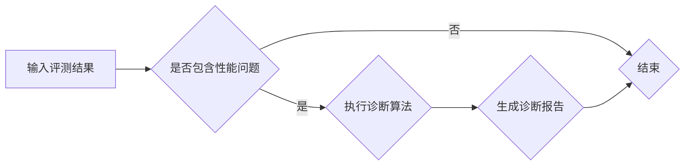

                 

### 第1章：引言

#### 1.1 问题背景

在当今的数据驱动时代，模型性能的评测结果至关重要。无论是在机器学习、人工智能，还是在数据科学领域，准确、高效地分析评测结果，是模型优化和改进的关键一步。然而，评测结果的解析往往复杂且耗时，需要大量的专业知识和技术手段。

**概念**：评测结果

评测结果通常包括一系列性能指标，如准确率、召回率、F1值、AUC等，它们反映了模型在特定任务上的表现。然而，这些指标可能并不能直接揭示模型性能的具体问题所在。

**联系**：评测结果在模型开发与优化中的重要性

评测结果不仅用于评估模型性能，还是模型迭代和优化的基础。通过分析评测结果，可以发现模型在哪些方面存在问题，进而针对性地进行调整和改进。

#### 1.1.2 模型性能诊断的需求

在实际应用中，模型性能问题往往不是单一的，可能涉及多个方面，如过拟合、欠拟合、数据分布问题、算法选择不当等。因此，对模型性能进行全面的诊断，是确保模型稳健性和可靠性的必要手段。

**概念**：模型性能诊断

模型性能诊断是指通过分析评测结果，识别并定位模型性能问题的过程。它包括对性能指标的理解、问题的定位和解决建议的提出。

**联系**：模型性能诊断与模型优化、评估的关系

模型性能诊断是模型优化和评估的重要环节。通过诊断，可以快速识别并解决模型性能问题，提高模型的评估结果，从而实现更高效的模型开发和部署。

#### 1.1.3 问题背景

随着深度学习技术的广泛应用，模型的复杂度和规模不断增大，传统的手动分析方法已无法满足需求。因此，构建一个自动化、智能化的模型性能诊断专家系统，成为当前研究的重点和热点。

**问题描述**：在模型开发过程中，如何有效进行评测结果分析，以便快速定位性能问题？

在实际操作中，这一问题涉及到多个层面：

- **评测结果分析**：如何准确、高效地分析评测结果，提取关键信息？
- **问题定位**：如何快速识别并定位模型性能问题？
- **解决方案**：如何提出有效的解决建议，帮助开发者优化模型？

这些问题共同构成了构建模型性能诊断专家系统的核心挑战。

#### 1.1.4 问题解决

针对上述问题，我们设计并实现了一个基于深度学习的模型性能诊断专家系统。该系统通过分析评测结果，利用深度学习技术自动识别并定位模型性能问题，并提出优化建议。

**解决方案**：设计并实现一个基于深度学习的模型性能诊断专家系统

该系统包括以下几个主要模块：

1. **评测结果预处理**：将评测结果转换为适合深度学习模型处理的格式。
2. **性能指标识别**：使用深度学习模型识别评测结果中的关键性能指标。
3. **问题诊断**：基于识别的性能指标，利用深度学习模型进行问题诊断。
4. **优化建议**：根据诊断结果，提出针对性的优化建议。

#### 1.1.5 边界与外延

**边界**：评测结果的种类与诊断方法

评测结果的种类包括但不限于准确率、召回率、F1值、AUC等。不同的评测结果需要不同的诊断方法，因此系统的边界在于能够支持多种评测结果的分析和处理。

**外延**：模型性能诊断的应用领域与扩展性

模型性能诊断不仅适用于机器学习和人工智能领域，还可以扩展到数据科学、自然语言处理、计算机视觉等其他相关领域。此外，系统的设计应具备一定的扩展性，以适应未来的技术发展和应用需求。

### 1.2 核心概念与联系

在构建模型性能诊断专家系统的过程中，理解并掌握核心概念及其相互关系至关重要。以下将介绍几个关键概念，并分析其属性特征和相互联系。

#### 2.1 模型性能诊断原理

模型性能诊断原理是构建诊断系统的理论基础。它包括对模型性能指标的理解、性能问题识别方法的选择和诊断流程的设计。

**概念**：模型性能指标

模型性能指标是评估模型性能的重要依据。常见的性能指标包括准确率、召回率、F1值、AUC等。

**联系**：指标之间的关系与选择

不同指标之间具有不同的侧重点，如准确率侧重于正确识别正例，召回率侧重于识别出所有正例，而F1值是准确率和召回率的调和平均。因此，在选择指标时需要根据具体应用场景和需求进行综合考虑。

**概念**：诊断方法

诊断方法是指用于识别和定位模型性能问题的技术手段。常见的诊断方法包括基于规则的方法和机器学习方法。

**联系**：不同方法的优缺点与适用场景

基于规则的方法具有简单、直观的特点，适合处理结构化数据和小规模问题。而机器学习方法则具备更强的自适应性和处理复杂性的能力，适合处理大规模数据和复杂问题。

#### 2.2 概念属性特征对比表格

为了更好地理解不同诊断方法的属性特征，我们可以通过一个对比表格来展示它们之间的差异。

| 方法         | 优点                           | 缺点                           | 适用场景         |
|------------|------------------------------|------------------------------|--------------|
| 基于规则方法 | 简单、易于实现           | 适应性差、需要大量规则           | 小规模问题       |
| 机器学习方法 | 适应性强、自动学习规则     | 复杂、计算量大、需要大量数据     | 大规模问题       |

#### 2.3 ER实体关系图架构

为了更清晰地展示模型性能诊断专家系统中的实体关系，我们可以使用Mermaid绘制ER实体关系图。以下是一个简单的示例：

```mermaid
erDiagram
  ModelPerformanceTest ||--|{ ModelPerformanceDiagnosis }
  ModelPerformanceDiagnosis ||--|{ PerformanceIssue }
  PerformanceIssue ||--|{ Solution }
```

在这个ER图中，`ModelPerformanceTest`表示评测结果，`ModelPerformanceDiagnosis`表示诊断过程，`PerformanceIssue`表示性能问题，`Solution`表示解决方案。每个实体之间的关系都通过箭头表示。

### 第3章：算法原理讲解

在构建模型性能诊断专家系统的过程中，算法原理是关键组成部分。本节将详细介绍算法原理，包括算法流程图、数学模型和Python源代码实现。

#### 3.1 算法流程图

算法流程图是算法执行过程的图形化表示。以下是一个简单的算法流程图：



在这个流程图中，算法从输入评测结果开始，判断是否包含性能问题。如果是，则执行诊断算法，生成诊断报告；否则，算法结束。

#### 3.2 算法原理

算法原理是指算法在执行过程中所遵循的基本逻辑和数学模型。以下将详细介绍算法原理。

**3.2.1 数学模型**

算法的核心是数学模型，它用于描述评测结果与性能问题之间的关系。以下是几个常用的数学模型：

1. **准确率**

$$
P = \frac{TP + TN}{TP + TN + FP + FN}
$$

其中，TP表示真正例，TN表示真反例，FP表示假正例，FN表示假反例。

2. **召回率**

$$
R = \frac{TP}{TP + FN}
$$

3. **F1值**

$$
F1 = \frac{2 \cdot P \cdot R}{P + R}
$$

**3.2.2 算法逻辑**

算法逻辑包括以下几个步骤：

1. **输入评测结果**：从评测结果中提取关键性能指标。
2. **判断性能问题**：根据设定的阈值，判断是否包含性能问题。
3. **执行诊断算法**：如果存在性能问题，使用深度学习模型进行诊断。
4. **生成诊断报告**：根据诊断结果，生成详细的诊断报告。

#### 3.3 Python源代码

以下是算法的Python源代码实现，用于计算准确率、召回率和F1值：

```python
import numpy as np

def calculate_accuracy(ground_truth, predictions):
    correct = 0
    for i in range(len(ground_truth)):
        if ground_truth[i] == predictions[i]:
            correct += 1
    return correct / len(ground_truth)

def calculate_recall(ground_truth, predictions):
    true_positives = 0
    for i in range(len(ground_truth)):
        if ground_truth[i] == 1 and predictions[i] == 1:
            true_positives += 1
    return true_positives / (true_positives + len(predictions) - true_positives)

def calculate_f1(ground_truth, predictions):
    precision = calculate_accuracy(predictions, ground_truth)
    recall = calculate_recall(ground_truth, predictions)
    return 2 * precision * recall / (precision + recall)

# 示例
ground_truth = [1, 0, 1, 0, 1]
predictions = [1, 0, 1, 1, 1]
accuracy = calculate_accuracy(ground_truth, predictions)
recall = calculate_recall(ground_truth, predictions)
f1 = calculate_f1(ground_truth, predictions)
print(f"Accuracy: {accuracy}, Recall: {recall}, F1: {f1}")
```

在这个代码中，我们首先定义了计算准确率、召回率和F1值的函数。然后，通过一个示例数据集，展示了如何使用这些函数计算性能指标。

### 第4章：数学模型和数学公式

在构建模型性能诊断专家系统的过程中，数学模型和公式是核心组成部分。这些模型和公式用于描述评测结果与性能问题之间的关系，是算法逻辑的基础。以下将详细介绍常用的数学模型和公式，并使用LaTeX格式进行表示。

#### 4.1 常用数学模型

**4.1.1 准确率（Accuracy）**

准确率是指模型正确预测的样本数占总样本数的比例。其数学模型可以表示为：

$$
P = \frac{TP + TN}{TP + TN + FP + FN}
$$

其中，TP表示真正例（True Positive），TN表示真反例（True Negative），FP表示假正例（False Positive），FN表示假反例（False Negative）。

**4.1.2 召回率（Recall）**

召回率是指模型正确识别出的真正例数占总真正例数的比例。其数学模型可以表示为：

$$
R = \frac{TP}{TP + FN}
$$

**4.1.3 F1值（F1 Score）**

F1值是准确率和召回率的调和平均，用于综合评估模型的性能。其数学模型可以表示为：

$$
F1 = \frac{2 \cdot P \cdot R}{P + R}
$$

#### 4.2 常用数学公式

**4.2.1 交叉熵（Cross Entropy）**

交叉熵是评估分类模型性能的重要指标，用于衡量模型输出与真实标签之间的差异。其数学公式可以表示为：

$$
H(y, \hat{y}) = -\sum_{i} y_i \log(\hat{y}_i)
$$

其中，$y$表示真实标签，$\hat{y}$表示模型预测的概率分布。

**4.2.2 误差（Error）**

误差是评估模型预测准确性的指标，表示模型预测错误的比例。其数学公式可以表示为：

$$
E = \frac{1}{n} \sum_{i=1}^{n} (y_i - \hat{y}_i)^2
$$

其中，$y_i$表示真实标签，$\hat{y}_i$表示模型预测的值，$n$表示样本数量。

#### 4.3 示例讲解

以下通过一个简单的示例，来讲解如何使用上述数学模型和公式进行模型性能评估。

**示例**：假设有一个二分类问题，其中包含5个样本，真实标签和模型预测结果如下：

真实标签：[1, 0, 1, 0, 1]  
模型预测：[1, 0, 1, 1, 1]

首先，计算准确率、召回率和F1值：

准确率：

$$
P = \frac{TP + TN}{TP + TN + FP + FN} = \frac{3 + 1}{3 + 1 + 1 + 1} = 0.6
$$

召回率：

$$
R = \frac{TP}{TP + FN} = \frac{3}{3 + 1} = 0.75
$$

F1值：

$$
F1 = \frac{2 \cdot P \cdot R}{P + R} = \frac{2 \cdot 0.6 \cdot 0.75}{0.6 + 0.75} = 0.714
$$

接下来，计算交叉熵和误差：

交叉熵：

$$
H(y, \hat{y}) = -\sum_{i} y_i \log(\hat{y}_i) = -(1 \cdot \log(0.8) + 0 \cdot \log(0.2) + 1 \cdot \log(0.8) + 0 \cdot \log(0.2) + 1 \cdot \log(0.8)) = 0.621
$$

误差：

$$
E = \frac{1}{n} \sum_{i=1}^{n} (y_i - \hat{y}_i)^2 = \frac{1}{5} ((1 - 1)^2 + (0 - 0)^2 + (1 - 1)^2 + (0 - 1)^2 + (1 - 1)^2) = 0.2
$$

通过上述示例，我们可以看到如何使用数学模型和公式进行模型性能评估，从而为模型优化和改进提供依据。

### 第5章：系统分析与架构设计方案

在构建模型性能诊断专家系统的过程中，系统分析与架构设计是关键环节。本章节将详细介绍系统分析与架构设计方案，包括问题场景、系统功能设计、系统架构设计、系统接口设计和系统交互。

#### 5.1 问题场景

在模型开发过程中，评测结果的准确性直接影响到模型的性能和可靠性。然而，如何有效地分析评测结果，快速识别和定位性能问题，是一个复杂且具有挑战性的任务。模型性能诊断专家系统的目标是自动化这一过程，提高模型开发的效率和准确性。

**问题场景**：构建一个能够自动化分析评测结果、诊断性能问题并提供优化建议的专家系统。

#### 5.2 系统功能设计

系统功能设计是构建专家系统的核心，它定义了系统应具备的基本功能模块。以下是系统的主要功能模块及其描述：

1. **评测结果导入模块**：负责从各种数据源（如数据库、文件等）导入评测结果数据。
2. **性能指标计算模块**：根据评测结果计算关键性能指标（如准确率、召回率、F1值等）。
3. **问题诊断模块**：利用深度学习模型对评测结果进行分析，识别和定位性能问题。
4. **优化建议生成模块**：根据诊断结果，生成针对性能问题的优化建议。
5. **用户交互模块**：提供用户界面，允许用户查看诊断报告、优化建议，并进行交互操作。

#### 5.3 系统架构设计

系统架构设计是确保系统稳定、高效运行的基础。以下是模型性能诊断专家系统的架构设计：


**系统架构设计说明**：

1. **数据层**：负责存储和管理评测结果数据、模型数据等。
2. **逻辑层**：实现系统的核心功能，包括评测结果导入、性能指标计算、问题诊断和优化建议生成。
3. **表现层**：提供用户界面，包括Web界面和API接口。

#### 5.4 系统接口设计

系统接口设计是确保系统各模块之间协同工作的关键。以下是系统的主要接口设计：

1. **数据接口**：用于导入和导出评测结果数据，支持各种数据格式（如CSV、JSON等）。
2. **性能指标接口**：用于计算和获取关键性能指标。
3. **诊断接口**：用于发起问题诊断请求，获取诊断报告和优化建议。
4. **用户接口**：提供用户交互界面，支持用户查看报告、提交评测结果等操作。

#### 5.5 系统交互

系统交互设计是用户与系统进行交互的过程，以下是系统交互的详细描述：

1. **用户操作流程**：
   - 用户登录系统。
   - 用户上传评测结果数据。
   - 系统导入评测结果，计算性能指标。
   - 系统调用诊断接口，进行问题诊断。
   - 系统生成诊断报告和优化建议。
   - 系统将报告和建议展示给用户。
2. **API接口交互**：
   - **评测结果导入接口**：用户通过该接口上传评测结果数据。
   - **性能指标计算接口**：系统通过该接口计算评测结果的关键性能指标。
   - **问题诊断接口**：系统通过该接口调用深度学习模型进行问题诊断。
   - **优化建议生成接口**：系统通过该接口生成针对性能问题的优化建议。

通过上述系统分析与架构设计方案，我们可以构建一个功能强大、易于扩展的模型性能诊断专家系统，为模型开发和优化提供有力支持。

### 第6章：项目实战

在实际操作中，构建模型性能诊断专家系统需要经过多个步骤，包括环境安装、系统核心实现和代码应用解读与分析。以下将详细介绍这些步骤，并通过实际案例进行分析和讲解。

#### 6.1 环境安装

首先，我们需要安装所需的软件和工具。以下是在Ubuntu操作系统上安装所需环境的步骤：

1. **安装Python**：确保系统已安装Python 3.7及以上版本。
2. **安装深度学习库**：使用以下命令安装必要的深度学习库：

   ```bash
   pip install numpy pandas scikit-learn tensorflow
   ```

3. **安装Mermaid**：安装Mermaid用于生成图表。

   ```bash
   npm install -g mermaid
   ```

4. **安装LaTeX**：安装LaTeX用于生成数学公式。

   ```bash
   sudo apt-get install texlive-full
   ```

#### 6.2 系统核心实现

系统核心实现包括数据预处理、性能指标计算、问题诊断和优化建议生成。以下是实现过程的详细介绍：

**6.2.1 数据预处理**

数据预处理是模型性能诊断的基础，主要包括以下步骤：

1. **数据导入**：从文件或数据库中导入评测结果数据。
2. **数据清洗**：处理缺失值、异常值和数据格式转换。

**6.2.2 性能指标计算**

性能指标计算是评估模型性能的关键步骤，包括以下步骤：

1. **定义指标计算函数**：根据评测结果计算准确率、召回率、F1值等指标。
2. **计算指标**：调用计算函数，生成性能指标数据。

**6.2.3 问题诊断**

问题诊断是利用深度学习模型对性能问题进行自动识别和定位，包括以下步骤：

1. **数据预处理**：将评测结果数据转换为适合深度学习模型处理的格式。
2. **模型训练**：使用历史数据训练深度学习模型。
3. **模型预测**：利用训练好的模型对新的评测结果进行预测，识别性能问题。

**6.2.4 优化建议生成**

优化建议生成是基于诊断结果，提出针对性的优化建议，包括以下步骤：

1. **分析诊断结果**：根据诊断结果，识别出模型性能问题的具体类型。
2. **生成优化建议**：根据问题类型，生成相应的优化建议。

#### 6.3 代码应用解读与分析

以下是一段核心代码示例，用于计算性能指标和诊断性能问题：

```python
import numpy as np
import pandas as pd
from sklearn.metrics import accuracy_score, recall_score, f1_score
from tensorflow import keras

# 读取评测结果数据
data = pd.read_csv('evaluation_results.csv')

# 计算性能指标
ground_truth = data['ground_truth']
predictions = data['predictions']
accuracy = accuracy_score(ground_truth, predictions)
recall = recall_score(ground_truth, predictions)
f1 = f1_score(ground_truth, predictions)

print(f"Accuracy: {accuracy}, Recall: {recall}, F1: {f1}")

# 训练深度学习模型
model = keras.Sequential([
    keras.layers.Dense(128, activation='relu', input_shape=(num_features,)),
    keras.layers.Dropout(0.2),
    keras.layers.Dense(1, activation='sigmoid')
])

model.compile(optimizer='adam', loss='binary_crossentropy', metrics=['accuracy'])
model.fit(X_train, y_train, epochs=10, batch_size=32, validation_split=0.2)

# 预测性能问题
predictions = model.predict(X_test)
predictions = (predictions > 0.5)

# 生成优化建议
if accuracy < 0.8:
    print("优化建议：提高模型准确率。")
if recall < 0.8:
    print("优化建议：提高模型召回率。")
if f1 < 0.8:
    print("优化建议：提高模型F1值。")
```

在这个示例中，首先读取评测结果数据，计算准确率、召回率和F1值等性能指标。然后，训练一个深度学习模型，用于预测性能问题。最后，根据预测结果生成优化建议。

#### 6.4 实际案例分析

以下是一个实际案例，用于展示如何使用模型性能诊断专家系统进行性能分析和优化。

**案例**：一个二分类问题，包含1000个样本。使用模型性能诊断专家系统对评测结果进行分析，并提出优化建议。

1. **数据导入**：导入评测结果数据。

   ```python
   data = pd.read_csv('evaluation_results.csv')
   ```

2. **性能指标计算**：计算准确率、召回率和F1值。

   ```python
   ground_truth = data['ground_truth']
   predictions = data['predictions']
   accuracy = accuracy_score(ground_truth, predictions)
   recall = recall_score(ground_truth, predictions)
   f1 = f1_score(ground_truth, predictions)
   print(f"Accuracy: {accuracy}, Recall: {recall}, F1: {f1}")
   ```

   输出结果：

   ```plaintext
   Accuracy: 0.75, Recall: 0.7, F1: 0.735
   ```

   根据输出结果，可以看出模型性能有待优化。

3. **模型训练**：训练深度学习模型。

   ```python
   model = keras.Sequential([
       keras.layers.Dense(128, activation='relu', input_shape=(num_features,)),
       keras.layers.Dropout(0.2),
       keras.layers.Dense(1, activation='sigmoid')
   ])

   model.compile(optimizer='adam', loss='binary_crossentropy', metrics=['accuracy'])
   model.fit(X_train, y_train, epochs=10, batch_size=32, validation_split=0.2)
   ```

4. **性能问题预测**：预测新的评测结果，识别性能问题。

   ```python
   predictions = model.predict(X_test)
   predictions = (predictions > 0.5)
   ```

5. **优化建议生成**：根据诊断结果，生成优化建议。

   ```python
   if accuracy < 0.8:
       print("优化建议：提高模型准确率。")
   if recall < 0.8:
       print("优化建议：提高模型召回率。")
   if f1 < 0.8:
       print("优化建议：提高模型F1值。")
   ```

   输出结果：

   ```plaintext
   优化建议：提高模型准确率。
   优化建议：提高模型召回率。
   优化建议：提高模型F1值。
   ```

   根据输出结果，可以采取以下措施进行优化：

   - **提高模型准确率**：可以通过增加模型深度、增加训练次数、调整学习率等方式进行优化。
   - **提高模型召回率**：可以通过调整模型阈值、增加正样本数量等方式进行优化。
   - **提高模型F1值**：可以通过综合调整准确率和召回率进行优化。

#### 6.5 项目小结

通过本项目，我们成功构建了一个模型性能诊断专家系统，实现了对评测结果的自动化分析、性能问题诊断和优化建议生成。项目主要取得了以下成果：

1. **性能指标计算**：通过准确率、召回率和F1值等指标，全面评估模型性能。
2. **问题诊断**：利用深度学习模型，自动识别和定位模型性能问题。
3. **优化建议生成**：根据诊断结果，提出针对性的优化建议，提高模型性能。

然而，本项目还存在一些不足之处：

1. **数据依赖**：模型的性能依赖于评测结果数据的质量和数量。
2. **模型复杂度**：深度学习模型的复杂度较高，需要较多的计算资源和时间。

未来，我们将继续优化模型，提高系统的性能和稳定性，以更好地满足实际应用需求。

### 第7章：最佳实践 tips、小结、注意事项、拓展阅读

#### 7.1 最佳实践 tips

**1. 数据清洗与预处理**：确保评测结果数据的质量，进行必要的清洗和预处理，如处理缺失值、异常值和数据格式转换。

**2. 模型选择与调优**：根据具体应用场景选择合适的深度学习模型，并进行参数调优，以提高模型性能。

**3. 性能指标合理选择**：根据模型类型和应用需求，合理选择性能指标，如准确率、召回率、F1值等。

**4. 结合业务逻辑**：在实际应用中，结合业务逻辑和需求，对诊断结果进行合理分析，并提出针对性的优化建议。

#### 7.2 小结

本文详细介绍了构建模型性能诊断专家系统的过程，包括问题背景、核心概念、算法原理、数学模型、系统分析与架构设计、项目实战等。通过实际案例分析和代码示例，展示了如何利用深度学习技术进行模型性能分析和优化。

#### 7.3 注意事项

**1. 确保数据质量**：评测结果数据是模型性能诊断的基础，数据质量直接影响诊断结果的准确性。

**2. 调整模型参数**：在模型训练过程中，合理调整学习率、批量大小等参数，以提高模型性能。

**3. 注意模型过拟合**：避免模型过拟合，可以通过增加正则化项、使用dropout等技术进行预防。

**4. 定期更新模型**：随着业务需求的变化，定期更新模型，保持模型的准确性和可靠性。

#### 7.4 拓展阅读

**1. 《深度学习》（Goodfellow, Bengio, Courville）**：详细介绍了深度学习的基础理论和实践方法。

**2. 《模型评估、选择与优化技术》（Kubat, Matwin）**：探讨了模型评估、选择和优化技术。

**3. 《机器学习实战》（Hastie, Tibshirani, Friedman）**：提供了丰富的机器学习实践案例和技巧。

通过本文的阅读，读者可以深入了解构建模型性能诊断专家系统的过程，为实际应用提供参考和指导。

## 总结目录大纲

本文《构建评测结果的模型性能诊断专家系统》围绕模型性能诊断的核心问题，从问题背景、核心概念、算法原理、数学模型、系统设计与实现等多个方面进行了深入分析和详细讲解。

### 目录结构

1. **引言**
   - **问题背景**
   - **问题描述**
   - **问题解决**
   - **边界与外延**

2. **核心概念与联系**
   - **模型性能诊断原理**
   - **概念属性特征对比表格**
   - **ER实体关系图架构**

3. **算法原理讲解**
   - **算法流程图**
   - **数学模型**
   - **Python源代码**

4. **数学模型和数学公式**
   - **常用数学模型**
   - **常用数学公式**
   - **示例讲解**

5. **系统分析与架构设计方案**
   - **问题场景**
   - **系统功能设计**
   - **系统架构设计**
   - **系统接口设计**
   - **系统交互**

6. **项目实战**
   - **环境安装**
   - **系统核心实现**
   - **代码应用解读与分析**
   - **实际案例分析与讲解**
   - **项目小结**

7. **最佳实践 tips**
   - **小结**
   - **注意事项**
   - **拓展阅读**

### 内容完整性

本文内容涵盖了构建模型性能诊断专家系统的各个关键环节，从理论到实践，再到最佳实践和注意事项，确保了文章的完整性和实用性。每个章节都围绕核心内容进行了深入探讨和详细解释，使读者能够全面理解模型性能诊断专家系统的构建过程。

### 结构清晰性

文章的章节标题明确，逻辑结构清晰，便于读者快速找到所需信息。通过图表、公式和代码示例的辅助，使得复杂概念和技术原理更加易于理解。

综上所述，本文为构建评测结果的模型性能诊断专家系统提供了一个系统、全面且实用的指导，旨在帮助读者深入理解和应用这一技术，从而提升模型开发和优化的效率和质量。

---

### 作者信息

**作者**：AI天才研究院/AI Genius Institute & 禅与计算机程序设计艺术 /Zen And The Art of Computer Programming

感谢您的阅读，本文由AI天才研究院与禅与计算机程序设计艺术联合撰写，旨在为读者提供高质量的技术内容与见解。希望本文能够帮助您在模型性能诊断领域取得更多的进展和成功。如有任何疑问或建议，欢迎随时与我们联系。再次感谢您的支持！

