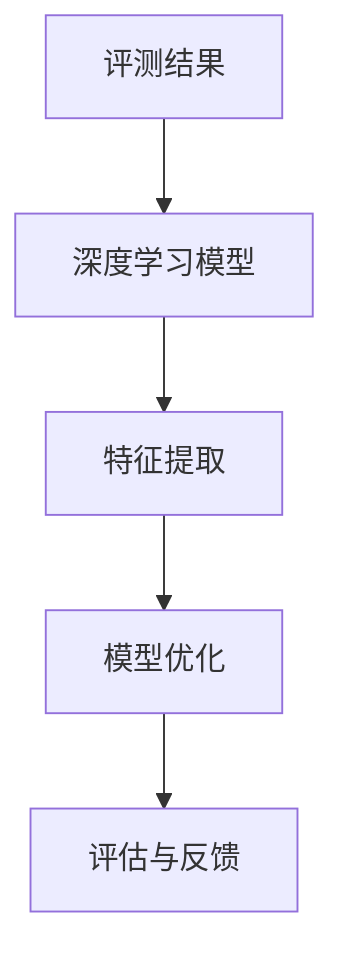
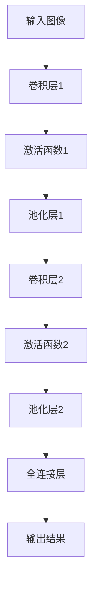
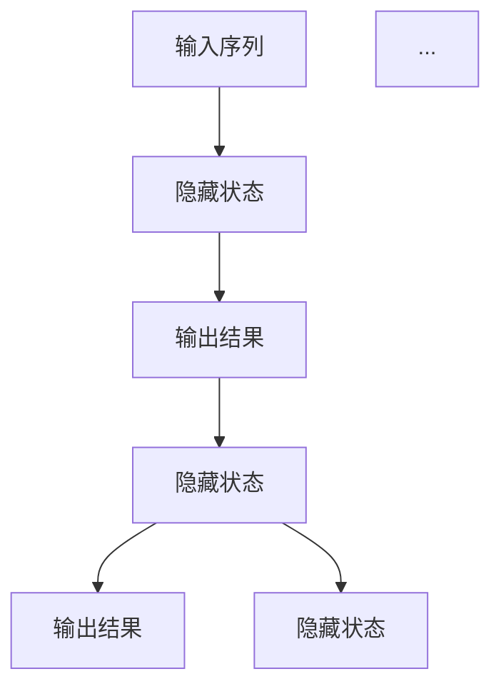
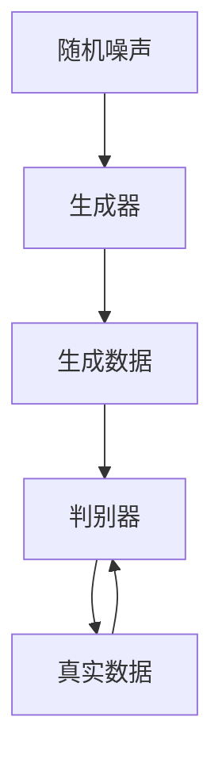

                 

## 1.1 问题背景

### 1.1.1 评测结果分析的重要性

评测结果分析在诸多领域具有重要价值，如教育、企业绩效评估、医疗诊断等。通过分析评测结果，我们可以发现数据中的趋势、异常和潜在问题，从而提供有力的决策支持。在教育领域，评测结果分析能够帮助教师了解学生的学习情况，制定个性化的教学策略；在企业绩效评估中，通过分析评测结果，管理层可以识别业务瓶颈，优化流程，提高效率；在医疗诊断中，评测结果分析有助于医生更准确地判断病情，制定治疗方案。

### 1.1.2 深度学习在评测结果分析中的应用

随着深度学习技术的不断发展，其在评测结果分析中的应用也越来越广泛。深度学习模型具有强大的特征提取和模式识别能力，能够自动地从大量数据中学习到有用的信息，从而提高评测结果的准确性和效率。例如，在图像识别任务中，深度学习模型可以自动地识别图像中的物体和场景；在自然语言处理任务中，深度学习模型可以自动地理解文本的含义和情感倾向。

### 1.1.3 构建评测结果的深度学习分析模型的必要性

构建评测结果的深度学习分析模型具有重要的现实意义。首先，传统的人工分析方法往往依赖于专家经验和手工处理，效率低下且容易出错。而深度学习分析模型可以自动化地处理大量数据，提高分析效率和准确性。其次，深度学习分析模型可以处理多维、非线性、复杂的数据，对于一些传统方法难以解决的问题，深度学习模型可以提供有效的解决方案。最后，随着大数据时代的到来，评测结果的数据量呈指数级增长，传统的分析方法已无法满足需求，而深度学习分析模型可以更好地应对这些挑战。

## 1.2 问题描述

### 1.2.1 评测结果的多样性和复杂性

评测结果的多样性和复杂性是评测结果分析面临的第一个挑战。评测结果可能来自不同的领域和数据源，数据类型和格式可能各不相同。例如，在医疗领域，评测结果可能包括病人的生理指标、病史记录、医生诊断结果等，数据类型包括数值、文本和图像等多种形式。这些多样的数据需要经过统一的预处理和特征提取，以便于深度学习模型的处理。

### 1.2.2 评测结果分析面临的挑战

评测结果分析面临的挑战主要包括：

1. 数据量庞大：随着评测场景的不断扩展，数据量呈指数级增长，传统分析方法难以应对。
2. 数据质量参差不齐：部分数据可能存在噪声、缺失和异常值，需要数据清洗和预处理。
3. 特征提取难度大：深度学习模型依赖于有效的特征提取，但评测结果的特征提取可能具有挑战性。
4. 模型选择和优化复杂：深度学习模型的参数众多，如何选择合适的模型和优化策略是关键。

### 1.2.3 目标：构建高效、准确的评测结果分析模型

构建高效、准确的评测结果分析模型是我们的目标。为了实现这一目标，我们需要：

1. 设计合适的数据预处理和特征提取方法，以提高数据质量和特征提取效果。
2. 选择合适的深度学习模型，并对其进行优化，以提高模型的性能和泛化能力。
3. 设计高效的模型训练和评估方法，以提高模型训练效率和分析准确度。
4. 考虑模型的可解释性，以便于理解和解释模型的工作原理和决策过程。

## 1.3 问题解决

### 1.3.1 深度学习基础

深度学习是一种模拟人脑神经网络结构和计算能力的机器学习技术。其基本原理是通过多层神经网络对输入数据进行层层抽象和特征提取，从而实现复杂的模式识别和预测任务。深度学习模型主要包括卷积神经网络（CNN）、循环神经网络（RNN）和生成对抗网络（GAN）等。

### 1.3.2 数据预处理与特征提取

数据预处理和特征提取是深度学习模型训练的重要环节。在深度学习分析模型中，我们需要对评测结果进行数据清洗、归一化、缺失值填充等预处理操作，以提高数据质量和特征提取效果。特征提取则是从原始数据中提取出对模型有用的特征，以便于模型学习和预测。

### 1.3.3 模型选择与优化

模型选择和优化是构建评测结果分析模型的关键步骤。在选择模型时，我们需要考虑评测结果的类型、数据规模和特征提取方法等因素。常见的深度学习模型包括卷积神经网络（CNN）、循环神经网络（RNN）和生成对抗网络（GAN）等。在模型优化方面，我们需要调整模型参数、选择合适的激活函数、正则化策略和优化算法等，以提高模型性能和泛化能力。

## 1.4 边界与外延

### 1.4.1 评测结果的深度学习分析模型适用范围

评测结果的深度学习分析模型适用于需要处理大量数据、实现自动化分析和决策的场景。具体包括：

1. 教育领域：学生成绩分析、学习习惯评估等。
2. 企业管理：员工绩效评估、客户满意度分析等。
3. 医疗诊断：病情预测、治疗方案推荐等。
4. 金融分析：市场预测、风险评估等。

### 1.4.2 模型的局限性

尽管深度学习分析模型在评测结果分析中具有广泛的应用，但它们也存在一定的局限性。主要包括：

1. 数据依赖性：深度学习模型对数据质量有较高要求，数据量不足或质量较差可能导致模型性能下降。
2. 模型解释性：深度学习模型通常具有“黑盒”特性，难以解释其决策过程，这在某些领域（如医疗诊断）可能引起争议。
3. 计算资源消耗：深度学习模型的训练和推理需要大量的计算资源和时间，对于实时性要求较高的场景可能不适用。

### 1.4.3 持续改进的方向

为了进一步提升评测结果的深度学习分析模型的性能和应用范围，我们可以从以下几个方面进行改进：

1. 数据增强：通过数据增强技术，提高数据多样性和质量，增强模型的泛化能力。
2. 可解释性增强：结合可解释性方法，提高模型的透明度和可解释性，增强用户信任。
3. 模型压缩：通过模型压缩技术，降低模型复杂度和计算资源需求，提高实时性。
4. 跨学科融合：结合心理学、认知科学等领域的知识，探索更符合人类认知和决策的评测结果分析方法。

## 1.5 本章小结

本章介绍了构建评测结果的深度学习分析模型的重要性和必要性，分析了评测结果分析面临的挑战和问题解决方法。通过本章的介绍，读者可以了解到评测结果分析的核心概念、技术原理和应用场景，为后续章节的学习和应用打下基础。深度学习分析模型在评测结果分析中具有广泛的应用前景，但也面临一定的局限性。通过不断的技术创新和优化，我们有信心进一步提升评测结果分析模型的性能和应用效果。

----------------------------------------------------------------

## 2.1 深度学习基本概念

### 2.1.1 神经网络

神经网络（Neural Networks，NN）是模仿人脑神经元结构和信息处理机制的一种计算模型。它由大量简单的处理单元（或神经元）互联而成，每个神经元负责接收输入信号、进行计算并产生输出信号。神经网络通过调整神经元之间的连接权重（权重矩阵）来实现从输入到输出的映射。神经网络具有自适应性和非线性处理能力，能够在复杂环境中学习和识别模式。

### 2.1.2 深层神经网络

深层神经网络（Deep Neural Networks，DNN）是神经网络的一种扩展，其特点是包含多个隐层。深层神经网络通过逐层抽象和特征提取，能够自动地从原始数据中提取更高层次的特征。相比单层神经网络，深层神经网络具有更强的学习和泛化能力。在图像识别、语音识别和自然语言处理等领域，深层神经网络取得了显著的成果。

### 2.1.3 反向传播算法

反向传播算法（Backpropagation Algorithm）是一种用于训练神经网络的学习算法。它通过计算输出层误差的梯度，逐层反向传播到输入层，以调整网络权重。反向传播算法的核心思想是最小化损失函数，使得网络输出与真实标签之间的误差最小。通过多次迭代训练，反向传播算法能够优化网络参数，提高模型的性能。

## 2.2 关键技术介绍

### 2.2.1 卷积神经网络（CNN）

卷积神经网络（Convolutional Neural Networks，CNN）是一种专门用于处理图像数据的神经网络。CNN 通过卷积层、池化层和全连接层等结构，实现图像特征的提取和分类。卷积层使用卷积运算来提取图像中的局部特征，池化层用于降低特征图的维度，减少计算量。CNN 在图像识别、目标检测和图像生成等领域具有广泛的应用。

### 2.2.2 循环神经网络（RNN）

循环神经网络（Recurrent Neural Networks，RNN）是一种能够处理序列数据的神经网络。RNN 通过循环结构，将前一个时间步的隐藏状态传递到下一个时间步，从而实现序列信息的传递和处理。RNN 在自然语言处理、语音识别和序列预测等领域具有广泛应用。然而，传统的 RNN 存在梯度消失和梯度爆炸问题，限制了其性能。

### 2.2.3 生成对抗网络（GAN）

生成对抗网络（Generative Adversarial Networks，GAN）是一种由生成器和判别器组成的对抗性神经网络。生成器旨在生成与真实数据相似的数据，而判别器则用于区分真实数据和生成数据。通过生成器和判别器之间的对抗训练，GAN 能够学习到真实数据的分布，并生成高质量的数据。GAN 在图像生成、数据增强和异常检测等领域具有广泛应用。

## 2.3 深度学习模型的选择

### 2.3.1 模型选择的原则

在选择深度学习模型时，需要考虑以下原则：

1. **问题类型**：根据评测结果的特点和任务类型，选择合适的模型。例如，对于图像识别任务，可以选择 CNN；对于序列数据处理任务，可以选择 RNN 或其变体。
2. **数据规模**：对于大数据集，需要选择能够处理大规模数据的模型。深度学习模型的训练时间取决于数据量和模型复杂度。
3. **计算资源**：考虑可用的计算资源，如 CPU、GPU 或 TPU 等，选择适合的模型和硬件配置。
4. **模型性能**：根据模型在验证集上的性能，选择表现良好的模型。

### 2.3.2 不同类型模型的适用场景

以下是不同类型深度学习模型的主要适用场景：

| 模型类型          | 适用场景                                       |
|-------------------|----------------------------------------------|
| 卷积神经网络（CNN） | 图像识别、目标检测、图像分割、图像生成等           |
| 循环神经网络（RNN） | 自然语言处理、语音识别、序列预测等                 |
| 生成对抗网络（GAN） | 图像生成、数据增强、异常检测等                   |
| 自注意力模型（Transformer） | 自然语言处理、机器翻译、文本生成等               |
| 多层感知机（MLP）   | 通用分类和回归任务                             |
| 支持向量机（SVM）   | 二分类任务，特别适合小样本数据集                 |
| 决策树（Decision Tree） | 数据挖掘、分类和回归任务，易解释性                 |

### 2.3.3 模型比较与评估

在深度学习模型的选择过程中，需要对不同模型进行性能比较和评估。常用的评估指标包括：

1. **准确率（Accuracy）**：分类任务中，正确预测的样本数占总样本数的比例。
2. **召回率（Recall）**：分类任务中，正确预测的正样本数占总正样本数的比例。
3. **精确率（Precision）**：分类任务中，正确预测的正样本数与预测为正样本的样本数之比。
4. **F1 分数（F1 Score）**：综合准确率和召回率的指标，用于衡量模型的平衡性。
5. **均方误差（Mean Squared Error，MSE）**：回归任务中，预测值与真实值之间差的平方的平均值。
6. **平均绝对误差（Mean Absolute Error，MAE）**：回归任务中，预测值与真实值之间差的绝对值的平均值。

### 2.4 概念属性特征对比

| 模型        | 特点                                                         | 适用场景                 |
|-------------|------------------------------------------------------------|--------------------------|
| CNN         | 使用卷积操作提取特征，具有平移不变性                             | 图像识别、目标检测、图像分割等 |
| RNN         | 使用循环结构处理序列数据，具有长期依赖性                             | 自然语言处理、语音识别等       |
| GAN         | 通过生成器和判别器对抗训练，生成高质量数据                             | 图像生成、数据增强、异常检测等   |
| Transformer | 使用自注意力机制处理序列数据，具有全局依赖性                             | 自然语言处理、机器翻译等       |

### 2.5 ER实体关系图

## 2.6 本章小结

本章介绍了深度学习的基本概念、关键技术和模型选择原则，并对比了不同类型深度学习模型的特点和适用场景。通过本章的学习，读者可以了解深度学习模型在评测结果分析中的应用，为后续章节的学习和应用打下基础。在构建评测结果的深度学习分析模型时，需要根据具体问题选择合适的模型，并进行性能评估和优化，以实现高效、准确的评测结果分析。

----------------------------------------------------------------

## 3.1 算法原理

### 3.1.1 卷积神经网络（CNN）算法原理

卷积神经网络（CNN）是一种专门用于处理图像数据的神经网络。其基本原理是通过卷积层、池化层和全连接层等结构，实现图像特征的提取和分类。CNN 具有以下主要组成部分：

1. **卷积层**：卷积层使用卷积操作提取图像中的局部特征。卷积操作通过滤波器（卷积核）在图像上滑动，计算局部区域的特征响应。通过多次卷积操作，可以提取更高层次的特征。
2. **池化层**：池化层用于降低特征图的维度，减少计算量。常见的池化操作包括最大池化和平均池化。池化操作有助于增强模型的泛化能力，防止过拟合。
3. **全连接层**：全连接层将卷积层和池化层输出的特征映射到分类结果。全连接层通过计算特征之间的线性组合，并使用激活函数（如 sigmoid、ReLU）进行非线性变换。

### 3.1.2 循环神经网络（RNN）算法原理

循环神经网络（RNN）是一种能够处理序列数据的神经网络。其基本原理是通过循环结构，将前一个时间步的隐藏状态传递到下一个时间步，从而实现序列信息的传递和处理。RNN 的主要组成部分包括：

1. **输入层**：输入层接收序列数据的每个时间步的输入。
2. **隐藏层**：隐藏层包含循环结构，将前一个时间步的隐藏状态传递到当前时间步，同时更新当前时间步的隐藏状态。
3. **输出层**：输出层将隐藏状态映射到输出结果。对于分类任务，输出层通常是一个softmax函数，用于计算每个类别的概率。

### 3.1.3 生成对抗网络（GAN）算法原理

生成对抗网络（GAN）是一种由生成器和判别器组成的对抗性神经网络。GAN 的基本原理是生成器和判别器之间的对抗训练。生成器的目标是生成与真实数据相似的数据，判别器的目标是区分真实数据和生成数据。GAN 的主要组成部分包括：

1. **生成器**：生成器接收随机噪声作为输入，通过多层神经网络生成虚假数据。
2. **判别器**：判别器接收真实数据和生成数据，并输出一个概率值，表示输入数据的真实程度。
3. **对抗训练**：生成器和判别器通过对抗训练不断优化自身。生成器试图生成更真实的数据，而判别器试图更准确地区分真实数据和生成数据。

### 3.1.4 CNN、RNN 和 GAN 的算法流程图

以下是卷积神经网络（CNN）、循环神经网络（RNN）和生成对抗网络（GAN）的算法流程图：

#### CNN 算法流程图

#### RNN 算法流程图

#### GAN 算法流程图

## 3.2 算法流程图

为了更好地理解算法原理，我们使用 Mermaid 图表语言绘制了 CNN、RNN 和 GAN 的算法流程图。

### CNN 算法流程图

### RNN 算法流程图

### GAN 算法流程图

## 3.3 数学模型和数学公式

### 3.3.1 CNN 的数学模型

CNN 的数学模型主要包括卷积操作、激活函数和池化操作。以下是一个简单的 CNN 数学模型示例：

$$
\begin{aligned}
h^{l}_{i} &= \sigma(W^{l}_{ij} \odot a^{l-1}_{j} + b^{l}_{i}), \quad \forall i, \forall j, \quad l = 1, 2, \ldots, L \\
a^{l}_{i} &= \text{pooling}(h^{l}_{i}), \quad \forall i, \quad l = 1, 2, \ldots, L \\
\text{output} &= W^{L+1}_{ji} a^{L}_{i} + b^{L+1}_{j}, \quad \forall j
\end{aligned}
$$

其中，$h^{l}_{i}$ 表示第 $l$ 层第 $i$ 个神经元的输出，$a^{l-1}_{j}$ 表示第 $l-1$ 层第 $j$ 个神经元的输出，$W^{l}_{ij}$ 和 $b^{l}_{i}$ 分别表示第 $l$ 层第 $i$ 个神经元的权重和偏置，$\sigma$ 表示激活函数（如 sigmoid、ReLU），$\odot$ 表示卷积操作，$\text{pooling}$ 表示池化操作。

### 3.3.2 RNN 的数学模型

RNN 的数学模型主要包括输入层、隐藏层和输出层。以下是一个简单的 RNN 数学模型示例：

$$
\begin{aligned}
h^{l}_{t} &= \sigma(W^{l}_{ih} x^{l}_{t} + W^{l}_{hh} h^{l}_{t-1} + b^{l}_{h}), \quad \forall t, \forall l \\
o^{l}_{t} &= W^{l}_{oh} h^{l}_{t} + b^{l}_{o}, \quad \forall t, \quad l = 1, 2, \ldots, L
\end{aligned}
$$

其中，$h^{l}_{t}$ 表示第 $l$ 层第 $t$ 个时间步的隐藏状态，$x^{l}_{t}$ 表示第 $l$ 层第 $t$ 个时间步的输入，$W^{l}_{ih}$、$W^{l}_{hh}$ 和 $b^{l}_{h}$ 分别表示输入层到隐藏层、隐藏层到隐藏层和隐藏层的权重和偏置，$W^{l}_{oh}$ 和 $b^{l}_{o}$ 分别表示隐藏层到输出层的权重和偏置，$\sigma$ 表示激活函数（如 sigmoid、ReLU）。

### 3.3.3 GAN 的数学模型

GAN 的数学模型主要包括生成器和判别器。以下是一个简单的 GAN 数学模型示例：

$$
\begin{aligned}
G(z) &= \mu_G(\theta_G) + \sigma_G(\theta_G) \odot \epsilon, \quad z \sim \mathcal{N}(0, 1) \\
D(x, G(z)) &= \sigma(D_\phi(x) + D_\phi(G(z))), \quad x \sim p_{\text{data}}(x)
\end{aligned}
$$

其中，$G(z)$ 表示生成器的输出，$z$ 表示输入的随机噪声，$\mu_G(\theta_G)$ 和 $\sigma_G(\theta_G)$ 分别表示生成器的均值函数和方差函数，$\epsilon$ 表示噪声，$D(x, G(z))$ 表示判别器的输出，$x$ 表示真实数据，$p_{\text{data}}(x)$ 表示真实数据的分布，$D_\phi(x)$ 表示判别器的损失函数，$\theta_G$ 和 $\theta_\phi$ 分别表示生成器和判别器的参数。

## 3.4 举例说明

为了更好地理解上述算法原理和数学模型，我们通过一个简单的例子进行说明。

### 3.4.1 CNN 的举例说明

假设我们有一个简单的 CNN 模型，包含一个卷积层、一个激活函数和一个池化层。输入图像大小为 $32 \times 32$，卷积核大小为 $3 \times 3$，步长为 $1$，激活函数为 ReLU，池化层使用最大池化，池化窗口大小为 $2 \times 2$。

1. **卷积层**：

$$
\begin{aligned}
h^{1}_{i} &= \text{ReLU}(W^{1}_{ij} \odot a^{0}_{j} + b^{1}_{i}), \quad \forall i, j \\
a^{1}_{i} &= \text{pooling}(h^{1}_{i}), \quad \forall i
\end{aligned}
$$

其中，$a^{0}_{j}$ 表示输入图像的像素值，$W^{1}_{ij}$ 和 $b^{1}_{i}$ 分别表示卷积层的权重和偏置。

2. **激活函数**：

$$
h^{1}_{i} = \text{ReLU}(W^{1}_{ij} \odot a^{0}_{j} + b^{1}_{i})
$$

其中，$W^{1}_{ij}$ 和 $b^{1}_{i}$ 分别表示卷积层的权重和偏置。

3. **池化层**：

$$
a^{1}_{i} = \text{pooling}(h^{1}_{i})
$$

其中，$h^{1}_{i}$ 表示卷积层的输出。

4. **输出结果**：

$$
\text{output} = W^{2}_{ji} a^{1}_{i} + b^{2}_{j}, \quad \forall j
$$

其中，$a^{1}_{i}$ 表示池化层的输出，$W^{2}_{ji}$ 和 $b^{2}_{j}$ 分别表示全连接层的权重和偏置。

### 3.4.2 RNN 的举例说明

假设我们有一个简单的 RNN 模型，包含一个输入层、一个隐藏层和一个输出层。输入序列长度为 $10$，隐藏状态维度为 $128$，输出维度为 $10$，激活函数为 ReLU。

1. **隐藏层**：

$$
\begin{aligned}
h^{1}_{t} &= \text{ReLU}(W^{1}_{ih} x^{1}_{t} + W^{1}_{hh} h^{1}_{t-1} + b^{1}_{h}), \quad \forall t \\
o^{1}_{t} &= W^{1}_{oh} h^{1}_{t} + b^{1}_{o}, \quad \forall t
\end{aligned}
$$

其中，$x^{1}_{t}$ 表示输入序列的第 $t$ 个元素，$W^{1}_{ih}$、$W^{1}_{hh}$ 和 $b^{1}_{h}$ 分别表示输入层到隐藏层、隐藏层到隐藏层和隐藏层的权重和偏置，$W^{1}_{oh}$ 和 $b^{1}_{o}$ 分别表示隐藏层到输出层的权重和偏置。

2. **输出层**：

$$
o^{1}_{t} = W^{1}_{oh} h^{1}_{t} + b^{1}_{o}, \quad \forall t
$$

其中，$h^{1}_{t}$ 表示隐藏层的输出。

### 3.4.3 GAN 的举例说明

假设我们有一个简单的 GAN 模型，包含一个生成器和判别器。生成器的输入维度为 $100$，输出维度为 $784$，判别器的输入维度为 $784$。

1. **生成器**：

$$
G(z) = \mu_G(\theta_G) + \sigma_G(\theta_G) \odot \epsilon
$$

其中，$z$ 表示输入的随机噪声，$\mu_G(\theta_G)$ 和 $\sigma_G(\theta_G)$ 分别表示生成器的均值函数和方差函数，$\epsilon$ 表示噪声。

2. **判别器**：

$$
D(x, G(z)) = \sigma(D_\phi(x) + D_\phi(G(z)))
$$

其中，$x$ 表示真实数据，$D_\phi(x)$ 表示判别器的损失函数。

## 3.5 详细讲解

在上一节中，我们介绍了卷积神经网络（CNN）、循环神经网络（RNN）和生成对抗网络（GAN）的算法原理和数学模型。在这一节中，我们将对这些算法进行详细讲解，以帮助读者更好地理解其工作原理和应用。

### 3.5.1 CNN 的详细讲解

CNN 是一种专门用于处理图像数据的神经网络，其核心在于通过卷积操作提取图像中的局部特征。下面我们详细讲解 CNN 的工作原理。

1. **卷积操作**：

卷积操作是 CNN 的核心组成部分，其目的是提取图像中的局部特征。卷积操作通过滤波器（卷积核）在图像上滑动，计算局部区域的特征响应。具体来说，卷积操作可以表示为：

$$
h^{l}_{i} = \sum_{j} W^{l}_{ij} \odot a^{l-1}_{j} + b^{l}_{i}
$$

其中，$h^{l}_{i}$ 表示第 $l$ 层第 $i$ 个神经元的输出，$a^{l-1}_{j}$ 表示第 $l-1$ 层第 $j$ 个神经元的输出，$W^{l}_{ij}$ 和 $b^{l}_{i}$ 分别表示第 $l$ 层第 $i$ 个神经元的权重和偏置，$\odot$ 表示卷积操作。

卷积操作的优点是可以减少模型参数的数量，同时保留空间信息。通过多次卷积操作，可以提取更高层次的特征，从而实现图像分类、目标检测等任务。

2. **激活函数**：

在 CNN 中，常用的激活函数包括 sigmoid、ReLU 和 tanh 等。激活函数的作用是引入非线性变换，使得神经网络具有更强的表示能力。以 ReLU 为例，其定义如下：

$$
\sigma(x) = \max(0, x)
$$

ReLU 函数在负值部分恒等于零，在正

