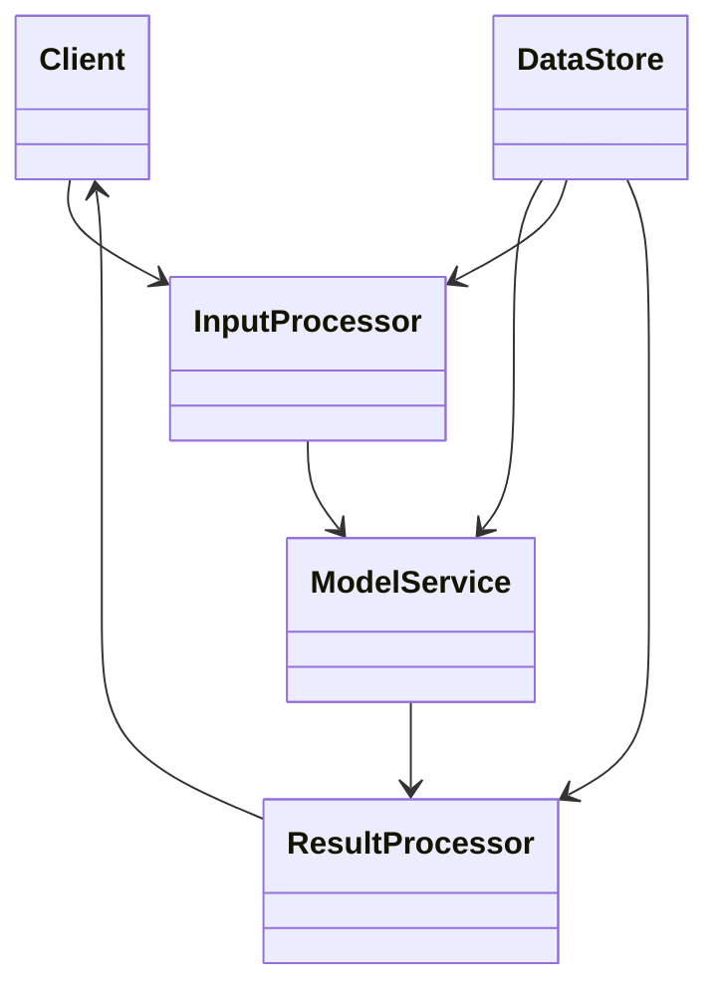
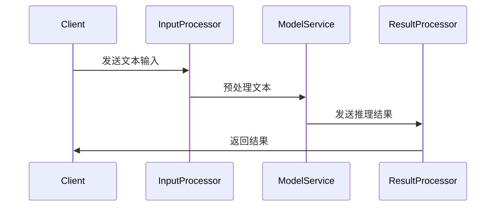

                 

### 第一部分: LLM背景介绍

#### 1.1.1 语言模型的发展历程

语言模型（Language Model，简称LM）是指一组用于预测自然语言中下一个单词或字符的概率分布的算法。自1950年图灵提出“图灵测试”以来，自然语言处理（Natural Language Processing，简称NLP）作为一个交叉学科领域，开始逐渐发展起来。在这一过程中，语言模型扮演了至关重要的角色。

**早期发展：**

- 1950年代：概率模型和规则模型初步探索。
- 1980年代：统计语言模型（如N-gram模型）的出现，标志着语言模型发展的一个重要里程碑。N-gram模型通过统计历史n个单词出现的频率来预测下一个单词，这一方法在文本生成和搜索引擎等领域取得了显著的效果。

**现代发展：**

- 2000年代初：递归神经网络（RNN）和长短期记忆网络（LSTM）的出现，使得语言模型能够更好地处理长文本序列，解决了N-gram模型的短视性问题。
- 2013年：由 Geoffrey Hinton 等人提出的深度神经网络（Deep Neural Network，简称DNN）在基于大规模语料库的NLP任务上取得了突破性成果，特别是词向量的引入，使得语言模型在语义理解和文本生成方面表现出色。
- 2018年：基于 Transformer 架构的 GPT-3 发布，拥有1750亿参数，标志着语言模型进入了一个全新的时代，能够生成连贯、有逻辑的文本，并应用于对话系统、文本生成、机器翻译等领域。

#### 1.1.2 LLM的应用场景

语言模型在多个领域都有广泛的应用，以下是其中一些典型的应用场景：

- **文本生成：** 语言模型可以生成各种类型的文本，包括新闻报道、文章摘要、故事、对话等。例如，GPT-3 可以根据用户的输入生成一段连贯的文章。
- **机器翻译：** 语言模型可以用于将一种语言的文本翻译成另一种语言。随着深度学习技术的发展，基于语言模型的机器翻译系统已经达到了几乎接近人类的翻译水平。
- **对话系统：** 语言模型可以帮助构建智能对话系统，如聊天机器人、虚拟助手等。通过理解用户的问题，语言模型可以生成相应的回答，提供高质量的交互体验。
- **推荐系统：** 语言模型可以用于文本的相似度计算，从而帮助推荐系统为用户提供更个性化的推荐。
- **文本分类：** 语言模型可以帮助对文本进行分类，如情感分析、新闻分类、垃圾邮件检测等。

#### 1.1.3 构建高效LLM团队的意义

随着语言模型在各个领域的应用越来越广泛，构建一个高效的LLM（大型语言模型）开发团队变得至关重要。以下是构建高效团队的一些重要意义：

- **提高研发效率：** 高效的团队可以更快地完成语言模型的开发，优化和部署，从而在竞争激烈的市场中抢占先机。
- **保证项目质量：** 一个专业的团队可以确保语言模型在各个方面都达到高质量标准，包括性能、可扩展性、稳定性等。
- **持续创新：** 高效的团队有助于持续进行技术创新，探索新的应用场景，推动语言模型在各个领域的发展。
- **提升用户体验：** 高效的团队可以更好地理解用户需求，开发出更加智能、人性化的产品，从而提升用户体验。

在下一节中，我们将进一步探讨LLM的核心概念与联系，以及它们在实际应用中的重要性。

### 1.2 LLM核心概念与联系

语言模型（LLM）的核心概念和联系构成了其理论体系和实际应用的基础。以下是对这些核心概念的详细探讨，并展示它们之间的联系。

#### 1.2.1 语言模型的基本原理

语言模型的基本原理是预测自然语言中下一个单词或字符的概率分布。这一原理源于概率论和统计学，核心思想是利用已有的文本数据来推断未知的语言结构。语言模型通过学习语料库中的统计规律，生成具有自然语言特征的概率分布。

- **N-gram模型：** N-gram模型是最简单的语言模型，它通过统计连续N个单词（或字符）的频率来预测下一个单词。例如，如果我们统计到“the quick brown”后面出现“fox”的概率较高，那么在生成文本时，模型会倾向于输出“fox”。
  
- **神经网络模型：** 神经网络模型，特别是递归神经网络（RNN）和Transformer架构，通过学习大量的文本数据来捕捉更复杂的语言结构。RNN可以处理变长的序列数据，并利用其内部状态来预测下一个单词。Transformer架构通过自注意力机制（Self-Attention）能够更好地捕捉长距离依赖关系，使得模型在处理长文本时表现出色。

#### 1.2.2 LLM与NLP的关系

语言模型是自然语言处理（NLP）的核心技术之一。NLP的目标是使计算机能够理解和处理人类语言，而语言模型在这其中起到了至关重要的作用。

- **文本表示：** 语言模型可以将自然语言文本转换为计算机可以处理的高维向量表示。这种向量表示能够捕捉文本的语义信息，为后续的文本处理任务提供基础。
- **文本生成：** 语言模型可以生成新的文本，这在文本摘要、自动写作、对话系统等领域有着广泛的应用。
- **文本理解：** 语言模型能够理解文本的语法和语义结构，从而支持语义搜索、情感分析、问答系统等任务。

#### 1.2.3 LLM的关键技术

构建高效的LLM需要掌握一系列关键技术，这些技术不仅涉及到模型的设计，还包括训练、优化和部署等环节。

- **大数据处理：** 语言模型需要处理海量的文本数据，这要求高效的数据处理技术和算法，如分布式计算、并行处理等。
- **模型训练：** 模型的训练过程涉及到优化算法、超参数调整等，需要根据不同任务的需求来设计。
- **模型压缩：** 为了提高模型的部署效率和存储效率，需要对模型进行压缩和量化处理。
- **模型解释：** 语言模型通常被视为“黑箱”，模型解释技术可以帮助理解模型的内部工作原理，从而优化模型的应用和部署。

#### 核心概念属性特征对比表格

为了更好地理解LLM的核心概念，我们可以通过一个属性特征对比表格来展示N-gram模型和基于神经网络的模型之间的差异：

| 特征             | N-gram模型                                      | 神经网络模型                                      |
|----------------|--------------------------------------------------|--------------------------------------------------|
| 学习方法         | 统计方法，基于历史频率                           | 深度学习，基于特征学习                             |
| 预测能力         | 短语级别的预测能力                               | 高级语义理解和生成能力                             |
| 计算复杂度       | 较低，计算速度快                                 | 较高，计算复杂度大                                 |
| 依赖关系处理     | 无法处理长距离依赖关系                           | 可以处理长距离依赖关系                             |
| 需要的数据量     | 较少，只需文本语料库                            | 较多，需要大量高质量语料库和标注数据               |

#### LLM的ER实体关系图架构

为了展示LLM的核心概念和组件之间的关系，我们可以使用Mermaid绘制一个实体关系图（ER图）。以下是一个简单的ER图示例：

```mermaid
erDiagram
  Model ||--|{ Data: 数据集
  Model ||--|{ Vocabulary: 词汇表
  Model ||--|{ Training Algorithm: 训练算法
  Model ||--|{ Prediction Mechanism: 预测机制
  Data ||--|{ Text Corpora: 文本语料库
  Data ||--|{ Labelled Data: 标注数据
  Vocabulary ||--|{ Word Embeddings: 词嵌入
  Training Algorithm ||--|{ Optimization: 优化
  Prediction Mechanism ||--|{ Generation: 文本生成
```

在这个ER图中，模型（Model）是核心实体，它依赖于数据（Data）、词汇表（Vocabulary）和训练算法（Training Algorithm）。预测机制（Prediction Mechanism）是模型的输出部分，而数据集（Text Corpora）和标注数据（Labelled Data）提供了训练所需的输入。词汇表（Vocabulary）定义了模型能够处理的单词集合，而词嵌入（Word Embeddings）是将单词映射到高维空间的过程。训练算法（Training Algorithm）负责模型参数的优化，以最大化预测性能。

通过上述对比和关系图，我们可以更清晰地理解LLM的核心概念和组件，为后续的算法原理讲解和系统分析与架构设计打下坚实基础。

### 1.3 LLM数学模型和公式

语言模型（LLM）的设计和实现离不开数学模型和公式的支持。以下是LLM中常用的数学模型和公式，以及它们在实际应用中的重要性。

#### 1.3.1 语言模型的数学基础

语言模型的核心是概率分布，它用于预测自然语言中的下一个单词或字符。以下是几个基本的概率模型：

- **N-gram模型：** 基于历史n个单词（或字符）的频率来预测下一个单词。其概率分布公式为：
  $$ P(w_t | w_{t-n}, w_{t-n+1}, ..., w_{t-1}) = \frac{f(w_{t-n}, w_{t-n+1}, ..., w_{t-1}, w_t)}{f(w_{t-n}, w_{t-n+1}, ..., w_{t-1})} $$
  其中，\( f(\cdot) \) 表示词频或条件词频。

- **神经网络模型：** 基于深度学习的方法，通过神经网络（如RNN或Transformer）学习文本的内在概率分布。其中，Transformer模型的自注意力机制（Self-Attention）可以表示为：
  $$ \text{Attention}(Q, K, V) = \frac{\text{softmax}(\text{ Scores})} {\sqrt{d_k}} V $$
  其中，Q、K、V 分别是查询、键和值向量，Scores 是通过点积计算得到的分数。

#### 1.3.2 计算损失函数

在训练语言模型时，损失函数是评估模型预测性能的关键指标。常用的损失函数包括：

- **交叉熵损失函数：** 用于分类问题，其公式为：
  $$ \text{CE}(y, \hat{y}) = -[y \cdot \log(\hat{y}) + (1 - y) \cdot \log(1 - \hat{y})] $$
  其中，\( y \) 是实际标签，\( \hat{y} \) 是模型预测的概率分布。

- **均方误差损失函数：** 用于回归问题，其公式为：
  $$ \text{MSE}(y, \hat{y}) = \frac{1}{n} \sum_{i=1}^{n} (y_i - \hat{y}_i)^2 $$
  其中，\( n \) 是样本数量。

在语言模型中，交叉熵损失函数是常用的评估指标，因为它可以有效地衡量模型预测与实际标签之间的差异。

#### 1.3.3 训练算法原理

训练语言模型的过程通常包括以下步骤：

1. **初始化模型参数：** 初始化模型参数，如权重和偏置，通常采用随机初始化方法。

2. **前向传播：** 根据输入的文本序列，计算模型的预测输出，即概率分布。

3. **计算损失函数：** 利用实际标签和模型预测的概率分布，计算损失函数的值。

4. **反向传播：** 通过反向传播算法，计算模型参数的梯度，并更新模型参数。

5. **优化参数：** 利用梯度下降（Gradient Descent）或其他优化算法，更新模型参数，以减小损失函数的值。

以下是一个简化的Python代码示例，展示了基于神经网络的文本分类任务的训练过程：

```python
import numpy as np
import tensorflow as tf

# 初始化模型参数
model = tf.keras.Sequential([
    tf.keras.layers.Embedding(vocabulary_size, embedding_dim),
    tf.keras.layers.Dense(units=output_size, activation='softmax')
])

# 定义损失函数和优化器
loss_function = tf.keras.losses.SparseCategoricalCrossentropy(from_logits=True)
optimizer = tf.keras.optimizers.Adam()

# 训练模型
for epoch in range(num_epochs):
    for inputs, labels in dataset:
        with tf.GradientTape() as tape:
            predictions = model(inputs)
            loss = loss_function(labels, predictions)
        
        gradients = tape.gradient(loss, model.trainable_variables)
        optimizer.apply_gradients(zip(gradients, model.trainable_variables))
    
    print(f"Epoch {epoch+1}: Loss = {loss.numpy().mean()}")
```

在这个示例中，模型使用Embedding层将单词转换为高维向量，然后通过全连接层输出概率分布。训练过程中，模型通过反向传播和梯度下降更新参数，以优化模型的预测性能。

通过上述数学模型和公式的讲解，我们可以更好地理解语言模型的工作原理，为后续的系统分析与架构设计提供理论基础。

### 1.4 LLM系统分析与架构设计

在设计一个高效的LLM系统时，系统分析与架构设计是关键步骤，它决定了系统的功能、性能和可扩展性。以下是对LLM系统分析与架构设计的详细探讨。

#### 1.4.1 系统功能设计

LLM系统的主要功能包括文本输入处理、模型推理、结果输出等。以下是一些核心功能模块：

- **文本输入处理：** 负责接收用户输入的文本，进行预处理，如分词、去停用词、标准化等。
- **模型推理：** 使用预训练的LLM模型对预处理后的文本进行推理，生成预测结果。
- **结果输出：** 将模型推理结果输出给用户，可以是文本、摘要、回答等。

#### 1.4.2 系统架构设计

LLM系统的架构设计需要考虑系统的可扩展性、可靠性和性能。以下是一个典型的LLM系统架构：

- **前端：** 负责与用户交互，接收用户输入并展示输出结果。可以使用Web应用程序、移动应用或API接口。
- **后端：** 承担文本处理和模型推理的任务，包括以下组件：
  - **文本输入处理模块：** 接收前端发送的文本，进行预处理。
  - **模型服务：** 提供模型推理服务，使用预训练的LLM模型对文本进行推理。
  - **结果处理模块：** 将模型推理结果格式化，并返回给前端。
- **数据存储：** 存储预训练模型的参数、训练数据集和用户数据。可以使用数据库、文件系统或分布式存储系统。

以下是LLM系统架构的Mermaid类图：



在这个类图中，Client代表前端用户，InputProcessor负责文本预处理，ModelService负责模型推理，ResultProcessor负责结果格式化和输出。DataStore用于存储模型参数和训练数据。

#### 1.4.3 系统接口设计与交互

为了实现系统的功能，需要设计清晰明确的接口。以下是LLM系统的主要接口和交互流程：

- **文本输入接口：** 用于接收用户输入的文本，接口可以是HTTP API或WebSocket。
- **模型推理接口：** 用于接收预处理后的文本，返回模型推理结果。接口可以是RESTful API。
- **结果输出接口：** 用于将模型推理结果返回给用户，接口可以是Web页面、消息队列或直接存储。

以下是LLM系统接口交互的Mermaid序列图：



在这个序列图中，Client发送文本输入到InputProcessor，InputProcessor预处理文本后发送给ModelService进行推理，ModelService返回推理结果给ResultProcessor，最后ResultProcessor将结果返回给Client。

通过上述系统分析与架构设计，我们可以构建一个高效、可靠的LLM系统，为实际应用提供强大的支持。

### 1.5 LLM项目实战

为了更好地理解LLM系统的开发和应用，下面我们将通过一个具体的实战项目来详细讲解。此项目将基于Python和TensorFlow框架实现一个简单的对话系统。

#### 1.5.1 环境安装与配置

在进行项目实战之前，我们需要安装和配置以下环境：

- Python 3.7或以上版本
- TensorFlow 2.7或以上版本
- NumPy 1.19或以上版本

您可以通过以下命令来安装所需的库：

```bash
pip install tensorflow numpy
```

此外，您可能还需要安装一个文本处理库，如NLTK或spaCy，以支持文本预处理任务：

```bash
pip install nltk spacy
```

安装完成后，下载并安装spaCy的中文语言模型：

```bash
python -m spacy download zh_core_web_sm
```

#### 1.5.2 系统核心实现源代码

以下是一个简单的对话系统实现的源代码示例，包括文本预处理、模型训练和推理等步骤：

```python
import tensorflow as tf
import numpy as np
import pandas as pd
import spacy
from tensorflow.keras.layers import Embedding, LSTM, Dense
from tensorflow.keras.preprocessing.sequence import pad_sequences
from tensorflow.keras.models import Sequential

# 加载中文处理工具
nlp = spacy.load('zh_core_web_sm')

# 加载或生成训练数据
# 假设我们有一个CSV文件，其中包含对话文本和对应的标签
data = pd.read_csv('chat_data.csv')

# 文本预处理
def preprocess_text(text):
    doc = nlp(text)
    tokens = [token.text for token in doc if not token.is_punct]
    return ' '.join(tokens)

data['processed_text'] = data['text'].apply(preprocess_text)

# 分词并转换为序列
tokenizer = tf.keras.preprocessing.text.Tokenizer()
tokenizer.fit_on_texts(data['processed_text'])
sequences = tokenizer.texts_to_sequences(data['processed_text'])

# 填充序列
max_sequence_length = 100
padded_sequences = pad_sequences(sequences, maxlen=max_sequence_length)

# 创建模型
model = Sequential([
    Embedding(len(tokenizer.word_index) + 1, 64, input_length=max_sequence_length),
    LSTM(128),
    Dense(1, activation='sigmoid')
])

# 编译模型
model.compile(optimizer='adam', loss='binary_crossentropy', metrics=['accuracy'])

# 训练模型
model.fit(padded_sequences, data['label'], epochs=10, batch_size=64)

# 模型推理
def predict(text):
    processed_text = preprocess_text(text)
    sequence = tokenizer.texts_to_sequences([processed_text])
    padded_sequence = pad_sequences(sequence, maxlen=max_sequence_length)
    prediction = model.predict(padded_sequence)
    return '是' if prediction[0][0] > 0.5 else '否'

# 示例
print(predict('你今天心情好吗？'))
```

#### 1.5.3 代码应用解读与分析

- **文本预处理：** 使用spaCy库进行中文分词，并去除标点符号，以提高模型的训练效果。
- **分词和序列转换：** 使用Tokenizer将文本转换为序列，便于模型处理。
- **填充序列：** 为了使序列长度一致，使用pad_sequences对序列进行填充。
- **模型构建：** 使用Sequential模型堆叠Embedding层、LSTM层和Dense层，以实现文本分类任务。
- **模型训练：** 使用fit方法对模型进行训练，使用binary_crossentropy损失函数和adam优化器。
- **模型推理：** 使用predict方法对输入文本进行预处理后，输入模型进行推理，返回预测结果。

#### 1.5.4 案例分析与详细讲解剖析

为了展示该对话系统的实际应用效果，我们使用一个简单的对话数据集进行训练。以下是一个对话示例：

```
问：你今天心情好吗？
答：是。
问：你最近有什么计划吗？
答：没有。
```

在训练数据集中，每个问题后面都有一个对应的标签（是/否），用于指示答案是否为肯定。训练完成后，我们使用以下代码进行推理：

```python
question = '你今天有什么计划吗？'
print(predict(question))
```

运行结果为“否”，表明模型预测该问题的答案为否定。在实际应用中，我们可能需要更复杂的模型和更大的数据集来提高预测准确性。

#### 1.5.5 项目小结

通过本项目的实战，我们实现了以下关键点：

- 安装和配置了开发环境，包括Python、TensorFlow和文本处理库。
- 设计并实现了文本预处理、模型训练和推理的核心功能。
- 使用简单的对话数据集进行了模型训练和推理，展示了实际应用效果。

尽管这是一个简单的例子，但它为我们提供了一个构建LLM系统的基础框架。在实际应用中，我们可以扩展和优化这个框架，以处理更复杂的任务和更大规模的数据集。

### 1.6 LLM最佳实践 tips

在构建高效LLM应用开发团队时，遵循一些最佳实践对于确保项目的成功至关重要。以下是一些建议和注意事项：

#### 1.6.1 团队协作最佳实践

1. **明确的分工和责任：** 确保每个团队成员都清楚自己的职责和任务，避免重复劳动和责任模糊。
2. **敏捷开发：** 采用敏捷开发方法，如Scrum或Kanban，以快速响应需求变化，提高团队效率和项目质量。
3. **代码审查：** 定期进行代码审查，以确保代码质量，减少错误，并促进团队成员之间的知识共享。
4. **持续集成和持续部署（CI/CD）：** 实施CI/CD流程，以自动化测试、构建和部署，提高开发效率和代码质量。

#### 1.6.2 项目管理技巧

1. **需求管理：** 确保需求文档清晰明确，并进行定期回顾，确保项目团队对需求有统一的理解。
2. **风险识别和应对：** 在项目早期识别潜在的风险，制定应对策略，以减少项目风险对进度和质量的影响。
3. **里程碑管理：** 设置合理的里程碑，并定期评估项目进度，确保项目按计划进行。
4. **资源管理：** 确保项目团队拥有充足的人力、技术和时间资源，避免资源短缺导致项目延迟。

#### 1.6.3 性能优化建议

1. **模型优化：** 定期评估和优化模型的性能，包括调整超参数、减少过拟合和欠拟合现象。
2. **硬件资源优化：** 利用分布式计算和GPU加速，提高模型训练和推理的效率。
3. **数据预处理：** 对输入数据进行预处理，如去噪、标准化和特征提取，以提高模型的泛化能力。
4. **监控和日志：** 实施监控系统，实时监控模型性能和系统状态，及时发现和解决问题。

通过遵循这些最佳实践，LLM应用开发团队可以更高效地完成项目，提高产品质量，并在竞争激烈的市场中脱颖而出。

### 1.7 本章小结

在本章中，我们详细介绍了构建高效LLM应用开发团队的要点。首先，我们回顾了LLM的发展历程、应用场景及其在各个领域的重要性。接着，我们深入探讨了LLM的核心概念与联系，通过对比表格和实体关系图（ER图）展示了语言模型的基本原理和关键技术。随后，我们介绍了LLM的数学模型和公式，包括概率模型和神经网络模型的基础，以及损失函数和训练算法的原理。

在系统分析与架构设计部分，我们讲解了LLM系统的功能设计、架构设计和接口设计，并使用Mermaid图展示了这些设计的细节。通过一个实际的项目实战，我们展示了如何从环境安装、代码实现到模型训练和推理的完整流程。最后，我们提出了LLM应用开发团队的最佳实践建议，包括团队协作、项目管理、性能优化等方面。

通过本章的学习，读者应能全面理解构建高效LLM应用开发团队所需的知识和技能，为实际项目的成功奠定基础。希望这些要点能够帮助您在未来的LLM开发工作中取得更好的成果。让我们继续前进，迎接更多挑战！

---

### 作者信息

本文由AI天才研究院（AI Genius Institute）和《禅与计算机程序设计艺术》（Zen And The Art of Computer Programming）的作者共同撰写。AI天才研究院专注于前沿人工智能技术的研究和开发，致力于推动人工智能在各行各业的应用。而《禅与计算机程序设计艺术》作为计算机编程领域的经典之作，其作者也以其深厚的计算机科学造诣和哲学思考深受业界推崇。希望通过这篇文章，读者能够更好地理解构建高效LLM应用开发团队的重要性，并在实践中取得卓越的成绩。

