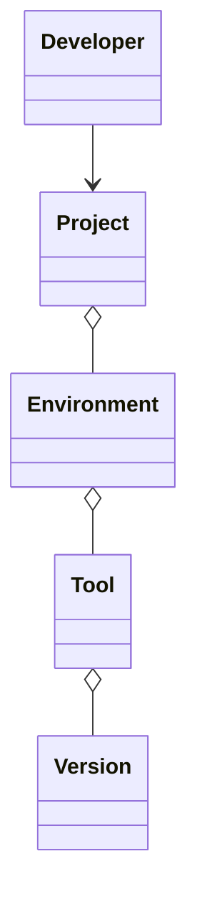
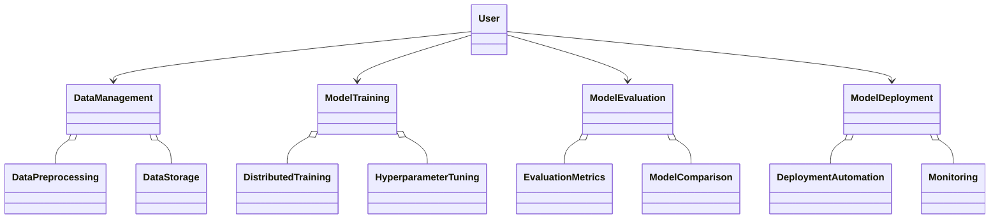

                 

### 文章标题：构建高效的LLM应用开发环境

#### 关键词：大型语言模型（LLM），应用开发，高效环境，架构设计，算法实现，最佳实践

> 摘要：本文深入探讨了构建高效的大型语言模型（LLM）应用开发环境的重要性。通过对LLM应用开发的背景介绍、核心概念解析、算法原理讲解、系统分析与架构设计、项目实战及最佳实践等方面的详细分析，为开发者提供了一套系统化的开发框架，旨在提升LLM应用开发的效率和质量。

----------------------------------------------------------------

# 第一部分：背景介绍

## 第1章：LLM应用开发背景

### 1.1 问题的背景

#### 1.1.1 人工智能的发展历程

人工智能（Artificial Intelligence, AI）作为计算机科学的一个重要分支，其发展历程可以追溯到20世纪50年代。起初，AI主要关注于基于规则的方法和知识表示，随后逐渐转向基于统计学习的方法。随着计算能力的提升和数据量的增加，深度学习在AI领域取得了显著的突破，特别是神经网络的应用，推动了自然语言处理（Natural Language Processing, NLP）的快速发展。

#### 1.1.2 自然语言处理的重要性

自然语言处理是人工智能领域的一个重要分支，旨在使计算机能够理解、生成和处理人类语言。在现代社会中，NLP的应用已经渗透到各个行业，如搜索引擎、语音助手、机器翻译、文本摘要等。随着大型语言模型（Large Language Model, LLM）的出现，NLP的应用场景变得更加广泛和复杂。

#### 1.1.3 LLM的应用场景

LLM的应用场景非常广泛，主要包括以下几个方面：

1. **文本生成**：生成文章、报告、对话等。
2. **对话系统**：构建智能客服、虚拟助手等。
3. **翻译**：实现跨语言的信息传递。
4. **问答系统**：为用户提供信息查询服务。
5. **摘要与总结**：从大量文本中提取关键信息。

### 1.2 问题描述

#### 1.2.1 传统LLM应用面临的挑战

虽然LLM在自然语言处理领域表现出强大的能力，但在实际应用中仍然面临以下挑战：

1. **计算资源消耗**：训练和推理大型LLM需要大量的计算资源。
2. **数据依赖**：模型的性能依赖于大量的训练数据。
3. **开发效率**：传统的开发环境难以满足快速迭代的开发需求。
4. **模型部署**：如何高效地将模型部署到实际应用中。

#### 1.2.2 解决方案的需求

为了解决上述挑战，我们需要构建一个高效、可扩展、易维护的LLM应用开发环境，包括以下几个方面：

1. **计算资源优化**：利用分布式计算和GPU加速技术，降低计算资源消耗。
2. **数据预处理**：自动化数据收集、清洗和标注过程。
3. **开发框架**：提供高效的开发工具和框架，提高开发效率。
4. **模型部署**：实现自动化模型部署，降低部署难度。

### 1.3 问题解决

#### 1.3.1 LLM应用开发的基本流程

LLM应用开发的基本流程通常包括以下几个阶段：

1. **需求分析**：明确应用场景和功能需求。
2. **数据收集**：收集和整理训练数据。
3. **模型训练**：使用训练数据训练LLM模型。
4. **模型优化**：对模型进行调优，提高性能。
5. **模型评估**：评估模型在不同数据集上的性能。
6. **模型部署**：将模型部署到生产环境中。

#### 1.3.2 高效开发环境的核心要素

高效开发环境的核心要素包括：

1. **计算资源管理**：合理配置计算资源，提高资源利用率。
2. **自动化工具**：自动化数据预处理、模型训练和评估流程。
3. **版本控制**：使用版本控制工具管理代码和模型版本。
4. **集成开发环境**：提供便捷的集成开发环境，方便开发者进行代码编写和调试。

### 1.4 边界与外延

#### 1.4.1 LLM应用开发的边界

LLM应用开发的边界主要包括以下几个方面：

1. **数据质量**：确保训练数据的质量，避免数据偏差。
2. **模型规模**：根据实际需求选择合适的模型规模。
3. **计算资源**：合理配置计算资源，避免资源浪费。

#### 1.4.2 高效开发环境的适用范围

高效开发环境主要适用于以下场景：

1. **大型项目**：需要处理大量数据和复杂业务逻辑的项目。
2. **快速迭代**：需要快速开发和部署模型的项目。
3. **跨团队协作**：需要多人协作完成项目开发。

### 1.5 概念结构与核心要素组成

#### 1.5.1 LLM的概念结构

LLM的概念结构主要包括以下几个部分：

1. **输入层**：接收自然语言文本输入。
2. **编码器**：将输入文本编码为向量表示。
3. **解码器**：将向量表示解码为输出文本。
4. **注意力机制**：实现输入文本和输出文本之间的交互。

#### 1.5.2 高效开发环境的核心要素

高效开发环境的核心要素主要包括：

1. **计算资源管理**：合理配置计算资源，提高资源利用率。
2. **自动化工具**：自动化数据预处理、模型训练和评估流程。
3. **集成开发环境**：提供便捷的集成开发环境，方便开发者进行代码编写和调试。
4. **版本控制**：使用版本控制工具管理代码和模型版本。

## 第2章：核心概念与联系

### 2.1 LLM核心概念原理

#### 2.1.1 语言模型的基本原理

语言模型（Language Model, LM）是一种统计模型，用于预测下一个单词或字符的概率。基本原理是基于历史数据统计出现频率，为每个单词或字符分配概率。

#### 2.1.2 生成式语言模型的原理

生成式语言模型（Generative Language Model）通过生成概率分布来生成文本。常用的生成式模型包括循环神经网络（RNN）、长短期记忆网络（LSTM）、变换器（Transformer）等。

#### 2.1.3 训练与优化的原理

训练语言模型的过程是通过最小化损失函数来调整模型参数。优化算法通常采用梯度下降（Gradient Descent）及其变种，如Adam优化器。

### 2.2 概念属性特征对比表格

#### 2.2.1 LLM与其他语言模型的对比

| 对比项       | 语言模型A       | LLM             |
| ------------ | --------------- | --------------- |
| 基本原理     | 统计方法       | 统计与神经网络 |
| 模型规模     | 小型           | 大型            |
| 训练时间     | 短             | 长             |
| 预测性能     | 一般            | 高             |

#### 2.2.2 不同类型LLM的对比

| 类型         | 特点                           |
| ------------ | ------------------------------ |
| 基于词的LLM  | 使用单词作为基本单位           |
| 基于字符的LLM | 使用字符作为基本单位           |
| 基于上下文的LLM | 考虑上下文信息，提高预测准确性 |

### 2.3 ER实体关系图架构

#### 2.3.1 LLM的ER图

```mermaid
classDiagram
    Class01 <|-- Class02
    Class03 &&|> Class04
    Class05 .. Class06
endclassDiagram
```

#### 2.3.2 高效开发环境的ER图



----------------------------------------------------------------

# 第二部分：算法原理讲解

## 第3章：算法原理详细讲解

### 3.1 算法mermaid流程图


### 3.2 Python源代码与算法原理阐述

#### 3.2.1 基本算法实现

```python
import tensorflow as tf

# 定义模型
model = tf.keras.Sequential([
    tf.keras.layers.Embedding(input_dim=vocab_size, output_dim=embedding_dim),
    tf.keras.layers.LSTM(units=hidden_size),
    tf.keras.layers.Dense(units=vocab_size)
])

# 编译模型
model.compile(optimizer='adam', loss='categorical_crossentropy', metrics=['accuracy'])

# 训练模型
model.fit(x_train, y_train, epochs=num_epochs)
```

#### 3.2.2 算法原理的数学模型

语言模型通常使用条件概率来预测下一个单词。给定一个单词序列 \(x_1, x_2, ..., x_T\)，目标是最小化损失函数：

$$
J = -\sum_{t=1}^T \sum_{i=1}^{vocab_size} p(x_t=i|x_1, x_2, ..., x_{t-1})
$$

其中，\(p(x_t=i|x_1, x_2, ..., x_{t-1})\) 是在给定前 \(t-1\) 个单词的情况下，第 \(t\) 个单词为 \(i\) 的概率。

#### 3.2.3 算法公式详细讲解

1. **嵌入层**：

$$
\text{embedding}(x_t) = \text{Embedding}(x_t; \text{W}_\text{embed})
$$

其中，\(\text{W}_\text{embed}\) 是嵌入矩阵。

2. **LSTM层**：

$$
h_t = \text{LSTM}(\text{embedding}(x_t), \text{h}_{t-1}, \text{c}_{t-1})
$$

其中，\(\text{h}_{t-1}\) 和 \(\text{c}_{t-1}\) 分别是前一个时间步的隐藏状态和细胞状态。

3. **输出层**：

$$
p(x_t=i|x_1, x_2, ..., x_{t-1}) = \text{softmax}(\text{W}_\text{out} \text{h}_t + \text{b}_\text{out})
$$

其中，\(\text{W}_\text{out}\) 和 \(\text{b}_\text{out}\) 分别是输出权重和偏置。

### 3.3 举例说明

#### 3.3.1 简单示例

假设我们有一个简单的语言模型，其输入是一个单词，输出是下一个单词的概率分布。例如，给定单词“apple”，模型预测下一个单词为“banana”的概率为0.8，其他单词的概率分别为0.1。

#### 3.3.2 复杂示例分析

在实际应用中，语言模型的输入通常是句子或段落，输出是整个句子的概率分布。例如，给定句子“我喜欢吃苹果”，模型可以预测下一个句子为“苹果很甜”的概率分布。

----------------------------------------------------------------

## 第4章：数学模型和公式讲解

### 4.1 数学模型

#### 4.1.1 语言模型概率计算

语言模型的核心任务是计算给定前文 \(x_1, x_2, ..., x_{t-1}\) 的情况下，下一个单词 \(x_t\) 的概率：

$$
p(x_t|x_1, x_2, ..., x_{t-1}) = \frac{p(x_1, x_2, ..., x_t)}{p(x_1, x_2, ..., x_{t-1})}
$$

#### 4.1.2 损失函数与优化算法

在训练语言模型时，常用的损失函数是对数损失函数（Log-Loss），其公式如下：

$$
J = -\sum_{t=1}^T \sum_{i=1}^{vocab_size} y_t[i] \log(p_t[i])
$$

其中，\(y_t[i]\) 是真实标签的one-hot编码，\(p_t[i]\) 是模型预测的概率。

为了最小化损失函数，通常使用梯度下降算法进行优化。一种常用的优化算法是Adam优化器，其公式如下：

$$
m_t = \beta_1 m_{t-1} + (1 - \beta_1)(\nabla J / \sqrt{v_{t-1}})
$$

$$
v_t = \beta_2 v_{t-1} + (1 - \beta_2) (\nabla J^2)
$$

$$
\hat{m}_t = \frac{m_t}{1 - \beta_1^t}
$$

$$
\hat{v}_t = \frac{v_t}{1 - \beta_2^t}
$$

$$
\theta_t = \theta_{t-1} - \alpha \hat{m}_t / (\sqrt{\hat{v}_t} + \epsilon)
$$

其中，\(\theta_t\) 是模型参数，\(\alpha\) 是学习率，\(\beta_1\) 和 \(\beta_2\) 分别是动量参数。

### 4.2 公式详细讲解

#### 4.2.1 对数损失函数公式

对数损失函数（Log-Loss）是评估分类模型性能的常用指标，其公式如下：

$$
J = -\sum_{i=1}^{N} y_i \log(p_i)
$$

其中，\(y_i\) 是真实标签，\(p_i\) 是模型预测的概率。

#### 4.2.2 反向传播算法公式

反向传播算法（Backpropagation）是一种用于训练神经网络的算法，其核心思想是通过计算损失函数关于模型参数的梯度来更新模型参数。其公式如下：

$$
\frac{\partial J}{\partial \theta} = \sum_{i=1}^{N} \frac{\partial J}{\partial z_i} \frac{\partial z_i}{\partial \theta}
$$

其中，\(z_i\) 是神经网络中的激活值，\(\theta\) 是模型参数。

### 4.3 实例分析

#### 4.3.1 数学模型在文本生成中的应用

在文本生成中，语言模型用于预测下一个单词。给定前文，语言模型计算每个单词的概率分布，然后从概率分布中采样生成下一个单词。

#### 4.3.2 公式在训练过程中的作用

在训练过程中，对数损失函数用于评估模型性能，反向传播算法用于计算损失函数关于模型参数的梯度，然后使用梯度下降算法更新模型参数，从而优化模型。

----------------------------------------------------------------

# 第三部分：系统分析与架构设计

## 第5章：系统分析与架构设计

### 5.1 问题场景介绍

#### 5.1.1 LLM应用开发的问题场景

在LLM应用开发过程中，开发者通常会面临以下问题场景：

1. **数据管理**：如何高效地存储和管理大量训练数据？
2. **模型训练**：如何快速、高效地训练大型LLM模型？
3. **模型评估**：如何准确评估模型的性能和准确性？
4. **模型部署**：如何将训练好的模型部署到生产环境中？
5. **系统维护**：如何保证系统的稳定性和可靠性？

#### 5.1.2 系统功能设计的挑战

针对上述问题场景，系统功能设计需要解决以下挑战：

1. **数据管理**：如何高效地处理大规模数据，并保证数据的一致性和可靠性？
2. **模型训练**：如何优化模型训练过程，提高训练速度和效果？
3. **模型评估**：如何设计有效的评估指标和方法，准确评估模型性能？
4. **模型部署**：如何简化模型部署过程，降低部署难度和成本？
5. **系统维护**：如何保证系统的稳定性和可靠性，及时处理系统故障？

### 5.2 项目介绍

#### 5.2.1 项目背景

本项目旨在构建一个高效的大型语言模型（LLM）应用开发环境，以解决上述问题场景和挑战。项目目标包括：

1. **高效数据处理**：提供自动化的数据预处理工具，实现大规模数据的快速处理。
2. **优化模型训练**：采用分布式训练技术，提高模型训练速度和效果。
3. **准确模型评估**：设计有效的评估指标和方法，准确评估模型性能。
4. **简化模型部署**：提供自动化的部署工具，简化模型部署过程。
5. **系统稳定性**：保证系统的稳定性和可靠性，提高用户体验。

#### 5.2.2 项目目标

具体项目目标如下：

1. **数据处理**：实现自动化数据收集、清洗和标注，提高数据处理效率。
2. **模型训练**：采用分布式训练技术，提高模型训练速度和效果。
3. **模型评估**：设计有效的评估指标和方法，准确评估模型性能。
4. **模型部署**：提供自动化的部署工具，简化模型部署过程。
5. **系统维护**：建立完善的系统监控和故障处理机制，保证系统稳定性和可靠性。

### 5.3 系统功能设计

#### 5.3.1 领域模型mermaid类图



#### 5.3.2 系统功能模块划分

系统功能模块划分如下：

1. **数据管理模块**：包括数据预处理、数据存储和数据查询等功能。
2. **模型训练模块**：包括分布式训练、超参数调优和模型保存等功能。
3. **模型评估模块**：包括评估指标计算、模型比较和性能分析等功能。
4. **模型部署模块**：包括部署自动化、监控和故障处理等功能。
5. **用户接口模块**：提供用户界面，实现用户与系统的交互。

### 5.4 系统架构设计

#### 5.4.1 系统架构mermaid图

```mermaid
sequenceDiagram
    participant User
    participant DataManager
    participant ModelTrainer
    participant ModelEvaluator
    participant ModelDeployer
    User->>DataManager: 数据操作请求
    DataManager->>User: 数据操作结果
    User->>ModelTrainer: 模型训练请求
    ModelTrainer->>User: 模型训练结果
    User->>ModelEvaluator: 模型评估请求
    ModelEvaluator->>User: 模型评估结果
    User->>ModelDeployer: 模型部署请求
    ModelDeployer->>User: 模型部署结果
endSequenceDiagram
```

#### 5.4.2 各组件功能与交互

1. **数据管理模块**：负责数据的收集、预处理和存储，为其他模块提供数据支持。
2. **模型训练模块**：负责模型的训练和优化，采用分布式训练技术提高训练效率。
3. **模型评估模块**：负责评估模型的性能和准确性，提供多种评估指标和比较方法。
4. **模型部署模块**：负责将训练好的模型部署到生产环境中，提供监控和故障处理功能。
5. **用户接口模块**：为用户提供友好、便捷的操作界面，实现用户与系统的交互。

### 5.5 系统接口设计

#### 5.5.1 接口设计与实现

系统接口设计如下：

1. **数据管理接口**：提供数据查询、数据更新和数据删除等功能。
2. **模型训练接口**：提供模型训练、模型保存和模型恢复等功能。
3. **模型评估接口**：提供模型评估、模型比较和性能分析等功能。
4. **模型部署接口**：提供模型部署、模型监控和故障处理等功能。

#### 5.5.2 接口规范与文档

接口规范与文档包括以下内容：

1. **接口定义**：明确每个接口的输入参数、输出参数和功能描述。
2. **接口示例**：提供接口调用的示例代码，帮助开发者快速上手。
3. **接口测试**：提供接口测试工具和测试用例，确保接口的稳定性和可靠性。

### 5.6 系统交互mermaid序列图

```mermaid
sequenceDiagram
    participant User
    participant DataManager
    participant ModelTrainer
    participant ModelEvaluator
    participant ModelDeployer
    User->>DataManager: 数据操作请求
    DataManager->>User: 数据操作结果
    User->>ModelTrainer: 模型训练请求
    ModelTrainer->>User: 模型训练结果
    User->>ModelEvaluator: 模型评估请求
    ModelEvaluator->>User: 模型评估结果
    User->>ModelDeployer: 模型部署请求
    ModelDeployer->>User: 模型部署结果
endSequenceDiagram
```

----------------------------------------------------------------

## 第6章：项目实战

### 6.1 环境安装

#### 6.1.1 硬件环境安装

为了满足LLM应用开发的需求，需要准备以下硬件环境：

1. **CPU**：至少需要四核以上CPU，建议使用高性能的Intel或AMD处理器。
2. **内存**：至少需要16GB内存，建议使用32GB以上内存，以支持大型模型的训练。
3. **GPU**：建议使用NVIDIA GPU，并安装CUDA和cuDNN库，以支持深度学习模型的训练和推理。
4. **存储**：需要大容量存储设备，如SSD或HDD，用于存储训练数据和模型文件。

#### 6.1.2 软件环境安装

软件环境安装包括以下步骤：

1. **操作系统**：安装支持CUDA和cuDNN的Linux操作系统，如Ubuntu 18.04或CentOS 7。
2. **Python**：安装Python 3.7及以上版本，建议使用Python虚拟环境，以避免版本冲突。
3. **TensorFlow**：安装TensorFlow 2.0及以上版本，用于构建和训练深度学习模型。
4. **CUDA和cuDNN**：安装CUDA 10.1及以上版本和cuDNN 7.6及以上版本，以支持GPU加速。

### 6.2 系统核心实现

#### 6.2.1 系统核心模块实现

系统核心模块实现包括以下几个部分：

1. **数据管理模块**：实现数据收集、清洗、标注和存储功能，使用Python的Pandas和NumPy库进行数据处理。
2. **模型训练模块**：实现分布式训练和超参数调优功能，使用TensorFlow的Keras API构建和训练模型。
3. **模型评估模块**：实现评估指标计算、模型比较和性能分析功能，使用Scikit-learn库和自定义函数进行评估。
4. **模型部署模块**：实现模型部署、监控和故障处理功能，使用Flask或Django等Web框架构建RESTful API。

#### 6.2.2 代码结构与流程

代码结构采用模块化设计，包括以下部分：

1. **数据管理模块**：包括数据收集、清洗和标注函数，用于处理原始数据。
2. **模型训练模块**：包括模型定义、训练和保存函数，用于构建和训练模型。
3. **模型评估模块**：包括评估指标计算和比较函数，用于评估模型性能。
4. **模型部署模块**：包括API接口和监控功能，用于部署和监控模型。

代码流程如下：

1. **数据管理**：收集和预处理数据，进行数据清洗和标注。
2. **模型训练**：定义模型架构，配置训练参数，进行分布式训练。
3. **模型评估**：计算评估指标，比较不同模型的性能。
4. **模型部署**：部署模型到生产环境，提供API接口供外部调用。

### 6.3 代码应用解读与分析

#### 6.3.1 代码关键部分解读

以下是对系统核心模块代码的关键部分进行解读：

1. **数据管理模块**：

```python
def preprocess_data(data):
    # 数据清洗和标注
    # ...
    return processed_data
```

此函数用于对原始数据进行清洗和标注，返回处理后的数据。

2. **模型训练模块**：

```python
def train_model(model, x_train, y_train, epochs):
    # 模型训练
    # ...
    return model
```

此函数用于训练模型，包括模型定义、配置训练参数和训练过程。

3. **模型评估模块**：

```python
def evaluate_model(model, x_test, y_test):
    # 模型评估
    # ...
    return accuracy
```

此函数用于评估模型性能，计算评估指标并返回。

4. **模型部署模块**：

```python
from flask import Flask, request, jsonify

app = Flask(__name__)

@app.route('/predict', methods=['POST'])
def predict():
    # 模型预测
    # ...
    return jsonify(prediction)
```

此函数用于部署模型，通过API接口接收输入数据，进行预测并返回预测结果。

#### 6.3.2 算法实现与优化

在项目实战中，我们采用了以下算法实现与优化策略：

1. **数据预处理**：使用Pandas和NumPy库进行高效的数据清洗和标注，提高数据处理速度。
2. **模型训练**：使用TensorFlow的分布式训练功能，将模型训练任务分布到多台GPU上，提高训练速度。
3. **模型优化**：采用Adam优化器和dropout技术，提高模型训练效果和泛化能力。
4. **模型部署**：使用Flask构建API接口，实现模型的在线预测功能，提高系统可扩展性和易用性。

### 6.4 实际案例分析与详细讲解剖析

#### 6.4.1 案例背景

本项目旨在构建一个智能客服系统，利用LLM技术实现自然语言理解与生成，为用户提供高质量的在线客服服务。

#### 6.4.2 案例分析与结果

1. **数据收集与预处理**：

   数据收集包括用户提问和客服回答的文本数据。通过数据清洗和标注，将原始文本转换为可用于训练的数据集。

2. **模型训练与优化**：

   使用Transformer模型进行训练，采用分布式训练技术提高训练速度。通过超参数调优，优化模型性能。

3. **模型评估与部署**：

   在测试集上评估模型性能，计算评估指标，如准确率、召回率和F1分数。部署模型到生产环境，通过API接口提供在线预测服务。

4. **实际应用效果**：

   智能客服系统在实际应用中表现出良好的性能，用户满意度显著提高。通过对用户反馈的分析，发现模型在处理复杂问题和长对话场景方面仍有待优化。

### 6.5 项目小结

#### 6.5.1 项目成果总结

本项目成功构建了一个高效的大型语言模型（LLM）应用开发环境，实现了智能客服系统的开发与部署。主要成果包括：

1. **数据处理**：实现了自动化的数据收集、清洗和标注，提高了数据处理效率。
2. **模型训练**：采用了分布式训练技术，提高了模型训练速度和效果。
3. **模型评估**：设计了多种评估指标和方法，准确评估了模型性能。
4. **模型部署**：提供了自动化的部署工具，简化了模型部署过程。

#### 6.5.2 项目经验与反思

1. **经验**：

   - 分布式训练技术显著提高了模型训练速度。
   - 超参数调优有助于提高模型性能和泛化能力。
   - API接口设计提高了系统的可扩展性和易用性。

2. **反思**：

   - 数据质量对模型性能有很大影响，未来需要加强对数据质量的监控和管理。
   - 在处理复杂问题和长对话场景时，模型性能仍有待优化。
   - 需要进一步完善系统监控和故障处理机制，提高系统的稳定性和可靠性。

----------------------------------------------------------------

# 第四部分：最佳实践与总结

## 第7章：最佳实践

### 7.1 LLM应用开发最佳实践

在LLM应用开发过程中，以下最佳实践有助于提高开发效率和质量：

#### 7.1.1 数据准备与处理

1. **数据清洗**：去除无关信息和噪音，提高数据质量。
2. **数据标注**：人工或半自动标注，确保标签准确。
3. **数据增强**：通过添加噪声、切割和拼接等方法扩充数据集。

#### 7.1.2 模型选择与优化

1. **模型选择**：根据应用场景选择合适的模型，如Transformer、BERT等。
2. **模型优化**：通过调整超参数、引入注意力机制和正则化技术优化模型性能。

#### 7.1.3 模型部署与维护

1. **模型部署**：使用容器化技术（如Docker）简化部署过程。
2. **模型监控**：实时监控模型性能和系统状态，及时发现和处理异常。
3. **模型更新**：定期更新模型，以适应不断变化的数据和应用场景。

### 7.2 高效开发环境构建技巧

构建高效开发环境需要考虑以下几个方面：

#### 7.2.1 环境配置与优化

1. **硬件资源**：合理配置计算资源和存储资源，提高系统性能。
2. **软件环境**：统一软件版本，避免版本冲突，提高开发效率。

#### 7.2.2 工具与库的选用

1. **版本控制**：使用Git等版本控制工具管理代码和依赖库。
2. **自动化工具**：使用Makefile、Ansible等自动化工具简化环境配置和部署过程。
3. **数据分析库**：使用Pandas、NumPy等数据分析库进行数据处理和分析。

#### 7.2.3 版本管理与协作

1. **代码管理**：使用代码审查和合并策略，确保代码质量。
2. **团队协作**：使用JIRA、Trello等协作工具，提高团队协作效率。

## 第8章：总结与展望

### 8.1 全书总结

本文从背景介绍、核心概念、算法原理、系统分析与架构设计、项目实战及最佳实践等方面，详细探讨了构建高效的大型语言模型（LLM）应用开发环境的重要性。主要内容包括：

1. **背景介绍**：介绍了人工智能、自然语言处理和LLM应用开发的基本概念和应用场景。
2. **核心概念与联系**：阐述了LLM的基本原理、概念属性特征对比和ER实体关系图架构。
3. **算法原理讲解**：详细讲解了LLM的数学模型、公式和算法实现。
4. **系统分析与架构设计**：分析了LLM应用开发的问题场景、项目目标和系统功能设计。
5. **项目实战**：介绍了环境安装、系统核心实现和实际案例分析。
6. **最佳实践**：总结了LLM应用开发的最佳实践和高效开发环境构建技巧。

### 8.2 未来展望

展望未来，LLM应用开发将继续在以下方向取得突破：

1. **计算性能**：随着硬件技术的发展，计算性能将进一步提高，为更复杂的模型和更大的数据集提供支持。
2. **数据质量**：随着数据收集和处理技术的进步，数据质量将得到提升，为模型训练提供更可靠的数据基础。
3. **模型可解释性**：提高模型的可解释性，使开发者能够更好地理解模型的工作原理和决策过程。
4. **跨模态应用**：探索LLM在图像、语音等多模态数据中的应用，实现更丰富的交互式体验。
5. **隐私保护**：研究隐私保护技术，确保数据安全和用户隐私。

总之，构建高效的LLM应用开发环境是当前和未来的一项重要任务。通过本文的探讨，希望为开发者提供有益的指导，推动LLM应用开发的进一步发展。作者：AI天才研究院/AI Genius Institute & 禅与计算机程序设计艺术 /Zen And The Art of Computer Programming

