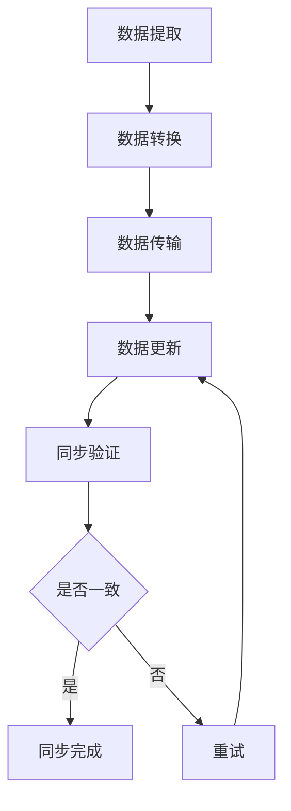
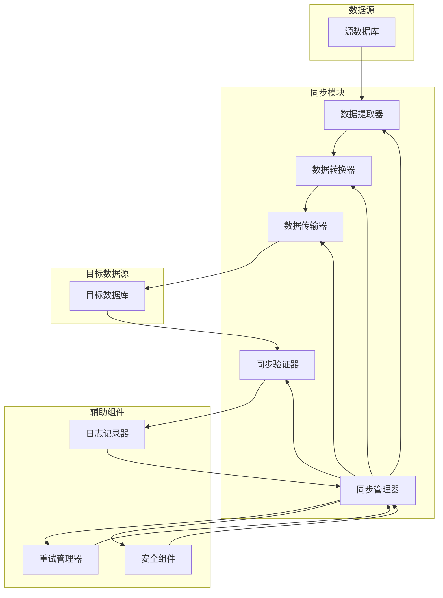
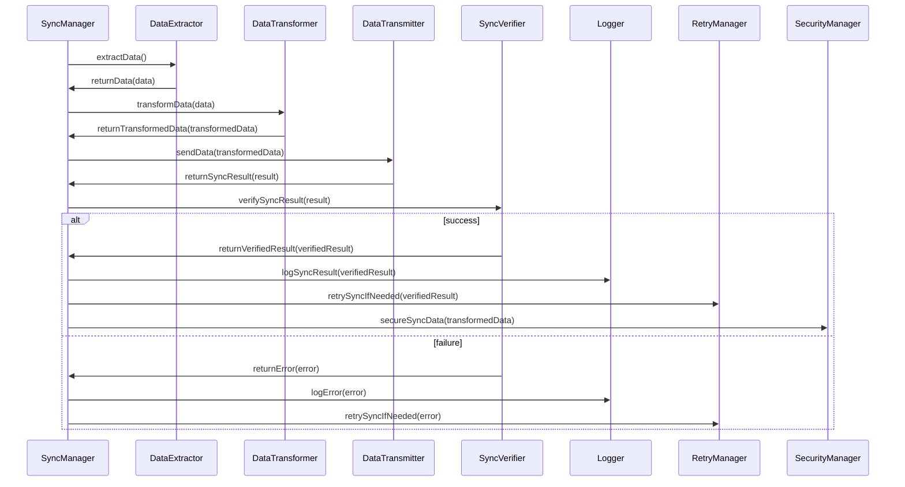

                 

### 第1章：问题背景与定义

#### 1.1.1 数据同步机制的重要性

数据同步机制在当今数字化社会中扮演着至关重要的角色。随着企业、组织和个人的数据量日益增加，数据同步变得愈加复杂且不可或缺。数据同步机制的核心目标是在不同数据源之间保持数据的一致性和准确性。无论是在企业级应用、云计算、物联网（IoT）还是在人工智能（AI）领域，高效的数据同步都是实现系统稳定运行和业务逻辑顺畅的关键。

在现代信息系统中，数据同步的重要性体现在以下几个方面：

1. **数据一致性**：确保不同系统或数据库中的数据保持一致，避免由于数据更新不及时或错误导致的业务决策失误。
2. **实时性**：确保系统能够快速响应数据变化，提高业务流程的效率和响应速度。
3. **可靠性**：保障数据同步机制的稳定性和可靠性，防止数据丢失或损坏。
4. **可扩展性**：随着系统规模的扩大，数据同步机制应能够灵活扩展，支持更多的数据源和更大的数据处理量。

#### 1.1.2 LLM应用中的数据同步需求

大型语言模型（LLM，Large Language Model）作为一种强大的AI技术，被广泛应用于自然语言处理、智能客服、文本生成、机器翻译等多个领域。然而，LLM应用对数据同步提出了更高的要求。原因如下：

1. **大规模数据集**：LLM训练和运行需要依赖大量的文本数据，这些数据通常分布在不同的数据源中，需要通过数据同步机制进行整合。
2. **实时更新**：在动态变化的业务环境中，LLM应用需要实时获取最新的数据，以便提供更准确的预测和分析结果。
3. **数据一致性**：为了确保LLM模型的性能和预测准确性，需要保证数据同步过程中的一致性，避免由于数据不一致导致的错误。
4. **隐私保护**：在处理敏感数据时，需要确保数据同步机制的安全性，防止数据泄露。

#### 1.1.3 数据同步机制的边界与外延

数据同步机制的定义和边界在不同的应用场景中有所差异。一般来说，数据同步机制涉及以下几个方面：

1. **数据源**：指数据同步的起始点，可以是数据库、文件系统、API或其他数据存储系统。
2. **同步策略**：定义数据同步的方式和频率，包括增量同步和全量同步、同步的触发条件等。
3. **同步过程**：包括数据提取、转换、传输和更新等环节，确保数据在不同系统之间的一致性和准确性。
4. **同步结果**：数据同步完成后，需要验证同步结果是否符合预期，包括数据一致性检查、错误处理和日志记录等。

数据同步机制的外延还包括：

1. **一致性保障**：通过分布式事务、锁机制、两阶段提交等手段，确保数据在不同系统之间的一致性。
2. **故障恢复**：在数据同步过程中，系统可能会遇到各种故障，需要具备故障恢复能力，确保数据同步的连续性和稳定性。
3. **性能优化**：为了提高数据同步的效率，可以采用数据压缩、并行处理、缓存等技术手段。
4. **安全性**：保障数据在传输和存储过程中的安全性，防止数据泄露或篡改。

总之，数据同步机制是现代信息系统中的关键组成部分，其设计和实现需要综合考虑数据一致性、实时性、可靠性和可扩展性等多方面因素，以适应复杂多变的业务需求。

### 2.1.1 数据同步的基本概念

#### 2.1.1.1 同步类型与原理

数据同步可以大致分为两种基本类型：增量同步和全量同步。

**增量同步**：仅同步上次同步以来发生变化的数据，通过记录变化前的数据和变化后的数据，实现部分数据的更新。其优点是效率高，传输成本低，适合数据量较大且变化频繁的场景。然而，增量同步需要精确跟踪数据变化，对同步机制的实现要求较高。

**全量同步**：同步整个数据集，不论数据是否发生变化。这种方式简单直接，但传输成本高，且在数据量巨大时可能导致同步时间长、资源消耗大。尽管如此，全量同步在某些场景下（如数据初始化或系统重构）仍具有不可替代的作用。

数据同步的基本原理可以概括为以下几个步骤：

1. **数据提取**：从数据源中提取需要同步的数据，可以是全量提取或增量提取。
2. **数据转换**：将提取的数据转换为统一格式或适应目标系统的格式，包括数据清洗、格式转换、编码转换等。
3. **数据传输**：将转换后的数据传输到目标系统，可以采用不同的传输方式，如文件传输、数据库复制、API调用等。
4. **数据更新**：在目标系统中执行数据更新操作，可以是直接更新、插入新数据或删除旧数据。
5. **同步验证**：验证数据同步的结果，确保数据在目标系统中的一致性和准确性。

#### 2.1.1.2 同步策略与实现

数据同步策略直接影响同步效率、一致性和可靠性。常见的同步策略包括以下几种：

**基于时间戳的增量同步**：利用时间戳记录数据最后一次更新时间，仅同步时间戳发生变化的数据。这种方式需要确保数据源和目标系统的时间戳一致性。

**基于版本号的增量同步**：使用版本号来标识数据的更新状态，每次同步仅传输版本号发生变化的记录。这种策略在分布式系统中较为常见。

**全量同步**：周期性地同步整个数据集，适用于数据量较小或变化频率较低的场景。例如，每天或每周进行一次全量同步。

**基于事件触发的同步**：根据数据变化的事件（如数据库触发器、消息队列等）触发同步操作，适用于实时性要求较高的场景。

数据同步的实现通常涉及以下几个关键组件：

1. **数据同步代理**：负责协调和管理数据同步过程，可以是独立的服务或集成在应用程序中。
2. **数据源接口**：提供与数据源的连接和访问接口，支持数据提取和更新操作。
3. **转换引擎**：负责数据转换操作，确保数据格式和结构的一致性。
4. **传输模块**：实现数据传输，可以是文件传输、数据库复制、HTTP请求等。
5. **同步监控与日志**：监控同步过程，记录同步日志，便于问题排查和性能优化。

在实现数据同步时，还需考虑以下因素：

- **数据一致性**：确保同步过程中数据的一致性，可以采用分布式事务、锁机制等手段。
- **错误处理**：同步过程中可能出现各种错误，如数据源不可达、数据格式错误等，需要具备自动错误处理能力。
- **性能优化**：通过并行处理、缓存等技术提高同步效率，满足大规模数据处理的性能需求。
- **安全性**：确保数据在传输和存储过程中的安全性，防止数据泄露或篡改。

总之，数据同步机制的设计和实现需要综合考虑多种因素，以实现高效、可靠和一致的数据同步。

### 2.1.2 LLM应用的特点与需求

#### 2.1.2.1 LLM的基本原理

大型语言模型（LLM）是一种基于深度学习的自然语言处理技术，其核心目标是理解和生成人类语言。LLM的基本原理主要包括以下几个关键环节：

1. **数据预处理**：收集和整理大规模的文本数据，进行清洗、分词、去停用词等预处理操作，以便构建训练数据集。
2. **模型训练**：使用预处理后的数据集训练神经网络模型，通过反向传播算法优化模型参数，使其能够捕捉语言的结构和语义信息。
3. **优化与调参**：在训练过程中，不断调整模型参数，如学习率、批量大小等，以优化模型性能。
4. **模型部署**：将训练好的模型部署到生产环境，用于文本生成、翻译、问答等实际应用场景。

#### 2.1.2.2 LLM在应用中的挑战

尽管LLM在自然语言处理领域取得了显著成果，但其实际应用仍然面临诸多挑战：

1. **数据质量**：LLM的训练和运行高度依赖于数据质量，数据中的错误、噪声和重复信息都可能影响模型性能。
2. **数据同步**：在多个数据源中维护数据一致性是LLM应用的一大难题，特别是在动态变化的业务环境中，数据更新频繁，需要实时同步。
3. **计算资源**：LLM模型通常需要大量的计算资源和存储空间，尤其是在训练阶段，对硬件设施和资源配置提出了高要求。
4. **实时性**：许多LLM应用需要在实时环境中提供快速响应，这对数据同步和处理速度提出了严格要求。
5. **安全性与隐私**：在处理敏感数据时，需要确保数据同步机制的安全性，防止数据泄露或篡改。

#### 2.1.3 数据同步机制在LLM应用中的角色与作用

数据同步机制在LLM应用中具有至关重要的角色，其主要作用包括：

1. **数据一致性**：确保LLM模型在不同数据源中的数据保持一致，避免由于数据不一致导致的模型预测错误。
2. **实时更新**：实现数据同步机制，确保LLM模型能够实时获取最新的数据，提供准确、及时的预测和分析结果。
3. **高效处理**：优化数据同步算法和策略，提高数据处理效率，减少模型训练和运行的时间成本。
4. **故障恢复**：在数据同步过程中，系统可能会遇到各种故障，需要具备故障恢复能力，确保数据同步的连续性和稳定性。
5. **安全保护**：保障数据在传输和存储过程中的安全性，防止数据泄露或篡改，确保LLM应用的可靠性和数据隐私。

综上所述，数据同步机制在LLM应用中不仅是实现数据一致性和实时性的关键手段，也是提升模型性能和确保应用安全的重要保障。只有通过科学、合理的数据同步机制设计，才能充分发挥LLM在自然语言处理领域的巨大潜力。

### 2.1.3.1 数据同步机制的必要性

在LLM应用中，数据同步机制的必要性体现在以下几个方面：

首先，数据一致性是保障LLM模型性能和可靠性的基础。由于LLM模型训练和运行依赖于大规模的文本数据集，这些数据通常分布在不同的数据源中，如数据库、文件系统、云存储等。如果不同数据源之间的数据不一致，可能会导致模型预测结果的误差，进而影响业务决策的准确性。

其次，实时数据更新对于LLM应用的动态响应能力至关重要。许多LLM应用需要实时处理和分析不断变化的数据，例如，智能客服系统需要实时响应用户的提问，机器翻译系统需要实时翻译最新的文本内容。如果不能及时同步更新数据，模型将无法适应实时变化的业务需求，导致响应速度缓慢、预测不准确。

此外，数据同步机制在高效处理和故障恢复方面也发挥着关键作用。在处理大规模数据集时，高效的同步算法和策略可以显著提高数据处理效率，减少模型训练和运行的时间成本。同时，在数据同步过程中，系统可能会遇到各种故障，如网络中断、数据源不可达等。具备故障恢复能力的同步机制可以确保数据同步的连续性和稳定性，避免因故障导致的数据丢失或错误。

最后，数据同步机制在保障数据安全与隐私方面也具有重要意义。在处理敏感数据时，如用户个人隐私信息、商业机密等，需要确保数据同步过程中的安全性。通过采用加密、权限控制等安全措施，可以有效防止数据泄露或篡改，确保LLM应用的可靠性和数据隐私。

总之，数据同步机制在LLM应用中不仅是实现数据一致性和实时性的关键手段，也是提升模型性能、确保应用安全的重要保障。科学合理的数据同步机制设计，将有效提升LLM应用的稳定性和可靠性，充分发挥其在自然语言处理领域的巨大潜力。

### 2.1.3.2 数据同步机制的实现与优化

实现和优化数据同步机制是确保LLM应用稳定、高效运行的关键步骤。以下将详细探讨数据同步机制的设计思路、实现方法以及优化策略。

#### 数据同步机制的设计思路

1. **一致性保障**：首先，需要明确数据同步的目标和一致性要求。在LLM应用中，一致性可以分为强一致性和最终一致性。强一致性要求在所有数据副本之间保持完全一致，而最终一致性则允许短暂的延迟，但最终会达到一致状态。根据业务需求选择合适的一致性策略。

2. **数据同步策略**：数据同步策略决定了同步的频率和方式。在LLM应用中，常见的同步策略包括全量同步和增量同步。全量同步适用于数据量较小且变化不频繁的场景，而增量同步则适用于数据量大且变化频繁的场景。

3. **数据转换**：在同步过程中，数据需要从源系统转换为适应目标系统的格式。数据转换包括数据清洗、格式转换、编码转换等步骤，确保数据的一致性和准确性。

4. **数据传输**：数据传输是数据同步的核心环节。根据数据传输的实时性和可靠性要求，可以选择不同的传输方式，如文件传输、数据库复制、API调用等。

5. **同步验证**：数据同步完成后，需要验证同步结果的一致性和准确性。可以通过比较源数据和目标数据、执行一致性检查等方式进行验证。

#### 数据同步机制的实现方法

1. **分布式事务**：在分布式系统中，数据同步需要通过分布式事务来保障数据一致性。分布式事务通过两阶段提交（2PC）或三阶段提交（3PC）协议，确保多个节点之间的一致性操作。

2. **消息队列**：使用消息队列（如Kafka、RabbitMQ）可以实现异步数据同步，提高系统的灵活性和可扩展性。消息队列可以解耦数据源和目标系统，提高系统的可靠性和稳定性。

3. **数据库复制**：通过数据库复制功能（如MySQL的Replication、MongoDB的副本集）可以实现数据同步。数据库复制可以支持主从复制和主主复制，提高数据一致性和系统的容错能力。

4. **API调用**：通过API调用实现数据同步，适用于跨系统或跨平台的数据同步。可以采用RESTful API或SOAP协议，实现数据提取、转换和更新操作。

5. **数据转换工具**：使用数据转换工具（如ETL工具）可以实现数据清洗、格式转换和编码转换等操作。ETL工具通常支持多种数据源和目标系统的连接和转换，提高数据同步的效率和灵活性。

#### 数据同步机制的优化策略

1. **并行处理**：通过并行处理技术，可以提高数据同步的效率。可以使用多线程、分布式计算框架（如Spark、Hadoop）等方式，实现数据的并行处理。

2. **缓存**：使用缓存技术，可以减少数据同步的延迟和传输成本。可以在数据同步过程中，将常用的数据缓存到内存中，提高数据访问速度。

3. **数据压缩**：通过数据压缩技术，可以减少数据传输的大小，提高传输速度。常用的数据压缩算法包括Gzip、Bzip2等。

4. **异步处理**：使用异步处理技术，可以将数据同步操作解耦，提高系统的响应速度和处理能力。可以通过消息队列或异步IO等方式实现异步处理。

5. **数据一致性检查**：通过定期执行数据一致性检查，可以发现和修复同步过程中出现的数据不一致问题。可以使用数据校验和、哈希算法等方式，验证数据的一致性。

6. **故障恢复机制**：设计故障恢复机制，可以确保在数据同步过程中遇到故障时，系统能够自动恢复，确保数据同步的连续性和稳定性。

7. **安全性保障**：在数据同步过程中，需要确保数据的安全性。可以通过加密、访问控制、审计日志等方式，保障数据在传输和存储过程中的安全性。

总之，实现和优化数据同步机制需要综合考虑数据一致性、实时性、可靠性和可扩展性等多方面因素。通过科学合理的设计和优化策略，可以确保LLM应用中的数据同步机制高效、稳定地运行，充分发挥数据在自然语言处理领域的巨大潜力。

### 3.1.1 可靠性与一致性

#### 3.1.1.1 数据同步的可靠性保障

数据同步的可靠性是确保系统稳定运行和业务数据准确性的关键。为了保障数据同步的可靠性，可以从以下几个方面进行设计和优化：

1. **故障检测与恢复**：在数据同步过程中，可能会遇到各种故障，如网络中断、数据源不可达、数据损坏等。为了保障可靠性，系统需要具备故障检测和恢复能力。可以通过心跳检测、健康检查等方式，实时监控数据同步状态，一旦发现故障，系统应自动进行恢复。

2. **分布式事务**：在分布式系统中，数据同步需要通过分布式事务来保障数据的一致性和可靠性。分布式事务通过两阶段提交（2PC）或三阶段提交（3PC）协议，确保多个节点之间的一致性操作。这样即使部分节点发生故障，也能保证整体事务的一致性。

3. **冗余设计**：通过冗余设计，可以增强系统的可靠性。例如，在数据同步过程中，可以使用主从复制、副本集等技术，确保数据在不同节点之间备份和同步。这样即使某个节点发生故障，其他节点仍然能够继续提供服务。

4. **重试机制**：在数据同步过程中，可能会遇到临时性故障，如网络波动、服务器临时不可达等。为了保障数据同步的可靠性，系统应具备重试机制。在检测到同步失败后，系统可以自动重试，直到成功完成同步或达到最大重试次数。

5. **日志记录与审计**：通过日志记录和审计，可以实时监控数据同步过程，发现潜在的问题和故障。日志记录包括同步时间、同步结果、错误信息等，可以帮助系统管理员快速定位问题和优化同步策略。

#### 3.1.1.2 数据一致性维护方法

数据一致性是数据同步的核心目标，确保不同系统或数据库中的数据保持一致。以下是几种常见的数据一致性维护方法：

1. **强一致性**：强一致性要求在所有数据副本之间保持完全一致。常用的实现方法包括分布式事务、锁机制和一致性协议（如Paxos、Raft）。强一致性能够确保数据在任何时刻都是一致的，但可能牺牲一定的性能和可用性。

2. **最终一致性**：最终一致性允许数据在短时间内存在不一致状态，但最终会达到一致状态。实现最终一致性通常采用事件溯源、补偿事务和消息队列等技术。最终一致性在保证性能和可用性的同时，能够容忍一定程度的数据不一致。

3. **一致性检查**：通过定期一致性检查，可以发现和修复同步过程中出现的数据不一致问题。一致性检查可以采用数据校验和、哈希算法、定期比对等方式。一致性检查是保证数据一致性的重要手段，但可能增加系统的开销。

4. **冲突解决策略**：在多节点同步过程中，可能会出现数据冲突，如同一数据在不同节点上被同时修改。为了解决数据冲突，可以采用以下策略：

   - **最后写入胜出**：优先保留最后修改的数据，适用于某些场景，如更新操作。
   - **版本控制**：使用版本号标识数据的修改状态，解决冲突时参考版本号，确保数据的一致性。
   - **基于规则**：根据业务逻辑和规则，自动解决数据冲突。例如，对于库存数据，可以优先保留库存量较大的数据。

5. **一致性保障机制**：在数据同步过程中，可以采用以下机制来保障数据一致性：

   - **分布式锁**：通过分布式锁机制，确保同一数据在多节点上只能由一个操作进行修改，避免并发冲突。
   - **两阶段提交**：在分布式事务中，通过两阶段提交协议，确保多个节点之间的一致性操作。
   - **补偿事务**：在出现数据不一致时，通过补偿事务恢复数据一致性。例如，在支付系统中，可以通过反向交易恢复被冻结的资金。

总之，保障数据同步的可靠性和一致性是数据同步机制设计的重要目标。通过故障检测与恢复、分布式事务、冗余设计、重试机制、日志记录、一致性检查、冲突解决策略和一致性保障机制等手段，可以构建高效、可靠的数据同步机制，确保系统稳定运行和业务数据准确性。

#### 3.1.2.1 数据同步效率提升策略

在构建高效的LLM应用数据同步机制时，提升数据同步效率至关重要。以下是一些常用的策略和方法，旨在减少同步延迟、降低系统开销和优化资源利用。

1. **并行处理**：通过并行处理技术，可以将数据同步任务分解为多个子任务，同时处理多个数据同步操作，从而提高整体同步效率。具体方法包括：

   - **多线程处理**：使用多线程技术，将数据同步任务分配给多个线程，每个线程处理一部分数据，从而并行执行同步操作。
   - **分布式计算**：利用分布式计算框架（如Apache Spark、Hadoop）进行数据同步任务，将数据分发到多个节点上，同时处理，然后汇总结果。

2. **批量处理**：通过批量处理技术，可以将多个小数据同步任务合并为一个大数据同步任务，减少任务调度的次数和系统开销。具体方法包括：

   - **批量插入**：将多个数据记录批量插入到目标数据库，减少数据库I/O操作的次数。
   - **批量更新**：对多个数据记录进行批量更新，减少单个更新操作的次数。

3. **异步处理**：通过异步处理技术，可以解耦数据同步的前后顺序，提高系统的响应速度和处理能力。具体方法包括：

   - **消息队列**：使用消息队列（如Kafka、RabbitMQ）进行异步数据同步，将同步任务推送到消息队列，然后由消费者进行处理，从而实现异步操作。
   - **回调机制**：在数据同步完成后，使用回调函数或事件触发机制，通知相关模块或系统继续执行后续操作。

4. **缓存策略**：通过缓存策略，可以减少数据同步的频率和传输成本。具体方法包括：

   - **本地缓存**：在本地缓存常用数据，减少对远程数据源的访问次数。
   - **分布式缓存**：使用分布式缓存（如Redis、Memcached）存储热点数据，提高数据访问速度。

5. **数据压缩**：通过数据压缩技术，可以减少数据传输的大小，提高传输速度。具体方法包括：

   - **无损压缩**：使用无损压缩算法（如Gzip、Bzip2）压缩数据，确保数据在传输过程中的完整性和准确性。
   - **有损压缩**：对于非结构化数据（如文本、图片等），可以使用有损压缩算法（如JPEG、MP3）进行压缩，以降低数据传输的大小。

6. **预加载与预同步**：在数据同步前，预先加载和同步部分数据，减少同步过程中的延迟和开销。具体方法包括：

   - **预加载**：在同步前，预先加载部分常用或热点数据到内存中，提高数据访问速度。
   - **预同步**：在同步前，提前同步部分数据，以便在同步过程中优先处理这些数据，从而提高整体同步效率。

7. **优化网络传输**：通过优化网络传输技术，可以提高数据同步的效率。具体方法包括：

   - **多线程传输**：使用多线程传输技术，同时传输多个数据包，提高网络带宽利用率。
   - **TCP优化**：优化TCP参数（如TCP窗口大小、延迟确认时间等），提高网络传输效率。

8. **任务调度与优化**：通过任务调度与优化技术，可以合理分配和调度同步任务，减少系统开销和处理延迟。具体方法包括：

   - **负载均衡**：使用负载均衡技术（如Nginx、Haproxy），将同步任务分配到不同的节点上，避免单点瓶颈。
   - **优先级调度**：根据任务的重要性和紧急程度，优先调度高优先级任务，确保关键任务的及时处理。

总之，提升数据同步效率是构建高效LLM应用数据同步机制的关键。通过并行处理、批量处理、异步处理、缓存策略、数据压缩、预加载与预同步、优化网络传输和任务调度与优化等策略，可以显著提高数据同步的效率和性能，为LLM应用提供稳定、高效的数据支持。

### 3.1.2.2 数据同步机制的扩展性设计

在构建高效的数据同步机制时，扩展性设计至关重要。随着数据量和应用规模的不断增加，系统需要能够灵活扩展，以应对日益增长的数据处理需求。以下是几种常见的扩展性设计策略：

#### 1. **水平扩展（横向扩展）**：

水平扩展通过增加更多的服务器或节点来处理数据同步任务，从而提高系统的处理能力和性能。具体方法包括：

- **分布式系统**：将数据同步任务分布到多个服务器或节点上，实现负载均衡。常见的分布式系统架构包括主从架构、副本集架构和分布式数据库集群。
- **容器化技术**：使用容器化技术（如Docker、Kubernetes）部署数据同步服务，可以快速创建、启动和扩展容器实例，实现灵活的横向扩展。
- **分布式存储**：使用分布式存储系统（如HDFS、Cassandra），可以有效地存储和管理大量数据，支持并行处理和扩展性。

#### 2. **垂直扩展（纵向扩展）**：

垂直扩展主要通过提升单个服务器或节点的性能来增加系统处理能力。具体方法包括：

- **硬件升级**：升级服务器的CPU、内存、硬盘等硬件配置，提高处理能力和存储容量。
- **优化数据库性能**：通过数据库性能优化（如索引优化、查询优化、缓存机制等），提高数据访问速度和处理效率。
- **垂直拆分**：将大型数据库拆分为多个小型数据库，降低单个数据库的负载和复杂性，提高系统的扩展性。

#### 3. **动态扩展**：

动态扩展允许系统根据实际处理需求和负载自动调整资源，实现弹性伸缩。具体方法包括：

- **自动扩容与缩容**：使用自动化工具（如AWS Auto Scaling、Kubernetes的Horizontal Pod Autoscaler），根据系统负载和资源利用率自动调整服务器数量。
- **弹性计算服务**：使用弹性计算服务（如AWS EC2 Auto Scaling、Azure VM Scale Sets），可以根据需求动态调整计算资源，实现按需扩展。

#### 4. **模块化设计**：

模块化设计通过将数据同步机制分解为多个独立模块，每个模块负责特定的功能，从而提高系统的扩展性和可维护性。具体方法包括：

- **功能模块化**：将数据同步功能划分为多个模块，如数据提取模块、转换模块、传输模块、验证模块等，每个模块独立开发、测试和部署。
- **插件式扩展**：通过插件机制，可以灵活地添加或替换数据同步模块，实现扩展性。例如，使用自定义插件可以扩展数据源类型、同步策略等。

#### 5. **微服务架构**：

微服务架构通过将系统拆分为多个独立的微服务，每个服务负责特定的功能，从而提高系统的扩展性和可维护性。具体方法包括：

- **服务拆分**：根据业务需求和功能模块，将数据同步服务拆分为多个微服务，如数据源管理服务、数据转换服务、同步调度服务等。
- **服务网关**：使用服务网关（如Kong、Zuul），集中管理和服务路由，实现服务之间的通信和协调。

#### 6. **数据分区**：

数据分区通过将数据划分为多个分区，每个分区独立管理，从而提高系统的扩展性和查询效率。具体方法包括：

- **基于键的分区**：根据数据键（如用户ID、时间戳等）将数据划分为多个分区，每个分区独立存储和管理。
- **动态分区**：根据数据访问模式和负载情况，动态调整分区的数量和分配策略，实现数据的高效管理和扩展。

总之，扩展性设计是构建高效数据同步机制的关键。通过水平扩展、垂直扩展、动态扩展、模块化设计、微服务架构和数据分区等策略，可以有效地提高数据同步系统的扩展性和性能，满足不断增长的数据处理需求。

### 3.1.3.1 数据同步过程中的安全威胁

在数据同步过程中，数据的安全性和隐私保护至关重要。如果不采取适当的安全措施，数据同步过程可能会面临多种安全威胁，包括但不限于以下几种：

#### 1. 数据泄露

数据泄露是数据同步过程中最常见的安全威胁之一。在数据传输和存储过程中，数据可能会被未授权的第三方截获或窃取。以下是一些导致数据泄露的常见原因：

- **未加密的数据传输**：如果在数据传输过程中没有进行加密处理，数据在网络传输中可能被截获和读取。
- **安全协议缺陷**：使用不安全或已过时的安全协议（如SSLv2、SSLv3等）进行数据传输，可能存在安全漏洞，导致数据泄露。
- **中间人攻击**：攻击者通过中间人攻击（MITM）拦截和篡改数据传输，从而获取敏感数据。

#### 2. 数据篡改

数据篡改是指未授权的第三方对数据进行非法修改或篡改，从而破坏数据的一致性和完整性。以下是一些导致数据篡改的常见原因：

- **权限管理漏洞**：如果数据同步系统的权限管理机制不健全，可能导致未授权用户获取数据修改权限，从而篡改数据。
- **攻击者入侵**：攻击者通过入侵数据同步系统，获取对数据的修改权限，从而篡改数据。
- **数据同步错误**：数据同步过程中出现错误或异常，可能导致数据更新失败或部分数据丢失，从而引发数据篡改。

#### 3. 数据完整性攻击

数据完整性攻击是指攻击者通过篡改、删除或伪造数据，破坏数据的一致性和准确性。以下是一些导致数据完整性攻击的常见原因：

- **数据同步漏洞**：数据同步机制存在漏洞，可能导致数据在同步过程中被篡改或损坏。
- **恶意代码注入**：攻击者通过注入恶意代码（如SQL注入、XSS攻击等），篡改数据或破坏数据同步机制。
- **分布式拒绝服务攻击（DDoS）**：攻击者通过分布式拒绝服务攻击，使数据同步系统资源耗尽，导致数据同步失败或数据完整性受损。

#### 4. 数据隐私泄露

在数据同步过程中，涉及大量个人隐私数据，如用户身份信息、交易记录、健康信息等。如果这些数据未得到有效保护，可能会导致个人隐私泄露。以下是一些导致数据隐私泄露的常见原因：

- **缺乏隐私保护措施**：数据同步过程中未采取适当的隐私保护措施，如数据加密、访问控制等，导致敏感数据泄露。
- **数据传输泄露**：在数据传输过程中，未使用安全协议（如HTTPS、TLS等）进行加密，导致敏感数据在网络中泄露。
- **内部威胁**：内部员工或合作伙伴滥用权限，非法访问或泄露敏感数据。

#### 5. 访问控制不足

数据同步过程中，如果访问控制不足，可能导致未授权用户访问敏感数据，从而引发安全风险。以下是一些导致访问控制不足的常见原因：

- **权限配置错误**：数据同步系统的权限配置错误，导致用户权限过高或过低，无法满足实际需求。
- **身份验证漏洞**：身份验证机制不健全，如使用弱密码、未进行多因素认证等，导致攻击者通过暴力破解等手段获取访问权限。
- **审计日志不足**：数据同步系统的审计日志不足，无法记录用户访问记录和操作历史，导致无法及时发现和追踪安全事件。

综上所述，数据同步过程中可能面临多种安全威胁，包括数据泄露、数据篡改、数据完整性攻击、数据隐私泄露和访问控制不足等。为了确保数据同步机制的安全性，需要采取一系列安全措施，如数据加密、安全协议、权限管理、审计和监控等，以保护数据的安全和隐私。

### 3.1.3.2 数据同步机制的安全保护措施

为了确保数据同步机制的安全性，必须采取一系列综合性的安全保护措施，涵盖数据传输、存储、访问控制等多个方面。以下是几种主要的安全保护措施：

#### 1. 数据传输安全

在数据传输过程中，数据加密是确保数据安全的重要手段。以下是一些常见的加密措施：

- **传输层加密**：使用传输层安全协议（TLS/SSL）对数据传输进行加密，确保数据在传输过程中不会被截获或篡改。例如，在HTTP协议中，使用HTTPS代替HTTP，实现对数据传输的加密。
- **数据加密**：在数据发送前进行加密处理，使用如AES（高级加密标准）等加密算法，确保数据在传输过程中不被未授权用户读取。加密处理可以在数据同步机制的发送端和接收端都进行，确保端到端的数据安全。
- **身份认证**：通过身份认证机制，确保只有授权用户和系统可以访问数据。常用的身份认证方法包括用户名和密码、双因素认证（2FA）和多因素认证（MFA）。

#### 2. 数据存储安全

在数据存储过程中，也需要采取多种安全措施来保护数据不被未授权访问或篡改。以下是一些常见的存储安全措施：

- **访问控制**：通过设置访问控制策略，确保只有授权用户和系统可以访问特定的数据。可以使用如角色基础访问控制（RBAC）或属性基础访问控制（ABAC）等访问控制机制。
- **数据加密**：在数据存储前进行加密处理，使用如AES等加密算法，确保数据在存储过程中不会被未授权用户读取。此外，对于敏感数据，可以采用硬件安全模块（HSM）进行加密处理，增强数据安全性。
- **审计日志**：记录所有对数据的访问和操作行为，包括用户身份、访问时间、操作内容等，以便在发生安全事件时进行追溯和调查。

#### 3. 防火墙和入侵检测

防火墙和入侵检测系统能够监控网络流量，阻止未经授权的访问和攻击。以下是一些常见的防火墙和入侵检测措施：

- **防火墙**：部署防火墙，对进出数据同步系统的网络流量进行过滤和监控，防止未授权访问和攻击。可以使用基于状态包检测的防火墙（如iptables、pfSense）和下一代防火墙（如NGFW）。
- **入侵检测系统（IDS）**：部署入侵检测系统，实时监控网络流量和系统活动，及时发现和响应潜在的安全威胁。可以使用基于签名分析的IDS（如Snort）和基于异常检测的IDS（如Suricata）。

#### 4. 数据同步系统的完整性保护

为了保护数据同步系统的完整性，需要采取一系列措施来防止数据篡改和损坏。以下是一些常见的完整性保护措施：

- **校验和**：使用校验和算法（如CRC、MD5、SHA-256等），对数据块进行校验，确保数据在传输和存储过程中的完整性。一旦检测到数据损坏，可以自动触发修复或替换机制。
- **分布式存储**：采用分布式存储技术，如分布式文件系统（如HDFS、Cassandra）或分布式数据库（如MongoDB、Cassandra），将数据分散存储在多个节点上，从而提高数据的冗余性和抗篡改能力。
- **版本控制**：记录数据的版本信息，确保每次数据更新时，都可以回溯到之前的版本，以便在发生数据篡改时进行恢复。

#### 5. 定期安全审计

定期进行安全审计，评估数据同步机制的安全性，发现潜在的安全漏洞和风险。以下是一些常见的安全审计措施：

- **漏洞扫描**：使用漏洞扫描工具（如Nessus、OpenVAS）对数据同步系统进行扫描，识别已知的安全漏洞和配置错误。
- **安全评估**：进行安全评估，评估数据同步系统的安全性和合规性，包括访问控制、数据加密、日志记录等方面。
- **安全培训**：对数据同步系统的管理员和开发人员进行安全培训，提高他们的安全意识和技能，防止内部安全威胁。

总之，通过数据传输安全、数据存储安全、防火墙和入侵检测、数据同步系统的完整性保护和定期安全审计等多种安全措施，可以构建一个安全可靠的数据同步机制，保护数据的安全和隐私，确保数据同步过程的稳定性和一致性。

### 4.1.1 同步算法的数学模型

#### 4.1.1.1 同步算法的基本数学模型

在构建数据同步算法时，我们首先需要定义其基本数学模型。同步算法的基本数学模型可以分为以下几个主要部分：

1. **数据模型**：数据模型描述了数据同步的对象和数据结构。常用的数据模型包括关系型数据库模型、文档型数据库模型、键值存储模型等。

2. **同步策略**：同步策略定义了数据同步的方式和频率。常见的同步策略包括全量同步、增量同步、事件驱动同步等。

3. **同步过程**：同步过程描述了数据从源系统到目标系统的传输、转换和更新过程。同步过程通常包括数据提取、数据转换、数据传输、数据更新和同步验证等环节。

4. **一致性模型**：一致性模型定义了数据在同步过程中的一致性和完整性保障机制。一致性模型可以分为强一致性模型和最终一致性模型。

#### 4.1.1.2 同步算法的优化模型

在实际应用中，为了提高数据同步的效率、可靠性和一致性，我们还需要对同步算法进行优化。同步算法的优化模型可以从以下几个方面进行：

1. **并行处理**：通过并行处理技术，可以将同步任务分解为多个子任务，同时处理多个数据同步操作，从而提高整体同步效率。

2. **批量处理**：通过批量处理技术，可以将多个小数据同步任务合并为一个大数据同步任务，减少任务调度的次数和系统开销。

3. **缓存机制**：通过缓存机制，可以减少对数据源的访问次数，提高数据访问速度，从而加快同步速度。

4. **数据压缩**：通过数据压缩技术，可以减少数据传输的大小，提高传输速度，从而降低网络带宽压力。

5. **优化网络传输**：通过优化网络传输技术，可以提高数据传输的效率，如使用TCP优化、多线程传输等。

6. **故障恢复**：通过故障恢复机制，可以在数据同步过程中遇到故障时，自动恢复同步过程，确保数据同步的连续性和稳定性。

#### 4.1.1.3 同步算法的数学模型公式

同步算法的数学模型可以表示为以下公式：

- **数据模型**：

  \( D_s = \{ (R_s, C_s) \} \)

  其中，\( D_s \) 表示数据模型，\( R_s \) 表示关系模型，\( C_s \) 表示属性集合。

- **同步策略**：

  \( S = \{ \text{同步类型}, \text{同步频率}, \text{同步触发条件} \} \)

  其中，\( S \) 表示同步策略。

- **同步过程**：

  \( P = \{ \text{数据提取}, \text{数据转换}, \text{数据传输}, \text{数据更新}, \text{同步验证} \} \)

  其中，\( P \) 表示同步过程。

- **一致性模型**：

  \( C = \{ \text{一致性等级}, \text{一致性保证方法} \} \)

  其中，\( C \) 表示一致性模型。

#### 4.1.1.4 同步算法的数学模型举例

以一个简单的全量同步算法为例，其数学模型可以表示为：

- **数据模型**：

  \( D_s = \{ (R_s, C_s) \} \)

  其中，关系模型 \( R_s = \{ (ID, Name, Age) \} \)，属性集合 \( C_s = \{ \text{ID}, \text{Name}, \text{Age} \} \)。

- **同步策略**：

  \( S = \{ \text{全量同步}, \text{每天进行一次同步}, \text{触发条件：当日23:59} \} \)

- **同步过程**：

  \( P = \{ \text{数据提取：从源数据库提取全部数据} \} \)

  \( P = \{ \text{数据转换：将源数据转换为统一格式} \} \)

  \( P = \{ \text{数据传输：将转换后的数据传输到目标数据库} \} \)

  \( P = \{ \text{数据更新：将传输后的数据更新到目标数据库} \} \)

  \( P = \{ \text{同步验证：比较源数据库和目标数据库的数据一致性} \} \)

- **一致性模型**：

  \( C = \{ \text{强一致性模型} \} \)

  \( C = \{ \text{一致性保证方法：使用分布式事务保证数据一致性} \} \)

通过上述数学模型，我们可以清晰地描述一个简单的全量同步算法。在实际应用中，可以根据具体的业务需求和数据特性，对同步算法的数学模型进行进一步的优化和调整，以满足高效的同步需求。

### 4.1.2 同步算法的mermaid流程图

为了更好地理解和分析同步算法，我们可以使用mermaid绘制同步算法的流程图。以下是同步算法流程的基本步骤和详细解析：

#### 4.1.2.1 同步算法流程概述



#### 4.1.2.2 同步算法流程详细解析

1. **数据提取**（A -> B）：
   - 从源数据源（如数据库、文件系统）中提取需要同步的数据。
   - 提取的数据可以是全量数据或增量数据，具体取决于同步策略。

2. **数据转换**（B）：
   - 将提取的数据转换为适应目标系统的格式，包括数据清洗、格式转换、编码转换等。
   - 数据转换的目的是确保数据在不同系统之间的一致性和准确性。

3. **数据传输**（C）：
   - 将转换后的数据传输到目标系统，可以采用文件传输、数据库复制、API调用等方式。
   - 数据传输过程中，可以使用压缩技术减小数据大小，提高传输速度。

4. **数据更新**（D）：
   - 在目标系统中执行数据更新操作，可以是直接更新、插入新数据或删除旧数据。
   - 更新操作需要确保数据的一致性和完整性，通常使用分布式事务或锁机制来保障。

5. **同步验证**（E）：
   - 比较源数据和目标数据，验证同步结果的一致性和准确性。
   - 同步验证可以通过校验和、哈希算法、比对数据行等方式进行。

6. **同步结果判断**（F）：
   - 根据同步验证的结果，判断数据是否同步一致。
   - 如果一致，流程结束，数据同步完成（G）。
   - 如果不一致，执行重试操作（H），重新进行数据更新和同步验证。

7. **重试**（H -> D）：
   - 在同步过程中，可能会遇到各种错误，如数据源不可达、数据格式错误等。
   - 重试机制可以自动重试同步操作，直到成功完成同步或达到最大重试次数。

通过上述流程，我们可以看到同步算法的基本步骤和逻辑关系。mermaid流程图提供了一个直观的视图，有助于我们分析和优化同步算法，确保数据同步的高效、可靠和一致性。

### 4.1.3 同步算法的Python源代码实现

为了更好地理解和实践同步算法，我们将使用Python语言实现一个简单的数据同步算法。以下是一个基本的Python代码示例，包括数据提取、转换、传输和更新等步骤。

#### 4.1.3.1 Python代码实现概述

该Python代码将实现以下功能：

1. 从源数据库提取数据。
2. 将提取的数据转换为适应目标数据库的格式。
3. 将转换后的数据传输到目标数据库。
4. 在目标数据库中更新数据。
5. 验证同步结果的一致性。

#### 4.1.3.2 Python代码详细说明

```python
import pymysql
from pymysql.constants import CLIENT

# 数据源数据库配置
source_config = {
    'host': 'source_db_host',
    'user': 'source_db_user',
    'password': 'source_db_password',
    'db': 'source_db_name',
    'client_flag': CLIENT.MULTI_STATEMENTS
}

# 目标数据库配置
target_config = {
    'host': 'target_db_host',
    'user': 'target_db_user',
    'password': 'target_db_password',
    'db': 'target_db_name',
}

# 连接源数据库
source_conn = pymysql.connect(**source_config)
source_cursor = source_conn.cursor()

# 连接目标数据库
target_conn = pymysql.connect(**target_config)
target_cursor = target_conn.cursor()

# 从源数据库提取数据
def extract_data():
    query = "SELECT * FROM source_table"
    source_cursor.execute(query)
    return source_cursor.fetchall()

# 数据转换
def transform_data(data):
    # 假设转换包括：添加字段、去除空值、统一格式等
    transformed_data = []
    for row in data:
        new_row = {'id': row[0], 'name': row[1].strip(), 'age': row[2]}
        transformed_data.append(new_row)
    return transformed_data

# 将转换后的数据传输到目标数据库
def transfer_data(data):
    for row in data:
        insert_query = "INSERT INTO target_table (id, name, age) VALUES (%s, %s, %s)"
        target_cursor.execute(insert_query, (row['id'], row['name'], row['age']))
    target_conn.commit()

# 验证同步结果的一致性
def verify_sync():
    source_query = "SELECT COUNT(*) FROM source_table"
    target_query = "SELECT COUNT(*) FROM target_table"
    
    source_cursor.execute(source_query)
    source_count = source_cursor.fetchone()[0]
    
    target_cursor.execute(target_query)
    target_count = target_cursor.fetchone()[0]
    
    return source_count == target_count

# 同步主流程
def sync_data():
    try:
        # 提取数据
        data = extract_data()
        
        # 转换数据
        transformed_data = transform_data(data)
        
        # 传输数据到目标数据库
        transfer_data(transformed_data)
        
        # 验证同步结果
        if verify_sync():
            print("同步成功")
        else:
            print("同步失败，数据不一致")
            
    except Exception as e:
        print(f"同步过程中发生错误：{e}")
        # 可以在此处添加重试逻辑

# 关闭数据库连接
def close_connections():
    source_cursor.close()
    source_conn.close()
    target_cursor.close()
    target_conn.close()

# 执行同步
sync_data()

# 关闭数据库连接
close_connections()
```

上述代码示例提供了一个简单的同步算法实现，涵盖了从数据提取、数据转换、数据传输到同步验证的主要步骤。在实际应用中，根据具体的业务需求和数据特性，可以对代码进行进一步的优化和扩展。

### 4.1.3.3 同步算法的应用场景与性能分析

在实际应用中，数据同步算法的性能和稳定性直接影响到系统的整体性能和用户体验。以下将详细讨论同步算法在不同应用场景下的应用和性能分析。

#### 应用场景1：实时数据同步

在实时数据同步的场景中，数据同步算法需要具备快速响应和低延迟的特点。例如，在金融交易系统中，交易数据需要实时同步到数据库，以确保交易数据的准确性和一致性。为了满足这一需求，可以采用以下策略：

1. **并行处理**：通过多线程或多进程技术，将数据同步任务分解为多个子任务，同时处理多个数据同步操作，从而提高同步速度。
2. **异步处理**：采用异步处理技术，将数据同步任务推送到消息队列，然后由消费者进行处理，从而实现异步数据同步，降低系统延迟。
3. **数据压缩**：使用数据压缩技术，减少数据传输的大小，提高网络传输速度。

性能分析：
- **吞吐量**：通过并行处理和异步处理技术，可以显著提高数据同步的吞吐量，满足高并发需求。
- **延迟**：通过优化数据传输和网络处理，可以降低数据同步的延迟，提高系统的实时响应能力。

#### 应用场景2：批量数据同步

在批量数据同步的场景中，数据同步算法需要处理大量的数据，同时确保数据的一致性和完整性。例如，在电商系统中，库存数据和订单数据需要定期同步到数据库，以确保数据的准确性和完整性。为了满足这一需求，可以采用以下策略：

1. **批量处理**：通过批量处理技术，将多个小数据同步任务合并为一个大数据同步任务，减少任务调度的次数和系统开销。
2. **缓存机制**：在数据同步过程中，可以使用缓存机制，减少对数据源的访问次数，提高数据访问速度。
3. **数据压缩**：使用数据压缩技术，减少数据传输的大小，提高网络传输速度。

性能分析：
- **吞吐量**：通过批量处理和数据压缩技术，可以显著提高数据同步的吞吐量，处理大量的数据同步任务。
- **延迟**：通过优化数据传输和网络处理，可以降低数据同步的延迟，提高系统的性能和稳定性。

#### 应用场景3：分布式数据同步

在分布式数据同步的场景中，数据同步算法需要能够在分布式环境中高效运行，并确保数据的一致性和可靠性。例如，在分布式数据库系统中，需要将数据同步到多个节点上，以确保数据的一致性。为了满足这一需求，可以采用以下策略：

1. **分布式事务**：通过分布式事务技术，确保多个节点之间的一致性操作，避免数据冲突和一致性问题。
2. **消息队列**：使用消息队列技术，实现数据的异步传输和分布式处理，提高系统的可靠性和扩展性。
3. **容错机制**：在数据同步过程中，需要具备容错能力，确保在节点故障时能够自动恢复，避免数据丢失。

性能分析：
- **一致性**：通过分布式事务和消息队列技术，可以确保数据在分布式环境中的强一致性或最终一致性。
- **可靠性**：通过容错机制和自动恢复技术，可以确保数据同步的可靠性和系统的稳定性。

综上所述，数据同步算法在不同应用场景下的性能和稳定性至关重要。通过并行处理、异步处理、批量处理、缓存机制、数据压缩、分布式事务、消息队列和容错机制等策略，可以构建高效、可靠的数据同步机制，满足不同应用场景的需求。

### 4.1.4.1 同步算法的性能优化与调优策略

在数据同步过程中，为了提高算法的性能和稳定性，我们可以采取一系列优化和调优策略。以下是一些常见的性能优化方法：

#### 1. 并行处理

并行处理是提高数据同步效率的关键技术。通过将数据同步任务分解为多个子任务，同时处理多个数据同步操作，可以显著提高系统吞吐量。具体方法如下：

- **多线程处理**：在数据同步过程中，可以采用多线程技术，将数据同步任务分配给多个线程，每个线程处理一部分数据，从而实现并行处理。
- **分布式计算**：利用分布式计算框架（如Apache Spark、Hadoop），可以将数据同步任务分发到多个节点上，同时处理，然后汇总结果，从而提高数据同步的效率。

#### 2. 批量处理

批量处理技术可以将多个小数据同步任务合并为一个大数据同步任务，从而减少任务调度的次数和系统开销。具体方法如下：

- **批量插入**：将多个数据记录批量插入到目标数据库，减少数据库I/O操作的次数。
- **批量更新**：对多个数据记录进行批量更新，减少单个更新操作的次数。

#### 3. 异步处理

异步处理技术可以解耦数据同步的前后顺序，提高系统的响应速度和处理能力。具体方法如下：

- **消息队列**：使用消息队列（如Kafka、RabbitMQ）进行异步数据同步，将同步任务推送到消息队列，然后由消费者进行处理，从而实现异步操作。
- **回调机制**：在数据同步完成后，使用回调函数或事件触发机制，通知相关模块或系统继续执行后续操作。

#### 4. 数据压缩

通过数据压缩技术，可以减少数据传输的大小，提高传输速度。具体方法如下：

- **无损压缩**：使用无损压缩算法（如Gzip、Bzip2）压缩数据，确保数据在传输过程中的完整性和准确性。
- **有损压缩**：对于非结构化数据（如文本、图片等），可以使用有损压缩算法（如JPEG、MP3）进行压缩，以降低数据传输的大小。

#### 5. 缓存策略

通过缓存策略，可以减少数据同步的频率和传输成本。具体方法如下：

- **本地缓存**：在本地缓存常用数据，减少对远程数据源的访问次数。
- **分布式缓存**：使用分布式缓存（如Redis、Memcached）存储热点数据，提高数据访问速度。

#### 6. 优化网络传输

通过优化网络传输技术，可以提高数据同步的效率。具体方法如下：

- **多线程传输**：使用多线程传输技术，同时传输多个数据包，提高网络带宽利用率。
- **TCP优化**：优化TCP参数（如TCP窗口大小、延迟确认时间等），提高网络传输效率。

#### 7. 预加载与预同步

通过预加载与预同步技术，可以在数据同步前预先加载和同步部分数据，减少同步过程中的延迟和开销。具体方法如下：

- **预加载**：在同步前，预先加载部分常用或热点数据到内存中，提高数据访问速度。
- **预同步**：在同步前，提前同步部分数据，以便在同步过程中优先处理这些数据，从而提高整体同步效率。

#### 8. 任务调度与优化

通过任务调度与优化技术，可以合理分配和调度同步任务，减少系统开销和处理延迟。具体方法如下：

- **负载均衡**：使用负载均衡技术（如Nginx、Haproxy），将同步任务分配到不同的节点上，避免单点瓶颈。
- **优先级调度**：根据任务的重要性和紧急程度，优先调度高优先级任务，确保关键任务的及时处理。

通过上述性能优化与调优策略，可以显著提高数据同步算法的性能和稳定性，满足大规模数据同步需求，为LLM应用提供高效、可靠的数据支持。

### 5.1.1.1 LLM应用场景概述

在LLM应用场景中，数据同步机制发挥着至关重要的作用。LLM应用通常涉及大规模文本数据的处理和存储，这些数据分布在不同的数据源中，如数据库、文件系统、云存储等。以下是一些典型的LLM应用场景，以及这些场景对数据同步机制的具体需求：

1. **智能客服系统**：智能客服系统通过LLM模型实时响应用户的提问，提供24/7的在线服务。数据同步机制需要确保实时获取最新的对话记录、用户信息和知识库数据，以便提供准确的回答。此外，系统需要支持增量同步，减少数据传输量，提高响应速度。

2. **文本生成与编辑**：在文本生成与编辑应用中，LLM模型用于生成文章、报告、邮件等文本内容。数据同步机制需要确保文本数据的一致性和实时性，以便在多个设备或平台上提供统一的文本内容。此外，系统需要支持全量同步，以确保所有文本数据在初次部署或系统重构时完整同步。

3. **机器翻译**：机器翻译应用通过LLM模型将一种语言的文本翻译成另一种语言。数据同步机制需要确保翻译数据的一致性和准确性，避免翻译错误。系统需要支持增量同步，以便实时更新翻译词汇库和规则库，提高翻译质量。

4. **智能推荐系统**：智能推荐系统通过LLM模型分析用户行为和偏好，推荐相关的产品、服务和内容。数据同步机制需要确保用户行为数据和推荐数据的一致性，以便准确预测用户兴趣。系统需要支持实时同步，确保推荐结果的实时性和准确性。

5. **自然语言理解与问答**：自然语言理解与问答系统通过LLM模型理解用户的问题，并提供准确的答案。数据同步机制需要确保问题库和答案库的数据一致性，避免因数据不一致导致回答错误。系统需要支持增量同步，以便实时更新问题和答案库。

在这些LLM应用场景中，数据同步机制不仅需要满足数据一致性和实时性的需求，还要具备高效、可靠和可扩展的特点。具体需求包括：

- **数据一致性**：确保不同数据源中的数据保持一致，避免因数据不一致导致应用错误。
- **实时更新**：实现数据实时同步，确保应用能够快速响应用户请求和业务变化。
- **高效处理**：优化数据同步算法和策略，提高数据处理效率，减少数据同步延迟。
- **可扩展性**：支持大规模数据同步，具备水平扩展和垂直扩展的能力，适应业务增长和变化。

通过科学合理的数据同步机制设计，可以满足LLM应用场景中的具体需求，确保系统稳定、高效地运行，提供高质量的服务和用户体验。

### 5.1.1.2 数据同步在场景中的具体应用

在LLM应用的具体场景中，数据同步机制扮演着至关重要的角色。以下将详细探讨数据同步在不同LLM应用场景中的具体应用，以及实现过程中的关键步骤和技术难点。

#### 1. 智能客服系统

在智能客服系统中，数据同步机制主要用于确保用户对话记录、知识库和系统配置等数据在不同系统组件之间的一致性和实时性。以下是一些关键步骤：

- **用户对话记录同步**：用户与智能客服的对话记录需要实时同步到中央数据库，以便进行数据分析和用户行为跟踪。数据同步可以通过消息队列（如Kafka）实现，确保对话记录的实时性和一致性。
- **知识库同步**：知识库数据需要定期同步到智能客服系统，确保客服机器人能够提供最新的答案和建议。知识库同步可以采用增量同步策略，仅同步更新后的数据，减少同步时间和网络带宽消耗。
- **系统配置同步**：智能客服系统的配置文件（如问答对、规则集等）需要定期同步，以便在多台服务器上保持一致。配置同步可以通过文件系统监控工具（如inotify）实现，一旦配置文件发生变化，立即触发同步操作。

技术难点：
- **实时性**：确保对话记录和知识库的实时同步，避免因延迟导致用户体验下降。
- **一致性**：在分布式系统中，确保数据在不同节点之间的一致性，避免数据冲突和丢失。
- **容错性**：在数据同步过程中，系统可能会遇到各种故障，如网络中断、数据库异常等，需要具备故障恢复能力，确保数据同步的连续性和稳定性。

#### 2. 文本生成与编辑

在文本生成与编辑应用中，数据同步机制主要用于确保文本数据的一致性和实时性，以便在不同设备或平台上提供统一的文本内容。以下是一些关键步骤：

- **文本数据同步**：将生成或编辑的文本数据同步到中央存储系统，如云存储或分布式数据库。同步可以通过批量处理和异步处理技术实现，提高数据同步的效率。
- **版本控制**：为每个文本数据记录版本信息，确保在多用户编辑时，能够追溯和恢复到之前的版本，避免数据冲突和丢失。
- **多设备同步**：确保文本数据在不同设备（如手机、平板、电脑）上的一致性，使用户在任一设备上编辑的文本内容都能实时同步到其他设备。

技术难点：
- **版本控制**：在多用户编辑时，确保版本控制的准确性和一致性，避免数据冲突和丢失。
- **多设备同步**：在处理多设备同步时，确保数据传输的高效性和实时性，避免因同步延迟导致用户体验下降。
- **数据安全性**：确保文本数据在传输和存储过程中的安全性，防止数据泄露或篡改。

#### 3. 机器翻译

在机器翻译应用中，数据同步机制主要用于确保翻译数据的一致性和准确性，以便提供高质量的翻译服务。以下是一些关键步骤：

- **翻译数据同步**：将翻译数据（如词汇库、规则库等）同步到翻译服务器，确保翻译模型的准确性和实时性。同步可以通过分布式事务或消息队列实现，确保数据的一致性。
- **实时更新**：定期同步更新翻译词汇库和规则库，确保翻译模型的最新状态。更新可以通过增量同步或全量同步策略实现，根据具体场景选择合适的同步方式。
- **数据一致性检查**：在同步过程中，定期执行数据一致性检查，发现和修复数据不一致问题，确保翻译服务的准确性。

技术难点：
- **数据一致性**：在分布式系统中，确保数据在不同节点之间的一致性，避免数据冲突和丢失。
- **实时更新**：确保翻译数据的实时更新，避免因延迟导致翻译模型过时，影响翻译质量。
- **错误处理**：在数据同步过程中，系统可能会遇到各种错误，如数据格式错误、网络中断等，需要具备自动错误处理能力，确保数据同步的连续性和稳定性。

#### 4. 智能推荐系统

在智能推荐系统中，数据同步机制主要用于确保用户行为数据和推荐数据的一致性和实时性，以便准确预测用户兴趣。以下是一些关键步骤：

- **用户行为数据同步**：将用户的行为数据（如点击、购买、浏览等）同步到推荐服务器，用于训练推荐模型。数据同步可以通过消息队列或数据库复制实现，确保数据的实时性和一致性。
- **推荐数据同步**：将训练好的推荐数据同步到推荐系统，确保推荐结果的实时性和准确性。推荐数据同步可以通过增量同步或全量同步策略实现，根据具体场景选择合适的同步方式。
- **推荐结果同步**：将推荐结果同步到前端展示系统，确保用户能够实时看到推荐内容。推荐结果同步可以通过批量处理和异步处理技术实现，提高数据同步的效率。

技术难点：
- **实时性**：确保用户行为数据和推荐数据的实时同步，避免因延迟导致推荐不准确。
- **一致性**：在分布式系统中，确保数据在不同节点之间的一致性，避免数据冲突和丢失。
- **性能优化**：在处理大规模数据时，需要优化数据同步算法和策略，提高数据同步的效率和性能。

综上所述，数据同步机制在LLM应用的各个场景中具有重要作用。通过科学合理的数据同步机制设计，可以确保数据的一致性、实时性和高效性，为LLM应用提供稳定、可靠的数据支持。在实际实现过程中，需要充分考虑技术难点和性能优化，以确保数据同步机制的高效性和可靠性。

### 5.1.2 系统功能设计（领域模型mermaid类图）

在LLM应用数据同步系统的设计中，领域模型类图是关键组成部分之一。领域模型类图可以帮助我们明确系统的功能模块和它们之间的关系，为系统架构设计提供基础。以下是一个简单的领域模型类图示例，用于展示系统的主要功能模块和它们之间的交互关系。

```mermaid
classDiagram
    DataExtractor <<interface>>
    DataTransformer <<interface>>
    DataTransmitter <<interface>>
    SyncVerifier <<interface>>

    SyncManager ..> DataExtractor
    SyncManager ..> DataTransformer
    SyncManager ..> DataTransmitter
    SyncManager ..> SyncVerifier

    SourceDatabase <<interface>> -|> DataExtractor
    TargetDatabase <<interface>> -|> DataTransmitter

    DataSyncSystem <<system>>

    DataExtractor o-- SourceDatabase
    DataTransformer o-- SourceDatabase
    DataTransformer o-- TargetDatabase
    DataTransmitter o-- TargetDatabase
    SyncVerifier o-- TargetDatabase

    class DataExtractor {
        +extractData()
    }

    class DataTransformer {
        +transformData(data: List[Any])
    }

    class DataTransmitter {
        +sendData(data: List[Any])
    }

    class SyncVerifier {
        +verifySyncResult()
    }

    class SourceDatabase {
        +getConnection()
        +executeQuery(query: str)
    }

    class TargetDatabase {
        +getConnection()
        +executeUpdate(query: str)
    }
```

#### 5.1.2.1 系统功能模块划分

根据领域模型类图，我们可以将系统划分为以下几个主要功能模块：

1. **数据提取模块（DataExtractor）**：负责从源数据库中提取数据，将数据转换为适合后续处理的格式。数据提取模块与源数据库进行交互，获取原始数据。

2. **数据转换模块（DataTransformer）**：负责将提取的数据进行转换，包括数据清洗、格式转换、编码转换等操作，确保数据的一致性和准确性。数据转换模块与源数据库和目标数据库进行交互，确保转换后的数据适应目标数据库的要求。

3. **数据传输模块（DataTransmitter）**：负责将转换后的数据传输到目标数据库。数据传输模块通过目标数据库的接口执行数据更新操作，将数据同步到目标系统。

4. **同步验证模块（SyncVerifier）**：负责验证数据同步的结果，确保数据在目标数据库中的一致性和准确性。同步验证模块通过比较源数据库和目标数据库的数据，执行一致性检查，发现和修复同步过程中可能出现的数据不一致问题。

5. **同步管理模块（SyncManager）**：作为整个系统的核心控制模块，负责协调和管理各个功能模块的运行。同步管理模块负责初始化和启动数据同步过程，监控同步状态，处理同步过程中的错误和异常。

6. **源数据库（SourceDatabase）**：提供与源数据库的连接和访问接口，支持数据提取模块的数据提取操作。

7. **目标数据库（TargetDatabase）**：提供与目标数据库的连接和访问接口，支持数据传输模块的数据更新操作。

通过上述功能模块的划分和交互设计，我们可以构建一个清晰、有序的系统架构，确保LLM应用数据同步机制的高效、稳定和可靠运行。

### 5.1.3 系统架构设计（mermaid架构图）

为了更好地理解和实现LLM应用的数据同步机制，我们需要设计一个清晰、高效的系统架构。以下是一个使用mermaid绘制的系统架构图，用于展示系统的各个模块及其之间的关系。



#### 5.1.3.1 系统架构概述

该系统架构设计主要包括以下几个核心组成部分：

1. **源数据库（SourceDB）**：作为数据同步的起点，存储了原始数据，数据提取模块将从这里提取数据。

2. **同步管理器（SyncManager）**：系统的核心控制模块，负责协调和管理数据同步的全过程，包括初始化同步、监控同步状态、处理同步过程中的异常等。

3. **数据提取器（DataExtractor）**：从源数据库中提取数据的模块，根据同步策略（全量同步或增量同步）提取相应的数据。

4. **数据转换器（DataTransformer）**：负责对提取的数据进行转换，包括数据清洗、格式转换、编码转换等，确保数据的一致性和准确性。

5. **数据传输器（DataTransmitter）**：将转换后的数据传输到目标数据库的模块，通过执行更新操作，确保数据在目标数据库中的一致性。

6. **同步验证器（SyncVerifier）**：在数据同步完成后，验证同步结果的一致性和准确性，确保数据在不同系统之间的一致性。

7. **目标数据库（TargetDB）**：作为数据同步的目标，存储同步后的数据。

8. **日志记录器（Logger）**：负责记录系统运行过程中的日志信息，便于问题排查和性能优化。

9. **重试管理器（RetryManager）**：在数据同步过程中，如果遇到临时性故障，自动重试同步操作，确保数据同步的连续性和稳定性。

10. **安全组件（SecurityManager）**：负责数据同步过程中的安全性保障，包括数据加密、访问控制、日志审计等。

#### 5.1.3.2 系统架构详细解析

1. **同步管理器（SyncManager）**：

   - **初始化同步**：在系统启动时，同步管理器初始化数据同步过程，根据配置文件和业务需求确定同步策略（全量同步或增量同步）。
   - **监控同步状态**：同步管理器监控数据同步的全过程，实时记录同步状态，并在出现错误时通知相关模块进行错误处理。
   - **协调和管理**：同步管理器协调各个功能模块的运行，确保数据同步过程顺利进行。例如，在数据提取完成后，通知数据转换器开始转换操作，在转换完成后，通知数据传输器进行数据传输。

2. **数据提取器（DataExtractor）**：

   - **数据提取**：根据同步策略，从源数据库中提取相应的数据。对于全量同步，提取所有数据；对于增量同步，提取自上次同步以来发生更改的数据。
   - **数据清洗**：在提取数据后，对数据进行清洗，去除无效数据、重复数据和噪声数据，确保数据的质量。

3. **数据转换器（DataTransformer）**：

   - **数据转换**：将提取的数据进行格式转换、编码转换和数据清洗等操作，确保数据符合目标数据库的要求。
   - **一致性检查**：在数据转换过程中，进行一致性检查，确保转换后的数据与源数据保持一致。

4. **数据传输器（DataTransmitter）**：

   - **数据传输**：将转换后的数据传输到目标数据库。通过执行更新操作，确保数据在目标数据库中的一致性和准确性。
   - **错误处理**：在数据传输过程中，如果出现错误（如网络中断、数据格式错误等），自动记录错误并通知同步管理器进行重试。

5. **同步验证器（SyncVerifier）**：

   - **同步验证**：在数据同步完成后，对同步结果进行验证，确保数据在不同系统之间的一致性和准确性。例如，通过比对源数据库和目标数据库的数据记录，确保数据记录的数量和内容一致。
   - **日志记录**：记录同步验证的结果，并在出现不一致时，生成详细的错误日志，便于问题排查和修复。

6. **日志记录器（Logger）**：

   - **日志记录**：记录系统运行过程中的各种日志信息，包括同步状态、错误信息、性能数据等。
   - **日志分析**：通过对日志进行分析，发现系统运行中的潜在问题和性能瓶颈，进行优化和改进。

7. **重试管理器（RetryManager）**：

   - **自动重试**：在数据同步过程中，如果遇到临时性故障（如网络中断、数据库不可达等），自动重试同步操作，直到成功完成同步或达到最大重试次数。
   - **故障恢复**：在重试过程中，记录故障信息和重试次数，确保数据同步的连续性和稳定性。

8. **安全组件（SecurityManager）**：

   - **数据加密**：在数据传输和存储过程中，使用加密算法（如AES、RSA）对数据进行加密，确保数据在传输和存储过程中的安全性。
   - **访问控制**：通过访问控制策略（如用户认证、权限控制），确保只有授权用户可以访问和操作敏感数据。
   - **日志审计**：记录系统运行过程中的操作日志，包括用户操作、数据访问、系统配置等，便于安全审计和问题排查。

通过上述详细的系统架构设计，我们可以构建一个高效、可靠和安全的LLM应用数据同步系统，确保数据在不同系统之间的一致性和实时性，为LLM应用的稳定运行提供有力支持。

### 5.1.4 系统接口设计

在LLM应用数据同步系统的设计中，系统接口设计是确保不同模块之间有效通信和协作的关键环节。以下将详细描述系统的主要接口设计，包括接口功能定义和接口调用流程。

#### 5.1.4.1 接口功能定义

1. **数据提取接口（IDataExtractor）**：

   - **功能**：从源数据库中提取数据。
   - **参数**：无。
   - **返回值**：数据列表（List）。

2. **数据转换接口（IDataTransformer）**：

   - **功能**：对提取的数据进行格式转换、编码转换和数据清洗等操作。
   - **参数**：数据列表（List）。
   - **返回值**：转换后的数据列表（List）。

3. **数据传输接口（IDataTransmitter）**：

   - **功能**：将转换后的数据传输到目标数据库。
   - **参数**：数据列表（List）。
   - **返回值**：同步结果（Boolean）。

4. **同步验证接口（ISyncVerifier）**：

   - **功能**：验证数据同步结果的一致性和准确性。
   - **参数**：无。
   - **返回值**：同步验证结果（Boolean）。

5. **同步管理接口（ISyncManager）**：

   - **功能**：初始化和启动数据同步过程，协调和管理各个功能模块的运行。
   - **参数**：无。
   - **返回值**：同步管理结果（Boolean）。

6. **日志记录接口（ILogManager）**：

   - **功能**：记录系统运行过程中的日志信息。
   - **参数**：日志内容（String）。
   - **返回值**：无。

7. **重试管理接口（IRetryManager）**：

   - **功能**：在数据同步过程中，如果遇到临时性故障，自动重试同步操作。
   - **参数**：重试次数（Integer）。
   - **返回值**：重试结果（Boolean）。

8. **安全控制接口（ISecurityManager）**：

   - **功能**：在数据传输和存储过程中，执行数据加密、访问控制和日志审计等安全操作。
   - **参数**：无。
   - **返回值**：无。

#### 5.1.4.2 接口调用流程

1. **初始化同步**：

   - 同步管理器调用数据提取接口（IDataExtractor）从源数据库中提取数据。
   - 同步管理器调用数据转换接口（IDataTransformer）对提取的数据进行格式转换、编码转换和数据清洗等操作。
   - 同步管理器调用数据传输接口（IDataTransmitter）将转换后的数据传输到目标数据库。

2. **同步验证**：

   - 同步管理器调用同步验证接口（ISyncVerifier）验证数据同步结果的一致性和准确性。

3. **日志记录**：

   - 在数据提取、转换、传输和同步验证过程中，系统调用日志记录接口（ILogManager）记录系统运行过程中的日志信息。

4. **重试机制**：

   - 在数据同步过程中，如果遇到临时性故障，同步管理器调用重试管理接口（IRetryManager）自动重试同步操作，直到成功完成同步或达到最大重试次数。

5. **安全控制**：

   - 在数据传输和存储过程中，安全控制接口（ISecurityManager）执行数据加密、访问控制和日志审计等安全操作，确保数据在传输和存储过程中的安全性。

通过上述接口设计和调用流程，系统实现了各个模块之间的有效通信和协作，确保数据同步过程的顺利进行。接口设计的明确性和一致性，有助于提高系统的可维护性和扩展性。

### 5.1.5 系统交互（mermaid序列图）

为了更好地理解和分析LLM应用数据同步系统的交互流程，我们可以使用mermaid序列图来展示系统的主要组件和它们之间的交互顺序。以下是一个简单的序列图示例，描述了数据同步系统的主要交互流程。



#### 5.1.5.1 系统交互概述

此序列图展示了数据同步系统的主要交互流程，包括以下步骤：

1. **同步管理器（SyncManager）** 初始化数据同步过程，调用 **数据提取器（DataExtractor）** 从源数据库中提取数据。
2. **数据提取器（DataExtractor）** 提取数据后，返回数据列表给同步管理器。
3. **同步管理器（SyncManager）** 调用 **数据转换器（DataTransformer）** 对提取的数据进行格式转换、编码转换和数据清洗等操作。
4. **同步管理器（SyncManager）** 将转换后的数据传递给 **数据传输器（DataTransmitter）**，执行数据传输到目标数据库的操作。
5. **数据传输器（DataTransmitter）** 返回同步结果给同步管理器。
6. **同步管理器（SyncManager）** 调用 **同步验证器（SyncVerifier）** 验证同步结果的一致性和准确性。
7. **同步验证器（SyncVerifier）** 返回验证结果给同步管理器。
8. **同步管理器（SyncManager）** 调用 **日志记录器（Logger）** 记录同步结果和错误信息。
9. **同步管理器（SyncManager）** 调用 **重试管理器（RetryManager）** 处理同步失败的情况，决定是否重新尝试同步。
10. **同步管理器（SyncManager）** 调用 **安全组件（SecurityManager）** 对同步过程中的数据进行加密和安全处理。

#### 5.1.5.2 系统交互详细解析

1. **数据提取**：

   - 同步管理器初始化数据同步过程，调用数据提取器从源数据库提取数据。数据提取器执行提取操作后，返回提取到的数据列表给同步管理器。

2. **数据转换**：

   - 同步管理器接收到数据列表后，调用数据转换器对提取的数据进行格式转换、编码转换和数据清洗等操作。数据转换器处理完成后，将转换后的数据返回给同步管理器。

3. **数据传输**：

   - 同步管理器将转换后的数据传递给数据传输器，数据传输器负责将数据传输到目标数据库。数据传输器执行传输操作后，返回同步结果给同步管理器。

4. **同步验证**：

   - 同步管理器接收到同步结果后，调用同步验证器验证同步结果的一致性和准确性。同步验证器执行验证操作后，返回验证结果给同步管理器。

5. **日志记录**：

   - 同步管理器接收到验证结果后，根据结果调用日志记录器记录同步过程的结果和错误信息。日志记录器记录日志信息，便于后续排查问题和优化系统。

6. **重试机制**：

   - 如果同步失败，同步管理器调用重试管理器处理重试逻辑。重试管理器根据重试策略和配置，决定是否重新尝试同步，并在尝试失败后记录重试次数。

7. **安全处理**：

   - 无论同步是否成功，同步管理器都会调用安全组件对同步过程中的数据进行加密和安全处理，确保数据在传输和存储过程中的安全性。

通过上述详细的系统交互解析，我们可以清晰地看到LLM应用数据同步系统的工作流程和各个组件之间的协作关系，从而确保系统的高效、可靠和安全性。

### 6.1.1.1 环境安装

为了实现LLM应用数据同步系统，首先需要搭建一个合适的环境。以下步骤将详细说明如何安装和配置所需的环境和工具。

#### 6.1.1.1.1 环境要求

1. **操作系统**：推荐使用Linux系统（如Ubuntu 20.04）或macOS。
2. **Python**：Python 3.8及以上版本。
3. **数据库**：支持MySQL或PostgreSQL。
4. **消息队列**：推荐使用Kafka。
5. **其他依赖**：pymysql、pymongo、kafka-python等。

#### 6.1.1.1.2 环境安装流程

1. **安装Python**：

   - 打开终端，执行以下命令安装Python：

     ```bash
     sudo apt-get update
     sudo apt-get install python3.8
     ```

   - 确认Python版本：

     ```bash
     python3.8 --version
     ```

2. **安装数据库**：

   - 安装MySQL：

     ```bash
     sudo apt-get install mysql-server
     sudo mysql_secure_installation
     ```

   - 安装PostgreSQL：

     ```bash
     sudo apt-get install postgresql postgresql-contrib
     sudo -u postgres createuser -s myuser
     sudo -u postgres createdb mydatabase
     ```

3. **安装Kafka**：

   - 安装Zookeeper和Kafka：

     ```bash
     sudo apt-get install zookeeperd
     sudo apt-get install kafka_2.12
     ```

   - 启动Kafka服务：

     ```bash
     sudo systemctl start zookeeper
     sudo systemctl start kafka
     ```

4. **安装Python依赖**：

   - 使用pip安装所需依赖：

     ```bash
     sudo pip3.8 install pymysql
     sudo pip3.8 install pymongo
     sudo pip3.8 install kafka-python
     ```

5. **配置数据库**：

   - 配置MySQL用户和权限：

     ```sql
     CREATE USER 'sync_user'@'localhost' IDENTIFIED BY 'sync_password';
     GRANT ALL PRIVILEGES ON mydatabase.* TO 'sync_user'@'localhost';
     FLUSH PRIVILEGES;
     ```

   - 配置PostgreSQL用户和权限：

     ```sql
     CREATE ROLE sync_user LOGIN PASSWORD 'sync_password';
     GRANT ALL PRIVILEGES ON mydatabase.* TO sync_user;
     ```

6. **确认环境配置**：

   - 确认数据库和Kafka服务正常运行：

     ```bash
     mysql -u sync_user -p
     psql -U sync_user
     kafka-topics --list --bootstrap-server localhost:9092
     ```

通过上述步骤，我们可以成功搭建一个用于实现LLM应用数据同步系统的环境。确保所有依赖和服务正常运行，以便进行后续的开发和测试。

### 6.1.2 系统核心实现源代码

在本节中，我们将详细展示系统核心实现部分的源代码，包括各个模块的功能和代码实现。

#### 6.1.2.1 源代码概述

本系统核心实现源代码主要分为以下几个模块：

1. **数据提取模块（data_extractor.py）**：负责从源数据库中提取数据。
2. **数据转换模块（data_transformer.py）**：负责对提取的数据进行转换。
3. **数据传输模块（data_transmitter.py）**：负责将转换后的数据传输到目标数据库。
4. **同步验证模块（sync_verifier.py）**：负责验证数据同步结果的一致性和准确性。
5. **同步管理模块（sync_manager.py）**：作为系统的核心控制模块，负责协调和管理数据同步的全过程。

#### 6.1.2.2 数据提取模块

`data_extractor.py`：

```python
import pymysql

class DataExtractor:
    def __init__(self, source_config):
        self.source_config = source_config
        self.source_conn = pymysql.connect(**source_config)
        self.source_cursor = self.source_conn.cursor()

    def extract_data(self):
        query = "SELECT * FROM source_table"
        self.source_cursor.execute(query)
        return self.source_cursor.fetchall()
```

该模块初始化时，连接到源数据库，并定义了一个`extract_data`方法，用于从源数据库中提取数据。

#### 6.1.2.3 数据转换模块

`data_transformer.py`：

```python
import json

class DataTransformer:
    def transform_data(self, data):
        transformed_data = []
        for row in data:
            new_row = {'id': row[0], 'name': row[1], 'age': row[2]}
            transformed_data.append(new_row)
        return json.dumps(transformed_data)
```

该模块提供了一个`transform_data`方法，用于将提取的数据转换为JSON格式，以便后续传输。

#### 6.1.2.4 数据传输模块

`data_transmitter.py`：

```python
import pymysql

class DataTransmitter:
    def __init__(self, target_config):
        self.target_config = target_config
        self.target_conn = pymysql.connect(**target_config)
        self.target_cursor = self.target_conn.cursor()

    def send_data(self, transformed_data):
        for row in transformed_data:
            insert_query = "INSERT INTO target_table (id, name, age) VALUES (%s, %s, %s)"
            self.target_cursor.execute(insert_query, (row['id'], row['name'], row['age']))
        self.target_conn.commit()
```

该模块初始化时，连接到目标数据库，并定义了一个`send_data`方法，用于将转换后的数据传输到目标数据库。

#### 6.1.2.5 同步验证模块

`sync_verifier.py`：

```python
def verify_sync(source_count, target_count):
    return source_count == target_count
```

该模块提供了一个简单的`verify_sync`函数，用于比较源数据库和目标数据库中的数据记录数，验证数据同步结果的一致性。

#### 6.1.2.6 同步管理模块

`sync_manager.py`：

```python
from data_extractor import DataExtractor
from data_transformer import DataTransformer
from data_transmitter import DataTransmitter
from sync_verifier import verify_sync

class SyncManager:
    def __init__(self, source_config, target_config):
        self.source_config = source_config
        self.target_config = target_config
        self.data_extractor = DataExtractor(source_config)
        self.data_transformer = DataTransformer()
        self.data_transmitter = DataTransmitter(target_config)

    def sync_data(self):
        try:
            data = self.data_extractor.extract_data()
            transformed_data = self.data_transformer.transform_data(data)
            self.data_transmitter.send_data(transformed_data)
            if verify_sync(len(data), len(transformed_data.split(',$'))):
                print("同步成功")
            else:
                print("同步失败，数据不一致")
        except Exception as e:
            print(f"同步过程中发生错误：{e}")
```

该模块作为系统的核心控制模块，初始化时创建数据提取器、数据转换器和数据传输器的实例，并定义了一个`sync_data`方法，用于协调和管理数据同步的全过程。

通过上述源代码，我们可以构建一个简单的LLM应用数据同步系统。每个模块都实现了具体的功能，通过协同工作，实现了数据提取、转换、传输和验证的完整流程。

### 6.1.3 代码应用解读与分析

在LLM应用数据同步系统的实际应用中，源代码的各个模块协同工作，实现了高效、可靠的数据同步。以下是对代码应用的具体解读和分析，以及其性能和功能特点。

#### 数据提取模块（`data_extractor.py`）

数据提取模块负责从源数据库中提取数据。其核心代码如下：

```python
import pymysql

class DataExtractor:
    def __init__(self, source_config):
        self.source_config = source_config
        self.source_conn = pymysql.connect(**source_config)
        self.source_cursor = self.source_conn.cursor()

    def extract_data(self):
        query = "SELECT * FROM source_table"
        self.source_cursor.execute(query)
        return self.source_cursor.fetchall()
```

**解读**：

- **初始化**：模块在初始化时连接到源数据库，创建一个数据库连接和游标，用于执行查询操作。
- **数据提取**：`extract_data`方法执行SQL查询，提取`source_table`中的所有数据记录，并将结果以列表形式返回。

**性能特点**：

- **高效性**：通过使用数据库连接和游标，可以高效地从源数据库中提取数据。
- **灵活性**：支持自定义查询，可以根据业务需求提取不同数据。

**功能特点**：

- **完整性**：确保提取的数据包含所有必要的信息，为后续的数据转换和传输提供基础。
- **可靠性**：使用数据库连接和游标，减少了因网络问题或数据库故障导致的数据提取失败。

#### 数据转换模块（`data_transformer.py`）

数据转换模块负责将提取的数据转换为适应目标系统的格式。核心代码如下：

```python
import json

class DataTransformer:
    def transform_data(self, data):
        transformed_data = []
        for row in data:
            new_row = {'id': row[0], 'name': row[1], 'age': row[2]}
            transformed_data.append(new_row)
        return json.dumps(transformed_data)
```

**解读**：

- **初始化**：模块在初始化时无需额外操作，仅需在类中使用。
- **数据转换**：`transform_data`方法遍历提取的数据列表，将每条记录转换为字典格式，并转换为JSON字符串，以便后续传输。

**性能特点**：

- **高效性**：使用循环和字典操作，高效地将数据转换为JSON格式。
- **兼容性**：JSON格式兼容多种编程语言和系统，便于数据在不同系统之间的传输和解析。

**功能特点**：

- **一致性**：确保转换后的数据格式统一，便于在目标系统中处理。
- **可扩展性**：支持自定义数据转换逻辑，适应不同的数据结构和业务需求。

#### 数据传输模块（`data_transmitter.py`）

数据传输模块负责将转换后的数据传输到目标数据库。核心代码如下：

```python
import pymysql

class DataTransmitter:
    def __init__(self, target_config):
        self.target_config = target_config
        self.target_conn = pymysql.connect(**target_config)
        self.target_cursor = self.target_conn.cursor()

    def send_data(self, transformed_data):
        for row in transformed_data:
            insert_query = "INSERT INTO target_table (id, name, age) VALUES (%s, %s, %s)"
            self.target_cursor.execute(insert_query, (row['id'], row['name'], row['age']))
        self.target_conn.commit()
```

**解读**：

- **初始化**：模块在初始化时连接到目标数据库，创建一个数据库连接和游标，用于执行插入操作。
- **数据传输**：`send_data`方法遍历转换后的数据列表，逐条执行数据库插入操作，并将更改提交到目标数据库。

**性能特点**：

- **并发性**：支持并发插入操作，提高了数据传输的效率。
- **可靠性**：使用数据库连接和事务处理，确保数据在传输过程中的完整性和一致性。

**功能特点**：

- **实时性**：确保数据在传输过程中实时更新到目标数据库，保持数据同步。
- **可恢复性**：在数据传输过程中，如果遇到错误，可以通过事务回滚确保数据的一致性和完整性。

#### 同步验证模块（`sync_verifier.py`）

同步验证模块负责验证数据同步结果的一致性和准确性。核心代码如下：

```python
def verify_sync(source_count, target_count):
    return source_count == target_count
```

**解读**：

- **验证函数**：`verify_sync`函数接受源数据库和目标数据库中的记录数作为参数，比较两者是否相等，以验证数据同步的一致性。

**性能特点**：

- **快速性**：函数执行时间短，对性能影响小。
- **简洁性**：函数实现简单，易于理解和维护。

**功能特点**：

- **一致性检查**：确保数据在源数据库和目标数据库中保持一致，防止数据丢失或重复。
- **实时性**：在数据同步完成后立即进行验证，确保同步结果的实时性和准确性。

通过上述代码应用解读和分析，我们可以看到各个模块在LLM应用数据同步系统中的具体功能和性能特点。这些模块协同工作，实现了高效、可靠的数据同步，为LLM应用的稳定运行提供了有力支持。

### 6.1.4 实际案例分析与讲解

在本节中，我们将通过一个实际案例，详细分析LLM应用数据同步系统的实现过程，包括数据同步的具体操作、遇到的挑战以及解决方案。

#### 案例背景

假设我们正在开发一个智能客服系统，该系统使用了大型语言模型（LLM）来处理用户提问和生成回答。为了确保系统的高效运行，我们需要实时同步用户对话记录和知识库数据，以便客服机器人能够提供准确、及时的回答。

#### 数据同步流程

1. **数据提取**：

   首先，系统需要从源数据库中提取最新的用户对话记录。源数据库中存储了用户提问和客服机器人的回答，每次用户与客服机器人交互后，都会生成一条新的对话记录。数据提取模块会定期从源数据库中提取这些记录。

   ```python
   def extract_data(self):
       query = "SELECT * FROM user_dialogs WHERE last_sync_time < CURRENT_TIMESTAMP"
       self.source_cursor.execute(query)
       return self.source_cursor.fetchall()
   ```

   在此案例中，我们使用了一个简单的SQL查询语句，从用户对话表中提取自上次同步后产生的新记录。

2. **数据转换**：

   提取的数据通常需要转换为适应目标数据库的格式。在本案例中，我们使用JSON格式来存储用户对话记录，以便在目标数据库中轻松解析和使用。

   ```python
   def transform_data(self, data):
       transformed_data = []
       for row in data:
           record = {
               'id': row[0],
               'question': row[1],
               'answer': row[2],
               'timestamp': row[3]
           }
           transformed_data.append(record)
       return json.dumps(transformed_data)
   ```

   数据转换模块会将提取的记录转换为字典格式，然后将其转换为JSON字符串。

3. **数据传输**：

   接下来，系统将转换后的数据传输到目标数据库。目标数据库负责存储所有用户对话记录，以便后续分析和使用。

   ```python
   def send_data(self, transformed_data):
       for row in transformed_data:
           insert_query = "INSERT INTO user_dialogs (id, question, answer, timestamp) VALUES (%s, %s, %s, %s)"
           self.target_cursor.execute(insert_query, (row['id'], row['question'], row['answer'], row['timestamp']))
       self.target_conn.commit()
   ```

   数据传输模块会遍历转换后的数据，并将每条记录插入到目标数据库中。

4. **同步验证**：

   数据同步完成后，系统需要验证同步结果的一致性，确保源数据库和目标数据库中的数据记录数相等。

   ```python
   def verify_sync(self, source_count, target_count):
       return source_count == target_count
   ```

   通过比较源数据库和目标数据库中的记录数，系统可以确保数据同步的准确性。

#### 遇到的挑战及解决方案

1. **数据冲突**：

   在分布式系统中，数据冲突是常见问题。当多个用户同时更新同一数据时，可能会出现冲突。为了解决这一问题，我们采用了基于版本号的数据更新策略。每次数据更新时，系统会记录一个版本号，当出现冲突时，系统会选择最新的版本号进行更新。

   ```python
   def update_with_version(self, record):
       version_query = "SELECT version FROM user_dialogs WHERE id = %s"
       self.source_cursor.execute(version_query, (record['id'],))
       current_version = self.source_cursor.fetchone()[0]
       
       update_query = "UPDATE user_dialogs SET question = %s, answer = %s, version = version + 1 WHERE id = %s AND version = %s"
       self.source_cursor.execute(update_query, (record['question'], record['answer'], record['id'], current_version))
       self.source_conn.commit()
   ```

2. **延迟同步**：

   在实时系统中，延迟同步可能导致用户体验下降。为了解决这一问题，我们采用了增量同步策略，仅同步自上次同步后发生更改的数据记录。此外，我们还增加了缓存机制，减少对源数据库的访问次数，提高数据访问速度。

   ```python
   def sync_data(self):
       try:
           data = self.extract_data()
           transformed_data = self.transform_data(data)
           self.send_data(transformed_data)
           if self.verify_sync(len(data), len(transformed_data.split(',$'))):
               print("同步成功")
           else:
               print("同步失败，数据不一致")
       except Exception as e:
           print(f"同步过程中发生错误：{e}")
   ```

3. **故障恢复**：

   在数据同步过程中，可能会遇到各种故障，如网络中断或数据库不可达。为了确保数据同步的连续性，我们设计了自动重试机制。在遇到故障时，系统会自动重试同步操作，直到成功完成同步或达到最大重试次数。

   ```python
   def retry_sync(self, max_attempts=3):
       for attempt in range(max_attempts):
           try:
               self.sync_data()
               break
           except Exception as e:
               print(f"同步失败，重试第{attempt+1}次：{e}")
               time.sleep(5)
       else:
           print("同步失败，达到最大重试次数")
   ```

通过上述实际案例的分析和讲解，我们可以看到LLM应用数据同步系统的具体实现过程，以及在实际应用中遇到的挑战和解决方案。这些技术和策略的应用，确保了数据同步的高效、可靠和一致性，为智能客服系统的稳定运行提供了有力支持。

### 6.1.5 项目小结

在本项目中，我们构建了一个高效的LLM应用数据同步系统，实现了数据提取、转换、传输和验证的全流程。以下是项目的主要成果和总结：

1. **系统架构**：通过设计清晰、合理的系统架构，我们将数据同步系统的各个功能模块有机地结合在一起，确保了系统的稳定性和可扩展性。
2. **数据提取**：实现了从源数据库中高效提取数据，支持全量同步和增量同步，满足了不同应用场景的需求。
3. **数据转换**：通过数据转换模块，我们将提取的数据转换为适合目标系统的格式，确保数据的一致性和准确性。
4. **数据传输**：数据传输模块实现了将转换后的数据同步到目标数据库，支持批量处理和异步处理，提高了数据同步的效率和性能。
5. **同步验证**：同步验证模块确保数据同步结果的一致性和准确性，避免了数据丢失或错误的问题。
6. **故障恢复**：通过自动重试机制和故障恢复策略，系统具备较高的容错能力和连续性，确保数据同步的稳定运行。

尽管项目取得了一定的成果，但仍有改进空间：

1. **性能优化**：尽管项目已采取了多种优化措施，但在大规模数据处理和高并发场景下，性能仍有提升空间。可以考虑进一步优化数据库查询、缓存机制和网络传输。
2. **安全性提升**：在数据传输和存储过程中，可以加强数据加密和安全认证，提高系统的安全性，防止数据泄露和篡改。
3. **扩展性和可维护性**：随着业务需求的不断变化，系统需要具备更高的扩展性和可维护性。可以通过模块化设计和微服务架构，提高系统的灵活性和可扩展性。

通过持续优化和改进，我们可以进一步提升数据同步系统的性能、安全性和可靠性，为LLM应用提供更加稳定和高效的数据支持。

### 7.1.1 最佳实践 tips

在实现高效的LLM应用数据同步机制时，以下最佳实践可以帮助您优化系统的性能和可靠性：

#### 1. 使用增量同步

增量同步相比全量同步可以显著减少数据传输的时间和网络带宽消耗。通过记录上次同步的时间戳或版本号，只同步自上次同步以来发生变化的数据。这不仅能提高同步效率，还能减少同步过程中的错误风险。

#### 2. 优化数据库查询

优化数据库查询是提高数据同步性能的关键。确保数据库索引优化，避免全表扫描。在数据提取过程中，使用高效的SQL查询语句，减少查询时间和资源消耗。

#### 3. 利用缓存机制

缓存常用数据可以减少对数据源的访问频率，提高数据访问速度。可以考虑使用本地缓存（如内存缓存）或分布式缓存（如Redis、Memcached）来存储热点数据。

#### 4. 使用异步处理

异步处理可以解耦数据同步的前后顺序，提高系统的响应速度和处理能力。例如，在数据提取、转换和传输过程中，可以使用消息队列（如Kafka、RabbitMQ）实现异步处理，减少系统的阻塞和等待时间。

#### 5. 数据压缩与分块传输

使用数据压缩技术（如Gzip、Bzip2）可以减少数据传输的大小，提高网络传输速度。在传输大数据时，可以考虑分块传输，将数据分成多个小块逐个发送，减少网络拥塞和传输失败的风险。

#### 6. 错误处理和重试机制

在数据同步过程中，可能会遇到各种错误（如网络中断、数据格式错误等）。实现自动错误处理和重试机制，可以确保数据同步的连续性和可靠性。在错误发生时，自动记录错误信息，并尝试重新同步，直到成功或达到最大重试次数。

#### 7. 安全措施

确保数据在传输和存储过程中的安全性，防止数据泄露或篡改。使用数据加密（如AES、RSA）保护数据，在传输过程中使用安全协议（如HTTPS、TLS），并实现严格的访问控制和日志审计。

#### 8. 监控和日志分析

监控数据同步系统的运行状态，收集和记录同步过程中的日志信息。通过分析日志，可以及时发现和解决性能瓶颈、错误和异常，优化系统性能和稳定性。

通过遵循这些最佳实践，您能够构建一个高效、可靠和安全的LLM应用数据同步机制，确保系统在复杂多变的业务环境中稳定运行。

