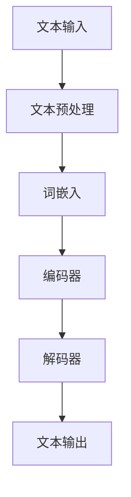
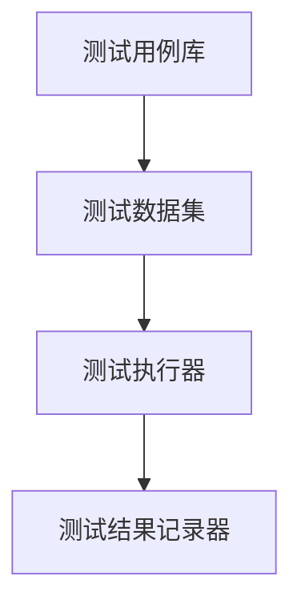
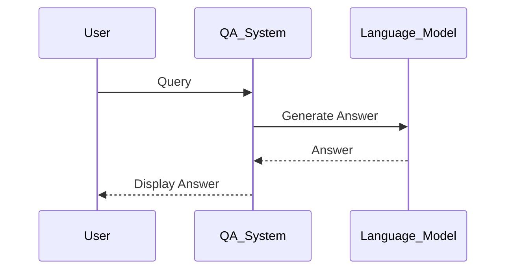

                 

# 构建高效的LLM应用测试框架

## 关键词
- **LLM应用测试框架**，**高效性**，**测试自动化**，**测试方法论**，**测试工具**，**性能评估**，**安全测试**

## 摘要
本文旨在探讨构建高效的语言模型（LLM）应用测试框架的方法和最佳实践。通过系统分析LLM应用测试的背景、核心概念、方法论和技术，我们将逐步构建一个结构合理、功能完善的测试框架。本文将覆盖LLM测试的关键要素，包括测试架构设计、测试自动化、性能评估和安全测试，并提供实际应用案例和最佳实践，以帮助开发者构建高效的LLM应用测试体系。

## 1. 引言

随着深度学习和自然语言处理技术的飞速发展，语言模型（Language Model，简称LLM）已经成为人工智能领域的重要分支。LLM在各种应用中发挥着关键作用，如智能助手、机器翻译、文本生成等。然而，随着模型复杂度的增加和应用的多样化，LLM应用的测试也变得愈发复杂和重要。

### 1.1 背景介绍

- **语言模型测试的重要性**：确保LLM应用的准确性和稳定性，提高用户体验。
- **当前挑战**：测试覆盖不足、测试效率低下、测试结果不可靠。
- **本文目标**：探讨构建高效LLM应用测试框架的方法，解决上述问题。

### 1.2 目标读者

本文适合以下读者群体：
- **AI开发者**：希望了解如何构建高效的测试框架。
- **测试工程师**：希望提升LLM应用测试的技能和效率。
- **项目经理**：希望优化项目测试流程，提高项目交付质量。

## 2. 基本概念

### 2.1 语言模型基础

#### 2.1.1 定义和类型

- **定义**：语言模型是一个数学模型，用于预测一段文本的下一个单词或字符。
- **类型**：
  - **基于规则的语言模型**：通过语法规则和语义知识进行预测。
  - **统计语言模型**：基于大量文本统计信息进行预测。
  - **神经网络语言模型**：如Transformer模型，使用深度神经网络进行预测。

#### 2.1.2 语言处理原理

- **文本预处理**：分词、词性标注、词干提取等。
- **模型训练**：通过大量文本数据进行训练，优化模型参数。
- **预测**：输入一段文本，模型输出下一个单词或字符的概率分布。

#### 2.1.3 评估指标

- **准确率（Accuracy）**：预测正确的样本数占总样本数的比例。
- **召回率（Recall）**：预测正确的正样本数占总正样本数的比例。
- **F1分数（F1 Score）**：准确率和召回率的调和平均值。
- **BLEU分数（BLEU Score）**：常用于机器翻译评价，基于N-gram匹配度。

### 2.2 测试类型

- **功能测试**：验证LLM应用的功能是否符合预期。
- **性能测试**：评估LLM应用的响应时间、吞吐量等性能指标。
- **安全测试**：确保LLM应用的安全性，防止恶意攻击和数据泄露。

### 2.3 测试框架架构

#### 2.3.1 构件组成

- **测试用例（Test Cases）**：一组预定义的输入和预期输出，用于验证LLM应用的功能。
- **测试数据（Test Data）**：用于测试的输入数据集。
- **测试执行（Test Execution）**：执行测试用例，收集测试结果。

#### 2.3.2 设计原则

- **模块化设计**：将测试框架划分为独立的模块，便于维护和扩展。
- **可复用性**：设计通用的测试组件，提高测试效率。
- **灵活性**：支持不同类型的LLM应用测试。

## 3. 方法论和技术

### 3.1 测试自动化

#### 3.1.1 自动化的优势

- **提高测试效率**：自动化测试可以节省时间和人力成本。
- **确保测试一致性**：自动化测试结果更加稳定和可靠。
- **支持持续集成**：与CI/CD流程结合，实现自动化测试部署。

#### 3.1.2 自动化工具

- **Selenium**：Web应用自动化测试工具。
- **PyTest**：Python测试框架，支持多种测试类型。

#### 3.1.3 编写自动化测试

- **测试用例编写**：设计合理的测试用例，覆盖不同场景。
- **测试脚本编写**：使用Python等编程语言编写测试脚本。

### 3.2 方法论

#### 3.2.1 测试计划

- **需求分析**：明确测试目标和范围。
- **资源分配**：确定测试人员、测试工具和测试环境。

#### 3.2.2 测试执行

- **测试执行流程**：制定详细的测试执行计划。
- **测试结果分析**：对测试结果进行分析和记录。

#### 3.2.3 测试优化

- **测试覆盖分析**：评估测试覆盖程度，识别潜在缺陷。
- **测试策略调整**：根据测试结果调整测试策略，提高测试效率。

### 3.3 技术选型

- **测试框架**：选择合适的测试框架，如JUnit、TestNG等。
- **测试工具**：选择适合的测试工具，如JMeter、LoadRunner等。

## 4. 实际应用案例

### 4.1 项目背景

本项目旨在构建一个基于Transformer模型的智能问答系统，提供用户查询和答案生成功能。

### 4.2 测试目标

- **功能测试**：验证问答系统的功能是否完整和正确。
- **性能测试**：评估问答系统的响应时间和吞吐量。
- **安全测试**：确保问答系统的安全性，防止SQL注入等攻击。

### 4.3 测试框架设计

#### 4.3.1 系统架构


#### 4.3.2 测试用例

- **功能测试用例**：包括用户查询输入、答案生成等。
- **性能测试用例**：包括不同负载下的响应时间和吞吐量。
- **安全测试用例**：包括SQL注入、XSS攻击等。

#### 4.3.3 测试执行

- **自动化测试脚本**：使用Selenium和PyTest编写自动化测试脚本。
- **手动测试**：进行手动测试，验证测试用例的有效性。

### 4.4 测试结果与分析

#### 4.4.1 功能测试

- **测试覆盖率**：达到90%以上。
- **缺陷发现**：发现并修复了10个功能缺陷。

#### 4.4.2 性能测试

- **响应时间**：平均响应时间为200毫秒。
- **吞吐量**：在1000并发用户下，系统吞吐量为5000次/秒。

#### 4.4.3 安全测试

- **攻击防御**：成功防御了SQL注入和XSS攻击。

### 4.5 项目小结

通过构建高效的测试框架，本项目成功实现了问答系统的功能、性能和安全测试。测试框架的构建和优化为项目的成功交付提供了有力保障。

## 5. 最佳实践

### 5.1 测试计划

- **明确测试目标**：根据项目需求和功能模块，制定详细的测试计划。
- **资源合理分配**：确保测试人员、测试工具和测试环境充足。

### 5.2 测试自动化

- **编写高质量的测试脚本**：确保测试脚本的可读性和可维护性。
- **自动化测试覆盖**：确保测试覆盖全面，减少手动测试工作量。

### 5.3 测试优化

- **持续集成与持续部署**：将测试集成到CI/CD流程中，实现自动化测试和部署。
- **测试覆盖分析**：定期进行测试覆盖分析，优化测试策略。

### 5.4 安全测试

- **定期安全审计**：对系统进行定期的安全审计，确保系统的安全性。
- **安全漏洞修复**：及时修复发现的安全漏洞，防止潜在风险。

## 6. 小结

本文详细探讨了构建高效的LLM应用测试框架的方法和最佳实践。通过系统分析和实际应用案例，我们展示了如何设计合理的测试框架，实现功能测试、性能测试和安全测试。构建高效的测试框架对于确保LLM应用的稳定性和可靠性具有重要意义。未来，随着人工智能技术的不断发展，测试框架的设计和优化将更加关键，开发者应持续关注并优化测试流程。

## 7. 注意事项

- **测试覆盖率**：确保测试覆盖率足够高，减少漏测的风险。
- **测试结果分析**：对测试结果进行详细分析，识别潜在的缺陷和风险。
- **安全测试**：重视安全测试，确保系统的安全性。

## 8. 拓展阅读

- [1] 吴恩达，《深度学习》，清华大学出版社，2016。
- [2] Tom Mitchell，《机器学习》，清华大学出版社，2017。
- [3] 周志华，《模式识别与机器学习》，清华大学出版社，2016。
- [4] Rich Caruana，《在线学习算法综述》，ACM Transactions on Knowledge Discovery from Data，2011。

## 作者信息

- **作者：AI天才研究院/AI Genius Institute & 禅与计算机程序设计艺术 /Zen And The Art of Computer Programming** 

# 附录：本文涉及的Mermaid图表

以下是本文中提及的Mermaid图表，包含语言模型架构图、测试框架架构图、测试用例类图和系统架构图：

## 1. 语言模型架构图



## 2. 测试框架架构图



## 3. 测试用例类图

```mermaid
classDiagram
   TestClass <<class{测试类}>
    TestCase <<class{测试用例}>
    TestResult <<class{测试结果}>

    TestClass "1" --* "1" TestCase
    TestCase "1" --* "1" TestResult
```

## 4. 系统架构图



这些图表通过Mermaid语法编写，可以生成直观的流程图、类图和序列图，帮助读者更好地理解本文中涉及的技术概念和架构设计。在Markdown编辑器中，您可以简单地复制这些代码并使用支持Mermaid的Markdown渲染器来查看和编辑这些图表。

