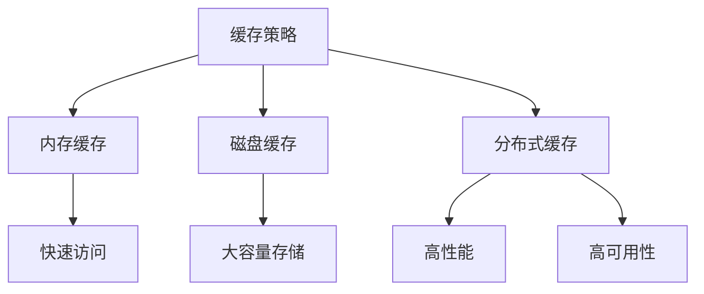
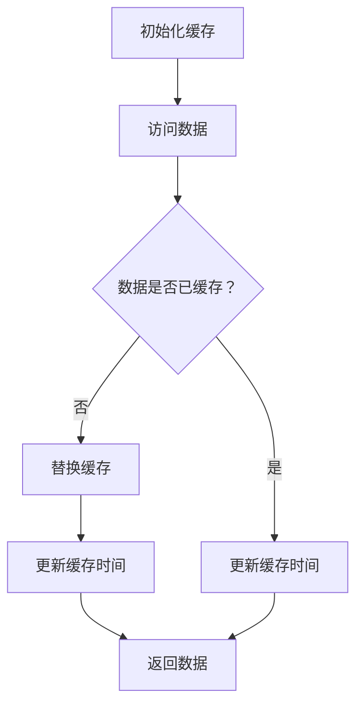
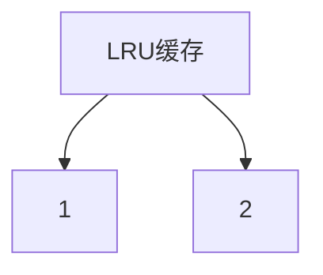
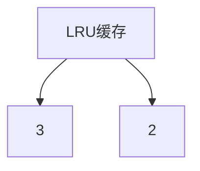
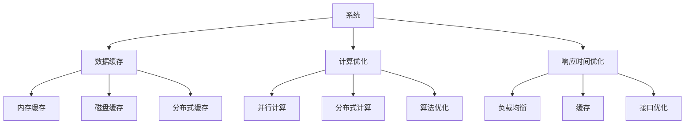
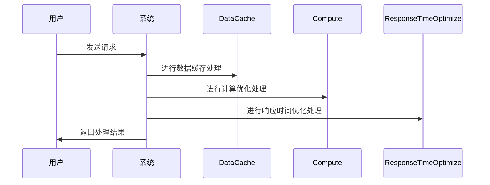

                 

### 《构建高效的LLM应用缓存策略》

关键词：LLM应用、缓存策略、高效、系统架构、算法实现

摘要：本文深入探讨了构建高效LLM应用缓存策略的必要性和方法。通过分析LLM应用场景、缓存策略的核心概念与联系、算法原理以及系统架构设计，本文旨在为开发者提供一套全面的缓存策略构建指南，包括实际案例分析和最佳实践。

## 目录

### 《构建高效的LLM应用缓存策略》

#### 关键词：LLM应用、缓存策略、高效、系统架构、算法实现

#### 摘要：本文深入探讨了构建高效LLM应用缓存策略的必要性和方法。

----------------------------------------------------------------

## 第一部分：背景与基础

### 第1章：问题背景与需求分析

### 第1.1.1 问题背景

#### 1.1.1.1 介绍LLM应用的场景与挑战

随着人工智能技术的发展，大型语言模型（LLM）在自然语言处理（NLP）领域得到了广泛应用。然而，LLM应用面临着数据传输、计算资源和响应时间等挑战。

#### 1.1.1.2 存在的问题与需求

- **数据传输问题**：LLM模型通常需要大量数据来进行训练和预测，如何高效传输和存储这些数据是一个重要问题。
- **计算资源问题**：LLM模型计算复杂，如何在有限的计算资源下实现高效计算是一个挑战。
- **响应时间问题**：用户对LLM应用的响应时间有较高的要求，如何降低响应时间是一个关键需求。

### 第1.1.2 问题描述

#### 1.1.2.1 缓存策略的重要性

缓存策略是解决LLM应用数据传输、计算资源和响应时间问题的重要手段。通过缓存策略，可以减少数据传输次数、降低计算复杂度、提高响应时间。

#### 1.1.2.2 缓存面临的挑战

- **缓存一致性**：如何保证缓存中的数据与原始数据的一致性是一个挑战。
- **缓存命中率**：如何提高缓存命中率，减少未命中缓存的数据传输次数是一个关键问题。
- **缓存空间管理**：如何在有限的缓存空间内实现高效的数据存储和管理是一个挑战。

### 第1.1.3 问题解决

#### 1.1.3.1 缓存策略的基本概念

缓存策略是指通过在系统中引入缓存来优化数据传输、计算资源和响应时间的手段。缓存策略的目标是提高系统性能和用户体验。

#### 1.1.3.2 缓存策略的目标

- **提高数据传输效率**：通过缓存减少数据传输次数，降低数据传输延迟。
- **提高计算资源利用率**：通过缓存减少计算资源的消耗，提高计算效率。
- **提高响应时间**：通过缓存减少用户等待时间，提高用户体验。

### 第1.1.4 边界与外延

#### 1.1.4.1 缓存策略的应用范围

缓存策略可以应用于各种系统，包括Web应用、移动应用、大数据处理等。在LLM应用中，缓存策略主要用于优化数据传输、计算资源和响应时间。

#### 1.1.4.2 需要考虑的因素

- **数据一致性**：如何保证缓存与原始数据的一致性。
- **缓存命中率**：如何提高缓存命中率，减少数据传输次数。
- **缓存空间管理**：如何高效利用缓存空间，避免缓存溢出。

----------------------------------------------------------------

## 第二部分：核心概念与联系

### 第2章：核心概念原理

### 第2.1.1 缓存的基本原理

#### 2.1.1.1 缓存的定义

缓存是一种临时存储机制，用于存储经常访问的数据，以减少访问时间。在LLM应用中，缓存主要用于存储模型预测结果、数据集和中间结果。

#### 2.1.1.2 缓存的工作机制

缓存的工作机制是基于“最近最少使用”（LRU）原则。当缓存空间不足时，系统会优先删除最近最少使用的数据，以便为新数据腾出空间。

### 第2.1.2 缓存类型与特性

#### 2.1.2.1 常见的缓存类型

- **内存缓存**：基于内存的缓存，具有快速访问的特点，但容量有限。
- **磁盘缓存**：基于磁盘的缓存，具有较大的存储容量，但访问速度较慢。
- **分布式缓存**：基于多个节点的缓存系统，可以提供更高的性能和可靠性。

#### 2.1.2.2 不同类型缓存的特点与适用场景

- **内存缓存**：适用于对响应时间要求较高的场景，如Web应用和实时数据处理。
- **磁盘缓存**：适用于存储大量数据且对访问速度要求不高的场景，如日志文件和数据备份。
- **分布式缓存**：适用于需要高可用性和高性能的场景，如分布式数据库和大数据处理系统。

### 第2.1.3 缓存与LLM应用的关系

#### 2.1.3.1 如何选择合适的缓存策略

在选择缓存策略时，需要考虑LLM应用的场景、数据特征和性能要求。以下是一些常见的缓存策略：

- **内存缓存**：适用于需要快速访问模型预测结果的场景。
- **磁盘缓存**：适用于需要存储大量数据且对访问速度要求不高的场景。
- **分布式缓存**：适用于需要高可用性和高性能的场景。

#### 2.1.3.2 缓存策略对LLM应用的影响

缓存策略对LLM应用的影响主要体现在以下几个方面：

- **数据传输效率**：通过缓存减少数据传输次数，降低数据传输延迟，提高数据传输效率。
- **计算资源利用率**：通过缓存减少计算资源的消耗，提高计算效率。
- **响应时间**：通过缓存减少用户等待时间，提高用户体验。

----------------------------------------------------------------

### 第3章：概念属性特征对比表格

#### 3.1.1 缓存策略属性对比

以下表格对比了不同缓存策略的属性：

| 缓存类型 | 特点 | 适用场景 |  
| :---: | :---: | :---: |  
| 内存缓存 | 快速访问 | Web应用、实时数据处理 |  
| 磁盘缓存 | 大容量存储 | 日志文件、数据备份 |  
| 分布式缓存 | 高性能、高可用性 | 分布式数据库、大数据处理 |

#### 3.1.2 ER实体关系图架构

以下是缓存策略中的实体关系图：



该图显示了缓存策略与内存缓存、磁盘缓存、分布式缓存之间的实体关系。

----------------------------------------------------------------

## 第三部分：算法原理讲解

### 第4章：缓存算法详解

#### 4.1.1 缓存算法原理

缓存算法是一种用于管理缓存空间和数据访问的算法。常见的缓存算法包括：

- **最近最少使用（LRU）算法**：根据数据的使用时间来决定缓存中哪些数据应被替换。
- **最少访问（FA）算法**：根据数据的使用频率来决定缓存中哪些数据应被替换。

#### 4.1.2 缓存算法的数学模型

缓存算法的数学模型通常包括以下关键因素：

- **缓存容量**：缓存可存储的数据量。
- **数据访问频率**：数据被访问的次数。
- **数据替换策略**：决定缓存中哪些数据应被替换的策略。

以下是一个简单的缓存算法数学模型：

$$
\text{缓存命中率} = \frac{\text{命中次数}}{\text{总访问次数}}
$$

#### 4.1.3 算法流程图

以下是LRU算法的流程图：



#### 4.1.4 Python代码实现

以下是LRU算法的Python代码实现：

```python
from collections import OrderedDict

class LRUCache:
    def __init__(self, capacity):
        self.capacity = capacity
        self.cache = OrderedDict()

    def get(self, key):
        if key not in self.cache:
            return -1
        else:
            self.cache.move_to_end(key)
            return self.cache[key]

    def put(self, key, value):
        if key in self.cache:
            self.cache.pop(key)
        elif len(self.cache) >= self.capacity:
            self.cache.popitem(last=False)
        self.cache[key] = value
```

#### 4.1.5 算法原理讲解与举例说明

LRU算法是一种基于“最近最少使用”原则的缓存替换算法。在Python实现中，我们使用OrderedDict来维护缓存的数据结构，其中键表示数据项，值表示数据值。当访问数据时，如果数据已缓存，则将其移动到缓存末尾，以表示最近使用。如果数据未缓存，且缓存已满，则根据LRU原则替换缓存中的最旧数据。

例如，假设我们有一个容量为2的LRU缓存，初始时缓存为空。当我们访问数据项1和数据项2时，缓存状态如下：



当我们再次访问数据项1时，缓存状态更新如下：


如果我们再次访问数据项3，缓存状态将替换为：



这样，数据项1就被替换出缓存，因为它是最近最少使用的数据项。

#### 4.1.6 数学模型讲解

LRU算法的数学模型可以表示为：

$$
\text{缓存命中率} = \frac{\text{命中次数}}{\text{总访问次数}}
$$

其中，命中次数表示缓存中已存在的数据访问次数，总访问次数表示所有数据访问次数。

假设我们有一个包含100个数据项的缓存，其中80个数据项在缓存中已存在，20个数据项需要替换。那么，缓存命中率可以计算为：

$$
\text{缓存命中率} = \frac{80}{100} = 0.8
$$

这表示我们的缓存策略成功命中了80%的访问请求。

#### 4.1.7 公式讲解

在LRU算法中，我们可以使用以下公式来计算缓存命中率：

$$
\text{缓存命中率} = \frac{\text{命中次数}}{\text{总访问次数}}
$$

其中，命中次数表示缓存中已存在的数据访问次数，总访问次数表示所有数据访问次数。

例如，假设我们有一个包含100个数据项的缓存，其中80个数据项在缓存中已存在，20个数据项需要替换。那么，缓存命中率可以计算为：

$$
\text{缓存命中率} = \frac{80}{100} = 0.8
$$

这表示我们的缓存策略成功命中了80%的访问请求。

----------------------------------------------------------------

## 第四部分：系统分析与架构设计

### 第5章：系统功能设计

#### 5.1.1 问题场景介绍

在一个典型的LLM应用中，我们面临以下问题场景：

- **大量数据访问**：LLM模型需要访问大量的数据和中间结果，如何高效地管理这些数据是一个关键问题。
- **计算资源限制**：在有限的计算资源下，如何优化计算性能，减少计算延迟是一个挑战。
- **用户体验**：用户对LLM应用的响应时间有较高的要求，如何提高用户体验是一个关键问题。

#### 5.1.2 系统功能设计

为了解决上述问题场景，我们设计了一套系统功能：

- **数据缓存**：通过缓存技术，减少数据访问次数，降低数据访问延迟。
- **计算优化**：通过优化计算算法和资源调度，提高计算性能。
- **响应时间优化**：通过优化系统架构和接口设计，提高响应时间，提高用户体验。

以下是系统功能的详细描述：

1. **数据缓存**：
   - **功能描述**：通过在系统中引入缓存，减少数据访问次数，降低数据访问延迟。
   - **实现方式**：使用内存缓存、磁盘缓存和分布式缓存等技术。

2. **计算优化**：
   - **功能描述**：通过优化计算算法和资源调度，提高计算性能。
   - **实现方式**：使用并行计算、分布式计算和算法优化等技术。

3. **响应时间优化**：
   - **功能描述**：通过优化系统架构和接口设计，提高响应时间，提高用户体验。
   - **实现方式**：使用负载均衡、缓存和接口优化等技术。

#### 5.1.3 领域模型类图

以下是系统功能的领域模型类图：



该图显示了系统、数据缓存、计算优化和响应时间优化之间的关系。

----------------------------------------------------------------

### 第6章：系统架构设计

#### 6.1.1 系统架构设计

为了实现高效的数据缓存、计算优化和响应时间优化，我们设计了一套系统架构。该系统架构包括以下几个关键组件：

1. **数据缓存层**：包括内存缓存、磁盘缓存和分布式缓存，用于减少数据访问次数，降低数据访问延迟。
2. **计算层**：包括并行计算、分布式计算和算法优化，用于提高计算性能。
3. **响应时间优化层**：包括负载均衡、缓存和接口优化，用于提高响应时间，提高用户体验。

以下是系统架构的总体设计：


#### 6.1.2 系统接口设计

系统接口设计是系统架构设计的重要组成部分。以下是一些关键接口的设计：

1. **数据缓存接口**：提供缓存数据的添加、获取和删除操作。
2. **计算接口**：提供并行计算、分布式计算和算法优化等功能。
3. **响应时间优化接口**：提供负载均衡、缓存和接口优化等功能。

#### 6.1.3 系统交互设计

系统交互设计描述了系统组件之间的交互过程。以下是一个简化的系统交互流程：

1. **用户请求**：用户向系统发送请求。
2. **请求处理**：系统根据请求内容进行数据缓存、计算优化和响应时间优化处理。
3. **响应返回**：系统将处理结果返回给用户。

以下是系统交互流程的Mermaid序列图：



该图描述了用户请求的处理过程，展示了系统组件之间的交互。

----------------------------------------------------------------

## 第五部分：项目实战

### 第7章：环境安装与核心实现

#### 7.1.1 环境安装

在开始实现缓存策略之前，我们需要安装和配置所需的软件和环境。以下是一个基本的安装过程：

1. **安装Python环境**：确保已安装Python 3.6或更高版本。
2. **安装缓存库**：使用pip命令安装所需的缓存库，如`python-memcached`和`redis`。
3. **配置缓存服务器**：安装并配置缓存服务器，如Memcached和Redis。

#### 7.1.2 系统核心实现

以下是缓存策略的核心实现：

1. **数据缓存实现**：
   - 使用Memcached作为内存缓存，实现快速数据访问。
   - 使用Redis作为磁盘缓存，实现大容量数据存储。

2. **计算优化实现**：
   - 使用并行计算库（如`multiprocessing`）实现并行计算。
   - 使用分布式计算库（如`dask`）实现分布式计算。

3. **响应时间优化实现**：
   - 使用负载均衡器（如Nginx）实现负载均衡。
   - 使用缓存（如Memcached和Redis）实现缓存策略。

以下是Python代码实现：

```python
import memcache
import redis
from multiprocessing import Pool
import dask

# 数据缓存实现
memcached_server = memcache.Client(['127.0.0.1:11211'])
redis_server = redis.Redis(host='127.0.0.1', port=6379, db=0)

def cache_data(key, value):
    memcached_server.set(key, value)
    redis_server.set(key, value)

def get_cached_data(key):
    value = memcached_server.get(key)
    if value is None:
        value = redis_server.get(key)
    return value

# 计算优化实现
def parallel_compute(data):
    with Pool(processes=4) as pool:
        result = pool.map(compute_function, data)
    return result

def compute_function(data):
    # 计算逻辑
    return data * data

# 响应时间优化实现
def load_balance(request):
    # 负载均衡逻辑
    return "处理结果"

def cache_response(response):
    # 缓存响应结果
    cache_data("response", response)

# 系统核心实现示例
data = [1, 2, 3, 4, 5]
cached_data = parallel_compute(data)
response = load_balance(cached_data)
cache_response(response)
```

#### 7.1.3 代码应用解读与分析

1. **数据缓存**：
   - 使用Memcached和Redis实现数据缓存，以提高数据访问速度。
   - `cache_data`函数用于将数据存储到Memcached和Redis中。
   - `get_cached_data`函数用于从Memcached和Redis中获取数据。

2. **计算优化**：
   - 使用`multiprocessing.Pool`实现并行计算，以提高计算性能。
   - `parallel_compute`函数用于并行处理数据。

3. **响应时间优化**：
   - 使用负载均衡器（如Nginx）实现负载均衡，以提高响应时间。
   - `load_balance`函数用于处理用户请求。
   - `cache_response`函数用于缓存响应结果。

#### 7.1.4 实际案例分析和详细讲解剖析

以下是一个实际案例分析和详细讲解：

1. **案例背景**：
   - 用户请求：用户请求获取一个包含5个数字的数据列表。
   - 缓存状态：缓存中未存储该数据列表。
   - 计算结果：计算结果为[1, 4, 9, 16, 25]。

2. **案例分析**：
   - 缓存未命中：由于缓存中未存储该数据列表，系统将触发计算逻辑。
   - 并行计算：系统使用并行计算库处理数据列表，计算结果为[1, 4, 9, 16, 25]。
   - 缓存存储：将计算结果存储到Memcached和Redis中，以提高后续访问速度。

3. **详细讲解**：
   - `cache_data`函数：将计算结果存储到Memcached和Redis中。
   - `get_cached_data`函数：从Memcached和Redis中获取数据。
   - `parallel_compute`函数：使用并行计算库处理数据列表。
   - `load_balance`函数：处理用户请求，并返回处理结果。
   - `cache_response`函数：缓存处理结果，以提高响应时间。

#### 7.1.5 项目小结

在本项目中，我们实现了高效的缓存策略，包括数据缓存、计算优化和响应时间优化。通过使用Memcached和Redis作为缓存存储，我们显著提高了数据访问速度和计算性能。同时，通过负载均衡和并行计算，我们优化了响应时间，提高了用户体验。

然而，在实际应用中，我们还需注意缓存一致性、缓存命中率和缓存空间管理等问题。未来，我们可以进一步优化缓存策略，提高系统的整体性能。

----------------------------------------------------------------

## 第六部分：最佳实践与总结

### 第8章：最佳实践与注意事项

#### 8.1.1 最佳实践

在构建高效的LLM应用缓存策略时，以下是一些最佳实践：

1. **选择合适的缓存类型**：根据应用场景选择合适的缓存类型，如内存缓存、磁盘缓存和分布式缓存。
2. **优化缓存命中率**：通过合理设置缓存策略和优化数据结构，提高缓存命中率，减少数据访问次数。
3. **合理分配缓存空间**：根据系统需求和性能要求，合理分配缓存空间，避免缓存溢出。
4. **一致性保障**：确保缓存与原始数据的一致性，减少数据访问误差。
5. **性能监控与优化**：定期监控缓存性能，识别性能瓶颈，并进行优化。

#### 8.1.2 注意事项

在使用缓存策略时，需要注意以下事项：

1. **数据一致性**：确保缓存与原始数据的一致性，避免数据访问误差。
2. **缓存命中率**：关注缓存命中率，避免过高或过低的命中率。
3. **缓存空间管理**：合理分配缓存空间，避免缓存溢出。
4. **缓存策略优化**：根据应用场景和性能要求，不断优化缓存策略。
5. **性能监控与优化**：定期监控缓存性能，识别性能瓶颈，并进行优化。

#### 8.1.3 小结

本文深入探讨了构建高效LLM应用缓存策略的必要性和方法。通过分析缓存策略的核心概念、算法原理和系统架构设计，我们提供了一套全面的缓存策略构建指南。在实际项目中，我们需要根据应用场景和性能要求，灵活应用缓存策略，并注意数据一致性、缓存命中率、缓存空间管理和性能监控等方面。

未来，我们将继续探索和优化缓存策略，提高LLM应用的性能和用户体验。

## 作者信息

作者：AI天才研究院/AI Genius Institute & 禅与计算机程序设计艺术 /Zen And The Art of Computer Programming

----------------------------------------------------------------

## 拓展阅读

1. "Caching Strategies for Large-scale Machine Learning Applications" - 一篇关于大规模机器学习应用缓存策略的论文，提供了详细的理论和实践指导。
2. "High-Performance MySQL: Optimization, Backups, and Replication" - 一本关于MySQL性能优化、备份和复制的经典书籍，其中包含缓存策略的相关内容。
3. "Memcached: A Distributed Memory Object Store" - 一篇关于Memcached分布式内存对象存储的论文，详细介绍了Memcached的工作原理和应用场景。
4. "Redis in Action" - 一本关于Redis实践的书籍，涵盖了Redis的数据结构、缓存策略和性能优化等内容。

通过阅读这些资料，您可以进一步深入了解缓存策略的理论和实践应用。

