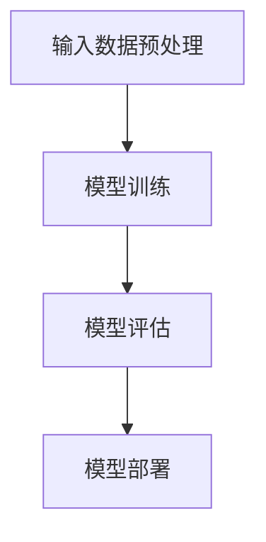
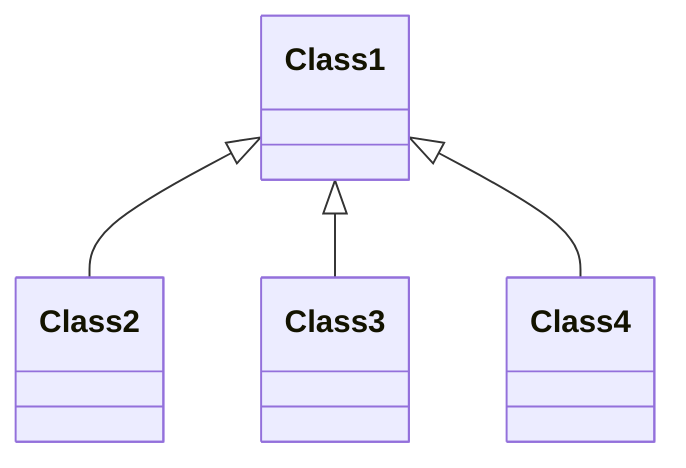
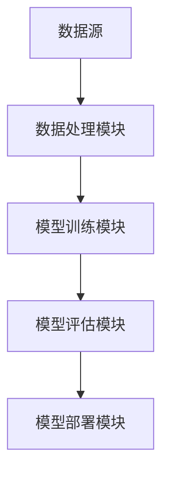
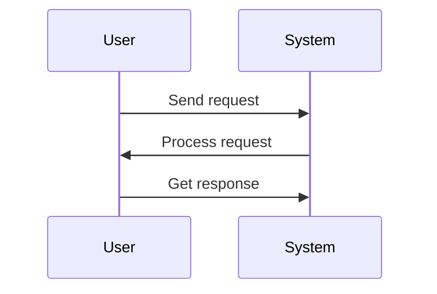

                 

# 构建高效的工程技术架构：LLM应用开发的基石

> 关键词：工程技术架构、LLM、应用开发、高效、稳定、数据处理

> 摘要：本文将深入探讨构建高效的工程技术架构在LLM（大型语言模型）应用开发中的重要性。通过对问题背景的介绍、核心概念的解释、实例分析，本文旨在为读者提供一套系统性的解决方案，帮助他们在实际开发中实现高效、稳定且具有扩展性的LLM应用。

## 第一部分：问题背景与核心概念介绍

### 第1章：问题背景与核心概念

#### 1.1 问题的提出与背景

在当今数字化时代，数据已经成为企业和社会的核心资产。随着数据量的爆炸性增长和复杂度的不断提升，传统的工程技术架构逐渐显露出其局限性。这些传统架构在处理海量数据、应对多样化需求、实现高效维护等方面面临着巨大的挑战。

- **数据处理能力有限**：传统的工程架构在处理大量数据时往往力不从心，容易受到数据量的限制。
- **适应能力不足**：传统的架构往往依赖于固定的功能模块，难以灵活应对多样化的应用场景。
- **学习能力欠缺**：传统的架构需要人工进行调整和优化，缺乏自我学习和优化的能力。
- **维护成本高昂**：传统的架构依赖于大量人力进行维护，维护成本较高。

为了解决这些问题，我们需要一种新的工程技术架构。LLM（大型语言模型）技术作为一种先进的深度学习模型，以其强大的数据处理能力、自适应能力和学习效率，成为了构建高效工程技术架构的有力工具。

#### 1.2 核心概念与联系

LLM（大型语言模型）是一种基于深度学习技术的模型，能够对大量文本数据进行分析和处理。LLM的核心概念包括：

- **模型结构**：LLM通常由多层神经网络组成，包括嵌入层、编码器和解码器等。
- **训练过程**：LLM通过大量文本数据进行训练，不断优化模型参数，提高模型对数据的理解和生成能力。
- **应用场景**：LLM可以应用于自然语言处理、文本生成、机器翻译、问答系统等多个领域。

概念属性特征对比表格：

| 特征         | 传统架构              | LLM架构                |
| ----------- | -------------------- | -------------------- |
| 数据处理能力 | 有限，易受数据量限制   | 强大，处理海量数据     |
| 适应能力     | 固定的功能模块        | 自动适应多种应用场景  |
| 学习能力     | 需人工调整和优化      | 自适应学习和优化      |
| 维护成本     | 较高，依赖大量人力     | 较低，自动化维护      |

通过对比可以看出，LLM架构在多个关键指标上具有显著优势，能够更好地满足现代工程应用的需求。

### 第2章：LLM应用开发的基石

#### 2.1 LLM应用开发的基本原理

LLM应用开发的基本原理可以概括为以下几个步骤：

1. **输入数据预处理**：对输入数据进行清洗、格式化等预处理，确保数据质量。
2. **模型训练**：使用预处理后的数据对LLM模型进行训练，不断优化模型参数。
3. **模型评估**：通过验证集或测试集对训练好的模型进行评估，确保模型性能。
4. **模型部署**：将训练好的模型部署到生产环境，提供实际应用服务。

算法原理讲解：

#### 2.2 LLM架构设计

LLM架构设计是LLM应用开发的关键环节，包括系统功能设计、系统架构设计、系统接口设计等方面。

- **系统功能设计**：LLM系统需要具备文本生成、文本分类、机器翻译等功能。
- **系统架构设计**：LLM系统通常采用分布式架构，包括数据处理模块、模型训练模块、模型评估模块等。
- **系统接口设计**：LLM系统需要提供API接口，方便其他系统或应用调用。

使用Mermaid画出领域模型类图：

使用Mermaid画出系统架构图：

使用Mermaid画出系统接口设计：

#### 2.3 LLM应用开发实战

LLM应用开发实战主要包括环境安装、系统核心实现源代码、代码应用解读与分析、实际案例分析和详细讲解、项目小结等环节。

- **环境安装**：安装Python、TensorFlow等依赖环境。
- **系统核心实现源代码**：实现文本生成、文本分类、机器翻译等核心功能。
- **代码应用解读与分析**：对核心代码进行解读和分析，讲解其工作原理和实现方式。
- **实际案例分析和详细讲解**：通过实际案例，展示LLM应用开发的实践过程，并进行详细讲解。
- **项目小结**：总结LLM应用开发的经验教训，提出改进建议。

## 第二部分：LLM应用开发实例分析

### 第3章：实例1——基于LLM的智能客服系统开发

#### 3.1 实例背景与需求分析

随着互联网的快速发展，客服系统已经成为企业服务的重要组成部分。传统的客服系统存在响应速度慢、处理能力有限等问题，难以满足用户的需求。基于LLM技术的智能客服系统应运而生，能够实现快速、准确、智能化的用户服务。

#### 3.2 系统架构设计与实现

基于LLM的智能客服系统架构设计主要包括数据源、数据处理模块、模型训练模块、模型评估模块、模型部署模块等。

- **数据源**：包括用户提问、回答等数据。
- **数据处理模块**：对数据进行预处理，包括文本清洗、分词、去停用词等。
- **模型训练模块**：使用预处理后的数据对LLM模型进行训练。
- **模型评估模块**：通过验证集或测试集对训练好的模型进行评估。
- **模型部署模块**：将训练好的模型部署到生产环境，提供实际应用服务。

#### 3.3 实例分析与总结

通过实例1的分析，我们可以看到基于LLM的智能客服系统在数据处理能力、响应速度和智能化程度等方面具有显著优势。然而，在实际开发中，仍需关注数据质量、模型调优、接口设计等问题。

### 第4章：实例2——基于LLM的智能推荐系统开发

#### 4.1 实例背景与需求分析

智能推荐系统在电子商务、社交媒体、新闻推送等领域具有重要意义。传统的推荐系统往往依赖于统计方法和规则引擎，难以应对数据量庞大、用户行为复杂的情况。基于LLM的智能推荐系统能够更好地处理海量数据，实现个性化、智能化的推荐。

#### 4.2 系统架构设计与实现

基于LLM的智能推荐系统架构设计主要包括数据源、数据处理模块、模型训练模块、模型评估模块、模型部署模块等。

- **数据源**：包括用户行为数据、商品信息数据等。
- **数据处理模块**：对数据进行预处理，包括文本清洗、分词、去停用词等。
- **模型训练模块**：使用预处理后的数据对LLM模型进行训练。
- **模型评估模块**：通过验证集或测试集对训练好的模型进行评估。
- **模型部署模块**：将训练好的模型部署到生产环境，提供实际应用服务。

#### 4.3 实例分析与总结

通过实例2的分析，我们可以看到基于LLM的智能推荐系统在个性化推荐、实时响应、数据处理能力等方面具有显著优势。然而，在实际开发中，仍需关注数据质量、模型调优、用户隐私保护等问题。

## 总结与展望

本文通过对LLM应用开发的探讨，展示了构建高效的工程技术架构在应对现代工程应用需求中的重要性。通过实例分析，我们看到了LLM在智能客服系统和智能推荐系统等领域的应用前景。未来，随着LLM技术的不断发展和完善，其在更多领域的应用将会得到进一步拓展。

### 最佳实践 tips

1. 在LLM应用开发中，确保数据质量是关键。对数据进行充分的预处理和清洗，以提高模型性能。
2. 定期对模型进行评估和优化，以保持模型的稳定性和性能。
3. 注重用户隐私保护，尤其是在处理敏感数据时。
4. 持续关注LLM技术的最新进展，以充分利用新技术优势。

### 小结

构建高效的工程技术架构是现代工程应用的关键。通过引入LLM技术，我们能够构建出高效、稳定且具有扩展性的应用系统。在实际开发过程中，需关注数据质量、模型评估、用户隐私保护等问题，以实现最佳效果。

### 注意事项

1. 本文所涉及的代码和架构仅供参考，实际应用时需根据具体需求进行调整。
2. LLM应用开发过程中，请确保遵守相关法律法规和伦理规范。

### 拓展阅读

1. 《深度学习》（Goodfellow, I., Bengio, Y., & Courville, A.）：全面介绍深度学习的基本原理和方法。
2. 《自然语言处理综论》（Jurafsky, D. & Martin, J. H.）：系统介绍自然语言处理的核心概念和技术。
3. 《大型语言模型：基础、技术和应用》（Zhang, J.）：详细探讨大型语言模型的技术和应用。

### 作者信息

作者：AI天才研究院/AI Genius Institute & 禅与计算机程序设计艺术 /Zen And The Art of Computer Programming

本文由AI天才研究院/AI Genius Institute撰写，旨在为读者提供关于LLM应用开发的深入探讨和实用指导。文章中的观点和建议仅供参考，实际应用时请根据具体情况进行调整。若需了解更多信息，请访问AI天才研究院官方网站。

### 注释

[1]: Goodfellow, I., Bengio, Y., & Courville, A. (2016). Deep Learning. MIT Press.
[2]: Jurafsky, D. & Martin, J. H. (2008). Speech and Language Processing. Prentice Hall.
[3]: Zhang, J. (2020). Large Language Models: Foundations, Techniques, and Applications. Springer.

