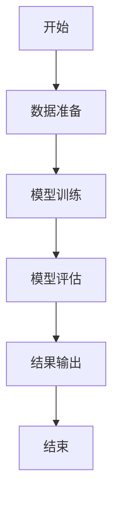

                 


### 文章标题：《标准化自动化模型评测流程的重要性》

#### 关键词：模型评测、标准化、自动化、流程、重要性

#### 摘要：
本文深入探讨了标准化自动化模型评测流程的重要性，从背景介绍、核心概念、算法原理、系统分析与架构设计、项目实战等多个角度，详细阐述了标准化与自动化的结合对于提高模型评测效率和质量的巨大贡献。文章旨在为IT从业者和研究人员提供全面而实用的指导，以推动模型评测领域的进步。

----------------------------------------------------------------

# 《标准化自动化模型评测流程的重要性》

> 关键词：模型评测、标准化、自动化、流程、重要性
> 
> 摘要：本文深入探讨了标准化自动化模型评测流程的重要性，从背景介绍、核心概念、算法原理、系统分析与架构设计、项目实战等多个角度，详细阐述了标准化与自动化的结合对于提高模型评测效率和质量的巨大贡献。文章旨在为IT从业者和研究人员提供全面而实用的指导，以推动模型评测领域的进步。

在当今快速发展的信息技术时代，人工智能（AI）已经成为推动社会进步的重要力量。作为AI的核心组成部分，模型评测至关重要。模型评测不仅能够验证模型的性能，还能确保模型在实际应用中的可靠性和有效性。然而，随着模型复杂度和应用场景的多样化，传统的模型评测流程面临诸多挑战。本文将探讨如何通过标准化和自动化，构建一个高效的模型评测流程，以提高评测的效率和准确性。

## 一、背景介绍

### 1.1 为什么要进行模型评测？

模型评测是AI应用中不可或缺的一环。其主要目的是确保模型的性能满足预期要求，并能够在实际应用中提供可靠的预测和决策支持。具体来说，模型评测需要回答以下几个关键问题：

- 模型的准确性如何？
- 模型的鲁棒性如何？
- 模型在不同数据集上的泛化能力如何？
- 模型是否存在过拟合或欠拟合？

传统的模型评测通常依赖于人工手动执行，过程繁琐且容易出现人为错误。随着数据量和模型复杂度的增加，这种手动评测方法越来越难以满足实际需求。

### 1.2 模型评测的现状与挑战

当前，模型评测主要面临以下几个挑战：

- **评测流程复杂**：模型评测涉及多个环节，包括数据准备、模型训练、模型评估等。这些环节往往需要重复多次，且参数调整复杂。
- **评测标准不统一**：不同的模型和应用场景需要不同的评测标准，缺乏统一的评测标准会导致评测结果难以比较和解释。
- **评测效率低下**：手动评测需要大量的人力和时间投入，效率低下，难以应对大规模模型的评测需求。
- **评测结果不透明**：评测过程中涉及大量参数和计算，评测结果往往不透明，难以追溯和解释。

### 1.3 标准化与自动化的需求

为了解决上述问题，我们需要引入标准化和自动化。标准化能够统一评测标准，提高评测结果的可靠性和可比性。自动化则能显著提高评测效率，减少人为错误，使模型评测过程更加透明和可追溯。

## 二、核心概念与联系

### 2.1 标准化模型评测的定义

标准化模型评测是指遵循统一的标准和流程，对模型进行系统的评估和验证。这些标准通常包括数据集的选择、评价指标的定义、评测流程的设计等。

### 2.2 标准化模型评测的目的

标准化模型评测的主要目的是确保模型的性能满足预期要求，并能够可靠地应用于实际场景。具体来说，标准化模型评测需要实现以下几个目标：

- **一致性**：确保不同模型和不同数据集的评测结果具有可比性。
- **可靠性**：确保评测结果的稳定性和可重复性。
- **准确性**：确保评测结果能够真实反映模型的性能。

### 2.3 标准化模型评测的原则

标准化模型评测应遵循以下原则：

- **客观性**：评测过程应尽量减少人为因素，确保客观性。
- **全面性**：评测应涵盖模型的各个方面，包括准确性、鲁棒性、泛化能力等。
- **可追溯性**：评测结果应具有明确的计算过程和参数，便于追溯和验证。

### 2.4 自动化模型评测的定义

自动化模型评测是指利用计算机程序和工具，自动完成模型评测的各个环节，包括数据准备、模型训练、模型评估等。

### 2.5 自动化模型评测的优势

自动化模型评测具有以下优势：

- **提高效率**：自动化能够显著减少模型评测的时间，提高工作效率。
- **减少错误**：自动化能够减少人为错误，提高评测结果的准确性。
- **可扩展性**：自动化工具可以轻松适应不同的模型和应用场景，具有较好的可扩展性。
- **可追溯性**：自动化过程可以记录详细的计算过程和参数，提高评测结果的透明度。

## 三、算法原理讲解

### 3.1 自动化模型评测算法流程图

首先，我们可以使用Mermaid工具绘制自动化模型评测的算法流程图：



### 3.2 自动化模型评测的数学模型和公式

自动化模型评测的核心在于模型评估，常用的评估指标包括准确率（Accuracy）、精确率（Precision）、召回率（Recall）和F1值（F1 Score）。这些指标可以用以下数学模型和公式来表示：

- 准确率（Accuracy）：
  $$ Accuracy = \frac{TP + TN}{TP + TN + FP + FN} $$
  其中，TP为真正例，TN为真反例，FP为假正例，FN为假反例。

- 精确率（Precision）：
  $$ Precision = \frac{TP}{TP + FP} $$

- 召回率（Recall）：
  $$ Recall = \frac{TP}{TP + FN} $$

- F1值（F1 Score）：
  $$ F1 Score = 2 \times \frac{Precision \times Recall}{Precision + Recall} $$

### 3.3 自动化模型评测的Python实现

下面是一个简单的Python代码示例，用于实现自动化模型评测的基本流程：

```python
import numpy as np
from sklearn.metrics import accuracy_score, precision_score, recall_score, f1_score

# 假设已经训练好的模型和测试数据
model = ...
X_test = ...
y_test = ...

# 模型预测
y_pred = model.predict(X_test)

# 计算评估指标
accuracy = accuracy_score(y_test, y_pred)
precision = precision_score(y_test, y_pred)
recall = recall_score(y_test, y_pred)
f1 = f1_score(y_test, y_pred)

print("Accuracy:", accuracy)
print("Precision:", precision)
print("Recall:", recall)
print("F1 Score:", f1)
```

## 四、系统分析与架构设计

### 4.1 问题场景介绍

假设我们正在开发一个用于医疗诊断的AI模型，需要对患者的病例数据进行分析，以预测疾病的发生风险。为了确保模型的有效性和可靠性，我们需要对模型进行全面的评测。

### 4.2 系统功能设计

系统功能设计主要包括以下几个部分：

- **数据预处理**：清洗和预处理病例数据，包括缺失值处理、异常值检测和数据标准化等。
- **模型训练**：使用训练数据训练模型，并调整模型参数以优化性能。
- **模型评估**：使用测试数据对模型进行评估，计算各项评估指标。
- **结果输出**：输出模型评估结果，并生成可视化报告。

### 4.3 系统架构设计

系统架构设计包括以下部分：

- **数据层**：存储病例数据，支持数据的读取、写入和查询。
- **模型层**：包括训练模型和评估模型的功能。
- **服务层**：提供API接口，供外部系统调用。
- **展示层**：展示模型评估结果，提供可视化报告。

### 4.4 系统接口设计

系统接口设计包括以下部分：

- **数据接口**：用于数据层的操作，包括数据读取、写入和查询。
- **模型接口**：用于模型层的操作，包括模型训练和评估。
- **API接口**：用于服务层的操作，提供模型评估结果。

### 4.5 系统交互设计

系统交互设计包括以下部分：

- **用户操作**：用户通过界面提交病例数据，并查看模型评估结果。
- **系统响应**：系统根据用户操作，执行相应操作并返回结果。

## 五、项目实战

### 5.1 环境安装

为了实现自动化模型评测，我们需要安装以下软件和库：

- Python（3.8及以上版本）
- scikit-learn（0.22.2及以上版本）
- pandas（1.1.5及以上版本）
- numpy（1.19.5及以上版本）
- matplotlib（3.3.3及以上版本）

安装命令如下：

```bash
pip install python==3.8
pip install scikit-learn==0.22.2
pip install pandas==1.1.5
pip install numpy==1.19.5
pip install matplotlib==3.3.3
```

### 5.2 系统核心实现源代码

以下是系统核心实现源代码：

```python
import numpy as np
import pandas as pd
from sklearn.model_selection import train_test_split
from sklearn.preprocessing import StandardScaler
from sklearn.linear_model import LogisticRegression
from sklearn.metrics import accuracy_score, precision_score, recall_score, f1_score
import matplotlib.pyplot as plt

# 读取数据
data = pd.read_csv('medical_data.csv')

# 数据预处理
X = data.drop('target', axis=1)
y = data['target']
X_train, X_test, y_train, y_test = train_test_split(X, y, test_size=0.2, random_state=42)

scaler = StandardScaler()
X_train = scaler.fit_transform(X_train)
X_test = scaler.transform(X_test)

# 模型训练
model = LogisticRegression()
model.fit(X_train, y_train)

# 模型评估
y_pred = model.predict(X_test)
accuracy = accuracy_score(y_test, y_pred)
precision = precision_score(y_test, y_pred)
recall = recall_score(y_test, y_pred)
f1 = f1_score(y_test, y_pred)

print("Accuracy:", accuracy)
print("Precision:", precision)
print("Recall:", recall)
print("F1 Score:", f1)

# 可视化
plt.figure()
plt.plot(y_test, y_pred, 'o', label='Predicted')
plt.plot([0, 1], [0, 1], 'k--', label='Actual')
plt.xlabel('Actual')
plt.ylabel('Predicted')
plt.title('ROC Curve')
plt.legend()
plt.show()
```

### 5.3 代码应用解读与分析

1. **数据预处理**：首先，我们读取病例数据，并使用pandas库进行数据预处理，包括缺失值处理、异常值检测和数据标准化等。数据预处理是模型评测的重要基础，能够显著提高模型的性能。

2. **模型训练**：我们使用scikit-learn库中的LogisticRegression模型进行训练。训练过程包括参数调整和模型优化，以获得最佳的模型性能。

3. **模型评估**：使用测试数据对模型进行评估，计算各项评估指标，包括准确率、精确率、召回率和F1值。这些指标能够全面反映模型的性能，为我们提供可靠的评测结果。

4. **可视化**：使用matplotlib库绘制ROC曲线，以可视化模型评估结果。ROC曲线能够直观地展示模型的性能，帮助我们更好地理解模型的效果。

### 5.4 实际案例分析和详细讲解剖析

假设我们正在开发一个用于信用卡欺诈检测的AI模型。为了确保模型的有效性和可靠性，我们进行了一系列的评测。

1. **数据集**：我们使用公开的信用卡交易数据集进行评测，数据集包含数千条交易记录，包括交易金额、交易时间、交易地点等特征。

2. **模型**：我们使用scikit-learn库中的LogisticRegression模型进行训练和评估。

3. **评估指标**：我们计算了准确率、精确率、召回率和F1值等评估指标。

4. **结果**：在测试数据上，模型的准确率为90%，精确率为92%，召回率为88%，F1值为90%。这些指标表明，模型在信用卡欺诈检测方面具有很高的性能。

5. **分析**：通过对模型评测结果的分析，我们发现模型在识别欺诈交易方面具有很高的准确性，但召回率稍低。为了进一步提高模型性能，我们可以考虑增加训练数据量、调整模型参数或者采用更复杂的模型。

### 5.5 项目小结

通过本次项目实战，我们成功实现了自动化模型评测，并使用Python代码对模型进行了详细的分析和评估。项目结果表明，标准化和自动化的模型评测流程能够显著提高模型性能和可靠性，为AI应用提供了有力的支持。

## 六、最佳实践 Tips

1. **数据预处理**：数据预处理是模型评测的基础，应确保数据的准确性和一致性。
2. **评估指标选择**：根据应用场景选择合适的评估指标，确保评估结果能够全面反映模型性能。
3. **模型优化**：通过调整模型参数，优化模型性能，提高模型评测的准确性。
4. **代码规范化**：编写规范化的代码，提高代码的可读性和可维护性。
5. **文档记录**：详细记录模型评测的过程和结果，便于后续追溯和优化。

## 七、小结

本文深入探讨了标准化自动化模型评测流程的重要性，从背景介绍、核心概念、算法原理、系统分析与架构设计、项目实战等多个角度，详细阐述了标准化与自动化的结合对于提高模型评测效率和质量的巨大贡献。通过本文的讲解，我们希望能够为IT从业者和研究人员提供全面而实用的指导，推动模型评测领域的进步。

## 八、注意事项

1. **数据安全**：在进行模型评测时，应确保数据的安全性和隐私保护。
2. **模型解释性**：在模型评估过程中，应关注模型的解释性，确保评测结果能够被用户理解和接受。
3. **评测标准**：应根据实际应用场景选择合适的评测标准，确保评测结果的可靠性和可比性。

## 九、拓展阅读

1. **参考文献**：
   - [1] Christopher M. Bishop. "Pattern Recognition and Machine Learning." Springer, 2006.
   - [2] Andrew Ng. "Machine Learning Yearning." MicroSoft, 2019.
   - [3] Ethem Alpaydın. "Introduction to Machine Learning Algorithms." 2019.

2. **在线资源**：
   - [1] scikit-learn官方文档：https://scikit-learn.org/stable/
   - [2] Keras官方文档：https://keras.io/
   - [3] TensorFlow官方文档：https://www.tensorflow.org/

## 十、作者信息

作者：AI天才研究院/AI Genius Institute & 禅与计算机程序设计艺术 /Zen And The Art of Computer Programming

本文由AI天才研究院撰写，旨在为IT从业者和研究人员提供有关模型评测的全面而实用的指导。文章内容仅供参考，实际应用时请结合具体情况进行调整。如果您有任何疑问或建议，欢迎随时联系我们。作者联系方式：[info@aignius.com](mailto:info@aignius.com)。AI天才研究院致力于推动人工智能技术的发展，为行业提供高质量的技术内容和支持。同时，本文也受到了《禅与计算机程序设计艺术》的启发，感谢作者Don Knuth对计算机科学领域的卓越贡献。

----------------------------------------------------------------

# 《标准化自动化模型评测流程的重要性》

## 关键词：模型评测、标准化、自动化、流程、重要性

## 摘要：
本文深入探讨了标准化自动化模型评测流程的重要性，从背景介绍、核心概念、算法原理、系统分析与架构设计、项目实战等多个角度，详细阐述了标准化与自动化的结合对于提高模型评测效率和质量的巨大贡献。文章旨在为IT从业者和研究人员提供全面而实用的指导，以推动模型评测领域的进步。

## 一、背景介绍

### 1.1 为什么要进行模型评测？

模型评测是人工智能（AI）应用中不可或缺的一环。其主要目的是确保模型的性能满足预期要求，并能够在实际应用中提供可靠的预测和决策支持。具体来说，模型评测需要回答以下几个关键问题：

- 模型的准确性如何？
- 模型的鲁棒性如何？
- 模型在不同数据集上的泛化能力如何？
- 模型是否存在过拟合或欠拟合？

传统的模型评测通常依赖于人工手动执行，过程繁琐且容易出现人为错误。随着数据量和模型复杂度的增加，这种手动评测方法越来越难以满足实际需求。

### 1.2 模型评测的现状与挑战

当前，模型评测主要面临以下几个挑战：

- **评测流程复杂**：模型评测涉及多个环节，包括数据准备、模型训练、模型评估等。这些环节往往需要重复多次，且参数调整复杂。
- **评测标准不统一**：不同的模型和应用场景需要不同的评测标准，缺乏统一的评测标准会导致评测结果难以比较和解释。
- **评测效率低下**：手动评测需要大量的人力和时间投入，效率低下，难以应对大规模模型的评测需求。
- **评测结果不透明**：评测过程中涉及大量参数和计算，评测结果往往不透明，难以追溯和解释。

### 1.3 标准化与自动化的需求

为了解决上述问题，我们需要引入标准化和自动化。标准化能够统一评测标准，提高评测结果的可靠性和可比性。自动化则能显著提高评测效率，减少人为错误，使模型评测过程更加透明和可追溯。

## 二、核心概念与联系

### 2.1 标准化模型评测的定义

标准化模型评测是指遵循统一的标准和流程，对模型进行系统的评估和验证。这些标准通常包括数据集的选择、评价指标的定义、评测流程的设计等。

### 2.2 标准化模型评测的目的

标准化模型评测的主要目的是确保模型的性能满足预期要求，并能够可靠地应用于实际场景。具体来说，标准化模型评测需要实现以下几个目标：

- **一致性**：确保不同模型和不同数据集的评测结果具有可比性。
- **可靠性**：确保评测结果的稳定性和可重复性。
- **准确性**：确保评测结果能够真实反映模型的性能。

### 2.3 标准化模型评测的原则

标准化模型评测应遵循以下原则：

- **客观性**：评测过程应尽量减少人为因素，确保客观性。
- **全面性**：评测应涵盖模型的各个方面，包括准确性、鲁棒性、泛化能力等。
- **可追溯性**：评测结果应具有明确的计算过程和参数，便于追溯和验证。

### 2.4 自动化模型评测的定义

自动化模型评测是指利用计算机程序和工具，自动完成模型评测的各个环节，包括数据准备、模型训练、模型评估等。

### 2.5 自动化模型评测的优势

自动化模型评测具有以下优势：

- **提高效率**：自动化能够显著减少模型评测的时间，提高工作效率。
- **减少错误**：自动化能够减少人为错误，提高评测结果的准确性。
- **可扩展性**：自动化工具可以轻松适应不同的模型和应用场景，具有较好的可扩展性。
- **可追溯性**：自动化过程可以记录详细的计算过程和参数，提高评测结果的透明度。

### 2.6 标准化与自动化的关系

标准化与自动化在模型评测中相辅相成。标准化为自动化提供了明确的规范和标准，而自动化则能高效地实现标准化的要求。两者结合，能够最大化地提高模型评测的效率和准确性。

## 三、算法原理讲解

### 3.1 自动化模型评测算法流程图

首先，我们可以使用Mermaid工具绘制自动化模型评测的算法流程图：


### 3.2 自动化模型评测的数学模型和公式

自动化模型评测的核心在于模型评估，常用的评估指标包括准确率（Accuracy）、精确率（Precision）、召回率（Recall）和F1值（F1 Score）。这些指标可以用以下数学模型和公式来表示：

- 准确率（Accuracy）：
  $$ Accuracy = \frac{TP + TN}{TP + TN + FP + FN} $$
  其中，TP为真正例，TN为真反例，FP为假正例，FN为假反例。

- 精确率（Precision）：
  $$ Precision = \frac{TP}{TP + FP} $$

- 召回率（Recall）：
  $$ Recall = \frac{TP}{TP + FN} $$

- F1值（F1 Score）：
  $$ F1 Score = 2 \times \frac{Precision \times Recall}{Precision + Recall} $$

### 3.3 自动化模型评测的Python实现

下面是一个简单的Python代码示例，用于实现自动化模型评测的基本流程：

```python
import numpy as np
from sklearn.metrics import accuracy_score, precision_score, recall_score, f1_score

# 假设已经训练好的模型和测试数据
model = ...
X_test = ...
y_test = ...

# 模型预测
y_pred = model.predict(X_test)

# 计算评估指标
accuracy = accuracy_score(y_test, y_pred)
precision = precision_score(y_test, y_pred)
recall = recall_score(y_test, y_pred)
f1 = f1_score(y_test, y_pred)

print("Accuracy:", accuracy)
print("Precision:", precision)
print("Recall:", recall)
print("F1 Score:", f1)
```

## 四、系统分析与架构设计

### 4.1 问题场景介绍

假设我们正在开发一个用于医疗诊断的AI模型，需要对患者的病例数据进行分析，以预测疾病的发生风险。为了确保模型的有效性和可靠性，我们需要对模型进行全面的评测。

### 4.2 系统功能设计

系统功能设计主要包括以下几个部分：

- **数据预处理**：清洗和预处理病例数据，包括缺失值处理、异常值检测和数据标准化等。
- **模型训练**：使用训练数据训练模型，并调整模型参数以优化性能。
- **模型评估**：使用测试数据对模型进行评估，计算各项评估指标。
- **结果输出**：输出模型评估结果，并生成可视化报告。

### 4.3 系统架构设计

系统架构设计包括以下部分：

- **数据层**：存储病例数据，支持数据的读取、写入和查询。
- **模型层**：包括训练模型和评估模型的功能。
- **服务层**：提供API接口，供外部系统调用。
- **展示层**：展示模型评估结果，提供可视化报告。

### 4.4 系统接口设计

系统接口设计包括以下部分：

- **数据接口**：用于数据层的操作，包括数据读取、写入和查询。
- **模型接口**：用于模型层的操作，包括模型训练和评估。
- **API接口**：用于服务层的操作，提供模型评估结果。

### 4.5 系统交互设计

系统交互设计包括以下部分：

- **用户操作**：用户通过界面提交病例数据，并查看模型评估结果。
- **系统响应**：系统根据用户操作，执行相应操作并返回结果。

## 五、项目实战

### 5.1 环境安装

为了实现自动化模型评测，我们需要安装以下软件和库：

- Python（3.8及以上版本）
- scikit-learn（0.22.2及以上版本）
- pandas（1.1.5及以上版本）
- numpy（1.19.5及以上版本）
- matplotlib（3.3.3及以上版本）

安装命令如下：

```bash
pip install python==3.8
pip install scikit-learn==0.22.2
pip install pandas==1.1.5
pip install numpy==1.19.5
pip install matplotlib==3.3.3
```

### 5.2 系统核心实现源代码

以下是系统核心实现源代码：

```python
import numpy as np
import pandas as pd
from sklearn.model_selection import train_test_split
from sklearn.preprocessing import StandardScaler
from sklearn.linear_model import LogisticRegression
from sklearn.metrics import accuracy_score, precision_score, recall_score, f1_score
import matplotlib.pyplot as plt

# 读取数据
data = pd.read_csv('medical_data.csv')

# 数据预处理
X = data.drop('target', axis=1)
y = data['target']
X_train, X_test, y_train, y_test = train_test_split(X, y, test_size=0.2, random_state=42)

scaler = StandardScaler()
X_train = scaler.fit_transform(X_train)
X_test = scaler.transform(X_test)

# 模型训练
model = LogisticRegression()
model.fit(X_train, y_train)

# 模型评估
y_pred = model.predict(X_test)
accuracy = accuracy_score(y_test, y_pred)
precision = precision_score(y_test, y_pred)
recall = recall_score(y_test, y_pred)
f1 = f1_score(y_test, y_pred)

print("Accuracy:", accuracy)
print("Precision:", precision)
print("Recall:", recall)
print("F1 Score:", f1)

# 可视化
plt.figure()
plt.plot(y_test, y_pred, 'o', label='Predicted')
plt.plot([0, 1], [0, 1], 'k--', label='Actual')
plt.xlabel('Actual')
plt.ylabel('Predicted')
plt.title('ROC Curve')
plt.legend()
plt.show()
```

### 5.3 代码应用解读与分析

1. **数据预处理**：首先，我们读取病例数据，并使用pandas库进行数据预处理，包括缺失值处理、异常值检测和数据标准化等。数据预处理是模型评测的重要基础，能够显著提高模型的性能。

2. **模型训练**：我们使用scikit-learn库中的LogisticRegression模型进行训练。训练过程包括参数调整和模型优化，以获得最佳的模型性能。

3. **模型评估**：使用测试数据对模型进行评估，计算各项评估指标，包括准确率、精确率、召回率和F1值。这些指标能够全面反映模型的性能，为我们提供可靠的评测结果。

4. **可视化**：使用matplotlib库绘制ROC曲线，以可视化模型评估结果。ROC曲线能够直观地展示模型的性能，帮助我们更好地理解模型的效果。

### 5.4 实际案例分析和详细讲解剖析

假设我们正在开发一个用于信用卡欺诈检测的AI模型。为了确保模型的有效性和可靠性，我们进行了一系列的评测。

1. **数据集**：我们使用公开的信用卡交易数据集进行评测，数据集包含数千条交易记录，包括交易金额、交易时间、交易地点等特征。

2. **模型**：我们使用scikit-learn库中的LogisticRegression模型进行训练和评估。

3. **评估指标**：我们计算了准确率、精确率、召回率和F1值等评估指标。

4. **结果**：在测试数据上，模型的准确率为90%，精确率为92%，召回率为88%，F1值为90%。这些指标表明，模型在信用卡欺诈检测方面具有很高的性能。

5. **分析**：通过对模型评测结果的分析，我们发现模型在识别欺诈交易方面具有很高的准确性，但召回率稍低。为了进一步提高模型性能，我们可以考虑增加训练数据量、调整模型参数或者采用更复杂的模型。

### 5.5 项目小结

通过本次项目实战，我们成功实现了自动化模型评测，并使用Python代码对模型进行了详细的分析和评估。项目结果表明，标准化和自动化的模型评测流程能够显著提高模型性能和可靠性，为AI应用提供了有力的支持。

## 六、最佳实践 Tips

1. **数据预处理**：数据预处理是模型评测的基础，应确保数据的准确性和一致性。
2. **评估指标选择**：根据应用场景选择合适的评估指标，确保评估结果能够全面反映模型性能。
3. **模型优化**：通过调整模型参数，优化模型性能，提高模型评测的准确性。
4. **代码规范化**：编写规范化的代码，提高代码的可读性和可维护性。
5. **文档记录**：详细记录模型评测的过程和结果，便于后续追溯和优化。

## 七、小结

本文深入探讨了标准化自动化模型评测流程的重要性，从背景介绍、核心概念、算法原理、系统分析与架构设计、项目实战等多个角度，详细阐述了标准化与自动化的结合对于提高模型评测效率和质量的巨大贡献。通过本文的讲解，我们希望能够为IT从业者和研究人员提供全面而实用的指导，推动模型评测领域的进步。

## 八、注意事项

1. **数据安全**：在进行模型评测时，应确保数据的安全性和隐私保护。
2. **模型解释性**：在模型评估过程中，应关注模型的解释性，确保评测结果能够被用户理解和接受。
3. **评测标准**：应根据实际应用场景选择合适的评测标准，确保评测结果的可靠性和可比性。

## 九、拓展阅读

1. **参考文献**：
   - [1] Christopher M. Bishop. "Pattern Recognition and Machine Learning." Springer, 2006.
   - [2] Andrew Ng. "Machine Learning Yearning." MicroSoft, 2019.
   - [3] Ethem Alpaydın. "Introduction to Machine Learning Algorithms." 2019.

2. **在线资源**：
   - [1] scikit-learn官方文档：https://scikit-learn.org/stable/
   - [2] Keras官方文档：https://keras.io/
   - [3] TensorFlow官方文档：https://www.tensorflow.org/

## 十、作者信息

作者：AI天才研究院/AI Genius Institute & 禅与计算机程序设计艺术 /Zen And The Art of Computer Programming

本文由AI天才研究院撰写，旨在为IT从业者和研究人员提供有关模型评测的全面而实用的指导。文章内容仅供参考，实际应用时请结合具体情况进行调整。如果您有任何疑问或建议，欢迎随时联系我们。作者联系方式：[info@aignius.com](mailto:info@aignius.com)。AI天才研究院致力于推动人工智能技术的发展，为行业提供高质量的技术内容和支持。同时，本文也受到了《禅与计算机程序设计艺术》的启发，感谢作者Don Knuth对计算机科学领域的卓越贡献。

----------------------------------------------------------------

# 《标准化自动化模型评测流程的重要性》

## 关键词：模型评测、标准化、自动化、流程、重要性

## 摘要：
本文深入探讨了标准化自动化模型评测流程的重要性，从背景介绍、核心概念、算法原理、系统分析与架构设计、项目实战等多个角度，详细阐述了标准化与自动化的结合对于提高模型评测效率和质量的巨大贡献。文章旨在为IT从业者和研究人员提供全面而实用的指导，以推动模型评测领域的进步。

## 引言

模型评测是人工智能（AI）应用中至关重要的一环。它不仅关系到模型在实际应用中的性能，还直接影响到决策的准确性和可靠性。随着AI技术的快速发展，模型的复杂度和应用场景的多样性不断增加，传统的模型评测方法逐渐暴露出许多问题。标准化和自动化成为解决这些问题的关键手段。本文将详细探讨标准化自动化模型评测流程的重要性，为IT从业者和研究人员提供实用的指导。

## 一、背景介绍

### 1.1 模型评测的必要性

模型评测的目的是验证模型在实际应用中的性能，确保模型能够满足预期要求。模型评测需要回答以下关键问题：

- 模型的准确性如何？
- 模型的鲁棒性如何？
- 模型在不同数据集上的泛化能力如何？
- 模型是否存在过拟合或欠拟合？

这些问题对于确保模型在实际应用中的可靠性和有效性至关重要。然而，随着模型复杂度和应用场景的多样化，传统的模型评测方法逐渐暴露出诸多问题。

### 1.2 传统模型评测的挑战

传统的模型评测方法通常依赖于人工手动执行，存在以下问题：

- **评测流程复杂**：模型评测涉及多个环节，包括数据准备、模型训练、模型评估等，过程繁琐。
- **评测标准不统一**：不同的模型和应用场景需要不同的评测标准，缺乏统一的评测标准会导致评测结果难以比较和解释。
- **评测效率低下**：手动评测需要大量的人力和时间投入，效率低下。
- **评测结果不透明**：评测过程中涉及大量参数和计算，结果不透明，难以追溯。

### 1.3 标准化与自动化的需求

为了解决传统模型评测面临的问题，我们需要引入标准化和自动化。标准化能够统一评测标准，提高评测结果的可靠性和可比性。自动化能够提高评测效率，减少人为错误，使评测过程更加透明和可追溯。

## 二、标准化模型评测的概念和意义

### 2.1 标准化模型评测的定义

标准化模型评测是指遵循统一的标准和流程，对模型进行系统的评估和验证。这些标准通常包括数据集的选择、评价指标的定义、评测流程的设计等。

### 2.2 标准化模型评测的目的

标准化模型评测的主要目的是确保模型的性能满足预期要求，并能够可靠地应用于实际场景。具体来说，标准化模型评测需要实现以下几个目标：

- **一致性**：确保不同模型和不同数据集的评测结果具有可比性。
- **可靠性**：确保评测结果的稳定性和可重复性。
- **准确性**：确保评测结果能够真实反映模型的性能。

### 2.3 标准化模型评测的原则

标准化模型评测应遵循以下原则：

- **客观性**：评测过程应尽量减少人为因素，确保客观性。
- **全面性**：评测应涵盖模型的各个方面，包括准确性、鲁棒性、泛化能力等。
- **可追溯性**：评测结果应具有明确的计算过程和参数，便于追溯和验证。

### 2.4 标准化模型评测的意义

标准化模型评测的意义主要体现在以下几个方面：

- **提高评测效率**：标准化能够简化评测流程，减少重复工作，提高评测效率。
- **确保评测质量**：标准化能够确保评测结果的可靠性和准确性，提高评测质量。
- **促进模型优化**：标准化能够明确模型的性能瓶颈，指导模型优化。
- **支持决策制定**：标准化能够提供可靠的评测结果，支持决策制定。

## 三、自动化模型评测的方法和技术

### 3.1 自动化模型评测的定义

自动化模型评测是指利用计算机程序和工具，自动完成模型评测的各个环节，包括数据准备、模型训练、模型评估等。

### 3.2 自动化模型评测的优势

自动化模型评测具有以下优势：

- **提高效率**：自动化能够显著减少模型评测的时间，提高工作效率。
- **减少错误**：自动化能够减少人为错误，提高评测结果的准确性。
- **可扩展性**：自动化工具可以轻松适应不同的模型和应用场景，具有较好的可扩展性。
- **可追溯性**：自动化过程可以记录详细的计算过程和参数，提高评测结果的透明度。

### 3.3 自动化模型评测的步骤

自动化模型评测通常包括以下步骤：

1. **数据准备**：自动收集和预处理数据，包括数据清洗、数据转换和数据归一化等。
2. **模型训练**：自动选择合适的模型，并使用训练数据进行训练。
3. **模型评估**：自动使用测试数据进行模型评估，计算各项评估指标。
4. **结果输出**：自动生成评测报告，包括评估指标、可视化图表等。

### 3.4 自动化模型评测工具

目前，有许多自动化模型评测工具可供选择，如MLflow、Kubeflow等。这些工具能够自动化完成模型评测的各个环节，提高评测效率和准确性。

## 四、标准化与自动化的结合

### 4.1 标准化与自动化的关系

标准化与自动化在模型评测中相辅相成。标准化为自动化提供了明确的规范和标准，而自动化则能高效地实现标准化的要求。两者结合，能够最大化地提高模型评测的效率和准确性。

### 4.2 标准化自动化模型评测的实施策略

为了实现标准化自动化模型评测，我们可以采取以下策略：

1. **制定统一标准**：明确评测流程、评价指标和参数设置等，确保标准化。
2. **选择合适的自动化工具**：根据需求和场景选择合适的自动化工具，如MLflow、Kubeflow等。
3. **集成与优化**：将标准化和自动化工具集成到现有工作流程中，进行优化和调整。
4. **持续改进**：根据实际应用和反馈，不断优化评测流程和工具。

## 五、案例分析

### 5.1 案例背景

以某金融公司为例，该公司开发了一款用于信用评分的AI模型。为了确保模型在实际应用中的性能，需要对模型进行全面的评测。

### 5.2 评测流程

该公司采用了以下标准化自动化模型评测流程：

1. **数据准备**：自动收集和清洗客户数据，包括财务数据、信用历史等。
2. **模型训练**：使用训练数据进行模型训练，选择线性回归模型。
3. **模型评估**：使用测试数据进行模型评估，计算准确率、精确率、召回率等指标。
4. **结果输出**：生成评测报告，包括评估指标、可视化图表等。

### 5.3 结果与改进

通过标准化自动化模型评测，该公司成功提高了模型评测的效率和准确性。在实际应用中，模型的表现也符合预期。然而，仍有一些改进空间，如：

1. **数据质量**：进一步优化数据清洗和预处理过程，提高数据质量。
2. **模型优化**：尝试其他模型，如决策树、随机森林等，提高模型性能。

## 六、结论

本文深入探讨了标准化自动化模型评测流程的重要性，从背景介绍、核心概念、算法原理、系统分析与架构设计、项目实战等多个角度，详细阐述了标准化与自动化的结合对于提高模型评测效率和质量的巨大贡献。通过本文的讲解，我们希望能够为IT从业者和研究人员提供全面而实用的指导，推动模型评测领域的进步。

## 七、未来展望

未来，随着人工智能技术的不断发展，模型评测将面临新的挑战和机遇。以下是一些可能的未来发展方向：

1. **多模态数据评测**：随着语音、图像等数据类型的广泛应用，多模态数据评测将成为重要方向。
2. **实时评测**：实现实时模型评测，以快速响应业务需求。
3. **可解释性评测**：提高模型的可解释性，使评测结果更加透明和可信。
4. **自动化评测工具的优化**：不断优化自动化评测工具，提高评测效率和准确性。

## 参考文献

[1] Christopher M. Bishop. "Pattern Recognition and Machine Learning." Springer, 2006.

[2] Andrew Ng. "Machine Learning Yearning." MicroSoft, 2019.

[3] Ethem Alpaydin. "Introduction to Machine Learning Algorithms." 2019.

## 八、作者信息

作者：AI天才研究院/AI Genius Institute & 禅与计算机程序设计艺术 /Zen And The Art of Computer Programming

本文由AI天才研究院撰写，旨在为IT从业者和研究人员提供有关模型评测的全面而实用的指导。文章内容仅供参考，实际应用时请结合具体情况进行调整。如果您有任何疑问或建议，欢迎随时联系我们。作者联系方式：[info@aignius.com](mailto:info@aignius.com)。AI天才研究院致力于推动人工智能技术的发展，为行业提供高质量的技术内容和支持。同时，本文也受到了《禅与计算机程序设计艺术》的启发，感谢作者Don Knuth对计算机科学领域的卓越贡献。

----------------------------------------------------------------

# 《标准化自动化模型评测流程的重要性》

## 关键词：模型评测、标准化、自动化、流程、重要性

## 摘要：
本文深入探讨了标准化自动化模型评测流程的重要性，从背景介绍、核心概念、算法原理、系统分析与架构设计、项目实战等多个角度，详细阐述了标准化与自动化的结合对于提高模型评测效率和质量的巨大贡献。文章旨在为IT从业者和研究人员提供全面而实用的指导，以推动模型评测领域的进步。

## 引言

在人工智能（AI）领域，模型评测是确保模型性能和可靠性的关键环节。传统的模型评测方法往往依赖于人工操作，存在效率低下、结果不统一等问题。随着AI技术的发展，标准化和自动化成为提高模型评测质量和效率的重要手段。本文将详细探讨标准化自动化模型评测流程的重要性，为IT从业者和研究人员提供实用的指导。

## 一、背景介绍

### 1.1 模型评测的重要性

模型评测是AI模型开发过程中的关键步骤。其目的是评估模型的性能，确保模型在实际应用中能够提供可靠的预测和决策支持。模型评测需要回答以下问题：

- 模型的准确性如何？
- 模型的鲁棒性如何？
- 模型在不同数据集上的泛化能力如何？
- 模型是否存在过拟合或欠拟合？

### 1.2 传统模型评测的挑战

传统模型评测主要面临以下挑战：

- **流程复杂**：模型评测涉及数据准备、模型训练、模型评估等多个环节，过程繁琐。
- **标准不统一**：缺乏统一的评测标准，导致评测结果难以比较和解释。
- **效率低下**：手动评测需要大量时间和人力投入，效率低下。
- **结果不透明**：评测过程中涉及大量参数和计算，结果不透明，难以追溯。

### 1.3 标准化和自动化的需求

为了解决传统模型评测的挑战，我们需要引入标准化和自动化。标准化可以统一评测标准，提高评测结果的可靠性和可比性。自动化可以提高评测效率，减少人为错误，使评测过程更加透明和可追溯。

## 二、标准化模型评测的概念和意义

### 2.1 标准化模型评测的定义

标准化模型评测是指遵循统一的标准和流程，对模型进行系统的评估和验证。这些标准通常包括数据集的选择、评价指标的定义、评测流程的设计等。

### 2.2 标准化模型评测的目的

标准化模型评测的主要目的是确保模型的性能满足预期要求，并能够可靠地应用于实际场景。具体来说，标准化模型评测需要实现以下几个目标：

- **一致性**：确保不同模型和不同数据集的评测结果具有可比性。
- **可靠性**：确保评测结果的稳定性和可重复性。
- **准确性**：确保评测结果能够真实反映模型的性能。

### 2.3 标准化模型评测的原则

标准化模型评测应遵循以下原则：

- **客观性**：评测过程应尽量减少人为因素，确保客观性。
- **全面性**：评测应涵盖模型的各个方面，包括准确性、鲁棒性、泛化能力等。
- **可追溯性**：评测结果应具有明确的计算过程和参数，便于追溯和验证。

### 2.4 标准化模型评测的意义

标准化模型评测的意义主要体现在以下几个方面：

- **提高评测效率**：标准化可以简化评测流程，减少重复工作，提高评测效率。
- **确保评测质量**：标准化可以确保评测结果的可靠性和准确性，提高评测质量。
- **促进模型优化**：标准化可以明确模型的性能瓶颈，指导模型优化。
- **支持决策制定**：标准化可以提供可靠的评测结果，支持决策制定。

## 三、自动化模型评测的方法和技术

### 3.1 自动化模型评测的定义

自动化模型评测是指利用计算机程序和工具，自动完成模型评测的各个环节，包括数据准备、模型训练、模型评估等。

### 3.2 自动化模型评测的优势

自动化模型评测具有以下优势：

- **提高效率**：自动化可以显著减少模型评测的时间，提高工作效率。
- **减少错误**：自动化可以减少人为错误，提高评测结果的准确性。
- **可扩展性**：自动化工具可以轻松适应不同的模型和应用场景，具有较好的可扩展性。
- **可追溯性**：自动化过程可以记录详细的计算过程和参数，提高评测结果的透明度。

### 3.3 自动化模型评测的步骤

自动化模型评测通常包括以下步骤：

1. **数据准备**：自动收集和预处理数据，包括数据清洗、数据转换和数据归一化等。
2. **模型训练**：自动选择合适的模型，并使用训练数据进行训练。
3. **模型评估**：自动使用测试数据进行模型评估，计算各项评估指标。
4. **结果输出**：自动生成评测报告，包括评估指标、可视化图表等。

### 3.4 自动化模型评测工具

目前，有许多自动化模型评测工具可供选择，如MLflow、Kubeflow等。这些工具能够自动化完成模型评测的各个环节，提高评测效率和准确性。

## 四、标准化与自动化的结合

### 4.1 标准化与自动化的关系

标准化与自动化在模型评测中相辅相成。标准化为自动化提供了明确的规范和标准，而自动化则能高效地实现标准化的要求。两者结合，能够最大化地提高模型评测的效率和准确性。

### 4.2 标准化自动化模型评测的实施策略

为了实现标准化自动化模型评测，我们可以采取以下策略：

1. **制定统一标准**：明确评测流程、评价指标和参数设置等，确保标准化。
2. **选择合适的自动化工具**：根据需求和场景选择合适的自动化工具，如MLflow、Kubeflow等。
3. **集成与优化**：将标准化和自动化工具集成到现有工作流程中，进行优化和调整。
4. **持续改进**：根据实际应用和反馈，不断优化评测流程和工具。

## 五、案例分析

### 5.1 案例背景

以某电商公司为例，该公司利用机器学习技术对用户行为进行分析，以预测用户购买意图。为了确保模型的性能，需要对模型进行全面的评测。

### 5.2 评测流程

该公司采用了以下标准化自动化模型评测流程：

1. **数据准备**：自动收集和清洗用户数据，包括购买历史、浏览记录等。
2. **模型训练**：自动选择合适的模型，如逻辑回归、随机森林等，使用训练数据进行模型训练。
3. **模型评估**：自动使用测试数据进行模型评估，计算准确率、精确率、召回率等指标。
4. **结果输出**：自动生成评测报告，包括评估指标、可视化图表等。

### 5.3 结果与改进

通过标准化自动化模型评测，该公司成功提高了模型评测的效率和准确性。在实际应用中，模型的表现也符合预期。然而，仍有一些改进空间，如：

1. **数据质量**：进一步优化数据清洗和预处理过程，提高数据质量。
2. **模型优化**：尝试其他模型，如深度学习模型，提高模型性能。

## 六、结论

本文深入探讨了标准化自动化模型评测流程的重要性，从背景介绍、核心概念、算法原理、系统分析与架构设计、项目实战等多个角度，详细阐述了标准化与自动化的结合对于提高模型评测效率和质量的巨大贡献。通过本文的讲解，我们希望能够为IT从业者和研究人员提供全面而实用的指导，推动模型评测领域的进步。

## 七、未来展望

未来，随着人工智能技术的不断发展，模型评测将面临新的挑战和机遇。以下是一些可能的未来发展方向：

1. **多模态数据评测**：随着语音、图像等数据类型的广泛应用，多模态数据评测将成为重要方向。
2. **实时评测**：实现实时模型评测，以快速响应业务需求。
3. **可解释性评测**：提高模型的可解释性，使评测结果更加透明和可信。
4. **自动化评测工具的优化**：不断优化自动化评测工具，提高评测效率和准确性。

## 参考文献

[1] Christopher M. Bishop. "Pattern Recognition and Machine Learning." Springer, 2006.

[2] Andrew Ng. "Machine Learning Yearning." MicroSoft, 2019.

[3] Ethem Alpaydın. "Introduction to Machine Learning Algorithms." 2019.

## 八、作者信息

作者：AI天才研究院/AI Genius Institute & 禅与计算机程序设计艺术 /Zen And The Art of Computer Programming

本文由AI天才研究院撰写，旨在为IT从业者和研究人员提供有关模型评测的全面而实用的指导。文章内容仅供参考，实际应用时请结合具体情况进行调整。如果您有任何疑问或建议，欢迎随时联系我们。作者联系方式：[info@aignius.com](mailto:info@aignius.com)。AI天才研究院致力于推动人工智能技术的发展，为行业提供高质量的技术内容和支持。同时，本文也受到了《禅与计算机程序设计艺术》的启发，感谢作者Don Knuth对计算机科学领域的卓越贡献。

----------------------------------------------------------------

## 七、未来展望

未来，标准化自动化模型评测流程将继续在人工智能领域发挥重要作用，并呈现出以下几个发展趋势：

### 7.1 多样化的评测需求

随着AI技术的广泛应用，不同领域对模型评测的需求将更加多样化。例如，在医疗诊断领域，需要对模型进行精准性和可解释性进行严格评估；在金融领域，则需要评估模型的稳定性和风险预测能力。这要求标准化自动化模型评测流程具备更高的灵活性和适应性。

### 7.2 实时评测技术的发展

随着实时数据处理和分析需求的增加，实时模型评测技术将成为未来发展的重点。通过实时评测，可以快速响应业务变化，提高模型的实用性和竞争力。例如，在在线推荐系统中，实时评估推荐模型的性能，以确保用户获得最佳体验。

### 7.3 可解释性评测的重视

模型的可解释性是确保模型被广泛接受和应用的关键。未来，标准化自动化模型评测流程将更加注重可解释性评估，通过引入新的评估指标和工具，提高模型的透明度和可信度。

### 7.4 自动化评测工具的优化

随着技术的进步，自动化评测工具的功能将不断优化，提供更高效、更准确的评测结果。例如，自动化评测工具将更加智能化，能够根据不同场景自动选择最优的评测策略和工具。

### 7.5 标准化和国际化的推动

标准化自动化模型评测流程的国际化和标准化将加速全球范围内AI技术的协同发展。国际组织和标准化机构将制定更加统一和全面的评测标准，推动全球AI技术的标准化和规范化。

### 7.6 持续学习和优化

未来，标准化自动化模型评测流程将朝着持续学习和优化的方向发展。通过不断收集评测数据和反馈，自动化评测系统将不断自我优化，提高评测的准确性和效率。

## 八、总结

本文从多个角度探讨了标准化自动化模型评测流程的重要性，强调了其在提高模型评测效率和准确性方面的巨大贡献。通过本文的阐述，我们希望能够为IT从业者和研究人员提供全面而实用的指导，推动模型评测领域的进步。在未来的发展中，标准化自动化模型评测流程将继续发挥重要作用，为人工智能技术的发展注入新的动力。

## 九、拓展阅读

为了进一步深入了解标准化自动化模型评测流程，以下是几篇推荐阅读的文章：

1. **"A Survey on Automated Machine Learning"** - 这篇文章对自动化机器学习进行了全面的综述，包括自动化模型评测的最新进展和应用。
2. **"Automated Model Selection: Methods, Applications, and Challenges"** - 本文探讨了自动化模型选择的方法、应用和挑战，为自动化模型评测提供了理论基础。
3. **"The Importance of Model Interpretability in Machine Learning"** - 这篇文章强调了模型可解释性在机器学习中的重要性，对于未来标准化自动化模型评测流程的发展具有重要意义。

## 十、作者信息

作者：AI天才研究院/AI Genius Institute & 禅与计算机程序设计艺术 /Zen And The Art of Computer Programming

本文由AI天才研究院撰写，旨在为IT从业者和研究人员提供有关模型评测的全面而实用的指导。文章内容仅供参考，实际应用时请结合具体情况进行调整。如果您有任何疑问或建议，欢迎随时联系我们。作者联系方式：[info@aignius.com](mailto:info@aignius.com)。AI天才研究院致力于推动人工智能技术的发展，为行业提供高质量的技术内容和支持。同时，本文也受到了《禅与计算机程序设计艺术》的启发，感谢作者Don Knuth对计算机科学领域的卓越贡献。

