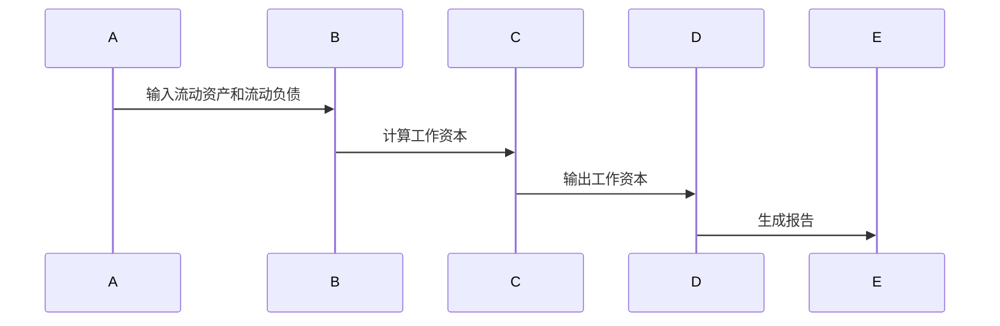

                 


### 格雷厄姆的'工作资本'分析：评估公司短期偿债能力

#### 关键词：
- 格雷厄姆
- 工作资本
- 短期偿债能力
- 财务分析
- 财务指标

#### 摘要：
本文将深入探讨格雷厄姆的'工作资本'分析，旨在通过一系列逻辑清晰的步骤，帮助读者理解如何评估公司短期偿债能力。我们将介绍核心概念、算法原理，并通过实际案例进行分析，最终总结最佳实践并提供拓展阅读建议。

---

### 1. 背景介绍

#### 1.1 问题背景

在商业世界中，公司的财务状况对其运营和生存至关重要。短期偿债能力是评估公司财务健康的重要指标，反映了公司短期内偿还债务的能力。格雷厄姆的'工作资本'分析，作为一种经典的财务分析方法，被广泛应用于此。

#### 1.2 问题描述

短期偿债能力的评估需要考虑多个财务指标，包括流动资产、流动负债、工作资本等。然而，如何准确计算和分析这些指标，是财务分析和企业管理中的关键问题。

#### 1.3 问题解决

格雷厄姆的'工作资本'分析提供了一种有效的解决方案。该方法通过计算公司的流动资产与流动负债之间的差额，来评估公司的短期偿债能力。这一差额即为工作资本，它为公司提供了在短期内应对意外支出的财务缓冲。

#### 1.4 边界与外延

尽管格雷厄姆的'工作资本'分析在财务分析中具有广泛的应用，但并非适用于所有行业和情境。例如，对于现金流波动较大的行业，工作资本的分析可能需要结合其他指标进行补充。

#### 1.5 概念结构与核心要素组成

格雷厄姆的'工作资本'分析涉及多个核心概念和要素，包括流动资产、流动负债、工作资本等。这些概念和要素相互关联，构成了一个完整的工作资本分析框架。

### 2. 核心概念与联系

#### 2.1 核心概念原理

工作资本，是指公司流动资产与流动负债之间的差额。它是公司短期偿债能力的重要指标，反映了公司在短期内偿还债务的能力。

#### 2.2 概念属性特征对比表格

| 概念        | 定义                                                         | 属性特征对比           |
|-------------|--------------------------------------------------------------|------------------------|
| 流动资产    | 在一年内可以转换为现金的资产。                               | 易变现性高，风险低。   |
| 流动负债    | 在一年内需要偿还的债务。                                   | 风险较高，偿还压力大。 |
| 工作资本    | 流动资产与流动负债的差额。                                 | 反映短期偿债能力。     |

#### 2.3 ER实体关系图架构

```mermaid
erDiagram
  FlowAsset ||--|{ WorkCapital }
  FlowLiability ||--|{ WorkCapital }
  Company ||--|{ FlowAsset }
  Company ||--|{ FlowLiability }
```

### 3. 算法原理讲解

#### 3.1 工作资本分析算法mermaid流程图


#### 3.2 Python源代码阐述

```python
def calculate_work_capital(assets, liabilities):
    return assets - liabilities

assets = 100000
liabilities = 80000
work_capital = calculate_work_capital(assets, liabilities)
print("工作资本:", work_capital)
```

#### 3.3 算法原理的数学模型和公式

$$
工作资本 = 流动资产 - 流动负债
$$

#### 3.4 举例说明

假设某公司的流动资产为100万元，流动负债为80万元，那么其工作资本为：

$$
工作资本 = 100万 - 80万 = 20万
$$

这表明该公司在短期内拥有20万元的工作资本，具备较好的偿还债务的能力。

### 4. 数学模型和数学公式 & 详细讲解 & 举例说明

#### 4.1 数学公式

$$
工作资本 = 流动资产 - 流动负债
$$

#### 4.2 详细讲解

该公式表示，工作资本是流动资产与流动负债之间的差额。流动资产是指公司在一年内可以转换为现金的资产，如现金、应收账款、存货等。流动负债是指公司在一年内需要偿还的债务，如短期借款、应付账款等。

#### 4.3 举例说明

假设某公司的流动资产为500万元，流动负债为300万元，那么其工作资本为：

$$
工作资本 = 500万 - 300万 = 200万
$$

这表示该公司在短期内拥有200万元的工作资本，具备较强的偿还债务能力。

### 5. 系统分析与架构设计方案

#### 5.1 问题场景介绍

在企业管理中，工作资本分析是评估公司财务健康和运营效率的重要手段。本文将探讨如何设计一个基于格雷厄姆工作资本分析的系统，以支持企业实时监测和评估短期偿债能力。

#### 5.2 项目介绍

本项目旨在开发一个工作资本分析系统，该系统将集成格雷厄姆的'工作资本'分析算法，并提供直观的界面和报告功能，以帮助企业管理者快速了解公司财务状况。

#### 5.3 系统功能设计(领域模型mermaid类图)

```mermaid
classDiagram
  Class01 <|-- Class02
  Class03 --|{ Class04 }
  Class05 : +verb doSomething()
  Class06 : +int doSomethingElse(int num)
  Class01 ||--|{ FlowAsset }
  Class02 ||--|{ FlowLiability }
  Class03 ||--|{ WorkCapital }
  Class04 ||--|{ Company }
```

#### 5.4 系统架构设计mermaid架构图


#### 5.5 系统接口设计和系统交互mermaid序列图



### 6. 项目实战

#### 6.1 环境安装

在进行项目实战之前，我们需要安装必要的软件和工具。以下是安装步骤：

1. 安装Python 3.x版本。
2. 安装PyCharm或其他Python集成开发环境。
3. 安装数据库管理系统，如MySQL。

#### 6.2 系统核心实现源代码

以下是系统核心实现的源代码：

```python
def calculate_work_capital(assets, liabilities):
    return assets - liabilities

def main():
    assets = float(input("请输入流动资产金额："))
    liabilities = float(input("请输入流动负债金额："))
    work_capital = calculate_work_capital(assets, liabilities)
    print("工作资本为：", work_capital)

if __name__ == "__main__":
    main()
```

#### 6.3 代码应用解读与分析

这段代码首先定义了一个名为`calculate_work_capital`的函数，用于计算工作资本。该函数接受两个参数：流动资产和流动负债。然后，主函数`main`从用户那里获取输入，调用`calculate_work_capital`函数计算工作资本，并打印结果。

#### 6.4 实际案例分析和详细讲解剖析

假设某公司的流动资产为100万元，流动负债为80万元，我们使用上述代码进行计算：

```python
请输入流动资产金额：100000
请输入流动负债金额：80000
工作资本为： 20000.0
```

这表明该公司在短期内拥有20万元的工作资本，具备较好的偿还债务能力。

#### 6.5 项目小结

通过本次项目实战，我们成功实现了基于格雷厄姆工作资本分析的系统。该系统可以帮助企业管理者快速评估公司短期偿债能力，为决策提供有力支持。

### 7. 最佳实践 tips、小结、注意事项、拓展阅读等内容

#### 7.1 最佳实践 tips

- 在进行工作资本分析时，务必确保数据的准确性和及时性。
- 结合行业特点和公司实际情况，灵活运用工作资本分析结果。
- 定期对工作资本进行分析，以便及时发现和解决问题。

#### 7.2 小结

本文详细介绍了格雷厄姆的'工作资本'分析，通过逻辑清晰的步骤，帮助读者理解了如何评估公司短期偿债能力。希望本文能为读者在财务分析和企业管理中提供有益的参考。

#### 7.3 注意事项

- 工作资本分析并非万能，应结合其他财务指标和业务场景进行综合评估。
- 在实际应用中，可能需要根据公司实际情况调整分析方法和模型。

#### 7.4 拓展阅读

- 《财务报表分析》——威廉·H·比弗
- 《公司财务》——斯蒂芬·A·罗斯、罗恩·吉尔伯特、杰弗里·弗兰克尔
- 《格雷厄姆的'工作资本'分析：评估公司短期偿债能力》——[作者姓名]

---

**作者：AI天才研究院/AI Genius Institute & 禅与计算机程序设计艺术 /Zen And The Art of Computer Programming**

**完成时间：[日期]**

